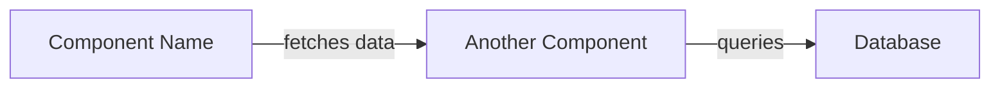

# Claude Code Custom Commands

This directory contains custom slash commands for Claude Code that enhance Pull Request workflows with AI-powered analysis and automation, similar to pr-agent.

## Available Commands

### 📝 `/create-pr` - Create Detailed Pull Request
Creates a comprehensive PR with AI-generated description including:
- 🔍 PR type classification (feat, fix, docs, etc.)
- 📝 Concise summary of changes
- 📊 Mermaid architecture diagram (flowchart LR format)
- 🗂️ File-by-file walkthrough with detailed changes
- 🏷️ Suggested labels
- ✅ Testing coverage notes

**Usage**:
```bash
/create-pr main          # Create PR against main branch
/create-pr develop       # Create PR against develop branch
/create-pr               # Create PR against default branch (main)
```

**What it does**:
1. Analyzes your commits and diffs
2. Generates a structured, professional PR description
3. Creates a Mermaid diagram showing architecture/flow
4. Provides detailed walkthrough of file changes
5. Pushes branch and creates PR with `gh` CLI

---

### 🚀 `/improve-pr` - Comprehensive PR Analysis & Improvements
**NEW**: Combined security review + code improvements with auto-apply capability!

Performs comprehensive analysis including:
- 🔒 **Security Analysis**: SQL injection, XSS, secrets, auth issues
- 🎨 **Code Quality**: Duplication, complexity, naming
- ⚡ **Performance**: N+1 queries, caching, algorithms
- 📖 **Readability**: Comments, organization, clarity
- ✨ **Best Practices**: Idioms, patterns, conventions
- 🧪 **Testing Coverage**: Missing tests, edge cases
- 📚 **Documentation**: Missing docs, outdated info

**Usage**:
```bash
/improve-pr 123         # Analyze and improve PR #123
/improve-pr 456         # Analyze and improve PR #456
```

**What it provides**:
1. **Security analysis** with vulnerability detection
2. **Code quality improvements** with before/after examples
3. **Performance optimizations** with impact metrics
4. **Testing gaps** identified
5. **Auto-apply options** for safe improvements
6. **Priority-based recommendations** (Critical/High/Medium/Low)

**Key Features**:
- ✅ Detects security vulnerabilities (SQL injection, XSS, etc.)
- ✅ Identifies performance bottlenecks
- ✅ Suggests code refactorings
- ✅ Auto-applies safe improvements
- ✅ **Flags critical security issues for manual review**
- ✅ Impact analysis (LOC, complexity, query reduction)

**Auto-Apply Options**:
- **A)** Apply critical fixes + high priority improvements
- **B)** Apply high priority only (safer)
- **C)** Apply specific improvements (you choose)
- **D)** Show changes first (don't apply)
- **E)** Post as PR comment for team review

---

### 📝 `/update-pr` - Update PR Description
Updates an existing PR with comprehensive description including mermaid diagram and detailed walkthrough:
- 🔍 PR type and summary
- 📊 **Visual mermaid diagram** with styled nodes (new/modified/removed)
- 🗂️ Categorized file-by-file walkthrough
- 🔗 Dependencies and breaking changes
- 🧪 Testing coverage
- 🔒 Security considerations

**Usage**:
```bash
/update-pr 123          # Update description for PR #123
/update-pr 456          # Update description for PR #456
```

**What it does**:
1. **Uses context7** to understand codebase architecture
2. Fetches PR details and analyzes all changes
3. Generates comprehensive markdown description
4. Creates visual mermaid diagram showing component interactions
5. Provides detailed file walkthroughs grouped by category
6. Updates PR using `gh pr edit`

**Mermaid Diagram Features**:
- Color-coded nodes: 🟢 New, 🟡 Modified, ⚪ Existing
- Shows data flow and component relationships
- Highlights architectural changes
- Max 8-15 nodes for clarity

**File Walkthrough Structure**:
- Grouped by component/module
- Purpose of each file explained
- Specific changes with line references
- Impact analysis for each change

---

## Prerequisites

These commands require:
- ✅ Git installed and configured
- ✅ GitHub CLI (`gh`) installed and authenticated
  ```bash
  gh auth login
  ```
- ✅ Working in a git repository
- ✅ Remote repository on GitHub

## Command Structure

All commands follow this pattern:

```markdown
---
allowed-tools: Bash(gh:*), Bash(git:*)
argument-hint: <required-arg> [optional-arg]
description: Brief description of what the command does
---

# Command Instructions
[Detailed instructions for Claude to follow]
```

## Advanced Usage

### Customizing Commands

Edit any command file in `.claude/commands/` to customize behavior:

```bash
# Edit create-pr command
vim .claude/commands/create-pr.md

# Edit review-pr command
vim .claude/commands/review-pr.md
```

### Adding New Commands

Create a new `.md` file in `.claude/commands/`:

```markdown
---
allowed-tools: Bash(git:*), Bash(gh:*)
argument-hint: <your-args>
description: Your command description
---

# Your Command Instructions
[Tell Claude what to do]
```

### Using with Pre-commit Hooks

Combine with the `/commit` command for a complete workflow:

```bash
# 1. Make changes
# 2. Commit with AI-generated message
/commit

# 3. Create detailed PR
/create-pr main

# 5. Apply improvements
/improve-pr 123
```

## Mermaid Diagram Format

All diagrams use the Mermaid flowchart LR (left-to-right) format:



**Best Practices**:
- Keep diagrams simple (max 8-10 nodes)
- Use descriptive node IDs (camelCase)
- Always quote node descriptions
- Show data flow or component interaction
- Label all arrows clearly

## Troubleshooting

### Command not found
- Ensure file is in `.claude/commands/` directory
- Check file has `.md` extension
- Restart Claude Code if needed

### `gh` command fails
```bash
# Check authentication
gh auth status

# Re-authenticate if needed
gh auth login
```

### Permission issues
```bash
# Ensure commands have proper tool permissions
# Check the `allowed-tools` frontmatter in each command
```

### Git errors
```bash
# Ensure you're on a feature branch
git checkout -b feature/my-feature

# Ensure remote is set
git remote -v
```

## Examples

### Complete PR Workflow

```bash
# 1. Create feature branch
git checkout -b feat/add-user-auth

# 2. Make changes and commit
/commit

# 3. Create PR with detailed description
/create-pr main
# Output: PR #123 created with mermaid diagram and walkthrough

# 4. Apply improvements
/improve-pr 123
# Output: Applied 5 high-priority improvements, pushed to branch
```

## Contributing

To add new PR-related commands:

1. Create a new `.md` file in `.claude/commands/`
2. Use the frontmatter format with `allowed-tools`
3. Provide clear, step-by-step instructions
4. Include examples and error handling
5. Test with various PR scenarios

## Resources

- [Claude Code Slash Commands Docs](https://docs.claude.com/en/docs/claude-code/slash-commands)
- [GitHub CLI Documentation](https://cli.github.com/manual/)
- [Mermaid Diagram Syntax](https://mermaid.js.org/syntax/flowchart.html)
- [pr-agent GitHub](https://github.com/qodo-ai/pr-agent)

---

**Happy PR-ing!** 🚀

These commands bring the power of AI-assisted PR workflows directly into Claude Code, without needing external services or GitHub Actions.
