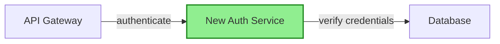
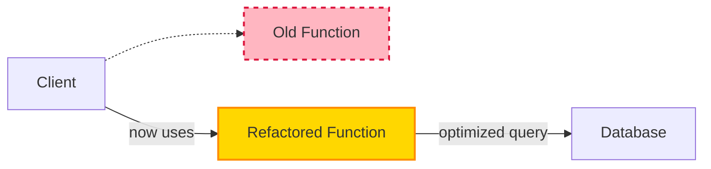
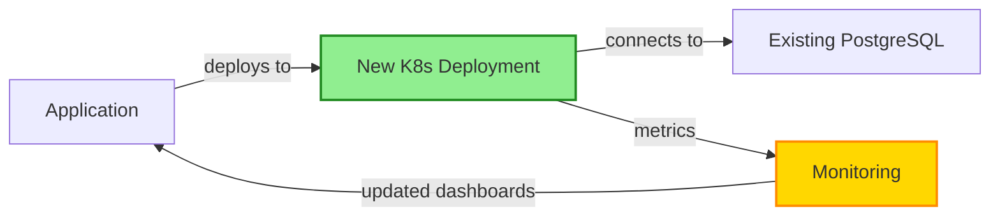
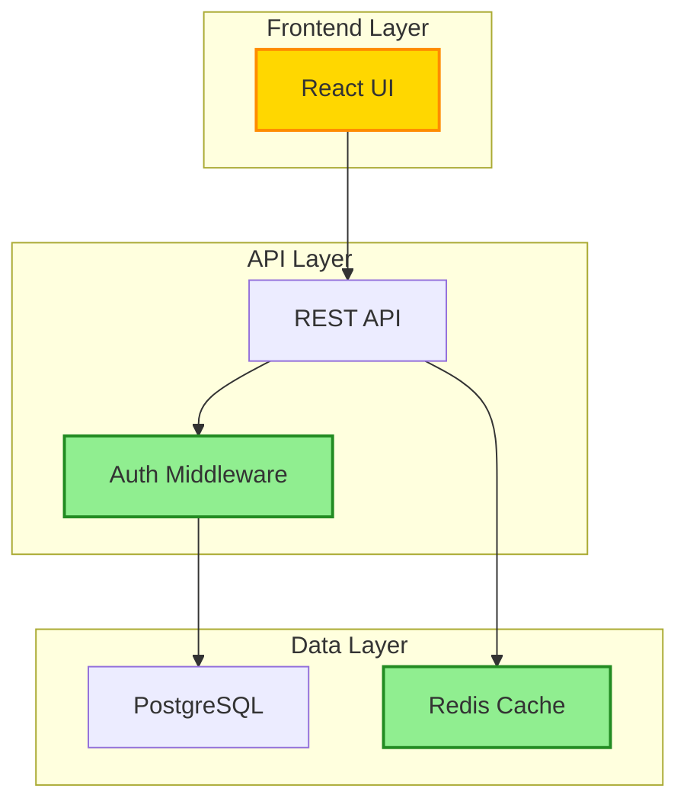
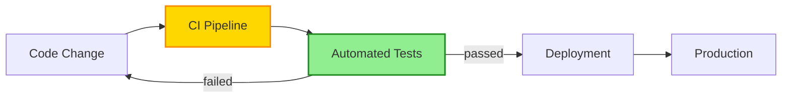

# Claude Code Command: Update Pull Request Description

This command updates an existing Pull Request with a comprehensive, well-structured description including mermaid diagrams and detailed walkthroughs, similar to pr-agent's `/describe` command.

## Instructions

**IMPORTANT**: Use context7 to understand the codebase architecture, components, and patterns before generating the description. This ensures accurate mermaid diagrams and contextual explanations.

You MUST follow these steps in order:

### 1. Fetch PR Information

```bash
# Get PR details including current description
gh pr view $ARGUMENTS --json number,title,body,headRefName,baseRefName,files,additions,deletions,commits,labels

# Get the full diff
gh pr diff $ARGUMENTS

# Get commit messages
gh pr view $ARGUMENTS --json commits --jq '.commits[].commit.message'
```

### 2. Analyze Changes with Context7

Before generating the description:
1. **Search for affected components** using context7 to understand their purpose
2. **Identify architectural patterns** used in the changes
3. **Find related documentation** to ensure accuracy
4. **Understand dependencies** between components

### 3. Generate Enhanced PR Description

Create a comprehensive PR description with the following structure:

```markdown
## 🔍 PR Type: [type]

**Type**: `feat` | `fix` | `docs` | `refactor` | `perf` | `test` | `chore` | `ci` | `security`

## 📝 Summary

[2-3 sentence concise summary explaining WHAT this PR does and WHY it's needed]

## 🎯 Changes Overview

- **Main change 1**: Brief description
- **Main change 2**: Brief description
- **Main change 3**: Brief description
- **Main change 4**: Brief description
- **Main change 5**: Brief description

## 📊 Architecture Diagram

```mermaid
flowchart LR
    [Create a detailed horizontal flowchart showing:

    1. Existing components (regular nodes)
    2. New components (highlighted/styled nodes)
    3. Modified components (annotated nodes)
    4. Data flow between components
    5. External dependencies

    Format:
    existingComp["Existing Component"]
    newComp["New Component"]:::new
    modifiedComp["Modified Component"]:::modified

    existingComp -- "action/relationship" --> newComp
    newComp -- "data flow" --> modifiedComp

    classDef new fill:#90EE90,stroke:#228B22,stroke-width:2px
    classDef modified fill:#FFD700,stroke:#FF8C00,stroke-width:2px
    ]
```

**Diagram Legend**:
- 🟢 Green nodes: New components/resources
- 🟡 Yellow nodes: Modified components
- ⚪ White nodes: Existing components (unchanged)

## 🗂️ File Changes Walkthrough

| File | Change Type | Lines | Description |
|------|-------------|-------|-------------|
| `path/to/file1` | Added | +50 | Brief description of what was added |
| `path/to/file2` | Modified | +30/-20 | Brief description of modifications |
| `path/to/file3` | Deleted | -40 | Brief description of why removed |

<details>
<summary><b>📄 Detailed File-by-File Changes</b></summary>

### 📁 Category 1: [Component/Module Name]

#### `path/to/file1.ext`
**Purpose**: [What this file does in the system]

**Changes**:
- ✨ Added: [Specific addition with line reference]
- 🔧 Modified: [Specific modification with line reference]
- 🔥 Removed: [Specific removal with reason]

**Impact**: [How this affects the system]

---

#### `path/to/file2.ext`
**Purpose**: [What this file does in the system]

**Changes**:
- ✨ Added: [Specific addition]
- 🔧 Modified: [Specific modification]

**Impact**: [How this affects the system]

---

### 📁 Category 2: [Another Component/Module]

#### `path/to/file3.ext`
[Same structure as above]

</details>

## 🔗 Dependencies

**New Dependencies**:
- `package@version` - Purpose/reason

**Updated Dependencies**:
- `package` from `v1.0.0` to `v2.0.0` - Reason for update

**Removed Dependencies**:
- `old-package` - Reason for removal

## 🧪 Testing

**Test Coverage**:
- ✅ Unit tests: [What's covered]
- ✅ Integration tests: [What's covered]
- ✅ E2E tests: [What's covered]
- ⚠️ Manual testing required: [What needs manual verification]

**Test Commands**:
```bash
# Command to run tests
npm test
# Or
pytest tests/
```

## 🔒 Security Considerations

[If applicable, list security implications, new permissions, exposed endpoints, etc.]

## 💥 Breaking Changes

[If applicable, list breaking changes with migration guide]

**Migration Steps**:
1. [Step 1]
2. [Step 2]
3. [Step 3]

## 📚 Documentation

**Updated Documentation**:
- [ ] README.md
- [ ] API docs
- [ ] Architecture decision records (ADRs)
- [ ] Inline code comments

**Documentation Links**:
- [Related docs link 1]
- [Related docs link 2]

## 🏷️ Suggested Labels

`enhancement`, `infrastructure`, `needs-review`, `documentation`

## 📋 Checklist

- [ ] Code follows project style guidelines
- [ ] Self-review completed
- [ ] Comments added for complex logic
- [ ] Documentation updated
- [ ] Tests added/updated
- [ ] All tests passing
- [ ] No new warnings
- [ ] Breaking changes documented

## 🔗 Related Issues

Closes #[issue-number]
Relates to #[issue-number]

---

**Generated with Claude Code** - AI-powered PR analysis
```

### 4. Update the Pull Request

Use `gh pr edit` to update the PR description:

```bash
# Generate the description and save to temp file
cat > /tmp/pr-description.md << 'EOF'
[The full markdown description generated above]
EOF

# Update the PR
gh pr edit $ARGUMENTS --body-file /tmp/pr-description.md

# Clean up
rm /tmp/pr-description.md

# Show the updated PR
gh pr view $ARGUMENTS --web
```

### 5. Confirm Update

Output:
- ✅ PR description updated successfully
- 🔗 PR URL
- 📊 Generated mermaid diagram with [X] nodes
- 📝 Detailed walkthrough for [Y] files
- 🏷️ Suggested [Z] labels

## Guidelines for Quality

### Mermaid Diagram Best Practices

**Structure**:
- Keep it focused (8-15 nodes maximum)
- Use meaningful node IDs (camelCase, descriptive)
- Always quote node descriptions: `nodeId["Description"]`
- Show clear data/control flow with labeled arrows
- Use styling to highlight changes (new, modified, removed)

**Styling Classes**:
```mermaid
classDef new fill:#90EE90,stroke:#228B22,stroke-width:2px
classDef modified fill:#FFD700,stroke:#FF8C00,stroke-width:2px
classDef removed fill:#FFB6C1,stroke:#DC143C,stroke-width:2px,stroke-dasharray: 5 5
```

**Example Patterns**:

For **new features**:


For **refactoring**:


For **infrastructure**:


### File Walkthrough Best Practices

**Categorization**:
- Group related files by component/module
- Use clear category headers
- Explain the purpose of each file
- Include line number references for significant changes

**Change Descriptions**:
- Be specific (not "updated function" but "optimized database query reducing calls from N to 1")
- Explain WHY, not just WHAT
- Highlight impact on the system
- Note any breaking changes prominently

**Examples**:

Good ✅:
```markdown
#### `src/auth/middleware.ts`
**Purpose**: Express middleware for JWT authentication

**Changes**:
- ✨ Added: Token refresh mechanism (lines 45-67) to handle expired tokens gracefully
- 🔧 Modified: Error handling (lines 30-40) to return 401 instead of 500 for invalid tokens
- 🔥 Removed: Deprecated session-based auth code (lines 80-120)

**Impact**: Improves security by preventing token expiration errors and properly handling authentication failures
```

Bad ❌:
```markdown
#### `src/auth/middleware.ts`
- Updated authentication
- Fixed errors
- Removed old code
```

## Context7 Usage Examples

Before generating descriptions, use context7 to:

**1. Understand Component Purpose**:
```
Search for: "class MyComponent" or "function myFunction"
Goal: Understand what the component does and its role in the system
```

**2. Find Related Code**:
```
Search for: imports, references, dependencies of modified files
Goal: Understand how changes affect other parts of the system
```

**3. Identify Patterns**:
```
Search for: similar implementations, naming conventions, architectural patterns
Goal: Ensure descriptions use consistent terminology
```

**4. Locate Documentation**:
```
Search for: README files, ADRs, inline comments in related files
Goal: Reference existing documentation and maintain consistency
```

## Error Handling

**PR not found**:
- Verify PR number is correct
- Check you have access to the repository

**gh CLI not authenticated**:
```bash
gh auth login
```

**Large PR with too many files**:
- Focus on the most impactful changes
- Group similar files together
- Summarize minor changes

**Mermaid diagram too complex**:
- Break into multiple diagrams (one per major component)
- Focus on high-level architecture, not every detail
- Use subgraphs for grouping related components

## Example Usage

```bash
# Update PR description for PR #123
/update-pr 123

# Update PR with detailed analysis
/update-pr 456
```

## Advanced Mermaid Examples

### Multi-layer Architecture



### Deployment Flow



---

**Remember**:
- Use context7 FIRST to understand the codebase
- Create visual, informative mermaid diagrams
- Provide detailed, categorized file walkthroughs
- Focus on helping reviewers understand the changes quickly
- Highlight breaking changes and security implications
