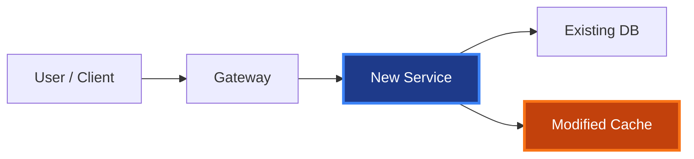

# Mermaid Diagram Styling for PR Descriptions

Consistent visual language across every PR that includes a flow diagram.

## Node color classes

| Class      | Hex fill   | Hex stroke | Purpose                          |
|------------|-----------|-----------|----------------------------------|
| `new`      | `#1e3a8a` | `#3b82f6` | Newly introduced components      |
| `modified` | `#c2410c` | `#f97316` | Existing component that changed  |
| `removed`  | `#991b1b` | `#dc2626` | Deprecated / deleted             |

Always `stroke-width:3px,color:#fff`. Removed nodes also get `stroke-dasharray:5 5`.

## Standard footer

```mermaid
classDef new fill:#1e3a8a,stroke:#3b82f6,stroke-width:3px,color:#fff
classDef modified fill:#c2410c,stroke:#f97316,stroke-width:3px,color:#fff
classDef removed fill:#991b1b,stroke:#dc2626,stroke-width:3px,color:#fff,stroke-dasharray:5 5
```

## Template



## Best practices

- Max 8–10 nodes.
- Prefer `flowchart LR` (left-to-right reads like a sentence); use `TB` only if the data truly branches vertically.
- Node IDs: `camelCase`, descriptive.
- Node labels: quoted, sentence case.
- Label every arrow when the edge semantics matter (`--> |writes|`).
- Show data flow or component interaction — not a directory tree.
