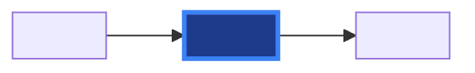

# PR Body Template

Use this as the skeleton for both Create Mode and Update Mode. Fill every bracketed placeholder; drop sections that genuinely do not apply (never leave empty `## Heading` stubs).

```markdown
## 🔍 [type]

<!-- feat | fix | docs | refactor | perf | test | chore | ci | security -->

## 📝 Summary

<1–2 sentence summary focused on the WHY, not a file list>

## 📋 Specification

<!-- When a spec is detected, link it: -->
Implements [#<issue-num>](../issues/<issue-num>) — see [`<spec-dir>/spec.md`](../blob/main/<spec-dir>/spec.md).

**Spec status**: <draft | in-review | approved | implementing>

<!-- When no spec but one is recommended, replace the above block with the warning snippet below. -->

## 🎯 Changes

- <concise bullet, ≤10 words>
- <concise bullet, ≤10 words>
- <concise bullet, ≤10 words>

## 📊 Flow

<!-- Use the mermaid styling from references/mermaid-styles.md -->



## 🗂️ Files

| File | Type | Summary |
|------|------|---------|
| <path> | <new\|modified\|removed> | <1-line summary> |

<!-- Max 10 rows. Group similar files. -->

<details><summary>Detailed changes</summary>

### <file>
- <bulleted detail>

</details>

## 🏷️ Labels

<suggested labels, e.g. composition, security, infrastructure>
```

## Spec-recommendation warning

Use this when the diff looks spec-worthy but no spec exists:

```markdown
## ⚠️ Spec Recommendation

This PR contains changes that may benefit from a formal specification:
- **Detected type**: <composition | infrastructure | security | platform>
- **Affected paths**: <key paths>

Consider running `/spec <type> "<short description>"` before implementation
to ensure thorough planning and 4-persona review.
```

## Content rules

- **Title**: under 70 characters. Type prefix (e.g., `feat(crossplane): add QueueInstance composition`).
- **Summary**: WHY over WHAT. The file table already shows WHAT.
- **Mermaid**: 5–8 nodes max. Label every arrow. Use LR unless the content demands TB.
- **File table**: max 10 rows; group identical kinds.
- **Labels**: match existing repo labels; do not invent new ones.
