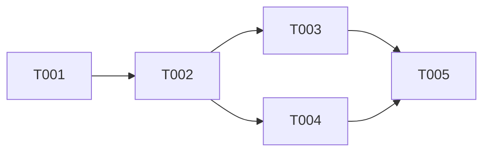

# Tasks Skill

Generate a structured task breakdown from a specification file. Tasks are organized by phase with dependency tracking and parallel execution opportunities marked.

## Usage

```
/tasks [spec-file] [--issues]
```

- If no file specified, uses the most recently modified spec in `docs/specs/active/`
- `--issues` flag creates GitHub issues for each task

## When to Use

Run `/tasks` after completing a spec with `/specify` and `/clarify` to:
- Break down the implementation into actionable tasks
- Identify dependencies between tasks
- Mark opportunities for parallel execution
- Optionally create GitHub issues for each task

## Prerequisites

Before running `/tasks`, ensure:
- [ ] Spec exists in `docs/specs/active/`
- [ ] No `[NEEDS CLARIFICATION]` markers remain (run `/clarify` first)
- [ ] User Stories and Rollout Plan sections are complete

## Workflow

### Step 1: Find and Validate Spec

```bash
SPEC_FILE=$(ls -t docs/specs/active/*.md 2>/dev/null | head -1)

# Validate no unresolved clarifications
if grep -q '\[NEEDS CLARIFICATION:' "$SPEC_FILE"; then
    echo "ERROR: Spec has unresolved clarifications. Run /clarify first."
    exit 1
fi
```

### Step 2: Extract Key Sections

Parse the spec to extract:
1. **User Stories** - Each becomes a task group
2. **Rollout Plan** - Each phase maps to task phases
3. **Dependencies** - From the Dependencies section
4. **Success Criteria** - For validation tasks

### Step 3: Generate Task Structure

```markdown
# Task Breakdown: [Spec Title]

**Spec**: [docs/specs/active/XXXX-#XXX-slug.md](link)
**Generated**: YYYY-MM-DD

---

## Phase 1: Setup (X tasks)

| ID | Task | Story | Dependencies | Parallel |
|----|------|-------|--------------|----------|
| T001 | Initialize project structure | - | - | - |
| T002 | Add required dependencies | - | T001 | - |

## Phase 2: Core Implementation (X tasks)

| ID | Task | Story | Dependencies | Parallel |
|----|------|-------|--------------|----------|
| T003 | Implement feature A | US1 | T002 | [P] |
| T004 | Implement feature B | US1 | T002 | [P] |
| T005 | Integrate A and B | US1 | T003, T004 | - |

## Phase 3: Validation (X tasks)

| ID | Task | Story | Dependencies | Parallel |
|----|------|-------|--------------|----------|
| T010 | Run validation script | - | T009 | - |
| T011 | Update documentation | - | T010 | - |

---

## Dependency Graph



## Summary

- **Total tasks**: XX
- **Setup**: X tasks
- **Implementation**: X tasks
- **Validation**: X tasks
- **Parallel opportunities**: X tasks
```

### Step 4: Output Options

**Option A: Markdown File (Default)**

Write to `docs/specs/active/XXXX-#XXX-slug-tasks.md` alongside the spec.

**Option B: GitHub Issues (`--issues` flag)**

Create GitHub issues for each task:

```bash
for task in tasks; do
    gh issue create \
        --title "[TASK] T${ID}: ${TASK_TITLE}" \
        --label "task,spec-${SPEC_NUM}" \
        --body "## Task from Spec

**Spec**: ${SPEC_FILE}
**Story**: ${USER_STORY}
**Dependencies**: ${DEPS}

## Description
${TASK_DESCRIPTION}

## Acceptance Criteria
- [ ] ${CRITERIA_1}
- [ ] ${CRITERIA_2}
"
done
```

### Step 5: Output Summary

```
✅ Tasks generated!

📄 Spec File: docs/specs/active/0001-#123-valkey-caching.md
📋 Tasks File: docs/specs/active/0001-#123-valkey-caching-tasks.md
📊 Total Tasks: 15

## Phase Summary:
- Phase 1 (Setup): 3 tasks
- Phase 2 (Core): 8 tasks
- Phase 3 (Validation): 4 tasks

## Parallel Opportunities:
- T003 and T004 can run in parallel
- T007 and T008 can run in parallel

## Next Steps:
1. Review the task breakdown
2. Assign tasks to team members (if applicable)
3. Begin implementation with Phase 1
```

## Task Markers

| Marker | Meaning |
|--------|---------|
| `[P]` | Can be executed in parallel with adjacent [P] tasks |
| `[Story: US1]` | Links back to User Story 1 in the spec |
| `[Critical]` | On the critical path, blocks other tasks |
| `[Optional]` | Nice-to-have, can be deferred |

## Example

Given a spec with:

```markdown
### User Stories

#### User Story 1 - Create Cache Instance (Priority: P1)
...

#### User Story 2 - Configure Eviction Policy (Priority: P2)
...

### Rollout Plan

#### Phase 1: Infrastructure Prerequisites
1. Add IAM policy for Crossplane
2. Install required AWS provider

#### Phase 2: Composition Deployment
3. Merge composition to main
4. Flux deploys to cluster

#### Phase 3: Validation
5. Test basic example
6. Test complete example
```

The `/tasks` skill generates:

```markdown
## Phase 1: Infrastructure Prerequisites (2 tasks)

| ID | Task | Story | Dependencies | Parallel |
|----|------|-------|--------------|----------|
| T001 | Add IAM policy for Crossplane | - | - | - |
| T002 | Install required AWS provider | - | T001 | - |

## Phase 2: Composition Deployment (2 tasks)

| ID | Task | Story | Dependencies | Parallel |
|----|------|-------|--------------|----------|
| T003 | Merge composition to main | US1 | T002 | - |
| T004 | Verify Flux deployment | US1 | T003 | - |

## Phase 3: Validation (2 tasks)

| ID | Task | Story | Dependencies | Parallel |
|----|------|-------|--------------|----------|
| T005 | Test basic example | US1 | T004 | [P] |
| T006 | Test complete example | US2 | T004 | [P] |
```

## Integration with Other Skills

- `/specify` → Creates spec with Rollout Plan section
- `/clarify` → Ensures no unresolved markers before task generation
- `/tasks` → Generates task breakdown (this skill)
- `/create-pr` → References tasks in PR description

## Error Handling

- **No spec found**: Prompt to run `/specify` first
- **Unresolved markers**: Require `/clarify` before proceeding
- **Missing Rollout Plan**: Warn and generate minimal task structure
- **GitHub issue creation fails**: Report which tasks failed and continue
