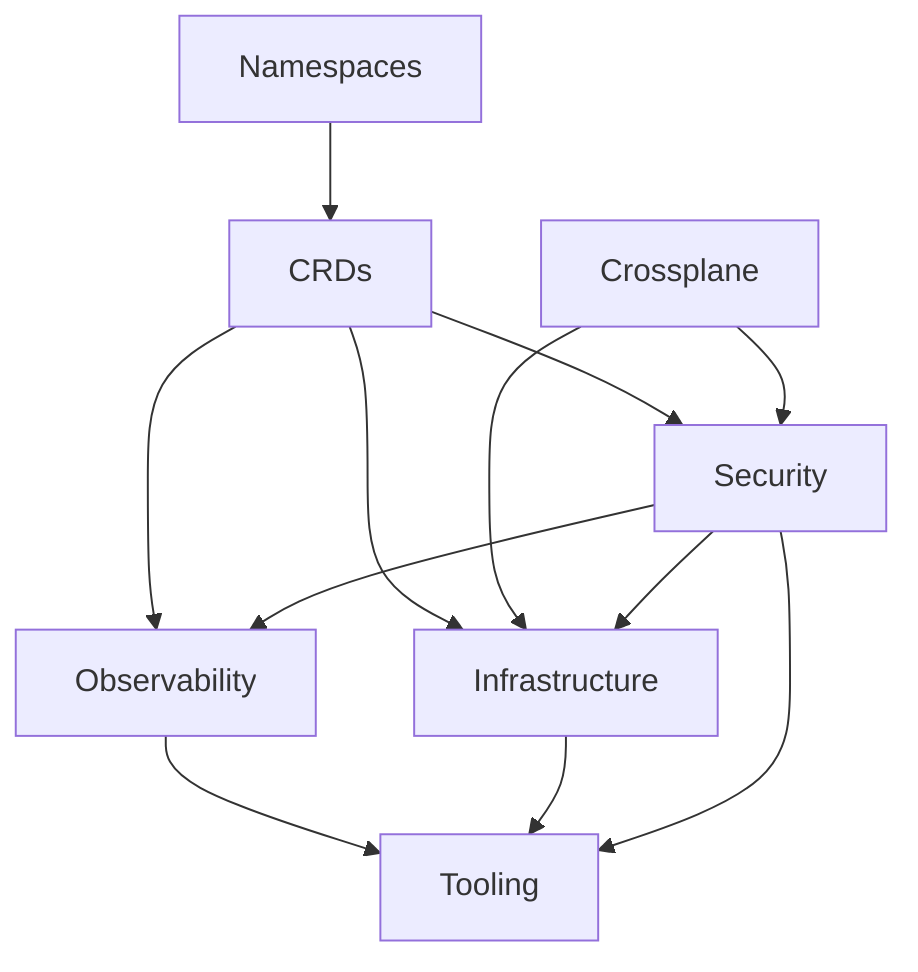

# Demo of a secured EKS cluster

⚠️ Work in progress in order to write new blog posts [here](https://blog.ogenki.io)

Based on [this repository](https://github.com/Smana/cilium-gateway-api)

## 🔄 Dependencies matter



## 🏗️ Crossplane configuration

## 🛂 Federated authentication using Pinniped

## 🗒️ Audit logs with Loki and Vector

## 📦 OCI Registry with Harbor
ℹ️ In progress ...

The Harbor installation follows the best practices for high availability. It leverages recent Crossplane's features such as `Composition functions`

* External RDS database
* Redis cluster using the bitnami Helm chart
* Storing artifacts in S3

## 🔗 VPN connection using Tailscale

The VPN configuration is done within the `terraform/network` directory.
You can follow the steps described in this [README](/terraform/network/README.md) in order to provision a server that allows to access to private resources within AWS.

Most of the time we don't want to expose our resources publicly. For instance our platform tools such as `Grafana`, the `Flux web UI` should be access through a secured wire.
The risk becomes even more significant when dealing with Kubernetes' API. Indeed, one of the primary recommendations for securing a cluster is to limit access to the API.

Anyway, I intentionnaly created a distinct directory that allows to provision the network and a secured connection. So that there are no confusion with the EKS provisionning.

## 👮 Runtime security with Falco

## ✔️ Policies with Kyverno

## :closed_lock_with_key: Secrets management with Vault and external-secrets operator

## 🔑 Private PKI with Vault

## 🌐 Network policies with Cilium

## 🧪 CI

2 things are checked

* The terraform code quality, conformance and security using [pre-commit-terraform](https://github.com/antonbabenko/pre-commit-terraform).
* The kustomize and Kubernetes conformance using kubeconform and building the kustomize configuration.

In order to run the CI checks locally just run the following command

ℹ️ It requires [task](https://taskfile.dev/installation/) to be installed

```console
 task check
```

The same tasks are run in `Github Actions`.