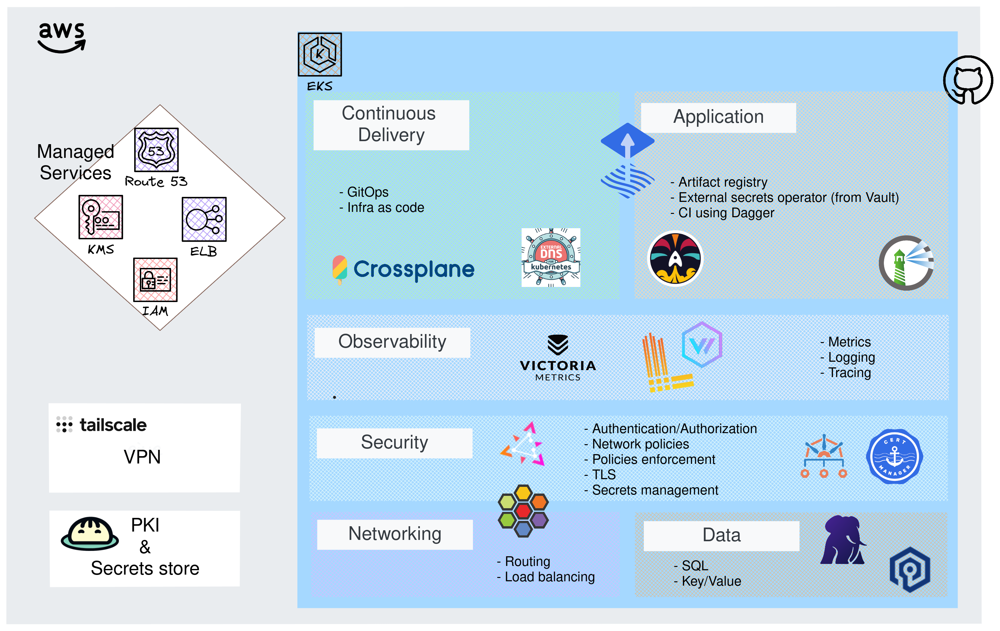
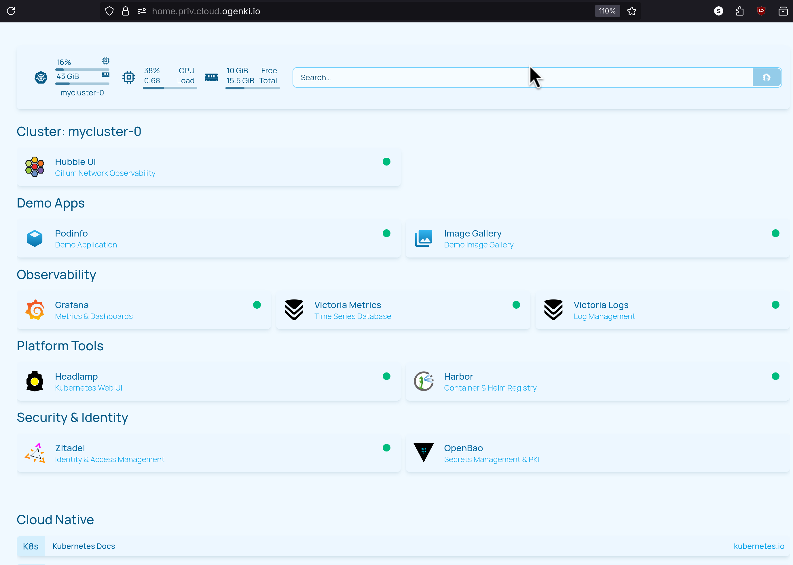

# Cloud Native Platform Reference

**_An opinionated, production-ready Kubernetes platform using GitOps principles._**

This repository demonstrates how to build and operate a secure, scalable cloud-native platform. It showcases modern cloud-native technologies, GitOps workflows, and platform engineering best practices.

## What is This?

This is a **reference implementation** of a complete cloud-native platform that includes:

- 🔧 **Infrastructure as Code**: OpenTofu for AWS resources, Crossplane for application infrastructure
- 🚀 **GitOps**: Flux for continuous delivery and reconciliation
- 🔒 **Security-First**: Private PKI (OpenBao), zero-trust networking (Cilium), secrets management
- 📊 **Observability**: Metrics (VictoriaMetrics), logs (VictoriaLogs), dashboards (Grafana)
- 🎯 **Developer Experience**: Simple abstractions for complex infrastructure (Crossplane compositions)
- 💰 **Cost-Optimized**: SPOT instances, efficient monitoring, right-sized resources

## Architecture Overview



The platform is organized in three layers:

1. **AWS Managed Services** (left): Route53, ELB, KMS, IAM, S3 (Could be any other cloud provider that has these basic managed services)
2. **Platform Services** (center): EKS cluster with Flux, Crossplane, security, networking, observability
3. **Applications** (right): Harbor, Grafana, VictoriaMetrics, demo apps

**Private Access**: Tailscale VPN provides secure access to platform tools.

**Secrets Management**: OpenBao (open-source Vault fork) provides PKI and secret storage.

## Quickstart

Get a complete platform running in **under 30 minutes**.

### Prerequisites

Ensure you have these tools and accounts ready:

- ✅ **AWS Account** with admin permissions
- ✅ **Tools**: [OpenTofu](https://opentofu.org/), [Terramate](https://terramate.io/), kubectl, jq
- ✅ **GitHub Account** for GitOps (personal access token or GitHub App)
- ✅ **Tailscale Account** for VPN access
- ✅ **Domain**: Registered domain for Route53 DNS

**Detailed prerequisites**: [OpenTofu Deployment Guide](docs/opentofu.md#prerequisites)

### Deployment Steps

**1. Configure Global Variables**

Edit `opentofu/config.tm.hcl` with your environment:

```hcl
globals {
  region           = "eu-west-3"          # Your AWS region
  eks_cluster_name = "mycluster-0"        # Your cluster name
  openbao_url      = "https://bao.priv.cloud.example.com:8200"
  # ... other configuration
}
```

**2. Set Secrets**

```bash
export TF_VAR_tailscale_api_key=<YOUR_TAILSCALE_API_KEY>
```

**3. Deploy Everything**

```bash
cd opentofu
terramate script run deploy
```

This deploys in order:
1. **Network**: VPC, subnets, Route53, Tailscale VPN (~5 min)
2. **OpenBao**: 5-node HA cluster for secrets/PKI (~10 min)
3. **EKS**: Kubernetes cluster with Flux (~15 min)

**4. Verify Deployment**

```bash
# Network access
tailscale status

# OpenBao
export VAULT_ADDR=https://bao.priv.cloud.example.com:8200
export VAULT_SKIP_VERIFY=true
bao status

# Kubernetes
aws eks update-kubeconfig --region eu-west-3 --name mycluster-0
kubectl get nodes
flux get all
```

**Flux automatically deploys**: Security (External Secrets, cert-manager), Infrastructure (Cilium, Gateway API), Observability (VictoriaMetrics, Grafana), and Tooling (Harbor, Headlamp, Homepage).

**Full deployment guide**: [OpenTofu Documentation](docs/opentofu.md)

## Platform Dashboard

Once deployed, access the **Homepage dashboard** for a unified view of all platform services:




Homepage provides:
- Quick links to all platform tools (Grafana, Harbor, Headlamp)
- Kubernetes cluster metrics
- Service health status
- Documentation bookmarks

## Core Concepts

### Progressive Complexity

This platform embraces **progressive complexity**: start simple, grow sophisticated without platform migrations.

**Example**: Deploy an application with just a container image:
```yaml
apiVersion: cloud.ogenki.io/v1alpha1
kind: App
metadata:
  name: xplane-myapp
  namespace: apps
spec:
  image:
    repository: ghcr.io/myorg/myapp
    tag: v1.0.0
```

As needs grow, add databases, caching, autoscaling, HA—all through the same interface. No rewriting, no migration.

**Learn more**: [Crossplane App Composition](docs/crossplane.md)

### GitOps Everything

**Git is the source of truth** for infrastructure and applications:

- Commit to Git → Flux detects change → Reconciles to cluster
- No manual `kubectl apply`
- Complete audit trail
- Easy rollback (revert Git commit)

**Learn more**: [GitOps with Flux](docs/gitops.md)

### Security by Design

Security is built-in, not bolted-on:

- 🔐 **Private PKI**: OpenBao three-tier CA for TLS certificates
- 🛡️ **Zero-Trust**: Cilium Network Policies for micro-segmentation
- 🔑 **Secrets Management**: External Secrets syncs from AWS Secrets Manager/OpenBao
- 🚪 **Private Access**: Platform tools only via Tailscale VPN
- 👤 **Identity**: ZITADEL for authentication, EKS Pod Identity for AWS access

**Learn more**: [Ingress and Network Access](docs/ingress.md)

## Documentation

### Getting Started

- 📖 [OpenTofu Deployment](docs/opentofu.md) - Infrastructure deployment guide
- 🔄 [GitOps with Flux](docs/gitops.md) - How continuous delivery works
- 🏗️ [Crossplane](docs/crossplane.md) - Infrastructure compositions

### Platform Services

- 🔐 [Ingress and Network Access](docs/ingress.md) - Gateway API, TLS, Tailscale
- 👁️ [Observability](docs/observability.md) - Metrics, logs, alerting, dashboards

### Development and Operations

- 🧪 [CI/CD Workflows](docs/ci-workflows.md) - GitHub Actions, security scanning, validation
- 🛠️ [Technology Choices](docs/technology-choices.md) - Why we chose each technology

### Deep Dives

- [App Composition Detailed Guide](infrastructure/base/crossplane/configuration/kcl/app/README.md) - Complete reference (507 lines!)
- [OpenBao PKI Setup](opentofu/openbao/management/docs/getting_started.md) - Certificate authority configuration
- [cert-manager Integration](opentofu/openbao/management/docs/cert-manager.md) - Automated TLS certificates

## Real Production Patterns

- ✅ High availability (multi-AZ, HA databases, Raft consensus)
- ✅ Disaster recovery (S3 backups, snapshot automation)
- ✅ Security hardening (private endpoints, least privilege IAM)
- ✅ Cost optimization (SPOT instances, efficient monitoring)
- ✅ Operational excellence (alerting, runbooks, observability)

## Repository Structure

```
.
├── docs/                          # 📚 Documentation (you are here)
├── opentofu/                      # 🔧 Infrastructure as Code
│   ├── network/                   # VPC, Tailscale VPN
│   ├── openbao/                   # Secrets management
│   └── eks/                       # Kubernetes cluster
├── flux/                          # 🚀 Flux operator and configuration
├── clusters/mycluster-0/          # Cluster-specific Kustomizations
├── infrastructure/                # 🏗️ Platform infrastructure
│   └── base/crossplane/           # Crossplane compositions
├── security/                      # 🔒 Security components
├── observability/                 # 👁️ Monitoring and logging
├── tooling/                       # 🛠️ Platform tools
├── crds/                          # Custom Resource Definitions
└── scripts/                       # Automation scripts
```

## Technology Stack

| Technology | Purpose |
|------------|---------|
| **Kubernetes (EKS)** | Container orchestration platform |
| **Crossplane** | Infrastructure composition and abstraction |
| **OpenTofu** | Infrastructure as Code (Terraform alternative) |
| **Terramate** | OpenTofu orchestration and stack management |
| **Flux** | GitOps continuous delivery |
| **Cilium** | eBPF-based networking and security |
| **Gateway API** | Modern ingress and traffic routing |
| **OpenBao** | Secrets management and private PKI |
| **VictoriaMetrics** | High-performance metrics and monitoring |
| **VictoriaLogs** | Log aggregation and search |
| **Grafana** | Dashboards and visualization |
| **CloudNativePG** | PostgreSQL operator with HA |
| **Harbor** | Container and Helm registry |
| **Tailscale** | Zero-config VPN for private access |
| **ZITADEL** | Identity and access management |
| **Karpenter** | Kubernetes node autoscaling |

**Full stack with rationale**: [Technology Choices](docs/technology-choices.md)

## Learning Resources

### Blog Posts

This repository is documented through a series of blog posts:

- [Crossplane: Compositions and Functions](https://blog.ogenki.io/post/crossplane_composition_functions/)
- [TLS with Gateway API and Private PKI](https://blog.ogenki.io/post/pki-gapi/)
- [Tailscale: Simplifying Cloud Access](https://blog.ogenki.io/post/tailscale/)
- [VictoriaMetrics and Grafana Operators](https://blog.ogenki.io/post/series/observability/metrics)
- [Effective Alerting with VictoriaMetrics](https://blog.ogenki.io/post/series/observability/alerts/)
- [Dagger: The Missing Piece of Developer Experience](https://blog.ogenki.io/post/dagger-intro/)

### External Resources

- [Crossplane Documentation](https://docs.crossplane.io/)
- [Flux Documentation](https://fluxcd.io/)
- [Gateway API](https://gateway-api.sigs.k8s.io/)
- [Cilium Documentation](https://docs.cilium.io/)
- [VictoriaMetrics Documentation](https://docs.victoriametrics.com/)

## Contributing and Community

We welcome contributions, feedback, and questions!

- 🗨️ **[Slack Channel](https://ogenki.slack.com/)**: Chat with the community
- 💬 **[Discussions](https://github.com/Smana/cloud-native-ref/discussions)**: Ideas, questions, roadmap
- 🐛 **[Issues](https://github.com/Smana/cloud-native-ref/issues)**: Bug reports and feature requests
- 📅 **[Project Board](https://github.com/users/Smana/projects/1)**: Task tracking and priorities

**Before contributing**: Review [SECURITY.md](SECURITY.md) for security policy and [CLAUDE.md](CLAUDE.md) for development guidelines.

## License

This project is provided as a reference implementation. Please review individual component licenses.

## Acknowledgments

This platform builds on the excellent work of many open-source projects:

- [Crossplane](https://www.crossplane.io/) team and community
- [Flux](https://fluxcd.io/) maintainers and CNCF
- [Cilium](https://cilium.io/) and eBPF ecosystem
- [VictoriaMetrics](https://victoriametrics.com/) developers
- [OpenBao](https://openbao.org/) and Linux Foundation
- All the maintainers of the tools in this stack

---

**Ready to get started?** → [OpenTofu Deployment Guide](docs/opentofu.md)

**Questions?** → [Join our Slack](https://ogenki.slack.com/)

**Exploring?** → [Technology Choices](docs/technology-choices.md)
