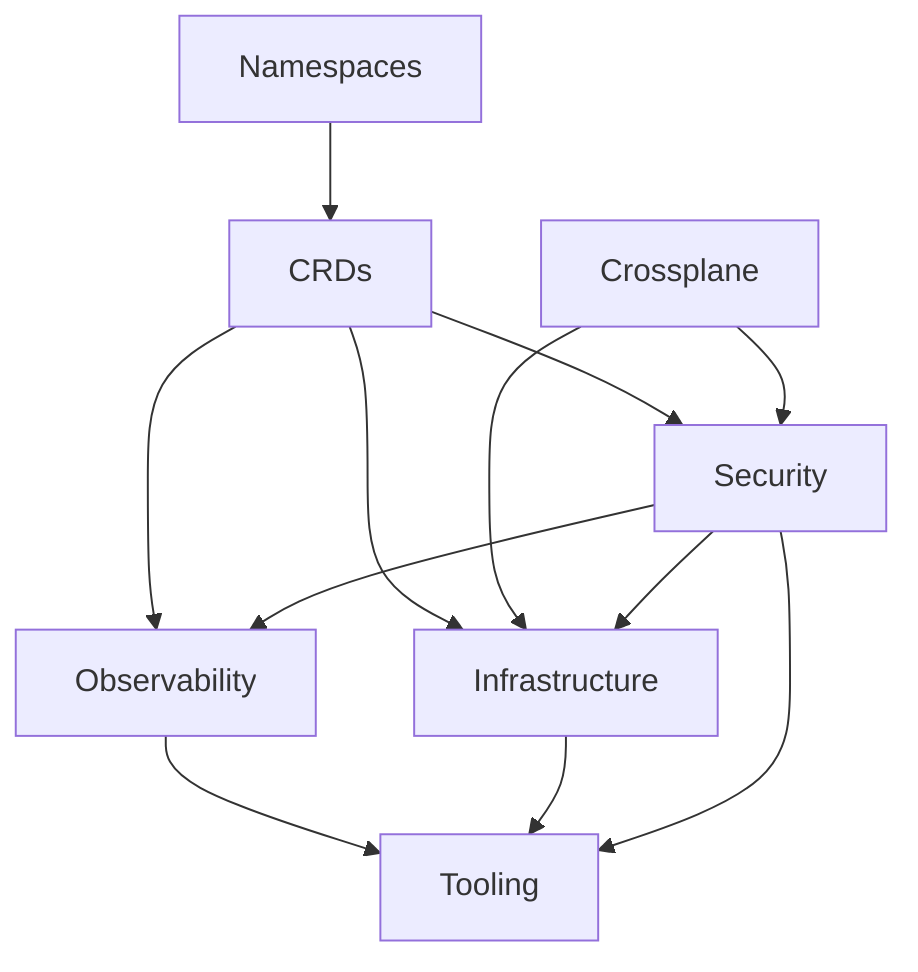

# Demo of a secured EKS cluster

⚠️ Work in progress in order to write new blog posts [here](https://blog.ogenki.io)

Based on [this repository](https://github.com/Smana/cilium-gateway-api)

## 🔄 Dependencies matter



This diagram can be hard to understand so these are the key information:

* **Namespaces** are the first resources to be created, all other resources may be namespace scoped
* **CRDs** that allow to extend Kubernetes capabilities must be present in order to use them in all other applications when needed.
* **Crossplane** creates [IRSA](https://docs.aws.amazon.com/emr/latest/EMR-on-EKS-DevelopmentGuide/setting-up-enable-IAM.html) permissions which are required by some components
* **Security** defines `external-secrets` that are needed by some applications in order to start. Furthermore there may be `kyverno` mutating policies that must be there before the resources they are targeting.

## 🏗️ Crossplane configuration

### Requirements and security concerns

The crossplane controllers permissions are defined using Terraform when the cluster is initialized.
This is actually a set of [IAM policies](https://github.com/Smana/demo-cloud-native-ref/blob/main/terraform/eks/iam.tf#L23)a ttached to a role that will be used in order to managed AWS resources (IRSA).

For security purposes, we adhere to the principle of least privilege, granting only the essentials. For example, I've opted not to permit the controllers to delete stateful services like S3 or RDS, even though it's feasible through Crossplane configuration.

### How is Crossplane deployed?

Basically [Crossplane](https://www.crossplane.io/) allows to provision and manage Cloud Infrastructure (and even more) using the native Kubernetes features.

It needs to be installed and set up in three **successive steps**:

1. Installation of the Kubernetes operator
2. Deployment of the AWS provider, which provides custom resources, including AWS roles, policies, etc.
3. Installation of compositions that will generate AWS resources.

There is a unique composition here: `irsa` that allows to provide fine-grained permissions to a few Kubernetes operators.

⚠️ This repository sets up a central EKS management cluster, and there are some **security considerations** to be aware of, particularly concerning AWS permissions. Specifically, `Crossplane` is able to manage (and even create) IAM roles with the prefix `xplane-`. Thus, if it's compromised, there's a potential to create a role with full admin privileges.


## 🛂 Federated authentication using Pinniped

## 🗒️ Audit logs with Loki and Vector

## 📦 OCI Registry with Harbor
ℹ️ In progress ...

The Harbor installation follows the best practices for high availability. It leverages recent Crossplane's features such as `Composition functions`

* External RDS database
* Redis cluster using the bitnami Helm chart
* Storing artifacts in S3

## 🔗 VPN connection using Tailscale

The VPN configuration is done within the `terraform/network` directory.
You can follow the steps described in this [README](/terraform/network/README.md) in order to provision a server that allows to access to private resources within AWS.

Most of the time we don't want to expose our resources publicly. For instance our platform tools such as `Grafana`, the `Flux web UI` should be access through a secured wire.
The risk becomes even more significant when dealing with Kubernetes' API. Indeed, one of the primary recommendations for securing a cluster is to limit access to the API.

Anyway, I intentionnaly created a distinct directory that allows to provision the network and a secured connection. So that there are no confusion with the EKS provisionning.

## 👮 Runtime security with Falco

## ✔️ Policies with Kyverno

## :closed_lock_with_key: Secrets management with Vault and external-secrets operator

## 🔑 Private PKI with Vault

## 🌐 Network policies with Cilium

## 🧪 CI

2 things are checked

* The terraform code quality, conformance and security using [pre-commit-terraform](https://github.com/antonbabenko/pre-commit-terraform).
* The kustomize and Kubernetes conformance using kubeconform and building the kustomize configuration.

In order to run the CI checks locally just run the following command

ℹ️ It requires [task](https://taskfile.dev/installation/) to be installed

```console
 task check
```

The same tasks are run in `Github Actions`.