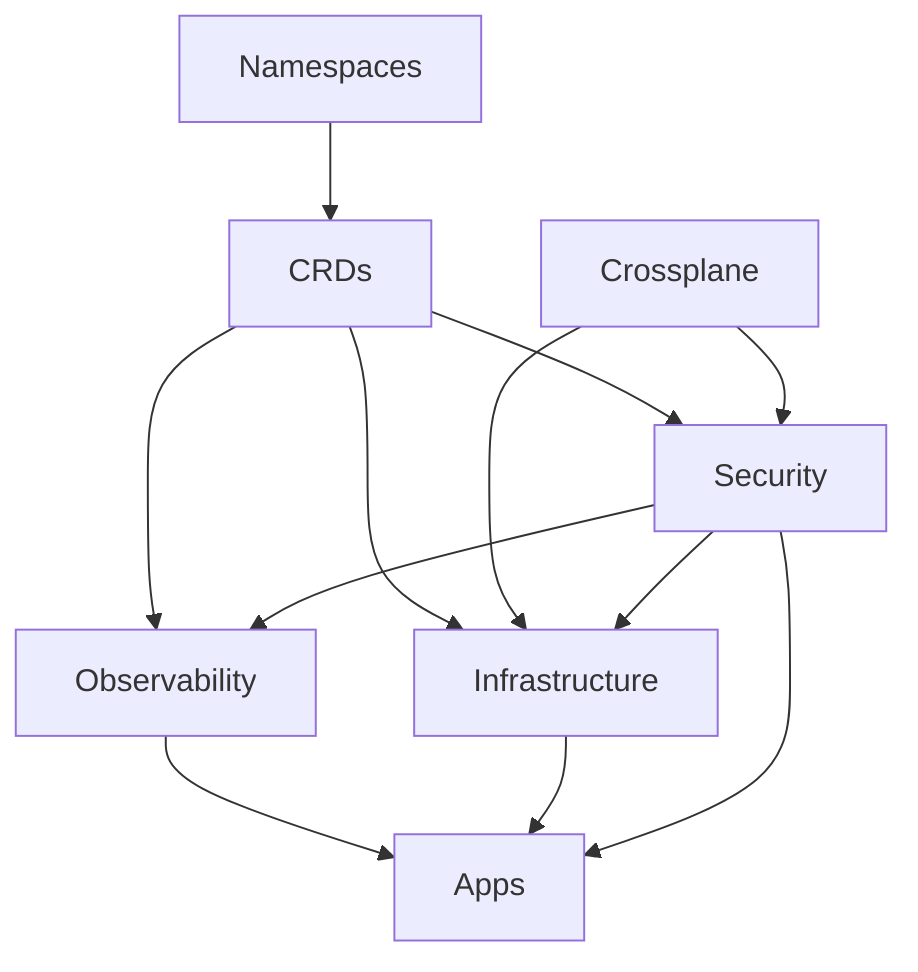

# cilium-gateway-api

⚠️ **Work in progress** for a future blog post [here](https://blog.ogenki.io/)

## Dependencies matter

This diagram can be hard to understand so these are the key information:

* **Namespaces** are the first resources to be created, all other resources may be namespace scoped
* **CRDs** that allow to extend Kubernetes capabilities must be present in order to use them in all other applications when needed.
* **Crossplane** creates [IRSA](https://docs.aws.amazon.com/emr/latest/EMR-on-EKS-DevelopmentGuide/setting-up-enable-IAM.html) permissions which are required by some components
* **Security** defines `external-secrets` that are needed by some applications in order to start. Furthermore there may be `kyverno` mutating policies that must be there before the resources they are targeting.
