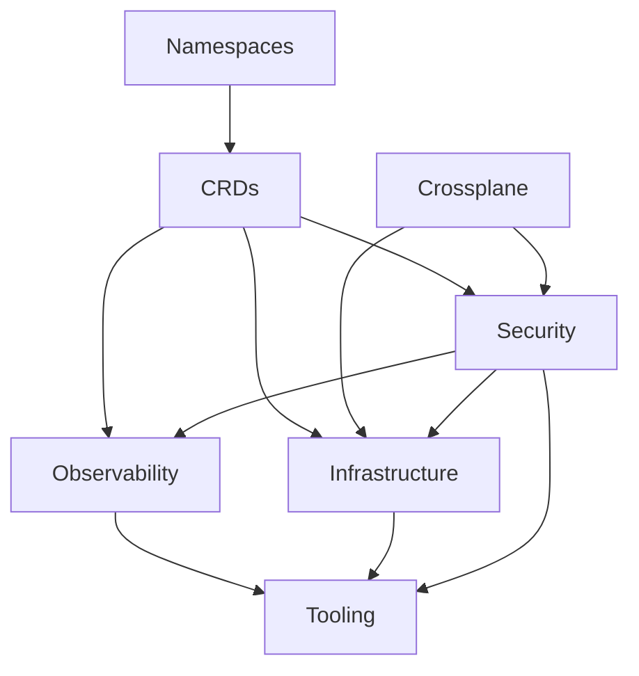

# Reference repository for building a Cloud Native platform

**_This is an opiniated set of configuration allowing to manage a Cloud Native platform the GitOps way_**

Here is the big picture inspired by the [CNOE](https://cnoe.io/) reference implementation.


ℹ️ This repository is used to write new blog posts [**here**](https://blog.ogenki.io)


## 🔄 Flux Dependencies matter



This diagram can be hard to understand so these are the key information:

* **Namespaces** are the first resources to be created, all other resources may be namespace scoped
* **CRDs** that allow to extend Kubernetes capabilities must be present in order to use them in all other applications when needed.
* **Crossplane** creates [IRSA](https://docs.aws.amazon.com/emr/latest/EMR-on-EKS-DevelopmentGuide/setting-up-enable-IAM.html) permissions which are required by some components
* **Security** defines `external-secrets` that are needed by some applications in order to start. Furthermore there may be `kyverno` mutating policies that must be there before the resources they are targeting.

## 🏗️ Crossplane configuration

### Requirements and security concerns

When the cluster is initialized, we define the permissions for the crossplane controllers using Terraform. This involves attaching a set of IAM policies to a role. This role is crucial for managing AWS resources, a process known as IRSA (IAM Roles for Service Accounts).

We prioritize security by adhering to the principle of **least privilege**. This means we only grant the necessary permissions, avoiding any excess. For instance, although Crossplane allows it, I have chosen not to give the controllers the ability to delete stateful services like S3 or RDS. This decision is a deliberate step to minimize potential risks.

Additionally, I have put a constraint on the resources the controllers can manage. Specifically, they are limited to managing only those resources which are prefixed with `xplane-`. This restriction helps in maintaining a more controlled and secure environment.

### How is Crossplane deployed?

Basically [Crossplane](https://www.crossplane.io/) allows to provision and manage Cloud Infrastructure (and even more) using the native Kubernetes features.

It needs to be installed and set up in three **successive steps**:

1. Installation of the Kubernetes operator
2. Deployment of the AWS provider, which provides custom resources, including AWS roles, policies, etc.
3. Installation of compositions that will generate AWS resources.

🏷️ Related blog posts:

* [Going Further with Crossplane: Compositions and Functions](https://blog.ogenki.io/post/cilium-gateway-api/)
* [My Kubernetes cluster (GKE) with Crossplane](https://blog.ogenki.io/post/crossplane_k3d/)

## 🛂 Federated authentication using (Still not decided: need to explore https://goauthentik.io/)

## 🗒️ Logs with Loki and Vector

## 📦 OCI Registry with Harbor

The Harbor installation follows the best practices for high availability. It leverages recent Crossplane's features such as `Composition functions`

* External RDS database
* Redis cluster using the bitnami Helm chart
* Storing artifacts in S3

🏷️ Related blog post: [Going Further with Crossplane: Compositions and Functions](https://blog.ogenki.io/post/crossplane_composition_functions/)

## 🔗 VPN connection using Tailscale

The VPN configuration is done within the `terraform/network` directory.
You can follow the steps described in this [README](/terraform/network/README.md) in order to provision a server that allows to access to private resources within AWS.

Most of the time we don't want to expose our resources publicly. For instance our platform tools such as `Grafana`, the `Flux web UI` should be access through a secured wire.
The risk becomes even more significant when dealing with Kubernetes' API. Indeed, one of the primary recommendations for securing a cluster is to limit access to the API.

Anyway, I intentionnaly created a distinct directory that allows to provision the network and a secured connection. So that there are no confusion with the EKS provisionning.

🏷️ Related blog post: [Beyond Traditional VPNs: Simplifying Cloud Access with Tailscale](https://blog.ogenki.io/post/tailscale/)

## 👮 Runtime security with Falco

## ✔️ Policies with Kyverno

## :closed_lock_with_key: Secrets management with Vault and external-secrets operator

## 🔑 Private PKI with Vault

The Vault creation is made in 2 steps:

1. Create the cluster as described [here](/terraform/vault/cluster/README.md)
2. Then configure it using [this directory](/terraform/vault/management/README.md)

ℹ️ The provided code outlines the setup and configuration of a **highly available, secure, and cost-efficient HashiCorp Vault cluster**. It describes the process of creating a Vault instance in either development or high availability mode, with detailed steps for initializing the Vault, managing security tokens, and configuring a robust **Public Key Infrastructure** (PKI) system. The focus is on balancing performance, security, and cost, using a multi-node cluster, ephemeral nodes with SPOT instances, and a tiered CA structure for digital security.

🏷️ Related blog post: [TLS with Gateway API: Efficient and Secure Management of Public and Private Certificates](https://blog.ogenki.io/post/pki-gapi/)

## 🌐 Network policies with Cilium

## 🧪 CI

2 things are checked

* The terraform code quality, conformance and security using [pre-commit-terraform](https://github.com/antonbabenko/pre-commit-terraform).
* The kustomize and Kubernetes conformance using kubeconform and building the kustomize configuration.

In order to run the CI checks locally just run the following command

ℹ️ It requires [task](https://taskfile.dev/installation/) to be installed

```console
 task check
```

The same tasks are run in `Github Actions`.