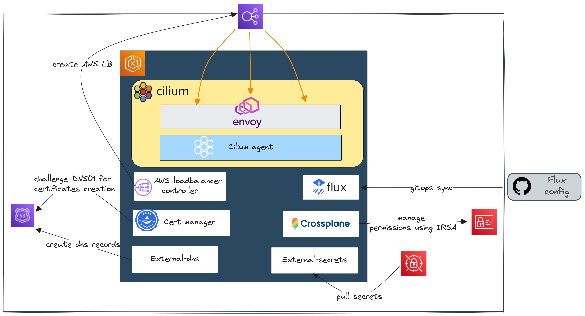
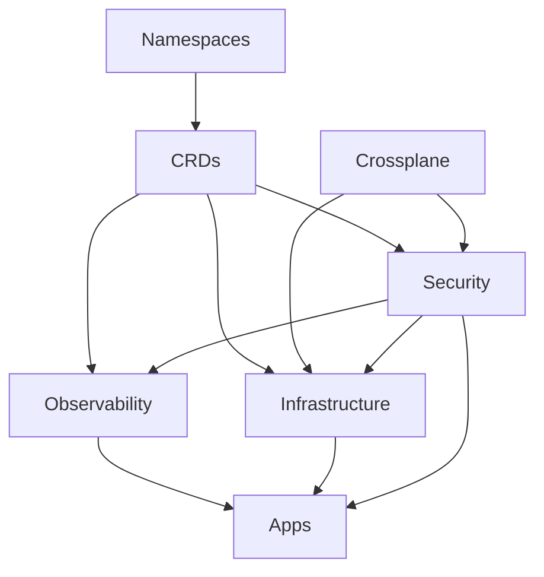

# cilium-gateway-api

The main purpose of this repository is to demonstrate how [**Cilium**](https://cilium.io/) implements the ☸ [**Gateway-API**](https://gateway-api.sigs.k8s.io/) standard. [**Here**](https://blog.ogenki.io/) is the related blog post.



This repository also is a reference for configuring a platform with the following key points:

* An EKS cluster deployed using Terraform ([here](./terraform/eks/README.md) for details)
* Cilium is installed as the drop-in replacement of the AWS CNI in kube-proxy less mode AND using a distinct daemonSet for Envoy (L7 loadbalancing)
* Everything is deployed the GitOps way using Flux
* Crossplane is used to configure IAM permissions required by the platform components
* Manage DNS records automatically using External-DNS
* Manage secrets from AWS secrets manager using External-Secrets

## 🔄 Dependencies matter



This diagram can be hard to understand so these are the key information:

* **Namespaces** are the first resources to be created, all other resources may be namespace scoped
* **CRDs** that allow to extend Kubernetes capabilities must be present in order to use them in all other applications when needed.
* **Crossplane** creates [IRSA](https://docs.aws.amazon.com/emr/latest/EMR-on-EKS-DevelopmentGuide/setting-up-enable-IAM.html) permissions which are required by some components
* **Security** defines `external-secrets` that are needed by some applications in order to start. Furthermore there may be `kyverno` mutating policies that must be there before the resources they are targeting.

## ⚙️ Flux variables substitutions

Variables substitions is a very powerful [Flux](https://fluxcd.io/)'s feature that allows to reduce at its bare minimum code deduplication.

This has been covered in this [previous article](http://localhost:1313/post/terraform-controller/#-focus-on-key-features-of-flux).

## ❓ How is Crossplane used

Basically [Crossplane](https://www.crossplane.io/) allows to provision and manage Cloud Infrastructure (and even more) using the native Kubernetes features.

It needs to be installed and set up in three **successive steps**:

1. Installation of the Kubernetes operator
2. Deployment of the AWS provider, which provides custom resources, including AWS roles, policies, etc.
3. Installation of compositions that will generate AWS resources.

There is a unique composition here: `irsa` that allows to provide fine-grained permissions to a few Kubernetes operators.

⚠️ This repository sets up a central EKS management cluster, and there are some **security considerations** to be aware of, particularly concerning AWS permissions. Specifically, `Crossplane` is able to manage (and even create) IAM roles with the prefix `xplane-`. Thus, if it's compromised, there's a potential to create a role with full admin privileges.

### IRSA example with external-dns

I utilize a [Compostion](https://docs.crossplane.io/v1.13/concepts/compositions/) provided by [Upbound](https://www.upbound.io/) (the company behind Crossplane) available here. I've made minor adjustments to ensure that it works fine with the Terraform/Flux bootstrapping approach used in this repository.

Here's is how to use the composition:

```yaml
apiVersion: aws.platformref.upbound.io/v1alpha1
kind: IRSA
metadata:
    name: xplane-external-dns-${cluster_name}
spec:
    deletionPolicy: Delete
    parameters:
        condition: StringEquals
        # Reference: https://kubernetes-sigs.github.io/external-dns/v0.13.4/tutorials/aws/#iam-policy
        policyDocument: |
            {
                "Version": "2012-10-17",
                "Statement": [
                    {
                        "Effect": "Allow",
                        "Action": [
                            "route53:ChangeResourceRecordSets"
                        ],
                        "Resource": [
                            "arn:aws:route53:::hostedzone/*"
                        ]
                    },
                    {
                        "Effect": "Allow",
                        "Action": [
                            "route53:ListHostedZones",
                            "route53:ListResourceRecordSets"
                        ],
                        "Resource": [
                            "*"
                        ]
                    }
                ]
            }

        serviceAccount:
            name: external-dns
            namespace: kube-system
```

This is pretty straightforward! We define the policy and the serviceAccount to which it would be associated then we have to wait a few seconds until the claims are ready and synced.

ℹ️ Under the hood each IRSA resource creates 3 things: A role, a rolePolicy and a rolePolicyAttachment.

```console
kubectl get irsa --all-namespaces
NAMESPACE     NAME                                         SYNCED   READY   CONNECTION-SECRET   AGE
kube-system   xplane-external-dns-mycluster-0              True     True                        30m
kube-system   xplane-loadbalancer-controller-mycluster-0   True     True                        30m
security      xplane-cert-manager-mycluster-0              True     True                        32m
security      xplane-external-secrets-mycluster-0          True     True                        32m
```

## CI

2 things are checked

* The terraform code quality, conformance and security using pre-commit.
* The kustomize and Kubernetes conformance using kubeconform and building the kustomize configuration.

In order to run the CI checks locally just run the following command

ℹ️ It requires [task](https://taskfile.dev/installation/) to be installed

```console
 task check
```

The same tasks are run in `Github Actions`.