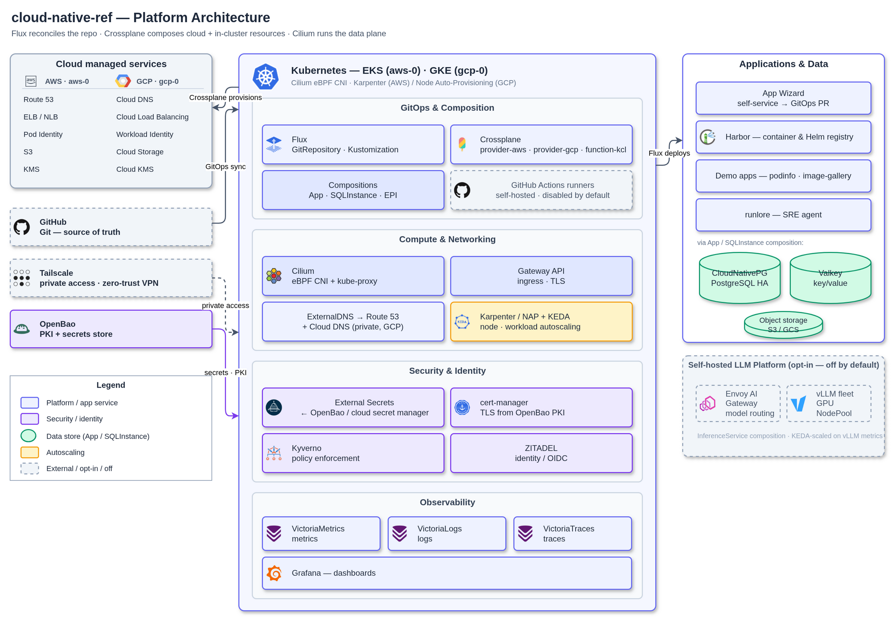

# Cloud Native Platform Reference

**_An opinionated, production-ready Kubernetes platform using GitOps principles._**

A reference implementation of a complete cloud-native platform on AWS EKS: infrastructure as
code with OpenTofu and Crossplane, continuous delivery with Flux, a private PKI and zero-trust
networking, a full observability stack, and a developer-facing abstraction that turns one small
YAML claim into a whole application.

📖 **Full documentation: [cnref.ogenki.io](https://cnref.ogenki.io)**

## Architecture



> Editable source: [`docs/architecture/platform-overview.drawio`](docs/architecture/platform-overview.drawio)

Three bands: the **cloud's managed services** on the left, with their AWS and GCP equivalents
side by side (Route 53 / Cloud DNS, ELB / Cloud Load Balancing, IAM via EKS Pod Identity / GKE
Workload Identity, S3 / Cloud Storage, KMS / Cloud KMS), the **Kubernetes cluster** in the centre
in four tiers (GitOps & composition, compute & networking, security & identity, observability),
and **applications & data** on the right. Flux reconciles the repository; Tailscale provides
private access; OpenBao holds the secrets and the PKI. The self-hosted LLM platform is opt-in and
off by default.

Every subsystem is explained at
[cnref.ogenki.io/docs/platform](https://cnref.ogenki.io/docs/platform/).

## Quickstart

Roughly 30 minutes end to end. You need an AWS account with admin permissions, a registered
domain in Route53, a Tailscale account, and a GitHub App or token for Flux. Full prerequisites
and the annotated walkthrough are in
[Get Started](https://cnref.ogenki.io/docs/get-started/).

```bash
# 1. Point the platform at your environment
$EDITOR opentofu/config.tm.hcl        # region, cluster name, domains, chart versions

# 2. Provide the one secret that is not in AWS Secrets Manager
export TF_VAR_tailscale_api_key=<your-tailscale-api-key>

# 3. Network, then OpenBao (~15 min)
cd opentofu && terramate script run deploy

# 4. EKS — two stages: cluster on a temporary CNI, then Cilium + Flux (~15 min)
cd aws/eks/init && terramate script run deploy

# 5. Get a kubeconfig
aws eks update-kubeconfig --region eu-west-3 --name aws-0

# 6. Watch Flux build the rest of the platform
flux get all
```

Flux takes over from there: security (External Secrets, cert-manager, Kyverno), infrastructure
(Cilium, Gateway API, ExternalDNS, Karpenter), observability (VictoriaMetrics, VictoriaLogs,
Grafana) and tooling (Harbor, Headlamp, Homepage).

## Documentation

Full documentation — deploy guides, platform internals, concepts, and the
architecture decision records — is published at **[cnref.ogenki.io](https://cnref.ogenki.io)**.

- [Get Started](https://cnref.ogenki.io/docs/get-started/) — deploy the platform in about 30 minutes
- [Platform](https://cnref.ogenki.io/docs/platform/) — every domain, what runs and why
- [Concepts](https://cnref.ogenki.io/docs/concepts/) — the ideas the platform is built on
- [Guides](https://cnref.ogenki.io/docs/guides/) — fork and adapt, add an application, troubleshoot
- [Reference](https://cnref.ogenki.io/docs/reference/) — technology stack, commands, repository layout
- [Decisions](https://cnref.ogenki.io/docs/decisions/) — what was chosen, and what over

The blog posts that explain several of these components in long form are collected under
[Further reading](https://cnref.ogenki.io/docs/reference/further-reading/).

## Repository Structure

```
.
├── opentofu/                      # 🔧 Infrastructure as Code
│   ├── aws/                       # AWS stacks
│   │   ├── network/               # VPC, Tailscale VPN
│   │   ├── openbao/               # Secrets management and PKI
│   │   ├── eks/                   # Kubernetes cluster (two-stage)
│   │   │   ├── init/              # Stage 1: EKS + bootstrap addons
│   │   │   └── configure/         # Stage 2: Cilium + Flux
│   │   └── llm-platform/          # Opt-in: S3 Files + IAM for the LLM platform
│   ├── gcp/                       # GCP stacks
│   │   ├── network/               # VPC, Tailscale VPN
│   │   ├── openbao/               # Secrets management and PKI
│   │   └── gke/                   # Kubernetes cluster (two-stage)
│   │       ├── init/              # Stage 1: GKE cluster
│   │       └── configure/         # Stage 2: Cilium + Flux
│   └── shared/                    # Owned by neither cloud (Tailscale tailnet, AWS↔GCP federation)
├── flux/                          # 🚀 Flux operator and configuration
├── clusters/aws-0/          # Cluster-specific Kustomizations
├── infrastructure/                # 🏗️ Platform infrastructure
├── security/                      # 🔒 Security components
├── observability/                 # 👁️ Monitoring and logging
├── tooling/                       # 🛠️ Platform tools
├── apps/                          # 📦 Applications, as App claims
├── crds/                          # Custom Resource Definitions
├── website/                       # 📚 The documentation site (Hugo + Hextra)
├── docs/                          # Architecture diagrams, specs, design artifacts
└── scripts/                       # Automation and validation
```

## AI-Assisted Development

This repository leverages a coding agent for code generation, troubleshooting, and
documentation. [CLAUDE.md](CLAUDE.md) provides project context and platform-specific knowledge.
Non-trivial changes go through the [Superpowers](https://github.com/obra/superpowers) workflow —
a design document is brainstormed and approved, turned into an implementation plan, then
executed task by task, with every artifact committed under
[docs/superpowers/](docs/superpowers/). A [platform constitution](docs/platform-constitution.md)
states the non-negotiable rules every design is checked against. The agent also integrates with
observability tools via MCP servers (VictoriaMetrics, VictoriaLogs, Flux) for real-time
debugging directly from the development environment.

## Contributing and Community

We welcome contributions, feedback, and questions!

- 🗨️ **[Slack Channel](https://ogenki.slack.com/)**: Chat with the community
- 💬 **[Discussions](https://github.com/Smana/cloud-native-ref/discussions)**: Ideas, questions, roadmap
- 🐛 **[Issues](https://github.com/Smana/cloud-native-ref/issues)**: Bug reports and feature requests
- 📅 **[Project Board](https://github.com/users/Smana/projects/1)**: Task tracking and priorities

**Before contributing**: Review [SECURITY.md](SECURITY.md) for security policy and
[CLAUDE.md](CLAUDE.md) for development guidelines.

## License

This project is provided as a reference implementation. Please review individual component licenses.

## Acknowledgments

This platform builds on the excellent work of many open-source projects:

- [Crossplane](https://www.crossplane.io/) team and community
- [Flux](https://fluxcd.io/) maintainers and CNCF
- [Cilium](https://cilium.io/) and eBPF ecosystem
- [VictoriaMetrics](https://victoriametrics.com/) developers
- [OpenBao](https://openbao.org/) and Linux Foundation
- All the maintainers of the tools in this stack

---

**Ready to get started?** → [cnref.ogenki.io/docs/get-started](https://cnref.ogenki.io/docs/get-started/)

**Questions?** → [Join our Slack](https://ogenki.slack.com/)
