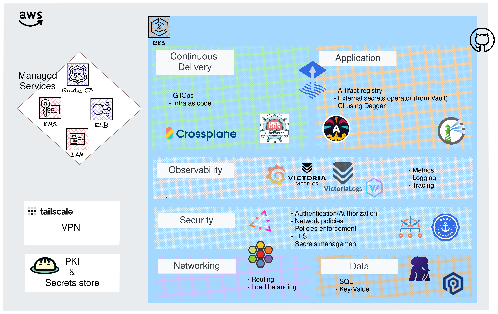

# Reference Repository for Building a Cloud Native Platform

**_This is an opinionated set of configurations for managing a Cloud Native platform using GitOps principles._**

This repository provides a comprehensive guide and set of tools for building, managing, and maintaining a Cloud Native platform. It includes configurations for Kubernetes, Crossplane, Flux, Vault, and more, with a focus on security, scalability, and best practices.

## Table of Contents
- [Reference Repository for Building a Cloud Native Platform](#reference-repository-for-building-a-cloud-native-platform)
  - [Table of Contents](#table-of-contents)
  - [🌟 Overview](#-overview)
  - [🔄 Flux Dependencies Matter](#-flux-dependencies-matter)
  - [🏗️ Crossplane Configuration](#️-crossplane-configuration)
    - [Requirements and Security Concerns](#requirements-and-security-concerns)
    - [How is Crossplane Deployed?](#how-is-crossplane-deployed)
  - [📦 OCI Registry with Harbor](#-oci-registry-with-harbor)
  - [🔗 VPN connection using Tailscale](#-vpn-connection-using-tailscale)
  - [🔑 Private PKI with Vault](#-private-pki-with-vault)
  - [🧪 CI](#-ci)
    - [Overview](#overview)
    - [🏠 Using Self-Hosted Runners](#-using-self-hosted-runners)
      - [Overview](#overview-1)
      - [Enabling Self-Hosted Runners](#enabling-self-hosted-runners)
      - [Dagger example with Self-Hosted Runners](#dagger-example-with-self-hosted-runners)

## 🌟 Overview

- 💬 [**Discussions**](https://github.com/Smana/demo-cloud-native-ref/discussions): Explore improvement areas, define the roadmap, and prioritize issues. Feel free to ask any questions 🙏.
- 🛠️ [**Issues**](https://github.com/Smana/demo-cloud-native-ref/issues): Track tasks and report bugs to ensure prompt resolution.
- 📅 [**Project**](https://github.com/users/Smana/projects/1): Detailed project planning and prioritization information.


Here is the big picture inspired by the [CNOE](https://cnoe.io/) reference implementation.



ℹ️ This repository is used to write new blog posts [**here**](https://blog.ogenki.io)


## 🔄 Flux Dependencies Matter
Flux is a set of continuous and progressive delivery solutions for Kubernetes that automate the application deployment process. The following diagram illustrates the key dependencies in our setup:


This diagram can be hard to understand so these are the key information:

- **Namespaces** - Namespaces are the foundational resources in Kubernetes. All subsequent resources can be scoped to namespaces.

- **Custom Resource Definitions (CRDs)** - CRDs extend Kubernetes' capabilities by defining new resource types. These must be established before they can be utilized in other applications.

- **Crossplane** - Utilized for provisioning the necessary infrastructure components within Kubernetes.

- **EKS Pod Identities** - Created using Crossplane, these identities are necessary to grant specific AWS API permissions to certain cluster components.

- **Security** - Among other things, this step deploys `external-secrets` which is essential to use sensitive data into our applications


## 🏗️ Crossplane Configuration

### Requirements and Security Concerns

When the cluster is initialized, we define the permissions for the Crossplane controllers using Terraform. This involves attaching a set of IAM policies to a role. This role is crucial for managing AWS resources, a process known as IRSA (IAM Roles for Service Accounts).

We prioritize security by adhering to the principle of **least privilege**. This means we only grant the necessary permissions, avoiding any excess. For instance, although Crossplane allows it, I have chosen not to give the controllers the ability to delete stateful services like S3 or RDS. This decision is a deliberate step to minimize potential risks.

Additionally, I have put a constraint on the resources the controllers can manage. Specifically, they are limited to managing only those resources which are prefixed with `xplane-`. This restriction helps in maintaining a more controlled and secure environment.

### How is Crossplane Deployed?

[Crossplane](https://www.crossplane.io/) allows provisioning and managing Cloud Infrastructure (and even more) using native Kubernetes features. It needs to be installed and set up in three **successive steps**:

1. Installation of the Kubernetes operator.
2. Deployment of the AWS provider, which provides custom resources, including AWS roles, policies, etc.
3. Installation of compositions that will generate AWS resources.

🏷️ Related blog posts:

- [Going Further with Crossplane: Compositions and Functions](https://blog.ogenki.io/post/cilium-gateway-api/)
- [My Kubernetes Cluster (GKE) with Crossplane](https://blog.ogenki.io/post/crossplane_k3d/)

## 📦 OCI Registry with Harbor

The Harbor installation follows best practices for high availability. It leverages recent Crossplane features such as `Composition functions`:

- External RDS database
- Redis cluster using the Bitnami Helm chart
- Storing artifacts in S3

🏷️ Related blog post: [Going Further with Crossplane: Compositions and Functions](https://blog.ogenki.io/post/crossplane_composition_functions/)

## 🔗 VPN connection using Tailscale

The VPN configuration is done within the `terraform/network` directory.
You can follow the steps described in this [README](/terraform/network/README.md) in order to provision a server that allows to access to private resources within AWS.

Most of the time we don't want to expose our resources publicly. For instance our platform tools such as `Grafana`, `Harbor` should be access through a secured wire.
The risk becomes even more significant when dealing with Kubernetes' API. Indeed, one of the primary recommendations for securing a cluster is to limit access to the API.

Anyway, I intentionnaly created a distinct directory that allows to provision the network and a secured connection. So that there are no confusion with the EKS provisionning.

🏷️ Related blog post: [Beyond Traditional VPNs: Simplifying Cloud Access with Tailscale](https://blog.ogenki.io/post/tailscale/)

## 🔑 Private PKI with Vault

The Vault creation is made in 2 steps:

1. Create the cluster as described [here](/terraform/vault/cluster/README.md)
2. Then configure it using [this directory](/terraform/vault/management/README.md)

ℹ️ The provided code outlines the setup and configuration of a **highly available, secure, and cost-efficient HashiCorp Vault cluster**. It describes the process of creating a Vault instance in either development or high availability mode, with detailed steps for initializing the Vault, managing security tokens, and configuring a robust **Public Key Infrastructure** (PKI) system. The focus is on balancing performance, security, and cost, using a multi-node cluster, ephemeral nodes with SPOT instances, and a tiered CA structure for digital security.

🏷️ Related blog post: [TLS with Gateway API: Efficient and Secure Management of Public and Private Certificates](https://blog.ogenki.io/post/pki-gapi/)

## 🧪 CI

### Overview

We leverage **[Dagger](https://dagger.io/)** for all our CI tasks. Here's what is currently run:

* Validation of Kubernetes and Kustomize manifests using `kubeconform`
* Validation of Terraform/Opentofu configurations using the [pre-commit-terraform](https://github.com/antonbabenko/pre-commit-terraform)

### 🏠 Using Self-Hosted Runners

#### Overview
For enhanced security and access to private endpoints, our CI tasks can be run on our internal platform using **Self-Hosted GitHub Runners**.

#### Enabling Self-Hosted Runners
This feature can be enabled within the `tooling` kustomization. By leveraging self-hosted runners, we achieve:

- **Access to Private Endpoints**: Directly interact with internal resources that are not publicly accessible.
- **Increased Security**: Run CI tasks within our secure internal environment.

For detailed information on setting up and using GitHub Self-Hosted Runners, please refer to this [documentation](https://docs.github.com/en/actions/hosting-your-own-runners).

#### Dagger example with Self-Hosted Runners

```yaml
name: Cache testing

on:
  pull_request:
  push:
    branches: ["main"]

jobs:

  test-cache:
    name: Testing in-cluster cache
    runs-on: dagger-gha-runner-scale-set
    container:
      image: smana/dagger-cli:v0.11.9
    env:
      _EXPERIMENTAL_DAGGER_RUNNER_HOST: "tcp://dagger-engine:8080"
      cloud-token: ${{ secrets.DAGGER_CLOUD_TOKEN }}

    steps:
      - name: Simulate a build with heavy packages
        uses: dagger/dagger-for-github@v5
        with:
          version: "latest"
          verb: call
          module: github.com/shykes/daggerverse.git/wolfi@dfb1f91fa463b779021d65011f0060f7decda0ba
          args: container --packages "python3,py3-pip,go,rust,clang"
```