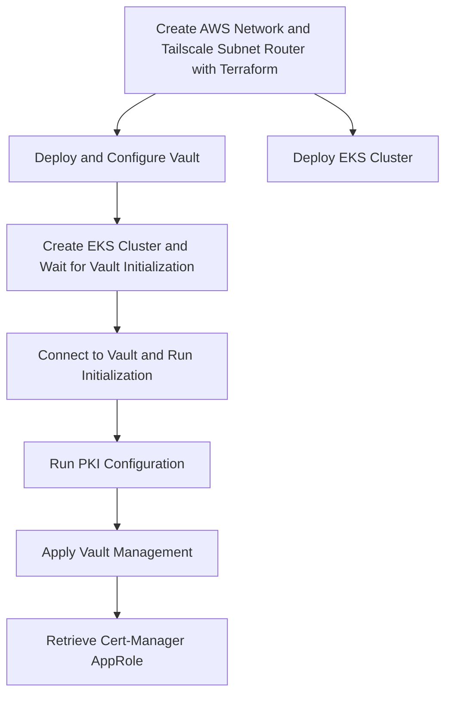

# Bootstrap Workflow

This Dagger workflow simplifies the bootstrap process for deploying and configuring a whole platform on AWS. This workflow automates several steps, reducing the complexity of manually setting up the infrastructure and services.

⚠️ **Note:** This workflow is experimental and is primarily intended for testing purposes. It helps validate changes in the infrastructure setup. Continuous Integration (CI) tests will be progressively added after the initial bootstrapping is complete.



## Requirements ✅

Using this automated deployment process **relies on AWS Secrets Manager** to store and retrieve sensitive data.

* **Generate Certificates**: To use Vault as a private PKI, follow the [procedure](../terraform/vault/cluster/docs/pki_requirements.md) to provision certificates (root, intermediate, and the one used for the Vault server itself). These certificates must be stored in AWS Secrets Manager beforehand.

* **Prepare the variables.tfvars Files**: The workflow commands expect a `variables.tfvars` file to be present in each module executed.

* **Tailscale Configuration**: ⚠️ Currently, Tailscale does not support "Split DNS" in userspace networking mode. You must start the local (laptop) Tailscale instance to reach private resources. Additionally, specify the DNS resolver in Docker's configuration (`daemon.json`) to use the AWS private DNS resolver.

```json

{
  "dns": [
    "10.0.0.2",
    "100.100.100.100",
    "1.1.1.1"
  ],
  "dns-search": [
    "tail9c3xx.ts.net",
    "priv.cloud.ogenki.io",
    "cloud.ogenki.io"
  ]
}
```

[Tailscale Github Issue](https://github.com/tailscale/tailscale/issues/4677)

### Bootstrap the Whole Platform 🚀

1. Create a new branch with the changes to be tested
```console
git checkout -b <flux_branch>
```

2. Run the `bootstrap` function
```console
 dagger call --access-key-id=env:AWS_ACCESS_KEY_ID --secret-access-key=env:AWS_SECRET_ACCESS_KEY --ts-key=env:TAILSCALE_APIKEY \
 bootstrap --source "." --branch <flux_branch>
 ```

It takes over 20 minutes to get everything up and running. You should see an output similar to the following:

```console
VaultAddr: https://vault.priv.cloud.ogenki.io:8200
CertManagerAppRoleId: b44bc6c4-6fd4-513f-2ee1-15e6c48baaa6
EKSGetCredentials: aws eks update-kubeconfig --name mycluster-0 --alias mycluster-0
```

3. Report the ApproleId into the `ClusterIssuer` definition [here](../security/base/cert-manager/vault-clusterissuer.yaml). Then push your changes

```console
git pull --set-upstream origin <flux_branch>
git commit -m "chore(cert-manager): update vault approle id"
git push
```
