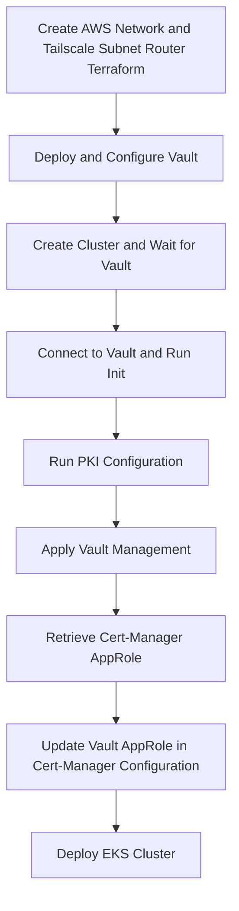

# Bootstrap workflow

This Dagger workflow allows to easy the bootstrap process. There are indeed several steps and a few command to run in order to have the whole platform up and running.



### Requirements ✅

Using this automatic way of deploying everything **relies on AWS secretsmanager** to store and retrieve sensitive data.


* **generate certificates**: in order to use Vault as private PKI we must follow this procedure that guides us in provisionning the certificates (root, intermetiate and the one use for the Vault server itself). These certificates have to be stored in AWS SecretsManager beforehand.

* **Tailscale configuration**: ⚠️ Currently Tailscale doesn't support "Split DNS" in userspace networking mode. That means that we still need to start the local (laptop) Tailscale instance in order to be able to reach private resources. Furthermore I had to sepicify the DNS resolver in Docker's configuration `daemon.json` in order to make use of the AWS private DNS resolver.
```json

{
  "dns": [
    "10.0.0.2",
    "100.100.100.100",
    "1.1.1.1"
  ],
  "dns-search": [
    "tail9c3xx.ts.net",
    "priv.cloud.ogenki.io",
    "cloud.ogenki.io"
  ]
}
```

### Bootstrap the whole platform
```console
 dagger call --access-key-id=env:AWS_ACCESS_KEY_ID --secret-access-key=env:AWS_SECRET_ACCESS_KEY --ts-key=env:TAILSCALE_APIKEY \
 up --source "." --branch <flux_branch>
 ```
