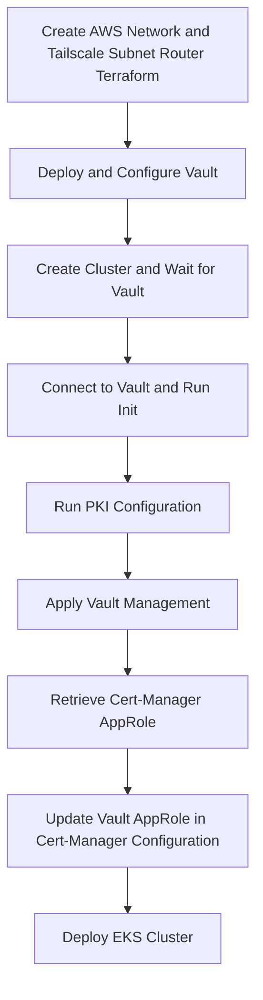

# Bootstrap workflow

This Dagger workflow allows to easy the bootstrap process. There are indeed several steps and a few command to run in order to have the whole platform up and running.



```console
dagger call clean --source="." -v
```


```console
 dagger call bootstrap --source "." --access-key-id=env:AWS_ACCESS_KEY_ID --secret-access-key=env:AWS_SECRET_ACCESS_KEY -v
 ```
