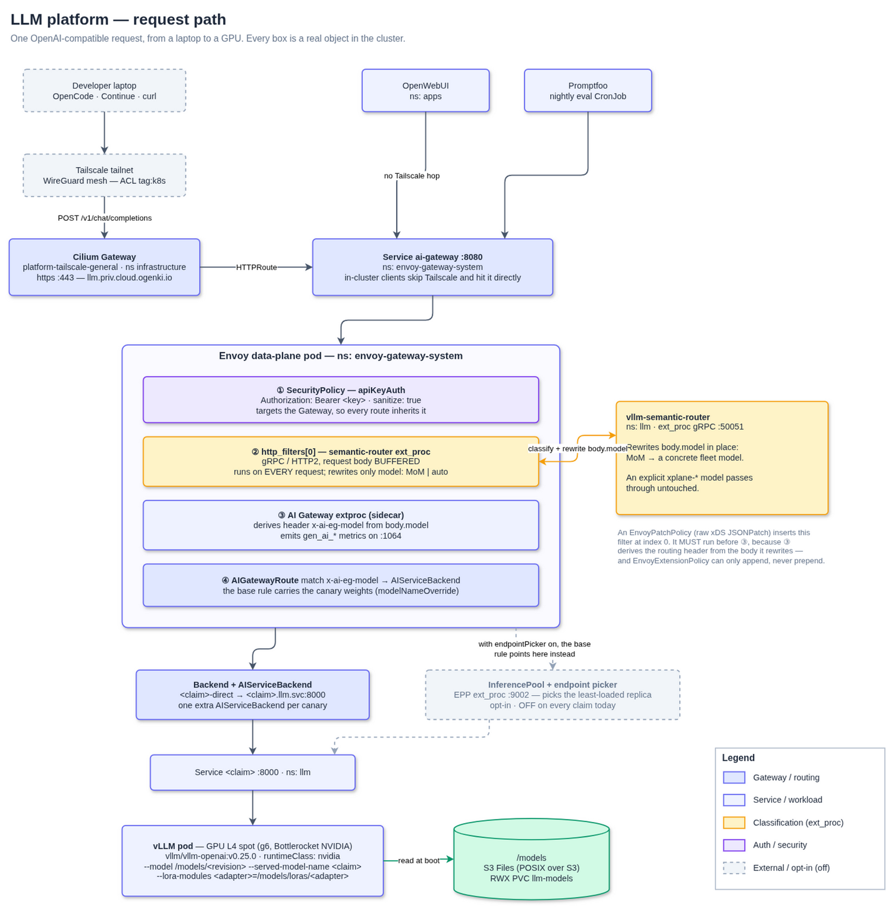
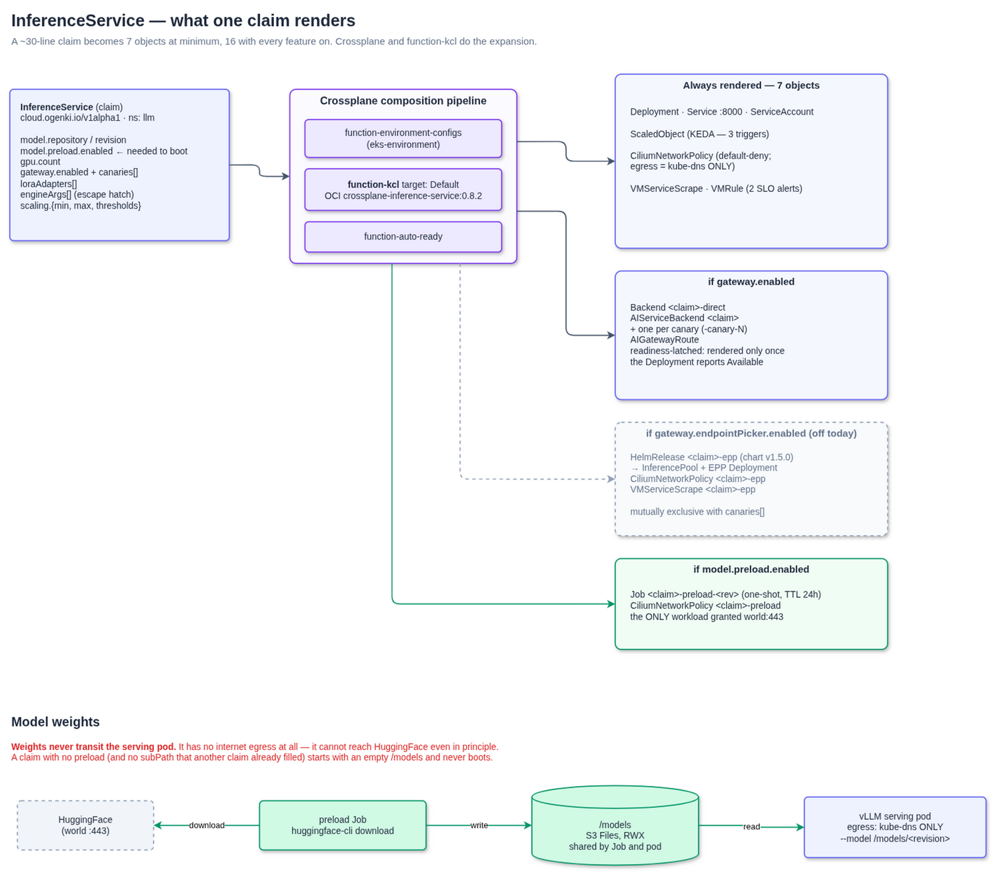
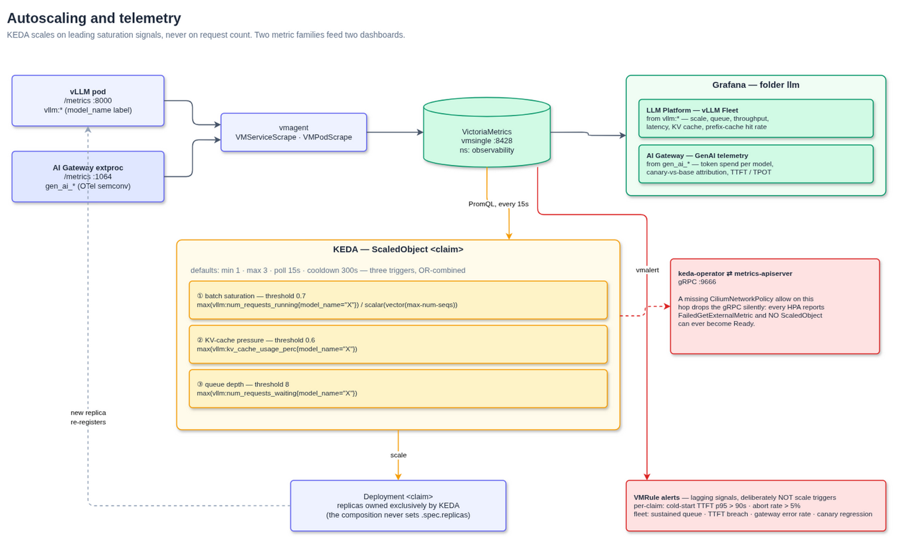

# Self-Hosted LLM Platform

An OpenAI-compatible inference platform on EKS: vLLM on L4 spot GPUs, fronted by Envoy AI Gateway,
scaled by KEDA on vLLM saturation signals, and declared as a single Crossplane `InferenceService`
claim per model.

It is **off by default.** Two independent gates must both be released — see [Turning it on](#turning-it-on).
A default `terramate script run deploy` plus a default Flux reconcile leaves the cluster LLM-free.

> **Scope of this document.** It describes what the code in this repository actually does, as of the
> composition module `crossplane-inference-service:0.8.2`. Where a capability is implemented but switched
> on nowhere, it says so. Where something is a known gap, it is listed in [Known gaps](#known-gaps) rather
> than quietly omitted.

---

## At a glance

| | |
|---|---|
| **Engine** | vLLM `v0.25.0`, one Deployment per model, port 8000 |
| **Gateway** | Envoy Gateway `1.8.2` + Envoy AI Gateway `1.0.0` |
| **Routing** | `AIGatewayRoute`, keyed on the `x-ai-eg-model` header |
| **Prompt routing** | vLLM Semantic Router `0.2.0`, as a gRPC `ext_proc` filter — only acts on `model: MoM` |
| **Autoscaling** | KEDA `2.20.1`, three vLLM saturation triggers, `min=1` (always warm) |
| **Weights** | Amazon S3 Files (POSIX over S3), RWX PVC shared by preload Job and serving pod |
| **GPUs** | Karpenter `gpu-l4` NodePool — `g6` spot, Bottlerocket NVIDIA AMI, capped at 4 GPUs |
| **Observability** | VictoriaMetrics + two Grafana dashboards (`vllm:*` engine, `gen_ai_*` gateway) |
| **Steady-state cost** | 4× L4 spot — one per model, because every model runs at `min=1` |

---

## Turning it on

Two gates, deliberately independent. Both must be released.

```bash
# Gate 1 — AWS (S3 Files filesystem + IAM). Terramate stack tagged `opt-in`.
TM_LLM_PLATFORM_ENABLED=true terramate -C opentofu/llm-platform script run deploy

# Gate 2 — Kubernetes. The umbrella Flux Kustomization ships suspended.
flux resume kustomization llm-platform -n flux-system
```

The umbrella (`clusters/mycluster-0/llm-platform.yaml`) aggregates eight children under
`clusters/mycluster-0-llm-platform/`. That directory is a **sibling** of `clusters/mycluster-0/`, not a
child, on purpose: `flux-system` syncs `clusters/mycluster-0/` recursively, so a nested path would be
auto-discovered and applied — bypassing the suspend gate entirely.

Teardown and the full child list live in
[`clusters/mycluster-0-llm-platform/README.md`](../clusters/mycluster-0-llm-platform/README.md).

---

## Request path



*Source: [`architecture/llm-platform.drawio`](architecture/llm-platform.drawio), page 1.*

A request travels through two gateways and four filters before it reaches a GPU.

**1 — Ingress.** External clients arrive over Tailscale and hit the Cilium Gateway
`platform-tailscale-general` (`ns infrastructure`) at `llm.priv.cloud.ogenki.io`. An `HTTPRoute` forwards to
the Envoy AI Gateway data-plane Service, `ai-gateway:8080` in `envoy-gateway-system`.

In-cluster clients — OpenWebUI, Promptfoo — skip Tailscale and address that Service directly at
`http://ai-gateway.envoy-gateway-system.svc.cluster.local:8080/v1`.

**2 — Authentication.** A `SecurityPolicy` with `apiKeyAuth` targets the **Gateway**, so every route
inherits it. Keys come from AWS Secrets Manager via External Secrets. Envoy strips the `Bearer ` prefix
before the byte-comparison — so the stored value is the raw key — and `sanitize: true` removes the
`Authorization` header before the request is forwarded upstream.

**3 — Prompt classification (`ext_proc`, filter index 0).** This is the part most easily got wrong, so be
precise about it:

- The Semantic Router is wired in as an Envoy **`ext_proc` gRPC filter** dialling
  `vllm-semantic-router.llm:50051`, inserted at **`http_filters[0]`** by an `EnvoyPatchPolicy` (a raw xDS
  JSONPatch).
- It **must** run at index 0, ahead of the AI Gateway's own extproc. That extproc derives the routing
  header `x-ai-eg-model` from `body.model`, and the Semantic Router rewrites `body.model` **in place**
  (`MoM` → a concrete model). The other order would classify a body that had already been read.
  `EnvoyExtensionPolicy` can only *append* filters, which is why this has to be a raw patch.
- The filter sits in the chain for **every** request. It only *rewrites* when `body.model` is `MoM` (or the
  literal `auto`). An explicit `xplane-*` model passes through untouched — which is the whole point of
  listing the concrete model names in `/v1/models`.

**4 — Routing.** The AI Gateway extproc sets `x-ai-eg-model` from the (possibly rewritten) body and emits
`gen_ai_*` telemetry on `:1064`. An `AIGatewayRoute` matches that header and forwards through an
`AIServiceBackend` → `Backend` → the model's Service on `:8000`.

Where the route object comes from depends on the claim:

| Claim | Owner of its gateway objects |
|---|---|
| `xplane-qwen-coder` | the **composition** (`spec.gateway.enabled: true`) |
| the other three | still hand-written in `apps/base/ai/llm/ai-gateway-routes/route.yaml` |

The migration to composition-owned routing is [half-done](#known-gaps).

---

## Semantic routing — `model: MoM`

Send `model: MoM` and the Semantic Router picks a model from the prompt. Its decision list, highest
priority first (`infrastructure/base/vllm-semantic-router/helmrelease.yaml`):

| Priority | Decision | Target | Notes |
|---|---|---|---|
| 110 | `code_with_reasoning` | `xplane-qwen-coder` | `use_reasoning: true` |
| 100 | `code_decision` | `xplane-qwen-coder` | |
| 90 | `reasoning_decision` | `xplane-qwen3-8b` | math / physics; `use_reasoning: true` |
| 80 | `multilingual_decision` | `xplane-qwen3-8b` | |
| 50 | `general_decision` | `xplane-qwen3-8b` | the default |

Classification costs roughly **250–300 ms**. Naming a model explicitly skips it entirely, which is why the
coding clients pin one.

Two guardrails run in the router's own pod, on CPU. Neither is a model route:

- **`prompt_guard`** — a BERT jailbreak classifier (threshold 0.7). It **blocks**; it does not route.
- **`classifier.pii_model`** — PII detection. A separate block from `prompt_guard`, not part of it.

`semantic_cache` exists in the chart and is **deliberately disabled**.

> ⚠️ `xplane-llamaguard3-1b` and `xplane-qwen-coder-fim` appear in **no** decision rule — they are reachable
> only by naming them directly. There is no `guardrail` category, and nothing dispatches to LlamaGuard
> automatically. See [Known gaps](#known-gaps).

---

## The model fleet

Four claims in `apps/base/ai/llm/`. All four pin an upstream commit SHA and preload their weights.

| Model | Repository | Quant | Context | `maxNumSeqs` | min/max | Gateway | LoRA |
|---|---|---|---|---|---|---|---|
| `xplane-qwen-coder` | `Qwen/Qwen2.5-Coder-7B-Instruct` | fp8 | 32k | 32 | 1 / 2 | composition-owned | 2 adapters + 10% canary |
| `xplane-qwen3-8b` | `Qwen/Qwen3-8B` | fp8 | 32k | 32 | 1 / 2 | `route.yaml` | — |
| `xplane-qwen-coder-fim` | `Qwen/Qwen2.5-Coder-1.5B` | fp8 | 8k | 64 | 1 / 1 | `route.yaml` | — |
| `xplane-llamaguard3-1b` | `meta-llama/Llama-Guard-3-1B` | fp16 | 8k | 64 | 1 / 3 | `route.yaml` | — |

Every model defaults to `minReplicas: 1` — always warm. **There is no scale-to-zero.** The platform trades
idle GPU cost for the absence of a cold-start cliff, and the `gpu-l4` NodePool's `nvidia.com/gpu: "4"` cap
turns those four `min=1` models into a hard cost ceiling.

---

## InferenceService — one claim, many objects



*Source: [`architecture/llm-platform.drawio`](architecture/llm-platform.drawio), page 2.*

A ~30-line claim renders **7 objects at minimum, 16 with everything on**. The complete API reference —
every field, default and CEL rule — lives in the
[composition README](../infrastructure/base/crossplane/configuration/kcl/inference-service/README.md).
The parts worth knowing before you write a claim:

### Weights: `preload` is not really optional

The serving container always starts with `--model /models/<revision>` — a path on the shared mount, **never**
a HuggingFace repository id. And the serving pod's `CiliumNetworkPolicy` permits egress to kube-dns and
*nothing else*. It cannot reach HuggingFace even in principle.

So the weights must already be on the mount before the pod starts. `model.preload.enabled: true` renders the
one-shot Job that puts them there — and that Job is the only workload in the platform granted `world:443`,
precisely because it is bounded and short-lived.

`preload.enabled` **defaults to `false`**, which is a trap worth naming: a claim without it — and without a
`weightsFileSystem.subPath` that some other claim already filled — starts with an empty `/models` and never
boots. The default is `false` only to allow that weight-sharing case.

### `engineArgs` — the escape hatch

`spec.engineArgs` passes raw flags to vLLM, appended **last** so they cannot be shadowed by the composition.
An admission-time CEL denylist rejects the 18 flags the composition owns (`--model`, `--max-num-seqs`,
`--gpu-memory-utilization`, `--enable-lora`, …) and requires the single-token `--flag=value` form.

```yaml
engineArgs:
  - --kv-cache-dtype=fp8
  - --enforce-eager
```

### LoRA adapters and canaries

`loraAdapters[]` (max 8) are downloaded to `/models/loras/<name>/` and served alongside the base model. Each
becomes a client-addressable model name in its own right.

`gateway.canaries[]` (max 4) shifts a weighted slice of *base-model* traffic onto an adapter, using the AI
Gateway's `modelNameOverride`. `xplane-qwen-coder` runs a **10% canary** onto `xplane-qwen-coder-sql-dpo`
today — so roughly one request in ten for `model: xplane-qwen-coder` is actually served by the adapter.

Naming an adapter explicitly always gets 100% of that adapter: the composition renders a pin rule per
adapter, so a canary never dilutes an explicit request. Canary weights sum to ≤ 99, so the base model always
keeps traffic.

### Endpoint picker (opt-in, currently unused)

`gateway.endpointPicker.enabled` swaps the route's backend for a Gateway API Inference Extension
`InferencePool`. The endpoint picker (`ext_proc` on `:9002`) then selects the least-loaded replica by
KV-cache utilisation and queue depth, instead of round-robin.

It is **mutually exclusive with canaries** — an `InferencePool` backendRef carries neither `weight` nor
`modelNameOverride` — and since the only gateway-enabled claim uses canaries, it is **enabled nowhere**. It
is wired and tested, but no model uses it today.

### Run:ai Model Streamer (opt-in)

`model.streaming.enabled` switches vLLM to `--load-format runai_streamer`, streaming tensors from the same
PVC concurrently. Measured here it saved **7.3 s on a 62.5 s weight load** — but weight loading is only ~30%
of a ~180 s cold start (engine init dominates, at ~124 s), so the end-to-end gain is about **4%**. Real, but
small. It changes no storage, IAM, or image.

---

## Autoscaling



*Source: [`architecture/llm-platform.drawio`](architecture/llm-platform.drawio), page 3.*

One KEDA `ScaledObject` per model, always rendered. **Three** Prometheus triggers against VictoriaMetrics,
OR-combined — any one at or above its threshold drives a scale-up.

| # | Signal | Query | Default threshold |
|---|---|---|---|
| 1 | batch saturation | `max(vllm:num_requests_running{model_name="X"}) / scalar(vector(<maxNumSeqs>))` | `0.7` |
| 2 | KV-cache pressure | `max(vllm:kv_cache_usage_perc{model_name="X"})` | `0.6` |
| 3 | queue depth | `max(vllm:num_requests_waiting{model_name="X"})` | `8` |

All three are **leading** signals: they fire *before* the batch saturates, *before* the cache evicts,
*before* the queue builds. `max()` rather than an average is deliberate — it tracks the hottest replica
instead of a fleet mean that would hide it.

Defaults: `minReplicas: 1`, `maxReplicas: 3`, `pollingInterval: 15s`, `cooldownPeriod: 300s`.

The Deployment **never sets `.spec.replicas`**. KEDA owns it exclusively; writing it in the composition would
race with KEDA on every reconcile. The update strategy is `Recreate`, because a rolling surge would block
waiting for a GPU that does not exist.

> **A trap that silently costs you the entire feature.** KEDA's operator and its metrics-apiserver talk gRPC
> on `:9666`. Under Cilium default-deny, a missing allow on that hop drops the gRPC **silently**: every HPA
> reports `FailedGetExternalMetric` and no `ScaledObject` can ever become Ready — while nothing else looks
> broken. The allow lives in `infrastructure/base/keda/network-policy.yaml`.

`minReplicas: 0` is permitted but gives up the queueing layer: the first request after a scale-to-zero fails,
and the client must retry.

---

## Observability

Two metric families, two dashboards. They answer different questions.

**Engine metrics** — `vllm:*`, scraped from each pod's `:8000/metrics` by a `VMServiceScrape` and labelled by
`model_name`. These drive autoscaling and the fleet dashboard: `num_requests_running`, `num_requests_waiting`,
`kv_cache_usage_perc`, `time_to_first_token_seconds`, `e2e_request_latency_seconds`,
`prefix_cache_hits_total`, and friends.

**Gateway metrics** — `gen_ai_*` (OpenTelemetry semantic conventions), emitted by the AI Gateway extproc
sidecar and scraped from `:1064` by a **`VMPodScrape`** — a pod scrape, not a service scrape, because the
admin port is not Service-fronted.

Two labels do the heavy lifting here, and confusing them will mislead you:

| Label | Meaning |
|---|---|
| `gen_ai_original_model` | what the client **asked for** |
| `gen_ai_request_model` | what was **actually served** — post-`modelNameOverride`, so the adapter on a canary slice |

That distinction is what makes canary attribution possible: token spend and error rate can be split
base-vs-canary from the gateway alone, without instrumenting the engine.

Note that `gen_ai_client_token_usage_*` carries **no unit suffix** — "token" is already a name token in the
semconv, so there is no trailing `_tokens`.

**Dashboards** (Grafana folder `llm`):
- *LLM Platform — Self-hosted vLLM Fleet* — scale, queue, throughput, latency, cache.
- *AI Gateway — GenAI telemetry* — per-model token spend, canary-vs-base attribution, gateway TTFT/TPOT.

**Alerts** (`VMRule`) are **lagging** signals, deliberately *not* scale triggers: per-claim cold-start TTFT
p95 > 90 s and abort rate > 5%; fleet-wide sustained queue, TTFT breach, gateway error rate, and canary
error/latency regression.

Distributed tracing (OTLP) is **not enabled** — the extproc env block exists but is commented out.

---

## Security posture

- **Zero trust by default.** Every workload carries a default-deny `CiliumNetworkPolicy`. The serving pod's
  egress is kube-dns only. Only the bounded preload Job is granted `world:443`.
- **No credentials in Git.** API keys and the HuggingFace token come from AWS Secrets Manager through
  External Secrets.
- **Gateway auth.** `SecurityPolicy.apiKeyAuth` on the Gateway; the `Authorization` header is sanitized before
  the request reaches vLLM.
- **Restricted PSS.** Non-root, read-only root filesystem, no privilege escalation, all capabilities dropped,
  `seccompProfile: RuntimeDefault`. Where an upstream chart cannot express this (the endpoint picker), a Flux
  `postRenderers` kustomize patch injects it.
- **No IAM on the serving pod.** Weights arrive over the CSI mount, so the serving ServiceAccount has no role
  bound to it at all. Only the preload Job carries an EKS Pod Identity.
- **Private ingress.** Reachable only from the tailnet. There is no public listener.

---

## GPU foundation and storage

**GPUs.** Karpenter NodePool `gpu-l4`: `g6` family, single-GPU instances, spot-first, Bottlerocket NVIDIA AMI,
taint `nvidia.com/gpu=true:NoSchedule`, and `limits.nvidia.com/gpu: "4"`. Pods opt in with
`runtimeClassName: nvidia` plus a matching toleration.

There is **no NVIDIA device plugin DaemonSet**, and none is needed: the Bottlerocket NVIDIA variant advertises
`nvidia.com/gpu` through the kubelet natively.

**Weights.** An Amazon S3 Files filesystem (POSIX over S3) is mounted RWX at `/models` by both the preload Job
and the serving pod, each with `subPath: <claim-name>`. One persistent filesystem — no `aws s3 sync`, no init
container — and weights survive pod churn, so a scale-up reads from a warm mount instead of re-downloading.
See [ADR-0004](decisions/0004-amazon-s3-files-for-model-weights-storage.md).

---

## Adding a new model

1. Add an `InferenceService` claim under `apps/base/ai/llm/` and list it in that directory's
   `kustomization.yaml`.
2. Set `model.repository`, and pin `model.revision` to a commit SHA (not `main`).
3. **Set `model.preload.enabled: true`.** Without it the pod has no way to fetch weights and will never start.
4. Size the GPU: `gpu.count`, `model.quantization`, `model.contextWindow`, `model.maxNumSeqs`. Note that
   `maxNumSeqs` is also the denominator of the batch-saturation scale trigger.
5. Expose it with `gateway.enabled: true`. The composition renders the `Backend`, `AIServiceBackend` and
   `AIGatewayRoute` for you — **do not** hand-edit `ai-gateway-routes/route.yaml` for a gateway-enabled claim.
6. To make `model: MoM` route to it, add a decision rule to the Semantic Router config in
   `infrastructure/base/vllm-semantic-router/helmrelease.yaml`. A model in the fleet but in no decision rule is
   reachable only by name.
7. Mind the budget: the NodePool caps the fleet at 4 GPUs, and every `min=1` model holds one.

---

## Known gaps

An honest list. None of these are hidden behind a green checkmark.

- **LlamaGuard-3-1B holds a GPU and serves no automatic traffic.** It runs at `min=1` but appears in no
  Semantic Router decision rule, and there is no `guardrail` category. Jailbreak filtering is done by the
  router's own in-pod `prompt_guard`, which blocks rather than routes. It occupies one of the four GPUs in the
  cap while being reachable only by explicit dispatch. Either wire it into a decision rule, or drop it.
- **Gateway routing is half-migrated.** `xplane-qwen-coder` is composition-owned; the other three still live in
  `apps/base/ai/llm/ai-gateway-routes/route.yaml`. That file disappears once they migrate.
- **The endpoint picker is inert.** Implemented, tested, and enabled on zero claims — it is mutually exclusive
  with canaries, and the only gateway-enabled claim uses canaries. Its dashboard row is permanently empty.
- **The weights PV `volumeHandle` is hardcoded** in `apps/base/ai/llm/models-pvc.yaml` and must be updated by
  hand after every fresh `tofu apply` of the LLM stack. It is immutable once created. Closing that loop through
  Secrets Manager + ESO is open work.
- **No distributed tracing.** OTLP export from the AI Gateway is written but commented out, pending
  verification against VictoriaTraces.
- **`crossplane render` validates the published module, not your change.** The composition pulls its KCL module
  from OCI, so a local render exercises the *published* tag rather than the working tree — and CI does not run
  the render at all (it runs `kcl fmt`, `kcl test`, and `kcl run` against the local module). Treat a green local
  render as evidence about the last release, not about your diff.

---

## Reference

**Diagrams** — [`docs/architecture/llm-platform.drawio`](architecture/llm-platform.drawio), 3 pages.

**Specs**
- [SPEC-001 — KEDA autoscaling on leading vLLM signals](specs/0001-llm-platform-prometheus-autoscaling/spec.md)
- [SPEC-002 — composition-owned gateway routing + LoRA canaries](specs/002-composition-owned-gateway-routing/spec.md)
- [SPEC-003 — `engineArgs` escape hatch](specs/003-inferenceservice-spec-engineargs-escape/spec.md)
- [SPEC-004 — per-InferenceService InferencePool + endpoint picker](specs/004-per-inferenceservice-inferencepool-endpoint/spec.md)
- [SPEC-005 — vLLM cold start / Run:ai Model Streamer](specs/005-vllm-cold-start-run/spec.md)
- [SPEC-006 — GenAI observability for Envoy AI Gateway](specs/006-genai-observability-envoy-gateway/spec.md)

**Decisions**
- [ADR-0003 — vLLM Production Stack over KServe + llm-d](decisions/0003-vllm-production-stack-over-kserve.md)
- [ADR-0004 — Amazon S3 Files for model-weights storage](decisions/0004-amazon-s3-files-for-model-weights-storage.md)

**Operations**
- [Composition API reference](../infrastructure/base/crossplane/configuration/kcl/inference-service/README.md) — every field, default and CEL rule
- [Enable and teardown](../clusters/mycluster-0-llm-platform/README.md)
- [Coding clients](coding-clients.md) — OpenCode, Continue, OpenWebUI
