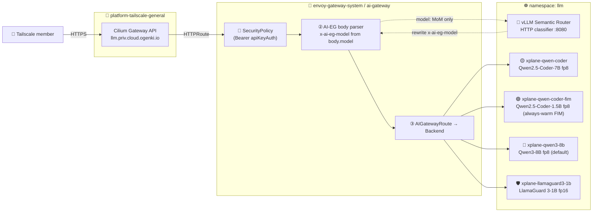
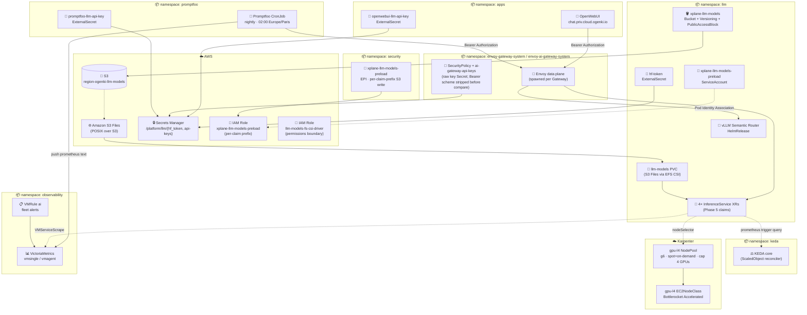
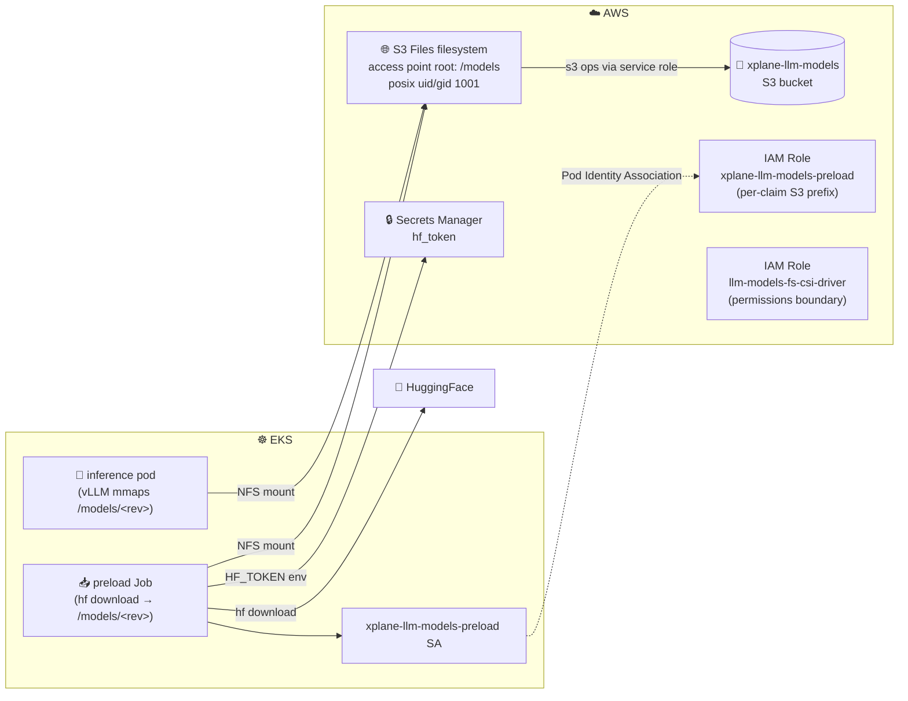

# Self-Hosted LLM Platform

This platform serves four self-hosted open-weights models from a single
NVIDIA L4 GPU NodePool, behind a Tailscale-fronted OpenAI-compatible
API with Bearer-token authentication. A Mixture-of-Models classifier
(invoked only on `model: MoM`) routes prompts to a specialty
(general / code / multilingual / reasoning); explicit `model: xplane-*`
requests bypass the classifier and go straight to the named upstream.
KEDA's `ScaledObject` scales each model `1→max` on **leading vLLM
saturation signals** (running-batch ratio + KV-cache utilisation —
[SPEC-001](specs/0001-llm-platform-prometheus-autoscaling/spec.md)).
LlamaGuard 3-1B sits in the fleet as the guardrail backstop;
output-side post-filtering currently has no first-class upstream hook
(see *[Open work](#open-work-post-merge--blocked)*).

It is built on top of the existing platform stack — no Knative, no
double-Envoy, no new XRD ecosystem. See
[ADR-0003](decisions/0003-vllm-production-stack-over-kserve.md) for the
architecture decision (vLLM Production Stack + Iris over KServe + llm-d)
and [ADR-0004](decisions/0004-amazon-s3-files-for-model-weights-storage.md)
for the model-weights storage choice (Amazon S3 Files POSIX mount).

## Request flow



Two routing modes:

1. **Client-deterministic** — clients send `model: xplane-<name>` directly. The AI Gateway body parser sets `x-ai-eg-model`, the AIGatewayRoute matches the header, and the request lands on the named vLLM Service. SR is not in the data path. Used by OpenCode CLI, Continue VSCode, and direct API consumers.
2. **SR cascade** — clients send `model: MoM`. The AIGatewayRoute extension calls SR's HTTP classifier (`POST /api/v1/classify/intent` on `:8080`); SR returns the chosen model id; the body parser rewrites `x-ai-eg-model` and dispatches. Used by OpenWebUI's default flow.

The AI Gateway enforces API-key authentication via Envoy Gateway's `SecurityPolicy.apiKeyAuth` (header `Authorization: Bearer <key>`). Keys are sourced from AWS Secrets Manager at `platform/llm/api-keys` and rendered as raw values into the gateway-side Secret by the ExternalSecret in `infrastructure/base/envoy-ai-gateway/` — Envoy Gateway strips the `Bearer ` scheme from the header before comparing the remainder against the stored value, so a Bearer-prefixed Secret would never match. Anonymous requests are rejected at the gateway.

Latency budget on warm models: classifier (~50ms, MoM only) + one GPU hop (~150-200ms TTFT on a warm L4 fp8) → p95 < 250ms end-to-end.

## Component layout



## Routing strategy — Hybrid (CL-1 rec C)

The router runs in **Hybrid mode** (`router.mode: hybrid`):

- **Direct dispatch** when the request already names a specific model (`model: xplane-<name>`). Skips the classifier entirely. Latency: gateway hop only.
- **Classifier dispatch** when the request uses the virtual `MoM` model id. The AIGatewayRoute extension calls SR's HTTP classifier (`POST /api/v1/classify/intent` on `:8080`); SR returns the model id; the body parser rewrites `x-ai-eg-model`. Latency adds ~50ms classifier round-trip.

Decisions for `MoM` requests (current SR config):

- `code` → `xplane-qwen-coder` (Qwen2.5-Coder-7B Instruct, function-calling)
- `math` / `physics` / `reasoning` → `xplane-qwen3-8b` (with `use_reasoning: true`)
- `multilingual` → `xplane-qwen3-8b`
- everything else → `xplane-qwen3-8b`
- `prompt_guard` (jailbreak / PII) → handled by SR's input-side `prompt_guard` plugin before model dispatch

The `code-fim` specialty (`xplane-qwen-coder-fim`) is reachable only by direct dispatch — it uses an OpenAI Completions API surface (FIM tokens), not Chat Completions, so the classifier never selects it.

Wired in [`infrastructure/base/vllm-semantic-router/helmrelease.yaml`](../infrastructure/base/vllm-semantic-router/helmrelease.yaml).

## Model fleet

| Claim | Model | Quantization | Tier | Specialty | min/max | Notes |
|-------|-------|--------------|------|-----------|---------|-------|
| `xplane-qwen-coder-fim` | Qwen/Qwen2.5-Coder-1.5B (Base) | fp8 | small | code-fim | 1 / 1 | FIM tab-completion (Continue inline). Always-warm; no scaling. |
| `xplane-qwen-coder` | Qwen/Qwen2.5-Coder-7B-Instruct | fp8 | medium | code | 1 / 2 | OpenCode primary + SR `code` cascade. Function-calling supported. |
| `xplane-qwen3-8b` | Qwen/Qwen3-8B | fp8 | medium | general | 1 / 2 | OpenWebUI default + multilingual + 32k context + math/reasoning + cascade fallback. |
| `xplane-llamaguard3-1b` | meta-llama/Llama-Guard-3-1B | fp16 | small | guardrail | 1 / 3 | Input jailbreak guardrail (SR `prompt_guard`); not user-facing. |

> **All models default `min=1`** ([SPEC-001](specs/0001-llm-platform-prometheus-autoscaling/spec.md)).
> KEDA scales `1→max` on leading saturation signals: `running/max-num-seqs`
> ratio (threshold 0.7) + `gpu_cache_usage_perc` (threshold 0.8). The
> autoscaler reacts ahead of saturation rather than after the queue
> forms, so end-to-end scale-up takes ~75-135s on a warm GPU node, ~3-5
> min if Karpenter has to provision a fresh node. Demo `min=0` per-claim
> overrides are still allowed (composition supports it) but accept the
> first-request failure mode (no queueing layer; client must retry).

Each claim is an [`InferenceService`](../infrastructure/base/crossplane/configuration/kcl/inference-service/README.md)
XR. The composition renders Deployment + Service + ServiceAccount + KEDA
`ScaledObject` + optional HTTPRoute + default-deny CiliumNetworkPolicy
(serving + preload) + ExternalSecrets + VMServiceScrape + per-model
VMRule + idempotent preload Job. No per-claim EPI is rendered — weights
flow via the shared S3 Files PVC, not the S3 API (ADR-0004).

## GPU foundation

```yaml
# infrastructure/base/karpenter-nodepools-gpu/gpu-l4-nodepool.yaml
limits:
  nvidia.com/gpu: "4"   # CL-6 rec A: hard cap
```

- **EC2NodeClass `gpu-l4`** — Bottlerocket Accelerated AMI (NVIDIA variant), instance store RAID0 for ephemeral container storage.
- **NodePool `gpu-l4`** — G6 family (NVIDIA L4 24Gi VRAM), spot+on-demand, taint `nvidia.com/gpu=true:NoSchedule`, hard cap `nvidia.com/gpu: 4`.
- **Cilium startup taint** so pods don't schedule before the Cilium agent is ready.

> **Cap math.** With 4 claims at `min=1`, the warm fleet steady state
> consumes the full `nvidia.com/gpu: 4` budget. KEDA scaling any claim
> above 1 replica requires another claim to scale down (or another L4
> to be provisioned by Karpenter — but the cap blocks this until a
> claim drops below 1, which `min=1` prevents). This is an intentional
> cost-ceiling decision (CL-6 rec A; see clarifications). The fleet's
> concurrency strategy is **vertical** (vLLM batching + KV cache reuse
> on a single GPU) up to `max-num-seqs`; horizontal scale-out kicks in
> only when running-ratio breaches 0.7. Raise the cap to 6-8 in
> `gpu-l4-nodepool.yaml` if traffic patterns show simultaneous
> sustained running-ratio breach across multiple claims.

### Cold-start behaviour

With S3 Files + always-warm fleet, cold-start applies in two scenarios:

1. **Karpenter provisioning a fresh L4 for scale-up** — under load when running-ratio breaches 0.7 and the warm pod's replica count needs to grow. ~60-90s for spot G6, plus image pull (~60s if not cached on the AMI), plus vLLM model load + KV cache warmup (~15-30s). End-to-end ~2-3 min.
2. **Per-claim `min=0` override** — demo cold-start scenario, intentional. The first request fails; the client retries after the model is ready. `kubectl scale deploy/xplane-<model> -n llm --replicas=1` pre-warms before the demo.

The `aws s3 sync` init-container path (~30-80s for 8 GB fp8 weights) was eliminated by ADR-0004: vLLM mmaps weights directly off the S3 Files POSIX mount.

## Storage & IAM

Weights flow through Amazon S3 Files (POSIX-over-S3) — see [ADR-0004](decisions/0004-amazon-s3-files-for-model-weights-storage.md).



- **Mount**: every InferenceService pod (and the preload Job) mounts the shared `llm-models` PVC at `/models` with `subPath: <claim-name>`. The S3 Files access point exposes `/models/<claim>/<revision>/` to the pod as `/models/<revision>/`.
- **Pod IAM**: serving pods need no IAM — reads happen through the NFS mount and are gated by the S3 Files filesystem policy (only the CSI driver role can mount). The CSI driver role has a permissions boundary (`opentofu/llm-platform/iam.tf`) constraining it to this filesystem's ARN.
- **Preload IAM**: the writable `xplane-llm-models-preload` EPI is scoped to per-claim S3 prefixes (`models/xplane-<claim>/*`), preventing cross-claim weight overwrites. The 4 claim prefixes are enumerated in `security/base/epis-llm/llm-models-preload.yaml` — append a new entry when adding a claim.
- **HuggingFace token**: stored once at `/platform/llm/hf_token`, rendered into a `hf-token` Secret in the `llm` namespace via ESO. Claims reference it via `spec.envFromSecrets: [hf-token]` (preload Job consumer; serving pods don't need it post-preload).

The preload Job is **idempotent**: a marker file (`.preload-complete` matching `<repo>@<revision>`) plus a `config.json` + `.incomplete`-cache check short-circuit re-downloads. See `_preloadCommand` in `inference-service/main.k`.

## Observability & Evaluation

| Layer | Source | Sink | Rendered by |
|-------|--------|------|-------------|
| Per-pod metrics | vLLM `/metrics` (Prometheus exposition) | VictoriaMetrics | InferenceService composition (`VMServiceScrape`) |
| Per-model alerts | `vllm:e2e_request_latency_seconds_bucket`, `vllm:request_failure_total` | `VMRule` (cold-start budget + 5% error rate) | InferenceService composition |
| Fleet-level alerts | aggregate across claims | [`vmrules/ai.yaml`](../observability/base/victoria-metrics-k8s-stack/vmrules/ai.yaml) | Static manifest |
| SLO breach alerts (LAGGING — not scale triggers) | `num_requests_waiting`, error budget | [`vmrule-llm-slo.yaml`](../apps/base/ai/llm/vmrule-llm-slo.yaml) | Static manifest |
| Eval pass-rate | Promptfoo `--output json` → node parser → Prometheus text | VictoriaMetrics push (`/api/v1/import/prometheus`) | [`tooling/base/promptfoo/cronjob.yaml`](../tooling/base/promptfoo/cronjob.yaml) |
| Logs | container stdout (JSON) | VictoriaLogs | container runtime |
| Grafana dashboards | 23-panel "LLM Platform" + Promptfoo + KEDA | Grafana | [`apps/base/ai/llm/grafana-dashboard.yaml`](../apps/base/ai/llm/grafana-dashboard.yaml) |

The Promptfoo CronJob runs nightly at 02:00 Europe/Paris (CL-4 rec A)
against the AI Gateway directly (Bearer-token auth), emitting:

- `promptfoo_test_pass_rate{category}` — per-category pass rate (gauge)
- `promptfoo_test_total{category}` / `promptfoo_test_failed{category}` — raw counts
- `promptfoo_run_duration_seconds`, `promptfoo_run_timestamp_seconds` — pipeline health

The fleet `VMRule` fires `PromptfooRegression` if any category drops below 0.85 for 1h, and `PromptfooStale` if no push has been received for >36h.

## Security posture

Constitution-aligned:

- **Default-deny CiliumNetworkPolicy** on every model pod (rendered by the composition). Egress on the serving pod: DNS only (no S3 — weights via CSI mount; no AWS API — no IAM binding). Egress on the preload Job: DNS, HuggingFace API, AWS API (EKS Pod Identity Agent on `host:80`).
- **EKS Pod Identity** for AWS access (ADR-0002). No long-lived credentials in pods.
- **Default-deny CiliumNetworkPolicy** on the SR, AI Gateway, KEDA, OpenWebUI, and Promptfoo.
- **API-key authentication** at the Envoy AI Gateway via `SecurityPolicy.apiKeyAuth` — Bearer header, ForwardClientIDHeader for per-tenant audit, sanitize=true so vLLM never sees client API keys.
- **All Secrets** flow through External Secrets Operator backed by AWS Secrets Manager.
- **Container security context** on every pod: `runAsNonRoot`, `readOnlyRootFilesystem`, `allowPrivilegeEscalation: false`, `capabilities.drop: [ALL]`, `seccompProfile: RuntimeDefault`.
- **SR built-in chart plugins** handle the input path: `prompt_guard` (jailbreak detection), `classifier.pii_model` (PII redaction), `semantic_cache`.
- **LlamaGuard post-filter** (CL-2 rec A) — *deferred*. The upstream chart has no first-class output-side guardrail hook; LlamaGuard is provisioned in the fleet (specialty `guardrail`) and reachable via direct dispatch, so output filtering can be wired later as an application-layer middleware or a custom `decisions[].plugins[]` chain.

## Adding a new model

1. **Reserve an API-key prefix in AWS Secrets Manager** if the new model needs a distinct client identity (otherwise reuse an existing key).
2. **Drop a claim into `apps/base/ai/llm/<model-slug>.yaml`**:

   ```yaml
   apiVersion: cloud.ogenki.io/v1alpha1
   kind: InferenceService
   metadata:
     name: xplane-<model-slug>
     namespace: llm
   spec:
     model:
       repository: <hf-org>/<hf-repo>
       revision: <commit-sha>      # pin for reproducible preload
       quantization: fp8
       contextWindow: 16384
       maxNumSeqs: 32              # vLLM batch cap; running-ratio denominator
       preload:
         enabled: true
     gpu:
       count: 1
     routing:
       tier: small | medium | large
       specialty: general | code | math | guardrail | multilingual
     scaling:
       minReplicas: 1              # SPEC-001 default
       maxReplicas: 2
     envFromSecrets:
       - hf-token
   ```

3. **Wire into the kustomization** — add the file to [`apps/base/ai/llm/kustomization.yaml`](../apps/base/ai/llm/kustomization.yaml).
4. **Append the claim's S3 prefix** to the per-claim list in [`security/base/epis-llm/llm-models-preload.yaml`](../security/base/epis-llm/llm-models-preload.yaml) — both `ListBucketScopedToClaims` and `ReadObjects` / `WriteObjects` need the new prefix.
5. **Add a `Backend` + `AIServiceBackend` + AIGatewayRoute rule** in [`apps/base/ai/llm/ai-gateway-routes/route.yaml`](../apps/base/ai/llm/ai-gateway-routes/route.yaml).
6. **Register with the Semantic Router** (only if you want it in the `MoM` cascade — direct-dispatch claims don't need this) — add an entry to the `models:` list in [`infrastructure/base/vllm-semantic-router/helmrelease.yaml`](../infrastructure/base/vllm-semantic-router/helmrelease.yaml).
7. **Commit and let Flux reconcile.** The InferenceService composition renders the workload + KEDA + CNP + observability; the preload Job runs once to populate weights.

## Reference

- [`docs/specs/0001-llm-platform-prometheus-autoscaling/spec.md`](specs/0001-llm-platform-prometheus-autoscaling/spec.md) — autoscaling redesign (the change behind every `min=1` claim and the `ScaledObject` triggers)
- [`docs/decisions/0003-vllm-production-stack-over-kserve.md`](decisions/0003-vllm-production-stack-over-kserve.md) — vLLM PS over KServe + llm-d
- [`docs/decisions/0004-amazon-s3-files-for-model-weights-storage.md`](decisions/0004-amazon-s3-files-for-model-weights-storage.md) — model-weights mount via S3 Files
- [`docs/architecture/README.md`](architecture/README.md) — request flow + key resources (textual companion to the drawio diagram)
- [`docs/coding-clients.md`](coding-clients.md) — OpenCode / Continue / OpenWebUI client configuration (auth, smoke tests, troubleshooting)
- [`infrastructure/base/crossplane/configuration/kcl/inference-service/README.md`](../infrastructure/base/crossplane/configuration/kcl/inference-service/README.md) — composition API + examples
- [vLLM Production Stack](https://github.com/vllm-project/production-stack)
- [vLLM Semantic Router (Iris)](https://vllm.ai/blog/vllm-sr-iris)

## Open work (post-merge / blocked)

| Task | Blocker | Trigger to unblock |
|------|---------|--------------------|
| T020 — `aws iam simulate-principal-policy` against the live EPI roles | Needs cluster + AWS access | After cluster apply (post-merge) |
| T040–T041 — Promptfoo regression-injection test + cost panel cross-check | None — engineering work | When the eval suite needs strengthening |
| Drop the vLLM Production Stack HelmRelease (currently a no-op) | Architecture decision (ADR-0003 referenced it but the front-line router is Iris alone) | Follow-up PR after first deploy validates the architecture |
| Shared `kcl/_lib/` module across compositions | Touches App composition too | When the App composition gets its next breaking change |
| LlamaGuard post-filter wiring (CL-2 rec A) | No first-class output hook in upstream chart | Upstream feature, custom `decisions[].plugins[]` chain, or app-layer middleware |
| Per-claim S3 read EPIs → one shared role | EPI XRD multi-SA binding | EPI XRD enhancement |
| Per-tenant API keys for human users | Currently the `openwebui_apikey` is the de-facto shared key | Onboard per-user keys via SM JSON when team scale warrants it |
| vLLM image pre-bake into GPU AMI | Cold-start optimization target if KEDA scale-up consistently times out the SLO | After SPEC-001 validation in production traffic patterns |
| Pure cascade routing (always-tiny-first, escalate on confidence drop) | No `cascade.confidenceThreshold` hook in upstream chart | Custom `decisions[].plugins[]` chain |
