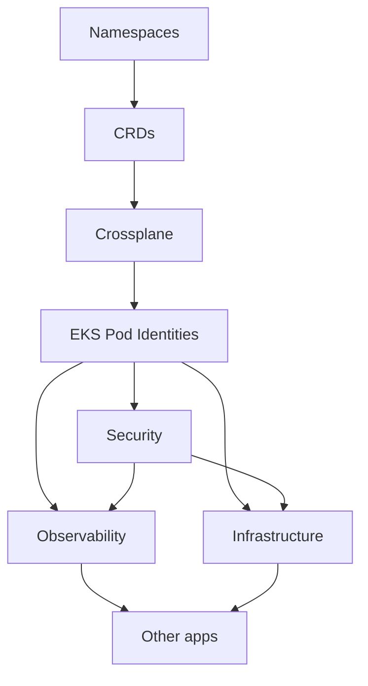

# GitOps with Flux

This document explains how GitOps works in this platform using Flux CD.

## What is GitOps?

GitOps is a way of managing infrastructure and applications where:

1. **Git is the source of truth**: Everything is declared in Git
2. **Automated synchronization**: Controllers ensure cluster matches Git
3. **Declarative**: Describe desired state, not imperative steps
4. **Auditable**: Git history provides complete audit trail
5. **Recoverable**: Disaster recovery is as simple as pointing Flux at Git

## Why Flux?

We chose Flux over other GitOps tools because:

- **Kubernetes-native**: Uses CRDs and controllers, not external services
- **Security**: GitHub App authentication, no long-lived tokens
- **Dependency management**: Built-in support for resource dependencies
- **Health checking**: Waits for resources to be ready before proceeding
- **CNCF project**: Strong community, production-proven

**Related**: [Technology Choices - Flux for GitOps](./technology-choices.md#flux-for-gitops)

## Flux Dependency Hierarchy

Flux deploys resources in a specific order based on dependencies. This ensures that foundational components are ready before dependent resources are created.



### Dependency Layers Explained

#### 1. Namespaces

**Why first?** All other resources are scoped to namespaces.

```yaml
# clusters/mycluster-0/namespaces.yaml
apiVersion: kustomize.toolkit.fluxcd.io/v1
kind: Kustomization
metadata:
  name: namespaces
  namespace: flux-system
spec:
  interval: 10m
  path: ./infrastructure/base/namespaces
  prune: true
  sourceRef:
    kind: GitRepository
    name: flux-system
```

#### 2. CRDs (Custom Resource Definitions)

**Why second?** CRDs must exist before any custom resources can be created.

```yaml
# clusters/mycluster-0/crds.yaml
apiVersion: kustomize.toolkit.fluxcd.io/v1
kind: Kustomization
metadata:
  name: crds
  namespace: flux-system
spec:
  interval: 10m
  path: ./crds/base
  prune: false  # Never prune CRDs to avoid data loss
  sourceRef:
    kind: GitRepository
    name: flux-system
  dependsOn:
    - name: namespaces  # Wait for namespaces
```

**Note**: `prune: false` prevents accidental deletion of CRDs and their associated resources.

#### 3. Crossplane

**Why third?** Crossplane controllers must be running before creating infrastructure resources.

```yaml
# clusters/mycluster-0/crossplane.yaml
apiVersion: kustomize.toolkit.fluxcd.io/v1
kind: Kustomization
metadata:
  name: crossplane
  namespace: flux-system
spec:
  interval: 10m
  path: ./infrastructure/base/crossplane
  prune: true
  sourceRef:
    kind: GitRepository
    name: flux-system
  dependsOn:
    - name: crds  # CRDs must exist
  healthChecks:
    - apiVersion: apps/v1
      kind: Deployment
      name: crossplane
      namespace: crossplane-system
```

#### 4. EKS Pod Identities

**Why fourth?** IAM roles must exist before applications can use AWS APIs.

```yaml
# clusters/mycluster-0/epis.yaml
apiVersion: kustomize.toolkit.fluxcd.io/v1
kind: Kustomization
metadata:
  name: epis
  namespace: flux-system
spec:
  interval: 10m
  path: ./security/base/epis
  prune: true
  sourceRef:
    kind: GitRepository
    name: flux-system
  dependsOn:
    - name: crossplane  # Crossplane must be ready
  healthChecks:
    - apiVersion: cloud.ogenki.io/v1alpha1
      kind: EKSPodIdentity
      name: '*'
      namespace: '*'
```

**Health Check**: Uses CEL (Common Expression Language) to ensure all EPIs are ready:
```yaml
# Custom condition checking
- type: Ready
  status: "True"
```

#### 5. Security

**Why fifth?** Security components (External Secrets, cert-manager, Kyverno) needed by infrastructure and apps.

```yaml
# clusters/mycluster-0/security.yaml
apiVersion: kustomize.toolkit.fluxcd.io/v1
kind: Kustomization
metadata:
  name: security
  namespace: flux-system
spec:
  interval: 10m
  path: ./security/mycluster-0
  prune: true
  sourceRef:
    kind: GitRepository
    name: flux-system
  dependsOn:
    - name: epis  # IAM roles for External Secrets
```

**Key Components**:
- **External Secrets Operator**: Syncs secrets from AWS Secrets Manager / OpenBao
- **cert-manager**: TLS certificate management
- **Kyverno**: Policy enforcement
- **ZITADEL**: Identity and access management

#### 6. Infrastructure

**Why sixth?** Core infrastructure (networking, DNS, storage) needed by applications.

```yaml
# clusters/mycluster-0/infrastructure.yaml
apiVersion: kustomize.toolkit.fluxcd.io/v1
kind: Kustomization
metadata:
  name: infrastructure
  namespace: flux-system
spec:
  interval: 10m
  path: ./infrastructure/mycluster-0
  prune: true
  sourceRef:
    kind: GitRepository
    name: flux-system
  dependsOn:
    - name: security  # External Secrets needed
    - name: epis      # IAM roles needed
```

**Key Components**:
- **Cilium**: Networking and network policies
- **External DNS**: Route53 synchronization
- **Gateway API**: Ingress controllers
- **Karpenter**: Node autoscaling

#### 7. Observability

**Why seventh?** Monitoring stack depends on infrastructure and security.

```yaml
# clusters/mycluster-0/observability.yaml
apiVersion: kustomize.toolkit.fluxcd.io/v1
kind: Kustomization
metadata:
  name: observability
  namespace: flux-system
spec:
  interval: 10m
  path: ./observability/mycluster-0
  prune: true
  sourceRef:
    kind: GitRepository
    name: flux-system
  dependsOn:
    - name: infrastructure  # Gateway, DNS needed
    - name: security        # Secrets, certificates needed
```

**Key Components**:
- **VictoriaMetrics**: Metrics collection and storage
- **VictoriaLogs**: Log aggregation
- **Grafana Operator**: Dashboards and datasources

#### 8. Applications

**Why last?** Apps depend on all platform services.

```yaml
# clusters/mycluster-0/apps.yaml (example)
apiVersion: kustomize.toolkit.fluxcd.io/v1
kind: Kustomization
metadata:
  name: apps
  namespace: flux-system
spec:
  interval: 10m
  path: ./apps/mycluster-0
  prune: true
  sourceRef:
    kind: GitRepository
    name: flux-system
  dependsOn:
    - name: infrastructure  # Networking needed
    - name: observability   # Monitoring needed
```

## Directory Structure

```
.
├── flux/                       # Flux operator and core components
│   ├── base/
│   │   ├── flux-operator/     # Flux installation
│   │   ├── flux-instance/     # Flux configuration
│   │   └── notifications/     # Alert providers
│   └── mycluster-0/
│       └── kustomization.yaml
│
├── clusters/                   # Cluster-specific Kustomizations
│   └── mycluster-0/
│       ├── namespaces.yaml    # Layer 1
│       ├── crds.yaml          # Layer 2
│       ├── crossplane.yaml    # Layer 3
│       ├── epis.yaml          # Layer 4
│       ├── security.yaml      # Layer 5
│       ├── infrastructure.yaml # Layer 6
│       ├── observability.yaml  # Layer 7
│       └── tooling.yaml       # Layer 8
│
├── infrastructure/             # Infrastructure resources
│   ├── base/                  # Base configurations
│   │   ├── namespaces/
│   │   ├── crossplane/
│   │   ├── cilium/
│   │   ├── gapi/              # Gateway API
│   │   └── external-dns/
│   └── mycluster-0/           # Cluster-specific overrides
│       └── kustomization.yaml
│
├── security/                   # Security resources
│   ├── base/
│   │   ├── epis/              # EKS Pod Identities
│   │   ├── external-secrets/
│   │   ├── cert-manager/
│   │   ├── kyverno/
│   │   └── zitadel/
│   └── mycluster-0/
│
├── observability/              # Observability resources
│   ├── base/
│   │   ├── victoriametrics/
│   │   ├── victorialogs/
│   │   └── grafana/
│   └── mycluster-0/
│
└── tooling/                    # Platform tools
    ├── base/
    │   ├── harbor/
    │   ├── headlamp/
    │   └── homepage/
    └── mycluster-0/
```

## Substitutions and Variables

Flux supports variable substitution from ConfigMaps and Secrets. This enables cluster-specific configuration without duplicating manifests.

### ConfigMap Substitution

**Source**: `clusters/mycluster-0/cluster-vars-configmap.yaml`

```yaml
apiVersion: v1
kind: ConfigMap
metadata:
  name: eks-mycluster-0-vars
  namespace: flux-system
data:
  cluster_name: mycluster-0
  cluster_region: eu-west-3
  domain: priv.cloud.ogenki.io
  vpc_cidr: 10.0.0.0/16
```

**Usage in Kustomization**:

```yaml
apiVersion: kustomize.toolkit.fluxcd.io/v1
kind: Kustomization
metadata:
  name: infrastructure
  namespace: flux-system
spec:
  # ... other fields ...
  postBuild:
    substitute:
      cluster_name: "${cluster_name}"
      domain: "${domain}"
    substituteFrom:
      - kind: ConfigMap
        name: eks-mycluster-0-vars
```

**Usage in Manifests**:

```yaml
apiVersion: gateway.networking.k8s.io/v1
kind: Gateway
metadata:
  name: platform-tailscale
  namespace: infrastructure
spec:
  gatewayClassName: cilium-tailscale
  listeners:
    - name: https
      hostname: "*.${domain}"  # Substituted to "*.priv.cloud.ogenki.io"
      port: 443
      protocol: HTTPS
```

### Secret Substitution

**Use case**: Sensitive values like API keys, tokens, passwords.

```yaml
apiVersion: kustomize.toolkit.fluxcd.io/v1
kind: Kustomization
metadata:
  name: apps
  namespace: flux-system
spec:
  # ... other fields ...
  postBuild:
    substituteFrom:
      - kind: Secret
        name: app-secrets
        optional: false  # Fail if secret doesn't exist
```

**Security Note**: Secrets in Git should be encrypted (e.g., SOPS) or created by External Secrets Operator.

## Health Checks

Flux can wait for specific resources to be healthy before proceeding with dependent Kustomizations.

### Deployment Health Check

```yaml
healthChecks:
  - apiVersion: apps/v1
    kind: Deployment
    name: crossplane
    namespace: crossplane-system
```

**Checks**:
- Deployment exists
- Desired replicas match ready replicas
- No failed pods

### HelmRelease Health Check

```yaml
healthChecks:
  - apiVersion: helm.toolkit.fluxcd.io/v2
    kind: HelmRelease
    name: cilium
    namespace: kube-system
```

**Checks**:
- HelmRelease is in `Ready` state
- Underlying resources are healthy
- No rollback occurred

### Custom Resource Health Check

```yaml
healthChecks:
  - apiVersion: cloud.ogenki.io/v1alpha1
    kind: EKSPodIdentity
    name: '*'  # All EPIs in all namespaces
    namespace: '*'
```

**Uses CEL** (Common Expression Language) for custom conditions:
```yaml
# In the CRD definition
status:
  conditions:
    - type: Ready
      status: "True"
      reason: AvailableStatusReady
```

## Common Flux Operations

### Check All Resources

```bash
# View all Flux resources
flux get all

# View specific types
flux get kustomizations
flux get helmreleases
flux get sources git
```

### Force Reconciliation

```bash
# Reconcile a specific Kustomization
flux reconcile kustomization infrastructure

# Reconcile a HelmRelease
flux reconcile helmrelease cilium -n kube-system

# Reconcile a GitRepository
flux reconcile source git flux-system
```

### Suspend and Resume

**Use case**: Prevent Flux from making changes during maintenance

```bash
# Suspend all Kustomizations
flux suspend kustomization --all

# Suspend specific Kustomization
flux suspend kustomization apps

# Resume
flux resume kustomization --all
flux resume kustomization apps
```

### Debug Failures

```bash
# Get detailed status
flux get kustomization infrastructure

# View events
flux events --for Kustomization/infrastructure

# Check logs
flux logs --kind=kustomization --name=infrastructure
```

### Trace Dependencies

```bash
# Show dependency tree
flux tree kustomization apps

# Expected output:
# Kustomization/flux-system/apps
# └── Kustomization/flux-system/infrastructure
#     └── Kustomization/flux-system/security
#         └── Kustomization/flux-system/epis
#             └── Kustomization/flux-system/crossplane
#                 └── Kustomization/flux-system/crds
#                     └── Kustomization/flux-system/namespaces
```

## Flux Notifications

Flux can send notifications on sync events, failures, and warnings.

### Slack Notifications

```yaml
# flux/base/notifications/slack-alert.yaml
apiVersion: notification.toolkit.fluxcd.io/v1beta3
kind: Alert
metadata:
  name: slack
  namespace: flux-system
spec:
  providerRef:
    name: slack
  eventSeverity: info
  eventSources:
    - kind: Kustomization
      name: '*'
    - kind: HelmRelease
      name: '*'
```

**Provider**:
```yaml
apiVersion: notification.toolkit.fluxcd.io/v1beta3
kind: Provider
metadata:
  name: slack
  namespace: flux-system
spec:
  type: slack
  channel: "#gitops-notifications"
  secretRef:
    name: slack-webhook-url  # From External Secrets
```

## GitOps Workflow

### Making Changes

1. **Create Branch**
   ```bash
   git checkout -b feature/update-app
   ```

2. **Make Changes**
   ```bash
   # Edit manifests
   vim infrastructure/base/cilium/helmrelease.yaml
   ```

3. **Validate Locally**
   ```bash
   # Run pre-commit hooks
   pre-commit run --all-files

   # Validate with kubeconform
   kubeconform infrastructure/base/cilium/
   ```

4. **Commit and Push**
   ```bash
   git add .
   git commit -m "feat: update Cilium to v1.15"
   git push origin feature/update-app
   ```

5. **Create Pull Request**
   - CI validates changes
   - Reviewers approve
   - Merge to main

6. **Flux Syncs Automatically**
   ```bash
   # Flux detects changes (default: 1 minute)
   # Reconciles affected Kustomizations
   # Health checks ensure successful deployment
   ```

### Rollback

**Git-based rollback** (recommended):
```bash
# Revert commit
git revert <commit-hash>
git push origin main

# Flux will automatically apply the previous state
```

**Manual rollback**:
```bash
# Suspend to prevent Flux from re-applying
flux suspend kustomization apps

# Manually revert changes
kubectl rollout undo deployment/myapp -n apps

# Resume when ready
flux resume kustomization apps
```

## Bootstrap New Cluster

To bootstrap Flux on a new cluster:

```bash
# 1. Export GitHub token
export GITHUB_TOKEN=<your-token>

# 2. Bootstrap Flux
flux bootstrap github \
  --owner=Smana \
  --repository=cloud-native-ref \
  --branch=main \
  --path=clusters/new-cluster \
  --personal

# 3. Flux installs itself and starts reconciling
```

**Alternative**: Use Flux Operator (current approach in this repo)

```bash
# Install Flux Operator
kubectl apply -f flux/base/flux-operator/

# Create FluxInstance
kubectl apply -f flux/base/flux-instance/
```

## Flux Security

### GitHub App Authentication

**Why?** More secure than personal access tokens:
- Fine-grained repository access
- Can be scoped to specific repositories
- Easier to rotate and audit

**Setup**:
1. Create GitHub App in repository settings
2. Store credentials in AWS Secrets Manager
3. External Secrets syncs to Kubernetes Secret
4. FluxInstance references Secret

### RBAC

Flux controllers run with least privilege:
- Can only reconcile resources in allowed namespaces
- Cannot modify cluster-wide resources (except CRDs)
- Service accounts scoped per controller

### Secret Management

**Never commit secrets to Git!**

```yaml
# ❌ BAD: Secret in Git
apiVersion: v1
kind: Secret
metadata:
  name: api-key
data:
  key: bXktc2VjcmV0  # Base64 is not encryption!

# ✅ GOOD: External Secret
apiVersion: external-secrets.io/v1beta1
kind: ExternalSecret
metadata:
  name: api-key
spec:
  secretStoreRef:
    name: aws-secrets-manager
  target:
    name: api-key
  data:
    - secretKey: key
      remoteRef:
        key: /apps/myapp/api-key
```

## Troubleshooting

### Kustomization Not Reconciling

```bash
# Check status
flux get kustomization infrastructure

# Common issues:
# 1. Dependency not ready
#    → Check dependsOn Kustomizations
# 2. Health check failing
#    → Investigate unhealthy resources
# 3. Validation error
#    → Check flux logs for YAML errors
```

### HelmRelease Stuck

```bash
# Check HelmRelease
flux get helmrelease cilium -n kube-system

# Common issues:
# 1. Values error
#    → Validate Helm values syntax
# 2. Chart not found
#    → Check HelmRepository sync
# 3. Upgrade timeout
#    → Increase .spec.timeout
```

### Resource Not Created

```bash
# Check if Flux created it
kubectl get <resource> -n <namespace>

# If not, check Kustomization
flux describe kustomization <name>

# Look for:
# - Prune settings (might delete unexpected resources)
# - Namespace issues (resource in wrong namespace)
# - RBAC (Flux lacks permissions)
```

## Best Practices

1. **Use Dependencies**: Ensure proper ordering with `dependsOn`
2. **Health Checks**: Always check critical resources are ready
3. **Immutable Infrastructure**: Don't manually modify cluster resources
4. **Small Changes**: Commit frequently, deploy incrementally
5. **Test in Dev**: Validate changes in development cluster first
6. **Monitor Flux**: Set up notifications for failures
7. **Document Decisions**: Explain non-obvious dependencies in comments

## Related Documentation

- [Technology Choices](./technology-choices.md) - Why Flux
- [Crossplane](./crossplane.md) - Infrastructure compositions
- [CI Workflows](./ci-workflows.md) - Validation before merge
- [Flux Documentation](https://fluxcd.io/flux/)
