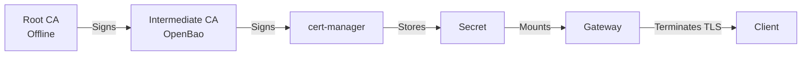

# Ingress and Network Access

This document explains how external traffic reaches applications in this platform, covering Gateway API, TLS certificates, and private access via Tailscale.

## Overview

This platform uses modern, Kubernetes-native approaches for ingress:

- **Gateway API**: Modern replacement for Ingress resources
- **Cilium**: Gateway API controller using eBPF
- **OpenBao PKI**: Private Certificate Authority for TLS
- **cert-manager**: Automated certificate lifecycle management
- **Tailscale**: Secure VPN access to private services

## Gateway API

### Why Gateway API over Ingress?

**Traditional Ingress Limitations**:
- Limited routing capabilities (only host/path)
- No standard for Layer 4 (TCP/UDP)
- Vendor-specific annotations for advanced features
- No clear separation of concerns (infrastructure vs application)

**Gateway API Advantages**:
- ✅ Rich HTTP routing (headers, query parameters, weighted traffic)
- ✅ Multi-protocol support (HTTP, HTTPS, TCP, UDP, TLS)
- ✅ Role-based separation (GatewayClass, Gateway, HTTPRoute)
- ✅ First-class TLS management
- ✅ Kubernetes SIG-maintained standard

**Related**: [Technology Choices - Gateway API](./technology-choices.md#gateway-api-over-traditional-ingress)

### Gateway API Resources

#### GatewayClass

Defines the controller that will handle Gateways (installed by infrastructure team).

```yaml
apiVersion: gateway.networking.k8s.io/v1
kind: GatewayClass
metadata:
  name: cilium
spec:
  controllerName: io.cilium/gateway-controller
```

**In this platform**: Cilium provides the GatewayClass.

#### Gateway

Infrastructure-level resource defining listeners and TLS configuration (managed by platform team).

```yaml
apiVersion: gateway.networking.k8s.io/v1
kind: Gateway
metadata:
  name: platform-tailscale
  namespace: infrastructure
spec:
  gatewayClassName: cilium-tailscale
  listeners:
    - name: https
      hostname: "*.priv.cloud.ogenki.io"
      port: 443
      protocol: HTTPS
      tls:
        mode: Terminate
        certificateRefs:
          - name: private-gateway-tls  # From cert-manager/OpenBao
```

**Types of Gateways**:

**Shared Platform Gateway**: Used by multiple applications
```yaml
# infrastructure/base/gapi/platform-tailscale-gateway.yaml
# *.priv.cloud.ogenki.io
# Exposed via Tailscale VPN with custom domains
# Shared by Grafana, Harbor, Headlamp, etc.
```

**Dedicated Gateway**: One application gets its own Gateway
```yaml
# Created by App composition when spec.ingress.gateway: "dedicated"
# Useful for applications needing custom listeners or isolation
```

#### HTTPRoute

Application-level resource defining routing rules (managed by application teams).

```yaml
apiVersion: gateway.networking.k8s.io/v1
kind: HTTPRoute
metadata:
  name: grafana
  namespace: observability
spec:
  parentRefs:
    - name: platform-tailscale
      namespace: infrastructure
  hostnames:
    - "grafana.priv.cloud.ogenki.io"
  rules:
    - matches:
        - path:
            type: PathPrefix
            value: /
      backendRefs:
        - name: grafana
          port: 3000
```

**Advanced Routing Examples**:

**Path-based routing**:
```yaml
rules:
  - matches:
      - path:
          type: PathPrefix
          value: /api
    backendRefs:
      - name: api-service
        port: 8080
  - matches:
      - path:
          type: PathPrefix
          value: /
    backendRefs:
      - name: web-service
        port: 80
```

**Header-based routing**:
```yaml
rules:
  - matches:
      - headers:
          - name: X-Version
            value: v2
    backendRefs:
      - name: app-v2
        port: 8080
```

**Weighted traffic splitting** (canary deployments):
```yaml
rules:
  - backendRefs:
      - name: app-v1
        port: 8080
        weight: 90
      - name: app-v2
        port: 8080
        weight: 10  # 10% traffic to new version
```

## TLS Certificate Management

### Three-Tier PKI Architecture

This platform uses a three-tier Private Key Infrastructure with OpenBao:

```
Root CA (offline, 10-year validity)
  └── Intermediate CA (online, 5-year validity)
        └── Leaf Certificates (automated, 90-day validity)
```

**Why Three Tiers?**
1. **Root CA**: Kept offline for maximum security, only used to sign intermediate
2. **Intermediate CA**: Online in OpenBao, signs leaf certificates
3. **Leaf Certificates**: Automated by cert-manager, used by services

**Security Benefits**:
- Root CA compromise requires physical access
- Intermediate CA can be revoked without re-issuing root
- Short-lived leaf certificates limit exposure window

### OpenBao PKI Setup

OpenBao provides the Intermediate CA for signing certificates.

**High Availability**: 5-node Raft cluster
- SPOT instances for cost efficiency
- Auto-unseal for ephemeral nodes
- Mixed instance types (m7a, m7i, m6i families)

**Access**:
```bash
export VAULT_ADDR=https://bao.priv.cloud.ogenki.io:8200
export VAULT_SKIP_VERIFY=true
bao status
```

**PKI Hierarchy**:
```bash
# Root CA (created once, stored offline)
bao secrets enable -path=pki/root pki
bao secrets tune -max-lease-ttl=87600h pki/root

# Intermediate CA (online, signs certificates)
bao secrets enable -path=pki/priv_cloud_ogenki_io pki
bao secrets tune -max-lease-ttl=43800h pki/priv_cloud_ogenki_io

# Role for cert-manager (defines certificate properties)
bao write pki/priv_cloud_ogenki_io/roles/priv-cloud-ogenki-io \
  allowed_domains="priv.cloud.ogenki.io" \
  allow_subdomains=true \
  max_ttl=2160h  # 90 days
```

**Related**: [OpenBao PKI Documentation](../opentofu/openbao/management/docs/getting_started.md)

### cert-manager Integration

cert-manager automates certificate requests from OpenBao.

#### AppRole Authentication

cert-manager uses OpenBao AppRole for authentication (not tokens):

**Why AppRole?**
- Machine-friendly authentication method
- Supports secret rotation
- Can be scoped to specific paths
- Better audit trail than tokens

**Setup**:
```bash
# Create AppRole for cert-manager
bao auth enable approle
bao write auth/approle/role/cert-manager \
  token_policies="cert-manager" \
  token_ttl=20m \
  token_max_ttl=30m
```

**Credentials** stored in AWS Secrets Manager:
```json
{
  "role_id": "xxxxx",
  "secret_id": "yyyyy"
}
```

Synced to Kubernetes via External Secrets Operator.

#### ClusterIssuer

Defines how cert-manager talks to OpenBao:

```yaml
apiVersion: cert-manager.io/v1
kind: ClusterIssuer
metadata:
  name: openbao-priv-cloud-ogenki-io
spec:
  vault:
    server: https://bao.priv.cloud.ogenki.io:8200
    path: pki/priv_cloud_ogenki_io/sign/priv-cloud-ogenki-io
    auth:
      appRole:
        path: approle
        roleId: "<from-secret>"
        secretRef:
          name: cert-manager-openbao-approle
          key: secret_id
```

#### Certificate Resource

Request a certificate from OpenBao:

```yaml
apiVersion: cert-manager.io/v1
kind: Certificate
metadata:
  name: wildcard-priv-cloud-ogenki-io
  namespace: infrastructure
spec:
  secretName: wildcard-priv-cloud-ogenki-io
  issuerRef:
    name: openbao-priv-cloud-ogenki-io
    kind: ClusterIssuer
  commonName: "*.priv.cloud.ogenki.io"
  dnsNames:
    - "*.priv.cloud.ogenki.io"
    - "priv.cloud.ogenki.io"
  duration: 2160h  # 90 days
  renewBefore: 720h  # Renew 30 days before expiry
```

**cert-manager automatically**:
1. Authenticates to OpenBao via AppRole
2. Requests certificate for specified domains
3. Stores certificate + private key in Secret
4. Renews certificate before expiry

#### Using Certificate in Gateway

Reference the Secret created by cert-manager:

```yaml
apiVersion: gateway.networking.k8s.io/v1
kind: Gateway
metadata:
  name: platform-tailscale
  namespace: infrastructure
spec:
  gatewayClassName: cilium-tailscale
  listeners:
    - name: https
      hostname: "*.priv.cloud.ogenki.io"
      port: 443
      protocol: HTTPS
      tls:
        mode: Terminate
        certificateRefs:
          - name: private-gateway-tls  # From Certificate resource
```

**Gateway watches Secret**: When cert-manager renews the certificate, Gateway automatically picks up the new certificate.

## Certificate Lifecycle Flow



**Step-by-step**:
1. Administrator creates Root CA (one-time, offline)
2. Root CA signs Intermediate CA CSR
3. Intermediate CA loaded into OpenBao
4. cert-manager requests certificate via AppRole
5. OpenBao signs certificate with Intermediate CA
6. cert-manager stores in Kubernetes Secret
7. Gateway references Secret for TLS termination
8. Before expiry, cert-manager automatically renews

## Tailscale VPN

### Why Tailscale?

Many platform services should not be publicly accessible:
- Grafana (observability dashboards)
- Harbor (container registry)
- Headlamp (Kubernetes web UI)
- Kubernetes API Server (cluster control plane)

Traditional solutions:
- ❌ Bastion hosts (complex, additional attack surface)
- ❌ VPN servers (OpenVPN, WireGuard setup complexity)
- ❌ Public exposure + IP allowlisting (brittle, insecure)

**Tailscale provides**:
- ✅ Zero-configuration VPN mesh
- ✅ Zero-trust authentication (per-device, per-user)
- ✅ Subnet routing to access entire VPC
- ✅ MagicDNS for easy service discovery
- ✅ Automatic encryption and key rotation

**Related**: [Beyond Traditional VPNs: Simplifying Cloud Access with Tailscale](https://blog.ogenki.io/post/tailscale/)

### Subnet Router Architecture

**Tailscale Subnet Router**: EC2 instance in VPC advertising VPC CIDR to Tailscale network.

```
┌────────────────────────────────────┐
│  AWS VPC (10.0.0.0/16)            │
│                                    │
│  ┌──────────────────────────────┐ │
│  │ Tailscale Subnet Router EC2  │ │
│  │  - Routes: 10.0.0.0/16       │ │
│  │  - Tailscale IP: 100.x.x.x   │ │
│  └──────────────────────────────┘ │
│                                    │
│  ┌──────────────────────────────┐ │
│  │ EKS Cluster                   │ │
│  │  Private API: 10.0.1.100     │ │
│  │  Private Services            │ │
│  └──────────────────────────────┘ │
└────────────────────────────────────┘
             │
             │ Tailscale Mesh
             ▼
┌────────────────────────────────────┐
│  Developer Laptop                  │
│   - Tailscale IP: 100.y.y.y        │
│   - Can access 10.0.0.0/16         │
└────────────────────────────────────┘
```

**Provisioning**:
```bash
cd opentofu/network
tofu apply -var-file=variables.tfvars
```

**Accessing Private Services**:
```bash
# Check Tailscale status
tailscale status

# Access private services via private DNS
curl https://grafana.priv.cloud.ogenki.io

# Access Kubernetes API (private endpoint)
kubectl get nodes
```

### Tailscale Kubernetes Operator

For exposing Kubernetes services via Tailscale without public IPs.

**Example**: Hubble UI (Cilium network observability)

```yaml
apiVersion: v1
kind: Service
metadata:
  name: hubble-ui
  namespace: kube-system
  annotations:
    tailscale.com/expose: "true"  # Expose via Tailscale
    tailscale.com/hostname: "hubble-ui-mycluster-0"
spec:
  type: LoadBalancer
  loadBalancerClass: tailscale
  ports:
    - port: 80
      targetPort: 8081
  selector:
    k8s-app: hubble-ui
```

**Result**: Service accessible at `https://hubble-ui-mycluster-0.tail<hash>.ts.net`

**Benefits**:
- No public IP required
- Tailscale authentication required
- Encrypted traffic
- Works across clusters and clouds

**Related**: [Tailscale Kubernetes Operator](https://tailscale.com/kb/1236/kubernetes-operator)

## External DNS

Automatically creates DNS records for HTTPRoutes.

```yaml
apiVersion: gateway.networking.k8s.io/v1
kind: HTTPRoute
metadata:
  name: grafana
  namespace: observability
  annotations:
    external-dns.alpha.kubernetes.io/target: "lb-xyz.elb.amazonaws.com"
spec:
  hostnames:
    - "grafana.priv.cloud.ogenki.io"  # DNS record auto-created in Route53
  # ... rest of config
```

**Supported Providers**:
- AWS Route53 (current)
- Cloudflare
- Google Cloud DNS
- Azure DNS
- Many others

**How it works**:
1. External DNS watches HTTPRoute resources
2. Extracts hostnames from `.spec.hostnames`
3. Creates/updates DNS records in Route53
4. Points to Gateway Load Balancer
5. Deletes records when HTTPRoute is deleted

**IAM Permissions**: External DNS uses EKS Pod Identity to manage Route53 records.

## Access Patterns

### Public Services

**Example**: Main application website

```yaml
apiVersion: gateway.networking.k8s.io/v1
kind: Gateway
metadata:
  name: public-gateway
  namespace: infrastructure
spec:
  gatewayClassName: cilium
  listeners:
    - name: https
      hostname: "*.cloud.example.com"  # Public domain
      port: 443
      protocol: HTTPS
      tls:
        mode: Terminate
        certificateRefs:
          - name: letsencrypt-wildcard  # Public certificate
```

- DNS points to Load Balancer with public IP
- Certificate from Let's Encrypt (public CA)
- No authentication at Gateway level (handled by application)

### Private Services

**Example**: Grafana, Harbor, Headlamp

```yaml
apiVersion: gateway.networking.k8s.io/v1
kind: Gateway
metadata:
  name: platform-tailscale
  namespace: infrastructure
spec:
  gatewayClassName: cilium-tailscale
  listeners:
    - name: https
      hostname: "*.priv.cloud.ogenki.io"  # Private domain
      port: 443
      protocol: HTTPS
      tls:
        certificateRefs:
          - name: private-gateway-tls  # OpenBao certificate
```

- DNS points to Load Balancer with private IP
- Only accessible via Tailscale VPN
- Certificate from OpenBao (private CA)
- Additional application-level authentication (OAuth, basic auth)

### Cluster-Internal Services

**Example**: Inter-service communication

```yaml
apiVersion: v1
kind: Service
metadata:
  name: backend-api
  namespace: apps
spec:
  type: ClusterIP
  ports:
    - port: 8080
  selector:
    app: backend-api
```

- No Gateway or HTTPRoute needed
- Accessed via Kubernetes DNS: `backend-api.apps.svc.cluster.local`
- Cilium Network Policies enforce zero-trust access

## Network Policies

Cilium Network Policies provide zero-trust micro-segmentation.

**Default Deny**:
```yaml
apiVersion: cilium.io/v2
kind: CiliumNetworkPolicy
metadata:
  name: default-deny
  namespace: apps
spec:
  endpointSelector: {}
  ingress: []  # Deny all ingress by default
```

**Allow Specific Traffic**:
```yaml
apiVersion: cilium.io/v2
kind: CiliumNetworkPolicy
metadata:
  name: allow-frontend-to-backend
  namespace: apps
spec:
  endpointSelector:
    matchLabels:
      app: backend-api
  ingress:
    - fromEndpoints:
        - matchLabels:
            app: frontend
      toPorts:
        - ports:
            - port: "8080"
              protocol: TCP
```

**App Composition** automatically creates network policies when `spec.networkPolicies.enabled: true`.

## Troubleshooting

### Gateway Not Ready

```bash
# Check Gateway status
kubectl get gateway platform-tailscale -n infrastructure

# Common issues:
# 1. GatewayClass doesn't exist → Install Cilium
# 2. Certificate not ready → Check cert-manager
# 3. Listeners misconfigured → Check listener definition
```

### Certificate Not Issued

```bash
# Check Certificate resource
kubectl get certificate -n infrastructure
kubectl describe certificate wildcard-priv-cloud-ogenki-io -n infrastructure

# Check cert-manager logs
kubectl logs -n cert-manager deployment/cert-manager

# Common issues:
# 1. OpenBao unreachable → Check network connectivity
# 2. AppRole secret missing → Check External Secrets
# 3. PKI role misconfigured → Verify OpenBao policy
```

### HTTPRoute Not Working

```bash
# Check HTTPRoute status
kubectl get httproute grafana -n observability
kubectl describe httproute grafana -n observability

# Check if Gateway accepts the route
kubectl get gateway platform-tailscale -n infrastructure -o yaml

# Common issues:
# 1. Hostname doesn't match Gateway listener
# 2. ParentRef points to non-existent Gateway
# 3. Backend Service doesn't exist
# 4. DNS not resolving → Check External DNS
```

### Tailscale Access Issues

```bash
# Check Tailscale status on local machine
tailscale status

# Ping subnet router
ping <subnet-router-tailscale-ip>

# Check if routes are advertised
tailscale status | grep routes

# Try accessing private service
curl -v https://grafana.priv.cloud.ogenki.io

# Common issues:
# 1. Subnet router not approving routes → Check Tailscale admin console
# 2. VPC routing issue → Check route tables
# 3. Security groups → Ensure EC2 instance allows traffic
```

## Best Practices

1. **Use Shared Gateways**: Reduce load balancer costs, centralize TLS management
2. **Dedicated Gateways for Isolation**: When applications need custom listeners or compliance separation
3. **Wildcard Certificates**: Easier management than individual certificates per service
4. **Short Certificate Lifetimes**: 90 days reduces exposure window, automated renewal is key
5. **Private by Default**: Expose publicly only when necessary
6. **Network Policies**: Implement zero-trust micro-segmentation
7. **Monitor Certificates**: Alert on expiration, failed renewals
8. **Test Certificate Renewal**: Ensure automation works before certificates expire

## Related Documentation

- [Technology Choices](./technology-choices.md) - Gateway API, Tailscale rationale
- [OpenTofu](./opentofu.md) - Network and OpenBao deployment
- [Crossplane](./crossplane.md) - App composition ingress configuration
- [OpenBao PKI Setup](../opentofu/openbao/management/docs/getting_started.md)
- [cert-manager Integration](../opentofu/openbao/management/docs/cert-manager.md)
- [Tailscale Network Setup](../opentofu/network/README.md)

**External Resources**:
- [Gateway API Documentation](https://gateway-api.sigs.k8s.io/)
- [Cilium Gateway API](https://docs.cilium.io/en/stable/network/servicemesh/gateway-api/)
- [cert-manager Documentation](https://cert-manager.io/docs/)
- [Tailscale Documentation](https://tailscale.com/kb/)
- [Blog: TLS with Gateway API](https://blog.ogenki.io/post/pki-gapi/)
