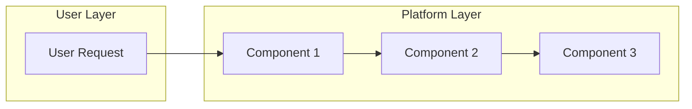

# Spec: [Platform Capability Name]

**Spec ID**: SPEC-XXXX
**GitHub Issue**: [#XXX](https://github.com/Smana/cloud-native-ref/issues/XXX)
**Status**: Draft | In Review | Approved | Implemented
**Author**: [Name]
**Created**: YYYY-MM-DD
**Last Updated**: YYYY-MM-DD

---

## Summary

[1-2 sentence description of the platform capability]

---

## Motivation

### Problem Statement

[What platform gap does this address? Who experiences this limitation?]

### User Stories & Acceptance Scenarios

#### User Story 1 - [Title] (Priority: P1)

As a **[role]**, I want to [action], so that [benefit]

**Why this priority**: [Justification]

**Acceptance Scenarios**:
1. **Given** [precondition], **When** [action], **Then** [expected result]
2. **Given** [precondition], **When** [action], **Then** [expected result]

#### User Story 2 - [Title] (Priority: P2)

As a **[role]**, I want to [action], so that [benefit]

**Acceptance Scenarios**:
1. **Given** [precondition], **When** [action], **Then** [expected result]

### Functional Requirements

- **FR-001**: Platform MUST [requirement]
- **FR-002**: Platform MUST [requirement]
- **FR-003**: Platform SHOULD [requirement]

### Success Criteria

- **SC-001**: [Measurable success criterion]
- **SC-002**: [Measurable success criterion]

### Non-Goals

- Non-goal 1 (explicitly out of scope)
- Non-goal 2 (will be addressed in future iteration)

### Open Clarifications

<!-- Use [NEEDS CLARIFICATION: description] markers for unresolved questions -->
- [NEEDS CLARIFICATION: Example question?]

---

## Design

### Architecture Overview

### Components Affected

| Component | Type | Changes | Owner |
|-----------|------|---------|-------|
| Flux Kustomization | GitOps | New overlay | Platform |
| HelmRelease | Kubernetes | New or modified | Platform |
| Crossplane Composition | Infrastructure | If applicable | Platform |
| OpenTofu Stack | IaC | If applicable | Platform |

### Key Entities

- **[Entity Name]**: [Description, relationships, lifecycle]
- **[Entity Name]**: [Description, relationships, lifecycle]

### Integration Points

#### 1. GitOps Integration

- **Flux Kustomization path**: `infrastructure/base/[name]/`
- **Dependencies**: [other Kustomizations this depends on]
- **Reconciliation interval**: [e.g., 5m]

#### 2. Observability Integration

- **VictoriaMetrics**: [metrics exposed, ServiceMonitor]
- **VictoriaLogs**: [log format, labels]
- **Grafana**: [dashboard needed? alerts?]

#### 3. Security Integration

- **Network policies**: [CiliumNetworkPolicy requirements]
- **RBAC roles**: [ServiceAccount, Role/ClusterRole]
- **Secrets management**: [External Secrets integration]

#### 4. Gateway Integration (if user-facing)

- **HTTPRoute**: [routing configuration]
- **TLS**: [certificate requirements]
- **Authentication**: [if applicable]

---

## Implementation Phases

### Phase 1: Foundation

**Goal**: [Phase goal]

- [ ] Task 1.1: [Specific task]
- [ ] Task 1.2: [Specific task]
- [ ] Task 1.3: [Specific task]

**Exit Criteria**: [How to know phase is complete]

### Phase 2: Core Functionality

**Goal**: [Phase goal]

- [ ] Task 2.1: [Specific task]
- [ ] Task 2.2: [Specific task]
- [ ] Task 2.3: [Specific task]

**Exit Criteria**: [How to know phase is complete]

### Phase 3: Integration

**Goal**: [Phase goal]

- [ ] Task 3.1: [Specific task]
- [ ] Task 3.2: [Specific task]

**Exit Criteria**: [How to know phase is complete]

### Phase 4: Documentation & Rollout

**Goal**: [Phase goal]

- [ ] Update `docs/[relevant].md`
- [ ] Add to `CLAUDE.md` if needed
- [ ] Announce to users (if applicable)

**Exit Criteria**: [How to know phase is complete]

---

## Validation

### Functional Tests

- [ ] [Test scenario 1 - happy path]
- [ ] [Test scenario 2 - edge case]
- [ ] [Test scenario 3 - error handling]

### Integration Tests

- [ ] GitOps sync works correctly (Flux reconciles)
- [ ] Dependencies resolve properly
- [ ] Observability data flowing (metrics visible in VM)
- [ ] Network policies don't break connectivity

### Performance Tests (if applicable)

- [ ] [Performance criterion, e.g., "Response time < 100ms"]
- [ ] [Load test criterion]

---

## Rollback Plan

### Phase 1 Rollback

[Steps to rollback Phase 1 changes]

### Phase 2 Rollback

[Steps to rollback Phase 2 changes]

### Full Rollback

[Steps to completely remove the capability]

---

## Review Checklist

### Project Manager (PM)

- [ ] Problem statement is clear and specific
- [ ] User stories capture real platform needs
- [ ] Acceptance criteria are measurable
- [ ] Scope is well-defined (goals AND non-goals)
- [ ] Phases have clear exit criteria

### Platform Engineer

- [ ] Architecture aligns with existing patterns
- [ ] GitOps structure follows conventions
- [ ] Kustomization dependencies are correct
- [ ] HelmRelease values are parameterized

### Security & Compliance

- [ ] Zero-trust networking considered
- [ ] RBAC follows least-privilege
- [ ] Secrets via External Secrets
- [ ] Network policies defined

### SRE

- [ ] Observability configured (metrics, logs, traces)
- [ ] Health checks defined
- [ ] Alerting rules configured
- [ ] Runbook created (if applicable)
- [ ] Disaster recovery considered

---

## Success Metrics

| Metric | Target | Measurement |
|--------|--------|-------------|
| [Metric 1] | [Target value] | [How to measure] |
| [Metric 2] | [Target value] | [How to measure] |

---

## References

- Related specs: [SPEC-XXXX]
- Related ADRs: [docs/decisions/XXXX-*.md]
- External docs: [links]
- Similar capability: [existing reference]
