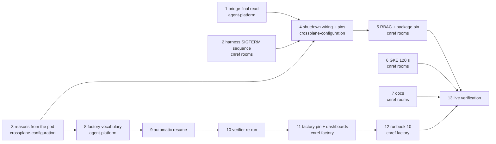

# Agent runs that survive a spot or preemptible reclaim: implementation plan

> **For agentic workers:** REQUIRED SUB-SKILL: Use superpowers:subagent-driven-development (recommended) or superpowers:executing-plans to implement this plan task-by-task. Steps use checkbox (`- [ ]`) syntax for tracking.

**Goal:** A reclaimed node costs an agent run at most the work since its last push, and the factory resumes the run on its own.

**Architecture:** On SIGTERM, `agent-run` pauses the agent, pushes a checkpoint commit (implementer only), asks the room-bridge for a final read of the harness log, stops agent-server and revokes the GitHub token, each step time-boxed inside 15 s. The AgentRun composition reads the run's pod through Crossplane required resources and records `Disrupted`, `PodLost` or `PodFailed`. The factory resumes a `Disrupted` or `PodLost` run as a new AgentRun on the same branch and room, capped per task and inside the task's token cap.

**Tech Stack:** Python 3 (agent-harness, stdlib `unittest`), Go 1.x (agent-platform: room-bridge, agent-factory; `go test -race`), KCL 0.11.3 with function-kcl v0.12.2 on Crossplane 2.4.2 (`kcl test`, `crossplane render` 2.1.3), OpenTofu with google-beta `~> 7.39`, Grafana dashboards via grafana-operator, kube-state-metrics custom resource state.

**Spec:** [`docs/superpowers/specs/2026-10-04-agent-run-disruption-design.md`](../specs/2026-10-04-agent-run-disruption-design.md). Evidence: [`…-research.md`](../specs/2026-10-04-agent-run-disruption-research.md).

## Global Constraints

Copied from the spec:

- **The shutdown sequence is therefore budgeted at 15 s.** It must work on preemptible VMs, and on Spot before any extension. A longer window, where a cloud gives one, only adds margin.
- Step time boxes: pause (≤ 1 s), checkpoint (≤ 8 s), final read (≤ 3 s), stop (≤ 2 s), revoke (≤ 1 s). "Total: at most 15 s; each box is an upper bound." Every step is "time-boxed and skipped on overrun so no step can block the next".
- Checkpoint trailer: `Agent-Checkpoint: disruption`, "beside the usual provenance trailers". Implementer only; "other roles never write".
- Reasons: `Disrupted` (the pod is `Failed` with a `DisruptionTarget` condition), `PodLost` (the pod vanished: deleted, or its node disappeared, before the composition saw a final state), `PodFailed` (the pod failed on its own). `Succeeded` unchanged.
- `resume.maxPerTask: 2` (factory config), then `Escalated` as today.
- "Each resume spends from the task's `TaskTokens` cap. On the resume path the cap is **enforced**, even while `budgets.enforceTask` keeps it in shadow elsewhere. A resume needs at least one `RunTokens` left."
- Trigger: an implementer run ending `Disrupted` or `PodLost`. "`PodFailed` still escalates, so a crashing agent is never resumed in a loop." A reviewer, tester or triager run that ends `Disrupted` or `PodLost` re-runs **without spending a review round**.
- Narration: "the sandbox was lost (spot reclaim or eviction); resuming automatically (1/2)".
- Metric: `agent_factory_resumes_total{reason}` and a panel on the factory dashboard.
- Invariants kept:

  | Invariant | How this design keeps it |
  |---|---|
  | A task never runs twice by accident (F12 gate, F2b) | No in-place resume. A resumed run is a **new** `AgentRun` with its own id, created by the factory |
  | One writer of `AgentRun` status: the composition (C3) | The composition derives the new reason; nothing else writes status |
  | Terminal phases latch (F2, M2) | A `Failed` run stays `Failed`; resume never flips it |
  | One live run per room (P17) | The resumed run waits for the old one to be terminal, as `/factory retry` does today |
  | Budgets bound spend | Each resume spends from the task's token cap, enforced on this path (§4) |

Repository rules:

- Never co-author commits; no "Generated with" line in any commit or PR. Commit messages, PR titles and PR bodies in English, conventional-commit style.
- Never bare `git stash`. Set work aside with a WIP commit.
- Every `go test`, `pytest`/`unittest`, `docker build --target test`, `kcl test`, `task check`, `crossplane render` or render-check run is wrapped:
  `systemd-run --user --scope -q -p MemoryMax=6G -p MemorySwapMax=0 timeout 900 <cmd>`.
- Stacks are **merge-only**: bring a base in with `git merge`, never `git rebase`. New branches are cut from the newest branch of their stack.
- Nothing merges to `main` before the owner's UX sign-off of the whole programme (P33). Every PR here is a **draft** against its stack branch.
- Work in a fresh worktree per repo branch (cloud-native-ref: `EnterWorktree`, then `git switch -c <branch> origin/<base>`). Never switch branches in someone else's checkout.
- Every claim of "passing" cites the command and its exit code or counts, run in the same step.

## Owner decisions (2026-10-04)

- **Crossplane's wider pod read is accepted.** Crossplane gets `get`, `list` and `watch` on pods
  cluster-wide for the required resource (Task 5), and keeps a cluster-wide pod informer; Task 13
  measures its memory. The namespaced-watcher alternative was rejected: it races the composition's
  latch.
- **Merging `feat/factory-resume` into `integration/agent-factory` may bring factory phases 2–9 to
  gcp-0** at the next rebuild (Tasks 11 and 13).
- Owner action the plan depends on: pushing the harness pre-release image by hand (Task 2). The
  aws-0 FIS test's IAM role and experiment template (Task 13) are managed in the
  `opentofu/aws/eks/init` stack, so the aws-0 rebuild creates them.

## Branch map

| Repo | Stack tip (base) | New branch | Draft PR base | Tasks |
|---|---|---|---|---|
| Smana/agent-platform | `feat/room-approvals` (#11, `eb61ce7c`) | `feat/room-final-read` | `feat/room-approvals` | 1 |
| Smana/cloud-native-ref | `feat/rooms-driver` (#2150, `7c8165a6`), plus a merge of `feat/agent-harness-pr-footer` (#2142, `55e42fc5`) and of `docs/agent-run-disruption` | `feat/rooms-disruption` | `feat/rooms-driver` | 2, 5, 6, 7 |
| Smana/crossplane-configuration | `chore/room-bridge-v0.4.0` (#35, `d6eb3543`), plus a merge of `chore/bump-render-functions` (#28, `5c6fefd`) | `feat/agentrun-disruption` | `chore/room-bridge-v0.4.0` | 3, 4 |
| Smana/agent-platform | `feat/factory-runlore` (#17, `d7747b25`) | `feat/factory-resume` | `feat/factory-runlore` | 8, 9, 10 |
| Smana/cloud-native-ref | `feat/factory-runlore` (#2191, `a8510335`), plus a merge of `docs/agent-run-disruption` | `feat/factory-resume` | `feat/factory-runlore` | 11, 12 |
| Smana/cloud-native-ref | `integration/agent-factory` (`24f05fab`) | — (merges only) | — | 13 |

Why these bases:

- The harness image the composition runs today (`agent-harness:v0.2.0-pr2142.10c062c2`) was built from a local merge of #2142 (the PR footer) into the observability harness. No pushed branch holds both. `feat/rooms-driver` holds the observability harness; merging #2142 into it reproduces that tree (the only conflict is the Dockerfile's `ARG` block; taking #2142's side gives byte-for-byte the pinned build's Dockerfile, checked against `10c062c2`).
- #2142's Dockerfile says "A pull request build is pushed by hand as v0.2.0-pr<N>.<sha8>". Since #2179, PR images are never pushed by CI. The harness pre-release is therefore built and pushed by the owner (Task 2, Step 12).
- The crossplane-configuration pin lives on the rooms stack (`206b53ff` on `feat/rooms-driver`); the factory stack still pins `v0.7.2-pr33`.
- Only function-kcl v0.12.2 implements `RequiredResources` (v0.12.1, which this branch renders with, does not); #28 moves `functions.yaml` to v0.12.2, the version cloud-native-ref deploys.
- The factory dashboard, the factory config and the agent-factory runbooks exist on `feat/factory-runlore` and not on `feat/rooms-driver`.



## Shared contracts

Every task's implementer sees only their task; these names cross task boundaries.

| Contract | Value | Produced by | Consumed by |
|---|---|---|---|
| Bridge final read | `POST http://127.0.0.1:8085/final-read`, loopback only (else 403), answers `200 {"events":N,"unmirrored":M,"sealed":false}` within 3 s, `504` when the loop did not answer in time | Task 1 | Task 2 |
| Harness env | `BRIDGE_URL=http://127.0.0.1:8085` on room runs only; `ROLE`, `BRANCH`, `RUN_ID` (existing) | Task 4 | Task 2 |
| Harness log line | `agent-run shutdown <step> <status> in <seconds>s (box <box>s)`, step ∈ `pause`, `checkpoint`, `final-read`, `stop`, `revoke`; status `done`, `done: <result>`, `failed: <error>`, `overrun` | Task 2 | Tasks 12, 13 |
| Checkpoint trailer | the commit hook adds `Agent-Checkpoint: <value>` when `AGENT_CHECKPOINT=<value>` is in its environment; `agent-run` sets `disruption` | Task 2 | Tasks 9 (brief text), 13 |
| `AgentRun.status.reason` | `Disrupted`, `PodLost`, `PodFailed`, or a revocation reason (`budget-run`, `budget-principal`, `budget-fleet`, `manual`) | Task 3 | Tasks 8, 9 |
| Composition required resource | name `runPod`: `{apiVersion: v1, kind: Pod, name: <XR name>, namespace: agents}` | Task 3 | Task 5 (RBAC) |
| Factory reasons | `runs.ReasonDisrupted = "Disrupted"`, `runs.ReasonPodLost = "PodLost"` | Task 8 | Task 9 |
| Factory config | `resume: {maxPerTask: <1..5>}`, default 2; Go: `config.Resume{MaxPerTask int}` | Task 8 | Tasks 9, 11 |
| Task CRD | trigger enum value `resume`; `status.resumes` (int32) | Task 8 | Tasks 9, 10 |
| Metric | `agent_factory_resumes_total{reason="Disrupted"\|"PodLost"\|"other"}`; Go: `(*fmetrics.Set).Resumed(ctx, reason string)` | Task 8 | Task 11 |
| Narration | `narrate.Resuming(t *v1alpha1.Task, runID, role string, n, limit int) narrate.Event`, key `resume-<n>` | Task 8 | Task 9 |
| KSM label | `agentrun_info{task}` from `metadata.labels["agents.ogenki.io/task"]` | Task 11 | Task 11 (run dashboard) |

---

## Task 1: room-bridge answers a final read before the harness stops

**Repo:** Smana/agent-platform · **base:** `origin/feat/room-approvals` · **branch:** `feat/room-final-read` · **draft PR base:** `feat/room-approvals`

**Files:**
- Modify: `internal/bridge/bridge.go` (the `Bridge` struct at L260–330, `Run` at L421–450; new code after `readLog` at L632)
- Modify: `internal/app/bridge.go` (const block L28–38, `healthHandler` L93–113, `RunBridge` L232)
- Modify: `docs/integration.md` (the `HEALTH_ADDR` row, L127)
- Test: `internal/bridge/bridge_test.go`, `internal/app/bridge_test.go`

**Interfaces:**
- Consumes: nothing new.
- Produces: `type bridge.FinalReadResult struct { Events int64; Unmirrored int; Sealed bool }` (JSON `events`, `unmirrored`, `sealed`); `func (b *bridge.Bridge) FinalRead(ctx context.Context) (bridge.FinalReadResult, error)`; the `POST /final-read` route on `HEALTH_ADDR` (`:8085`); `healthHandler(healthy func(time.Time) bool, admission func() bridge.Admission, finalRead func(context.Context) (bridge.FinalReadResult, error), now func() time.Time) http.Handler`.

- [ ] **Step 1: Cut the branch**

```bash
git fetch origin
git switch -c feat/room-final-read origin/feat/room-approvals
git log --oneline -1   # expect eb61ce7 (or a newer feat/room-approvals tip)
```

- [ ] **Step 2: Write the failing bridge tests**

Append to `internal/bridge/bridge_test.go` (add `"context"` to its imports if absent):

```go
// F11, the harness half (disruption design §2): a final read answers only once the log is read
// to its end and mirrored, whatever the loop's own pace.
func TestAFinalReadMirrorsTheLogBeforeItAnswers(t *testing.T) {
	f := &fakeAgentServer{pageSize: 2, status: "running"}
	for i := range 3 {
		f.add(chatEvent(fmt.Sprint("hi ", i)))
	}
	fb := &fakeBroker{}
	r := newRig(t, NewHarness(f.start(t, conv).URL, conv), fb)
	r.b.Interval = time.Hour // one step, then the loop idles: only a final read moves the log
	ctx, _ := r.run(t)
	eventually(ctx, t, "the first step mirrors the log", func() bool { return len(fb.stored(wire.StreamEvents)) == 3 })
	for i := 3; i < 7; i++ {
		f.add(chatEvent(fmt.Sprint("hi ", i)))
	}
	res, err := r.b.FinalRead(ctx)
	if err != nil {
		t.Fatal(err)
	}
	want := []int64{SeqFor(1, 0), SeqFor(2, 0), SeqFor(3, 0), SeqFor(4, 0), SeqFor(5, 0), SeqFor(6, 0), SeqFor(7, 0)}
	if got := seqs(t, fb.stored(wire.StreamEvents)); !slices.Equal(got, want) || res != (FinalReadResult{Events: 7}) {
		t.Fatalf("answered %+v with %v mirrored, want every event mirrored first: %v", res, got, want)
	}
}

// A final read is bounded by its caller: a broker that keeps refusing still gets the caller an
// answer naming what is unmirrored, before the caller's deadline.
func TestAFinalReadAnswersBeforeItsDeadline(t *testing.T) {
	f := &fakeAgentServer{pageSize: 2, status: "running"}
	f.add(chatEvent("hi"))
	fb := &fakeBroker{}
	r := newRig(t, NewHarness(f.start(t, conv).URL, conv), fb)
	r.b.Interval = time.Hour
	ctx, _ := r.run(t)
	eventually(ctx, t, "the first step mirrors the log", func() bool { return len(fb.stored(wire.StreamEvents)) == 1 })
	fb.set(func(b *fakeBroker) { b.hold = true })
	f.add(chatEvent("unmirrored"))
	call, cancel := context.WithTimeout(ctx, time.Second)
	defer cancel()
	start := time.Now()
	res, err := r.b.FinalRead(call)
	if took := time.Since(start); err != nil || res.Unmirrored == 0 || res.Events != 2 || took >= time.Second {
		t.Fatalf("got %+v, %v after %v: want an answer naming the unmirrored items inside the deadline", res, err, took)
	}
}
```

- [ ] **Step 3: Run them and see them fail**

Run: `systemd-run --user --scope -q -p MemoryMax=6G -p MemorySwapMax=0 timeout 900 go test -race -count=1 -run 'TestAFinalRead' ./internal/bridge/`
Expected: build failure, `r.b.FinalRead undefined` and `undefined: FinalReadResult`.

- [ ] **Step 4: Implement `FinalRead` in `internal/bridge/bridge.go`**

Add two fields to `Bridge`, after `admission atomic.Pointer[Admission]`:

```go
	finalOnce  sync.Once
	finalReads chan finalRead
```

In `Run`, replace the loop

```go
	for {
		b.step(ctx)
		if pause(ctx, b.Interval) != nil {
			b.shutdown()
			return nil
		}
	}
```

with

```go
	for {
		b.step(ctx)
		if !b.idle(ctx) {
			b.shutdown()
			return nil
		}
	}
```

Add after `readLog`:

```go
// FinalReadResult is what a final read reached: the harness events read so far, the items still
// unmirrored when it answered, and whether the room is sealed.
type FinalReadResult struct {
	Events     int64 `json:"events"`
	Unmirrored int   `json:"unmirrored"`
	Sealed     bool  `json:"sealed"`
}

// finalRead is one FinalRead waiting for the loop.
type finalRead struct {
	ctx  context.Context
	done chan FinalReadResult
}

// answerMargin is how long before the caller's deadline a final read stops working, so its answer
// still reaches the caller in time.
const answerMargin = 250 * time.Millisecond

func (b *Bridge) finals() chan finalRead {
	b.finalOnce.Do(func() { b.finalReads = make(chan finalRead) })
	return b.finalReads
}

// FinalRead asks the loop to read the harness log to its end and mirror it now, and waits for the
// answer or ctx. agent-run calls it on SIGTERM before it stops agent-server (F11, the harness half;
// disruption design §2): the bridge's own SIGTERM drain comes only once the harness has exited, when
// agent-server is gone. It does not stop the loop.
func (b *Bridge) FinalRead(ctx context.Context) (FinalReadResult, error) {
	req := finalRead{ctx: ctx, done: make(chan FinalReadResult, 1)}
	select {
	case b.finals() <- req:
	case <-ctx.Done():
		return FinalReadResult{}, ctx.Err()
	}
	select {
	case res := <-req.done:
		return res, nil
	case <-ctx.Done():
		return FinalReadResult{}, ctx.Err()
	}
}

// idle waits out the poll interval, serving on the loop, the only goroutine that touches the buffer
// and the cursor, the final reads that arrive meanwhile. It reports false once ctx ends.
func (b *Bridge) idle(ctx context.Context) bool {
	t := time.NewTimer(b.Interval)
	defer t.Stop()
	for {
		select {
		case <-ctx.Done():
			return false
		case req := <-b.finals():
			req.done <- b.serveFinalRead(req.ctx)
		case <-t.C:
			return true
		}
	}
}

// serveFinalRead reads the log to its end, then the status, then sends what that buffered. The
// loop's backoff does not apply, as in shutdown, and it stops answerMargin before ctx's deadline.
func (b *Bridge) serveFinalRead(ctx context.Context) FinalReadResult {
	if d, ok := ctx.Deadline(); ok {
		var cancel context.CancelFunc
		ctx, cancel = context.WithDeadline(ctx, d.Add(-answerMargin))
		defer cancel()
	}
	if !b.sealed.Load() {
		b.sendAt = time.Time{}
		b.sendRetry.reset()
		b.takeInbox(ctx)
		b.readLog(ctx)
		b.pollStatus(ctx)
		b.drain(ctx)
	}
	return FinalReadResult{Events: b.cursor.Count, Unmirrored: len(b.buf), Sealed: b.sealed.Load()}
}
```

- [ ] **Step 5: Run the bridge tests and see them pass**

Run: `systemd-run --user --scope -q -p MemoryMax=6G -p MemorySwapMax=0 timeout 900 go test -race -count=1 ./internal/bridge/`
Expected: `ok  github.com/Smana/agent-platform/internal/bridge`, no data race reported.

- [ ] **Step 6: Write the failing endpoint test**

In `internal/app/bridge_test.go`, change the two existing `healthHandler(...)` calls (in `TestHealthz` and `TestAdmissionEndpoint`) to pass a final read as the third argument:

```go
noRead := func(context.Context) (bridge.FinalReadResult, error) { return bridge.FinalReadResult{}, nil }
h := healthHandler(func(time.Time) bool { return healthy }, func() bridge.Admission { return bridge.Admission{} }, noRead, time.Now)
```

(and the same `noRead` in `TestAdmissionEndpoint`). Then append:

```go
// F11, the harness half: agent-run asks for the final read on loopback, POST only, and waits at
// most finalReadWait for the answer.
func TestFinalReadEndpoint(t *testing.T) {
	read := func(context.Context) (bridge.FinalReadResult, error) { return bridge.FinalReadResult{Events: 7}, nil }
	never := func(ctx context.Context) (bridge.FinalReadResult, error) { <-ctx.Done(); return bridge.FinalReadResult{}, ctx.Err() }
	for _, c := range []struct {
		name, method, from string
		read               func(context.Context) (bridge.FinalReadResult, error)
		code               int
		body               string
	}{
		{"the harness gets the answer", http.MethodPost, "127.0.0.1:41234", read, http.StatusOK, `{"events":7,"unmirrored":0,"sealed":false}`},
		{"loopback only", http.MethodPost, "10.0.0.7:41234", read, http.StatusForbidden, "loopback only"},
		{"POST only", http.MethodGet, "127.0.0.1:41234", read, http.StatusMethodNotAllowed, ""},
		{"a read that never answers is a 504", http.MethodPost, "127.0.0.1:41234", never, http.StatusGatewayTimeout, "in time"},
	} {
		t.Run(c.name, func(t *testing.T) {
			h := healthHandler(func(time.Time) bool { return true }, func() bridge.Admission { return bridge.Admission{} }, c.read, time.Now)
			req := httptest.NewRequestWithContext(t.Context(), c.method, "/final-read", nil)
			req.RemoteAddr = c.from
			rec := httptest.NewRecorder()
			h.ServeHTTP(rec, req)
			if rec.Code != c.code || !strings.Contains(rec.Body.String(), c.body) {
				t.Fatalf("%s /final-read from %s = %d %q, want %d %q", c.method, c.from, rec.Code, rec.Body.String(), c.code, c.body)
			}
		})
	}
}
```

- [ ] **Step 7: Run it and see it fail**

Run: `systemd-run --user --scope -q -p MemoryMax=6G -p MemorySwapMax=0 timeout 900 go test -race -count=1 -run 'TestFinalReadEndpoint|TestHealthz|TestAdmissionEndpoint' ./internal/app/`
Expected: build failure, `too many arguments in call to healthHandler`.

- [ ] **Step 8: Implement the route in `internal/app/bridge.go`**

Add `"encoding/json"` to the imports. In the const block, after `maxFlushGrace`:

```go
	// finalReadWait bounds a final read: agent-run gives it 3 s of its 15 s shutdown and gives up
	// at the same mark (disruption design §2).
	finalReadWait = 3 * time.Second
```

Replace `healthHandler` with:

```go
// healthHandler serves /healthz for the kubelet only (ruling P6), /admission for room-bridge gate
// on loopback (F15): 503 while the first hellos are undecided, 200 once the run holds the room,
// 409 and the reason once it never will; and POST /final-read for agent-run on loopback (F11, the
// harness half): the log read to its end and mirrored, then the answer.
func healthHandler(healthy func(time.Time) bool, admission func() bridge.Admission,
	finalRead func(context.Context) (bridge.FinalReadResult, error), now func() time.Time,
) http.Handler {
	mux := http.NewServeMux()
	mux.HandleFunc("GET /healthz", func(w http.ResponseWriter, _ *http.Request) {
		if !healthy(now()) {
			http.Error(w, "harness unreachable", http.StatusServiceUnavailable)
			return
		}
		_, _ = w.Write([]byte("ok " + version.Version + "\n"))
	})
	mux.HandleFunc("GET /admission", func(w http.ResponseWriter, _ *http.Request) {
		switch a := admission(); {
		case a.Admitted:
			_, _ = w.Write([]byte("admitted\n"))
		case a.Refused != "":
			http.Error(w, a.Refused, http.StatusConflict)
		default:
			http.Error(w, "pending", http.StatusServiceUnavailable)
		}
	})
	mux.HandleFunc("POST /final-read", func(w http.ResponseWriter, r *http.Request) {
		// The harness's call: the run CNP admits the kubelet alone on 8085, and this keeps it so.
		if !fromLoopback(r) {
			http.Error(w, "loopback only", http.StatusForbidden)
			return
		}
		ctx, cancel := context.WithTimeout(r.Context(), finalReadWait)
		defer cancel()
		res, err := finalRead(ctx)
		if err != nil {
			http.Error(w, "the final read did not answer in time", http.StatusGatewayTimeout)
			return
		}
		w.Header().Set("Content-Type", "application/json")
		_ = json.NewEncoder(w).Encode(res)
	})
	return mux
}

// fromLoopback reports that r comes from inside the pod's network namespace.
func fromLoopback(r *http.Request) bool {
	host, _, err := net.SplitHostPort(r.RemoteAddr)
	ip := net.ParseIP(host)
	return err == nil && ip != nil && ip.IsLoopback()
}
```

In `RunBridge`, change the server's handler to `healthHandler(b.Healthy, b.Admission, b.FinalRead, time.Now)`.

- [ ] **Step 9: Run the package tests and the full gate**

Run: `systemd-run --user --scope -q -p MemoryMax=6G -p MemorySwapMax=0 timeout 900 go test -race -count=1 ./internal/app/ ./internal/bridge/`
Expected: two `ok` lines.

Run: `systemd-run --user --scope -q -p MemoryMax=6G -p MemorySwapMax=0 timeout 900 task check`
Expected: exit 0 (needs a running Docker daemon for the store tests).

- [ ] **Step 10: Document the endpoint**

In `docs/integration.md`, replace the `HEALTH_ADDR` row with:

```markdown
| `HEALTH_ADDR` | `:8085` (default): `/healthz` for kubelet only, and `POST /final-read` for the harness on loopback (F11, the harness half): the bridge reads the harness log to its end and mirrors it, then answers `{"events","unmirrored","sealed"}` within 3 s (`504` past it). `agent-run` calls it on SIGTERM before it stops agent-server. The bridge serves no metrics; the broker counts its stalls and stubs (Ruling AP) |
```

- [ ] **Step 11: Commit, push, open the draft PR**

```bash
git add internal/bridge/bridge.go internal/bridge/bridge_test.go internal/app/bridge.go internal/app/bridge_test.go docs/integration.md
git commit -m "feat(room-bridge): a final read the harness asks for on SIGTERM (F11, harness half)"
git push -u origin feat/room-final-read
gh pr create --repo Smana/agent-platform --draft --base feat/room-approvals --head feat/room-final-read \
  --title "feat(room-bridge): a final read the harness asks for on SIGTERM" \
  --body "POST /final-read on loopback: the bridge reads the harness log to its end and mirrors it, then answers within 3 s. agent-run calls it before it stops agent-server (cloud-native-ref disruption design §2). The harness half of F11."
```

- [ ] **Step 12: Record the pre-release image**

CI's `prerelease` job publishes `ghcr.io/smana/room-bridge:v0.0.1-pr<M>.<sha8>` for this PR (`<M>` its number).

```bash
M=$(gh pr view feat/room-final-read --repo Smana/agent-platform --json number --jq .number)
gh run watch --repo Smana/agent-platform "$(gh run list --repo Smana/agent-platform --branch feat/room-final-read --workflow ci.yaml --limit 1 --json databaseId --jq '.[0].databaseId')"
TAG="v0.0.1-pr${M}.$(git rev-parse --short=8 HEAD)"
skopeo inspect --format '{{.Digest}}' "docker://ghcr.io/smana/room-bridge:${TAG}"
```

Expected: a `sha256:…` digest. Write `ghcr.io/smana/room-bridge:${TAG}@<digest>` into the Task 4 hand-off. If `skopeo` says the tag does not exist, read the exact tag from the `prerelease` job log (`Derive the pre-release version` step) instead of guessing.

---

## Task 2: agent-run's SIGTERM sequence

**Repo:** Smana/cloud-native-ref · **base:** `origin/feat/rooms-driver`, then merges of `origin/feat/agent-harness-pr-footer` and `origin/docs/agent-run-disruption` · **branch:** `feat/rooms-disruption` · **draft PR base:** `feat/rooms-driver`

**Files:**
- Modify: `container-images/agent-harness/agent_run.py` (constants after L64; `main` L317–356; new functions)
- Modify: `container-images/agent-harness/commit-msg` (`TRAILERS`, docstring)
- Modify: `container-images/agent-harness/git_credential_agent.py` (docstrings only, L1–8 and L38–40)
- Modify: `container-images/agent-harness/Dockerfile` (`ARG AGENT_HARNESS_VERSION` block)
- Modify: `container-images/agent-harness/README.md`
- Test: `container-images/agent-harness/tests/test_agent_run.py`, `container-images/agent-harness/tests/test_pr_footer.py`

**Interfaces:**
- Consumes: the bridge final read contract (Task 1) and `BRIDGE_URL` (Task 4).
- Produces: `timed(name: str, box: float, step) -> None`, `report(name: str, status: str, started: float, box: float) -> None`, `pause(cid: str) -> None`, `checkpoint(env: dict, deadline: float) -> str`, `final_read(env: dict, steps=None) -> str`, `stop(server, timeout: float) -> str`, `revoke() -> None`, `disrupted(env: dict, cid: str, steps) -> None`; constants `PAUSE_S, CHECKPOINT_S, FINAL_READ_S, STOP_S, REVOKE_S = 1, 8, 3, 2, 1`, `CHECKPOINT_SUBJECT`, `CHECKPOINT_ENV = {"AGENT_CHECKPOINT": "disruption"}`; the log line and the trailer in *Shared contracts*; the image `ghcr.io/smana/agent-harness:v0.3.0-pr<N>.<sha8>@<digest>`.

- [ ] **Step 1: Cut the branch and bring in the footer and the design**

```bash
git fetch origin
git switch -c feat/rooms-disruption origin/feat/rooms-driver
git merge --no-ff origin/feat/agent-harness-pr-footer -m "merge: feat/agent-harness-pr-footer (H-S3 footer) into the rooms stack, as the pinned harness build has it"
```

Expected: `CONFLICT (content): Merge conflict in container-images/agent-harness/Dockerfile`, nothing else. Resolve it as the pinned build did, then conclude:

```bash
git checkout --theirs container-images/agent-harness/Dockerfile
git add container-images/agent-harness/Dockerfile
git commit --no-edit
git merge --no-ff origin/docs/agent-run-disruption -m "merge: docs/agent-run-disruption (design, research, plan)"
```

Verify the harness now equals the pinned build plus nothing:

```bash
git cat-file -e 10c062c2 2>/dev/null && git diff --stat 10c062c2 HEAD -- container-images/agent-harness
git diff --stat origin/feat/rooms-driver HEAD -- container-images/agent-harness/agent_run.py
```

Expected: both print nothing (the first only where the owner's local `10c062c2` exists; `scratch/hs3-o1-harness-build` in `~/Sources/cloud-native-ref`).

- [ ] **Step 2: Write the failing hook test**

Append to `CommitMsgHookTest` in `tests/test_pr_footer.py`:

```python
    def test_agent_checkpoint_is_the_harness_alone(self):
        # Disruption design §2: agent-run's checkpoint commit carries it; an agent-written one is marked.
        _, msg = self.commit("chore(agent): checkpoint\n", AGENT_CHECKPOINT="disruption")
        self.assertEqual(self.trailers(msg), ["Agent-Run: 7f3cq2xz", "Agent-Checkpoint: disruption"])
        _, forged = self.commit("fix: a thing\n\nAgent-Checkpoint: disruption\n")
        self.assertNotIn("\nAgent-Checkpoint:", forged)
        self.assertIn("(agent-written) Agent-Checkpoint: disruption", forged)
```

- [ ] **Step 3: Write the failing `agent-run` tests**

In `tests/test_agent_run.py`, add these classes after `StepLogTest`:

```python
class TimedTest(unittest.TestCase):
    """Disruption design §2: every shutdown step is boxed, and an overrun never holds up the next."""

    def step(self, box, fn):
        started = time.monotonic()
        with mock.patch("sys.stderr", new=io.StringIO()) as err:
            agent_run.timed("x", box, fn)
        return err.getvalue(), time.monotonic() - started

    def test_a_step_that_overruns_is_abandoned(self):
        line, took = self.step(0.2, lambda: time.sleep(5))
        self.assertLess(took, 1)
        self.assertRegex(line, r"^agent-run shutdown x overrun in 0\.2\ds \(box 0\.2s\)\n$")

    def test_a_failed_step_is_logged_redacted(self):
        def boom():
            raise RuntimeError("push refused: ghs_" + "A" * 36)

        line, _ = self.step(1, boom)
        self.assertRegex(line, r"^agent-run shutdown x failed: push refused: \[REDACTED:github-token\] in \d\.\d\ds \(box 1s\)\n$")

    def test_a_step_logs_its_result(self):
        line, _ = self.step(1, lambda: "pushed")
        self.assertRegex(line, r"^agent-run shutdown x done: pushed in 0\.\d\ds \(box 1s\)\n$")


# The commit hook as the image installs it, found as test_pr_footer finds it.
HOOK = next(p for p in (os.path.join(HERE, "commit-msg"), "/etc/agent/git-hooks/commit-msg") if os.path.exists(p))


class CheckpointTest(unittest.TestCase):
    """The checkpoint against a bare repository standing in for GitHub, through the real commit hook."""

    BRANCH = "agent/7f3cq2xz"

    def setUp(self):
        tmp = tempfile.mkdtemp()
        hooks = os.path.join(tmp, "hooks")
        os.mkdir(hooks)
        with open(os.path.join(hooks, "commit-msg"), "w") as f:
            f.write('#!/bin/sh\nexec "%s" "%s" "$@"\n' % (sys.executable, HOOK))
        os.chmod(os.path.join(hooks, "commit-msg"), 0o700)
        gitconfig = os.path.join(tmp, "gitconfig")
        with open(gitconfig, "w") as f:
            f.write("[user]\n\tname = t\n\temail = t@t\n[core]\n\thooksPath = %s\n[init]\n\tdefaultBranch = main\n" % hooks)
        env = mock.patch.dict(os.environ, {"GIT_CONFIG_NOSYSTEM": "1", "GIT_CONFIG_GLOBAL": gitconfig, "HOME": tmp,
                                           "PYTHONPATH": HERE, "RUN_ID": "7f3cq2xz"})
        env.start()
        self.addCleanup(env.stop)
        self.remote, self.repo, seed = (os.path.join(tmp, n) for n in ("remote.git", "repo", "seed"))

        def git(*args, cwd=tmp):
            subprocess.run(["git", *args], cwd=cwd, check=True, capture_output=True)

        git("init", "-q", "--bare", self.remote)
        git("clone", "-q", self.remote, seed)
        with open(os.path.join(seed, "README.md"), "w") as f:
            f.write("seed\n")
        git("add", "README.md", cwd=seed)
        git("commit", "-q", "-m", "seed", cwd=seed)
        git("push", "-q", "origin", "HEAD:main", cwd=seed)
        git("clone", "-q", self.remote, self.repo)
        git("checkout", "-q", "-B", self.BRANCH, "origin/main", cwd=self.repo)
        repo = mock.patch.object(agent_run, "REPO_DIR", self.repo)
        repo.start()
        self.addCleanup(repo.stop)
        self.env = {"BRANCH": self.BRANCH}

    def remote_head(self, fmt):
        out = subprocess.run(["git", "--git-dir", self.remote, "log", "-1", "--format=" + fmt, self.BRANCH],
                             capture_output=True, text=True)
        return out.returncode, out.stdout

    def write(self, name, text):
        with open(os.path.join(self.repo, name), "w") as f:
            f.write(text)

    def test_uncommitted_work_is_committed_with_the_trailer_and_pushed(self):
        self.write("wip.md", "half done\n")
        self.assertEqual(agent_run.checkpoint(self.env, time.monotonic() + 8), "pushed a checkpoint commit")
        code, body = self.remote_head("%B")
        self.assertEqual(code, 0, "the branch reached origin")
        self.assertEqual(body.rstrip().rsplit("\n\n", 1)[-1].split("\n"), ["Agent-Run: 7f3cq2xz", "Agent-Checkpoint: disruption"],
                         "the checkpoint trailer beside the usual provenance trailer")

    def test_ignored_files_stay_out(self):
        self.write(".gitignore", "*.log\n")
        self.write("debug.log", "noise\n")
        self.write("notes.md", "kept\n")
        agent_run.checkpoint(self.env, time.monotonic() + 8)
        files = subprocess.run(["git", "--git-dir", self.remote, "show", "--name-only", "--format=", self.BRANCH],
                               capture_output=True, text=True).stdout.split()
        self.assertEqual(sorted(files), [".gitignore", "notes.md"])

    def test_a_clean_tree_with_nothing_unpushed_pushes_nothing(self):
        self.assertEqual(agent_run.checkpoint(self.env, time.monotonic() + 8), "nothing to push")
        self.assertNotEqual(self.remote_head("%H")[0], 0, "no branch was created at origin")

    def test_an_unpushed_agent_commit_is_pushed_without_a_checkpoint(self):
        self.write("done.md", "done\n")
        subprocess.run(["git", "-C", self.repo, "add", "done.md"], check=True, capture_output=True)
        subprocess.run(["git", "-C", self.repo, "commit", "-q", "-m", "docs: done"], check=True, capture_output=True)
        self.assertEqual(agent_run.checkpoint(self.env, time.monotonic() + 8), "pushed")
        _, body = self.remote_head("%B")
        self.assertTrue(body.startswith("docs: done"))
        self.assertNotIn("Agent-Checkpoint", body)

    def test_no_time_left_is_an_error(self):
        with self.assertRaises(TimeoutError):
            agent_run.checkpoint(self.env, time.monotonic() - 1)
```

In `STAND_IN`, replace `do_POST` so the stand-in records the pause:

```python
    def do_POST(self):
        self.rfile.read(int(self.headers.get("Content-Length", 0)))
        if self.path.endswith("/interrupt"):
            note("interrupted", repr(time.time()))
            return self.reply({"success": True})
        self.reply({"id": "cid"})
```

After `DRIVER`, add the disruption driver and the fake bridge:

```python
# DRIVER with a checkpoint that records when it ran, then sleeps argv[5] seconds, in a box of
# argv[6] seconds: the order and the overrun are observable, and no git remote is needed.
DISRUPTION_DRIVER = (
    "import os, sys, time, agent_run\n"
    "agent_run.AGENT_SERVER = 'http://127.0.0.1:' + sys.argv[1]\n"
    "agent_run.SERVER_CMD = [sys.executable, '-c', sys.argv[2], sys.argv[1], sys.argv[3], sys.argv[4]]\n"
    "agent_run.clone = lambda env: None\n"
    "agent_run.build_request = lambda env, task, rules: {}\n"
    "agent_run.POLL_INTERVAL_S = 0.2\n"
    "agent_run.CHECKPOINT_S = float(sys.argv[6])\n"
    "def checkpoint(env, deadline):\n"
    "    with open(os.path.join(sys.argv[4], 'checkpointed'), 'w') as f:\n"
    "        f.write(repr(time.time()))\n"
    "    time.sleep(float(sys.argv[5]))\n"
    "    return 'pushed a checkpoint commit'\n"
    "agent_run.checkpoint = checkpoint\n"
    "sys.exit(agent_run.main())\n"
)


class FakeBridge(http.server.BaseHTTPRequestHandler):
    """room-bridge's final read: records when it was asked, answers after `delay`."""
    reads = []
    delay = 0

    def do_POST(self):
        FakeBridge.reads.append((self.path, time.time()))
        time.sleep(FakeBridge.delay)
        body = b'{"events": 1, "unmirrored": 0, "sealed": false}'
        self.send_response(200)
        self.send_header("Content-Length", str(len(body)))
        self.end_headers()
        self.wfile.write(body)

    def log_message(self, *args):
        pass
```

In `TracedRunTest.start`, take the driver and its extra arguments, and keep stderr:

```python
    def start(self, status, endpoint, extra_env=None, script=DRIVER, args=()):
```

and replace its last block with:

```python
        self.out = os.path.join(self.tmp, "stdout")
        err = os.path.join(self.tmp, "stderr")
        env = {**os.environ, "GIT_TOKEN_CACHE": self.cache, "GITHUB_API": "http://127.0.0.1:%d" % github,
               "TASK_FILE": os.path.join(self.tmp, "task"), "RULES_FILE": os.path.join(self.tmp, "rules"),
               "OTEL_EXPORTER_OTLP_ENDPOINT": endpoint, **(extra_env or {})}
        with open(self.out, "w") as out, open(err, "w") as errf:
            # Its own process group, so cleanup also reaches the stand-in agent-server, which a
            # driver killed mid-run never gets to stop.
            driver = subprocess.Popen([sys.executable, "-c", script, port, STAND_IN, status, self.tmp, *args],
                                      cwd=HERE, env=env, stdout=out, stderr=errf, start_new_session=True)
        self.addCleanup(self.kill_group, driver)
        return driver
```

Add to `TracedRunTest`:

```python
    def serve_bridge(self, delay=0):
        FakeBridge.reads, FakeBridge.delay = [], delay
        self.addCleanup(setattr, FakeBridge, "reads", [])
        return "http://127.0.0.1:%d" % self.serve(FakeBridge)

    def shutdown_steps(self):
        return [line.split()[2] for line in self.read("stderr").splitlines() if line.startswith("agent-run shutdown ")]

    def disrupt(self, extra_env, args):
        driver = self.start("running", "http://127.0.0.1:1", extra_env, script=DISRUPTION_DRIVER, args=args)
        self.wait_for_a_step()
        signalled = time.time()
        driver.send_signal(signal.SIGTERM)
        driver.wait(timeout=30)
        self.assertEqual(driver.returncode, 143, "SIGTERM is 128 + 15")
        return signalled

    def test_sigterm_pauses_checkpoints_reads_stops_then_revokes_inside_15s(self):
        bridge = self.serve_bridge()
        signalled = self.disrupt({"ROLE": "implementer", "BRANCH": "agent/7f3cq2xz", "BRIDGE_URL": bridge}, ("0", "8"))
        revoked = self.assert_stopped_then_revoked()
        order = [float(self.read("interrupted")), float(self.read("checkpointed")), FakeBridge.reads[0][1],
                 float(self.read("stopped")), revoked]
        self.assertEqual(order, sorted(order), "pause, checkpoint, final read, stop, revoke")
        self.assertEqual(FakeBridge.reads[0][0], "/final-read")
        self.assertEqual(self.shutdown_steps(), ["pause", "checkpoint", "final-read", "stop", "revoke"])
        self.assertLess(revoked - signalled, 15, "the whole sequence fits the 15 s budget")

    def test_a_step_that_overruns_does_not_hold_up_the_next(self):
        bridge = self.serve_bridge(delay=5)  # longer than the final read's 3 s box
        signalled = self.disrupt({"ROLE": "implementer", "BRANCH": "agent/7f3cq2xz", "BRIDGE_URL": bridge}, ("30", "1"))
        revoked = self.assert_stopped_then_revoked()
        log = self.read("stderr")
        self.assertRegex(log, r"agent-run shutdown checkpoint overrun in 1\.\d\ds \(box 1\.0s\)")
        self.assertRegex(log, r"agent-run shutdown final-read (overrun|failed: [^\n]*) in 3\.\d\ds \(box 3s\)")
        self.assertEqual(self.shutdown_steps(), ["pause", "checkpoint", "final-read", "stop", "revoke"])
        self.assertLess(revoked - signalled, 10)

    def test_a_reviewer_never_checkpoints(self):
        self.disrupt({"ROLE": "reviewer", "BRANCH": "agent/7f3cq2xz"}, ("0", "8"))
        self.assertFalse(os.path.exists(os.path.join(self.tmp, "checkpointed")))
        self.assertEqual(self.shutdown_steps(), ["pause", "final-read", "stop", "revoke"])
```

- [ ] **Step 4: Run the suites and see them fail**

Run: `systemd-run --user --scope -q -p MemoryMax=6G -p MemorySwapMax=0 timeout 900 docker build --target test container-images/agent-harness`
Expected: the build fails in the `test` stage with `AttributeError: module 'agent_run' has no attribute 'timed'` (and `checkpoint`), and `test_agent_checkpoint_is_the_harness_alone` failing on the trailer list.

- [ ] **Step 5: Teach the hook the checkpoint trailer**

In `container-images/agent-harness/commit-msg`, replace the docstring's first sentence and `TRAILERS`:

```python
"""Adds the Agent-Run trailer, Agent-Task when the run has a task (SP3 ruling
SW), and Agent-Checkpoint when agent-run commits a checkpoint on SIGTERM
(disruption design §2). A provenance hint, never authorisation (SP3 ruling
TB): an agent with a shell can skip or rewrite it, so the merge gate binds
commits to a run by push identity.
```

```python
TRAILERS = (("Agent-Run", "RUN_ID"), ("Agent-Task", "TASK_ID"), ("Agent-Checkpoint", "AGENT_CHECKPOINT"))
```

(The rest of the docstring stays.)

- [ ] **Step 6: Implement the sequence in `agent_run.py`**

Add `import threading` to the imports. After `FLUSH_WAIT_S = 2`, add:

```python
# The shutdown budget (disruption design §2): a GKE preemptible VM gives a regular pod 15 s, fixed.
# Each box is an upper bound; a step that overruns is abandoned, never waited for.
PAUSE_S, CHECKPOINT_S, FINAL_READ_S, STOP_S, REVOKE_S = 1, 8, 3, 2, 1
# The commit hook turns CHECKPOINT_ENV into the trailer "Agent-Checkpoint: disruption" beside
# Agent-Run, so a resumed run and its reviewers tell the platform's commit from the agent's.
CHECKPOINT_SUBJECT = "chore(agent): checkpoint, the sandbox is stopping"
CHECKPOINT_ENV = {"AGENT_CHECKPOINT": "disruption"}
```

Add before `_on_sigterm`:

```python
def report(name: str, status: str, started: float, box: float) -> None:
    """One line per shutdown step: the 15 s budget is measured from these under gVisor."""
    print("agent-run shutdown %s %s in %.2fs (box %ss)" % (name, status, time.monotonic() - started, box),
          file=sys.stderr, flush=True)


def timed(name: str, box: float, step) -> None:
    """Runs one shutdown step for at most box seconds (disruption design §2). A step that overruns
    is left behind in its thread, never waited for, so no step can hold up the next."""
    out = {}

    def run():
        try:
            out["done"] = step()
        except Exception as exc:  # noqa: BLE001 -- a failed step never stops the next
            out["error"] = exc

    started = time.monotonic()
    worker = threading.Thread(target=run, daemon=True)
    worker.start()
    worker.join(box)
    if worker.is_alive():
        status = "overrun"
    elif "error" in out:
        status = "failed: " + _short(out["error"], 200)
    else:
        status = "done" + (": " + _short(out["done"], 200) if out.get("done") else "")
    report(name, status, started, box)


def pause(cid: str) -> None:
    """Stops new tool calls, so the work tree stops changing. /interrupt, not /pause: /pause waits
    out the in-flight LLM call, /interrupt cancels it (agent-server 1.49.6)."""
    http("POST", "/api/conversations/%s/interrupt" % cid, timeout=PAUSE_S)


def checkpoint(env: dict, deadline: float) -> str:
    """Commits what the agent left uncommitted (.gitignore applies) and pushes the branch when it
    holds a commit origin lacks (disruption design §2). Implementer only: no other role can push.
    git-credential-agent re-exchanges through identity-proxy, a sidecar that outlives the harness."""
    def git(*args, env=None):
        left = deadline - time.monotonic()
        if left <= 0:
            raise TimeoutError("no time left for git " + args[0])
        return subprocess.run(["git", "-C", REPO_DIR, *args], capture_output=True, text=True, timeout=left, env=env)

    git("add", "-A")
    committed = git("diff", "--cached", "--quiet").returncode == 1
    if committed:
        done = git("commit", "-q", "-m", CHECKPOINT_SUBJECT, env={**os.environ, **CHECKPOINT_ENV})
        if done.returncode:
            raise RuntimeError("commit refused: " + done.stderr.strip())
    if not git("rev-list", "-1", "HEAD", "--not", "--remotes=origin").stdout.strip():
        return "nothing to push"
    pushed = git("push", "-q", "origin", "HEAD:refs/heads/" + env["BRANCH"])
    if pushed.returncode:
        raise RuntimeError("push refused: " + pushed.stderr.strip())
    return "pushed a checkpoint commit" if committed else "pushed"


def final_read(env: dict, steps=None) -> str:
    """The room's last read of the harness log (F11, the harness half): the bridge reads the log to
    its end and mirrors it before it answers, while agent-server is still up. On SIGTERM the step
    log flushes beside it: both read agent-server."""
    flush = threading.Thread(target=steps, daemon=True) if steps else None
    if flush:
        flush.start()
    answer = ""
    url = env.get("BRIDGE_URL")
    if url:
        req = urllib.request.Request(url.rstrip("/") + "/final-read", data=b"", method="POST")
        with urllib.request.urlopen(req, timeout=FINAL_READ_S) as resp:
            answer = resp.read(512).decode(errors="replace").strip()
    if flush:
        flush.join()
    return answer


def stop(server, timeout: float) -> str:
    """Stops agent-server, killed past timeout. Always before the revoke: a live agent-server could
    mint a fresh token between the revoke and its own exit."""
    server.terminate()
    try:
        server.wait(timeout)
        return "stopped"
    except subprocess.TimeoutExpired:
        server.kill()
        server.wait()
        return "killed"


def revoke() -> None:
    """Revokes the run's GitHub token in-process: a second Python start-up under gVisor can take
    longer than the revoke's 1 s box. The helper sits beside this file in /opt/agent, whatever
    symlink started it."""
    sys.path.insert(0, os.path.dirname(os.path.realpath(__file__)))
    import git_credential_agent

    git_credential_agent.revoke()


def disrupted(env: dict, cid: str, steps) -> None:
    """The first half of a cut-short run's shutdown (disruption design §2): pause the agent, then
    checkpoint its work (implementer only), then let the room read the log to its end. main's
    finally then stops agent-server and revokes the token."""
    timed("pause", PAUSE_S, lambda: pause(cid))
    if env.get("ROLE") == "implementer":
        timed("checkpoint", CHECKPOINT_S, lambda: checkpoint(env, time.monotonic() + CHECKPOINT_S))
    timed("final-read", FINAL_READ_S, lambda: final_read(env, steps))
    if steps:
        steps.summary()
```

Replace `main` with:

```python
def main() -> int:
    signal.signal(signal.SIGTERM, _on_sigterm)
    env = dict(os.environ)
    # agent-server's conversations_path and bash_events_dir are relative to
    # its cwd; pin it to "/" so its state lands in the intended paths
    # whatever workingDir the pod sets, rather than wherever agent-run itself
    # happens to be launched from.
    span, provider, trace_env = start_run_span(env)
    trace_id = format(span.get_span_context().trace_id, "032x") if span else ""
    server = subprocess.Popen(SERVER_CMD, cwd="/", env=server_env({**env, **trace_env}))
    cid, steps, code, signalled = None, None, None, False
    try:
        wait_ready()
        clone(env)
        with open(env["TASK_FILE"]) as t, open(env["RULES_FILE"]) as r:
            request = build_request(env, t.read(), r.read())
        cid = http("POST", "/api/conversations", request)["id"]
        steps = StepLog(cid, trace_id)
        code = poll(cid, on_tick=steps)
        steps()
        steps.summary()
        if env.get("BRIDGE_URL"):
            timed("final-read", FINAL_READ_S, lambda: final_read(env))
        # Never on SIGTERM: the close can outlast the grace period and the revoke must not wait.
        if span:
            close_conversation(cid)
        return code
    except SystemExit:
        signalled = True
        raise
    finally:
        # A second SIGTERM during cleanup must not abort the revoke.
        signal.signal(signal.SIGTERM, signal.SIG_IGN)
        if signalled and cid and code is None:
            disrupted(env, cid, steps)
        if signalled:
            started = time.monotonic()
            report("stop", "done: " + stop(server, STOP_S), started, STOP_S)
            timed("revoke", REVOKE_S, revoke)
        else:
            stop(server, 10)
            # Boxed too, never to bound it (its urlopen gives up at 10 s) but so that a revoke
            # that raises in-process is logged instead of changing the run's exit code.
            timed("revoke", 15, revoke)
        if span:
            span.end()
            provider.shutdown()
```

Update the module docstring's second paragraph:

```python
"""agent-run: the harness entrypoint of an AgentRun sandbox (SP1 design, section 5).

Five steps: start agent-server, POST the conversation, wait for it to end,
revoke the GitHub token, exit 0 or 1. On SIGTERM it first pauses the agent,
checkpoints an implementer's work to its branch and lets the room-bridge read
the log to its end, each step boxed inside 15 s (disruption design §2). Nothing
here is a control (design section 4): every rule it passes to the agent is
enforced outside the sandbox.
"""
```

- [ ] **Step 7: Update the docstrings that still name preStop**

In `git_credential_agent.py`, the module docstring's last sentence becomes:

```python
`revoke` deletes it at GitHub; agent-run calls it on its way out, after the
checkpoint push (disruption design §2).
```

and `_revoke_value`'s docstring:

```python
    """Best-effort revoke: the exit path must not traceback over a token GitHub
    already considers gone (expired, or revoked by an earlier attempt)."""
```

In `README.md`, replace the two table rows:

```markdown
| `agent_run.py` → `agent-run` | Entrypoint: start agent-server, clone and resume `$BRANCH`, POST the conversation, wait, revoke, exit 0/1. On SIGTERM, within 15 s: pause, checkpoint an implementer's work (`Agent-Checkpoint: disruption`), the room-bridge's final read, stop, revoke |
| `git_credential_agent.py` → `git-credential-agent` | git credential helper; exchanges through identity-proxy `:4001`, caches in memory; `agent-run` calls its `revoke` on exit |
```

- [ ] **Step 8: Bump the harness version**

In `Dockerfile`, replace the `ARG AGENT_HARNESS_VERSION` block with:

```dockerfile
# Disruption design §2: the SIGTERM sequence and the checkpoint trailer, on top of H-S3's footer.
# A pull request build is pushed by hand as v0.3.0-pr<N>.<sha8>; v0.3.0 itself is published when it
# merges, so it never republishes H-S3's v0.2.0.
ARG AGENT_HARNESS_VERSION=v0.3.0
```

- [ ] **Step 9: Run the suites and see them pass**

Run: `systemd-run --user --scope -q -p MemoryMax=6G -p MemorySwapMax=0 timeout 900 docker build --target test container-images/agent-harness`
Expected: exit 0; the unittest summary ends with `OK`, and the new tests appear in the `-v` list.

- [ ] **Step 10: Run the repo gate**

Run: `systemd-run --user --scope -q -p MemoryMax=6G -p MemorySwapMax=0 timeout 900 task check`
Expected: exit 0.

- [ ] **Step 11: Commit, push, open the draft PR**

```bash
git add container-images/agent-harness
git commit -m "feat(agent-harness): a SIGTERM sequence that checkpoints, lets the room read, then revokes"
git push -u origin feat/rooms-disruption
gh pr create --repo Smana/cloud-native-ref --draft --base feat/rooms-driver --head feat/rooms-disruption \
  --title "feat(agents): runs that survive a spot or preemptible reclaim (rooms stack)" \
  --body "Implements docs/superpowers/specs/2026-10-04-agent-run-disruption-design.md §1-§3 on the rooms stack: the harness SIGTERM sequence, Crossplane's read of the run pod, the composition pin, gVisor pool graceful shutdown and the docs. Merges #2142 (the footer the pinned harness already runs) and docs/agent-run-disruption."
```

- [ ] **Step 12: Publish the pre-release harness image (owner, by hand)**

Per the Dockerfile's convention; CI no longer pushes PR images (#2179). Needs `docker login ghcr.io` with package write.

```bash
N=$(gh pr view feat/rooms-disruption --repo Smana/cloud-native-ref --json number --jq .number)
TAG="v0.3.0-pr${N}.$(git rev-parse --short=8 HEAD)"
docker build --platform linux/amd64 -t "ghcr.io/smana/agent-harness:${TAG}" container-images/agent-harness
docker push "ghcr.io/smana/agent-harness:${TAG}"
skopeo inspect --format '{{.Digest}}' "docker://ghcr.io/smana/agent-harness:${TAG}"
```

Expected: a `sha256:…` digest. Hand `ghcr.io/smana/agent-harness:${TAG}@<digest>` to Task 4. (`agents-gvisor` admits `amd64` only, so one platform is enough.)

---

## Task 3: the composition reads the pod and says why a run ended

**Repo:** Smana/crossplane-configuration · **base:** `origin/chore/room-bridge-v0.4.0`, plus a merge of `origin/chore/bump-render-functions` · **branch:** `feat/agentrun-disruption` · **draft PR base:** `chore/room-bridge-v0.4.0`

**Files:**
- Modify: `apis/agentrun/kcl/main.k` (`_phaseOf` L152–157, `_reasonOf` L162–164, `_render` L211, `_prevReason` L350, `_reason` L351, `items` L634; new lambdas)
- Modify: `apis/agentrun/definition.yaml` (`status.reason`, L227–228)
- Modify: `apis/agentrun/kcl/README.md`
- Generated: `apis/agentrun/composition.yaml` (`task generate`)
- Test: `apis/agentrun/kcl/main_test.k`

**Interfaces:**
- Consumes: function-kcl v0.12.2's `RequiredResources` meta item and `option("params").requiredResources` (README "Required resources"; `pkg/resource/requiredresources.go`); Crossplane 2.4.2 fetches it with its cached client (`cmd/crossplane/core/core.go` L407–420, `internal/xfn/required_resources.go` `Fetch`), which needs `list` and `watch` on pods (Task 5).
- Produces: `_renderRun(_oxr, _ocds, _dxr, _pods) -> [any]` (`_pods`: `None` when not fetched, `[]` when gone, `[pod]`); `_render(_oxr, _ocds, _dxr)` = `_renderRun(…, None)`; `_requiredPods(params) -> any`; `_podRequirement(_oxr) -> [any]`; `_disruptedPod(pod) -> bool`; `_podGone(pods) -> bool`; `status.reason` ∈ *Shared contracts*.

- [ ] **Step 1: Cut the branch and render with the deployed function-kcl**

```bash
git fetch origin
git switch -c feat/agentrun-disruption origin/chore/room-bridge-v0.4.0
git merge --no-ff origin/chore/bump-render-functions -m "merge: chore/bump-render-functions (function-kcl v0.12.2, the deployed version, which has RequiredResources)"
grep -n "function-kcl:" functions.yaml   # expect v0.12.2
```

- [ ] **Step 2: Write the failing KCL tests**

Append to `apis/agentrun/kcl/main_test.k`:

```kcl
# ---- Disruption design §3: the run's pod says why it ended ----
# After a graceful node shutdown the kubelet leaves the pod Failed with DisruptionTarget
# (kubernetes v1.34 nodeshutdown_manager); it is not deleted.
_shutDownPod = {
    metadata = {name = _NAME, namespace = "agents"}
    status = {
        phase = "Failed"
        reason = "Terminated"
        message = "Pod was terminated in response to imminent node shutdown."
        conditions = [{type = "DisruptionTarget", status = "True", reason = "TerminationByKubelet"}]
    }
}
# The harness exited 1: Failed, nothing disrupted it, nobody deleted it.
_crashedPod = {metadata = {name = _NAME, namespace = "agents"}, status = {phase = "Failed", conditions = [{type = "Ready", status = "False"}]}}
# A plain DELETE: the kubelet moved it to Failed before its API deletion, with no DisruptionTarget.
_deletedPod = {metadata = {name = _NAME, namespace = "agents", deletionTimestamp = "2026-10-04T10:39:50Z"}, status = {phase = "Failed"}}
# F12's gated replacement: agent-sandbox's new pod of the same name.
_heldPod = {metadata = {name = _NAME, namespace = "agents"}, status = {phase = "Pending", conditions = [{type = "PodScheduled", status = "False", reason = "SchedulingGated"}]}}
_FINISHED_FAILED = [{type = "Ready", status = "False"}, {type = "Finished", status = "True", reason = "PodFailed", lastTransitionTime = "2026-10-04T10:40:00Z"}]

_endWith = lambda status: any, observed: any, pods: any -> any {
    _status(_renderRun(_xr({}, {}, {}, status), observed, _DXR, pods))
}

test_a_node_shutdown_ends_the_run_disrupted = lambda {
    _st = _endWith({phase = "Running"}, _appliedSandbox(True, _FINISHED_FAILED), [_shutDownPod])
    assert _st.phase == "Failed" and _st.reason == "Disrupted"
    _later = _endWith(_st, _suspendedSandbox("Failed"), [])
    assert _later.phase == "Failed" and _later.reason == "Disrupted", "it latches once the pod is gone"
}

test_a_disrupted_pod_fails_the_run_before_the_sandbox_says_so = lambda {
    _st = _endWith({phase = "Running"}, _appliedSandbox(True, [{type = "Ready", status = "False"}, {type = "PodScheduled", status = "True"}]), [_shutDownPod])
    assert _st.phase == "Failed" and _st.reason == "Disrupted"
}

test_a_crashed_harness_ends_the_run_pod_failed = lambda {
    _st = _endWith({phase = "Running"}, _appliedSandbox(True, _FINISHED_FAILED), [_crashedPod])
    assert _st.phase == "Failed" and _st.reason == "PodFailed"
}

test_a_deleted_or_replaced_pod_ends_the_run_pod_lost = lambda {
    assert _endWith({phase = "Running"}, _appliedSandbox(True, _FINISHED_FAILED), [_deletedPod]).reason == "PodLost", "deleted, read before it left"
    assert _endWith({phase = "Running"}, _appliedSandbox(True, _FINISHED_FAILED), []).reason == "PodLost", "deleted, gone"
    assert _endWith({phase = "Running"}, _appliedSandbox(True, _FINISHED_FAILED), [_heldPod]).reason == "PodLost", "already replaced"
    assert _endWith({phase = "Running"}, _appliedSandbox(True, _HELD), [_heldPod]).reason == "PodLost", "F12's gated replacement"
}

test_a_disruption_that_was_abandoned_is_not_one = lambda {
    _cleared = {metadata = {name = _NAME, namespace = "agents"}, status = {phase = "Failed", conditions = [{type = "DisruptionTarget", status = "False", reason = "TerminationByKubelet"}]}}
    assert _endWith({phase = "Running"}, _appliedSandbox(True, _FINISHED_FAILED), [_cleared]).reason == "PodFailed"
}

test_a_pending_eviction_keeps_the_run_running = lambda {
    _evicting = {metadata = {name = _NAME, namespace = "agents"}, status = {phase = "Running", conditions = [{type = "DisruptionTarget", status = "True", reason = "EvictionByEvictionAPI"}]}}
    _st = _endWith({phase = "Running"}, _appliedSandbox(True, [{type = "Ready", status = "True"}]), [_evicting])
    assert _st.phase == "Running" and "reason" not in _st
}

test_a_revocation_wins_over_a_disruption = lambda {
    _st = _status(_renderRun(_xr({}, {"agents.ogenki.io/revoked" = "manual"}, {}, {phase = "Running"}), _appliedSandbox(True, _FINISHED_FAILED), _DXR, [_shutDownPod]))
    assert _st.phase == "Revoked" and _st.reason == "manual"
}

test_a_lost_status_write_keeps_disrupted = lambda {
    _res = _renderRun(_xr({}, {}, {}, {phase = "Running"}), _appliedSandbox(True, _FINISHED_FAILED), _DXR, [_shutDownPod])
    assert _kind(_res, "Sandbox")[0].metadata.annotations["agents.ogenki.io/finished-reason"] == "Disrupted"
    _sbx = {
        "xplane-run-7f3cq2xz-sandbox" = {
            Resource = {
                metadata = {creationTimestamp = "2026-09-25T10:00:00Z", annotations = {"agents.ogenki.io/finished-phase" = "Failed", "agents.ogenki.io/finished-reason" = "Disrupted"}}
                spec.operatingMode = "Suspended"
                status.conditions = [{type = "Ready", status = "False", reason = "SandboxSuspended"}]
            }
        }
    }
    assert _status(_render(_xr({}, {}, {}, {}), _sbx, _DXR)).reason == "Disrupted"
}

test_without_the_pod_the_reasons_are_unchanged = lambda {
    # Before Crossplane fetched the requirement (None), the Sandbox alone decides, as before.
    assert _endWith({phase = "Running"}, _appliedSandbox(True, _FINISHED_FAILED), None).reason == "PodFailed"
}

test_the_composition_asks_crossplane_for_its_pod = lambda {
    assert _podRequirement(_xr({}, {}, {}, {})) == [{apiVersion = "meta.krm.kcl.dev/v1alpha1", kind = "RequiredResources", requirements = {runPod = {apiVersion = "v1", kind = "Pod", name = _NAME, namespace = "agents"}}}]
}

test_the_pod_is_read_from_the_required_resources = lambda {
    assert _requiredPods({requiredResources = {runPod = [{Resource = _shutDownPod}]}}) == [_shutDownPod]
    assert _requiredPods({requiredResources = {runPod = []}}) == [], "fetched, and gone"
    assert _requiredPods({requiredResources = {}}) == [], "function-kcl always sets requiredResources: no runPod is no pod"
    assert _requiredPods({}) == None, "kcl test's params: unknown"
}
```

- [ ] **Step 3: Run them and see them fail**

Run: `cd apis/agentrun/kcl && systemd-run --user --scope -q -p MemoryMax=6G -p MemorySwapMax=0 timeout 900 kcl test . -Y settings-example.yaml`
Expected: FAIL, `name '_renderRun' is not defined` (and the other new names).

- [ ] **Step 4: Implement it in `main.k`**

After `_gated`, add:

```kcl
# Disruption design §3: a pod the kubelet or the control plane stopped for its node's sake
# (graceful node shutdown, eviction, preemption, PodGC) ends Failed with DisruptionTarget=True.
# A plain DELETE, a crash, an OOM kill or the deadline sets none.
_disruptedPod = lambda pod: any -> bool {
    _get(pod?.status, "phase") == "Failed" and _condition(pod, "DisruptionTarget")?.status == "True"
}

# The pod the Sandbox reported Failed is no longer there to read: deleted (a deletionTimestamp, or
# gone) or already replaced (a Pending pod of the same name). A pod that failed on its own stays
# until this composition suspends the Sandbox. pods is _requiredPods' value.
_podGone = lambda pods: any -> bool {
    _p = pods[0] if pods else None
    pods != None and (len(pods) == 0 or _get(_p?.metadata, "deletionTimestamp") != None or _get(_p?.status, "phase") == "Pending")
}

# The run's pod as Crossplane hands it over through required resources (function-kcl v0.12.2):
# [pod], or [] once it is gone. function-kcl always sets requiredResources, so a missing runPod is
# no pod; None only where nothing set requiredResources at all (kcl test).
_requiredPods = lambda params: any -> any {
    _rr = _get(params, "requiredResources")
    _items = _get(_rr, "runPod") or []
    [_get(i, "Resource") for i in _items] if _rr != None else None
}

# Ask Crossplane for the run's pod, named after the Sandbox, which is named after the XR. Crossplane
# serves it from a cluster-wide informer: its ServiceAccount needs get, list and watch on pods.
_podRequirement = lambda _oxr: any -> [any] {
    [{
        apiVersion = "meta.krm.kcl.dev/v1alpha1"
        kind = "RequiredResources"
        requirements = {
            runPod = {apiVersion = "v1", kind = "Pod", name = _oxr.metadata.name, namespace = _oxr.metadata.namespace}
        }
    }]
}
```

Replace `_phaseOf` and `_reasonOf` (keep their comments, extended as shown):

```kcl
# `lost` (F12) is a replacement pod held by _POD_LOST_GATE; `disrupted` is a pod the kubelet or
# the control plane stopped for its node (disruption design §3), which fails the run even before
# the Sandbox reports Finished.
_phaseOf = lambda annotations: any, previous: str, sandbox: any, lost: bool, disrupted: bool -> str {
    _revoked = _get(annotations, "agents.ogenki.io/revoked") or ""
    _finished = _condition(sandbox, "Finished")
    _ready = _condition(sandbox, "Ready")
    previous if previous in _TERMINAL_PHASES else "BudgetExhausted" if _revoked in _BUDGET_REASONS else "Revoked" if _revoked == "manual" else "Succeeded" if _finished?.status == "True" and _finished?.reason == "PodSucceeded" else "Failed" if disrupted else "Failed" if _finished?.status == "True" and _finished?.reason == "PodFailed" else "Failed" if lost else "Running" if _ready?.status == "True" else "Pending"
}

# The reason latches with the phase (F2): once `previousPhase` is terminal,
# `previousReason` is returned unchanged so a later revoke annotation can't
# overwrite why a run actually stopped. Disruption design §3's precedence:
# Disrupted, then PodLost, then PodFailed.
_reasonOf = lambda phase: str, previousPhase: str, previousReason: any, revoked: any, lost: bool, disrupted: bool -> any {
    previousReason if previousPhase in _TERMINAL_PHASES else "Disrupted" if phase == "Failed" and disrupted else "PodLost" if phase == "Failed" and lost else "PodFailed" if phase == "Failed" else revoked if revoked in _REVOKE_REASONS else None
}
```

Rename `_render` to `_renderRun` and give it the pods: change its first line to

```kcl
_renderRun = lambda _oxr: any, _ocds: any, _dxr: any, _pods: any -> [any] {
```

Inside it, replace the `_phase = _phaseOf(_ann, _prevPhase, _sandbox, _lost)` line with:

```kcl
    _runPod = _pods[0] if _pods else None
    _disrupted = _disruptedPod(_runPod)
    _phase = _phaseOf(_ann, _prevPhase, _sandbox, _lost, _disrupted)
```

Replace the `_prevReason` and `_reason` lines with:

```kcl
    _prevReason = ((_finishedWhy if _finishedWhy in ["PodFailed", "PodLost", "Disrupted"] else "PodFailed") if _finishedFor == "Failed" else None) if _recovered else _get(_previous, "reason")
    _reason = _reasonOf(_phase, _prevPhase, _prevReason, _revoked, _lost or _podGone(_pods), _disrupted)
```

After the closing `}` of `_renderRun`, add the entry the tests call, and replace `items`:

```kcl
# The render without the pod: the Sandbox alone decides, as before the pod was read.
_render = lambda _oxr: any, _ocds: any, _dxr: any -> [any] {
    _renderRun(_oxr, _ocds, _dxr, None)
}

items = _renderRun(oxr, ocds, option("params").dxr, _requiredPods(option("params"))) + _podRequirement(oxr)
```

- [ ] **Step 5: Document `status.reason` in the XRD**

In `apis/agentrun/definition.yaml`, replace

```yaml
                reason:
                  type: string
```

with

```yaml
                reason:
                  description: >-
                    Why the run ended. Failed: Disrupted (its pod was stopped for its node: a graceful
                    node shutdown, an eviction, a preemption), PodLost (its pod was deleted or vanished
                    with its node), PodFailed (the harness failed: an error, a crash, out of memory, the
                    deadline). Revoked and BudgetExhausted: the revocation reason (manual, budget-run,
                    budget-principal, budget-fleet).
                  type: string
```

- [ ] **Step 6: Run the tests and the generator**

Run: `cd apis/agentrun/kcl && kcl fmt . && systemd-run --user --scope -q -p MemoryMax=6G -p MemorySwapMax=0 timeout 900 kcl test . -Y settings-example.yaml`
Expected: every test `PASS`, the new ones included (`kcl fmt` may rewrap lines; `task check` fails on unformatted KCL).

Run: `task generate && git diff --stat apis/agentrun/composition.yaml`
Expected: `composition.yaml` changed, mirroring `main.k`.

- [ ] **Step 7: Prove the plumbing with `crossplane render`**

This settles the spec's open question "How does Crossplane read the pod" for function-kcl, before Task 5 grants the RBAC.

```bash
D=$(mktemp -d)
cat > "$D/xr.yaml" <<'EOF'
apiVersion: cloud.ogenki.io/v1alpha1
kind: AgentRun
metadata:
  name: xplane-run-7f3cq2xz
  namespace: agents
  uid: 0b3c6f0e-5d1a-4b8e-9f41-2a7c3e9d8b10
spec:
  role: implementer
  repository: Smana/cloud-native-ref
  principal: "human:312345678901234567"
  dataClass: public
  task:
    text: "Fix the broken relative link in docs/superpowers/README.md."
status:
  phase: Running
EOF
cat > "$D/observed.yaml" <<'EOF'
apiVersion: agents.x-k8s.io/v1beta1
kind: Sandbox
metadata:
  name: xplane-run-7f3cq2xz
  namespace: agents
  creationTimestamp: "2026-10-04T10:00:00Z"
  annotations:
    crossplane.io/composition-resource-name: xplane-run-7f3cq2xz-sandbox
spec:
  operatingMode: Running
  podTemplate:
    spec:
      schedulingGates:
        - name: agents.ogenki.io/pod-lost
status:
  conditions:
    - {type: Ready, status: "False", reason: PodNotReady, lastTransitionTime: "2026-10-04T10:40:00Z"}
    - {type: Finished, status: "True", reason: PodFailed, lastTransitionTime: "2026-10-04T10:40:00Z"}
EOF
cat > "$D/pod.yaml" <<'EOF'
apiVersion: v1
kind: Pod
metadata:
  name: xplane-run-7f3cq2xz
  namespace: agents
status:
  phase: Failed
  reason: Terminated
  conditions:
    - {type: DisruptionTarget, status: "True", reason: TerminationByKubelet, lastTransitionTime: "2026-10-04T10:39:50Z"}
EOF
xr_status() { python3 -c 'import sys, yaml; [print(d["status"].get("phase"), d["status"].get("reason")) for d in yaml.safe_load_all(sys.stdin) if d and d.get("kind") == "AgentRun"][:1]'; }
systemd-run --user --scope -q -p MemoryMax=6G -p MemorySwapMax=0 timeout 900 \
  crossplane render "$D/xr.yaml" apis/agentrun/composition.yaml functions.yaml -o "$D/observed.yaml" --required-resources "$D/pod.yaml" | xr_status
systemd-run --user --scope -q -p MemoryMax=6G -p MemorySwapMax=0 timeout 900 \
  crossplane render "$D/xr.yaml" apis/agentrun/composition.yaml functions.yaml -o "$D/observed.yaml" --required-resources examples/environmentconfig.yaml | xr_status
```

Expected: `Failed Disrupted`, then `Failed PodLost` (the pod not found arrives as no `runPod`, which `_requiredPods` reads as gone).
If the first prints `Failed PodFailed`, function-kcl did not pass the pod: run `crossplane render … --include-context` and check the request, and stop: the mechanism is not what this plan assumes, and the composition cannot ship.

- [ ] **Step 8: Document it in the module README**

In `apis/agentrun/kcl/README.md`, after the paragraph that starts "A `Succeeded` or `Failed` run's Sandbox is rendered `operatingMode: Suspended`", add:

```markdown
Why a `Failed` run ended is read from its pod, which the composition asks Crossplane for as a
required resource (`runPod`, function-kcl v0.12.2): `Disrupted` when the pod is `Failed` with
`DisruptionTarget=True` (a graceful node shutdown, an eviction, a preemption), `PodLost` when it was
deleted or replaced before a final state was read, `PodFailed` otherwise. Crossplane serves the
pod from a cluster-wide informer, so its ServiceAccount needs `get`, `list` and `watch` on pods.
```

- [ ] **Step 9: Run the package gate**

Run: `systemd-run --user --scope -q -p MemoryMax=6G -p MemorySwapMax=0 timeout 900 task check`
Expected: exit 0; `render` prints `23/23 match` (the goldens hold no pod, so nothing changes in them).

- [ ] **Step 10: Commit**

```bash
git add apis/agentrun/kcl/main.k apis/agentrun/kcl/main_test.k apis/agentrun/kcl/README.md apis/agentrun/composition.yaml apis/agentrun/definition.yaml
git commit -m "feat(agentrun): read the run's pod and record Disrupted, PodLost or PodFailed"
```

---

## Task 4: the composition's half of the shutdown, and the new images

**Repo:** Smana/crossplane-configuration · **branch:** `feat/agentrun-disruption` (continue from Task 3) · **draft PR base:** `chore/room-bridge-v0.4.0`

**Files:**
- Modify: `apis/agentrun/kcl/main.k` (`_HARNESS_PROFILES` L27–42, `_BRIDGE_IMAGE` L66–69, grace comment L72–77, `_footerEnv` L340, harness env L542, `lifecycle` L550–551, Usage comment L614–620)
- Generated: `apis/agentrun/composition.yaml`, `tests/golden/agentrun-basic.yaml`, `tests/golden/agentrun-complete.yaml`
- Test: `apis/agentrun/kcl/main_test.k` (`test_harness_profile_is_the_platform_image` L452–458, `test_room_bridge_only_with_a_room` L592–598, `test_the_harness_is_the_footer_build` L687–691; new test)

**Interfaces:**
- Consumes: `ghcr.io/smana/room-bridge:v0.0.1-pr<M>.<sha8>@<digest>` (Task 1, Step 12); `ghcr.io/smana/agent-harness:v0.3.0-pr<N>.<sha8>@<digest>` (Task 2, Step 12).
- Produces: harness env `BRIDGE_URL=http://127.0.0.1:8085` on room runs; no `preStop`; the pre-release `ghcr.io/smana/crossplane-configuration-{core,aws,gcp}:v0.7.2-pr<P>.<sha7>` and its `crossplane-configuration-xrd-crds` artifact, for Task 5.

- [ ] **Step 1: Write the failing tests**

In `main_test.k`, replace the last assert of `test_harness_profile_is_the_platform_image` with:

```kcl
    assert "lifecycle" not in _c, "no preStop: agent-run revokes the token after its checkpoint push (disruption design §2)"
```

In `test_room_bridge_only_with_a_room`, replace the grace arithmetic (from the comment `# The kubelet signals the bridge only after the harness exits` through the `assert … <= _p.terminationGracePeriodSeconds`) with:

```kcl
    # The kubelet signals the bridge only after the harness exits: agent-run's shutdown sequence,
    # at most 15 s (disruption design §2), comes first. There is no preStop.
    _harnessShutdown = 15
    _healthDrain = 2
    assert _harnessShutdown + int(_env.FLUSH_GRACE.removesuffix("s")) + _healthDrain <= _p.terminationGracePeriodSeconds
```

In `test_the_harness_is_the_footer_build`, replace the first assert with:

```kcl
    assert _image.startswith("ghcr.io/smana/agent-harness:v0.3.0"), "the disruption build, on H-S3's footer (disruption design §2)"
```

Append:

```kcl
test_the_harness_calls_its_bridge_on_loopback = lambda {
    _env = {e.name: e.value for e in _pod(_run({roomRef = "3kq7x2ma"})).containers[0].env}
    assert _env.BRIDGE_URL == "http://127.0.0.1:8085", "agent-run's final read (disruption design §2)"
    assert "BRIDGE_URL" not in {e.name: e.value for e in _pod(_run({})).containers[0].env}, "no room, no bridge"
}
```

- [ ] **Step 2: Run them and see them fail**

Run: `cd apis/agentrun/kcl && systemd-run --user --scope -q -p MemoryMax=6G -p MemorySwapMax=0 timeout 900 kcl test . -Y settings-example.yaml`
Expected: FAIL in the four tests above (`lifecycle` present, `v0.2.0` image, no `BRIDGE_URL`).

- [ ] **Step 3: Implement it in `main.k`**

Replace the `openhands` profile with (the two digests from Tasks 1 and 2):

```kcl
_HARNESS_PROFILES = {
    openhands = {
        # Pre-release pin (cloud-native-ref #<N>, disruption design §2): H-S3's footer, O-1's root span and
        # the SIGTERM sequence (pause, checkpoint, final read, stop, revoke). Re-pin to v0.3.0 in the merge wave.
        image = "ghcr.io/smana/agent-harness:v0.3.0-pr<N>.<sha8>@sha256:<harness digest>"
        port = 8000
        # agent-run, the image's entrypoint, starts agent-server on
        # 127.0.0.1:8000 itself. Its API is unauthenticated, so it stays off the
        # pod network, and the probes run inside the container (_localGet).
        args = []
    }
}
```

Replace `_BRIDGE_IMAGE` and its comment:

```kcl
# SP2's room bridge (cloud-native-ref SP2 plan, ruling P6): a native sidecar after
# identity-proxy, rendered only with roomRef, pinned by digest like the harness.
# Tracks agent-platform PR #<M>'s pre-release (the final read, disruption design §2); moves to the
# release tag in the merge wave.
_BRIDGE_IMAGE = "ghcr.io/smana/room-bridge:v0.0.1-pr<M>.<sha8>@sha256:<bridge digest>"
```

Replace the grace comment above `_BRIDGE_FLUSH_GRACE`:

```kcl
# The kubelet signals the bridge only once the harness has exited, so a room
# run's grace covers, in order: agent-run's shutdown sequence (at most 15 s,
# disruption design §2), this flush (12 s) and the bridge's health drain (2 s):
# 29 s of 45. A node shutdown caps the pod at the node's window (15 s on a GKE
# preemptible VM), which agent-run's final read is for.
```

After the `_footerEnv` line, add:

```kcl
    # agent-run's final read on SIGTERM (disruption design §2): the bridge's health port, on loopback.
    _bridgeEnv = [{name = "BRIDGE_URL", value = "http://127.0.0.1:{}".format(_BRIDGE_HEALTH_PORT)}] if _roomRef else []
```

Change the harness env's closing line from `] + ([{name = "TRACEPARENT", value = _tp}] if _tp else []) + _footerEnv` to:

```kcl
                        ] + ([{name = "TRACEPARENT", value = _tp}] if _tp else []) + _footerEnv + _bridgeEnv
```

Delete the two lines

```kcl
                        if _profile?.preStop:
                            lifecycle.preStop.exec.command = _profile.preStop
```

Replace the first three lines of the comment above `_cnpUsage` with:

```kcl
    # agent-run revokes the GitHub token through api.github.com on its way out (disruption
    # design §2), and Crossplane deletes composed resources in parallel: the CNP could go first and
    # strand the token for up to an hour. The Usage holds the CNP until the pod is gone, then
```

- [ ] **Step 4: Run the tests, regenerate the composition and the goldens**

Run: `cd apis/agentrun/kcl && kcl fmt . && systemd-run --user --scope -q -p MemoryMax=6G -p MemorySwapMax=0 timeout 900 kcl test . -Y settings-example.yaml`
Expected: all `PASS`.

```bash
task generate
for ex in agentrun-basic agentrun-complete; do
  systemd-run --user --scope -q -p MemoryMax=6G -p MemorySwapMax=0 timeout 900 \
    crossplane render "examples/$ex.yaml" apis/agentrun/composition.yaml functions.yaml \
      --extra-resources examples/environmentconfig.yaml > "tests/golden/$ex.yaml"
done
git diff --stat tests/golden
```

Expected: both goldens change; read the diff: the `lifecycle`/`preStop` block is gone from both, the harness image changes in both, `BRIDGE_URL` and the bridge image change in `agentrun-complete.yaml` only. Nothing else.

- [ ] **Step 5: Run the package gate**

Run: `systemd-run --user --scope -q -p MemoryMax=6G -p MemorySwapMax=0 timeout 900 task check`
Expected: exit 0, `23/23 match`.

- [ ] **Step 6: Commit, push, open the draft PR, record the pre-release**

```bash
git add apis/agentrun tests/golden
git commit -m "feat(agentrun): no preStop revoke, BRIDGE_URL for the final read, the disruption harness and bridge"
git push -u origin feat/agentrun-disruption
gh pr create --repo Smana/crossplane-configuration --draft --base chore/room-bridge-v0.4.0 --head feat/agentrun-disruption \
  --title "feat(agentrun): runs that survive a spot or preemptible reclaim" \
  --body "cloud-native-ref disruption design §2-§3: the run's pod read as a required resource (Disrupted, PodLost, PodFailed), the preStop revoke removed (agent-run revokes after its checkpoint push), BRIDGE_URL for the final read, harness v0.3.0 and room-bridge pre-releases. Renders with function-kcl v0.12.2 (#28 merged in)."
P=$(gh pr view feat/agentrun-disruption --repo Smana/crossplane-configuration --json number --jq .number)
gh run watch --repo Smana/crossplane-configuration "$(gh run list --repo Smana/crossplane-configuration --branch feat/agentrun-disruption --workflow ci.yaml --limit 1 --json databaseId --jq '.[0].databaseId')"
gh api "users/Smana/packages/container/crossplane-configuration-aws/versions?per_page=10" --jq '.[].metadata.container.tags[]' | grep "pr${P}\."
```

Expected: one tag `v0.7.2-pr<P>.<sha7>` (the sha is the PR merge commit's, not the branch head's). Hand it to Task 5.

---

## Task 5: Crossplane may read run pods; pin the new package

**Repo:** Smana/cloud-native-ref · **branch:** `feat/rooms-disruption` (continue from Task 2) · **draft PR base:** `feat/rooms-driver`

**Files:**
- Modify: `infrastructure/base/agent-sandbox/rbac-crossplane.yaml`
- Modify: `infrastructure/base/crossplane/configuration-aws/configuration-packages.yaml`, `infrastructure/base/crossplane/configuration-gcp/configuration-packages.yaml`
- Create: `scripts/ci/tests/test-crossplane-reads-run-pods.py`

**Interfaces:**
- Consumes: `v0.7.2-pr<P>.<sha7>` (Task 4, Step 6); the `runPod` requirement (Task 3).
- Produces: Crossplane's SA holds `get`, `list`, `watch` on pods cluster-wide; both clouds pin the new package.

- [ ] **Step 1: Write the failing test**

Create `scripts/ci/tests/test-crossplane-reads-run-pods.py`:

```python
#!/usr/bin/env python3
# requires: python3
"""Crossplane reads an AgentRun's pod (disruption design §3): the composition asks for it as a
required resource, which Crossplane 2.4 serves from a cluster-wide informer. With get alone the XR
loops on "failed waiting for *unstructured.Unstructured Informer to sync" (infrastructure/AGENTS.md,
trap 3)."""
import pathlib
import sys

try:
    import yaml
except ImportError:
    print("SKIP: pyyaml not installed")
    sys.exit(77)

ROOT = pathlib.Path(__file__).resolve().parents[3]
RBAC = ROOT / "infrastructure/base/agent-sandbox/rbac-crossplane.yaml"
docs = [d for d in yaml.safe_load_all(RBAC.read_text()) if d]
aggregated = [d for d in docs if d["kind"] == "ClusterRole"
              and d["metadata"].get("labels", {}).get("rbac.crossplane.io/aggregate-to-crossplane") == "true"]
granted = {verb for role in aggregated for rule in role.get("rules", [])
           if "" in rule.get("apiGroups", []) and "pods" in rule.get("resources", []) for verb in rule.get("verbs", [])}
errors = []
if not {"get", "list", "watch"} <= granted:
    errors.append(f"Crossplane's aggregate role grants pods {sorted(granted)}; the required-resource read needs get, list and watch")
if granted - {"get", "list", "watch"}:
    errors.append(f"Crossplane only reads pods, got {sorted(granted)}")
if errors:
    print("\n".join(errors), file=sys.stderr)
    sys.exit(1)
print("PASS")
```

- [ ] **Step 2: Run it and see it fail**

Run: `systemd-run --user --scope -q -p MemoryMax=6G -p MemorySwapMax=0 timeout 900 python3 scripts/ci/tests/test-crossplane-reads-run-pods.py`
Expected: exit 1, `Crossplane's aggregate role grants pods []; the required-resource read needs get, list and watch`.

- [ ] **Step 3: Grant the read, retire the narrower Role**

In `infrastructure/base/agent-sandbox/rbac-crossplane.yaml`, append to the `agent-sandbox:aggregate-to-crossplane` ClusterRole's `rules`:

```yaml
  # Two readers of a run's pod. The composition reads it as a required resource to tell why a run
  # ended (disruption design §3); Crossplane serves that from a cluster-wide informer, so get alone
  # loops on an informer that never syncs (trap 3). The CNP's Usage reads it with a plain GET until
  # the pod is gone, so agent-run's revoke still reaches api.github.com. Read only, and no wider
  # than the secrets Crossplane's own role already lists and watches cluster-wide.
  - apiGroups: [""]
    resources: ["pods"]
    verbs: ["get", "list", "watch"]
```

Delete the `crossplane-get-run-pods` Role and RoleBinding documents (and the comment above the Role): the ClusterRole now covers their `get`.

- [ ] **Step 4: Pin the package on both clouds**

In `configuration-aws/configuration-packages.yaml` and `configuration-gcp/configuration-packages.yaml`, set `package:` to `ghcr.io/smana/crossplane-configuration-aws:v0.7.2-pr<P>.<sha7>` and `…-gcp:v0.7.2-pr<P>.<sha7>` (same tag on both), and replace the first comment line above it with:

```yaml
  # The disruption pre-release (crossplane-configuration#<P>, on CC-S4 #35): the run's pod read for
  # Disrupted/PodLost/PodFailed, no preStop, the agent-harness v0.3.0 and room-bridge final-read builds,
```

(keep the rest of each comment).

- [ ] **Step 5: Run the tests and the gate**

Run: `systemd-run --user --scope -q -p MemoryMax=6G -p MemorySwapMax=0 timeout 900 python3 scripts/ci/tests/test-crossplane-reads-run-pods.py`
Expected: `PASS`.

Run: `systemd-run --user --scope -q -p MemoryMax=6G -p MemorySwapMax=0 timeout 900 task check`
Expected: exit 0. `validate-manifests.sh` fetches the new tag's `xrd-crds.yaml` (`scripts/ci/fetch-xrd-crds.sh`); `test-gcp-agent-prereqs.sh` passes (same tag on both clouds).

- [ ] **Step 6: Commit and push**

```bash
git add infrastructure/base/agent-sandbox/rbac-crossplane.yaml infrastructure/base/crossplane/configuration-aws/configuration-packages.yaml \
  infrastructure/base/crossplane/configuration-gcp/configuration-packages.yaml scripts/ci/tests/test-crossplane-reads-run-pods.py
git commit -m "feat(agents): Crossplane reads run pods; pin the disruption pre-release (pr<P>.<sha7>)"
git push
```

---

## Task 6: 120 s of graceful shutdown on gcp-0's gVisor Spot pool

**Repo:** Smana/cloud-native-ref · **branch:** `feat/rooms-disruption` · **draft PR base:** `feat/rooms-driver`

The provider exposes the field: `google-beta` added `shutdown_grace_period_seconds` and `shutdown_grace_period_critical_pods_seconds` to `node_config.kubelet_config` in **v7.39.0** (`.changelog/17999.txt`, commit `3622286286`; absent from `google-beta/services/container/node_config.go` at v7.38.0, present at v7.39.0). GKE accepts `shutdownGracePeriodSeconds` ∈ {0, 30, 120}, `shutdownGracePeriodCriticalPodsSeconds` < it, on Spot or preemptible pools only, with a control plane ≥ 1.35.0-gke.1171000, and **re-creates the pool's nodes** when it changes ([node system config](https://docs.cloud.google.com/kubernetes-engine/docs/how-to/node-system-config#spot-graceful-termination)).

**Files:**
- Modify: `opentofu/gcp/gke/init/sandbox.tf` (`node_config`)
- Modify: `opentofu/gcp/gke/init/versions.tf` (`google-beta` floor)
- Test: `scripts/ci/tests/test-gcp-agents-pool.sh`

**Interfaces:**
- Consumes: nothing from other tasks.
- Produces: the pool's kubelet gives regular pods 105 s at node shutdown (120 total, 15 critical); Task 13 checks it.

- [ ] **Step 1: Write the failing test**

In `scripts/ci/tests/test-gcp-agents-pool.sh`, after the `pd-standard` check, add:

```bash
  # Disruption design §1: 120 s of graceful node shutdown, 15 of it for critical pods (Cilium stays up
  # while the runs checkpoint). GKE's default is 30, 15 for regular pods.
  grep -Eq 'shutdown_grace_period_seconds[[:space:]]*=[[:space:]]*120' "$F" || fail "the pool's graceful node shutdown is not 120 s"
  grep -Eq 'shutdown_grace_period_critical_pods_seconds[[:space:]]*=[[:space:]]*15' "$F" || fail "the pool's critical-pod share is not 15 s"
```

- [ ] **Step 2: Run it and see it fail**

Run: `systemd-run --user --scope -q -p MemoryMax=6G -p MemorySwapMax=0 timeout 900 bash scripts/ci/tests/test-gcp-agents-pool.sh`
Expected: exit 1, `FAIL  the pool's graceful node shutdown is not 120 s`.

- [ ] **Step 3: Set it**

In `sandbox.tf`, inside `node_config`, after `workload_metadata_config { … }`:

```hcl
    # Disruption design §1: a Spot node's graceful shutdown is 30 s by default, 15 s of it for
    # regular pods, all an agent run gets to checkpoint and let its room read the log. 120 s is GKE's
    # maximum; the 15 s critical share keeps Cilium up while the runs stop. Needs a control plane
    # >= 1.35.0-gke.1171000 and google-beta >= 7.39; changing it re-creates the pool's nodes.
    kubelet_config {
      shutdown_grace_period_seconds               = 120
      shutdown_grace_period_critical_pods_seconds = 15
    }
```

In `versions.tf`, change the `google-beta` block to:

```hcl
    google-beta = {
      source = "hashicorp/google-beta"
      # 7.39 added kubelet_config's shutdown grace fields (sandbox.tf).
      version = "~> 7.39"
    }
```

- [ ] **Step 4: Validate offline**

```bash
systemd-run --user --scope -q -p MemoryMax=6G -p MemorySwapMax=0 timeout 900 bash scripts/ci/tests/test-gcp-agents-pool.sh
cd opentofu/gcp/gke/init && tofu init -backend=false -input=false >/dev/null && tofu validate && cd -
trivy config --exit-code=1 --ignorefile=./.trivyignore.yaml opentofu/gcp/gke/init
```

Expected: `PASS`; `Success! The configuration is valid.`; trivy exit 0.

- [ ] **Step 5: Check the control plane can take it (before any apply)**

```bash
gcloud container get-server-config --location europe-west4 --flatten=channels \
  --filter='channels.channel=REGULAR' --format='value(channels.defaultVersion)'
```

Expected: a version ≥ `1.35.0-gke.1171000`. If it is lower, do not apply this commit to gcp-0: revert the `kubelet_config` block on the branch (keep the test change out too), note it in the PR, and stop. The 15 s budget holds without it.

- [ ] **Step 6: Commit and push**

```bash
git add opentofu/gcp/gke/init/sandbox.tf opentofu/gcp/gke/init/versions.tf scripts/ci/tests/test-gcp-agents-pool.sh
git commit -m "feat(gcp): 120 s of graceful node shutdown on the gVisor Spot pool"
git push
```

Applying it: at the next gcp-0 rebuild (`cd opentofu && TM_CLOUD=gcp terramate script run deploy`), the pool is created with it. On a live cluster, the `gke/init` apply re-creates the pool's nodes: apply only with no `AgentRun` live (`kubectl get agentrun -n agents` shows none `Running`).

---

## Task 7: the run's reasons in the user guide; R7 corrected

**Repo:** Smana/cloud-native-ref · **branch:** `feat/rooms-disruption` · **draft PR base:** `feat/rooms-driver`

**Files:**
- Modify: `website/content/docs/platform/ai-platform/agents/user-guide.md` (phase table L197, *Stop or resume* L207–209, F11 note L233–235)
- Modify: `docs/superpowers/specs/2026-09-23-agent-runtime-identity-design.md` (risk table, R7 row L587)

**Interfaces:**
- Consumes: the reasons (Task 3) and the shutdown sequence (Task 2).
- Produces: user-facing text; no code.

- [ ] **Step 1: Rewrite the `Failed` row**

```markdown
| `Failed` | The run did not finish; `status.reason` says why. `Disrupted`: its node was reclaimed or drained (a spot or preemptible reclaim, an eviction, an upgrade). `PodLost`: its pod was deleted or vanished with its node before a final state was read. `PodFailed`: the harness failed on its own (an error, a crash, out of memory, the deadline); read the step log |
```

- [ ] **Step 2: Rewrite the paragraph under the *Stop or resume* code block**

Replace "A run that loses its pod (a node going away, for example) **fails** rather than silently restarting. Resuming with `--branch` continues from what it already pushed." with:

```markdown
A run that loses its pod **fails** rather than silently restarting. *(Built, not yet deployed)* On
the way out, within 15 s, the harness pauses the agent, commits an implementer's uncommitted changes
to its branch with the trailer `Agent-Checkpoint: disruption` and pushes them, and lets the room read
the transcript to its end. A factory run is then resumed on its own (see *Follow it*). Resume a run
started by hand with `--branch`: it continues from what was pushed, the checkpoint included.
```

- [ ] **Step 3: Update the F11 note**

Replace "The fix is built, not yet deployed." with "Both halves of the fix are built, not yet deployed: the bridge reads the log to its end, and the harness asks it for that last read before it stops."

- [ ] **Step 4: Correct R7**

Replace the R7 row of the risk table with:

```markdown
| R7 | A pod lost to its node (spot or preemptible reclaim, eviction, an upgrade drain) ends its run `Failed`, reason `Disrupted` or `PodLost` ([disruption design](2026-10-04-agent-run-disruption-design.md) §3). Node expiry cannot kill a run: Karpenter's drain skips a `do-not-disrupt` pod and waits for the run to end | On SIGTERM the harness checkpoints uncommitted work to the branch, and the factory resumes the run on its own, twice per task at most, within the task's token cap. A retry or a resume gets a fresh `RunTokens` cap; the shared cap is the task's `TaskTokens` (corrected 2026-10-04) |
```

- [ ] **Step 5: Run the doc gates**

```bash
systemd-run --user --scope -q -p MemoryMax=6G -p MemorySwapMax=0 timeout 900 ./scripts/ci/validate-links.sh
systemd-run --user --scope -q -p MemoryMax=6G -p MemorySwapMax=0 timeout 900 ./scripts/ci/verify-doc-paths.sh
systemd-run --user --scope -q -p MemoryMax=6G -p MemorySwapMax=0 timeout 900 ./scripts/ci/validate-doc-claims.sh
```

Expected: each exits 0. The R7 link resolves because Task 2 merged `docs/agent-run-disruption`.

- [ ] **Step 6: Commit and push**

```bash
git add website/content/docs/platform/ai-platform/agents/user-guide.md docs/superpowers/specs/2026-09-23-agent-runtime-identity-design.md
git commit -m "docs(agents): the run's end reasons, the SIGTERM checkpoint, R7 corrected"
git push
```

---

## Task 8: the factory's vocabulary for a resume

**Repo:** Smana/agent-platform · **base:** `origin/feat/factory-runlore` · **branch:** `feat/factory-resume` · **draft PR base:** `feat/factory-runlore`

**Files:**
- Modify: `api/factory/v1alpha1/task_types.go` (`TaskStatus` L122–200: `Retries` L153, `NextTrigger` enum L179–181; `RunRecord.Trigger` enum L266–268)
- Generated: `config/crd/agents.ogenki.io_tasks.yaml`, `charts/agent-factory/crds/agents.ogenki.io_tasks.yaml` (`task crd:gen`)
- Modify: `internal/factory/config/config.go` (constants L28–44, `Config` L64–92, `Parse` L283–309, `Validate`)
- Modify: `internal/factory/fmetrics/fmetrics.go` (label sets L38–52, `Set` L61–75, `New` L81–137; new method)
- Modify: `internal/factory/narrate/narrate.go` (new `Resuming` after `Retrying`, L312–319)
- Modify: `internal/factory/runs/runs.go` (new constants)
- Test: `api/factory/v1alpha1/task_crd_test.go`, `internal/factory/config/config_test.go`, `internal/factory/fmetrics/fmetrics_test.go`, `internal/factory/narrate/narrate_test.go`

**Interfaces:**
- Consumes: the reasons `Disrupted` and `PodLost` (Task 3).
- Produces: `runs.ReasonDisrupted`, `runs.ReasonPodLost`; `config.Resume{MaxPerTask int}` on `config.Config.Resume` (JSON `resume.maxPerTask`, default 2, valid 1..5); `TaskStatus.Resumes int32` (JSON `resumes`); trigger `resume` in both enums; `(*fmetrics.Set).Resumed(ctx context.Context, reason string)`; `narrate.Resuming(t *v1alpha1.Task, runID, role string, n, limit int) narrate.Event`.

- [ ] **Step 1: Cut the branch**

```bash
git fetch origin
git switch -c feat/factory-resume origin/feat/factory-runlore
git log --oneline -1   # expect d7747b2 or a newer feat/factory-runlore tip
```

- [ ] **Step 2: Write the failing tests**

`api/factory/v1alpha1/task_crd_test.go`, in `TestTaskCRDCarriesTheDesignRules`'s want list, add:

```go
		"- resume",
		"resumes:",
```

`internal/factory/config/config_test.go`: add

```go
// Disruption design §4: two automatic resumes per task unless the config says otherwise.
func TestResumeDefault(t *testing.T) {
	c, err := Parse([]byte(good))
	if err != nil {
		t.Fatal(err)
	}
	if c.Resume.MaxPerTask != 2 {
		t.Fatalf("an omitted resume.maxPerTask is 2: %+v", c.Resume)
	}
}
```

and in `TestBadConfigsFail`'s map:

```go
		"resumes above five": {"budgets: {enforceTask", "resume: {maxPerTask: 6}\nbudgets: {enforceTask", "resume.maxPerTask must be 1..5"},
		"negative resumes":   {"budgets: {enforceTask", "resume: {maxPerTask: -1}\nbudgets: {enforceTask", "resume.maxPerTask must be 1..5"},
```

`internal/factory/fmetrics/fmetrics_test.go`: in `TestEverySection7MetricIsExposed` add `s.Resumed(ctx, "Disrupted")` to the calls and `` `agent_factory_resumes_total{reason="Disrupted"} 1`, `` to the want list; in `TestLabelValuesAreBounded` add `s.Resumed(ctx, "an agent's text")` and `` `agent_factory_resumes_total{reason="other"} 1`, ``.

`internal/factory/narrate/narrate_test.go`: add

```go
// Disruption design §4: the issue says the factory resumes on its own, n of the cap.
func TestResuming(t *testing.T) {
	e := Resuming(task(), "7f3cq2xz", "implementer", 1, 2)
	if e.Key != "resume-1" || e.Body != "Agent factory task `3buqdlot`: run `7f3cq2xz` stopped because the sandbox was lost "+
		"(spot reclaim or eviction); resuming automatically (1/2)." {
		t.Fatalf("%+v", e)
	}
	if r := Resuming(task(), "7f3cq2xz", "reviewer", 2, 2); r.Key == e.Key || !strings.HasSuffix(r.Body, "The new review run uses no review round.") {
		t.Fatalf("%+v", r)
	}
}
```

- [ ] **Step 3: Run them and see them fail**

Run: `systemd-run --user --scope -q -p MemoryMax=6G -p MemorySwapMax=0 timeout 900 go test -race -count=1 ./api/factory/... ./internal/factory/config/ ./internal/factory/fmetrics/ ./internal/factory/narrate/`
Expected: FAIL: `CRD lacks "- resume"`, `c.Resume undefined`, `s.Resumed undefined`, `undefined: Resuming`.

- [ ] **Step 4: Implement**

`task_types.go`: both trigger enums become

```go
	// +kubebuilder:validation:Enum=initial;review;human;ci;retry;resume
```

(on `NextTrigger` and on `RunRecord.Trigger`), and add after `Retries`:

```go
	// Automatic resumes of runs lost to their infrastructure (disruption design §4), every role
	// counted; capped by the config's resume.maxPerTask.
	// +kubebuilder:validation:Minimum=0
	// +optional
	Resumes int32 `json:"resumes,omitempty"`
```

Then: `systemd-run --user --scope -q -p MemoryMax=6G -p MemorySwapMax=0 timeout 900 task crd:gen` (writes `config/crd/` and the chart's copy).

`config.go`, in the const block:

```go
	// Disruption design §4: how many runs of one task the factory resumes on its own by default,
	// and the most a config may ask for.
	defaultResumesPerTask = 2
	maxResumesPerTask     = 5
```

Add to `Config`, after `Budgets`:

```go
	Resume       Resume              `json:"resume"`
```

Add the type after `Budgets`:

```go
// Resume bounds the automatic resume of a run lost to its infrastructure (disruption design §4).
type Resume struct {
	// MaxPerTask is how many runs of one task the factory resumes on its own; past it the task
	// escalates as before. Defaulted when omitted.
	MaxPerTask int `json:"maxPerTask"`
}
```

In `Parse`, after the `HumanDaily` default:

```go
	if c.Resume.MaxPerTask == 0 {
		c.Resume.MaxPerTask = defaultResumesPerTask
	}
```

In `Validate`, after the `budgets.humanDaily` check:

```go
	if c.Resume.MaxPerTask < 1 || c.Resume.MaxPerTask > maxResumesPerTask {
		bad("resume.maxPerTask must be 1..%d (disruption design §4)", maxResumesPerTask)
	}
```

`fmetrics.go`: after `revocations()`:

```go
func resumeReasons() []string { return []string{"Disrupted", "PodLost"} }
```

Add `resumes metric.Int64Counter` to `Set`; in `New`, after `traceAbandoned`:

```go
	s.resumes, err = meter.Int64Counter("agent_factory_resumes_total",
		metric.WithDescription("Runs the factory resumed on its own after their pod was disrupted or lost, by the AgentRun's reason."))
	check(err)
```

and the method, after `Revoked`:

```go
// Resumed counts a run the factory resumed on its own, by the lost run's AgentRun reason
// (disruption design §6).
func (s *Set) Resumed(ctx context.Context, reason string) {
	s.resumes.Add(ctx, 1, metric.WithAttributes(attribute.String("reason", oneOf(reason, resumeReasons()))))
}
```

`narrate.go`, after `Retrying`:

```go
// Resuming says the factory resumes a run its sandbox lost, on its own, n of limit (disruption
// design §4). A reviewer's or tester's new run uses no review round.
func Resuming(t *v1alpha1.Task, runID, role string, n, limit int) Event {
	body := fmt.Sprintf("Agent factory task `%s`: run `%s` stopped because %s; resuming automatically (%d/%d).",
		t.Name, runID, Reason("pod_lost"), n, limit)
	if role == "reviewer" || role == "tester" {
		body += " The new review run uses no review round."
	}
	return Event{Key: fmt.Sprintf("resume-%d", n), Body: body}
}
```

`runs.go`, after the annotation constants:

```go
// The AgentRun's status.reason for a run lost to its infrastructure (disruption design §3): the
// factory resumes these, never a PodFailed.
const (
	ReasonDisrupted = "Disrupted"
	ReasonPodLost   = "PodLost"
)
```

- [ ] **Step 5: Run the tests and see them pass**

Run: `systemd-run --user --scope -q -p MemoryMax=6G -p MemorySwapMax=0 timeout 900 go test -race -count=1 ./api/factory/... ./internal/factory/config/ ./internal/factory/fmetrics/ ./internal/factory/narrate/ ./internal/factory/runs/`
Expected: five `ok` lines.

- [ ] **Step 6: Commit**

```bash
git add api/factory config/crd charts/agent-factory/crds internal/factory/config internal/factory/fmetrics internal/factory/narrate internal/factory/runs
git commit -m "feat(factory): the resume trigger, resume.maxPerTask, agent_factory_resumes_total and its narration"
```

---

## Task 9: the factory resumes a lost run on its own

**Repo:** Smana/agent-platform · **branch:** `feat/factory-resume` (continue from Task 8) · **draft PR base:** `feat/factory-runlore`

**Files:**
- Modify: `internal/factory/reconciler/reconciler.go` (`metrics` interface L66–75; `queued` triager brief L611–615)
- Modify: `internal/factory/reconciler/implement.go` (`implementing` L288–343, `afterWriter` L366–381; new functions)
- Modify: `internal/factory/reconciler/watch.go` (`nextImplementer` L38–54)
- Modify: `internal/factory/reconciler/text.go` (new `ResumeNotice`, `resumed`)
- Modify: `internal/factory/reconciler/reconciler_test.go` (`fakeMetrics` L217–245, `cfg()` L248–269)
- Create: `internal/factory/reconciler/resume_test.go`

**Interfaces:**
- Consumes: everything Task 8 produces.
- Produces: `infraLost(run runs.Run) bool`; `(r *Reconciler) resumable(t *v1alpha1.Task, run runs.Run) bool`; `(r *Reconciler) resume(ctx context.Context, t *v1alpha1.Task, run runs.Run)`; `cause(t *v1alpha1.Task) string`; `ResumeNotice(t *v1alpha1.Task) string`; `resumed(t *v1alpha1.Task, trigger string) string`; `metrics.Resumed(ctx, reason)`.

- [ ] **Step 1: Teach the test rig the new pieces**

In `reconciler_test.go`, add to `fakeMetrics`:

```go
func (m *fakeMetrics) Resumed(_ context.Context, reason string) { m.add("resumed " + reason) }
```

and in `cfg()`, after `Caps: …`:

```go
		Resume: config.Resume{MaxPerTask: 2}, // a parsed config's default (disruption design §4)
```

- [ ] **Step 2: Write the failing tests**

Create `internal/factory/reconciler/resume_test.go`:

```go
// SPDX-License-Identifier: Apache-2.0

package reconciler

import (
	"slices"
	"strings"
	"testing"

	v1alpha1 "github.com/Smana/agent-platform/api/factory/v1alpha1"
	"github.com/Smana/agent-platform/internal/factory/config"
	"github.com/Smana/agent-platform/internal/factory/runs"
)

// Disruption design §4: a run lost to its infrastructure resumes on its own, capped and inside the
// task's budget; a run that failed on its own still escalates.

// lose ends run id as the composition records a pod lost to its node: Failed with the AgentRun's
// reason, and the broker's pod_lost in the room.
func (g *rig) lose(id, reason string) {
	r := g.runs.runs[id]
	r.Phase, r.Reason = "Failed", reason
	g.runs.runs[id] = r
	g.log.end(id, "Failed", "pod_lost")
}

func TestALostImplementerResumesOnTheSameBranchAndRoom(t *testing.T) {
	g := newRig(t, issueTask("3buqdlot", 7, "x"))
	g.reconcile(t, "3buqdlot", 3)
	g.lose(rid(0), runs.ReasonDisrupted)
	tk := g.reconcile(t, "3buqdlot", 2) // Implementing → Queued (resume) → Implementing
	s := g.runs.specs[rid(1)]
	if tk.Status.Phase != v1alpha1.PhaseImplementing || tk.Status.Resumes != 1 || tk.Status.Runs[1].Trigger != "resume" ||
		s.Branch != "agent/3buqdlot" || s.RoomRef != "3buqdlot" ||
		!strings.HasPrefix(s.TaskText, "The previous run of agent factory task 3buqdlot was interrupted") || !strings.Contains(s.TaskText, "TASK-DATA-") {
		t.Fatalf("%s resumes=%d %+v %+v", tk.Status.Phase, tk.Status.Resumes, tk.Status.Runs, s)
	}
	if c := strings.Join(g.f.Comments(7), "\n"); !strings.Contains(c, "the sandbox was lost (spot reclaim or eviction); resuming automatically (1/2)") {
		t.Fatalf("%q", c)
	}
	if !slices.Contains(g.metrics.recorded, "resumed Disrupted") {
		t.Fatalf("%q", g.metrics.recorded)
	}
}

func TestResumesStopAtTheCapThenEscalate(t *testing.T) {
	g := newRig(t, issueTask("3buqdlot", 7, "x"))
	g.reconcile(t, "3buqdlot", 3)
	for i := range 2 {
		g.lose(rid(i), runs.ReasonPodLost)
		if tk := g.reconcile(t, "3buqdlot", 2); tk.Status.Resumes != int32(i+1) || tk.Status.Phase != v1alpha1.PhaseImplementing {
			t.Fatalf("resume %d: %s %d", i+1, tk.Status.Phase, tk.Status.Resumes)
		}
	}
	g.lose(rid(2), runs.ReasonPodLost)
	tk := g.reconcile(t, "3buqdlot", 1)
	if tk.Status.Phase != v1alpha1.PhaseEscalated || tk.Status.Reason != "pod_lost" || len(g.runs.specs) != 3 {
		t.Fatalf("%s %s %d runs", tk.Status.Phase, tk.Status.Reason, len(g.runs.specs))
	}
}

func TestAFailedHarnessIsNeverResumed(t *testing.T) {
	g := newRig(t, issueTask("3buqdlot", 7, "x"))
	g.reconcile(t, "3buqdlot", 3)
	g.lose(rid(0), "PodFailed") // the broker's pod_lost reads the same for a crash
	if tk := g.reconcile(t, "3buqdlot", 2); tk.Status.Phase != v1alpha1.PhaseEscalated || tk.Status.Resumes != 0 || len(g.runs.specs) != 1 {
		t.Fatalf("%s %d %d runs", tk.Status.Phase, tk.Status.Resumes, len(g.runs.specs))
	}
}

// The task cap is enforced on this path although budgets.enforceTask is false: a resume needs a
// whole RunTokens left under TaskTokens (standard tier: 1.5 M of 3 M).
func TestAResumeNeedsARunsWorthOfTheTaskBudget(t *testing.T) {
	for name, c := range map[string]struct {
		used int64
		want string
	}{
		"a run's worth left":      {1_500_000, v1alpha1.PhaseImplementing},
		"less than a run's worth": {1_500_001, v1alpha1.PhaseEscalated},
	} {
		t.Run(name, func(t *testing.T) {
			g := newRig(t, issueTask("3buqdlot", 7, "x"))
			g.reconcile(t, "3buqdlot", 3)
			r := g.runs.runs[rid(0)]
			r.Tokens = c.used
			g.runs.runs[rid(0)] = r
			g.lose(rid(0), runs.ReasonDisrupted)
			if tk := g.reconcile(t, "3buqdlot", 2); tk.Status.Phase != c.want {
				t.Fatalf("%s %+v resumes=%d", tk.Status.Phase, tk.Status.Usage, tk.Status.Resumes)
			}
		})
	}
}

func TestALostTriagerRunsTheTriagerAgain(t *testing.T) {
	g := investigateRig(t)
	g.reconcile(t, "3buqdlot", 3)
	g.lose(rid(0), runs.ReasonDisrupted)
	tk := g.reconcile(t, "3buqdlot", 2)
	if s := g.runs.specs[rid(1)]; tk.Status.Phase != v1alpha1.PhaseImplementing || s.Role != "triager" || tk.Status.Resumes != 1 ||
		!strings.HasPrefix(s.TaskText, "The previous run") {
		t.Fatalf("%s %d %+v", tk.Status.Phase, tk.Status.Resumes, s)
	}
}

// A resumed run carries on the run it replaces: a resumed revision still goes back to the maintainer.
func TestAResumedRunCarriesOnItsCause(t *testing.T) {
	tk := &v1alpha1.Task{Status: v1alpha1.TaskStatus{Runs: []v1alpha1.RunRecord{{Trigger: "initial"}, {Trigger: "human"}, {Trigger: "resume"}, {Trigger: "resume"}}}}
	if got := cause(tk); got != "human" {
		t.Fatalf("cause = %q, want human", got)
	}
	if got := cause(&v1alpha1.Task{}); got != "initial" {
		t.Fatalf("cause of no run = %q", got)
	}
}

// R6: the notice must not push the longest first brief past AgentRun's 16 KiB task.text.
func TestAResumedFirstBriefFitsTheTaskText(t *testing.T) {
	tk := issueTask("3buqdlot", 7, strings.Repeat("x", config.MaxTextCeiling))
	if n := len(resumed(tk, "resume") + FirstBrief(tk, "n0nce234")); n > 16384 {
		t.Fatalf("a resumed brief of a %d-byte issue is %d bytes, over 16384", config.MaxTextCeiling, n)
	}
}
```

- [ ] **Step 3: Run them and see them fail**

Run: `systemd-run --user --scope -q -p MemoryMax=6G -p MemorySwapMax=0 timeout 900 go test -race -count=1 ./internal/factory/reconciler/`
Expected: build failure: `undefined: cause`, `undefined: resumed`, and `*fmetrics.Set`/`fakeMetrics` mismatch only if Step 4's interface change is missing.

- [ ] **Step 4: Implement**

`reconciler.go`, in the `metrics` interface, add:

```go
	Resumed(ctx context.Context, reason string)
```

and in `queued`, the triager spec becomes:

```go
		s := r.implementerSpec(t, resumed(t, nextTrigger(t))+TriagerBrief(t, r.Nonce()))
```

`text.go`, after `TriagerBrief`:

```go
// ResumeNotice opens the brief of a run that resumes one its sandbox lost (disruption design §4):
// the agent did nothing wrong, so it carries on from the branch and the room instead of starting over.
func ResumeNotice(t *v1alpha1.Task) string {
	return fmt.Sprintf("The previous run of agent factory task %s was interrupted by the platform: its sandbox "+
		"was reclaimed (spot reclaim or eviction), not stopped for anything it did. What it pushed is on branch "+
		"agent/%s, the last commit carrying \"Agent-Checkpoint: disruption\" if it left uncommitted changes. Call "+
		"room_read first, check the branch with git log, and continue from there; do not start over.\n\n", t.Name, t.Name)
}

// resumed is ResumeNotice before a resumed run's brief, and nothing before any other.
func resumed(t *v1alpha1.Task, trigger string) string {
	if trigger != "resume" {
		return ""
	}
	return ResumeNotice(t)
}
```

`watch.go`, in `nextImplementer`, the two returns become:

```go
		return r.implementerSpec(t, resumed(t, trigger)+FirstBrief(t, r.Nonce())), nil, trigger, nil
```

```go
	return r.implementerSpec(t, resumed(t, trigger)+text), refs, trigger, nil
```

`implement.go`, after `lostReason`:

```go
// infraLost: the AgentRun says its pod was disrupted or lost (disruption design §3). The room's
// pod_lost is no trigger: it reads the same for a harness that crashed, and a crashing agent must
// never be resumed in a loop.
func infraLost(run runs.Run) bool {
	return run.Phase == "Failed" && (run.Reason == runs.ReasonDisrupted || run.Reason == runs.ReasonPodLost)
}

// resumable: the run was lost to its infrastructure, an automatic resume is left
// (resume.maxPerTask), and the task's token cap holds one more RunTokens. The cap is enforced here
// whatever budgets.enforceTask says: a resume is the factory's own decision, so it never spends
// past the cap, even while the cap is shadow elsewhere (disruption design §4).
func (r *Reconciler) resumable(t *v1alpha1.Task, run runs.Run) bool {
	if !infraLost(run) || int(t.Status.Resumes) >= r.Cfg.Resume.MaxPerTask {
		return false
	}
	b := t.Spec.Budget
	return b.TaskTokens <= 0 || b.TaskTokens-t.Status.Usage.Tokens >= b.RunTokens
}

// resume sends the task back to Queued for a new run of the lost run's role, on the same branch
// and in the same room (disruption design §4). The new run is a new AgentRun with the task's next
// deterministic id (R48), so a replay after a lost status write never starts two; the lost one
// stays Failed.
func (r *Reconciler) resume(ctx context.Context, t *v1alpha1.Task, run runs.Run) {
	t.Status.Resumes++
	n, why := int(t.Status.Resumes), run.Reason
	record(ctx, func(ctx context.Context) { r.Metrics.Resumed(ctx, why) })
	t.Status.NextTrigger = "resume"
	r.to(t, v1alpha1.PhaseQueued, "")
	narrateLater(t, narrate.Resuming(t, run.ID, run.Role, n, r.Cfg.Resume.MaxPerTask))
}

// cause is why the current implementer run's work exists: a resumed run carries on the run it
// replaces, so it takes that run's trigger, and a revision a maintainer asked for still goes back
// to the maintainer.
func cause(t *v1alpha1.Task) string {
	for i := len(t.Status.Runs) - 1; i >= 0; i-- {
		if tr := t.Status.Runs[i].Trigger; tr != "resume" {
			return tr
		}
	}
	return "initial"
}
```

In `implementing`, right after `r.interventions(ctx, t)`:

```go
	if r.resumable(t, run) {
		r.resume(ctx, t, run)
		return nil
	}
```

In `afterWriter`, replace both `current(t).Trigger` with `cause(t)`.

- [ ] **Step 5: Run the package and see it pass**

Run: `systemd-run --user --scope -q -p MemoryMax=6G -p MemorySwapMax=0 timeout 900 go test -race -count=1 ./internal/factory/...`
Expected: every package `ok`; `TestEndings/lost` still escalates (its claim has no reason).

If `TestAResumedFirstBriefFitsTheTaskText` fails, shorten `ResumeNotice` until it passes; never raise the 16384 bound.

- [ ] **Step 6: Commit**

```bash
git add internal/factory/reconciler
git commit -m "feat(factory): resume a run lost to its infrastructure, capped and within the task's budget"
```

---

## Task 10: a lost reviewer re-runs without spending a review round

**Repo:** Smana/agent-platform · **branch:** `feat/factory-resume` (continue from Task 9) · **draft PR base:** `feat/factory-runlore`

**Files:**
- Modify: `internal/factory/reconciler/team.go` (`reviewing` L132–138)
- Modify: `internal/factory/reconciler/implement.go` (`resume`, from Task 9)
- Test: `internal/factory/reconciler/resume_test.go`

**Interfaces:**
- Consumes: `resumable`, `resume`, `infraLost` (Task 9).
- Produces: `resume` handles `reviewer` and `tester` through `requestVerifier`, without `ReviewRounds++`.

- [ ] **Step 1: Write the failing tests**

Append to `resume_test.go` (add `"k8s.io/apimachinery/pkg/types"` to its imports):

```go
func TestALostReviewerRunsAgainWithoutARound(t *testing.T) {
	g := pairRig(t)
	g.lose(rid(1), runs.ReasonDisrupted)
	tk := g.reconcile(t, "3buqdlot", 2)
	if tk.Status.Phase != v1alpha1.PhaseReviewing || tk.Status.ReviewRounds != 0 || tk.Status.Resumes != 1 ||
		g.runs.specs[rid(2)].Role != "reviewer" || tk.Status.Runs[2].HeadSHA != head1 {
		t.Fatalf("%s rounds=%d resumes=%d %+v", tk.Status.Phase, tk.Status.ReviewRounds, tk.Status.Resumes, tk.Status.Runs)
	}
	if issue := strings.Join(g.f.Comments(7), "\n"); !strings.Contains(issue, "The new review run uses no review round.") {
		t.Fatalf("%s", issue)
	}
}

// A verdict recorded before the loss still counts: the review is done, nothing re-runs.
func TestALostReviewersVerdictStillCounts(t *testing.T) {
	g := pairRig(t)
	g.log.verdict(rid(1), "approve", head1[:7], "lgtm")
	g.lose(rid(1), runs.ReasonDisrupted)
	if tk := g.reconcile(t, "3buqdlot", 1); tk.Status.Phase != v1alpha1.PhaseAwaitingCI || tk.Status.Resumes != 0 {
		t.Fatalf("%s %d", tk.Status.Phase, tk.Status.Resumes)
	}
}

// Past the cap a lost reviewer is a run without a verdict, as before: it spends a round.
func TestPastTheCapALostReviewerSpendsARound(t *testing.T) {
	g := pairRig(t)
	var tk v1alpha1.Task
	if err := g.c.Get(t.Context(), types.NamespacedName{Namespace: "agent-system", Name: "3buqdlot"}, &tk); err != nil {
		t.Fatal(err)
	}
	tk.Status.Resumes = 2
	if err := g.c.Status().Update(t.Context(), &tk); err != nil {
		t.Fatal(err)
	}
	g.lose(rid(1), runs.ReasonDisrupted)
	if got := g.reconcile(t, "3buqdlot", 2); got.Status.ReviewRounds != 1 || got.Status.Resumes != 2 || got.Status.Verdict != "none" {
		t.Fatalf("rounds=%d resumes=%d verdict=%s", got.Status.ReviewRounds, got.Status.Resumes, got.Status.Verdict)
	}
}
```

- [ ] **Step 2: Run them and see them fail**

Run: `systemd-run --user --scope -q -p MemoryMax=6G -p MemorySwapMax=0 timeout 900 go test -race -count=1 -run 'Reviewer' ./internal/factory/reconciler/`
Expected: `TestALostReviewerRunsAgainWithoutARound` FAILS with `rounds=1 resumes=0`.

- [ ] **Step 3: Implement**

In `team.go` `reviewing`, replace

```go
	if why != "" {
		return r.noVerdict(ctx, t, why)
	}
```

with

```go
	if why != "" {
		if r.resumable(t, run) {
			r.resume(ctx, t, run)
			return nil
		}
		return r.noVerdict(ctx, t, why)
	}
```

In `implement.go` `resume`, replace

```go
	t.Status.NextTrigger = "resume"
	r.to(t, v1alpha1.PhaseQueued, "")
```

with

```go
	if run.Role == "reviewer" || run.Role == "tester" {
		r.requestVerifier(t, run.Role) // no ReviewRounds++: the loss was the platform's, not the review's
	} else {
		t.Status.NextTrigger = "resume"
		r.to(t, v1alpha1.PhaseQueued, "")
	}
```

and extend its doc comment with: "A reviewer's or tester's re-run spends no review round."

- [ ] **Step 4: Run the full gate**

Run: `systemd-run --user --scope -q -p MemoryMax=6G -p MemorySwapMax=0 timeout 900 go test -race -count=1 ./internal/factory/...`
Expected: every package `ok`.

Run: `systemd-run --user --scope -q -p MemoryMax=6G -p MemorySwapMax=0 timeout 900 task check`
Expected: exit 0 (`crd:check` included: the committed CRD and the chart copy match the types).

- [ ] **Step 5: Commit, push, open the draft PR, record the pre-release**

```bash
git add internal/factory/reconciler
git commit -m "feat(factory): a lost review run starts again without spending a review round"
git push -u origin feat/factory-resume
gh pr create --repo Smana/agent-platform --draft --base feat/factory-runlore --head feat/factory-resume \
  --title "feat(factory): resume runs lost to a spot reclaim or an eviction" \
  --body "cloud-native-ref disruption design §4/§6: an implementer or triager run ending Disrupted or PodLost resumes on the same branch and room (resume.maxPerTask, default 2), only with a RunTokens left under TaskTokens, enforced on this path; a lost reviewer or tester re-runs without a review round; PodFailed still escalates. agent_factory_resumes_total{reason}."
F=$(gh pr view feat/factory-resume --repo Smana/agent-platform --json number --jq .number)
SHA8=$(git rev-parse --short=8 HEAD)
gh run watch --repo Smana/agent-platform "$(gh run list --repo Smana/agent-platform --branch feat/factory-resume --workflow ci.yaml --limit 1 --json databaseId --jq '.[0].databaseId')"
skopeo inspect --format '{{.Digest}}' "docker://ghcr.io/smana/agent-factory:v0.0.1-pr${F}.${SHA8}"
oras manifest fetch --descriptor "ghcr.io/smana/charts/agent-factory:0.0.1-pr${F}.g${SHA8}" | jq -r .digest
```

Expected: two `sha256:` digests (image, then chart). Hand `F`, `SHA8` and both digests to Task 11. If a tag is not found, read it from the `prerelease` / `chart-prerelease` job logs.

---

## Task 11: the factory pin, its config, and the resume on the dashboards

**Repo:** Smana/cloud-native-ref · **base:** `origin/feat/factory-runlore`, plus a merge of `origin/docs/agent-run-disruption` · **branch:** `feat/factory-resume` · **draft PR base:** `feat/factory-runlore`

**Files:**
- Modify: `flux/sources/ocirepo-agent-factory.yaml` (`ref.tag`, `ref.digest`)
- Modify: `tooling/base/agent-factory/helm-values-configmap.yaml` (`image.tag` L12–14; `config` after `budgets` L115–120)
- Modify: `observability/base/victoria-metrics-k8s-stack/vm-common-helm-values-configmap.yaml` (`agentrun_info` labels)
- Modify: `observability/base/agent-platform/grafana-dashboard-agent-run.yaml` (templating; new panel id 16)
- Modify: `observability/base/agent-platform/grafana-dashboard-agent-factory.yaml` (new panel id 11)
- Test: `scripts/ci/tests/test-agent-observability.py`

**Interfaces:**
- Consumes: `F`, `SHA8`, the image and chart digests (Task 10, Step 5); `agent_factory_resumes_total{reason}` (Task 8); `resume.maxPerTask` (Task 8).
- Produces: `agentrun_info{task}`; the run page's *Runs of this task* table linking each run; the factory page's *Automatic resumes by reason*.

- [ ] **Step 1: Cut the branch**

```bash
git fetch origin
git switch -c feat/factory-resume origin/feat/factory-runlore
git merge --no-ff origin/docs/agent-run-disruption -m "merge: docs/agent-run-disruption (design, research, plan)"
```

- [ ] **Step 2: Write the failing checks**

In `scripts/ci/tests/test-agent-observability.py`, in `check_ksm`, after the `tier` check:

```python
    check(info.get("task") == ["metadata", "labels", "agents.ogenki.io/task"],
          "agentrun_info carries the run's task, so a run page lists the task's other runs (disruption design §6)")
```

Before `CHECKS = [...]`, add:

```python
def check_task_runs():
    board = dashboard(f"{DASHBOARDS}/grafana-dashboard-agent-run.yaml", "agent-run")
    names = [v["name"] for v in board.get("templating", {}).get("list", [])]
    check("task" in names, "a hidden `task` variable, read from the run's agentrun_info")
    panel = titled(board).get("Runs of this task", {})
    check('task=\\"${task}\\"' in json.dumps(panel.get("targets", [])), "the table filters on the run's task")
    check("/d/agent-run/agent-run?var-run=${__value.text}" in json.dumps(panel.get("fieldConfig", {})),
          "one click from a run of the task, the resumed one included, opens its page (disruption design §6)")


def check_factory_resumes():
    rel = f"{DASHBOARDS}/grafana-dashboard-agent-factory.yaml"
    d = find(rel, "GrafanaDashboard", "agent-factory")
    board = json.loads(d.get("spec", {}).get("json", "{}").replace("$$", "$")) if d else {}
    panel = titled(board).get("Automatic resumes by reason", {})
    check("agent_factory_resumes_total" in json.dumps(panel.get("targets", [])),
          "the factory page counts automatic resumes by reason (disruption design §6)")
```

and append `check_task_runs, check_factory_resumes` to `CHECKS`.

- [ ] **Step 3: Run it and see it fail**

Run: `systemd-run --user --scope -q -p MemoryMax=6G -p MemorySwapMax=0 timeout 900 python3 scripts/ci/tests/test-agent-observability.py`
Expected: exit 1, the three new messages listed.

- [ ] **Step 4: Add the label and the panels**

In `vm-common-helm-values-configmap.yaml`, under the `info` metric's `labelsFromPath`, after `tier`:

```yaml
                          # The factory task's id, empty for a run started by hand: the run page lists
                          # the task's other runs, a resumed one included (disruption design §6).
                          task: [metadata, labels, agents.ogenki.io/task]
```

In `grafana-dashboard-agent-run.yaml`, add to `templating.list`, after the `run` variable:

```json
        {"name": "task", "label": "Task", "type": "query", "hide": 2, "refresh": 2,
         "datasource": {"type": "prometheus", "uid": "$${datasource}"},
         "definition": "label_values(agentrun_info{namespace=\"agents\", run_id=\"$${run}\"}, task)",
         "query": "label_values(agentrun_info{namespace=\"agents\", run_id=\"$${run}\"}, task)"}
```

and append to `panels`, after the `agent-router spans` panel (mind the comma):

```json
        {"id": 16, "type": "table", "title": "Runs of this task",
         "gridPos": {"x": 0, "y": 55, "w": 24, "h": 6},
         "datasource": {"type": "prometheus", "uid": "$${datasource}"},
         "targets": [
           {"refId": "A", "instant": true, "format": "table", "expr": "max by (run_id, role) (last_over_time(agentrun_info{namespace=\"agents\", task=\"$${task}\", task!=\"\"}[$__range]))"},
           {"refId": "B", "instant": true, "format": "table", "expr": "max by (run_id, phase) (last_over_time(agentrun_status_phase{namespace=\"agents\"}[$__range]) == 1) and on (run_id) max by (run_id) (last_over_time(agentrun_info{namespace=\"agents\", task=\"$${task}\", task!=\"\"}[$__range]))"},
           {"refId": "C", "instant": true, "format": "table", "expr": "max by (run_id, reason) (last_over_time(agentrun_outcome_info{namespace=\"agents\"}[$__range])) and on (run_id) max by (run_id) (last_over_time(agentrun_info{namespace=\"agents\", task=\"$${task}\", task!=\"\"}[$__range]))"}
         ],
         "transformations": [
           {"id": "merge", "options": {}},
           {"id": "filterFieldsByName", "options": {"include": {"names": ["run_id", "role", "phase", "reason"]}}}
         ],
         "fieldConfig": {"defaults": {}, "overrides": [
           {"matcher": {"id": "byName", "options": "run_id"}, "properties": [{"id": "links", "value": [{"title": "This run's page", "url": "/d/agent-run/agent-run?var-run=$${__value.text}"}]}]}
         ]}}
```

In `grafana-dashboard-agent-factory.yaml`, append to `panels`, after `Kill switch` (mind the comma):

```json
        {"id": 11, "type": "timeseries", "title": "Automatic resumes by reason", "gridPos": {"x": 0, "y": 32, "w": 12, "h": 8},
         "datasource": {"type": "prometheus", "uid": "$${datasource}"},
         "targets": [{"refId": "A", "expr": "sum by (reason) (increase(agent_factory_resumes_total[1d]))", "legendFormat": "{{reason}}"}]}
```

- [ ] **Step 5: Pin the factory and set its resume cap**

`flux/sources/ocirepo-agent-factory.yaml`:

```yaml
  ref:
    tag: "0.0.1-pr<F>.g<SHA8>"  # agent-platform#<F> at <SHA8>: automatic resume (disruption design §4)
    digest: sha256:<chart digest>
```

`tooling/base/agent-factory/helm-values-configmap.yaml`, the image:

```yaml
      # agent-platform#<F> at <SHA8>, the chart's appVersion.
      # renovate: datasource=docker depName=ghcr.io/smana/agent-factory
      tag: "v0.0.1-pr<F>.<SHA8>@sha256:<image digest>"
```

and, after the `budgets:` block in `config`:

```yaml
      # Disruption design §4: a run lost to a reclaim or an eviction resumes on its own, twice per task
      # at most, and only with a RunTokens left under the task's TaskTokens (enforced on that path).
      resume: {maxPerTask: 2}
```

- [ ] **Step 6: Run the checks and the gate**

Run: `systemd-run --user --scope -q -p MemoryMax=6G -p MemorySwapMax=0 timeout 900 python3 scripts/ci/tests/test-agent-observability.py`
Expected: `PASS`.

Run: `systemd-run --user --scope -q -p MemoryMax=6G -p MemorySwapMax=0 timeout 900 task check`
Expected: exit 0.

- [ ] **Step 7: Commit, push, open the draft PR**

```bash
git add flux/sources/ocirepo-agent-factory.yaml tooling/base/agent-factory/helm-values-configmap.yaml \
  observability/base/victoria-metrics-k8s-stack/vm-common-helm-values-configmap.yaml observability/base/agent-platform scripts/ci/tests/test-agent-observability.py
git commit -m "feat(agent-factory): pin automatic resume (agent-platform#<F>), resume.maxPerTask, resumes on the dashboards"
git push -u origin feat/factory-resume
gh pr create --repo Smana/cloud-native-ref --draft --base feat/factory-runlore --head feat/factory-resume \
  --title "feat(agent-factory): resume runs lost to a spot reclaim or an eviction" \
  --body "docs/superpowers/specs/2026-10-04-agent-run-disruption-design.md §4 and §6 on the factory stack: the factory pre-release with automatic resume, resume.maxPerTask: 2, agentrun_info{task} and the run page's task runs, the factory page's resumes panel, runbook 10."
```

---

## Task 12: runbook 10, the live checks

Runbook 09 is `09-app-key-compromise.md` on this stack, so the disruption runbook is 10.

**Repo:** Smana/cloud-native-ref · **branch:** `feat/factory-resume` (continue from Task 11) · **draft PR base:** `feat/factory-runlore`

**Files:**
- Create: `docs/runbooks/agent-factory/10-disruption.md`
- Modify: `docs/runbooks/agent-factory/README.md` (status table after the 08 row; *What each runbook proves* table)
- Modify: `docs/runbooks/agent-factory/01-runtime-sandbox.md` (Step 7 expectation), `docs/runbooks/agent-factory/02-identity-tokens.md` (L147)
- Modify: `website/content/docs/platform/ai-platform/agents/user-guide.md` (*2. Follow it*)

**Interfaces:**
- Consumes: the log line, the trailer, the reasons, the narration, the metric (*Shared contracts*).
- Produces: the procedure Task 13 runs.

- [ ] **Step 1: Write the runbook**

Create `docs/runbooks/agent-factory/10-disruption.md`:

````markdown
# 10 — Disruption: a reclaimed run checkpoints and resumes

Proves the [disruption design](../../superpowers/specs/2026-10-04-agent-run-disruption-design.md):
on a reclaim the harness checkpoints its work and lets the room read the log to its end within 15 s,
the `AgentRun` says why it ended, and the factory resumes it on its own. gcp-0 for Steps 1–6; aws-0
for Step 7. See [README.md](README.md) for `CLOUD`; run [00](README.md#runbook-00-one-time-cluster-setup) first.

## Prerequisites

- `integration/agent-factory` carries `feat/rooms-disruption` and `feat/factory-resume`.
- No `AgentRun` is `Running` when Step 1's pool check is applied (it re-creates the pool's nodes).
- A test issue on `Smana/cloud-native-ref` that a maintainer may label `factory/ready`.

## Steps

### Step 1 — what is deployed

```bash
kubectl get configuration.pkg crossplane-configuration-gcp -o jsonpath='{.spec.package}{"\n"}'
kubectl auth can-i --as=system:serviceaccount:crossplane-system:crossplane watch pods --all-namespaces
gcloud container clusters describe gcp-0 --location europe-west4-a --format='value(currentMasterVersion)'
gcloud container node-pools describe agents-gvisor --cluster gcp-0 --location europe-west4-a \
  --format='value(config.kubeletConfig.shutdownGracePeriodSeconds,config.kubeletConfig.shutdownGracePeriodCriticalPodsSeconds)'
kubectl get cm -n agent-system agent-factory-config -o jsonpath='{.data.config\.yaml}' | grep -A1 '^resume:'
```

Expected: the `v0.7.2-pr<P>` package; `yes`; a version ≥ `1.35.0-gke.1171000`; `120	15`; `resume:` then `  maxPerTask: 2`.

**What this proves:** the composition, Crossplane's read of run pods, the pool's window and the cap are live.

### Step 2 — start a factory task with uncommitted work

Open an issue with this body, then label it `factory/ready`:

```text
Create the file docs/disruption-probe.md containing the single line "probe". Do not commit it.
Then run `sleep 1200` in the terminal and wait for it to end.
```

```bash
TASK=$(kubectl get task -n agent-system --sort-by=.metadata.creationTimestamp -o jsonpath='{.items[-1:].metadata.name}'); echo "$TASK"
RUN=$(kubectl get agentrun -n agents -l agents.ogenki.io/task=$TASK -o jsonpath='{.items[0].metadata.name}'); echo "$RUN"
kubectl wait -n agents agentrun/$RUN --for=jsonpath='{.status.phase}'=Running --timeout=15m
```

Wait until the step log shows the `sleep 1200` action:
`kubectl logs -n agents $RUN -c harness | grep -m1 'sleep 1200'`.

### Step 3 — simulate a Spot preemption of its node

```bash
NODE=$(kubectl get pod -n agents $RUN -o jsonpath='{.spec.nodeName}')
ZONE=$(kubectl get node $NODE -o jsonpath='{.metadata.labels.topology\.kubernetes\.io/zone}')
T0=$(date -u +%FT%TZ)
gcloud compute instances simulate-maintenance-event $NODE --zone $ZONE
kubectl get pod -n agents $RUN -w -o jsonpath='{.status.phase} {.status.reason} {range .status.conditions[?(@.type=="DisruptionTarget")]}{.reason}{end}{"\n"}'
```

Expected: the pod ends `Failed Terminated TerminationByKubelet`. If `simulate-maintenance-event` is refused for a Spot VM,
`gcloud compute instances stop $NODE --zone $ZONE` sends the same ACPI soft-off; record which one ran.

### Step 4 — the run's end

```bash
kubectl wait -n agents agentrun/$RUN --for=jsonpath='{.status.phase}'=Failed --timeout=5m
kubectl get agentrun -n agents $RUN -o jsonpath='{.status.phase} {.status.reason}{"\n"}'
```

Expected: `Failed Disrupted`.

The shutdown, from VictoriaLogs (the pod is gone; `kubernetes.pod_name` is the run's pod):

```text
_time:30m kubernetes.pod_name:"<RUN>" kubernetes.container_name:"harness" "agent-run shutdown"
```

Expected: five lines, in order `pause`, `checkpoint`, `final-read`, `stop`, `revoke`; `checkpoint done: pushed a checkpoint commit`;
`final-read done: {"events": …, "unmirrored": 0, …}`; the five durations sum under 15 s. Record each duration.

The checkpoint on the branch:

```bash
gh api "repos/Smana/cloud-native-ref/commits?sha=agent/$TASK&per_page=3" --jq '.[0].commit.message'
gh api "repos/Smana/cloud-native-ref/contents/docs/disruption-probe.md?ref=agent/$TASK" --jq '.content' | base64 -d
```

Expected: a message ending with `Agent-Run: <run id>` and `Agent-Checkpoint: disruption`; `probe`.

The transcript's tail in the room (`events` is the number the final read answered):

```bash
PSQL="kubectl exec -n agent-system xplane-rooms-cnpg-cluster-1 -c postgres -- psql -d rooms -tA -c"
$PSQL "SELECT max(origin_seq) / 4 FROM events WHERE room_id = '$TASK' AND origin_client = 'agent:${RUN#xplane-run-}'"
```

Expected: equal to the final read's `events`.

**What this proves:** acceptance criteria 1, 2 and 3 (`Disrupted`), and the 15 s budget under gVisor.

### Step 5 — the automatic resume

```bash
gh issue view <issue> --repo Smana/cloud-native-ref --comments | grep 'resuming automatically'
kubectl get task -n agent-system $TASK -o jsonpath='{.status.phase} {.status.resumes} {.status.runs[-1:].trigger}{"\n"}'
RUN2=$(kubectl get agentrun -n agents -l agents.ogenki.io/task=$TASK --sort-by=.metadata.creationTimestamp -o jsonpath='{.items[-1:].metadata.name}')
kubectl get agentrun -n agents $RUN2 -o jsonpath='{.spec.branch} {.spec.roomRef}{"\n"}'
```

Expected: `… the sandbox was lost (spot reclaim or eviction); resuming automatically (1/2).`; `Implementing 1 resume`;
`agent/<TASK> <TASK>`. On the factory dashboard, *Automatic resumes by reason* shows `Disrupted` = 1; the run page of `$RUN`
lists `$RUN2` under *Runs of this task*.

### Step 6 — a plain delete reads PodLost and resumes; a third loss escalates

```bash
kubectl wait -n agents agentrun/$RUN2 --for=jsonpath='{.status.phase}'=Running --timeout=15m
kubectl delete pod -n agents $RUN2 --wait=false
kubectl wait -n agents agentrun/$RUN2 --for=jsonpath='{.status.phase}'=Failed --timeout=5m
kubectl get agentrun -n agents $RUN2 -o jsonpath='{.status.reason}{"\n"}'
kubectl get task -n agent-system $TASK -o jsonpath='{.status.resumes}{"\n"}'
RUN3=$(kubectl get agentrun -n agents -l agents.ogenki.io/task=$TASK --sort-by=.metadata.creationTimestamp -o jsonpath='{.items[-1:].metadata.name}')
kubectl wait -n agents agentrun/$RUN3 --for=jsonpath='{.status.phase}'=Running --timeout=15m
kubectl delete pod -n agents $RUN3 --wait=false
kubectl wait -n agent-system task/$TASK --for=jsonpath='{.status.phase}'=Escalated --timeout=5m
```

Expected: `PodLost`; `2`; the task `Escalated` after the third loss, with no fourth run.

**What this proves:** acceptance criteria 3 (`PodLost`) and 4 (the cap).

Cleanup: label the issue `factory/stop`, close the PR the runs opened, delete the branch `agent/$TASK`.

### Step 7 — aws-0: does the kubelet's shutdown complete on a Spot interruption?

On aws-0, with a factory implementer `Running` (Step 2's issue, on aws-0). The FIS role and the
experiment template come with the cluster, from
[`opentofu/aws/eks/init/fis.tf`](../../../opentofu/aws/eks/init/fis.tf). The template interrupts
only a running Spot instance tagged `agents.ogenki.io/fis-target=true`, so tag the run's node
first:

```bash
NODE=$(kubectl get pod -n agents $RUN -o jsonpath='{.spec.nodeName}')
IID=$(kubectl get node $NODE -o jsonpath='{.spec.providerID}' | awk -F/ '{print $NF}')
TPL=$(aws fis list-experiment-templates --query "experimentTemplates[?tags.Name=='agent-run-disruption'].id | [0]" --output text)
aws ec2 create-tags --resources $IID --tags Key=agents.ogenki.io/fis-target,Value=true
aws fis start-experiment --experiment-template-id $TPL
```

Then Step 4's and Step 5's checks. Record:

| Outcome | Reading | §5 decision |
|---|---|---|
| The kubelet's shutdown completed | the pod `Failed` with `DisruptionTarget=TerminationByKubelet`, five `agent-run shutdown` lines, `Disrupted` | No early warning on aws-0 |
| It did not | no shutdown lines, the pod stale until PodGC, `PodLost` | Build §5's early warning: a follow-up design chooses the broker watch or a NodePool `terminationGracePeriod` |

Cleanup: `aws ec2 delete-tags --resources $IID --tags Key=agents.ogenki.io/fis-target`, so the next
experiment cannot pick this instance up if the interruption did not take it.

## Results

| Step | Expected | Observed | Pass/Fail |
|---|---|---|---|
| 1 | package, `yes`, version, `120 15`, cap | | |
| 3 | `Failed Terminated TerminationByKubelet` | | |
| 4 | `Failed Disrupted`; five lines < 15 s; trailer; `probe`; room tail = `events` | | |
| 5 | narration (1/2); `Implementing 1 resume`; same branch and room | | |
| 6 | `PodLost`; `2`; `Escalated` | | |
| 7 | the outcome and the §5 decision | | |
````

- [ ] **Step 2: Index it, and fix the two runbooks that describe preStop**

In `README.md`'s status table, after the `[08]` row:

```markdown
| [10](10-disruption.md) | — | — | Not run yet: needs `feat/rooms-disruption` and `feat/factory-resume` on `integration/agent-factory` |
```

In *What each runbook proves*, after the 08 row:

```markdown
| [10-disruption.md](10-disruption.md) | Disruption design acceptance 1–6 | Yes — a maintainer's `factory/ready`; aws-0 Step 7 needs IAM | ~60 min |
```

In `01-runtime-sandbox.md` Step 7, change the expectation `` `Failed PodFailed`; `` to `` `Failed PodLost` (a plain delete leaves no `DisruptionTarget`; the composition sees the pod deleted); `` and the trailing **What this proves** to the text below:

```markdown
R7 as built. A lost pod fails closed, and `agent-run --branch` resumes the work; a factory run resumes on its own ([10](10-disruption.md)).
```

In `02-identity-tokens.md` L147, replace "(the `preStop` revoke still reaches" with "(agent-run's revoke on SIGTERM still reaches".

- [ ] **Step 3: Tell the maintainer in the user guide**

In `user-guide.md`, at the end of *### 2. Follow it* (after its table), add:

```markdown
*(Built, not yet deployed)* If a run's sandbox is reclaimed (a spot or preemptible node, an
eviction, an upgrade drain), the factory resumes it on its own, on the same branch and in the same
room, at most twice per task and only while the task's token budget holds another run. The issue
says so: *resuming automatically (1/2)*. A lost review run starts again without using a review
round. A run whose harness failed on its own is never resumed: the task escalates, as before.
```

- [ ] **Step 4: Run the doc gates**

```bash
systemd-run --user --scope -q -p MemoryMax=6G -p MemorySwapMax=0 timeout 900 ./scripts/ci/validate-links.sh
systemd-run --user --scope -q -p MemoryMax=6G -p MemorySwapMax=0 timeout 900 ./scripts/ci/verify-doc-paths.sh
systemd-run --user --scope -q -p MemoryMax=6G -p MemorySwapMax=0 timeout 900 ./scripts/ci/validate-doc-claims.sh
```

Expected: each exits 0.

- [ ] **Step 5: Commit and push**

```bash
git add docs/runbooks/agent-factory website/content/docs/platform/ai-platform/agents/user-guide.md
git commit -m "docs(runbooks): runbook 10, disruption live checks; the factory resumes a lost run"
git push
```

---

## Task 13: live verification on gcp-0, and the aws-0 FIS decision

**Repo:** Smana/cloud-native-ref · **branch:** `integration/agent-factory` (merges only) · then `feat/factory-resume` for the results

**Files:**
- Modify: `docs/runbooks/agent-factory/10-disruption.md` (*Results*), `docs/runbooks/agent-factory/README.md` (status row 10)

**Interfaces:**
- Consumes: every earlier task, deployed.
- Produces: the recorded evidence for acceptance criteria 1–6 and the spec's open questions.

- [ ] **Step 1: Assemble the integration branch (owner decision first)**

`feat/factory-resume` stacks on `feat/factory-runlore`, which `integration/agent-factory` does not hold yet: merging it brings SP3 phases 2–9 to gcp-0. The owner confirms that before this step.

```bash
git fetch origin
git switch integration/agent-factory && git pull --ff-only
git merge --no-ff origin/feat/rooms-disruption -m "merge: feat/rooms-disruption (agent-run disruption, rooms stack) into the integration branch"
git merge --no-ff origin/feat/factory-resume -m "merge: feat/factory-resume (automatic resume, factory stack) into the integration branch"
systemd-run --user --scope -q -p MemoryMax=6G -p MemorySwapMax=0 timeout 900 task check
git push
```

Expected: `task check` exit 0.

- [ ] **Step 2: Rebuild or reconcile gcp-0**

At the next gcp-0 rebuild, from an `integration/agent-factory` checkout that matches origin (`git status` clean, `git log -1` = origin's tip):

```bash
cd opentofu && TM_CLOUD=gcp TF_VAR_flux_git_ref='refs/heads/integration/agent-factory' terramate script run deploy
```

On a cluster already up, `flux reconcile source git flux-system --with-source` brings the manifests; the pool's shutdown setting needs the `gcp/gke/init` stack applied with no run live (Task 6).

- [ ] **Step 3: Run runbook 10, Steps 1–6, and fill its *Results***

Map each acceptance criterion to its evidence:

| # | Criterion | Runbook step | Expected output |
|---|---|---|---|
| 1 | uncommitted changes on the branch with `Agent-Checkpoint: disruption` | 4 | commit message trailer, `probe` |
| 2 | the room holds every harness event up to the stop | 4 | `max(origin_seq)/4` = the final read's `events`, `unmirrored: 0` |
| 3 | `Disrupted` / `PodLost` / `PodFailed` | 4, 6 (and 01 Step 7 for a hand run) | `Failed Disrupted`, `PodLost`; a hand run (`task agent:run`, no task, so no resume) whose harness is made to exit, `kubectl exec -n agents $RUN -c harness -- python3 -c 'import os, signal; os.kill(1, signal.SIGTERM)'`, reads `Failed PodFailed` (exit 143, no `DisruptionTarget`, not deleted) |
| 4 | at most twice per task, within the token cap, else escalation | 5, 6 | `resumes 1`, `2`, `Escalated`, no fourth run |
| 5 | a lost reviewer spends no review round | — (no live step; factory test `TestALostReviewerRunsAgainWithoutARound`) | the test's `ok`, cited from Task 10 |
| 6 | the live checks pass on gcp-0; the FIS result on aws-0 with a §5 decision | 1–7 | this table, filled |

- [ ] **Step 4: Measure the spec's open questions**

```text
# Each shutdown step's duration under gVisor (VictoriaLogs, over every disrupted run):
_time:30d kubernetes.container_name:"harness" "agent-run shutdown" | extract "agent-run shutdown <step> <status> in <secs>s" | stats by (step) quantile(0.5, secs) p50, max(secs) max
# How often agents push mid-run (what a checkpoint saves):
_time:30d kubernetes.container_name:"harness" "agent-run step" "git push" | stats by (kubernetes.pod_name) count() pushes
```

```promql
sum(increase(karpenter_nodeclaims_disrupted_total{reason="spot_interruption"}[30d]))
```

```bash
gcloud compute operations list --filter='operationType=compute.instances.preempted' --format='table(targetLink.basename(),insertTime)' | head -50
kubectl top pod -n crossplane-system -l app=crossplane   # before and after Task 5: the cluster-wide pod informer's memory
```

Record the numbers in runbook 10's *Results* with the date.

- [ ] **Step 5: aws-0, when it is next up**

Run runbook 10 Step 7. Record the outcome row and the §5 decision. If the shutdown did not complete, open the follow-up design for §5; this plan does not build it.

- [ ] **Step 6: Commit the results**

```bash
git switch feat/factory-resume && git pull --ff-only
git add docs/runbooks/agent-factory/10-disruption.md docs/runbooks/agent-factory/README.md
git commit -m "docs(runbooks): runbook 10 results on gcp-0 (and the aws-0 FIS decision)"
git push
```

Then merge `feat/factory-resume` into `integration/agent-factory` again (Step 1's commands, second merge only).
