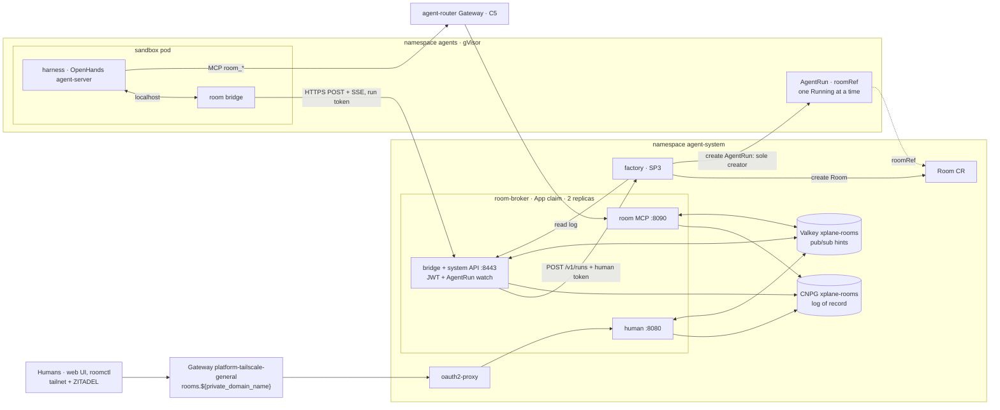
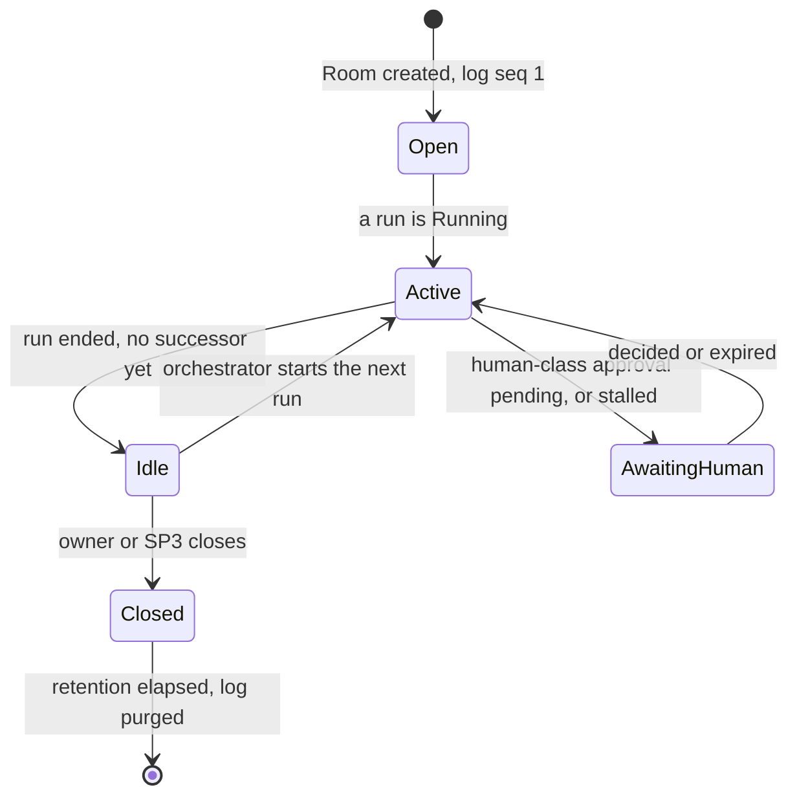
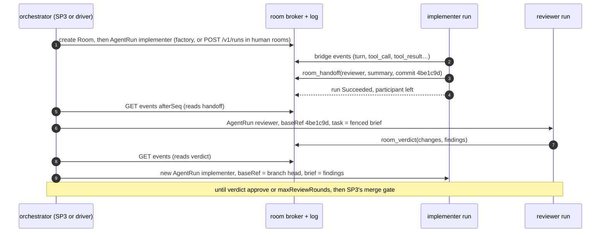
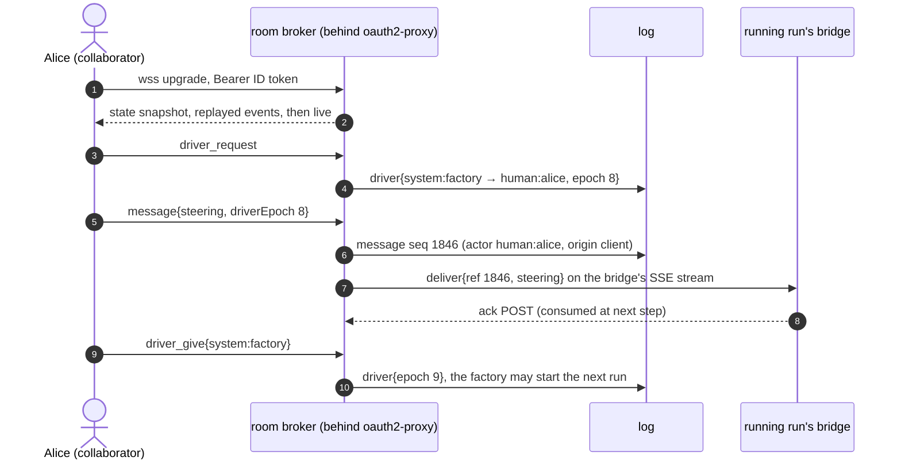
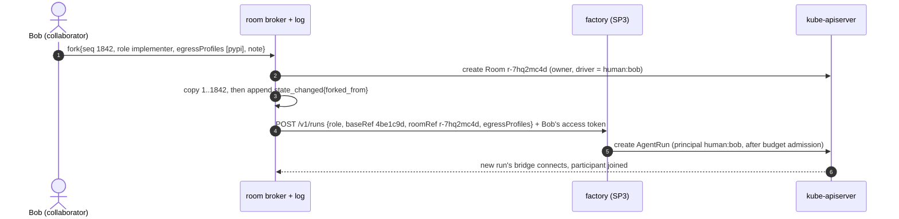
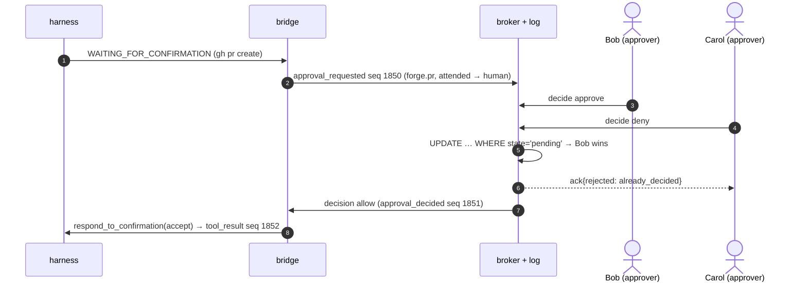

# Collaboration rooms: humans and agent roles in one ordered session (SP2)

**Date:** 2026-09-23 · **Status:** draft, aligned with programme r4; owner review pending · **Branch:** `docs/agent-factory-design`
**Programme:** [Agent Factory r4](2026-09-23-agent-factory-design.md): conforms to D1–D11 and C1–C7. **SP2 owns C4**,
whose frozen v1 envelope lives in the programme. **Evidence:** [research](2026-09-23-agent-collaboration-rooms-research.md).

## Summary

A **room** is one append-only log whose `seq` the broker assigns. Its participants are humans (ZITADEL) and
`AgentRun`s, each with its own identity and one role.

- **What we own:** the log and the authorization. We **mirror AHP's semantics** (sequenced log, replay, queued vs
  steering, first decision wins) without speaking AHP on the wire.
- **The broker** (stateless, `agent-system`) serves humans through the Tailscale Gateway behind oauth2-proxy, takes
  events **pushed** by each sandbox's room bridge (offline JWT check, then a live `AgentRun` watch), and stores the
  log in CNPG with Valkey fan-out.
- **Agents** collaborate **as sequential runs in one room**. A run records its handoff or verdict with room tools
  behind the `agent-router` Gateway. The next run is requested from SP3's factory, the only creator of runs (C3). In
  factory rooms the factory decides; in human rooms the driver does.
- **Humans** watch live, queue messages for the next run, steer the current one while holding the driver token,
  approve, fork, or fill a role themselves.
- **Approvals** are oversight, not a boundary: a run's capabilities are fixed at creation; widening means forking.

## Decisions

| # | Question | Decision | Rejected | Why |
|---|---|---|---|---|
| S1 | Session protocol | An AHP-shaped log **we own**; JSON over WebSocket for browser clients, plain HTTPS for room bridges (batched `POST` up, SSE down, C4 r5); every durable frame is a C4 envelope | AHP v0.9 on the wire; OpenHands conversations as the room API; ACP; A2A | AHP leaves auth and agent-to-agent out of scope and is pre-1.0. OpenHands has no identity. ACP is 1:1. A2A has no humans ([comparison](2026-09-23-agent-collaboration-rooms-research.md#protocol-and-client-options-compared)) |
| S2 | Room object | Namespaced CRD `Room` (`agents.ogenki.io/v1alpha1`) in `agent-system` (C1), reconciled by the broker | Rows only in the database; a Crossplane XR | `spec.roomRef` names it; SP3 creates rooms as it creates runs; `kubectl`/Headlamp visibility. Nothing is composed per room |
| S3 | How events reach the broker | **Push** from the room bridge (C3, C4) | Broker dials each sandbox | Keeps `agents` ingress-free and the harness key inside the pod |
| S4 | Agent authentication | Bridge token (audience fixed by SP1, C2), verified **offline** against an allowlisted issuer's JWKS. The run's `AgentRun` is then **watched**: the broker drops the connection once it is terminal, `revoked` or gone *(r5)* | TokenReview at connect and every 5 min *(the r4 decision)* | Issuer-agnostic (C2 r5): a runtime whose identities are not ServiceAccounts needs an allowlist entry, not a new auth path. A finished run is cut on the watch event rather than at the next 5-min check. One property is lost: a token from a replaced pod of a still-live run stays valid until expiry (≤ 600 s), the same window the gateway and octo-sts already accept (C3) |
| S5 | Human authentication | oauth2-proxy in front; the broker re-validates the forwarded ZITADEL ID token | SPA with a PKCE public client | An HttpOnly cookie keeps tokens away from a page that renders LLM output. It reuses a repo pattern |
| S6 | Agent↔agent | **Sequential runs in one room.** A run calls `room_handoff` / `room_verdict`; the orchestrator starts the next run with `spec.baseRef` and a brief built from the log | Live delivery between concurrent runs; free agent chatter; A2A between sandboxes | Matches SP3 (one task, one room, sequential roles) and SP1 (a run is a bounded unit). No second orchestrator, and no agent prompts another |
| S7 | agentgateway (D11) | **Not needed** | agentgateway as an A2A/agent proxy | Nothing speaks A2A. Revisit only if an agent outside the cluster must join a room |
| S8 | Storage | Standalone `SQLInstance` (CNPG, log of record) + standalone `KVStore` with `auth` (pub/sub hints) | Valkey Streams as the log; NATS JetStream; one broker replica | KVStore is cache semantics by its XRD. JetStream is new infrastructure. Spot interruptions make one replica an outage for every open approval |
| S9 | Approvals vs security | Approvals are **oversight UX**. A run's profile is immutable; widening means forking | Approvals that widen a live run | A harness confirmation is "advice to the model, not a boundary" (SP1). Boundaries are octo-sts, the ruleset, the `agent-router` Gateway and CNP |
| S10 | Who approves | Humans with the approver flag; `system:policy` for deterministic rules. **Never an agent** | A reviewer agent approving an implementer's action | One injected transcript would otherwise approve another |
| S11 | Deployment | `App` claim for the broker, with its own route off; HTTPRoute and oauth2-proxy beside it | Raw manifests | Dogfoods the golden path. The App XRD takes custom CNP rules and extra ports |
| S12 | Code | Go broker, bridge and `roomctl`, plus a small TypeScript UI, in `Smana/agent-platform` (OD-4) | — | Precedent `container-images/token-exchange-proxy/`; client-go for the `AgentRun` and `Room` watches |

## Target architecture



## 1. Room model

```yaml
apiVersion: agents.ogenki.io/v1alpha1
kind: Room
metadata: {name: r-3kq9x2ma, namespace: agent-system}  # "r-" + 8 base32, generated by the creator (as runId, C2)
spec:
  owner: system:factory                          # or human:<sub>
  driver: system:factory                         # initial driver token holder
  members: [{principal: "human:291847362183", role: collaborator, approver: true}]  # runs join via roomRef
  approvals: {profile: unattended, overrides: {forge.pr: human}, ttl: 4h, fourEyes: false}  # §6, OD-16
  retention: 90d                                 # OD-17
  dataClass: public                              # C3; runs requested for this room inherit it
status: {phase: Active, lastSeq: 1842, driver: "human:291847362183", driverEpoch: 7, pendingApprovals: 1}
```

`spec` is the policy and the initial access list. What happens afterwards is in the log, and `status` projects it.
Rooms are runtime objects created by SP3 or the broker, never committed to Git.



**One Running run per room** (SP3's sequential roles, D7). Deleting a Room runs a finalizer that deletes its runs
and seals the log. The log keeps its own retention clock.

**Roles.** Room roles are cumulative (watcher < collaborator < owner). **Approver** is an independent flag.
**Driver** is one token.

| Action | watcher | collaborator | approver | driver | owner | agent run | system |
|---|---|---|---|---|---|---|---|
| Read the log, live | ✓ | ✓ | — | ✓ | ✓ | `room_read` | ✓ |
| Chat (delivered to nobody) | — | ✓ | — | ✓ | ✓ | `room_post` | ✓ |
| **Queue** a message for the next run | — | ✓ | — | ✓ | ✓ | — | ✓ |
| **Steer** or **interrupt** the running run | — | — | — | ✓ | — | — | while driver |
| Start the next run (hand to a role) | — | — | — | ✓ | ✓ | — | factory |
| Decide an approval | — | — | ✓ | with flag | ✓ | **never** | `system:policy` |
| Driver token | — | request | — | give | take | — | give; yields to humans |
| Fork (new room owned by the forker, on the forker's budget, C5) | ✓ | ✓ | — | ✓ | ✓ | — | ✓ |
| Invite, change roles, close | — | — | — | — | ✓ | — | ✓ |

**Groups** (two new ZITADEL project roles, flattened into `groups`): `agents-admin` is owner and approver everywhere.
`agents-member` watches everywhere (small team, D1), may create rooms, and is collaborator or approver where granted.
Anyone else is rejected at oauth2-proxy.

| Rooms, runs and SP3 | Rule |
|---|---|
| Join | An `AgentRun` with `spec.roomRef` joins with its `spec.role` (`participant`, `state_changed{run_phase}`) |
| Admission | A bridge joins only its own run's `roomRef`: JWT from an allowlisted issuer → `sub` → `xplane-run-<runId>` → `AgentRun`, which must not be terminal or `revoked` |
| Next run | **Only the factory creates `AgentRun`s** (C3). The factory starts the next run itself in factory rooms. In human rooms, on the driver's "hand to role" or "add agent", the broker calls SP3's `POST /v1/runs` `{role, repository, baseRef, task, dataClass, roomRef}` and forwards that human's **access token** (from oauth2-proxy, never an asserted `sub`), so `principal` is the human and their daily budget applies. `baseRef` is the last recorded commit; `task` is a brief; the room's runs share one `spec.branch` (C3): SP3 sets `agent/<taskId>`, human rooms use `agent/<roomId>`. Before SP3 ships, the owner creates runs directly |
| The brief | The previous `handoff` summary and `review_verdict`, plus the queued messages, fenced as untrusted data |
| SP3 API (C4) | Create a room = create a `Room` CR. On :8443, `system:*` principals only (JWT, allowlisted `sub`): `GET /v1/rooms/{id}/events?afterSeq=&limit=` reads; `POST /v1/rooms/{id}/messages` appends a reserved kind (`task_state`) |
| Factory rooms | `system:factory` holds the driver token; the factory never advances a room while a human holds it (C4). SP3 decides verdict precedence |

## 2. Protocol and semantics

| Layer | Adopt verbatim | Mirror (AHP semantics, our shape) | Own |
|---|---|---|---|
| Harness | OpenHands agent-server API at SP1's pinned version | — | A four-operation adapter (§3), so another harness can be added |
| Log | — | `serverSeq` → `seq`, snapshot plus `fromSeq`, notifications never replayed | C4; gapless `seq` per room; actor stamping; redaction |
| Client wire | Browsers: one JSON message per WebSocket text frame. Bridges: one JSON message per `POST` array element up, per SSE `data:` event down | Queued/steering, one active turn, first confirmation wins, cancel → interrupt | Driver token with fencing epoch; role-gated approvals; four-eyes |
| Agent↔agent | — | `MessageChatAttachment`: the brief carries a bounded, frozen log excerpt | `room_*` tools; sequential hand-off |

An **AHP facade** can be added at AHP 1.0 without touching the log. Wire frames: [Appendix B](#b-wire-frames).

| Message | Who | Delivery |
|---|---|---|
| Queued | collaborator, driver, owner | FIFO room queue, visible, removable by its author or the driver. Goes into the **next run's brief**. The driver can promote one to steering |
| Steering | **driver only** | Injected into the running run now; OpenHands consumes it at its next step |
| Interrupt | driver only | Harness `interrupt` |

**Driver token.** Driver-only actions carry `driverEpoch` and apply only if `UPDATE rooms … WHERE driver_epoch =
$epoch` matches, which fences races across replicas. *give* names the next holder; *request* is visible to all, and a
system holder yields at once; *take* is for an owner or `agents-admin`, with a reason; a human holder disconnected
for more than 2 min or idle for more than 15 min falls back to the previous system holder.

**Approvals.** The first valid decision wins (`UPDATE approvals … WHERE state='pending'`); later ones get
`already_decided`. With OD-16 on, decisions from humans in the triggering turn's `causedBy` chain are rejected.

**C4 as SP2 applies it.** `origin` is `harness` (mirrored from a run), `client` (UI, `roomctl`, `room_*` tools) or
`broker`. Idempotency keys (`clientSeq`, `harnessSeq`) live in the wire frames and a unique database column.
`redactions` lists the rule IDs that fired. Payloads by type: [Appendix A](#a-c4-payloads).

## 3. Agent collaboration and the broker

**Room tools** are MCP, reached only through the `agent-router` Gateway (C1, C5). The broker derives `agent:<runId>`
from `x-ar-agent` and reads the role from the `AgentRun`, never from a header. **Fallback** if identity is not
projected to MCP backends (C5, unverified): the bridge relays these calls over its authenticated socket.

| Tool | Roles | Appends |
|---|---|---|
| `room_read(sinceSeq, limit)` | all | nothing; returns the room's `message` and `handoff` events, redacted |
| `room_post(text)` | all | `message{kind: chat}`, delivered to nobody |
| `room_handoff(toRole, summary, commit)` | implementer, tester, triager | `handoff` |
| `room_verdict(verdict, summary, commit)` | reviewer, tester | `message{kind: review_verdict, verdict: approve/changes}` (SP3's values) |

Agents cannot prompt each other: the only agent→agent path is a brief the orchestrator builds. Loops are bounded by
the orchestrator, through SP3's `maxReviewRounds` or a human clicking each hop. A human may fill a role; whether SP3
accepts a human `review_verdict` is SP3's policy.



**Listeners.** Any replica serves any room.

| Listener | Admitted from (CNP) | Authentication |
|---|---|---|
| human :8080 | oauth2-proxy pods | Re-validates the ID token (`Authorization`: `iss = ${identity_provider_url}`, `aud`, `exp`, `groups`) and the access token (`X-Forwarded-Access-Token`, same `sub`); `Origin` check against cross-site WebSocket hijacking |
| bridge + system API :8443 | `agents` sandbox pods; the factory | Offline JWT (allowlisted issuer, audience `room-broker`) → `xplane-run-<runId>` with its live `AgentRun`, or `system:factory` |
| room MCP :8090 | `agent-router` Gateway proxies | Injected credential plus `x-ar-agent` |

**Human path:** `platform-tailscale-general` → HTTPRoute `rooms.${private_domain_name}` → oauth2-proxy → :8080.

- HTTPRoute `timeouts.request: 0s` (Envoy's route default is 15 s); a 30 s ping stays under the 5 min idle timeout.
  `agent-system` joins the Gateway's `allowedRoutes`.
- oauth2-proxy copies `tooling/gcp-0/headlamp/oauth2-proxy.yaml`, plus `pass-access-token` (the access token the
  broker forwards to `POST /v1/runs`, C4) and `cookie-samesite: strict`. Its `rooms-proxy` ZITADEL client issues
  **JWT** access tokens, unlike the repo's other consumers (opaque `OIDC_TOKEN_TYPE_BEARER`), so the broker and the
  factory can validate them offline. `roomctl` uses its own native client via `skip-jwt-bearer-tokens`.
- Connections live for `min(token exp, 1 h)` and replay losslessly, so revoking a group takes effect within the hour.

**Agent path.** The bridge dials `room-broker.agent-system.svc:8443` with a token mounted only in its own container;
the last connection per `runId` wins. gcp-0 lacks aws-0's Cilium WireGuard, so it needs TLS on :8443 first.
**Bridge container:** liveness and readiness `GET /healthz` on **:8085** (kubelet only). It checks the process and its
harness socket, never the broker, so a broker outage cannot mark sandboxes unready. Requests 20m/32Mi, limits 100m/64Mi.

**Harness adapter: SP2's requirement on the harness (SP1).** The bridge is its **only** client (OpenHands#17485
cannot bite) and needs four local operations, all in agent-server v1.49.5: a durable stream with a cursor
(`WS /sockets/session/{id}?after_seq=`), message injection (`POST /api/conversations/{id}/events`, `run: true`),
confirmation answers (`…/events/respond_to_confirmation` under `AlwaysConfirm`) and `…/interrupt`.

**Event mapping.** `MessageEvent` → `message`; `ActionEvent` → `tool_call`; `ObservationEvent` and
`UserRejectObservation` → `tool_result`; state, error, pause and interrupt events → `turn`/`state_changed`;
`StreamingDeltaEvent` → transient. System-prompt, completion-log, condensation and token events are dropped.

**Nothing is lost when the log is down.** The broker says where to resume (`afterHarnessSeq`) and the harness keeps its
own store, so a broker or database outage delays the log without losing events while the sandbox lives.



## 4. Storage and fan-out

| Claim (`agent-system`) | Settings | Why standalone |
|---|---|---|
| `SQLInstance xplane-rooms` | 1 instance, 20 Gi, daily backup to `${region}-ogenki-cnpg-backups`, `objectStoreRecovery`, `atlasSchema` | Only the standalone XRD has `objectStoreRecovery`, which lets the log survive routine rebuilds |
| `KVStore xplane-rooms` | nano, `auth.existingSecret` from the `agents-secrets` store (`platform/agents/*`, C1) | The App sub-block has no `auth`, and the KVStore CNP admits the whole namespace |

**Append.** One transaction: `UPDATE rooms SET last_seq = last_seq + 1 RETURNING`, `INSERT`, `COMMIT`. The row lock
serialises writers per room, and a rollback also undoes the counter, so `seq` stays gapless. The broker's database
role has **INSERT and SELECT on `events`, nothing else** ([Appendix C](#c-log-schema)).

**Replay** follows OpenHands #4681: subscribe to Valkey in buffering mode, read the high-water mark, page from
Postgres up to it, then flush the buffer, dropping any `seq ≤ mark`.

A gap in live `seq` triggers a range read. **Valkey is only a hint**: if it is down, replicas poll Postgres every
second. A connection over its 2 MiB pending budget is dropped and resumes from `afterSeq`.

**Redaction** happens in the broker, before the append, on every payload. It uses gitleaks' `detect` package, and a
unit test pins four rules: `github-app-token` (octo-sts `ghs_`), `github-pat`, `jwt` (ServiceAccount and ZITADEL
tokens) and `private-key`. Matches become `[REDACTED:<rule>]`. Broker logs carry envelope metadata only.

**Limits.** Payload 64 KiB (C4), with tool output truncated to 16 KiB; human message 16 KiB; a room is sealed at
100 000 events or 256 MiB; 10 actions/s per human (burst 20); `room_*` 1/s per run; 10 connections per principal;
20 humans per room.

**Retention.** A daily DELETE-only CronJob purges rooms closed longer than `spec.retention` ago (OD-17). At about
4 MB per run, 20 runs a day for 90 days is about 7 GB, within 20 Gi. An alert fires at 80%.

## 5. Handoff, fork and the unit of review

| Term | Moves | Branch |
|---|---|---|
| `driver` | Who may steer and interrupt | unchanged |
| `handoff` | Which role works next, with the commit | the next run's `baseRef` is that commit |
| Fork | A new room from a log prefix | new |

**Fork at `seq N` of room R, by P.**

1. Create R′, owned and driven by P. Copy events 1..N **with their `seq`**, then append
   `state_changed{forked_from}`. Copying survives R's purge.
2. Optionally request a run via `POST /v1/runs` with P's access token, on R′'s branch: `baseRef` is the last commit at
   or before N, `task` a fenced brief; extra **`egressProfiles`** (SP1's `pypi`, `npm`, `golang`, `crates`) widen
   egress (S9). Before SP3 ships, the broker shows the `AgentRun` for the owner to create. R and its PR are untouched.
   Harness memory is not transplanted (an OpenHands fork stays within one server).

**The PR stays the unit of review.** PRs open only through `forge.pr` (§6); SP3's gate merges (C6). The PR body
links `Agent-Room: https://rooms.${private_domain_name}/r/<id>`, a private tailnet URL, so a public PR exposes a room
ID and **no transcript**. A fork's PR carries `Forked-from: <branch>@<sha>`.



## 6. Approvals

The bridge sets `AlwaysConfirm` and classifies each pending action deterministically. It answers locally (`allow`,
`deny`) or escalates (`human`), and every outcome is logged.

| Class | Detected | Hard boundary (SP1, C6) | `attended` | `unattended` |
|---|---|---|---|---|
| `forge.push` | push of the run's branch | octo-sts role scope; ruleset `agent/**` | allow | allow |
| `forge.pr` | `gh pr create/edit/ready` | App permissions; never merges | human | allow: the PR precedes the review, and the verdict gates only SP3's auto-merge arming |
| `forge.other` | any other forge write | App permissions by role | human | deny |
| `mcp.write` | MCP tool not annotated read-only | Agent Router per-role allowlist | human | deny |
| `shell.high` | harness risk `HIGH` | gVisor + default-deny CNP | allow, logged | allow, logged |
| `egress.new` | not approvable | Cilium FQDN allowlist | fork with extra `egressProfiles` | deny |

**Timeouts.** Attended: 30 min, then `expired`, which the harness receives as a rejection. Unattended: a `human`
class parks the room in `AwaitingHuman`; `RoomApprovalPendingTooLong` reaches Slack after 15 min (Alertmanager,
ADR-0037), and `spec.approvals.ttl` then auto-denies. A parked run spends no tokens but keeps its sandbox.



## 7. Threat model

| # | Threat | Controls | Residual |
|---|---|---|---|
| T1 | Injection by a human participant | Only members prompt; attribution is immutable; runs cannot exceed their profile (S9, D3); side-effect classes need an approver | Wasted budget, bad code. Bounded by C5 and the merge gate |
| T2 | Injection agent → agent (brief, verdict, branch code) | No direct agent→agent path; peer text fenced as data; reviewers have read-only forge scope (C3); a verdict has no power beyond SP3's gate | An injected reviewer can approve bad code *inside the room*; CI and the merge gate remain |
| T3 | Injection into humans | Approval cards render the raw action, not the agent's prose, plus the `causedBy` author | Social engineering of an approver |
| T4 | Impersonation | The broker stamps `actor` (C4); offline JWT checks for runs and the factory, plus a live `AgentRun` watch for runs; re-validated ID tokens; a run joins only its `roomRef` | A token from a replaced pod of a still-live run is accepted until expiry (≤ 600 s, S4) |
| T5 | Replay, duplicates | Unique idempotency keys; single-use `approvalId`; `driverEpoch` fencing; short-lived tokens | — |
| T6 | Self-confirmation at the harness | Approvals are oversight by design; consequential actions are enforced outside the sandbox; agent events are untrusted claims (C4) | A self-confirmed in-profile action is logged as reported. Gateway and forge logs are ground truth |
| T7 | Authorization bypass at the broker | One enforcement point; every action re-checked against database state; `not_permitted` counted and alerted | Broker bugs; tests of the §1 matrix |
| T8 | Transcript leakage | Redaction before append; members only; tailnet host; no transcript in PRs; append-only role; retention | Secret shapes gitleaks does not know |
| T9 | Cross-site WebSocket hijacking | `Origin` check; `cookie-samesite: strict` (oauth2-proxy's default is empty) | — |
| T10 | XSS from LLM output | Markdown with HTML disabled; strict CSP; HttpOnly cookie | XSS could still act *as* the user through the page |
| T11 | Denial of service | §4 limits; byte budgets; authentication before subscription; C5 budgets bound agent loops | A tailnet member can load the broker |
| T12 | Broker compromise | No harness keys (S3); cannot rewrite history; own CNP; runs only through the factory API, under a live human's token and budget | Reads all rooms; can request runs as a connected human |

## 8. Clients (OD-15)

A **web UI served by the broker** carries every semantic (driver, approval cards showing the raw action, queue,
presence, fork), needs no install, works on a phone for approvals and screenshots well for the blog. It renders
markdown with HTML disabled under a strict CSP. `roomctl` follows in phase 6. **Claude Code is never an approving or
steering client**: untrusted room content would flow into an LLM holding the owner's local credentials. Options are
compared [in the research](2026-09-23-agent-collaboration-rooms-research.md#protocol-and-client-options-compared).

## 9. Observability and constitution compliance

**Network policies (default deny).**

| Endpoint | Ingress | Egress |
|---|---|---|
| room-broker | oauth2-proxy → 8080; sandbox pods and the factory → 8443; `agent-router` proxies → 8090; `observability` → 9090 | kube-dns 53 with `rules.dns matchPattern "*"`; `kube-apiserver`; CNPG 5432; Valkey 6379; factory run-request API; toFQDNs identity provider 443 |
| oauth2-proxy | `ingress` entity → 4180 | kube-dns; identity provider 443; broker 8080 |
| CNPG `xplane-rooms` | broker 5432; CNPG operator 8000; `observability` 9187 | kube-dns; kube-apiserver; object storage (backups); peers |
| Valkey | same namespace 6379 (composition); `observability` 9121 | none |

No manifest in the repo selects `cnpg.io/cluster` pods, so SP2 writes the CNPG policy itself.

**Workload.** 2 replicas, PDB `minAvailable: 1`; 100m/128Mi requests, 500m/256Mi limits; PSS restricted; `/healthz`,
`/readyz` (Postgres), `/startupz` (schema). RBAC: `system:auth-delegator`, read and delete on `agentruns` (never create,
C3), CRUD on `rooms`; no cluster-admin. Secrets come only from the namespaced `agents-secrets` store
(`platform/agents/*`, C1), never `openbao-platform`; the `rooms-proxy` client is written under that path.

**Metrics:** `rooms{phase}`, `rooms_participants`, `rooms_connections`, `rooms_events_appended_total{type,origin}`,
`rooms_append_seconds`, `rooms_fanout_lag_seconds`, `rooms_approvals_pending`, `rooms_approval_decision_seconds`,
`rooms_driver_changes_total`, `rooms_redactions_total{rule}`, `rooms_rejected_actions_total{reason}`,
`rooms_connections_dropped_total{reason}`.

**Alerts** (one `VMRule`): `RoomApprovalPendingTooLong`, `RoomStalled` (no durable event for 30 min),
`RoomBrokerDown`, `RoomLogAppendErrors`, `RoomRejectedActionsSpike`, `RoomRedactionsSpike`, `RoomLogDiskFilling`.
Logs are structured JSON with envelope metadata only.

**Constitution.** `xplane-*` prefix on claims; a policy per endpoint; no inline credentials; the Room CRD schema in
the validation catalog (`skipMissingSchemas: false`).

## Success criteria

| ID | Criterion | Evidence |
|---|---|---|
| SC-1 | Gapless log | `SELECT max(seq) = count(*) FROM events WHERE room_id=$1` is true |
| SC-2 | Two ZITADEL users watch; killing a broker pod loses and duplicates nothing | Two web UI sessions reconnect after `kubectl delete pod`; the client's seq check reports no gap or duplicate, and each session's last seq equals the Room's `status.lastSeq` |
| SC-3 | Only the driver steers | A collaborator's steering gets `not_permitted`; after `driver_give` it is accepted; `driver{epoch n+1}` |
| SC-4 | Sequential collaboration | A factory room holds implementer → `handoff` → reviewer → `review_verdict` → implementer, one Running run at a time; SP3 reads the verdict through the API |
| SC-5 | Approval race | Two approvers within 1 s: one `approval_decided`, one `already_decided`; the `tool_result` comes after the decision |
| SC-6 | Unattended approval | Slack receives `RoomApprovalPendingTooLong`; `approval_decided{expired}` at TTL |
| SC-7 | Fork | Payload hashes of events 1..N are equal in R and R′; the new run's `baseRef` is the recorded commit |
| SC-8 | Redaction | Plant a `ghs_` token and a JWT in tool output: `strpos(payload::text, '<planted>')` matches 0 rows; `rooms_redactions_total` > 0 |
| SC-9 | Authentication | Joining another room with a run's token is rejected; a deleted `AgentRun`'s bridge is cut within 6 min; a user without an agents group gets 403 |
| SC-10 | Append-only | `UPDATE events` as the broker role fails with `permission denied` |
| SC-11 | Network | No `DROPPED` on the §9 flows; a pod in `agents` without the sandbox label cannot reach :8443 |
| SC-12 | Latency | p95 `rooms_fanout_lag_seconds` < 0.5 s over a one-hour demo |
| SC-13 | Gates | `validate-manifests.sh` exits 0 with `Invalid: 0`; `validate-vmrules.sh` and `validate-links.sh` exit 0 |

**Non-goals:** AHP wire compatibility now; agents from outside the cluster (A2A); rooms spanning clusters; concurrent
runs in one room; widening a live run; harness memory on fork; CRDT co-editing, a shared PTY or voice; a human's
local agent acting in a room for them.

## SP2-specific open items and risks

| Item | Mitigation |
|---|---|
| Agent Router projecting identity to MCP backends (C5, unverified) | The bridge-relay fallback (§3) |
| Envoy timeouts on idle long-lived streams (browser WebSockets through Cilium + Tailscale, bridge SSE through the in-cluster route) | `timeouts.request: 0s` plus a 30 s ping (a WebSocket ping, an SSE comment line); phase 2 holds each kind idle for 30 min |
| OpenHands confirming several pending actions at once (unverified) | One `human` action holds its siblings. Acceptable; check in phase 4 |
| OpenHands API churn; bridge crash re-delivery; one CNPG instance; no WireGuard on gcp-0 | Pinned harness plus contract test; duplicates visible in the log; rooms stall but lose nothing; TLS on :8443 before gcp-0 |

## Implementation outline, ADRs and owner decisions

Each phase is one PR here plus a release of `Smana/agent-platform` (OD-4). aws-0 comes first.

| Phase | Delivers | SC |
|---|---|---|
| 1 · Log | Room CRD and controller, bridge, :8443, `SQLInstance` + Atlas, C4 append, redaction, SP3 API | 1, 8, 10 |
| 2 · Live viewers | oauth2-proxy, route, ZITADEL client and groups, read-only UI, replay, `KVStore`, 2 replicas | 2, 9, 11, 12 |
| 3 · Driver and messages | Queue, steering, interrupt, driver token, "hand to role" | 3, 4 |
| 4 · Approvals | Classification, profiles, first-wins, TTL, VMRule to Slack | 5, 6 |
| 5 · Room tools | MCP behind the `agent-router` Gateway, or the bridge-relay fallback | 4 |
| 6 · Fork + `roomctl` | Prefix copy, runs through SP3's API, CLI | 7 |
| 7 · gcp-0 | TLS on :8443, issuer variable, gcp-0 umbrella | 13 |

| ADR | Chosen | Over |
|---|---|---|
| **0044** · Session protocol: protocol, collaboration model and log storage | AHP-shaped log we own; sequential runs with room tools; CNPG `SQLInstance` as record, Valkey `KVStore` as hints | AHP verbatim, OpenHands shared conversations, ACP, A2A/agentgateway; Valkey Streams, NATS JetStream, one in-memory broker |
| **0049** · Room client and human auth | Web UI served by the broker behind oauth2-proxy (OD-15) | Headlamp plugin, CLI only, AHP facade, browser PKCE app |

Owner decisions are consolidated in the programme: client OD-15, four-eyes OD-16, retention OD-17, code location OD-4.

## Appendix

### A. C4 payloads

| `type` | Payload |
|---|---|
| `message` | `{kind: chat/review_verdict/task_state, text, to[], delivery: none/queued/steering}`. `review_verdict` adds `{verdict: approve/changes, commit}`. SP3 defines `task_state` |
| `turn` | `{runId, turnId, phase: started/completed/cancelled/failed}` |
| `tool_call` | `{callId, tool, args, class, risk, decidedBy: policy/human/null}` |
| `tool_result` | `{callId, status: ok/error/rejected, output, truncated, bytes}` |
| `approval_requested` | `{approvalId, callId, class, action, expiresAt}`. `action` is the raw, redacted call |
| `approval_decided` | `{approvalId, decision: approved/denied/expired, reason}` |
| `participant` | `{principal, change: joined/left/role_changed, role, approver}` |
| `driver` | `{from, to, epoch, reason: given/requested/taken/lease_expired}` |
| `handoff` | `{fromRole, toRole, summary, commit, branch}` |
| `state_changed` | `{kind: room_phase/run_phase/queued_removed/commit/forked_from/limit, …}` |

### B. Wire frames

| Direction | Frames |
|---|---|
| client → broker | `hello {roomId, afterSeq?, tail?}` · `act {clientSeq, action, driverEpoch?}` · `ping` (30 s) |
| broker → client | `state {throughSeq, snapshot}` · `sync {fromSeq, throughSeq}` · `event {C4}` · `ack {clientSeq, seq / rejected}` · `transient {delta/presence/typing}` |
| bridge ↔ broker | `hello {runId}` → `resume {afterHarnessSeq}` · `event {harnessSeq, …}` · `deliver {ref, steering}` · `decision {approvalId, allow}` · `interrupt` |

Actions: `message`, `remove_queued`, `promote_queued`, `decide`, `driver_request`, `driver_give`, `driver_take`,
`interrupt`, `start_run`, `fork`, `invite`, `close`.

### C. Log schema

| Table | Holds | Broker role |
|---|---|---|
| `events` (PK `room_id, seq`; unique `room_id, origin_client, origin_seq`) | The log | INSERT, SELECT |
| `rooms` | Sequencer, driver, phase, retention | SELECT, UPDATE |
| `approvals`, `queue` | Projections for first-wins and FIFO | SELECT, INSERT, UPDATE |
| — | Retention CronJob | DELETE on closed rooms' events (a separate role) |
