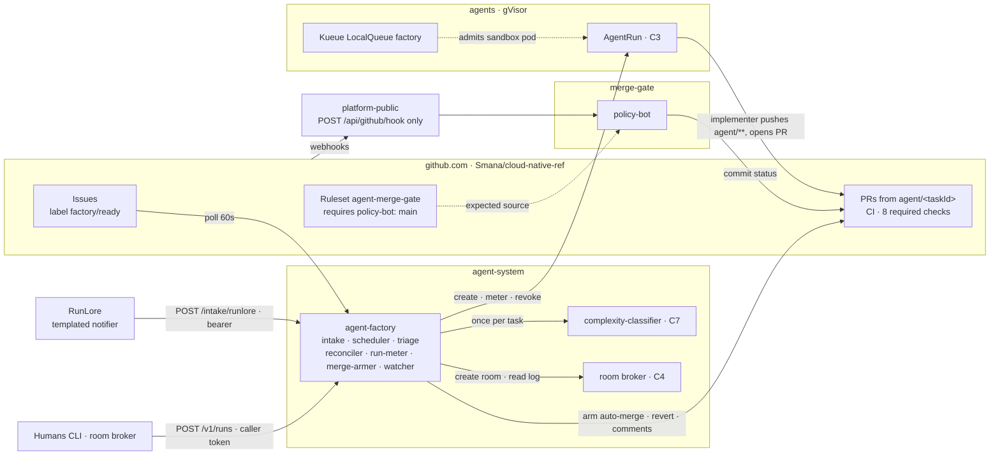
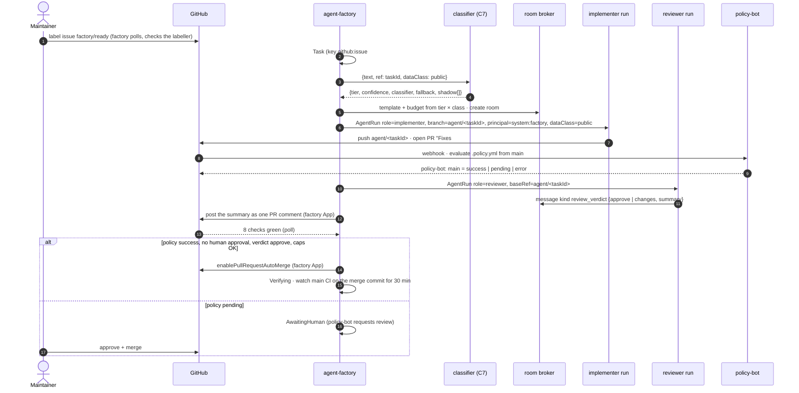
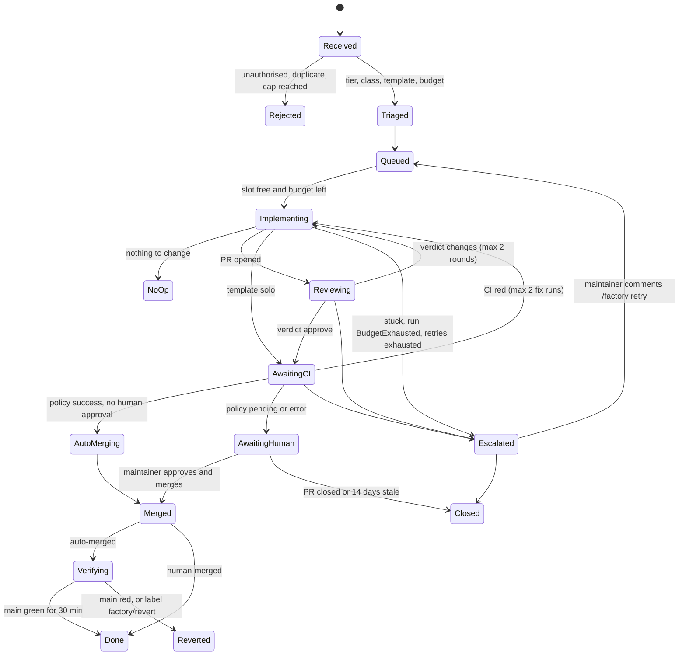

# SP3 — Agent dark factory

**Date**: 2026-09-23 (aligned to programme r4, 2026-09-24)
**Status**: Design — draft, owner review pending
**Programme**: [Agent Factory](2026-09-23-agent-factory-design.md). Its D1–D11, C1–C7 (r4) and
OD-1…OD-17 bind this spec and are not restated. SP3 relies on OD-4, -7, -8, -9, -10, -11 and -14
**Research**: [2026-09-23-agent-dark-factory-research.md](2026-09-23-agent-dark-factory-research.md)
**Touches**: `.policy.yml` (new), a repository ruleset on `main`, `tooling/base/agent-factory/`,
`tooling/base/policy-bot/`, `clusters/aws-0-agent-platform/`, `observability/base/runlore/`,
`scripts/ci/`; code in `Smana/agent-platform` (OD-4)
**Requires before merge**: ADR-0045 (merge policy gate), ADR-0048 (factory orchestrator)

## Outcome

Triggers start teams of agents with no human in the loop. An agent PR in a **live low-risk class**
merges once CI is green. Every other agent PR stops for a maintainer's review. Every action can be
traced from its trigger to the merge. A kill switch and three levels of budget bound the whole thing.

The design rests on three properties:

1. **Merge authority is decided at merge time, from `main`, by code agents cannot change**:
   policy-bot reads `.policy.yml` from the target branch, and its status is required from its App.
2. **Anything that could widen an agent's autonomy is a gate path.** An agent PR touching one
   matches no rule, so policy-bot posts `error` and no approval can rescue it.
3. **Every control fails towards more human review.** A mis-predicted class, a spoofed author, a
   stripped label or an unmatched rule lands the PR in front of a human, or blocks it.

## Decisions

| # | Question | Decision | Rejected | Why |
|---|---|---|---|---|
| S1 | What starts work | A maintainer applies label `factory/ready` to an issue. RunLore findings arrive via its `templated` notifier. Schedules live in the factory config | Issue-opened trigger; assigning an issue to a bot; webhook-only intake | Anyone can open an issue on a public repo, but only Triage+ can label one. GitHub never redelivers a failed webhook, so the factory **polls** and exposes no public endpoint |
| S2 | Record of work | A `Task` custom resource in `agent-system`, created at runtime and never kept in Git. Its name derives from an idempotency key | A database; the GitHub issue as the only record | `AlreadyExists` gives deduplication for free, and there is nothing new to run |
| S3 | Triage | Deterministic rules plus **one** C7 call per task (D8) | An LLM triager deciding risk | Risk is enforced by policy on the *diff* at merge time. What triage predicts only chooses the team and the budget, so a wrong prediction costs efficiency, never safety |
| S4 | Teams | Four declarative templates. Roles run as sequential `AgentRun`s in one room, and only the implementer writes | Concurrent roles on one branch | D7 allows one driver at a time, and C3 grants `contents: write` to implementers only |
| S5 | Orchestrator | A small **custom controller**, `agent-factory`, with **Kueue** admitting sandboxes (ADR-0048) | Argo Workflows, Tekton, Temporal, a Crossplane `Task` XR, gh-aw | [§4](#4-orchestrator) |
| S6 | Merge gate | **policy-bot**, whose `policy-bot: main` status a **repository ruleset** requires from policy-bot's App (ADR-0045). Bypass per OD-7 | Required reviews, rulesets + CODEOWNERS alone, a custom Actions check, Prow/tide, Mergify, Kodiak | [§5](#5-merge-policy-gate-d4); alternatives in the [research](2026-09-23-agent-dark-factory-research.md#merge-gate) |
| S7 | Who merges | The **factory's App** (C6) turns on native auto-merge for low-risk PRs. Humans merge the PRs they review | Agents enabling auto-merge; a merge bot | GitHub native auto-merge waits for protection and rulesets alike, and Renovate already relies on it |
| S8 | Classes at v1 | **Live**: `docs-links`, `revert`. **Shadow**: `docs`, `tests`, `dashboards` (OD-8) | Every D4 example live from day one | Docs PRs wait for owner review. A shadow class is promoted only on evidence |
| S9 | Self-modification | Gate paths ([§5.3](#53-gate-paths)) are unmergeable when an agent authored the PR, even with an approval | Letting a human approve an agent's policy change | It keeps "a compromised agent talks the reviewer into a wider regex" off the table |
| S10 | Kill switch | Five layers, two of them independent of the factory ([§6.1](#61-kill-switch)) | A single `replicas: 0` | Flux reverts a scale-down, and a kill switch cannot depend on the component it kills |
| S11 | Rollback | Only **auto-merged** changes are reverted automatically, by a factory-authored revert PR. One revert pauses that class | Auto-reverting human-merged changes | A human who merged a change owns its rollback |

## Architecture





## 1. Intake

| Source | Trigger | Authorisation | Idempotency key | Content |
|---|---|---|---|---|
| GitHub issue | Label `factory/ready` applied | The `labeled` event's actor must be in `maintainers` (factory config), which is stronger than Triage+ | `github:issue:<repo>#<n>:gen<k>`. `k` increments on re-labelling after the previous task ended | Title and body **snapshotted at label time**, with the sha256 recorded. Later edits are ignored until someone re-labels. Comments from non-maintainers are never forwarded. `dataClass: public` |
| RunLore | `notify.templated` POST to `http://agent-factory.agent-system:8080/intake/runlore` | Bearer token (`token_env`): one value, read by the factory from `platform/agents/*` and by RunLore from its own store. CNP ingress from namespace `runlore` only | `runlore:<alert_name>:<resource_ref>`, **while a task for it is open** | Accepted when `verdict ∈ {action_required, action_suggested}` and `confidence ≥ 0.75`. The factory opens an issue from it. `dataClass: internal` |
| Schedule | A cron entry in the factory config | The config is a gate path | `schedule:<name>:<scheduled-time>` | Task text comes from config. A GitHub-API probe runs first where one exists (e.g. Renovate PRs red for more than 24 h). If it finds nothing, no task is created. `dataClass` from the entry, default `public` |

- **RunLore findings become issues** (`factory/proposed`, plus `factory/ready` when actionable, 5 a
  day, OD-9): one discussion place, stop handle and dedup path for all human-visible work.
- **Polling, not webhooks**: issues every 60 s, each active PR every 30 s in one GraphQL query;
  about 1 000 requests an hour at the [§6.2](#62-caps-and-budgets) caps, against 5 000 allowed.
- **Renovate owns bumps.** The factory's only dependency role, `renovate-red`, opens an `agent/**` PR
  with the bump plus the fix; Renovate closes its own as unneeded. Tasks never push `renovate/**`.

## 2. Triage

| Step (once per task; deterministic except C7) | Output | Rule |
|---|---|---|
| Admission | accept / reject | Kill switch off; source authorised; text ≤ 32 KiB; daily task cap not reached; `AwaitingHuman` WIP below its cap for review-class work |
| Complexity (C7) | `tier`, `confidence`, `classifier`, `fallback`, `shadow[]` | `{text, ref: <taskId>, dataClass}`, the same `dataClass` every run of the task gets as `spec.dataClass` (C3; it picks reachable backends, OD-13). The `investigate` template forces `internal`. Recorded as-is in `status.classification`. Per OD-14, a control group runs at `tier-frontier` whatever the classifier says, flagged `control: true` |
| Predicted risk class | one class, or `review` | The schedule's `class`; else a maintainer-applied `class:<name>` label; else `review`. **RunLore tasks are always `review`** |
| Template, budget | template + caps | The table below; [§6.2](#62-caps-and-budgets) |

| Predicted class ↓ / tier → | light | standard | frontier |
|---|---|---|---|
| `docs-links` | solo | solo | pair |
| `docs`, `tests`, `dashboards`, `review` | pair | pair | trio |
| `review`, source RunLore | investigate | investigate | investigate |

**The predicted class is intent, not authority**: it picks team and budget, labels the PR
`factory/class:<name>`, and feeds the circuit breaker ([§6.4](#64-rollback)). Only policy-bot's
verdict on the actual diff merges anything; a mismatch waits for a human and counts a `class_mismatch`.

## 3. Team templates

```yaml
templates:    # factory config, a gate path
  solo:        { roles: [implementer] }                        # CI tests, policy reviews
  pair:        { roles: [implementer, reviewer], maxReviewRounds: 2 }
  trio:        { roles: [implementer, tester, reviewer], maxReviewRounds: 2 }
  investigate: { roles: [triager, implementer, reviewer], maxReviewRounds: 1 }
```

| Rule | Why |
|---|---|
| A task owns one room and one branch: the factory sets `spec.branch: agent/<taskId>` (C3) on every run instead of relying on harness defaults. Runs are sequential, each a fresh `AgentRun` whose `runId` the factory generates (C2), and **no run starts while a human holds the room's driver role** (C4) | One driver at a time (D7). Deleting a run revokes it, so the task, not the run, owns continuity |
| Only the implementer writes. The tester, reviewer and triager start from `spec.baseRef: agent/<taskId>`, read-only (C3) | The tester runs the repo's validators in its sandbox and reports to the room. The triager re-confirms a RunLore finding over read-only MCP |
| The implementer's `spec.task` carries the snapshotted text with its provenance (`source.trust`) | SP1's harness decides how to fence untrusted input. SP3 guarantees that the provenance travels with the text |
| The reviewer, on a different tier from the implementer where possible, outputs a C4 `message` of kind `review_verdict` (`approve`/`changes` plus a summary). The **factory** posts the summary as one PR comment, never as line threads | `required_conversation_resolution` is on, so an unresolved thread would block even a green PR. The reviewer holds no forge write |
| A `changes` verdict starts a new implementer run on the same branch, up to `maxReviewRounds`, then the task escalates. A **human's** `review_verdict` in the room supersedes the agent reviewer's. Merge approval is still only a GitHub review, never a room verdict | Loops are bounded. Humans steer the flow; the gate stays in GitHub |

## 4. Orchestrator

The decision is **`agent-factory`**, a Go controller (controller-runtime, go-githubapp) reconciling
`Task` objects, shipped from `Smana/agent-platform` (OD-4) as a signed chart, with leader election.
**Why custom wins** (criteria matrix in the [research](2026-09-23-agent-dark-factory-research.md#orchestrator)):
the lifecycle is a reconciliation against GitHub state over hours, and budgets and the kill switch
are domain logic any option would still need. Argo Workflows, the runner-up, waits on GitHub via
suspend/resume or polling pods and has no budget concept; Temporal adds a server and a database; a
Crossplane XR has no timers, events or backoff. The cost is ours: one CRD, one config file, libraries.

**Kueue**: ClusterQueue `agents`, LocalQueues `factory` and `interactive` (`spec.queueName`, C3),
capping sandbox pods and offering a `stopPolicy: HoldAndDrain` stop independent of the factory.
**`Task`** (`agents.ogenki.io/v1alpha1`, `agent-system`, name `base32(sha256(key))[:8]`): `spec` =
`source {kind, ref, key, requestedBy, trust, contentSHA256}`, `repository`, `text`, `predictedClass`,
`template`, `budget`; `status` = `phase`, `classification`, `runs[]`, `roomRef`, `pullRequest`,
`usage.tokens`. Never in Git, so `skipMissingSchemas` is unaffected. Templates, classes, schedules,
caps and maintainers sit in one config file parsed strictly at startup: a bad config fails its rollout.

**Run meter** (C3/C5; Crossplane owns `AgentRun` status, so nothing patches it). Every 30 s, on
**every** run, human-launched included, it writes annotation `agents.ogenki.io/usage-tokens` from
gateway metrics, and revokes via `agents.ogenki.io/revoked`: `budget-run` at `maxTokens`,
`budget-principal` past the daily cap, gateway budget 429s mapped to the matching `budget-*`. The
factory writes `agents.ogenki.io/pull-request`; a stop writes `revoked: manual`. The composition
projects them into `status.usage.tokens`, `status.pullRequest` and `phase` (`BudgetExhausted` for
`budget-*`, `Revoked` for `manual`). **Before SP3 ships**, the owner creates runs directly.

**Run-request API** (C3/C5: once SP3 ships, only the factory creates `AgentRun`s). `POST /v1/runs`
takes `{role, repository, baseRef, task, dataClass, roomRef}`, optionally `model` (default
`agent-default`), `maxTokens` (default 2 M, ≤ 5 M) and `egressProfiles` (SP1's names), from the room
broker and the human CLI; the factory derives `spec.branch` and never accepts it: `agent/<taskId>`,
else `agent/<roomId>` when `roomRef` is set (a fork gets its new room's), else `agent/<runId>`. The
**principal comes from the caller's token, never the body**: a ZITADEL JWT access token, checked
offline against ZITADEL's JWKS → `human:<sub>` (the broker forwards the human's, C4), an allowlisted
SA token → `system:<component>`. Admission (principal/day, OD-6 repo allowlist, role, `dataClass`,
queue `interactive`) runs here: `201 {runId}`, `429` over budget, or `403`. Only the factory's
ServiceAccount may create `agentruns` (RBAC, [§6.5](#65-workloads-constitution-3-53)); a Kyverno rule
denies every other creator, cluster-admins included (break-glass: suspend it via Flux).



The kill switch moves any non-terminal state to `Stopped` (not drawn). A retry after
`BudgetExhausted` is a new run, never a model switch inside the old one (C5).

## 5. Merge policy gate (D4)

### 5.1 Mechanism

| Piece | Setting |
|---|---|
| policy-bot | Namespace `merge-gate` (C1), no DB, 2 replicas, image pinned by digest, Renovate automerge off for it. Its App has statuses RW, pull requests RW, and contents/checks/issues/actions/administration RO |
| Webhook | New `platform-public` listener `policy-bot.${public_domain_name}` + HTTPRoute **`POST /api/github/hook` Exact**, HMAC secret from the `merge-gate` store (the RunLore `/slack/interactions` precedent). The details UI is served on the tailnet gateway only |
| Policy source | `.policy.yml` at the repo root, read from `main`. Server option `shared_repository: ""` |
| Required check | Ruleset `agent-merge-gate` on the default branch requires `policy-bot: main`, **expected source = policy-bot's App**. Bypass: OD-7 (the owner as admin, PRs only, and Renovate) |
| Classic protection | **Unchanged**: 8 CI contexts from app 15368, `enforce_admins`, 0 reviews, `strict: false`, conversation resolution |
| Merge actor | The factory App calls `enablePullRequestAutoMerge` only when all hold: agent-authored, `policy-bot: main` = success with **no** maintainer approval (so a live class matched), reviewer verdict `approve` if the template has one, the head commit's `Agent-Run` trailer names one of the task's `runId`s (another task's run pushing here fails it, SP1 R9), class not paused, daily auto-merge cap not reached |

A ruleset, not classic protection, because clusters here are torn down routinely and an absent
policy-bot would otherwise block every merge. CI checks stay non-bypassable.

### 5.2 Classes as policy-as-code

```yaml
# .policy.yml sketch; the real file lists the gate paths in full inside every rule
policy:   # read by policy-bot from main, never from the PR under evaluation
  approval:
    - or:
        - human-authored
        - renovate
        - "low-risk: docs-links"
        - "low-risk: factory revert"
        - agent change approved by a maintainer
approval_defaults:
  options:
    invalidate_on_push: true        # a push after approval re-opens the gate
    ignore_edited_comments: true
    methods: { comments: [], github_review: true }   # only a GitHub review from a listed human approves
approval_rules:
  - name: human-authored
    if: { has_author_in: { users: [Smana] } }
  - name: renovate                  # informative: Renovate is on the ruleset bypass list
    if: { has_author_in: { users: ["renovate[bot]"] } }
  - name: "low-risk: docs-links"
    if:
      has_author_in:            { users: ["ogenki-agents[bot]"] }
      only_has_contributors_in: { users: ["ogenki-agents[bot]"] }
      from_branch:              { pattern: '^agent/[a-z2-7]{8}$' }
      only_changed_files:       { paths: ['^(docs|website/content)/.+\.md$'] }
      no_changed_files:         { paths: ['<gate paths>', '^docs/(superpowers|specs)/',
                                          '^website/content/docs/decisions/',
                                          '^docs/platform-constitution\.md$'] }
      file_not_added:           { paths: ['.*'] }
      file_not_deleted:         { paths: ['.*'] }
      modified_lines:           { total: '< 21' }
  - name: "low-risk: factory revert"
    if:
      has_author_in:      { users: ["ogenki-agent-factory[bot]"] }
      title:              { matches: ['^Revert "'] }
      only_changed_files: { paths: ['^(docs|website/content)/.+\.md$'] }  # union of live allowlists
  - name: agent change approved by a maintainer
    if:
      has_author_in:    { users: ["ogenki-agents[bot]"] }
      no_changed_files: { paths: ['<gate paths>'] }
    requires: { count: 1, users: [Smana] }
    options:
      allow_non_author_contributor: true   # a maintainer who pushed during a takeover can still approve
      request_review: { enabled: true, mode: all-users }
```

| Class | State at v1 | Allowlist and caps | Why it is low-risk |
|---|---|---|---|
| `docs-links` | **live** | Markdown under `docs/` or `website/content/`, excluding designs, the archive, ADRs and the constitution. No file added or deleted. Fewer than 21 changed lines | Mechanical: `validate-links.sh` in CI proves the result. It changes no behaviour |
| `revert` | **live** | Factory-authored, title `Revert "…`, confined to the live allowlists | It restores a state that was already accepted |
| `docs` | shadow | Same paths, fewer than 201 lines | Editorial: the owner reviews docs |
| `tests` | shadow | `^scripts/ci/tests/`, no deletions | This code runs in CI |
| `dashboards` | shadow | `^observability/base/grafana-operator/dashboards/`, fewer than 301 lines | Display only, but the `$${}` substitution trap applies |

**Shadow → live.** A shadow class is only a triage prediction plus a PR label; its PRs go through
the maintainer rule. Promotion is a human-authored PR adding the rule without `requires`, citing at
least 20 PRs of the class merged as first proposed and zero reverts. The owner can replay them
against the proposed policy with policy-bot's `/api/simulate` (admin token, `base_branch` = the
promotion branch). Demotion is the reverse edit. **Unmatched means blocked**: when every rule is
skipped, policy-bot posts `error`, so a gate-path PR or an unknown bot cannot merge.

### 5.3 Gate paths

Paths defining an agent's authority, instructions or limits (a superset of C6's list).

| Pattern | Holds |
|---|---|
| `^\.policy\.yml$` | the merge policy |
| `^\.github/` | workflows, `renovate.json`, octo-sts trust policies (`.github/chainguard/`), ruleset sources, issue forms |
| `(^\|/)(AGENTS\|CLAUDE)\.md$`, `^\.(agents\|claude)/` | agent instructions and skills. Editing them would persist an injection into every future run |
| `^clusters/[^/]+-agent-platform/`, `^clusters/[^/]+/agent-platform\.yaml$` | the umbrella and its children |
| every `spec.path` of an agent-platform child, and the `ai-gateway` budget config (SP4) | factory config, policy-bot, octo-sts, Kyverno's gVisor rule, the agents' daily caps |
| `^docs/platform-constitution\.md$` | the rules the designs are held to |

`scripts/ci/check-policy-gate-coverage.sh` fails on any agent-platform child path the regexes miss.
GitHub itself enforces two more controls: no `workflows` permission for the agents' App (C6), so
no PR rewrites its own checks, and the status's expected source, which `statuses: write` cannot forge.

### 5.4 The owner's flow and Renovate

| Actor | With the gate |
|---|---|
| Owner's PR | Unchanged. policy-bot posts `success` within seconds (human-authored rule). **When policy-bot is down**, the admin bypass skips only the agent gate |
| Renovate patch/minor | Unchanged: on the bypass list, with its automerge rules still in `renovate.json`. Whether auto-merge armed by a bypass actor waits for the ruleset check is UNVERIFIED and tested in phase 2 |
| Agent PR, live class | 8 checks + policy `success` → the factory arms auto-merge |
| Agent PR, anything else | Policy `pending`; policy-bot requests review; a maintainer approves and merges |
| Agent PR touching a gate path | Policy `error`. Unmergeable. A human re-authors the change if it is wanted |

**The class list changes** only through a human-authored PR (a second maintainer adds a
non-author-approval rule on gate paths). **Author spoofing only adds review**: a forged email fails
`only_has_contributors_in`; `human-authored` keys on the PR opener, which a token cannot spoof.

## 6. Safety

### 6.1 Kill switch

| Layer | Scope | How | Independent of the factory | Latency |
|---|---|---|---|---|
| Stop object | global | `kubectl -n agent-system create configmap agent-factory-stop`, or `factory/stop` on the pinned control issue. Pauses intake; every running task goes to `Stopped`, its `AgentRun`s annotated `revoked: manual` then deleted | no | ≤ 30 s |
| Per task | one task | `factory/stop` on the issue or PR, or annotation `agents.ogenki.io/stop=true` on the `Task` | no | ≤ 60 s |
| Kueue | every factory sandbox | `flux suspend` the Kueue child, then `stopPolicy: HoldAndDrain` | yes | seconds |
| Gateway | every agent model call | Agent fleet daily cap set to 0 (SP4). It stops human-launched runs too | yes | Flux interval |
| GitHub | every agent write | Suspend the agents' App installation | **yes, and cluster-independent** | immediate |

The stop object is deliberately **not in Git**, which Flux never reverts. Deleted runs' tokens live ≤ 600 s (C3); the GitHub layer closes that.

### 6.2 Caps and budgets

OD-10 defaults, enforced after a shadow week, then set to measured p90 × 1.5 after 30 tasks. The
gateway holds the 5 M per-run and fleet/day ceilings; SP3 the exact run, task and principal caps.

| Cap | Default | Why |
|---|---|---|
| Active tasks | 3 | A small team's review bandwidth is the bottleneck, not compute |
| Concurrent `AgentRun`s | 4 | Also a Kueue `pods` quota on LocalQueue `factory` |
| `AwaitingHuman` WIP | 5 | Back-pressure: review-class tasks wait rather than flood the owner with PRs |
| Tasks per day | 20 (RunLore ≤ 5) | Bounds cost and noise when a trigger misfires |
| Auto-merges per day | 10 | Bounds the blast radius of a class drawn too wide |
| Run wall-clock | light 20 min · standard 45 min · frontier 90 min | Stuck detection |
| Run tokens (C5) | light 300 k · standard 1.5 M · frontier 4 M | `spec.budget.maxTokens`; the meter writes `revoked: budget-run` at the cap → `BudgetExhausted` |
| Task tokens (C5) | light 0.6 M · standard 3 M · frontier 8 M | Σ run usage; no new run past the cap |
| Daily tokens (C5) | 25 M for `system:factory`; 5 M per human for runs they launch | **SP3 at admission**: sums the principal's runs today before creating one (the token carries only `sub`); the meter revokes any principal's runs past its cap (`budget-principal`). The gateway holds the 5 M per-run ceiling and the fleet/day cap |

### 6.3 Escalation

| Condition | Action |
|---|---|
| No C4 event for 10 min, or run wall-clock exceeded | Delete the run → `Escalated`; issue comment mentioning maintainers |
| CI red after 2 fix runs; review rounds exhausted | `Escalated`; PR comment carrying the last verdict or failure |
| `BudgetExhausted`, or the daily cap reached | `Escalated`; no new tasks until the next day; alert at 80 % of the daily cap |
| `AwaitingHuman` for 48 h / 14 days | Reminder / close the PR with `factory/stale` → `Closed` |
| Triage lacks information, or the PR's class mismatches the prediction | Comment asking for detail / wait for a human (§2) |
| A maintainer comments `/factory retry` or applies `factory/stop` | A fresh run within the task cap, or `Stopped` |

### 6.4 Rollback

- **Auto-merged changes** enter `Verifying` (30 min on the `push: main` CI run). On red, or a
  maintainer's `factory/revert` within 7 days, `revertPullRequest` → merged via the `revert` class.
- **Circuit breaker**: one revert stops auto-merge arming for that class until a config change.
- **Human-merged changes** are never auto-reverted; a red `main` opens an issue.
- **No merge queue** on a user-owned repo: two green PRs can make a red `main`. Post-merge CI is
  the net, and the revert path is the repair.

### 6.5 Workloads (constitution §3, §5.3)

| Workload (namespace) | Replicas, probes | Requests → limits | RBAC | CNP, default deny (in · out) |
|---|---|---|---|---|
| `agent-factory` (`agent-system`) | 2, leader election, PDB `minAvailable: 1`; `/healthz`, `/readyz` (caches synced, App token fresh), `/startupz` (config parsed) | 100m/256Mi → 500m/512Mi | `agent-system`: CRUD `tasks`, get `configmaps`, `leases`; `agents`: create/get/list/watch/patch/delete `agentruns` (Kyverno limits patch to the three annotations); create `tokenreviews` | in: `runlore` → 8080, broker and tailnet gateway → 8443, `observability` → 9090 · out: kube-dns (`rules.dns`), kube-apiserver, classifier, broker, vmsingle 8428, toFQDNs `api.github.com` and ZITADEL 443 |
| `policy-bot` (`merge-gate`) | 2, PDB `minAvailable: 1`; liveness and readiness on `/api/health` | 50m/64Mi → 250m/256Mi | none; `automountServiceAccountToken: false` | in: public gateway → 8080 (hook path only), tailnet gateway → UI, `observability` → `/api/metrics` · out: kube-dns, toFQDNs `api.github.com`, `github.com` 443 |
| Kueue controller (`agent-system`) | chart defaults, `/healthz`, `/readyz` | 100m/256Mi → 500m/512Mi | chart ClusterRole; `managedJobsNamespaceSelector` = `agents`, pod integration only | in: kube-apiserver → webhook 9443, `observability` → metrics · out: kube-dns, kube-apiserver |

All three: restricted PSS (non-root, read-only root FS, drop ALL, `RuntimeDefault`), a
`VMServiceScrape`, and secrets only through namespaced stores (C1), never `openbao-platform`:
`agents-secrets` (`platform/agents/*`) for the factory's App key and intake token, the `merge-gate`
store (`platform/merge-gate/*`) for policy-bot's App key, HMAC and OAuth secrets.

## 7. Outcome measurement

Prometheus metrics (`VMServiceScrape`); JSON logs carry `task.id`, `run.id` and `pr`.

| Metric | Labels | Answers |
|---|---|---|
| `agent_factory_tasks` (gauge) | `phase, source, predicted_class, tier` | Tasks by state |
| `agent_factory_time_to_pr_seconds` | `source, tier, template` | Time to PR |
| `agent_factory_pr_outcomes_total` | `class, outcome=auto_merged\|human_merged\|closed\|reverted` | Merge rate; **reverted-after-merge rate** |
| `agent_factory_task_tokens`, `agent_factory_budget_remaining_tokens` | `tier, template, predicted_class`; `principal` | Cost per task (SP4's price table); daily burn |
| `agent_factory_human_interventions_total` | `kind=steer\|takeover\|approve\|request_changes\|stop\|retry` | How dark the factory really is |
| `agent_factory_class_mismatch_total` | `predicted, matched` | Triage quality |
| `agent_factory_tier_fit_total` | `classifier, tier, fit, control` | **Jev vs OSS comparison** |

**Classifier comparison.** When a task ends, the tier that ran gets an after-the-fact fit:
`under` (escalated for capability after a full attempt), `over` (succeeded on < 20 % of the tier's
task budget) or `fit`. Every classifier in `status.classification`, acting and shadow, is scored
against it; Jev only ever sees `dataClass: public` text (OD-11). Ordinary tasks reveal only the
acting tier, so the OD-14 control group at `tier-frontier` supplies the unbiased baseline.

A `GrafanaDashboard` (folder `agent-factory`) plots every metric above. It and the `VMRule`s
(gated by `validate-vmrules.sh`) ship **inside the agent-platform umbrella**, so suspending it
removes them; the suspended LLM platform once left a scrape alerting on an absent workload.

**Alerts**: `AgentFactoryAutoMergeReverted` (any revert of an auto-merge), `AgentFactoryDailyBudgetHigh`
(> 80 %), `AgentFactoryTaskStuck` (non-waiting phase > 2 h), `AgentFactoryIntakeErrors` (15 min),
`PolicyBotUnavailable` (no ready pod or webhook 5xx, 10 min), all warning; `AgentFactoryKillSwitchEngaged` (info).

**Audit chain**: trigger → `Task.spec` hash → `classification` → `runIds` → C4 room log (record of
truth) → PR → policy-bot status → merge actor → `Verifying`; a `Task` ends as a `task.final` log line.

## 8. Threat model

| # | Threat | Vector | Controls | Residual |
|---|---|---|---|---|
| T1 | Prompt injection through a trigger | Public issue text; alert and log text in RunLore findings | Only a maintainer's label starts a task; body snapshot and hash; non-maintainer comments dropped; provenance attached; capability limits: single repo, `agent/**`, writes by the implementer only, no `workflows`, FQDN egress, read-only cluster | A plausible malicious PR. Outside a live class, a human reviews it |
| T2 | Persistent injection | An agent edits instructions that future agents read | `AGENTS.md`/`CLAUDE.md`/`.agents/`/`.claude/` are gate paths | Agents also read ordinary docs. `docs` stays shadow; `docs-links` is capped at 20 lines |
| T3 | An agent widens its own autonomy | Edits the policy, trust policies, workflows, factory config or budgets; forges the status; self-approves; pushes after approval; manipulates labels | Policy read from `main`; gate paths → `error`; no `workflows` permission; expected-source status; approvals only from listed humans via GitHub reviews; `invalidate_on_push`; `Agent-Run` trailer check before arming; labels are never trust inputs | policy-bot's push-time estimate can lag an approval by seconds. The error is towards pending |
| T4 | Auto-merge abuse | A flood of small PRs; a class drawn too wide | 10 auto-merges and 20 tasks per day; revert watch; circuit breaker; tiny live classes | Merged docs changes are public until reverted |
| T5 | Runaway cost | Loops, stuck runs, trigger storms, runs created around the budget | One creator of `AgentRun`s (run-request API + Kyverno rule); three budget levels; bounded rounds and retries; stuck detection; RunLore coalescing plus 5/day; alert at 80 % | Up to one day's cap |
| T6 | Factory compromise | Its App key (issues, PRs, contents write) | Arming auto-merge cannot pass the gate; its PRs match only the `revert` rule, confined to live allowlists; its RBAC cannot read `merge-gate` Secrets | A crafted docs "revert": the same blast radius as `docs-links` |
| T7 | Gate compromise | policy-bot holds `statuses: write` | Own namespace; default-deny CNP (ingress from the gateway, egress to `api.github.com` only); digest-pinned image; HMAC webhooks | A compromised policy-bot approves anything. It is the most sensitive component |
| T8 | CI secrets exposed to agent code | Same-repo `agent/**` branches run `pull_request` workflows | The only workflow secret today is `GITHUB_TOKEN` in `build-container-images.yml`. A new CI lint fails when a `pull_request` workflow references any other `secrets.*` | Any future secret-bearing workflow must fence agent heads |
| T9 | Denial of the gate | policy-bot down, route broken, or its cert rate-limited on a rebuild | Admin and Renovate bypass (OD-7); `PolicyBotUnavailable` | Agent PRs wait. That is acceptable |

## 9. Success criteria

| ID | Criterion | Evidence |
|---|---|---|
| SC-1 | A maintainer labels an issue `factory/ready`, and a PR from `agent/<taskId>` opens with no further human action. p50 time-to-PR ≤ 30 min for light/standard over the first 20 tasks | `agent_factory_time_to_pr_seconds` |
| SC-2 | A seeded `docs-links` agent PR merges with zero human actions once CI is green. A seeded review-class agent PR stays `pending` until a maintainer approves | PR timelines; merge actor = factory App |
| SC-3 | An agent PR touching `.policy.yml` shows `policy-bot: main = error` and cannot merge even after a maintainer approval | PR status plus a failed merge attempt |
| SC-4 | The owner's PR merges unchanged (`success` in < 60 s). With policy-bot at 0 replicas, it merges through the admin bypass. The next Renovate patch still automerges | Three PRs, cited |
| SC-5 | The stop object halts intake in ≤ 30 s and deletes every factory `AgentRun` in ≤ 2 min. Suspending the agents' App makes a sandbox `git push` fail with 403 | Timestamps; push output |
| SC-6 | A run given a tiny `maxTokens` gets `revoked: budget-run`, ends `BudgetExhausted`, and its task escalates; a gateway 429 on the fleet cap yields `budget-fleet` | Annotations, `AgentRun` phase, Task status |
| SC-7 | The full [§7](#7-outcome-measurement) chain is retrievable for any task by `task.id` from VictoriaLogs plus the room log | One query per link |
| SC-8 | Dashboard and VMRules deploy; `./scripts/ci/validate-vmrules.sh` exits 0 | Command output |
| SC-9 | Replaying one RunLore payload twice yields exactly one issue and one task | Counts |
| SC-10 | After 20 tasks, every classifier's tier is recorded per task, and fit by classifier is displayed | Dashboard |
| SC-11 | Reverted-after-merge rate for auto-merged PRs is ≤ 5 % over the first 50 auto-merges | `agent_factory_pr_outcomes_total` |
| SC-12 | `check-policy-gate-coverage.sh` fails on an uncovered agent-platform child path | Fixture test |
| SC-13 | A CLI request with a human token creates a run whose `principal` is `human:<sub>` even when the body names another; the owner's direct `kubectl create agentrun` is denied | Run spec; admission error |
| SC-14 | A push to `agent/<taskId>` whose head `Agent-Run` trailer names another task's run is never armed for auto-merge | Task status; PR stays open |

## Non-goals

Agents merging (C6) · more than one target repo at first (OD-6) · replacing Renovate · an LLM
deciding risk · agents deploying anything · auto-reverting human merges · a merge queue.

## Open items (SP3-specific)

| Item | Next step |
|---|---|
| Does auto-merge armed by a bypass actor (Renovate) wait for the ruleset check? | UNVERIFIED. Phase 2 test. If it waits, Renovate pauses during a policy-bot outage, which is acceptable |
| Does `enablePullRequestAutoMerge` need App `contents: write`? | UNVERIFIED. Grant the minimum that works (phase 3) |
| Can policy-bot validate `.policy.yml` in CI without credentials? | UNVERIFIED. Otherwise validate against the live instance over the tailnet |
| Reviewer fatigue turns review into rubber-stamping | WIP cap; approvals without comment tracked as an intervention kind |

## Implementation outline

| Phase | Where | Content | Proves |
|---|---|---|---|
| 1 | this repo | ADR-0045; policy-bot under the umbrella (Kustomize, its namespaced store + ExternalSecrets, CNP, listener + route); `.policy.yml`; the gate-coverage check + test; the CI secrets lint. The check is **not yet required** | policy-bot posts correct statuses on owner and Renovate PRs for a week |
| 2 | this repo + `gh api` | Ruleset `agent-merge-gate` from `.github/rulesets/agent-merge-gate.json` (a gate path), applied with `gh api --method POST repos/:o/:r/rulesets` | SC-4 and the bypass question |
| 3 | `Smana/agent-platform` | `Task` CRD and controller (intake, run-request API, scheduler, triage, templates, run meter, CI/policy watch, auto-merge arming, revert watcher, metrics), strict config, envtest suite, signed chart | Unit and envtest suites green |
| 4 | this repo | ADR-0048; HelmRelease, config, factory App key via `agents-secrets`, CNPs, Kyverno `AgentRun` creator rule, Kueue queues under `clusters/aws-0-agent-platform/`; RunLore `notify.templated` block; VMRule + dashboard inside the umbrella | `validate-manifests.sh`, `validate-vmrules.sh` exit 0 |
| 5 | live trial | `link-rot` schedule, one review-class issue, the kill-switch drill, all `public`; budgets in shadow for the first week (OD-10) | SC-1…SC-8, SC-10…SC-14 → `/verify-spec` |
| 6 | after SP4's Bedrock backend (OD-12/13) | A RunLore replay: `internal` tasks have no backend before it | SC-9 |
