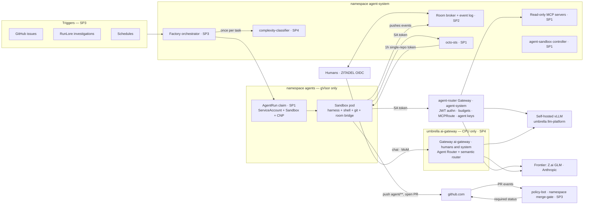

# Agent Factory — Programme Design

**Date:** 2026-09-23
**Status:** draft r4 — contracts reconciled across the four sub-project drafts and independently reviewed; owner review pending
**Branch:** `docs/agent-factory-design`
**Sub-project designs:** [SP1 runtime & identity](2026-09-23-agent-runtime-identity-design.md) ·
[SP2 collaboration rooms](2026-09-23-agent-collaboration-rooms-design.md) ·
[SP3 dark factory](2026-09-23-agent-dark-factory-design.md) ·
[SP4 complexity routing](2026-09-23-llm-complexity-routing-design.md)

---

## Why this programme exists

The LLM platform serves models; nothing on it *does work*. The target is a **dark factory**:
autonomous coding agents that pick up work from triggers, run unattended in sandboxes under their
own identity, collaborate with each other and with humans, and ship pull requests — with humans
attaching to watch, steer or approve rather than drive.

It is a demonstration of a real-world pattern, so it is designed for a **small team in daily use**:
quotas, per-identity budgets and audit are requirements, not extras. That is a deliberate shift
from the 2026-05 LLM designs, which were scoped "solo experimental".

## Decisions taken during brainstorming

| # | Question | Decision | Rejected | Why |
|---|---|---|---|---|
| D1 | Audience | Real small team, daily use, demonstrated in this repo | Solo showcase; personal driver | The factory is only credible if budgets, audit and multi-party use are real |
| D2 | Technology bias | **Open source first**; SaaS only as an optional, pluggable backend | SaaS-first | Owner direction |
| D3 | Agent identity | Every agent has **its own workload identity**, never a human's credentials | Acting as the launching human | A prompt injection must not become a human's compromise |
| D4 | Autonomy boundary | Agents **auto-merge policy-defined low-risk classes** on green CI; everything else stops at a PR | Stop at every PR; full lights-out | Owner direction. `main` requires **0 approving reviews** today (verified), so the boundary must be enforced by policy, not assumed |
| D5 | What an agent reaches | LLM gateway, Git forge, read-only cluster access + MCP, internet via FQDN allowlist | — | Owner selection |
| D6 | Sharing | A **room**: humans *and* agents-in-roles are participants of one ordered session | Human co-driving only; agents only | Owner: "both". Sharing is a demonstration goal, so adoption statistics do not deprioritise it |
| D7 | Session control | One driver at a time, live watchers, handoff, fork, approvals by any authorised member | Free co-prompting; async only | Concurrent instructions to one agent conflict mid-task |
| D8 | Where "jev" fits | Complexity classification **once per task at factory intake**; the OSS classifier is default, **Jev** (TypeSafe AI, SaaS) is pluggable and shadow-compared | Jev per request in the data path | Per-request routing breaks agent trajectories; once per task removes Jev's latency, availability and data-exposure costs |
| D9 | Sandbox runtime | `kubernetes-sigs/agent-sandbox` + **gVisor** on both clouds | Kata/Firecracker; OpenHands Enterprise; Coder; E2B/Daytona | See SP1. AWS's own blueprint uses this exact stack |
| D10 | Agent loop placement | Agent loop **inside** the sandbox *(default; OD-1)* | Trusted shared host + tool-only sandboxes | A shared host holds every run's context — one compromise exposes all runs |
| D11 | Identity enforcement point | **Agent Router** (Envoy AI Gateway) *(default; OD-2)* | agentgateway at the agent boundary; consolidating on agentgateway | Agent Router v1.1 already validates JWTs, filters MCP tools per caller and injects credentials; agentgateway's distinct OSS feature (RFC 8693 client) is not needed by autonomous agents. Re-evaluate at SP2 if A2A or on-behalf-of becomes necessary |

## Verified during design (supersedes the raw research notes)

Several subagent claims were overstated and corrected against primary sources. Where the research
files disagree with this table, this table wins.

| Question | Finding | Source |
|---|---|---|
| Can gVisor run on EKS? | **Yes.** AWS's `ai-on-eks` agent-sandbox blueprint runs agent-sandbox + gVisor on a Karpenter **AL2023** NodePool (runsc installed via user-data) with Cilium FQDN egress. Kata/Firecracker is AWS's "future tier" (nested virtualisation is limited) | [awslabs/ai-on-eks](https://github.com/awslabs/ai-on-eks/tree/main/infra/agent-sandbox) |
| Why not on our nodes as-is? | Bottlerocket ships no runsc; the request is open and unprioritised | [bottlerocket#811](https://github.com/bottlerocket-os/bottlerocket/issues/811) |
| gVisor + Cilium | gVisor pods need `socketLB.hostNamespaceOnly: true`. **aws-0 already sets it** (for Tailscale); gcp-0 does not | [Cilium kube-proxy-free](https://docs.cilium.io/en/stable/network/kubernetes/kubeproxy-free/), `opentofu/aws/eks/init/helm_values/cilium.yaml` |
| AL2023 install traps | containerd config `version = 3` silently ignores a v2 plugin table; runsc ≥ 20260831 needs `gvisor-bin/` sidecars next to it | [wso2/agent-manager#1891](https://github.com/wso2/agent-manager/issues/1891), [#1883](https://github.com/wso2/agent-manager/issues/1883) |
| GKE Sandbox constraints | Requires `cos_containerd`; ignores seccomp and NoNewPrivileges; blocks node metadata for sandboxed pods | [GKE Sandbox](https://docs.cloud.google.com/kubernetes-engine/docs/concepts/sandbox-pods) |
| agent-sandbox maturity | v1.0.x, `v1beta1` API; Sandbox, SandboxTemplate, SandboxClaim, SandboxWarmPool | [releases](https://github.com/kubernetes-sigs/agent-sandbox/releases) |
| agentgateway identity, OSS vs paid | OSS: JWT validation, MCP OAuth, per-claim credential injection, RFC 8693 **client** incl. `actorToken`. **Solo Enterprise only:** the built-in STS minting on-behalf-of tokens; kagent OBO | [agentgateway blog 2026-07-12](https://agentgateway.dev/blog/2026-07-12-agentgateway-token-exchange-jwt-assertion-entra-obo/), [kagent OBO](https://docs.solo.io/kagent/latest/security/obo/) |
| Can ZITADEL be the agent STS? | No — it does not accept external tokens (e.g. a ServiceAccount token) for exchange | [zitadel#7211](https://github.com/zitadel/zitadel/issues/7211) (open) |
| Agent Router v1.1 | Joined AAIF 2026-09-10 (CRDs unchanged). Its own: MCPRoute per-tool authorization, per-request `credentialOverride`, token cost accounting, Anthropic `/v1/messages` input. From the Envoy Gateway underneath: JWT validation with claim→header projection (`SecurityPolicy`) and the global rate limit that enforces token budgets. No RFC 8693 in either | [v1.1 notes](https://theagentrouter.ai/release-notes/v1.1/), [#2036](https://github.com/theagentrouter/agent-router/issues/2036) |
| MCP sessions | The 2026-07-28 spec removed protocol sessions and stream resumability — the session log must live outside MCP | [changelog](https://github.com/modelcontextprotocol/modelcontextprotocol/blob/main/docs/specification/2026-07-28/changelog.mdx) |
| Multi-client sessions | Microsoft's Agent Host Protocol (MIT): one server-ordered log, N clients | [AHP](https://microsoft.github.io/agent-host-protocol/guide/what-is-ahp.html) |
| Jev | TypeSafe AI "System One" decision model; SaaS API only; integrated in LiteLLM's complexity router | [LiteLLM](https://docs.litellm.ai/docs/pass_through/typesafe) |
| Branch protection | `main`: 8 required checks, `enforce_admins`, **0 required approving reviews** | `gh api repos/Smana/cloud-native-ref/branches/main/protection` |
| Frontier precedent | RunLore already calls GLM-5.2 via Z.ai — but holds the key in its own pod | `observability/base/runlore/helmrelease.yaml` |

## Target architecture



## Sub-projects

| # | Sub-project | Demonstrable outcome | Depends on |
|---|---|---|---|
| SP1 | Agent runtime & identity | An `AgentRun` produces a PR under the agent's own identity; deleting it revokes everything | — |
| SP2 | Collaboration rooms | Humans and agent roles share one live, ordered session with handoff, fork and approvals | SP1 |
| SP3 | Dark factory | Triggers start teams of agents unattended; low-risk classes auto-merge, the rest stop at a PR | SP1, SP2 |
| SP4 | Complexity routing | The right model per task and session, frontier included, with per-identity budgets | — (its frontier slice unblocks SP1's agents) |

Order: SP1 → SP2 → SP3, with SP4 in parallel. Each sub-project gets its own plan and PR.
Until SP4's Bedrock slice lands, only `public` runs have a model backend: `internal` runs — and
therefore RunLore-triggered tasks — wait for it.
**aws-0 first** (primary cloud, ADR-0027); gcp-0 is a follow-up workstream per sub-project.

## Shared contracts

Each sub-project design MUST conform to these. Changing one is a programme-level change: update
this section first, then every spec that consumes it.

**Revision r4 (2026-09-24):** r2 reconciled the change requests raised by the four sub-project
drafts; r3 closed the gaps SP4 found in r2 (Gateway split, budget enforcement layers, data class,
API-key client header); r4 applied an independent cross-spec review (ruleset bypass, Kyverno
one-creator rule, one secret store for `agent-system`, fleet cap sizing). Where two requests
conflicted, the resolution is noted inline.

### C1 — Namespaces and gating

| Namespace | Holds | Rule |
|---|---|---|
| `agents` | `AgentRun` claims and their sandbox pods | Every pod runs under RuntimeClass `gvisor`, enforced at admission (Kyverno). Default-deny CNP. No workload here holds a provider key |
| `agent-system` | agent-sandbox controller, octo-sts, MCP servers, room broker and its `Room` CRs, factory and its `Task` CRs, Kueue queues, complexity-classifier | Trusted control plane; ordinary runtime. Its secrets come only through the namespaced `agents-secrets` store, scoped to `platform/agents/*` — never the cluster-wide `openbao-platform` store |
| `merge-gate` | policy-bot | Holds the merge-gate GitHub App key, through its own namespaced store scoped to `platform/merge-gate/*`. Nothing in `agents` may reach it |

Three Flux umbrellas, each `clusters/<cluster>/<name>.yaml` → `clusters/<cluster>-<name>/`:

| Umbrella | Holds | Default | Depends on |
|---|---|---|---|
| `ai-gateway` *(new, SP4)* | Envoy Gateway and Agent Router controllers, the semantic router, and the **human/system** Gateway — the existing Gateway object `ai-gateway` that InferenceService claims attach to, with its routes and backends in namespace `llm-gateway` — CPU only | **On** *(owner decision OD-3)* | — |
| `llm-platform` *(existing)* | GPU models, their NodePool and weights | Suspended | `ai-gateway` |
| `agent-platform` *(new)* | Everything else in this programme, including the **agents'** dedicated Gateway (`agent-router` in `agent-system`) with its own routes, backends and provider keys | Suspended | `ai-gateway` — **not** `llm-platform`: agents run on frontier models with zero GPUs |

Agents and humans use **separate Gateways and separate provider keys**, so agent spend and a leaked
agent-side key are separable from human and system traffic.

The gateway controllers move out of `llm-platform` into `ai-gateway` (raised independently by SP1
and SP4). Without that move, "agents need no GPUs" cannot be implemented.

### C2 — Identity

| Principal | Credential | Canonical ID (logs, budgets, events) |
|---|---|---|
| Agent run | Projected, audience-bound ServiceAccount token of SA `xplane-run-<runId>` in `agents` | `agent:<runId>` |
| Human | ZITADEL OIDC token | `human:<zitadel sub>` |
| Factory / system | ServiceAccount token of the controller | `system:<component>` |

- `runId`: 8-character lowercase base32 (DNS-1123 safe), **generated by the creator** — the
  factory once SP3 ships (C3), the owner before. The claim, its ServiceAccount and its sandbox all carry it
  (`xplane-run-<runId>`, constitution §1).
- A run has exactly one **role** (`implementer`, `reviewer`, `tester`, `triager`), label
  `agents.ogenki.io/role`. Roles are policy inputs, not identities.
- **Audiences are per consumer, and carry whatever the consumer authorises on**: the gateway
  audience encodes role and data class (`agent-router.<role>.<dataClass>`), octo-sts is per
  repository, and the room broker has its own. SP1 fixes the exact values. These attributes travel
  in the audience because Envoy Gateway matches JWT claims exactly and cannot address the nested
  `kubernetes.io` claim.
- **Gateways project the token's `sub`, not the canonical ID.** Consumers derive `agent:<runId>`
  from `sub` (`system:serviceaccount:agents:xplane-run-<runId>`).
- Agents never receive a human's token. Attribution of "who asked" is `spec.principal` (C3) and the
  event log (C4), never a delegated credential.

### C3 — `AgentRun` API (owned by SP1)

A namespaced Crossplane v2 XR, `AgentRun` (`cloud.ogenki.io`), composed in
[`Smana/crossplane-configuration`](https://github.com/Smana/crossplane-configuration). SP1 designs
the full schema; other sub-projects rely only on these fields:

| Field | Consumer | Meaning |
|---|---|---|
| `spec.role` | SP2, SP3 | One of the C2 roles |
| `spec.repository` | SP3 | The single repo this run may touch |
| `spec.baseRef` | SP2, SP3 | Commit or branch the run starts from (reviewers, testers, forks) |
| `spec.branch` | SP1, SP2, SP3 | The one branch an implementer pushes, under `agent/**`. **Derived by the factory, never taken from a caller:** `agent/<taskId>` for a task's runs, `agent/<roomId>` for a human room's runs (a fork gets its new room's), otherwise `agent/<runId>` — so a room's or task's sequential runs share one branch and one PR |
| `spec.task` | SP3 | Task text or reference given to the harness |
| `spec.principal` | SP2, SP3, SP4 | Accountable principal: `human:<sub>` or `system:factory`. Whose daily budget the run spends, and "who asked". *(Resolves SP2's `requestedBy` and SP3's `principal` into one field.)* |
| `spec.model` | SP4 | A **logical** model name (C5) |
| `spec.budget.maxTokens` | SP3, SP4 | Per-run cap; the XRD rejects values above the platform ceiling, which equals the gateway's per-run ceiling (5M tokens) |
| `spec.dataClass` | SP3, SP4 | `public` or `internal` — decides which backends the run may reach (OD-13) |
| `spec.roomRef` | SP2 | Optional room this run joins |
| `spec.queueName` | SP3 | Kueue `LocalQueue`; set as the queue label on the sandbox pod |
| `status.phase` | SP2, SP3 | `Pending`, `Running`, `Succeeded`, `Failed`, `BudgetExhausted`, `Revoked` |
| `status.pullRequest` | SP3 | URL of the PR the run opened, if any |
| `status.usage.tokens` | SP3, SP4 | Tokens consumed, from gateway metrics, for **every** run whatever its principal |

**Status has one writer: the composition.** Controllers never patch an XR's status, which
Crossplane owns. They write annotations; the composition projects them into status:

| Annotation | Written by | Projected into |
|---|---|---|
| `agents.ogenki.io/usage-tokens` | Run meter (SP3), every 30 s | `status.usage.tokens` |
| `agents.ogenki.io/pull-request` | Factory controller (SP3), from the agents' App events | `status.pullRequest` |
| `agents.ogenki.io/revoked` = `budget-run`, `budget-principal`, `budget-fleet`, `manual` | Whoever revokes (run meter, factory, owner) | `status.phase`: any `budget-*` → `BudgetExhausted`, `manual` → `Revoked` |

A budget 429 from the gateway is observed by the run meter, which writes the matching
`budget-*` reason. Before SP3 ships, none of these annotations is written: runs have only the
gateway's per-run ceiling, and `status.pullRequest` stays empty.

- **One creator.** Once SP3 ships, the factory controller is the only identity allowed to create an
  `AgentRun`: RBAC grants `create` to its ServiceAccount alone, and a **Kyverno rule shipped with
  SP3** denies every other creator, cluster-admins included (RBAC alone cannot stop an admin).
  Break-glass is suspending that policy through Flux. The room broker (fork, adding an agent to a
  room) and the human CLI request runs through the factory's API, so the principal's daily budget
  has one enforcement point whoever asked. Before SP3, the owner creates runs directly and they
  have only the gateway's per-run ceiling.
- Every object a run creates carries `agents.ogenki.io/role` and, when the run belongs to a task,
  `agents.ogenki.io/task`.
- When `spec.roomRef` is set, the sandbox also runs SP2's **room bridge** container, and its CNP
  allows egress to the broker (C4).
- **Forge scope follows the role:** an `implementer` may write to `spec.repository`; `reviewer`,
  `tester` and `triager` never get `contents: write` (C6).
- **Revocation is bounded by token lifetime.** Deleting the claim deletes the ServiceAccount, the
  sandbox and its policies, but the gateway and octo-sts validate tokens offline, so a token already
  copied out stays valid until it expires. Token TTL is therefore ≤ 600 s, and SP1's success
  criteria measure the window.

### C4 — Event envelope (owned by SP2, emitted by SP1 runs)

One append-only log per room, aligned with AHP's server-ordered log. SP2 owns the schema; this is
its frozen shape (v1):

```json
{
  "v": 1,
  "id": "01J9X7K2…",
  "seq": 1842,
  "roomId": "r-3kq9x2ma",
  "runId": "7f3cq2xz",
  "actor": { "kind": "agent | human | system", "id": "agent:7f3cq2xz", "role": "reviewer" },
  "type": "message | turn | tool_call | tool_result | approval_requested | approval_decided | participant | driver | handoff | state_changed",
  "causedBy": 1840,
  "origin": "harness | broker | client",
  "ts": "2026-09-23T14:02:11Z",
  "redactions": [],
  "payload": {}
}
```

- **Runs push; the broker never dials into a sandbox.** The room bridge (C3) streams the harness's
  events to the broker, authenticated by the run's token. *(Resolves SP1's pull proposal against
  SP2's push: nothing opens an ingress path into `agents`.)*
- The broker assigns `seq` (gapless from 1) and stamps `ts` and `actor` from the authenticated
  token; client-supplied values are ignored. Agent-originated events are untrusted content
  attributed to that agent.
- `driver` records a change of driver; `handoff` means handing over *work* only.
- Payloads ≤ 64 KiB; secrets are redacted before persistence and listed in `redactions`.
  Streaming deltas, presence and typing never enter the log.
- Reserved `message` kinds for SP3: `review_verdict` (`approve | changes`), `task_state`. SP2
  exposes a minimal API for SP3: create a room, read its log, and append a message — the last for
  `system:*` principals only.
- **Agents collaborate as sequential runs**, not live sessions: a run records its handoff or
  verdict in the log and exits; the next run starts from `spec.baseRef` with a brief built from the
  log. The factory starts the next run in factory rooms, the human driver in human rooms, and the
  factory never advances a room while a human holds the driver role.
- **Human identity end to end:** oauth2-proxy passes the human's access token to the broker, and
  the broker forwards that token — not an asserted `sub` — when it asks the factory for a run (C3),
  so the principal is proven by the caller rather than vouched for by the broker.
- The log is the audit trail of record for SP3, which is why it exists before live viewing does.

### C5 — Gateway boundary and budgets

SP4 owns the model mapping and budget enforcement.

- **The `agent-router` Gateway (Agent Router data plane) is the only path** from a sandbox to
  models and MCP tools. It validates the run's
  token (Envoy Gateway `SecurityPolicy`) and injects provider credentials. Provider keys never
  enter the `agents` namespace.
- **Identity headers:** `x-ar-agent` (the agent token's `sub`), `x-ar-human` (the human token's
  `sub`) and, for API-key clients (RunLore, OpenWebUI, promptfoo), `x-ai-gateway-client-id`. All
  three are **stripped from every client request before authentication**, then set from the
  validated credential, because Envoy's `claim_to_headers` appends rather than replaces.
  *(Resolves SP1's `x-agent-sub` in favour of SP4's names.)*
- **Logical model names:** `tier-light`, `tier-standard`, `tier-frontier`, and the alias
  `agent-default` (initially → GLM-5.2 via Z.ai). The **data class** decides the backend behind a
  name: `public` runs may reach Z.ai, `internal` runs only Bedrock EU or self-hosted models (OD-13).
  **Enforced per listener:** `agent-router` has one listener per data class, each accepting only its
  class's audiences (C2); Z.ai routes attach to the `public` listener only, so an `internal` token
  has no path to Z.ai by construction. Whether a run can additionally be bound to *one* logical name
  is unverified; SP1/SP4 carry it as a risk.
- **Agents never traverse the semantic router.** It serves the human/system Gateway only.
- **No re-routing mid-task:** agents use the dedicated `agent-router` Gateway, where nothing
  re-routes a request — the logical name a request carries is the backend it gets. Escalating a
  task means **a new run**, never a model switch inside one.
- Chat `MoM` traffic is classified by the semantic router itself, per request; it does not call C7.
- **Budgets** are token caps at three levels: **run** (`spec.budget.maxTokens`), **task** and
  **principal per day**. Enforcement is split by what each layer can see:

  | Cap | Enforced by | Why there |
  |---|---|---|
  | Per-run ceiling (5M) | Gateway rate limit keyed on `x-ar-agent` | The token names the run |
  | Exact per-run cap | SP3's run meter revokes the run → `BudgetExhausted` (every run, human-launched included) | Needs the claim's own value |
  | Agent fleet per day | Gateway rate limit on `agent-router`: one shared bucket for all agent traffic | Sized **at least the sum of the admission caps** (factory + human-launched), so neither starves the other |
  | Principal per day, for runs | **SP3 at creation** — the factory, sole creator of runs (C3), sums the principal's runs before creating one | The token carries only `sub`, never `spec.principal` |
  | Human direct traffic per day | Gateway rate limit keyed on `x-ar-human` | The token names the human |

  A budget 429 is turned into a `budget-*` revocation reason by the run meter (C3), so every budget
  cause ends as `BudgetExhausted`. Every gateway budget rule sets `shared: true`: Envoy Gateway's
  global rate limit defaults to one bucket **per route**, which would multiply each cap by the
  number of routes a run can reach.
- Whether Agent Router forwards the run's identity to MCP backends is **unverified**; SP2 carries a
  fallback.

### C6 — Git forge

- **Agents' GitHub App**, used by agents only, fronted by **self-hosted octo-sts**: the run's
  ServiceAccount token is exchanged for a ≤1h token scoped to `spec.repository`, with permissions
  by role (C3). It never gets `workflows`, `statuses`, `checks: write` or `administration`.
- A repository ruleset restricts that App to `agent/**` branches; a run pushes only its
  `spec.branch` (C3). **It never merges.** Rulesets apply to every actor not on their bypass list,
  so this **branch ruleset** bypasses the owner, Renovate and the factory's App **always** — only
  the agents' App is confined. The **merge-gate ruleset** is separate, and there the owner bypasses
  for pull requests only.
- **The factory has its own GitHub App** (SP3): it arms auto-merge for low-risk classes and may
  create `revert-*` branches.
- **Merge gate (D4):** policy-bot's status is required through a repository ruleset. It passes on
  its own only for low-risk classes authored by the agents' App, or for reverts authored by the
  factory's App and confined to those classes' paths; anything else needs a human approval.
- **Gate paths** — `.policy.yml`, the rulesets' sources, `.github/chainguard/` (octo-sts trust
  policies) and the factory's own config — match no auto-merge rule, so policy-bot posts `error`
  and an agent PR touching them cannot merge.

### C7 — Complexity classifier (owned by SP4, consumed by SP3)

One in-cluster service, `complexity-classifier` in `agent-system`, answers "how hard is this?"
**once per task** at SP3's intake (D8). Chat `MoM` does not use it (C5).

- Request: `{ "text": "...", "ref": "<task id>", "dataClass": "public | internal" }`.
- Response: `{ "tier": "light | standard | frontier", "confidence": 0.0–1.0, "classifier": "<backend>",
  "fallback": "none | default | static", "shadow": [{ "classifier": "…", "tier": "…", "confidence": 0.0 }] }`.
  *(Resolves SP3's `ref`/`exposure` and SP4's `requestId`/`dataClass` into `ref` + `dataClass`.)*
- Backends are pluggable: the semantic router's complexity signal is the **default** (OSS); **Jev**
  is an optional adapter. A shadow backend's answer is returned and logged, never acted on — that is
  how backends are compared.
- **Only `dataClass: public` text may reach a SaaS backend.** Internal text (RunLore findings,
  cluster reads) never leaves the cluster.
- Low confidence nudges the task up one tier. A timeout or error falls back to the default backend,
  then to `standard` (`fallback: static`). The classifier never blocks a task.

## Owner decisions (consolidated)

Every choice the drafts left to the owner, deduplicated. The recommendation is the default if the
owner does not override it.

| # | Decision | Recommendation | Raised by |
|---|---|---|---|
| OD-1 | Agent loop inside the sandbox (D10) | Confirm | SP1 |
| OD-2 | Agent Router as the agent identity gateway (D11) | Confirm | SP1 |
| OD-3 | `ai-gateway` umbrella always on, CPU only (SP1 estimates ~200m/512Mi for the controllers alone; SP4 ~1.6 vCPU/5.5 GiB with the semantic router) | On — it is also what lets RunLore drop its own Z.ai key | SP1, SP4 |
| OD-4 | Where the new code lives | **One** repo, `Smana/agent-platform`, for broker, factory and classifier *(SP2 proposed `agent-rooms`, SP3 `agent-factory`)*, pinned from this repo as App Wizard is | SP2, SP3 |
| OD-5 | octo-sts trust policies match the EKS issuer by pattern (the issuer ID changes on every rebuild) | Pattern | SP1 |
| OD-6 | GitHub App scope at first | `cloud-native-ref` only | SP1 |
| OD-7 | Who may bypass the rulesets | **Branch ruleset:** owner, Renovate and the factory's App, always (only the agents' App is confined to `agent/**`). **Merge-gate ruleset:** owner for pull requests only, and Renovate. CI itself stays non-bypassable | SP1, SP3 |
| OD-8 | Low-risk classes that auto-merge at v1 | `docs-links` and `revert` only; `docs`, `tests`, `dashboards` promoted later on evidence (docs PRs otherwise wait for owner review) | SP3 |
| OD-9 | RunLore findings start work unattended | When actionable with confidence ≥ 0.75, max 5 a day | SP3 |
| OD-10 | Budget defaults: per run 2M (ceiling 5M); factory 25M tokens/day; each human 5M/day for the runs they launch; agent fleet cap ≥ the sum of those (SP3 sets the admission caps, SP4 the gateway buckets) | Accept; run in shadow for a week before enforcing | SP3, SP4 |
| OD-11 | Jev | Shadow only, on `dataClass: public` text; never selects a tier | SP3, SP4 |
| OD-12 | Anthropic access | Bedrock via EKS Pod Identity (keyless), not a native API key | SP4 |
| OD-13 | Which frontier gets which data | Public-repo agent work → Z.ai; internal ops data (RunLore, cluster reads) → Bedrock EU. **Consequence:** cluster reads are internal data, so `public` runs get documentation-only MCP tools; D5's read-only cluster access applies to `internal` runs only | SP4, SP1 |
| OD-14 | Control group | 10% of agent tasks run at `tier-frontier` regardless of classification — the unbiased baseline for comparing classifiers | SP4 (implemented in SP3's triage) |
| OD-15 | Room client for the demo | Web UI served by the broker (behind oauth2-proxy); `roomctl` CLI later. Claude Code is never an approving client | SP2 |
| OD-16 | Four-eyes rule (approver ≠ prompter) | Off by default, per-room switch | SP2 |
| OD-17 | Transcript retention | 90 days after a room closes | SP2 |

## Anticipated ADRs

Each lands on the branch of the sub-project that introduces it. Numbers are reserved per
sub-project so parallel drafts cannot collide (0039 and 0040 are already taken on `main`).

| ADR | Topic | Chosen | Over | Sub-project |
|---|---|---|---|---|
| 0041 | Agent sandbox runtime | agent-sandbox + gVisor, AL2023 sandbox nodes on EKS | Kata/Firecracker, OpenHands Enterprise, Coder, E2B | SP1 |
| 0042 | Agent identity gateway | Agent Router | agentgateway | SP1 |
| 0043 | GitHub credentials for agents | octo-sts | PATs, ESO GitHub generator, git proxy | SP1 |
| 0044 | Session protocol | AHP-shaped room log we own | OpenHands shared conversations, ACP-only | SP2 |
| 0045 | Merge policy gate | palantir/policy-bot, its status required through a repository ruleset | Required reviews, rulesets alone, a custom check, Prow/tide, Mergify, Kodiak | SP3 |
| 0046 | Frontier providers | Z.ai for public data; Anthropic through Bedrock EU with Pod Identity for internal data | A native Anthropic API key; Vertex-only | SP4 |
| 0047 | Complexity classification | SR complexity signal default, Jev pluggable in shadow | Jev in the request path, LiteLLM complexity router | SP4 |
| 0048 | Factory orchestrator | Custom `Task` controller + Kueue admission | Argo Workflows, Tekton, Temporal, a Crossplane Task XR, gh-aw | SP3 |
| 0049 | Room client and human auth | Web UI served by the broker, behind oauth2-proxy *(OD-15)* | Headlamp plugin, CLI only, AHP facade, browser PKCE app | SP2 |
| 0050 | Token budgets | Envoy Gateway global rate limit backed by Valkey | Agent Router `QuotaPolicy`, a custom ext_proc, LiteLLM budgets | SP4 |

## Non-goals (programme level)

- On-behalf-of delegation of human credentials to agents (D3). Revisit only with an OSS STS.
- Replacing the claim-owned model routing (`InferenceService` `spec.gateway`, blog part 4).
- Warm pools, until agent-sandbox binds identity at claim time.
- Private-repository exfiltration hardening (a git proxy); target repos are public.
