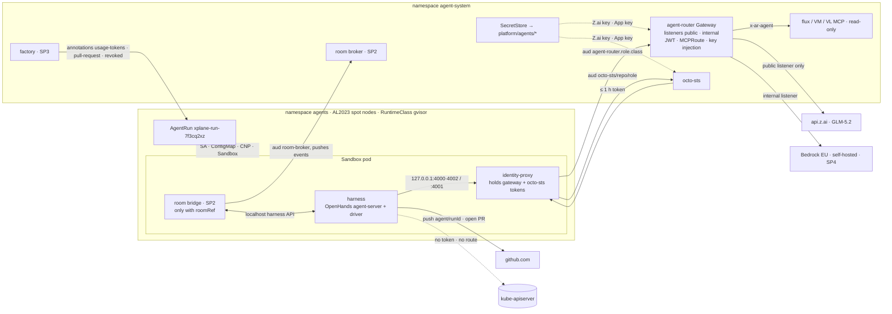
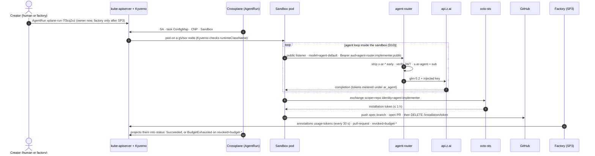
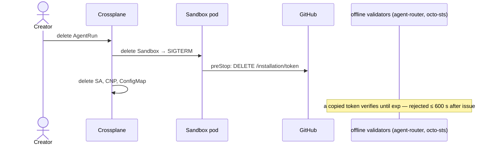

# SP1 — Agent runtime & identity

**Date:** 2026-09-23 · **Status:** draft, aligned with programme r4. Awaiting the owner's review
**Programme:** [Agent Factory r3](2026-09-23-agent-factory-design.md). D1–D11, C1–C7 and OD-1…OD-17 are binding here and not restated
**Research:** [versions, sources, pitfalls, snippets](2026-09-23-agent-runtime-identity-research.md)
**Target:** aws-0. The [gcp-0 follow-up](#gcp-0-follow-up) is scoped at the end

## Outcome

Applying an `AgentRun` claim starts a gVisor-sandboxed OpenHands agent under its own ServiceAccount.
It calls models through Agent Router without ever holding a provider key (GLM-5.2 for `public` runs, never Z.ai for `internal` ones), reads the cluster through
read-only MCP tools, and pushes `spec.branch` (`agent/<taskId|roomId|runId>`) to open one PR with a ≤ 1 h, single-repo,
role-scoped GitHub token. Deleting the claim deletes everything it composed. A token copied out of
the sandbox dies within **600 s** (C3).

## Decisions

| # | Decision | Rejected | Why |
|---|---|---|---|
| S1 | The XR composes a bare **`Sandbox`** (`agents.x-k8s.io/v1beta1`, controller extensions off) | `SandboxTemplate` + `SandboxClaim`; warm pools | The pod spec is per run because identity is per run. A template would be a second owner of it. Warm pools wait for claim-time identity, which is still *Planned* ([roadmap](https://github.com/kubernetes-sigs/agent-sandbox/blob/main/roadmap.md)) |
| S2 | The controller chart is installed from the agent-sandbox **git repo**, through a `GitRepository` pinned to `v1.0.3` in `flux-sources`, with `image.tag` moved in lockstep | Release YAML; a vendored copy | The chart is not published to any registry, and it exposes the securityContext and resources PSS `restricted` needs. RunLore uses the same pattern |
| S3 | A Karpenter **AL2023** NodePool `agents-gvisor`, **spot only**. A pinned, sha256-checked gVisor tarball is installed by user-data. runsc is registered in the containerd **v3** CRI table | Bottlerocket ([no runsc](https://github.com/bottlerocket-os/bottlerocket/issues/811)); a baked AMI; Kata on nested virtualisation | This is the one deliberate exception to the Bottlerocket rule. Spot follows the test-cluster rule. An interrupted run resumes on its branch (R7) |
| S4 | runsc runs on `systrap` (its default) with `oci-seccomp=true` | `ptrace` (the AWS blueprint's choice); `kvm` | `ptrace` is the slow legacy platform, and `kvm` needs nested virtualisation. Without `oci-seccomp`, `RuntimeDefault` does nothing inside the sandbox |
| S5 | Tokens reach the harness through an **in-pod `identity-proxy`**: an Envoy native sidecar with `credential_injector`, the only container that mounts the 600 s projected tokens | A run-long token passed as the harness's API key | OpenHands reads its LLM key once per conversation ([llm.py](https://github.com/OpenHands/software-agent-sdk/blob/main/openhands-sdk/openhands/sdk/llm/llm.py)), so rotation has to happen outside it. The harness never holds a token, and every harness gets the same localhost contract |
| S6 | A dedicated **`agent-router` Gateway** in `agent-system` (`agent-platform` umbrella, on the `ai-gateway` umbrella's controllers, C1). It has **one listener per data class**, `public` (:8080) and `internal` (:8081). Each listener's `SecurityPolicy` accepts exactly its class's four audiences | A listener on the human `ai-gateway`; one listener with per-route `SecurityPolicy`s | No semantic router, so pinning is structural (C5). The same logical name maps to different backends per class. Two routes on one listener would both match `x-ai-eg-model`, and a route-level policy runs only after the route is chosen. A listener per class makes "`internal` never reaches Z.ai" structural |
| S7 | The harness is **OpenHands agent-server** (MIT) in a repo-built image, selected by a platform **profile**. The claim never carries an image | Headless Claude Code (not OSS); kagent v1 (alpha); OpenHands `AgentSandboxWorkspace` (built on warm pools) | OSS, non-root, OpenAI-compatible, and it satisfies SP2's four-operation bridge interface. An image field would make every claim a supply-chain input |
| S8 | **Self-hosted octo-sts**, with the App key as a PEM | PATs; ESO GitHub generator; OpenBao GitHub plugin; a git proxy (programme non-goal) | Trust policies live in the repository's default branch. Installations are resolved by account login, so the user-owned `Smana` account works ([ghinstall.go](https://github.com/octo-sts/app/blob/main/pkg/ghinstall/ghinstall.go)) |
| S9 | A **namespaced `SecretStore` in `agent-system`**, backed by its own OpenBao JWT role that reads only `platform/agents/*` | The `openbao-platform` ClusterSecretStore | That store has no namespace `conditions`, so any namespace could use it (T14). `agents` must never be able to reach `platform/` |
| S10 | Egress is default-deny: `toFQDNs` **profiles**, plus a DNS L7 rule that **answers only allowlisted names** | `world:443`; the agent-sandbox managed NetworkPolicy | A run can last hours, so it is not the one-shot case `security/AGENTS.md` trap 4 allows. The managed policy opens the whole Internet |
| S11 | The composition lives in the **core** package and is cloud-neutral | A per-cloud pair | Every rendered name is the same on both clouds |
| S12 | GC is a daily Kyverno **`DeletingPolicy`** on terminal phases, a backstop behind SP3 deleting runs after harvest | TTL labels (their family is deprecated in 1.19); a CronJob | The current API of a tool already installed |

## Architecture

## Run lifecycle

## 1. Sandbox runtime on aws-0

All of the following ships in the `agent-platform` umbrella (C1). The namespaces are the exception:
they live in `namespaces/base/` and are always on, which avoids the namespace health-check wedge.

| Piece | Path / content |
|---|---|
| Controller | `flux/sources/gitrepo-agent-sandbox.yaml` + `infrastructure/base/agent-sandbox/`, in `agent-system`, with its `ServiceMonitor` |
| NodePool + EC2NodeClass | `infrastructure/base/karpenter-nodepools-agents/`. The user-data snippet is in the research file, after pitfall 4 |
| RuntimeClass `gvisor` → `runsc` | `infrastructure/base/runtimeclass-gvisor/`, aws-0 only (like `runtimeclass-nvidia`). GKE ships its own |
| Kyverno | `security/base/agent-policies/` |
| CI schemas | `gen-catalog.sh` extracts `helm/crds/` at the pinned tag. Without it, `skipMissingSchemas: false` fails on the new kind |

**`agents-gvisor`** keeps the other pools' Nitro-only rule, Cilium `startupTaints` and IMDS hop limit 1.
It adds pinned `al2023@v<date>`, spot, `c`/`m` gen 6+ at 4–16 vCPU, a 50 Gi root, and the taint and
label `agents.ogenki.io/runtime=gvisor`. The label is also in `requirements`, or Karpenter never
matches. Pods are `do-not-disrupt`. The pool uses `WhenEmpty` and `expireAfter: 24h`, which also
rolls out gVisor bumps, and is capped at 16 CPU / 64 Gi.

| Kyverno policy (validate only: a mutation would hide composition bugs) | Scope · `failurePolicy` | Rule |
|---|---|---|
| `agents-pod-shape` | pods in `agents` · Fail | `runtimeClassName == 'gvisor'`, `automountServiceAccountToken == false`, owned by a `Sandbox`. This is the admission control agent-sandbox's threat model asks for on bare Sandboxes |
| `agentrun-admission` | `AgentRun` CREATE · Fail | Name matches `^xplane-run-[a-z2-7]{8}$`. **One creator (C3)** is not this rule. It is a Kyverno rule **shipped with SP3** that denies every creator but the factory SA, cluster-admins included; break-glass is suspending it through Flux. Until then the owner creates runs directly, bounded only by the gateway's 5 M ceiling. The factory's API derives `spec.principal` from the caller's token |
| `agents-no-secret-import` | `agents` · Fail | No `ExternalSecret`, `PushSecret` or `SecretStore` |
| `agent-audience-reservation` | pods outside `agents` and `kube-system` · **Ignore** (cluster-wide, so an outage must not block every pod) | No projected audience may start with `agent-router.`, `octo-sts/` or `room-broker` |
| `agentrun-gc` | `DeletingPolicy`, daily | Deletes runs in a terminal phase. Deleting only runs older than 24 h would need a CEL time function, **UNVERIFIED** |

**Restricted PSS under runsc.** runsc enforces UIDs, `drop: [ALL]` and the read-only root.
`RuntimeDefault` seccomp holds **only with `oci-seccomp`**, off by default
([flags.go](https://github.com/google/gvisor/blob/master/runsc/config/flags.go)). NoNewPrivileges
is not reliable (GKE documents that its sandbox ignores it). The gVisor boundary is the control.

## 2. The `AgentRun` API

The XRD is `cloud.ogenki.io/v1alpha1`, namespaced, in `crossplane-configuration`'s
`apis/agentrun/`. It covers C3's fields, plus the following:

| Field | Default | Notes |
|---|---|---|
| `spec.task` | — | Exactly one of `text` (≤ 16 KiB) or `url` (a GitHub issue or PR), enforced by CEL. A `reviewer` run needs a PR URL |
| `spec.baseRef` | `main` | The harness clones the repo at this ref |
| `spec.branch` | `agent/<runId>`, computed by the composition when unset (an XRD default cannot reference the name) | CEL: must start with `agent/`. The one branch an implementer pushes. **Derived by the factory, never by a caller:** a task's runs get `agent/<taskId>`, a human room's runs get `agent/<roomId>`, and anything else gets `agent/<runId>`. Sequential runs therefore share one branch and one PR. The harness resumes the branch if it exists |
| `spec.budget.maxTokens` | 2 M | XRD `maximum: 5000000`, the gateway's per-run ceiling (C3, C5) |
| `spec.dataClass` | **required**, no default | `public` or `internal`. It picks the gateway audience, the proxy port and so the listener, and which MCP tools the run sees. Classifying data is a decision, never a default |
| `spec.budget.maxMinutes` | 120, max 480 | Becomes `activeDeadlineSeconds` |
| `spec.harness` | `openhands` | A profile, which the composition maps to an image digest |
| `spec.size` | `small` | `small`/`medium`/`large` = 1→2 / 2→4 / 4→8 CPU (request→limit), 2 GiB per CPU, 10/20/40 Gi scratch |
| `spec.egress.profiles` | `[]` | Any of `pypi`, `npm`, `golang`, `crates`. `github` is always on |
| `status.runId` · `conversationId` · `startedAt` · `finishedAt` · `reason` | — | `conversationId` = `metadata.uid` |

**Composed resources.** Each one is named `xplane-run-<runId>[-suffix]` and labelled with
`agents.ogenki.io/run-id` and `agents.ogenki.io/role`, plus `agents.ogenki.io/task` when the claim
carries it. `spec.principal` becomes an annotation, because a label value cannot hold `:`.

| Resource | Rendered unless | Ready when |
|---|---|---|
| `ServiceAccount` (`automount: false`, **no binding anywhere**) | `Revoked` or `BudgetExhausted` | exists |
| `ConfigMap -task` (task, platform rules, run metadata) | — | exists |
| `CiliumNetworkPolicy` | — | static |
| `Sandbox` (Crossplane gets an aggregate ClusterRole for it; `infrastructure/AGENTS.md` trap 3) | `Revoked` or `BudgetExhausted` | `Ready` or `Finished` |

**Pod.** `runtimeClassName: gvisor`; `restartPolicy: Never`, so the Sandbox reports `Finished`;
`activeDeadlineSeconds`; `dnsConfig ndots: 1`; `do-not-disrupt`; UID 10001, restricted. The Kueue
queue label comes from `spec.queueName` (SP3). `service: false` always: **nothing ever dials into a
sandbox** (C4).

| Container | Mounts | Notes |
|---|---|---|
| `harness` | `emptyDir`s only, with the GitHub token cache in memory | Probes `/health` and `/ready` on :8000. `preStop` revokes the GitHub token |
| `identity-proxy` (native sidecar) | the projected gateway and octo-sts tokens | The only token holder for those two audiences |
| `room-bridge` (SP2 image, only with `roomRef`) | a projected token with audience `room-broker`, plus the harness session key on a shared in-memory volume | Dials `room-broker.agent-system:8443`. The broker validates it by TokenReview (SP2) |

**CNP.** DNS goes to kube-dns only, through an L7 rule that answers only allowed names. TCP is
allowed to the `agent-router` data plane (its class's listener only: 8080 `public`, 8081 `internal`), octo-sts (8080), the profile FQDNs (443), and the
broker (8443) only with `roomRef`. Ingress is from `host` only, for probes.

| Profile | FQDNs (443) |
|---|---|
| `github` | `github.com`, `api.github.com`, `codeload.github.com`, `objects.githubusercontent.com`, `raw.githubusercontent.com` |
| `pypi` · `npm` · `golang` · `crates` | `pypi.org`, `files.pythonhosted.org` · `registry.npmjs.org` · `proxy.golang.org`, `sum.golang.org` · `index.crates.io`, `static.crates.io` |

**Status has one writer, the composition** (C3). Controllers never patch status. They set
annotations, and the composition validates and projects them:

| Annotation (writer) | Projected to | Validation |
|---|---|---|
| `agents.ogenki.io/usage-tokens` (SP3's run meter, every run) | `status.usage.tokens` | a non-negative integer |
| `agents.ogenki.io/pull-request` (the factory) | `status.pullRequest` | matches `^https://github.com/<spec.repository>/pull/[0-9]+$` |
| `agents.ogenki.io/revoked` (run meter, factory or owner) | phase | one of `budget-run`, `budget-principal`, `budget-fleet`, `manual`. The run meter turns budget 429s into `budget-*` reasons |

The sandbox has no RBAC and cannot write any of them. Before SP3 ships, only the owner's `manual`
revocation is ever written, so `status.pullRequest` and `status.usage.tokens` stay empty. The phase
is evaluated top-down:

| # | Condition | Phase |
|---|---|---|
| 1 | `revoked=budget-*` | `BudgetExhausted` |
| 2 | `revoked=manual` | `Revoked` |
| 3 | Sandbox `Finished=PodSucceeded` | `Succeeded` |
| 4 | Sandbox `Finished=PodFailed` | `Failed` (reason `DeadlineExceeded` or `PodFailed`) |
| 5 | Sandbox `Ready` | `Running` |
| 6 | otherwise | `Pending` |

Rules 1 and 2 *are* revocation. The composition stops rendering the Sandbox and the
ServiceAccount, and keeps the record. Nothing the harness reports reaches status.

## 3. Identity

| Token | Audience (C2) | TTL | Held by | Validated |
|---|---|---|---|---|
| Gateway | `agent-router.<role>.<dataClass>` | 600 s, kubelet-rotated at 80 % | `identity-proxy` | offline, EKS JWKS `${oidc_issuer_url}/keys`, by the listener's exact list |
| octo-sts | `octo-sts/<owner>/<repo>/<role>` | 600 s | `identity-proxy` | offline, by the trust policy (issuer, subject, exact audience) |
| Room | `room-broker` | 600 s | `room-bridge` | **online**, by TokenReview (SP2) |
| GitHub installation | — | ≤ 1 h | harness, in memory | GitHub |

**Identity proxy.** A static Envoy bootstrap, ConfigMap `agent-identity-proxy`, shared by every
run. `127.0.0.1:4000` and `:4002` carry `/v1/*` and `/mcp` to the `public` and `internal` listeners with the
gateway token. The composition points `LLM_BASE_URL` and `MCP_URL` at the run's class, and the other
port is useless to it: its audience does not match.
`127.0.0.1:4001` carries `/sts/exchange` to octo-sts with the octo-sts token. It uses generic
`credential_injector` with `header_value_prefix: "Bearer "`, fed by SDS files watched on the
projected volume. Two things are still to prove: rotation reaching the injector (Q2, SC-06), and
`config_dump` redacting the tokens on the admin port (Q8).

**`agent-router` authentication.** SP1 owns the JWT providers (D11), the listeners, the agents'
Z.ai backend and the first `agent-models` route. SP4 owns the model mapping behind each listener
(SP4 S12).

- **`SecurityPolicy` per listener.** It targets the Gateway with `sectionName`. `issuer:
  ${oidc_issuer_url}`, `remoteJWKS`, and `claimToHeaders: sub → x-ar-agent`.
  - `public` accepts exactly `agent-router.{implementer,reviewer,tester,triager}.public`.
  - `internal` accepts the same four roles with `.internal` (4 of EG's 8-audience maximum).
- **Z.ai routes attach only to `public`.** `internal` carries Bedrock EU and self-hosted backends
  (SP4, OD-13), so an `internal` run cannot reach Z.ai whatever logical name it sends.
- **`ClientTrafficPolicy`.** `earlyRequestHeaders.remove: [x-ar-agent, x-ar-human,
  x-ai-gateway-client-id, agent-session-id]` runs before authentication, because
  `claim_to_headers` appends (C5).
- **What EG 1.9.1 cannot do.** It cannot prefix-match `sub` or address the `kubernetes.io` claim.
  `agent-audience-reservation` and a data-plane CNP admitting only `agents` pods cover that.

The Kubernetes API is behind **four independent layers**: no API token is mounted (Kyverno-enforced);
every token carries a foreign audience; the SA has no RBAC; the CNP has no `kube-apiserver` entity.

**Revocation** (C3):

| Credential | Dead within |
|---|---|
| Sandbox process, and tokens held in the pod | ~30 s (termination) |
| Room connection | ≤ 6 min (SP2's figure, SC-9: SP2 owns room connections) |
| GitHub installation token | ~30 s best effort (preStop), **1 h** worst case. Scoped to one repo and its role |
| A gateway or octo-sts token copied out | **600 s** (`exp`) |

## 4. Nothing inside the sandbox is a control

The agent has a shell and can reach its own harness API. **Every harness-level confirmation is
therefore oversight, not a boundary** (SP2 T6), and so is every rule written in the platform
prompt. SP1 relies on none of them. Each such rule has an enforcer outside the sandbox:

| Rule told to the agent | Enforced by |
|---|---|
| Push only `spec.branch`; never merge | The branch ruleset confines the agents' App, the one actor not on its bypass list, to `agent/**` (§6). It cannot pin a run to *its* branch: a run could push another task's `agent/**` branch (R9) |
| Reviewer, tester and triager never write | Role-scoped trust policies: no `contents: write` (C6) |
| Never touch workflows or trust policies | No `workflows` permission. `.github/chainguard/` is a gate path (C6) |
| Only this repository | The octo-sts audience binds the repository |
| Stay within budget | The gateway's R1 ceiling (SP4) and phase `BudgetExhausted`, both keyed on the verified `sub` |
| Only allowed hosts and tools | CNP + the DNS L7 rule; MCPRoute authorization by role and class |
| `internal` data never goes to Z.ai | The listener's exact audience list. Z.ai routes live only on `public` |
| Trailers, one PR | Re-verified on the server side by SP3 |

## 5. Harness

`ghcr.io/openhands/agent-server:1.49.5-python` runs as UID 10001 and serves `/health`, `/ready` and
`/api/*` (research: standard stack). `container-images/agent-harness/` wraps it, pinned by digest and Trivy-scanned. It adds `gh`, a
trailer hook, and `git-credential-agent`, which exchanges through `:4001` and caches in memory.
`agent-run` does five things:

1. Start agent-server.
2. POST the conversation: `conversation_id`, LLM `openai/$MODEL` at `$LLM_BASE_URL` with a placeholder key,
   MCP at `$MCP_URL`, the task, and the platform rules as `agent_launch_additions`.
3. Wait for it to end.
4. Revoke the GitHub token.
5. Exit 0 or 1.

A budget 429 (`x-envoy-ratelimited`, **UNVERIFIED** as in SP4; reset > 60 s) is terminal and never retried.

**Swap contract.** Every harness must honour this:

| | Contract |
|---|---|
| Model | OpenAI chat completions at `$LLM_BASE_URL` (the class's proxy port), model `$MODEL`, **no key**. Anthropic `/anthropic/v1/messages` is also routed; its fidelity is SP4's R8 |
| Tools, Git | MCP streamable HTTP at `$MCP_URL`; a credential helper against `:4001` |
| Inputs | env `RUN_ID ROLE REPOSITORY BASE_REF BRANCH MODEL CONVERSATION_ID`; the task at `/run/agent/task/task.md` |
| Outputs | commits on `$BRANCH` (= `spec.branch`), at most one PR for it, an exit code, `/health` + `/ready` |
| Room | SP2's four local operations (event socket, send, confirm, interrupt), which OpenHands 1.49.5 has |
| Runtime | non-root, read-only rootfs, writes only to `emptyDir`s |

## 6. Gateway, secrets, MCP and GitHub

| Object (`agent-system`) | Content |
|---|---|
| `Gateway agent-router` + `EnvoyProxy` | Class `envoy-ai-gateway`, listeners `public` :8080 and `internal` :8081, Service pinned to ClusterIP `agent-router`, restricted securityContext. **Its data-plane CNP is scoped by gateway name** and allows egress to the MCP servers and the room broker's :8090. The existing `envoy-data-plane` CNP selects every EG proxy, so it is narrowed to `ai-gateway`, or its allows would leak onto this Gateway (R5) |
| `Backend zai` → `AIServiceBackend` | `api.z.ai:443`, system CAs, schema `OpenAI` with `prefix: /api/paas/v4` (RunLore's `base_url`) |
| `BackendSecurityPolicy` | `APIKey` from an ExternalSecret on the `agent-system` SecretStore → `platform/agents/zai`, the agents' own key (SP4 S12) |
| `AIGatewayRoute agent-models` | `parentRefs` sectionName `public`: `agent-default` → `glm-5.2` (`modelNameOverride`), 100 %. SP4 then owns the file, adds the tiers, and adds the `internal` routes (Bedrock EU and self-hosted) |
| `SecretStore agents-secrets` | OpenBao JWT auth as SA `agent-system/agents-secrets`. A new role and policy in `opentofu/aws/openbao/management` grant read on `platform/data/agents/*` only |

**MCP servers.** All three are read-only and reachable only from the `agent-router` data plane.

| Server | Access |
|---|---|
| `flux-operator-mcp` | `readonly: true`. **`rbac.create: false`**, because the chart defaults to `cluster-admin`. Instead it is bound to `agent-mcp-flux-read`: get, list and watch on Flux resources, claims, workloads, events and `pods/log`, with **no `secrets`** |
| `mcp-victoriametrics`, `mcp-victorialogs` | No Kubernetes identity. Egress to their backend only |

Two `MCPRoute`s, one per listener, reuse that listener's issuer and audiences for `oauth`.

- Both set `defaultAction: Deny`, add one allow rule per role on `aud` (`StringArray`), and use
  `toolSelector.include` to hide every mutating tool.
- **Cluster reads are internal data (OD-13), so the `public` route exposes documentation tools
  only.** Those are `search_flux_docs` and the VictoriaMetrics and VictoriaLogs `documentation`
  tools. Resources, metrics and logs are on `internal`.
- On `internal`, logs (Flux `get_kubernetes_logs`, VictoriaLogs) are for reviewer, tester and
  triager only, because a log carries whatever a process printed; that is RunLore's reason too.
- **SP2's `room_*` tools are on both routes**, per role:
  - `room_read` and `room_post` for every role;
  - `room_handoff` for implementer, tester and triager;
  - `room_verdict` for reviewer and tester.

  Their backend is the room broker's MCP port, `room-broker.agent-system:8090`, so the
  `agent-router` data-plane CNP allows egress there.
- Whether identity reaches the MCP backends is **UNVERIFIED** (C5), and SP2 carries the fallback.

**Workloads SP1 adds.** All run with a restricted securityContext.

| Workload | Probes | Requests → limits |
|---|---|---|
| `harness` | startup + readiness `GET /ready`, liveness `GET /health`, on :8000 | the `spec.size` preset |
| `identity-proxy` | readiness + liveness `GET /ready` on Envoy admin :9901 | 50m / 64Mi → 200m / 128Mi |
| `room-bridge` | readiness + liveness `GET /healthz` on :8085 (checks the bridge and its harness socket, never the broker — SP2 §3) | 20m / 32Mi → 100m / 64Mi |
| `flux-operator-mcp` | `tcpSocket` on `http` (chart default) | 10m / 64Mi → 500m / 256Mi |
| `mcp-victoriametrics`, `mcp-victorialogs` | `tcpSocket` on `MCP_LISTEN_ADDR` :8081 | 10m / 32Mi → 200m / 128Mi |
| `octo-sts` | `tcpSocket` :8080 (no HTTP health path verified) | 20m / 64Mi → 200m / 128Mi |

**octo-sts**: `ghcr.io/octo-sts/app:0.10.0`, pinned by digest. The App key comes from the
SecretStore through `APP_SECRET_CERTIFICATE_FILE`. No webhook component, since it needs a public
endpoint. The CNP admits ingress from `agents` only and allows egress to `api.github.com` and the
EKS issuer.

**The agents' App** (C6) belongs to the user account `Smana`. It gets metadata read, contents and
PRs read/write, and issues, checks and actions read. It **never** gets `workflows`, `statuses`,
`checks: write` or `administration`; without `workflows`, GitHub refuses workflow-file pushes
([docs](https://docs.github.com/en/apps/creating-github-apps/registering-a-github-app/choosing-permissions-for-a-github-app)).

**Trust policies.** One per role, stored in each target repo as
`.github/chainguard/agent-<role>.sts.yaml` (example in the research file, after pitfall 10). octo-sts reads
them from the default branch, and they sit on a gate path.

| Role | contents | pull_requests | issues, checks, actions |
|---|---|---|---|
| implementer | write | write | read |
| reviewer, tester, triager | read | read | read |

Non-implementer output goes to the room, and system components post it to GitHub under their own
identity.

**Ruleset**, one per repo via an idempotent `gh api` script. It targets `~ALL` except
`refs/heads/agent/**` and restricts `creation`, `update` and `deletion`. A ruleset binds every actor
not on its bypass list, so the bypass is the owner, Renovate and the factory's App, all `always`
(OD-7). The factory's App must still arm merges and create `revert-*` branches. Only the agents' App
is confined, and it cannot update `main`, so **it cannot merge**. SP3's merge-gate ruleset is a
separate ruleset, and it is the one where the owner bypasses for pull requests only. **CI** (checked 2026-09-24): `default_workflow_permissions: read`; no `pull_request` workflow reads
secrets; `id-token: write` only on push and schedule workflows.

## 7. Threat model

| # | Threat | Controls | Residual risk |
|---|---|---|---|
| T1 | Prompt injection (task, issues, repo, web, MCP output) | No human credentials (D3); §4; audit outside the sandbox (gateway, octo-sts, GitHub, room log) | Hostile code on the run's own PR branch. The SP3 gate or a human decides |
| T2 | Sandbox escape | gVisor (`systrap`, `oci-seccomp`); dedicated tainted pool; PSS `restricted`; IMDS hop limit 1 + CNP; daily node recycling | A Sentry zero-day reaches the node's IAM role, co-located sandboxes and node-scoped kubelet credentials. Kata is the next tier |
| T3 | Credential theft | No provider key in `agents`. SA tokens only in sidecars. The GitHub token is in memory and revoked on exit | A stolen implementer token can push to `agent/**` of one repo for ≤ 1 h |
| T4 | Exfiltration to github.com with attacker credentials | none: an FQDN rule cannot see whose credentials are used | **Accepted** (programme non-goal). The repos are public |
| T5 | Exfiltration through other allowlisted services | Profiles are opt-in per claim | Same class as T4 |
| T6 | DNS exfiltration | The L7 DNS rule answers allowlisted names only | Lookups under allowlisted domains, which are answered by their owners' servers |
| T7 | Resource abuse | Requests and limits, ephemeral storage, `activeDeadlineSeconds`, pool limits, R1 + `BudgetExhausted` | One `large` run for `maxMinutes` |
| T8 | Token replay | Audience binds role and repo; 600 s TTL; ingress only from `agents`; audience reservation; the room token is checked online | Another compromised run replays a token leaked through the admin port (Q8) within 600 s |
| T9 | Kubernetes API abuse | Four layers (§3) | none known |
| T10 | Unauthorised claims | After SP3, only the factory SA creates `AgentRun`s (SP3's Kyverno rule, admins included), and the factory derives the principal. A repo opts in twice: trust policies + App install | Before SP3, the owner creates runs directly. Break-glass is suspending the rule through Flux, which is visible in Git |
| T11 | Harness supply chain | Profiles pinned by digest; Trivy; no image field in the claim | Lands with the next reviewed bump |
| T12 | MCP data exposure | Read-only, no `secrets`, per-role tools | Logs and ConfigMaps may hold secrets |
| T13 | CI tampering | No `workflows` permission; PR CI holds no secrets | A modified script sees only a read-only `GITHUB_TOKEN` |
| T14 | **Pre-existing:** the `openbao-platform` ClusterSecretStore has no namespace `conditions`, so any namespace can read any `platform/` path | SP1 never uses it (S9). `agents-no-secret-import` blocks ESO objects in `agents` | Any *other* namespace with ExternalSecret rights can read `platform/agents/*`. Fixing the cluster store is out of scope (O1) |
| T15 | `internal` data reaching a SaaS model | `dataClass` is required at creation. The audience binds the class. Z.ai routes only on `public`. Cluster-read MCP tools only on `internal` | A human creating a run can misclassify internal content as `public`. Once SP3 ships it sets the class from the task source |

## 8. Observability and constitution

**Signals.** `gen_ai_client_token_usage{ar_agent}` (SP4's attributes), which SP3's run meter writes to the
`usage-tokens` annotation. JSON access logs carry `x-ar-agent`. octo-sts logs record issuer, subject and
token SHA-256. Harness JSON logs go through Vector, which **needs a toleration** for the `agents`
taint (it has none today). The agent-sandbox `ServiceMonitor` and Karpenter pool metrics cover the
controllers. **VMRules:** a pod `Pending` > 15 min; a burst of 401s at `agent-router` (T8); the pool
above 90 % of its limit; octo-sts failures, as a `vlogs` group that promtool skips visibly.

**Constitution.** §1 `xplane-run-` names. §2.1 the phase is computed first, and conditional
resources are single-element lists. §3.1 per-run CNP, plus the `agent-router`, octo-sts, MCP and
data-plane CNPs. §3.2 ESO through a namespaced store. §3.3–3.4 restricted contexts (runsc caveats in
§1) and no RBAC for runs. §5.3 three probes. §6 `task check` and `validate-manifests.sh` with the
new CRDs. Polaris cannot see composed pods, so the golden render is reviewed by hand.

## 9. D10 and D11: defaults for OD-1 and OD-2

**D10: the loop runs inside the sandbox.** A compromise then exposes one run's context, not all of
them. It is also OpenHands' own shape: "a pod running the OpenHands agent server"
([workspace.py](https://github.com/OpenHands/software-agent-sdk/blob/main/openhands-workspace/openhands/workspace/agent_sandbox/workspace.py)).
The best reason to keep the loop out, "LLM provider credentials never enter the workspace"
([Coder Agents](https://coder.com/docs/ai-coder/agents)), is met here by gateway injection. What is
given up: Coder and [Anthropic Managed Agents](https://platform.claude.com/docs/en/managed-agents/self-hosted-sandboxes)
keep the loop in a control plane, where the transcript is tamper-proof. Here, §4 and SP2's
broker-sequenced log keep the records of truth outside the sandbox instead.

**D11: Agent Router enforces identity.** Everything SP1 uses is verified in the pinned 1.1.0 and EG
1.9.1 schemas: JWT and `claimToHeaders`, early header removal, MCPRoute `oauth`, per-tool
authorization and `toolSelector`, and API-key injection. agentgateway's extra OSS feature, an RFC
8693 client, is unused. Its CEL authorization might express the `sub` prefix EG cannot
(**UNVERIFIED**), but SP1 closes that gap by other means.

## gcp-0 follow-up

- **Nodes** (the composition is unchanged): a GKE Sandbox pool (`--sandbox type=gvisor`, `cos_containerd`, spot) with GKE's own
  `gvisor` RuntimeClass and its `sandbox.gke.io/runtime` label and taint. A ComputeClass for it is
  **UNVERIFIED** (the vendored CRD has no `sandbox` field), so the pool is tofu-managed, as an
  exception to ADR-0006.
- **Cilium:** set `socketLB.hostNamespaceOnly: true` (commented out on gcp-0). That may change the
  known gcp-0 hairpin, where socket-LB rewrites the port before policy (**UNVERIFIED**). Re-test
  oauth2-proxy → ZITADEL and every `toEntities: [all]` workaround.
- **Sandbox limits:** GKE Sandbox ignores seccomp and NoNewPrivileges and blocks the metadata
  server. Agents need no cloud identity.
- **Issuer:** the stable GKE issuer becomes a second JWT provider and trust-policy issuer.
  **Spike first:** GKE Sandbox with self-managed Cilium has no primary source either way.

## Success criteria

| ID | Criterion | Evidence |
|---|---|---|
| SC-01 | A run's pod has `runtimeClassName: gvisor`, runs on an `agents.ogenki.io/runtime=gvisor` node, and its `dmesg` shows the gVisor banner | `kubectl get pod -o jsonpath`; `kubectl exec … -- dmesg` |
| SC-02 | runsc is registered in the v3 CRI table at the pinned release | `containerd config dump`, `runsc --version` from a node debug shell |
| SC-03 | A pod in `agents` without gVisor or with automount on is denied, and so is an `AgentRun` whose `spec.branch` is outside `agent/**` | `kubectl apply --dry-run=server` |
| SC-04 | An implementer run on a trivial issue reaches `Succeeded` in ≤ 30 min, with a PR from `spec.branch` authored by the agents' App and carrying the `Agent-Run` trailer | `kubectl get agentrun`; `gh pr list --head agent/<runId> --json` |
| SC-05 | `agent-router` returns 401 with no token, an octo-sts-audience token, a self-signed JWT, or a `public` token on the `internal` listener (and the reverse). A forged `x-ar-agent` is attributed to the token's `sub` | curl; access log; `ar_agent` metric |
| SC-06 | A 45-minute conversation survives ≥ 4 token rotations with no 401 (Q2) | harness log |
| SC-07 | After deleting a running claim: the pod is gone ≤ 60 s later; its GitHub token returns 401 ≤ 60 s later; a copied gateway token is rejected ≤ 600 s after issue | timestamps |
| SC-08 | `/var/run/secrets/kubernetes.io` is absent from the harness, and `curl -m5 https://kubernetes.default.svc` fails | `kubectl exec` |
| SC-09 | `curl https://example.com` fails, `git ls-remote` on the target repo works, and `dig <random>.example.org` is denied at L7 | `kubectl exec`; `hubble observe --type l7` |
| SC-10 | No Secret in `agents` holds a provider key. An `ExternalSecret` there is denied. The `agents-secrets` store cannot read outside `platform/agents/*` | `kubectl get`; dry-run; `bao token capabilities` |
| SC-11 | An implementer token pushes `spec.branch`, not `main`. A reviewer token cannot push. Minting for another repo returns `PermissionDenied` | git and octo-sts output |
| SC-12 | An implementer calling `get_kubernetes_logs` is denied, and the Flux MCP SA fails `auth can-i get secrets` | MCP error; `kubectl auth can-i` |
| SC-13 | Setting `agents.ogenki.io/revoked=budget-run` (by the run meter, or by hand before SP3) turns the run `BudgetExhausted` with its pod gone within 60 s. A malformed `usage-tokens` or `pull-request` value is not projected | `kubectl annotate`; `kubectl get agentrun,pod` |
| SC-14 | After deletion, nothing labelled with the run's id remains | `kubectl get sa,cm,cnp,sandbox,pod -A -l agents.ogenki.io/run-id=<id>` |
| SC-15 | Cloning the repo and running `task check` under gVisor takes ≤ 5× the runc time on the same instance type, with the ratio recorded (Q9) | timed runs |
| SC-16 | `validate-manifests.sh` and upstream `task check` pass | exit codes |
| SC-17 | An `internal` run never reaches `api.z.ai`: 0 upstream requests to it for that `x-ar-agent`, and its `public`-listener calls are 401. Its MCP tool list on `public` is documentation only | access log; Hubble on the data plane; `tools/list` |

## Non-goals, risks and open items

**Non-goals:** warm pools, a git proxy, private repos, Kata/Firecracker, on-behalf-of credentials;
bridge internals (SP2), merge policy and trailer checks (SP3), tiers and budget rules (SP4).

| # | Risk | Next step |
|---|---|---|
| R1 | gVisor file-I/O overhead (Q9) | SC-15. Fallback: an in-memory `/workspace`, or Kata |
| R2 | Token rotation in the proxy fails (Q2) | SC-06. Fallback: `expirationSeconds` = the run deadline, which widens T8 |
| R3 | FQDN and DNS proxy behaviour for gVisor in ENI mode without kube-proxy (Q3, Q4) | Phase 0 spike |
| R4 | agent-sandbox is `v1beta1` and ships weekly | Pin the tag; its schema is in the CI catalog |
| R5 | EG pod label `gateway.envoyproxy.io/owning-gateway-name` is assumed | Confirm on first render. Both data-plane CNPs depend on it |
| R6 | Whether the `DeletingPolicy` time function exists (UNVERIFIED) | Delete terminal runs daily until proven |
| R7 | A *deleted* pod (spot interruption, expiry) is probably recreated by the Sandbox controller (UNVERIFIED) | `agent-run` resumes an existing `spec.branch`; retries spend from the same `maxTokens` |
| R9 | All runs share one App, and the ruleset is `agent/**`-wide, so a run can push another task's agent branch | Accepted (SP2 noted it too). The PR gate reviews the head commit's `Agent-Run` trailer against the task (SP3) |
| R8 | A run can request any logical name on its listener, and binding it to `spec.model` at the gateway is unverified (C5) | Within a class the blast radius is cost, capped by R1 and `maxTokens`. SP4 carries the route-level check |

| # | Open item (SP1-specific) |
|---|---|
| O1 | **T14 fix.** Adding namespace `conditions` to `openbao-platform` is a platform-wide change outside this programme |
| O2 | **Suspension** of parked runs (SP2). A Sandbox `Suspended` state keeps the object but loses `emptyDir` workspaces. It needs a PVC workspace and is deferred |

## Implementation outline

| Phase | Delivers | Gate |
|---|---|---|
| 0 — spike (branch only) | One hand-made Sandbox on an AL2023 gVisor node; answers Q1–Q6, Q8, Q9 | SC-01, 02, 06, 09, 15 |
| 1 — crossplane-configuration | `apis/agentrun/` (XRD, KCL, README, settings, two examples, golden render); release | `task check`; annotation projection (SC-13) |
| 2 — runtime | ADR-0041; umbrella; controller, pool and RuntimeClass; Kyverno; `gen-catalog.sh`; Vector toleration; aggregate RBAC; pin bump plus the App Wizard tag | SC-01–03 |
| 3 — gateway and secrets | ADR-0042; `agent-router` and its policies; the Z.ai route; the SecretStore and OpenBao role; the CNP split | SC-05, 10, 17 |
| 4 — GitHub | ADR-0043; octo-sts; trust policies; ruleset script | SC-11 |
| 5 — harness and MCP | `container-images/agent-harness`; the proxy ConfigMap; MCP servers and MCPRoute | SC-08, 12 |
| 6 — end to end | Dashboards, VMRules, `task agent:run`, `/verify-spec` | SC-04, 07, 13, 14, 16 |

**Owner actions:** create and install the agents' App (OD-6); create a dedicated Z.ai key at
`platform/agents/zai`; run the ruleset script.

**ADRs** (reserved numbers): **0041** agent-sandbox + gVisor on AL2023, plus the OpenHands harness
profile. **0042** Agent Router, audience-encoded role and class, and the in-pod identity proxy.
**0043** octo-sts, role-scoped trust policies and the ruleset.

**Owner decisions** are in the
[programme table](2026-09-23-agent-factory-design.md#owner-decisions-consolidated). SP1 raised
OD-1, OD-2, OD-3, OD-5, OD-6 and OD-7.
