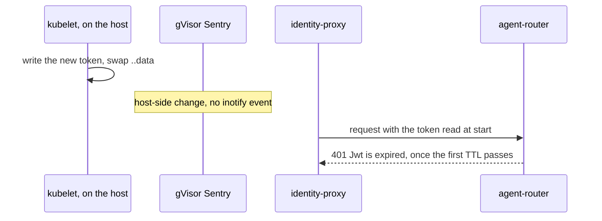
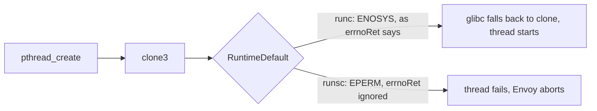

# SP1 spike — results

**Date:** 2026-09-26 · **Cluster:** aws-0, spot, Flux on `integration/agent-factory` (head `1f648c7c`
during the runs) · **Kit:** branch `spike/agent-gvisor` at `bf82940f` (never merged) · **Composition:**
CC-1 `03680f3`, rendered locally with `kcl run`

Two checks failed on gVisor behaviour, not on our design. Both have a decision applied (below), and
every other check passed. Plan: [Task 0.2–0.6](../plans/2026-09-25-agent-runtime-identity-plan.md).

| # | Question | Result | Evidence (command → output) | Consequence |
|---|---|---|---|---|
| Q1 | kubelet vs user-data race | 34 s node Ready → container start; 90 s pod submission → start; 0 `FailedCreatePodSandBox` | Task 0.2 Step 3 on a fresh c6id.xlarge: NodeClaim 14:49:05, Registered 14:49:35, Ready 14:50:00, started 14:50:34 | none |
| Q2 | rotation reaches the injector | **Failed.** `rotation.py`: 5 × 200, then 26 × 401 `Jwt is expired` from minute ~10 | Task 0.3 Step 5; root cause in [Q2](#q2-rotation-never-reaches-the-proxy) | **R2**, on both tokens |
| Q3 | FQDN + DNS proxy under gVisor, ENI, KPR | Hubble: `github.com`, `api.github.com`, agent-router, octo-sts FORWARDED; `example.com`, a random `*.example.org` and every search-path variant DROPPED at the DNS proxy; no TCP drop | Task 0.4 Step 2 | none |
| Q4 | refused search-path names | `api.github.com` → `140.82.121.5` with `ndots:1` | Task 0.4 Step 1 | none |
| Q5 | `oci-seccomp` accepted, harness healthy | **Failed with it on**: no thread can start (`Seccomp: 2`). Off: `Seccomp: 0`, harness Ready, 0 restarts | Task 0.3 Step 3; root cause in [Q5](#q5-oci-seccomp-breaks-every-glibc-thread) | `oci-seccomp` **off** |
| Q6 | `bzip2` on the AMI | preinstalled (`bzip2-1.0.8-6.amzn2023`; the `dnf` line never ran) | Task 0.2 Step 4 | none |
| Q8 | harness → proxy channels | `9901: refused`, `admin socket visible: False`, `hot-restart socket: False` | Task 0.3 Step 6 | none — P13 closes all three |
| Q9 | gVisor ÷ runc (clone + check) | **1.74×** (174 s / 100 s), setup 50 s / 25 s; `task check` exit 0 in both | Task 0.5, m6a.xlarge spot, same node and image digest | none |
| R7 | deleted pod recreated | yes: same name, new uid, the same second | Task 0.3 Step 7 | — |
| — | writable paths the harness needed | none: 0 `read-only`/`permission denied` lines | Task 0.3 Step 4 | — |
| SC-01 | gVisor banner, runtime class, node label | `gvisor ip-10-0-23-183…`, `gvisor`, `[0.000000] Starting gVisor...` | Task 0.3 Step 3 | — |
| SC-02 | runsc in the v3 table at the pin | `runsc version release-20260921.0`; runsc under `io.containerd.cri.v1.runtime` with `ConfigPath '/etc/containerd/runsc.toml'` | Task 0.2 Step 4 | — |
| SC-09 | allow / deny / L7 refusal | `git ls-remote` → HEAD `477dfd3d`; `example.com` exit 1; random name exit 1 | Task 0.4 | — |
| SC-15 | ≤ 5× | pass (1.74×) | Task 0.5 | — |

The token path itself works end to end: a request to `127.0.0.1:4000` reached the stand-in gateway,
whose `jwt_authn` validated the injected token against the EKS JWKS and returned 200.

## Q2: rotation never reaches the proxy

kubelet rotates a projected token by swapping the volume's `..data` symlink **on the host**. gVisor
raises no inotify event for a host-side change on a gofer mount, so Envoy's `watched_directory`
never fires and the proxy keeps the token it read at start.

Isolated with one ConfigMap mounted in two pods, updated at 15:45:58:

| Runtime | inotify events | a plain re-read sees `1 → 2` |
|---|---|---|
| runc | 8, including the `..data` swap at 15:47:18 | 15:47:18 |
| gVisor | **0** | 15:47:23 |

**Applied, R2 on both tokens** (the octo-sts token rotates the same way): `expirationSeconds =
max(600, maxMinutes × 60)`, CC-1 `299eb6d`. EKS issues up to 28 800 s, the XRD's maximum (checked with
`kubectl create token --duration 8h`). The cost is T8: a token copied out of a compromised sandbox
now replays until the run's deadline, 2 h by default, instead of 600 s. Programme C3 is amended to
match. The alternative that keeps 600 s is a Lua filter re-reading the token file per request (re-reads
do see the new content); it was not taken.

**Verified live through Crossplane** (CC-1 pre-release `v0.7.2-pr27.dc52209`): an `AgentRun` with
`maxMinutes: 15` got 900 s tokens and a 900 s deadline, and 23 of 23 requests returned 200 from pod
age 399 s to 857 s, past the ~660 s point where the spike's 600 s tokens were refused.

## Q5: `oci-seccomp` breaks every glibc thread

glibc ≥ 2.34 creates threads with `clone3` and falls back to `clone` **only on ENOSYS**.
containerd's RuntimeDefault answers `clone3` with `errnoRet: 38` for exactly that reason. runsc's OCI
converter ignores `errnoRet` and returns EPERM for every errno rule
(`runsc/specutils/seccomp/seccomp.go:36`, at the pin and on master).

| Probe (python:3.13-slim, glibc 2.41, restricted context, RuntimeDefault) | gVisor | runc |
|---|---|---|
| start a thread | `RuntimeError: can't start new thread` | ok |
| `syscall(clone3, NULL, 0)` | `EPERM` | `ENOSYS` |

Upstream: [gvisor#14688](https://github.com/google/gvisor/issues/14688) is open; its fix PR #14731 was
closed unmerged on 2026-09-12. The Sentry implements `clone3` itself, so the filter is the only
obstacle.

**Applied:** `oci-seccomp = "false"` in the pool's user-data (`bf82940f`). The pod still declares
RuntimeDefault for PSS; the Sentry, whose own host filter is unchanged, is the boundary. Re-enable it
once a release honours `errnoRet`.

## Defects found and fixed on the way

| Finding | Fix |
|---|---|
| Cilium on AL2023 crashlooped: `unable to change MTU of link enp40s0 to 65520` (`devices: eth+` is Bottlerocket naming) | `devices: "eth+ enp+ ens+ pod-id-link+"` (`309fc246`), carried by Task 2.4 |
| EC2NodeClass alias `al2023@v20260909` does not exist for 1.36 | `al2023@v20260923` (`9523d5f1`) |
| agent-sandbox chart refused in `agent-system` (PSS restricted; its security contexts are null) | install with restricted values (plan Task 0.2) |
| identity-proxy exited: `GenericSecretSdsApi: node 'id' and 'cluster' are required` | a static Envoy `node` in the bootstrap (`2fdd01f1`) |
| The published agent-server image is the PyInstaller binary: no `/agent-server/.venv`, no importable SDK | Task 5.1 installs `openhands-{sdk,tools,agent-server}==1.49.5` into `/agent-server/.venv` |
| Benchmark fixture: `mise.jdx.dev` answers 403 to `Python-urllib`; `task check` needs PyYAML | curl, PyYAML, schema plugin pinned like CI (`ebcc29a1`, `b3864af1`) |
| The composition's status item became a composed, nested `AgentRun` (function-kcl `target: Resources`), so a run never got `phase`, `runId` or `branch` and never turned Ready; the goldens had recorded it | `target: Default`, and `render_check.py` now rejects a nested object of the claim's kind (CC-1 `93aafb1`). Live: Ready in 13 s with `phase: Running` |

Noise, not a defect: the proxy's `LOGICAL_DNS` cluster re-resolves octo-sts every 5 s, and with no
octo-sts deployed in the spike each search-path variant shows as a DNS drop. It stops once phase 4
deploys octo-sts.
