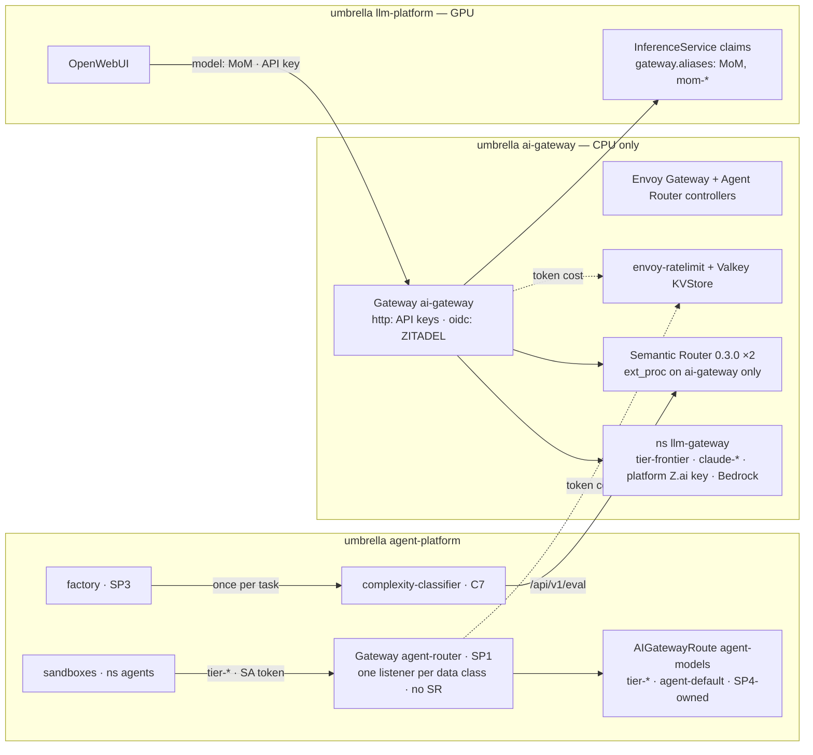
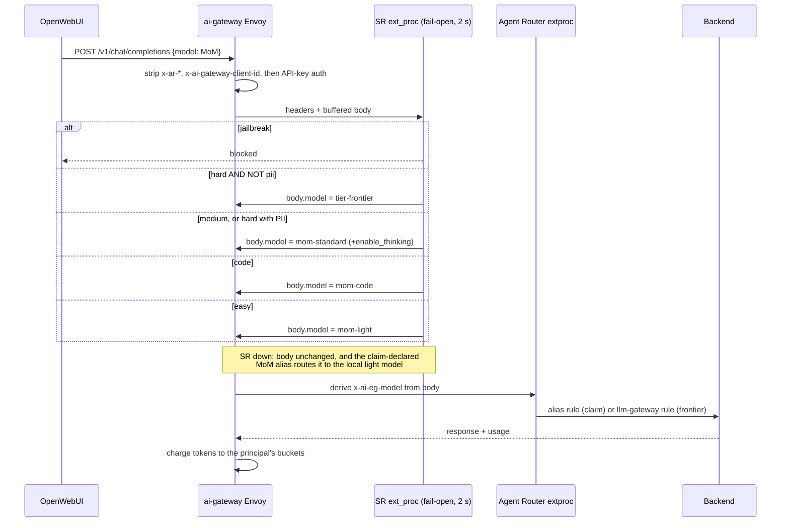
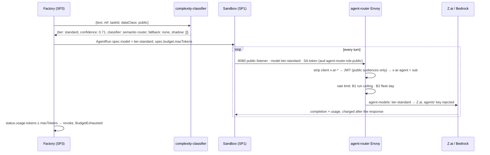
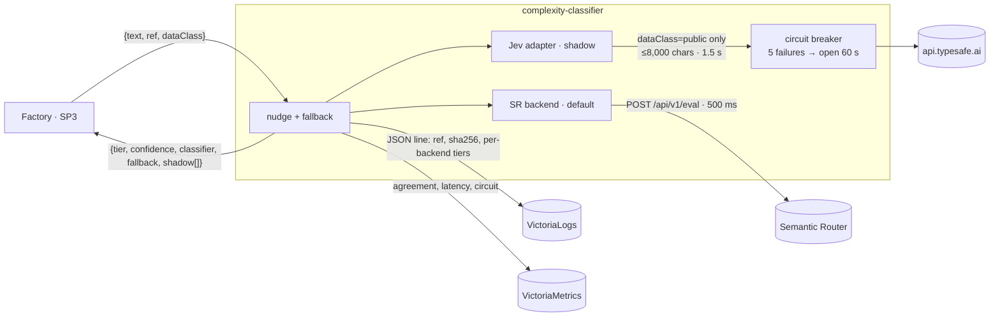

# LLM Complexity Routing — SP4 Design

**Date:** 2026-09-23 · **Status:** draft, aligned to programme r4 — owner review pending
**Programme:** [Agent Factory](2026-09-23-agent-factory-design.md). SP4 owns **C7**, and the model
mapping and budget enforcement of **C5**. The contracts are not restated here.
**Research:** [2026-09-23-llm-complexity-routing-research.md](2026-09-23-llm-complexity-routing-research.md),
which holds every verified fact, its source, prices and pitfalls.
**ADRs:** 0046 frontier providers · 0047 complexity classification · 0050 token budgets

---

## Outcome

Each task and chat gets a model suited to it, frontier models included. Every principal has a token
budget, and routing is measured against fixed-tier baselines rather than assumed to help.

| Today | After SP4 |
|---|---|
| The gateway and the Semantic Router (SR) ship only inside the GPU umbrella | Controllers, SR and human-facing backends move to the CPU-only `ai-gateway` umbrella (C1) |
| SR 0.2.0 runs as one replica on 100% of `ai-gateway` traffic, and its outage 404s `MoM` | SR 0.3.0 runs two replicas with a PDB and **fails open** to a local model. Agents use SP1's `agent-router` Gateway, which has no SR at all |
| The `MoM` model list is hand-edited in the SR HelmRelease | SR routes to **roles** (`mom-light`, `mom-standard`, `mom-code`). A claim declares which roles it fills |
| `complexity` signal unused | Enabled with a margin threshold in the reachable band. PII keeps prompts off the frontier |
| RunLore holds a Z.ai key in its own pod | Provider keys stay in the gateways. Bedrock needs none (EKS Pod Identity) |
| No budgets | A per-run ceiling and daily caps at the gateways, all in token units. SP3 revokes a run at its exact cap |

## Decisions

Options and rationale per constitution §8.2. The programme owner decisions they depend on are listed in
[Owner decisions](#owner-decisions).

| # | Question | Decision | Rejected | Why |
|---|---|---|---|---|
| S1 | Chat classification | SR's in-process signals on the `MoM` ext_proc path (C5) | Calling C7 per request | A second hop duplicates SR's signal and adds a SPOF |
| S2 | Keeping SR off agent traffic | Agents use SP1's dedicated **`agent-router` Gateway** (JWT only). The SR patch targets `ai-gateway` only | An `agents` listener on `ai-gateway`; SR's `skipProcessing` header | Separate Envoy pods and policies. SR can be neither a SPOF nor a prompt reader for agents, and nothing selects a model per request |
| S3 | How a claim joins `MoM` | The claim declares `spec.gateway.aliases` (`MoM`, `mom-light`, `mom-standard`, `mom-code`). The composition renders a header match per alias | SR `IntelligentPool` CRD; an aggregator controller | SR 0.3.0 accepts **exactly one** `IntelligentPool` per namespace. With role targets, SR config never names a fleet model |
| S4 | SR version | **0.3.0**, every chart default overridden explicitly, render-asserted in CI | Waiting for 0.4; nightly charts | 0.3.0 is the latest release, but its **published chart renders broken defaults** (research, pitfall 1) |
| S5 | Complexity threshold | Margin **0.12** (reachable band 0.08–0.15), with separate `chat_difficulty` and `task_difficulty` rules | The documented 0.70–0.75 | The threshold is a hard−easy margin that stayed ≤ 0.197 in tests, so 0.75 never fires ([#3246](https://github.com/vllm-project/semantic-router/issues/3246)) |
| S6 | C7 implementation | A thin Go service over SR's `POST /api/v1/eval`. Jev is an optional adapter, shadow-only (OD-11). The code lives in the shared repo (OD-4) | SP3 calling SR directly; LiteLLM's complexity router; NeMo Switchyard | Insulates SP3 from SR API churn (0.2→0.3 broke the config). Pluggability and shadow comparison are what C7 is for. ADR-0047 |
| S7 | Agent pinning | **Structural.** Every logical name on `agent-router` maps statically, 100% to one backend: no weights, canaries or cross-model fallback | SR session-aware routing; per-run resolution in SP1 | Nothing selects per request, so nothing can re-route a trajectory. Session-aware routing still switches after idle timeout or decision drift |
| S8 | Escalation | A new run at the next tier (C5), started by SP3 | Gateway failover from light to frontier | One under-routed step can fail an agent trajectory. A mid-run switch loses cache and tool state |
| S9 | Frontier providers | **Z.ai GLM** (OpenAI schema) plus **Anthropic via Bedrock** on aws-0 (Pod Identity, OD-12), via Vertex on gcp-0 (Workload Identity) | Native Anthropic API key; OpenRouter | OpenAI-format clients cannot reach native Anthropic in Agent Router v1.1.0. Bedrock serves both client formats with no key. ADR-0046 |
| S10 | Budget mechanism | Envoy Gateway **global rate limit** (`BackendTrafficPolicy`), cost taken from response token metadata, Valkey `KVStore` store | Agent Router `QuotaPolicy`; a custom ext_proc; LiteLLM budgets | `QuotaPolicy` is v1alpha1, partly unimplemented, and in Shared mode admits a request if **any** bucket has room. ADR-0050 |
| S11 | Exact per-run cap | The gateway enforces a platform **ceiling** synchronously. SP3 revokes the run at `maxTokens` (C3, C5) | Budget classes in token audiences; `limit.fromMetadata` fed by a custom filter | A ServiceAccount token carries no custom claims, and a limit-writing filter is custom data-path code |
| S12 | Backend placement | Backends per consumer Gateway. `ai-gateway` backends (ns `llm-gateway`) use the platform Z.ai key. `agent-router` backends (ns `agent-system`) use a separate agents' key | One shared backend set referenced across namespaces | Revoking the agents' key never breaks RunLore or chat, and provider-side spend splits by key. SP4 owns both route files |
| S13 | Data class per route (OD-13, C5) | SP1's **one listener per class** on `agent-router`: `public` :8080 and `internal` :8081. Each listener has a `SecurityPolicy` (`sectionName`) accepting only its class's four audiences `agent-router.<role>.<dataClass>` (C2). `agent-models` (public) and `agent-models-internal` attach to their class's listener via `parentRefs.sectionName`. Z.ai routes exist only on `public` | Two JWT providers with class-marker headers; matching the base64 `aud` header; per-route authorization; class-specific logical names | The other class's listener rejects a token before routing, and no Z.ai route is reachable from `internal`. It fails closed by construction, relying on no unverified Envoy behaviour. The four C5 names stay |

## Architecture



### Request path — chat `MoM`



### Request path — an agent run



---

## 1. Semantic Router: upgrade, HA, claim-owned `MoM` list

**Upgrade 0.2.0 → 0.3.0.** Run `vllm-sr config migrate` on today's `config:` block, then hand-edit
it to the role targets in §2. The published chart's trailing e2e documents win over its intended
defaults, so the HelmRelease sets every one of these explicitly:

| Value | Set to | Chart 0.3.0 renders |
|---|---|---|
| `image.tag` / `image.pullPolicy` | `v0.3.0` by digest / `IfNotPresent` | `latest` / `Never` |
| `config.global.router.config_source` | `file` | `kubernetes`, which waits for CRs that never exist |
| `env` | our list (HF cache paths) | adds the e2e `EMBEDDING_MODEL_OVERRIDE` |
| `config.global.stores.semantic_cache.enabled` | `false` (tool clients, unchanged rationale) | `true` |

- **Guards.** `validate-manifests.sh` asserts the rendered SR Deployment has no `Never` pull policy
  and no `config_source: kubernetes`. Renovate's bound moves to `<0.4.0`, so 0.4 is a plain bump.

**HA.**

| Change | Why |
|---|---|
| 2 replicas, zone `topologySpreadConstraints`, a PDB (`minAvailable: 1`) beside the chart | Removes the SPOF. The chart ships no PDB |
| `persistence.enabled: false` and `/app/models` on an `emptyDir` (`sizeLimit: 3Gi`) | The RWO PVC blocked a second replica, and it was the only reason for `karpenter.sh/do-not-disrupt`. **That annotation goes** |
| A startup probe sized for the ~600 MB model download | Each pod downloads once at start |
| A headless Service. The patch's cluster resolves pod IPs and adds outlier detection | One long-lived gRPC connection per Envoy would otherwise pin a single pod |
| ext_proc `failure_mode_allow: true`, `message_timeout: 2s` (was 60 s) | An SR outage degrades `MoM` to the local model instead of failing it |

The `world:443` egress stays, exercised once per pod start. It is the security/AGENTS.md trap-4
deviation, recorded as risk R6.

**Claim-owned membership (S3).** SR's model list is a fixed set of roles, and a claim declares
which roles it serves:

```yaml
# apps/base/ai/llm/qwen3-8b.yaml
spec:
  gateway:
    enabled: true
    aliases: [MoM, mom-light, mom-standard]   # new enum field; one x-ai-eg-model match per alias
```

- **Composition.** In `Smana/crossplane-configuration`, add `spec.gateway.aliases`: an enum of the
  four names, at most 4 entries, requiring `gateway.enabled`. Canaries apply to aliases exactly as
  to the base name.
- **Uniqueness.** Two claims with the same alias would produce identical matches, and Gateway API
  precedence silently favours the older one. A Kyverno validate rule with an `apiCall` lookup
  rejects a duplicate alias.
- **`mom-standard` implies the `qwen3` reasoning family.** A non-qwen3 claim receives a
  `chat_template_kwargs` flag its template ignores. This is documented, not enforced.
- **`MoM` itself belongs to the light model.** It matches only when SR did not rewrite the body,
  which is fail-open by construction. A new claim joins `MoM` with **no SR edit**.

## 2. Complexity signal for chat `MoM`

Sketch in the v0.3 shape; the exact keys come from `config migrate`.

```yaml
config:
  version: v0.3
  listeners: []                  # behind Agent Router: SR rewrites body.model only
  providers:
    defaults: {default_model: mom-light,
               reasoning_families: {qwen3: {type: chat_template_kwargs, parameter: enable_thinking}}}
    models: [{name: mom-light}, {name: mom-standard, reasoning_family: qwen3},
             {name: mom-code}, {name: tier-frontier}]      # roles, never fleet names
  routing:
    signals:
      complexity:
        - {name: chat_difficulty, threshold: 0.12, hard: {candidates: [...]}, easy: {candidates: [...]}}
        - {name: task_difficulty, threshold: 0.12, ...}    # C7 only: no decision uses it, /api/v1/eval still scores it
      # pii (0.7), jailbreak (prompt_guard 0.7), domains, code keywords: carried over from 0.2
    decisions:
      - {name: frontier_hard, priority: 200, modelRefs: [{model: tier-frontier}],
         rules: {operator: AND, conditions: [{type: complexity, name: "chat_difficulty:hard"},
                 {operator: NOT, conditions: [{type: pii, name: pii_any}]}]}}
      - {name: code, priority: 150, modelRefs: [{model: mom-code, use_reasoning: false}],
         rules: {operator: OR, conditions: [{type: domain, name: code}, {type: keyword, name: code_keywords}]}}
      - {name: reasoning, priority: 100, modelRefs: [{model: mom-standard, use_reasoning: true}],
         rules: {operator: OR, conditions: [{type: complexity, name: "chat_difficulty:medium"},
                 {type: complexity, name: "chat_difficulty:hard"},   # only reached when PII blocked frontier
                 {type: domain, name: math}, {type: domain, name: physics}]}}
      - {name: light, priority: 50, modelRefs: [{model: mom-light, use_reasoning: false}],
         rules: {operator: OR, conditions: [{type: complexity, name: "chat_difficulty:easy"}]}}
```

| Band | Role | Served by today |
|---|---|---|
| hard, no PII | `tier-frontier` | GLM-5.2 through `llm-gateway` |
| hard with PII, medium, math/physics | `mom-standard` (thinking on) | `xplane-qwen3-8b` |
| code | `mom-code` | `xplane-qwen-coder`, LoRA canary still applied |
| easy, default, or SR down | `mom-light` | `xplane-qwen3-8b`, thinking off |

- **Banks.** Around 40 hard and 40 easy candidates per rule, drawn from real prompts. Chat banks
  come from OpenWebUI and coding prompts. Task banks come from past issues that did or did not need
  a frontier run. Both are reviewed in PRs.
- **Calibration.** Start at 0.12, then read `complexity:<rule>:margin` from `/api/v1/eval` over the
  labelled set (§7). SC-6 gates on band collapse.
- **Guards.** A jailbreak is blocked on every `MoM` request, as today. A PII match only removes
  frontier eligibility.
- **Out of scope for `MoM`.** FIM never passes through it. Per-turn switching inside a chat is
  accepted; session-aware routing needs a session header OpenWebUI is not known to send.

## 3. `complexity-classifier` (C7)

A thin Go service (~300 lines) in `agent-system`. Its code lives in the shared repo (OD-4), and the
`agent-platform` umbrella deploys it. It runs 2 replicas with a PDB, all three probes, a restricted
security context and a default-deny CNP: ingress from the factory and vmagent only, egress to SR and
(only when Jev is on) `api.typesafe.ai:443`. SR's CNP gains ingress from it on :8080.



| Behaviour | Rule |
|---|---|
| SR backend | `/api/v1/eval {text}`. The matched `task_difficulty:hard/medium/easy` maps to frontier/standard/light. Confidence is `signal_confidences["complexity:task_difficulty:<band>"]` |
| Nudge (C7 "low confidence moves up one tier") | light below 0.8 → standard. standard below 0.5 → frontier. The raw answer is logged beside the final one |
| Shadow | Runs concurrently with the default backend. Included in `shadow[]` if it answers within 300 ms of the default's answer. Always logged. Never acted on |
| Jev adapter | One `choice` question over {light, standard, frontier}, with instructions describing *our* tiers. `state` = title + body, truncated to 8,000 chars. Only for `dataClass: public`. Key via the `agents-secrets` store (`platform/agents/typesafe`). ~2k tokens × $0.042/1M ≈ $0.08 per 1,000 tasks |
| Fallback | Default answered → `none`. A non-default primary failed, default used → `default`. Both failed, or the 2 s overall deadline passed → `standard` with `fallback: static`. Never blocks |
| Logs | `ref`, `dataClass`, `textSha256`, `textChars`, per backend `{tier, confidence, latencyMs, error}`. **Never the text** |
| Metrics | `complexity_classifier_requests_total{backend,result}`, `…_duration_seconds{backend}`, `…_tier_total{backend,tier}`, `…_agreement_total{shadow,agree}`, `…_circuit_open{backend}` |

SP3 scores tier fit per classifier against task outcomes on `ref`.

## 4. Frontier backends

| Backend | Schema | Credential | On |
|---|---|---|---|
| Z.ai `api.z.ai`, prefix `/api/paas/v4` | `OpenAI` | `APIKey`. `llm-gateway`: the platform key via `openbao-platform` (`platform/llm/zai`). `agent-system`: the agents' key **only** via SP1's namespaced `agents-secrets` store (`platform/agents/zai`), never `openbao-platform` (C1) | both clusters |
| Bedrock `bedrock-runtime` in `eu-west-3`, **EU geo inference profiles** only (no in-region serving for these models; data stays in EU regions, [model cards](https://docs.aws.amazon.com/bedrock/latest/userguide/model-cards.html)) | `AWSAnthropic` | `AWSCredentials` default chain → **EKS Pod Identity**: one `EPI` per data-plane ServiceAccount (`xplane-ai-gateway-bedrock`, `xplane-agent-router-bedrock`), `bedrock:InvokeModel*` on the `eu.anthropic.*` profiles and their EU destination models only | aws-0 |
| Vertex | `GCPAnthropic` | ADC → GKE Workload Identity | gcp-0, follow-up |

**Which client format reaches which backend** (Agent Router v1.1.0 source, research):

| Client | Z.ai GLM (`OpenAI`) | Claude via Bedrock / Vertex | Claude, native API |
|---|---|---|---|
| OpenAI format: OpenWebUI, OpenCode, OpenHands | yes | yes | **no**: no translator (PR #2127 open) |
| Anthropic format: Claude Code, `/anthropic/v1/messages` | yes, translated; tool and thinking fidelity is open question R8 | yes | yes |

**Humans.** On `ai-gateway`, the `http` listener keeps API keys (OpenWebUI, promptfoo, RunLore). A
new `oidc` listener validates ZITADEL JWTs whose `aud` carries the project id (`zitadel_project_id`).
Each listener has its own `SecurityPolicy` via `sectionName`. Claude Code users point
`ANTHROPIC_BASE_URL` at `…/anthropic` there; a CLI login client for humans is open (R12).

**RunLore.** It moves behind `ai-gateway`: `base_url` becomes the `http` listener, and it holds a
gateway API key (`system:runlore`) instead of the Z.ai key. Per OD-13 it requests
`claude-sonnet-5` once Bedrock lands, and `tier-frontier` until then. This depends on OD-3.

**Data egress.**

| Data | May leave to | Enforced by |
|---|---|---|
| Automatic `MoM` routing | frontier only without PII | SR `NOT pii_any` |
| A frontier model explicitly chosen by a human | that provider | the principal's choice, logged |
| Agent-run context | `public` → Z.ai. `internal` → Bedrock EU only (or self-hosted, where a cluster override points there) | Routes attach only to their class's listener (S13), so it fails closed. SP3 sets `spec.dataClass` (C3) |
| Task text to Jev | only `dataClass: public` | C7 adapter |
| Direct from pods | nowhere | provider FQDNs are egress-allowed on the two data-plane pod sets only |

## 5. Logical names and pinning

`AIGatewayRoute agent-models` (the `public` listener) is the C5 mapping. SP1 seeds it with
`agent-default` only, and SP4 owns the file from its first PR and adds `agent-models-internal`. It is frontier-backed
so it works with zero GPUs, and local 7–8B models are never agent tiers. One route per class listener:

| Name | `public` → Z.ai ($/1M in · cached · out) | `internal` → Bedrock EU (first-party list $/1M) |
|---|---|---|
| `tier-light` | `glm-5.3-flash` (API ID UNVERIFIED) · 0.15 · 0.03 · 0.50 | `eu.anthropic.claude-haiku-4-5-20251001-v1:0` · 1 / 5 |
| `tier-standard` | `glm-5.3-flashx` (API ID UNVERIFIED) · 0.37 · 0.075 · 1.25 | `eu.anthropic.claude-sonnet-5` · 2 / 10 |
| `tier-frontier`, `agent-default` | `glm-5.2` · 1.40 · 0.26 · 4.40 | `eu.anthropic.claude-opus-5-5` · 4 / 20 |

Until the Bedrock slice (PR 2) lands, `internal` runs have **no backend** (C5):
`agent-models-internal` is empty, so requests 404 before any token is spent.

`llm-gateway` on `ai-gateway` defines `tier-frontier` (the `MoM` hard target) and, after slice 2, the
`claude-opus-5-5`, `claude-sonnet-5` and `claude-haiku-4-5` routes to the same EU profiles. The same name on two
Gateways means two routes that never meet: `agent-router` only accepts routes from its own
namespace (`allowedRoutes: Same`).

Prices are also recording rules, the price table SP3 needs: `expr: vector(1.40)` with static `labels`
(model, token type). A `label_replace` form trips `validate-vmrules.sh`'s `--lint-fatal` duplicate check.

**Pinning rules** (S7):

1. Nothing on `agent-router` selects per request: no SR, no `MoM`.
2. Every rule in both `agent-models` routes has one backendRef at weight 100, with no priority fallback.
   `validate-manifests.sh` checks it.
3. A mapping change is a reviewed PR, and in-flight runs see it on their next request. SP3's pause
   switch drains runs first when that matters.
4. No session header is an input. SP1's `ClientTrafficPolicy` strips `agent-session-id`, and the run
   identity `x-ar-agent` (its `sub` embeds the runId) is the correlation key for logs and traces.

## 6. Budgets

SP1's JWT provider sets `x-ar-agent` from `sub` (C5). The human `oidc` listener sets `x-ar-human` the
same way. API-key clients carry the existing `x-ai-gateway-client-id`. A `ClientTrafficPolicy` on
each Gateway strips all three, and `agent-session-id`, via `earlyRequestHeaders.remove`
before authentication.

**Rules.** A Gateway's rules share its one `BackendTrafficPolicy` (EG marks a second `Conflicted`): global,
`shared: true` (the default is a bucket per route), `cost.request: 0`, `cost.response` = metadata
`io.envoy.ai_gateway/llm_total_token`. Only routes declaring `llmRequestCosts` are charged, so claim
routes count once the composition sets it (PR 3). The defaults are OD-10's.

| Rule | Gateway | Selector | Default / Day | ≈ $ at GLM-5.2 | Covers |
|---|---|---|---|---|---|
| B1 run ceiling | `agent-router` | `x-ar-agent` Distinct | 5 M | 8.5 | every run. It **equals** the admission ceiling on `maxTokens` |
| B2 fleet | `agent-router`, **one bucket** across both listeners | none | ≥ 25 M + 5 M × launching humans (40 M for three) | 68 for 40 M | every agent run, factory- and human-launched. Sized ≥ the sum of SP3's admission caps (OD-10), so neither starves the other |
| B3 human | `ai-gateway` | `x-ar-human` Distinct | 10 M | 17 | each `human:*` directly |
| B4 system client | `ai-gateway` | `x-ai-gateway-client-id` Distinct | 5 M | 8.5 | RunLore, OpenWebUI, promptfoo |
| B5 frontier guard | `ai-gateway` | `x-ai-eg-model` RegularExpression `^(tier-frontier\|claude-.*)$` | 20 M | 34 | kill switch on human and system frontier spend |

- **Assumptions.** Dollars assume 90% input tokens, no cache discount. Windows are fixed UTC days.
  Rules ship with `shadowMode: true` for a week (OD-10).
- **Per-principal share of run spend.** The gateway cannot see `spec.principal`, because the token
  carries only `sub`. SP3 therefore checks a principal's day before admitting a run, by summing
  `status.usage.tokens` grouped by `spec.principal` (R9).
- **Exact caps.** SP3 writes `status.usage.tokens` from `agent_router:run_tokens:total{principal="agent:<runId>"}`
  and revokes the run at `maxTokens`, which ends it as `BudgetExhausted` (C3). Overshoot is bounded
  by one scrape interval plus one response.
- **What the client sees.** A `429` with `x-envoy-ratelimited: true` (UNVERIFIED, R5), which
  separates it from a provider's own 429. SP1's harness treats one with reset > 60 s as
  `BudgetExhausted` and does not retry.
- **Metrics.** `controller.metricsRequestHeaderAttributes` (chart 1.1.0): "x-ar-agent:ar_agent,x-ar-human:ar_human,x-ai-gateway-client-id:ar_client"`.
  Recording rules (PR 2) derive `agent:<runId>` and `human:<sub>` from these labels. Per-run labels add ~30
  series per run. Alerts: `AgentRunNearCeiling` (80% of B1), `FleetBudgetNearCap` (80% of B2),
  `FrontierSpendGuardTripped` (B5).
- **Store.** A `KVStore` claim (`xplane-ai-gateway-ratelimit`, `nano`, Harbor's pattern) behind EG
  `rateLimit.backend.redis.url`. `REDIS_AUTH` comes in through the rate-limit Deployment's env.
  CNP: only the rate-limit pod reaches Valkey.

## 7. Measurement

An independent four-router evaluation found gains *"track selected-tier composition more closely
than demonstrated task-specific targeting"* ([arXiv 2608.14641](https://arxiv.org/abs/2608.14641)).
Every comparison therefore has fixed-tier arms.

| Surface | Arms | Quality signal | Cost and latency |
|---|---|---|---|
| Chat `MoM` | always-`mom-light`, always-`tier-frontier`, `MoM` | Nightly promptfoo on a held-out labelled set (≥100 prompts, never bank members), grader pinned | tokens × price rules, gateway TTFT |
| Agent tasks | C7-routed, plus 10% forced to `tier-frontier` (OD-14) | SP3 outcome: PR opened, CI green, merged | tokens × price per completed task |
| Classifier | SR vs Jev shadow (OD-11) | agreement, and SP3's tier fit on `ref` | C7 latency |

- **Router replay** stays on with `capture_request_body: false`: signals stored, prompts not.
- **Dashboard.** `grafana-dashboard-routing.yaml` lives in the `ai-gateway` layer. It shows tier mix,
  tokens and USD by principal kind and tier, headroom per rule, SR decisions and complexity bands,
  C7 agreement, and the promptfoo arms. The fleet-serving dashboard stays in `llm-platform`.
- **Verdict (SC-9).** If routed `MoM` does not reach ≥95% of always-frontier's pass rate at ≤50% of
  its cost over 14 nightly runs, `MoM` defaults to `mom-standard` and the design records why.

## 8. Where each piece lives

The umbrellas and their dependencies are C1. SP4's placement within them:

| Umbrella | SP4 pieces |
|---|---|
| `ai-gateway` | `envoy-gateway` (+ rate limit, `KVStore`), `envoy-ai-gateway` (controller PDB, 2 Envoy replicas, `http` + `oidc` listeners), `llm-gateway` (human and system backends, Bedrock `EPI`s, B3–B5, price rules, routing dashboard), `vllm-semantic-router` (+ patch, PDB, headless Service) |
| `agent-platform` | `agent-models` and `agent-models-internal` tiers, B1–B2, `ExternalSecret`s on SP1's `agents-secrets` store (agents' Z.ai key, Jev key), `complexity-classifier`. These sit under SP3's gate paths |
| `llm-platform` | claims declaring `gateway.aliases`, OpenWebUI, promptfoo arms |

- **The move.** The three children leave `clusters/<c>-llm-platform/` with their names unchanged, so
  `dependsOn` edges hold. Doing it while `llm-platform` is suspended leaves it nothing to prune.
- **Naming.** C1's human/system `llm-gateway` is the existing `ai-gateway` Gateway object, kept
  because the composition's `parentRef` names it, plus a new namespace `llm-gateway` for its routes
  and backends. `namespaces/base/` gains it, and the Gateway's `allowedRoutes` selector adds it.
- **Keys.** PR 1 copies the platform Z.ai key from `runlore/credentials` to `platform/llm/zai`; PR 6
  removes it from `runlore/credentials` (SC-10). The `platform/` mount is already granted.

## Threat model

| Threat | Vector | Control |
|---|---|---|
| Provider key theft | a compromised sandbox or client pod | Keys exist only in `llm-gateway`, `agent-system` and the data-plane Secrets. Bedrock has no key. Provider FQDNs are egress-allowed on data-plane pods only |
| Key blast radius | one key leaks | Separate agents' and platform keys (S12). Rotated in OpenBao, refreshed hourly by ESO. The Bedrock roles cover Anthropic `InvokeModel*` only |
| Forged identity header | a client pre-sets `x-ar-agent`, `x-ar-human` or `x-ai-gateway-client-id` | Early strip before authentication (`claim_to_headers` appends). Selectors read only gateway-set headers (SC-2) |
| Budget bypass by direct egress | a sandbox calls `api.z.ai` | No key in `agents`, plus the CNP FQDN allowlist (SP1) |
| Denial of wallet | a runaway loop | B1, B2, B5 and SP3's kill switch. A stream can overshoot by one response |
| PII to frontier via `MoM` | automatic escalation | `NOT pii_any`. SR failure falls back to the local model, never to frontier |
| Internal data to Z.ai from a run | a compromised `internal` run requests any name | Z.ai routes attach only to the `public` listener, and that listener rejects `internal` audiences (S13). The class comes from the API-server-signed audience. Another tier *within* the class stays possible (R10) |
| Prompt injection into routing | *"trivial"* to get a cheap model, or *"extremely hard"* to burn budget | Tiers only choose among models the principal may use anyway. Budgets cap the cost. Jev is shadow-only |
| Prompts retained | SR router replay, C7 logs, Jev | Bodies are not captured, C7 logs hashes, and only public text reaches Jev (ZDR is enterprise-only) |
| Pre-auth SR processing | SR at filter index 0 runs before API-key auth | `ai-gateway` is tailnet and in-cluster only. Moving SR after authentication is R4 |
| Classifier bank poisoning | edits to candidate banks | Banks live in Git and change by reviewed PR |

## Success criteria

| ID | Criterion | Measured by |
|---|---|---|
| SC-1 | With `llm-platform` suspended and zero GPU nodes, a sandbox completes on `agent-default` → GLM-5.2. No provider key exists outside `llm-gateway`, `agent-system` and `envoy-gateway-system` | debug sandbox curl; `kubectl get secrets -A` |
| SC-2 | A request forging another run's `x-ar-agent` is charged to the caller's own `sub` | two runs, one forging; per-principal counters |
| SC-3 | Crossing B1 returns 429 with the budget marker on the next request. The shadow week shows no false trips on real runs | curl loop; shadow counters |
| SC-4 | Deleting one SR pod under 60 s of `MoM` load fails ≤0.1% of requests. With SR at 0 replicas, `MoM` is served by `mom-light` and `agent-router` traffic is unaffected | load test; gateway 5xx |
| SC-5 | A new claim with `gateway.aliases: [mom-code]` receives `MoM` code traffic with **no** SR HelmRelease change | git diff; `x-vsr-selected-model` |
| SC-6 | On the held-out set, all three `chat_difficulty` bands hold ≥10% of prompts, and hard-band precision is ≥0.7 | `/api/v1/eval` over the set |
| SC-7 | C7 p95 ≤ 300 ms, `fallback: static` in < 1% of responses. Cutting Jev egress changes no final tier and opens the circuit within 5 failures | classifier metrics |
| SC-8 | The routing dashboard shows tier mix, USD by principal kind, rule headroom and the three promptfoo arms | Grafana |
| SC-9 | After 14 nightly runs: routed `MoM` reaches ≥95% of always-frontier's pass rate at ≤50% of its cost, **or** `MoM` defaults to `mom-standard` with the reason recorded | promptfoo metrics |
| SC-10 | After migration, `runlore/credentials` holds no `GLM_API_KEY`, and RunLore succeeds as `system:runlore` | OpenBao read; gateway metrics |
| SC-11 | A token with an `…internal` audience never reaches `api.z.ai` for any of the four names: `public` returns 401, and `internal` reaches Bedrock, or 404s before PR 2 | gateway access logs; Hubble on the data-plane pods |

## Non-goals

Per-request or session-aware routing of agent traffic; cross-model failover on `tier-*`;
dollar-denominated enforcement; an output-side guard; replacing Agent Router or SR with LiteLLM,
Switchyard or Plano; training a router; gcp-0 in the first slices.

## Risks and open questions

| # | Item | How it closes |
|---|---|---|
| R1 | Stray defaults from the SR 0.3.0 chart | Fully explicit values plus the render assertion. Report upstream: no issue exists |
| R2 | SR 0.3 may reject role-only models without `backend_refs` (UNVERIFIED) | Slice-4 spike. If so, `backend_refs` point at the gateway Service as metadata |
| R3 | Whether `/v1/models` through `ai-gateway` still lists `MoM` for OpenWebUI's picker (UNVERIFIED) | If not, the gateway's own list shows the `MoM` alias the light claim declares |
| R4 | SR runs before authentication | Try an EG `jsonPath` patch placing SR just before the Agent Router extproc (UNVERIFIED) |
| R5 | `x-envoy-ratelimited` on budget 429s; Valkey + `REDIS_AUTH` through the Deployment env (both UNVERIFIED) | Slice-1 preview. Fallback: a KVStore with no auth, reachable only by the rate-limit pod |
| R6 | SR `world:443` on a long-lived pod | Accepted. Follow-up: serve the weights from Harbor as an OCI image volume |
| R7 | Availability is confirmed from AWS model cards (EU geo profiles from `eu-west-3`). Bedrock prices and the IAM shape for cross-region profiles are UNVERIFIED | Check the Bedrock pricing page and the `EPI` policy in the slice-2 preview |
| R8 | Anthropic→OpenAI translation fidelity for Claude Code → GLM | Slice-2 smoke test. If lossy, Claude Code users get the Bedrock names only |
| R9 | A principal's daily cap on *runs* is admission-time (SP3), not at the gateway | Accepted: a token carries only `sub`. B2 bounds the fleet synchronously |
| R10 | Within its class, a run can request any of the four names. Binding it to its own `spec.model` is unverified (C5) | Budgets bound the cost. Open: per-route authorization after the Agent Router extproc (filter order UNVERIFIED) |
| R11 | Per-run metric cardinality | Revisit above 1,000 runs a day |
| R12 | No ZITADEL client issues a human a JWT for the `oidc` listener from the CLI (device code) | Follow-up in `zitadel-oidc-clients.sh`; until then the listener takes tokens minted another way |
| R13 | Until PR 4, SR's ext_proc fails closed (60 s) on every `http`-listener request, `tier-frontier` included | Accepted for slice 1; PR 4's fail-open patch closes it |

## Implementation outline

Slice 1 is the frontier backends plus budget infrastructure, because SP1's agents need a capable
model early. gcp-0 (Vertex, tier map, umbrella) follows as its own workstream.

| PR | Repo | Content | ADR |
|---|---|---|---|
| 1 | this | `ai-gateway` umbrella and the move. `llm-gateway` namespace, platform Z.ai backend, `tier-frontier`. EG rate limit + `KVStore`. Header strips, metrics attributes, price rules, B3–B5 in shadow | 0046, 0050 |
| — | this (SP1) | `agent-router` Gateway, JWT, agents' Z.ai backend, `agent-models` with `agent-default` | — |
| 2 | this (+ SP1 audiences) | `agent-models` / `agent-models-internal` tiers, B1–B2 in shadow, `agent:`/`human:` recording rules, Bedrock (`EPI`s, `claude-*`), `oidc` listener, `/anthropic` | — |
| 3 | crossplane-configuration → this | `spec.gateway.aliases`, fixtures, release, pin bump, claim aliases, Kyverno uniqueness | — |
| 4 | this | SR 0.3.0 (migrate, explicit values, render assertion, Renovate), HA, fail-open patch, complexity and guard decisions, replay without bodies | — |
| 5 | shared repo (OD-4) + this | `complexity-classifier`, Jev off | 0047 |
| 6 | this | Controller PDB and 2 Envoy replicas on `ai-gateway`, then RunLore behind it | — |
| 7 | this | promptfoo arms and held-out set, routing dashboard, verdict rule, budgets enforced | — |

## ADRs

| ADR | Chosen | Over |
|---|---|---|
| 0046 Frontier providers | Z.ai GLM (key in OpenBao) + Anthropic via Bedrock (Pod Identity) / Vertex (Workload Identity) | native Anthropic key; OpenRouter and other aggregators; self-hosted only |
| 0047 Complexity classification | C7 as a thin service over SR's complexity signal, Jev a shadow adapter | SP3 calling SR directly; LiteLLM's complexity router; Switchyard; Jev in the request path |
| 0050 Token budgets | EG global rate limit, response-metadata cost, Valkey | Agent Router `QuotaPolicy`; a custom ext_proc; LiteLLM budgets |

The umbrella and Gateway splits are layout and the SR bump is a version change, so no ADR.

## Owner decisions

SP4 raises no decision of its own beyond the programme's consolidated table:
[OD-3](2026-09-23-agent-factory-design.md#owner-decisions-consolidated) (`ai-gateway` always on),
OD-10 (budget defaults: B1–B5 above), OD-11 (Jev shadow only), OD-12 (Bedrock), OD-13 (data per
provider), and OD-14 (10% control group).
