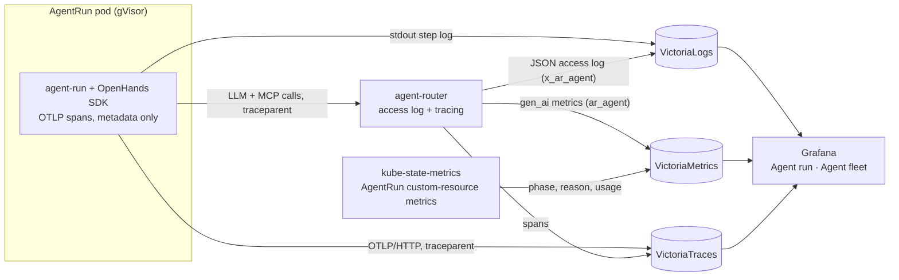

# Agent observability: status, logs, metrics and traces per run

**Status:** approved by the owner on 2026-09-27. No plan has been written yet; the next session writes it.
**Programme:** [Agent Factory](2026-09-23-agent-factory-design.md). This slice sits beside SP1–SP4 and is built on SP1.

## Goal

A human can open any agent run and see, in one place, where it stands, what it did, what it cost
and where its time went. Today every signal exists somewhere, but nothing is per run, and nothing is
traced:

| Signal | Today (SP1, live on aws-0) | Gap |
|---|---|---|
| Status | `kubectl get agentrun` (role, class, phase, branch) | cluster access only; no history |
| Logs | step log (`agent-run step N: <tool> \| 
 \| <target>`) in VictoriaLogs | Grafana Explore only; no per-run view |
| Metrics | one *platform* dashboard: pods by phase, tokens per run, gVisor capacity, router 4xx | no per-run drill-down |
| Traces | VictoriaTraces runs in-cluster, with a Grafana datasource | nothing sends agent traces |

## Owner decisions (2026-09-27)

- **Traces carry metadata only:** timing, model, token counts, tool names, status and errors. No
  prompts, no completions, no tool output. The transcript already lives in the SP2 room log, behind
  room access, and metadata-only traces, enforced by the collector, stay safe for `internal` runs.
- **Build it now on SP1, before SP2.** A small slice stacked on the SP1 PRs gives per-run visibility
  while SP2 and SP3 are built. Their plans only add links to it.

## Design

One entry point: an **"Agent run"** Grafana dashboard with a `run` variable, and an **"Agent
fleet"** overview listing every run.
- `task agent:run` prints the run's dashboard link on stderr; the run's name stays the last line of stdout.
- SP2's room UI links each run to it.
- SP3's issue narration links it beside the room's watch link.

| Signal | Panels | Source |
|---|---|---|
| Status | phase timeline, end reason, PR link, tokens used vs `maxTokens`, duration | kube-state-metrics custom-resource metrics on `AgentRun`; `kubectl get agentrun` gains PRINCIPAL, PR, TOKENS and REASON columns (SP3's CC-F1) |
| Logs | the step log, the run's gateway calls, MCP calls, errors | VictoriaLogs: the run's pod, and `log.x_ar_agent` for the gateway |
| Metrics | tokens in and out, cost, model latency p50/p95, error rate, step count | VictoriaMetrics, `ar_agent` label |
| Traces | one trace per run: run → steps → model and tool calls → gateway → provider | OpenHands SDK OTLP export (`OTEL_EXPORTER_OTLP_TRACES_ENDPOINT`), plus agent-router tracing, joined by `traceparent`, with the run id as a span attribute |

## Security

- **One new egress:** the run's CNP allows OTLP/HTTP to an OpenTelemetry Collector in
  `observability`, and nothing else there. The collector, outside the sandbox, drops
  `gen_ai.prompt*`, `gen_ai.completion*` and tool input and output attributes, sets the run id from
  the sending pod's `agents.ogenki.io/run-id` label (`k8sattributes`, overwriting the span's own),
  and exports to VictoriaTraces.
- **Metadata only, enforced outside the sandbox:** the harness also records no content attributes,
  but that is hygiene: a compromised run can POST any span (SP1 §4). The collector is the control,
  and SO-3 is proved on what VictoriaTraces stores.
- **Access:** Grafana SSO, with the agent dashboards in a folder readable by `agents-member`.
  Developers read here, not in the cluster.

## Unverified, check first

| Point | Check | Fallback |
|---|---|---|
| The SDK's Laminar instrumentation can turn off content capture | Read `openhands/sdk/observability/laminar.py` at 1.49.6 and run one span through a local collector | A span processor in `agent_run.py` that drops content attributes before export, or harness spans without the LiteLLM instrumentation |
| Envoy Gateway 1.9 exports traces over OTLP/HTTP (VictoriaTraces ingests OTLP over HTTP) | `EnvoyProxy.spec.telemetry.tracing` schema in the flux-schema catalog | Gateway spans skipped; the harness's LLM spans still show each call's latency |
| kube-state-metrics in `victoria-metrics-k8s-stack` accepts a custom-resource-state config | Chart values | A small recording rule over the Crossplane XR's own metrics, or phase from the step log |

## Success criteria

| ID | Criterion |
|---|---|
| SO-1 | From the "Agent fleet" dashboard, one click reaches a run's page, which shows its phase, reason, PR and tokens vs budget |
| SO-2 | The run page shows the step log and the gateway calls of that run only |
| SO-3 | A run produces one trace in VictoriaTraces, with a span per model call, and no prompt or completion text in any attribute |
| SO-4 | The run's CNP admits traces to VictoriaTraces' insert path only: another path, or another port, is `DROPPED` |
| SO-5 | `task agent:run` prints the run's dashboard link on stderr, and its last stdout line is still the run's name |

## Out of scope

Prompt and completion capture; alerts per run (SP3's VMRules own alerting); dashboards for the
rooms broker (SP2) and the factory (SP3), which add their own panels to "Agent fleet".
