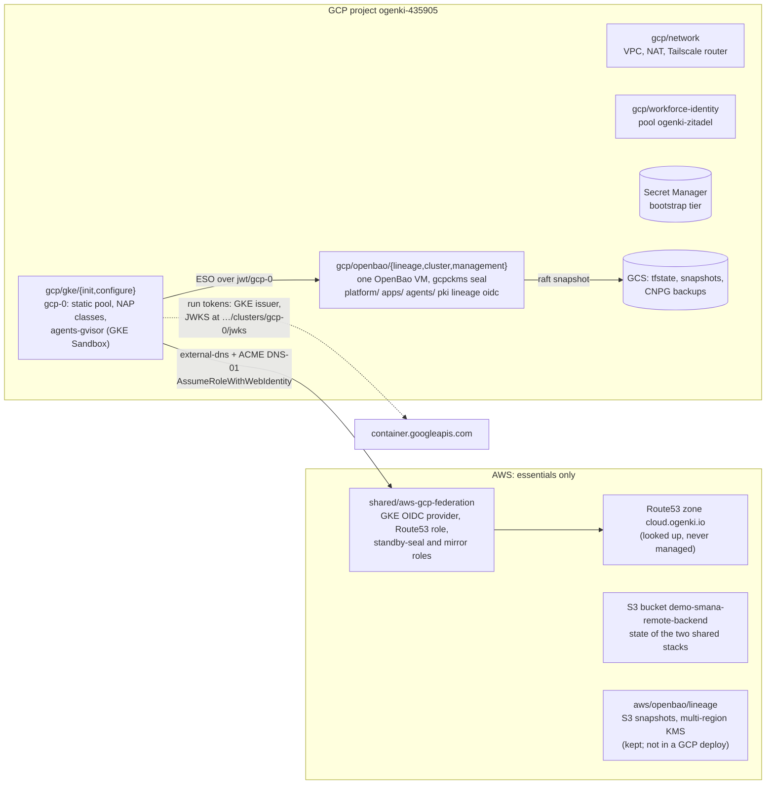
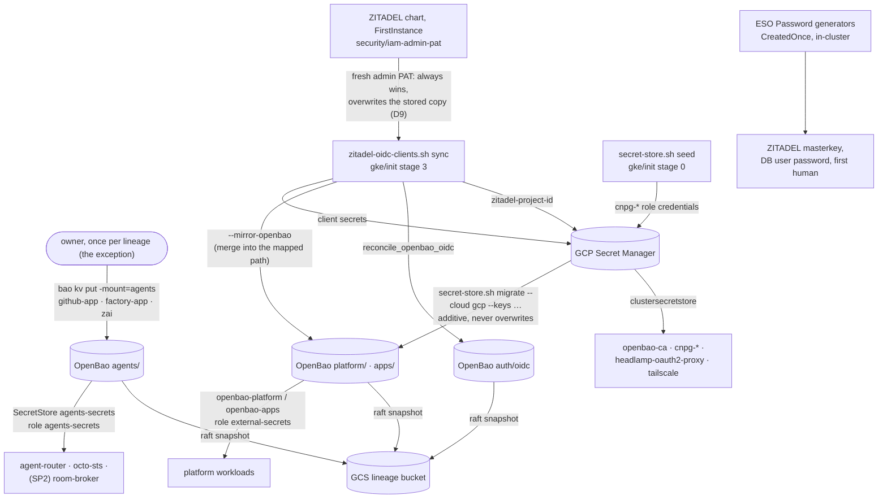
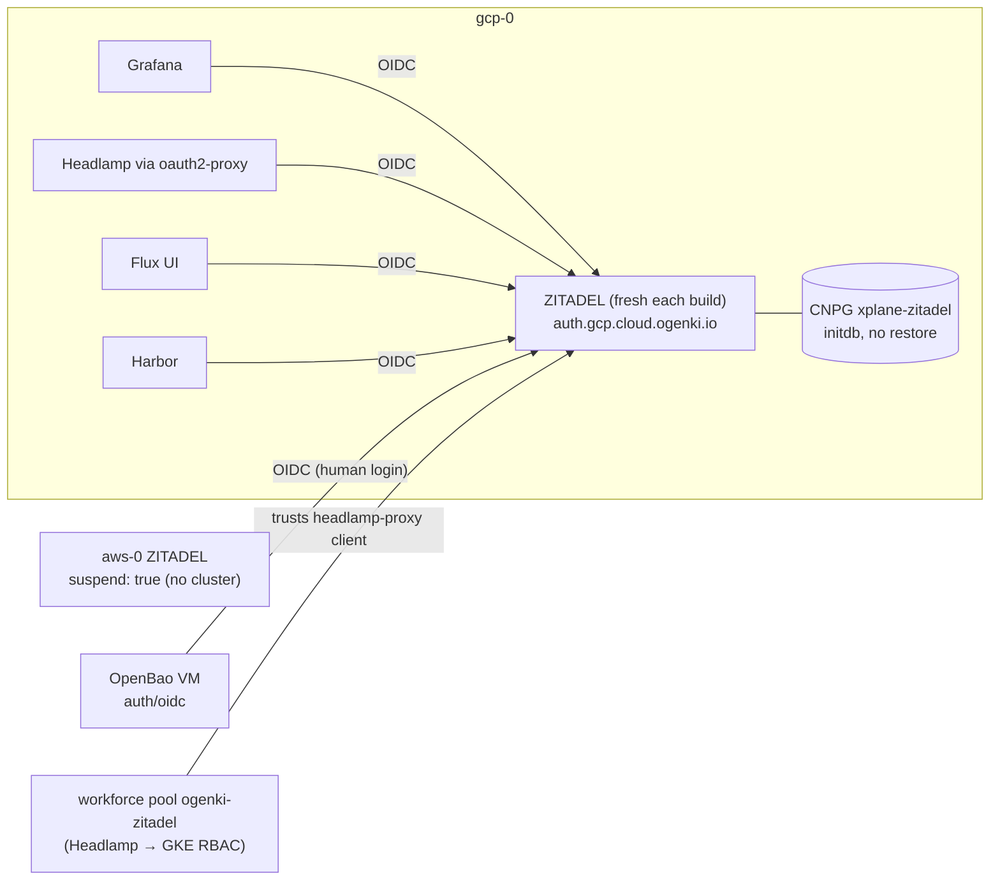
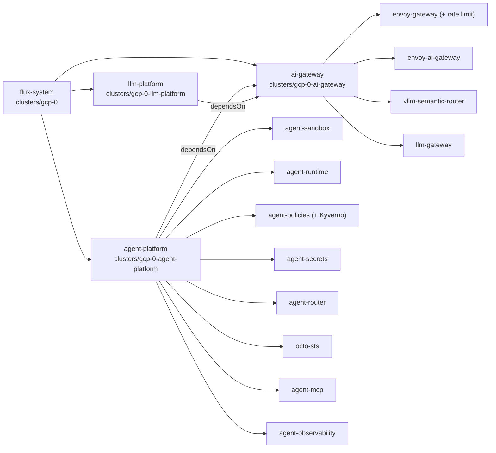

# GCP parity slice — design

**Date:** 2026-09-29 · **Status:** approved by the owner on 2026-09-29, items 1–7 below. Amended the same day
after an independent plan review, with four owner rulings (D6, D8–D10) ·
**Plan:** [`2026-09-29-gcp-parity-plan.md`](../plans/2026-09-29-gcp-parity-plan.md)

**Parents.** The AWS Stage 2 design and plan
(`docs/superpowers/specs/2026-09-10-openbao-stage2-secrets-personas-design.md`,
`docs/superpowers/plans/2026-09-10-openbao-stage2-secrets-personas.md`), reused as they are; only the
cloud glue changes. Also the GCP OpenBao design (`2026-08-24-gcp-openbao-design.md`) and ADR-0027. The
programme's delivery model comes from the SP2 plan: P33, P37–P40 and Phase 0.5.

**Prior art, never merged.** Branch `worktree-openbao-stage2-gcp` (head `ac62abf2`, 2026-09-11, also
inside `origin/test/gcp-only-live`) already ported Stage 2 to GCP and **verified it live**. It covered a
shared module, a policy-parity CI gate, `migrate --keys` and a new-lineage switch. It then went stale
behind the scripts restructure and #2078. This slice salvages it.

## Outcome

- **gcp-0 is the whole platform.** `TM_CLOUD=gcp` builds it, from an `integration/agent-factory` checkout. It
  hosts ZITADEL and the only running OpenBao, and it runs the agent factory: SP1, then the SP2/SP3 stacks as
  they land. The GCP-primary switch itself stays on the integration branch until the owner promotes it (D6).
- **AWS keeps four things:** the Route53 zone, the AWS↔GCP federation, the S3 state bucket and the
  OpenBao lineage stacks. There is no AWS cluster and no AWS OpenBao server.
- **Every live gate moves to gcp-0,** from H-1 onward: SP2 Phase 0.5, the observability plan, then SP2.

## What runs where

### Stacks under `TM_CLOUD=gcp`

| Stack | Runs | Why |
|---|---|---|
| `shared/tailscale` | yes (shared) | Tailnet ACL and DNS. Its state is in S3, **so AWS credentials are still required** |
| `shared/aws-gcp-federation` | yes (shared) | Route53 role for gcp-0; standby-seal and mirror roles. S3 state |
| `gcp/network` → `gcp/openbao/lineage` → `gcp/openbao/cluster` → `gcp/openbao/management` | yes | OpenBao, then Stage 2: mounts, policies, logins |
| `gcp/workforce-identity` | yes | GKE per-user RBAC through ZITADEL |
| `gcp/gke/init` (runs `configure` inline) → `gcp/gke/configure` | yes | Cluster, Cilium, Flux, ZITADEL bootstrap and OIDC clients |
| `aws/{network,eks/init,eks/configure,openbao/cluster,openbao/management}` | `[skip]` | No AWS cluster, no AWS OpenBao server |
| `aws/openbao/lineage` | `[skip]`, and it **stays** | Its S3 snapshots and KMS key outlive everything (`TM_LINEAGE_DESTROY`) |
| `aws/llm-platform` | `[skip]` | Opt-in, AWS-only |

AWS resources that no stack in this run touches, and that stay: the Route53 zone, the S3 state bucket,
and the AWS lineage's bucket and key.

## Secrets flow

| Class | Lives in | Gets there by | Survives a rebuild by |
|---|---|---|---|
| Bootstrap tier: CA chain, root token, recovery keys, intermediate, `flux-github-app`, `zitadel-google-idp`, `openbao-oidc`, `headlamp-oauth2-proxy`, `tailscale-k8s-operator-oauth`, `cnpg-*` | Secret Manager | pre-existing; `seed` for `cnpg-*` | Secret Manager |
| Platform and app secrets (Grafana, Harbor, runlore, Flux, app-wizard) | OpenBao `platform/`, `apps/` | `secret-store.sh migrate --cloud gcp --keys …` | the raft snapshot |
| OIDC client credentials | Secret Manager **and** the OpenBao path the consumer reads | the sync, every build (fresh directory) | nothing: re-registered every build |
| ZITADEL keys | Kubernetes Secrets only | ESO `Password` generators, `CreatedOnce` | nothing: the directory is fresh every build |
| ZITADEL DB admin | `xplane-zitadel-cnpg-superuser` | the SQLInstance composition, from `cnpg-xplane-zitadel-superuser` | Secret Manager |
| Agents' GitHub App key, factory App key, Z.ai key | OpenBao `agents/` | **[OWNER] once**: the one no-seed exception | the raft snapshot |
| ZITADEL admin PAT | in-cluster `security/iam-admin-pat`, copied to Secret Manager `zitadel-iam-admin-pat` | the chart, on FirstInstance; the sync overwrites the stored copy whenever they differ (D9) | nothing: a fresh directory mints a new one |
| AI gateway client keys (`openwebui`, `promptfoo`) | Kubernetes Secret `ai-gateway-api-keys` | ESO `Password` generators on gcp-0, `CreatedOnce`. aws-0 keeps its hand-made AWS entry `platform-llm-api-keys` | nothing: the gateway issues them, and its clients are suspended on gcp-0 |
| The private CA, for the agents' SecretStore | Secret Manager `openbao-priv-gcp-ca-chain`, a raw PEM | the ceremony; gcp-0's `agent-secrets` overlay reads it instead of AWS's `certificates/<domain>/ca-chain` | Secret Manager |

**The exception, recorded.** GitHub issues the two App keys and Z.ai issues the API key, so nothing
in-cluster can generate them. The AWS raft snapshot cannot move them either: it restores only onto an
`awskms`-sealed node, and gcp-0's lineage is `gcpckms`. So the owner writes them once per GCP lineage.
From then on the GCP snapshot restores them. That holds because gcp-0 now takes scheduled snapshots
(bug 7 fixed in G-2), not only the teardown's.

**Not exceptions.** Each of these was checked against the code:
- The AI gateway keys are the gateway's own client credentials, so gcp-0 generates them.
- The ZITADEL PAT comes from the chart.
- The CA already lives in Secret Manager.

## ZITADEL topology

| Setting | Value |
|---|---|
| `primary_cloud` | `"gcp"` **on `integration/agent-factory` only** (D6). `clusters/gcp-0/security/zitadel.yaml` gets `suspend: false`, and aws-0's existing `suspend: false` flips to `true` (`validate-idp-topology.sh`). `.doc-claims.yaml` and its two pages follow the flip. `main` stays `"aws"` |
| Admin PAT | the chart's `security/iam-admin-pat` always wins, and overwrites Secret Manager's copy (D9). The copy stored before this slice belongs to a replaced directory: the owner deletes it once |
| Database | `initdb` every build: gcp-0's `objectStoreRecovery` goes. The 2026-08-28 seed would not decrypt with a generated masterkey |
| Keys | masterkey, DB user password and first-human password come from ESO generators. The DB admin comes from the CNPG superuser Secret, so the two can never disagree |
| Per build, by the deploy | `zitadel-idp.sh` (Google IdP, groups Action), then `zitadel-oidc-clients.sh` (project, roles, six clients, OpenBao's own client) |
| `zitadel_project_id` | A new id every build. The sync writes it to Secret Manager `zitadel-project-id` and patches the ConfigMap; `gke/configure` reads Secret Manager, so a later apply cannot revert it. The two committed tfvars values stay as the fallback, equal to each other |
| Per build, by the owner | the first Google login, then `sync --grant-admin <email>` |

## Sandbox nodes

The AgentRun composition (crossplane-configuration `feat/agentrun-harness`, `apis/agentrun/kcl/main.k`)
sets `runtimeClassName: gvisor` and nothing else: no `nodeSelector`, no toleration. Node selection
therefore lives in the RuntimeClass, and **the composition stays cloud-neutral, with no change.**

| | aws-0 (integration branch) | gcp-0 (this slice) |
|---|---|---|
| Pool | Karpenter `agents-gvisor`: AL2023 spot, c/m 4–16 vCPU, `limits.cpu: 16` | GKE Sandbox node pool `agents-gvisor`: `e2-standard-8` spot, 0–2 nodes (16 vCPU / 64 GiB), Cilium taint |
| Runtime | `runsc` from EC2NodeClass user-data | native GKE Sandbox |
| RuntimeClass `gvisor` | ours: selects `agents.ogenki.io/runtime=gvisor` and tolerates it | GKE's own: selects `sandbox.gke.io/runtime=gvisor` and tolerates it |
| Per-cloud manifests | `agents-nodepool`, `runtimeclass-gvisor` | none: the pool is OpenTofu, and GKE ships the RuntimeClass |
| DaemonSets that must reach run nodes (Vector) | tolerate `agents.ogenki.io/runtime` | tolerate `sandbox.gke.io/runtime` too, in base |
| Cilium | `socketLB.hostNamespaceOnly: true` | added. gVisor's netstack never calls `connect()` in the host kernel, so socket-LB cannot translate ClusterIPs |

## Wiring

All three umbrellas are `suspend: true` in every PR. Only `integration/agent-factory` unsuspends the
two new ones, in a test-only commit.

**Per-cloud values replace the AWS-shaped ones.** Every other key the agents read (`private_domain_name`,
`cluster_name`, …) is already cloud-neutral.

| Key (both ConfigMaps) | aws-0 | gcp-0 |
|---|---|---|
| `oidc_issuer_url` | `https://oidc.eks.eu-west-3.amazonaws.com/id/<ID>` | `https://container.googleapis.com/v1/projects/ogenki-435905/locations/europe-west4-a/clusters/gcp-0` |
| `oidc_jwks_uri` (new) | `<issuer>/keys` | `<issuer>/jwks` |
| `oidc_jwks_host` (new) | `oidc.eks.eu-west-3.amazonaws.com` | `container.googleapis.com` |
| `gcp_dns_editor_role` (new, gcp only) | — | `projects/ogenki-435905/roles/xplane_dns_editor_v3` |

octo-sts reads its trust policies from `main` only. Their `issuer_pattern` therefore gains gcp-0's issuer
in a small PR that merges ahead, as #2113 did.

Two agent inputs are Secret Manager keys rather than variables, and gcp-0's overlays patch them:
- `agent-secrets`' `openbao-ca` reads `openbao-priv-gcp-ca-chain` (raw PEM) instead of AWS's JSON
  `certificates/<domain>/ca-chain`;
- `envoy-ai-gateway`'s client keys are generated instead of read from `platform-llm-api-keys`.

## CI: the GCP render fixture

`render-bundle.py` renders a `base/` directory with the AWS-shaped fixture, and a `*/gcp-0/*` overlay with
`CLUSTER_FIXTURE_VARS["gcp-0"]`. So:

- Every agent and AI-gateway base that a Kustomization substitutes into gets two overlays, `*/aws-0/<name>`
  and `*/gcp-0/<name>`: seven pairs, `vllm-semantic-router` included. Each cluster's child points at its own
  overlay. The bundle then holds one honest render per cloud.
- `CLUSTER_FIXTURE_VARS["gcp-0"]` gains the GKE issuer, JWKS URI, JWKS host and DNS role.
- A new gate, `assert-cloud-shape.py`, fails when any gcp-0 overlay renders any of:
  - `amazonaws.com` or `oidc.eks.`;
  - a `/keys` JWKS;
  - a `certificates/` secret key, or `platform-llm-api-keys`.

  It also fails when a gcp-0 SecurityPolicy or MCPRoute issuer is not `https://container.googleapis.com/…`, and
  when a child of the two new gcp-0 umbrellas substitutes `gke-gcp-0-vars` into a `base/` path.
- Every role a gcp-0 `GCPWorkloadIdentity` grants under `bucketRoles` must be in Crossplane's bucket allowlist
  (`test-gcp-bucket-grant-allowlist.sh`: bug 7).
- `check-substitution.py` is unchanged. It already fails when a variable is missing from a cluster's
  ConfigMap.

## Validation

1. **The first deploy.** It is [OWNER]-visible and comes after the weekly reset (2026-09-29 21:00). The owner's
   pre-flight comes first (plan Task 8.1):
   - the CLI and ADC logins;
   - the Let's Encrypt budget;
   - the lineage's Secret Manager versions (D8);
   - the stale PAT delete (D9);
   - the custom-role check.

   The deploy is then
   `TM_CLOUD=gcp TF_VAR_flux_git_ref=refs/heads/integration/agent-factory OPENBAO_SNAPSHOT_SKIP_FOREIGN_SEAL=true terramate script run deploy`,
   from an `integration/agent-factory` checkout. Stage 3 swallows its failures, so its log is grepped for
   `[warn]`, `[FAILED ]` and `skipping stage 3`.
2. **Platform gates.** Every non-suspended Kustomization is Ready. Every OpenBao-backed ExternalSecret is
   synced. Stage 2 mounts, policies and capability probes pass. ZITADEL is fresh, and SSO works on all
   four consumers and on OpenBao.
3. **Sandbox smoke.** A gVisor pod, on a pool scaled from zero, with `RuntimeDefault` seccomp, runs
   threads, resolves DNS and reaches a ClusterIP.
4. **Agent gates.** The runbooks in `docs/runbooks/agent-factory/`, retargeted to gcp-0; SC-04 end to end.
5. **Programme gates on gcp-0.** H-1's Task 0.5.14 and CC-H1 (CI), O-1 Phase 3 and CC-O1 (via O-1), then
   SP2's live tasks. The plan's *Cross-plan edits* hold their gcp-0 deltas.

## Decisions

| # | Decision | Rejected |
|---|---|---|
| D1 | **Salvage `ac62abf2`'s shared module** `opentofu/shared/modules/openbao-store-of-record` for GCP's Stage 2, brought up to `main`'s AWS semantics: #2078 `ignore_changes`, alias `admin`. The AWS stack does not change | Copying AWS's files into GCP (two copies forever). Re-porting from scratch discards a live-verified port, and its state addresses probably already sit in GCS |
| D2 | **A fresh ZITADEL every build**, keys generated in-cluster; owner approved | Restoring seed `zitadel-20260828` (the 09-11 D2): a masterkey from a store and a stale directory. Relocating AWS's directory: its data is `awskms`-bound |
| D3 | **`agents` mount on both clouds in this slice** (SP2 P38's M1 moves here), and `merge-gate` stays with SP2 S1 | Leaving M1 in S1: gcp-0 would need the three agent keys before S1 exists, and the SecretStore path is shared base |
| D4 | **Node selection stays in the RuntimeClass**, with no composition change | A per-cloud `nodeSelector` in the composition: a CC release, and a second place to keep in step |
| D5 | **Per-cloud issuer variables** in both ConfigMaps | Hard-coding `container.googleapis.com` in gcp-0 patches: every new consumer re-learns it |
| D6 | **GCP is primary on `integration/agent-factory` only** (owner, 2026-09-29, revising the first draft). The flip (G-4) is a draft PR, "do not merge", with its ADR in *Proposed*; `main` stays AWS-primary until the owner promotes it | Merging the flip to `main` now (the first draft's choice): the owner wants it proven live first |
| D7 | **Custom GKE role IDs carry a generation suffix (`_v3`) and survive teardown** (state-rm on destroy, adopt on deploy) | Bumping the suffix every rebuild: GCP reserves a deleted role ID for 37 days, which a weekly rebuild always hits |
| D8 | **Restore the existing GCP lineage** (owner, 2026-09-29). The newest `-gcpckms` snapshot is restored with the Secret Manager root-token and recovery-key versions that belong to it; older versions are re-added when the entries were re-copied for the `awskms` standby. A new lineage only when no `-gcpckms` object exists | A new lineage beside an existing one: the salvaged switch refuses it by design, and it would discard the 09-11 lineage's `platform/` data and `oidc/` mount |
| D9 | **The chart's fresh ZITADEL admin PAT always wins** and overwrites Secret Manager's copy; the store is read only when no chart Secret exists (a seed restore). The owner deletes the pre-slice copy once (owner, 2026-09-29) | "The store wins" (the old order): with a fresh directory every build, the stored PAT belongs to a replaced directory, and every stage-3 call gets a 401 that the deploy swallows |
| D10 | **Merge classes** (owner, 2026-09-29): G-0 first; G-1 to G-3 each when green and reviewed; G-4 never (D6); G-5 with the programme, and it never contains G-4 | Holding the platform fixes for Phase 7: they are wanted regardless of the programme |
| D11 | **A confirmed teardown sweeps GKE's LB leftovers** (owner, 2026-09-29): the forwarding rules and target pools GKE created, and the `k8s-*` firewall rules on the platform VPC. It runs only with `TM_DESTROY_CONFIRMED=true` and only once gcp-0 is gone, then retries the destroy | Reporting only (the first draft): forwarding rules keep billing and the VPC delete keeps failing |
| D12 | **The AI gateway's client keys are generated on gcp-0** | Hand-seeding `platform-llm-api-keys` into GCP Secret Manager: a second exception for keys the gateway itself issues |

## Risks

| Risk (memory) | Verdict | Evidence | Early check |
|---|---|---|---|
| `gcp_gateway_hairpin_cross_node` | **Not hit** by the run CNP → agent-router. **Hit** by SP2's broker IdP egress | agent-router is an Envoy Gateway `ClusterIP` Service with real pods (`envoyproxy.yaml`), which the run CNP selects by label (`main.k:299-302`). The hairpin needs a Cilium Gateway VIP. SP2 P11 adds `toFQDNs` for the IdP on :443, and on gcp-0 that is gcp-0's own ZITADEL Gateway | SSO on the four consumers (L-4); cross-plan edit for SP2 |
| `gcp_reauth_expires_adc_mid_run` | Real | The first deploy is long: the ZITADEL wait alone is up to 45 min. Both logins die together, and stage 3's `get-credentials` uses the CLI one: a stale CLI token prints `skipping stage 3` and exits 0 | Fresh `gcloud auth login` **and** `gcloud auth application-default login` right before the deploy; exit code logged; the log grepped for `skipping stage 3` |
| `gke_lb_orphans_block_vpc_delete` | Real | ZITADEL's and the public Gateway's LoadBalancers. `teardown.sh` reports forwarding rules only | `teardown.sh` reports target pools and `k8s-*` firewall rules, and a confirmed teardown sweeps all three (D11, G-2) |
| `gcp_crossplane_grant_allowlist_contract` | **Triggered by bug 7**; not by AgentRun | AgentRun composes Kubernetes objects only. But `openbao-snapshot` asks for `roles/storage.objectCreator`, which `crossplane_bucket_grantable_roles` lacks, so gcp-0 never took a scheduled snapshot | objectCreator added (G-2); a test that every `bucketRoles` role is allowlisted; a probe snapshot job (plan 8.3 Step 9) |
| A stale ZITADEL admin PAT in Secret Manager | Real, and it silently empties stage 3 | `zitadel-pat.sh` preferred the stored copy; a fresh directory makes it invalid; stage 3 swallows the 401 | D9 (G-3), the owner's one-time delete, and the stage-3 log grep |
| gcp-0's private external-dns waits on `aws-load-balancer-controller` (09-11 bug 6) | Real on `main`, blocking | base `dependsOn`; the fix lives only on `test/gcp-only-live` | salvaged into G-2; `dig grafana.priv.gcp.ogenki.io` |
| The agents' `openbao-ca` reads the AWS key shape | Real, blocking the agent secrets | `security/base/agent-secrets/externalsecret-openbao-ca.yaml` | gcp-0 overlay patch; the cloud-shape gate forbids `certificates/` |
| Lineage/token mismatch | Real | The root-token entries may have been re-copied for the `awskms` standby after the last `-gcpckms` snapshot | D8's version alignment before the deploy; a 403 names the mismatch, and the recovery is to re-add the next candidate |
| `gcp_only_broken_since_stage2` | Real, and the core of this slice | `main`'s `gcp/openbao/management` has only `lineage` + `pki` | Policy-parity gate fails before G-1 and passes after |
| `external_dns_child_domain_filter` | Handled already | gcp-0 runs its own `external-dns-public` overlay | L-2 greps the flag; a record exists for `auth.gcp.cloud.ogenki.io` |
| `terramate_destroy_false_success` | Real at teardown | — | `teardown.sh` only, verify-only after |
| `cnpg_restore_requires_empty_archive` | Closed | per-generation `serverName` (crossplane-configuration `main.k:285`); ZITADEL no longer restores | — |
| `letsencrypt_rate_limit_blocks_rebuilds` | Real | Each build issues `auth.gcp.cloud.ogenki.io` | crt.sh count < 5 before deploying |
| Custom role IDs reserved for 37 days (09-11 bug 2) | Real, likely blocking tonight | `iam.tf:78,134,368` unchanged; gke/init destroys them | `gcloud iam roles list --show-deleted` pre-flight; `_v3` + persistence (D7) |
| `migrate` walks the cluster's keys, which on gcp-0 are OpenBao paths | Real | `migrate_source_keys` (`secret-store.sh:459`); `zitadel/envvars` is unmapped | `--keys` (salvaged) |
| The sync writes Secret Manager while gcp-0's consumers read OpenBao (09-11 bug 9) | Real, blocking with a fresh directory | no OpenBao write in `zitadel-oidc-clients.sh` for consumers | `--mirror-openbao` (G-3) |
| `gke/init` stage 2 skips the CA write, the jwt adopt and `deploy_identity_provider` (09-11 bug 3) | Real | stage-2 job in `gcp/gke/init/workflows.tm.hcl` | G-2 |
| AWS-shaped issuer/JWKS in agent-router, agent-mcp, octo-sts | Real, silent (renders clean) | `oidc.eks.${region}.amazonaws.com` (data-plane CNP:78, octo-sts CNP:54); `${oidc_issuer_url}/keys` | per-cloud vars + cloud-shape gate |
| octo-sts trust policies pin the EKS issuer | Real | `.github/chainguard/agent-*.sts.yaml` on `main` | G-0 merges ahead |
| gcp-0 pins `crossplane-configuration-gcp:v0.7.0`, which has no AgentRun XRD | Real | `configuration-gcp/configuration-packages.yaml:16`. H-1's aws pin, `v0.7.1`, has none either | G-5 pins both clouds to the `v0.7.2-pr31.988146f` pre-release. `task push` publishes `-gcp` with every pre-release; skopeo checks all three digests |
| gcp-0 has no Kyverno; `agent-policies` needs it | Real | `security/gcp-0/controllers` lacks `../../base/kyverno` | G-5 |
| gVisor + full socket-LB on GCP | Likely | aws values carry `hostNamespaceOnly: true`; gcp values list it as absent | the sandbox smoke probe |
| gVisor + `RuntimeDefault` seccomp breaks threads (AWS spike) | Unknown on GKE | AWS turned `oci-seccomp` off; GKE Sandbox's setting is not ours | the sandbox smoke probe |
| SP2's bridge → broker :8443 is plain HTTP and relies on WireGuard (P2) | Real, and it blocks SP2's gates on gcp-0 | gcp cilium values: "WireGuard is intentionally absent" | GP-18: TLS on both clouds from the `openbao` ClusterIssuer, as concrete amendments to SP2 Tasks 1.9, 1.11, 1.14 (CC-S2), 1.18 and 1.20 |

## Success criteria

1. `TM_CLOUD=gcp` deploys from the integration checkout with `TERRAMATE_EXIT=0`. Every non-suspended
   Kustomization on gcp-0 is Ready.
2. GCP OpenBao has `platform/`, `apps/` and `agents/`. It has the `external-secrets`, `secrets-admin`,
   `admin`, `pki-admin` and `agents-secrets` policies, and the capability probes return the expected
   `read`/`deny`.
3. Every ExternalSecret on gcp-0 is `SecretSynced`, and none reads AWS.
4. ZITADEL started from `initdb`, with generated keys. Grafana, Headlamp, the Flux UI, Harbor and the
   OpenBao OIDC login all work after the owner's first login and grant.
5. The sandbox smoke probe prints `threads=4 dns=ok tcp=ok release=4.4.0` on a node labelled
   `sandbox.gke.io/runtime=gvisor`.
6. Runbooks 01–08 pass on gcp-0, SC-04 included.
7. `validate-manifests.sh`, `validate-openbao-policies.sh`, `validate-idp-topology.sh`, the new
   cloud-shape gate and `task check` all exit 0.
8. A rebuild inside 37 days of a teardown creates no custom role, and adopts all three.
9. `grafana.priv.gcp.ogenki.io` resolves (bug 6), and a probe run of the `openbao-snapshot` CronJob writes a
   new `-gcpckms` object (bug 7).
10. The stage-3 log carries `[persist] writing the cluster's admin PAT`, four `[mirrored]` lines and no
    `[warn]`/`[FAILED ]`.
11. A confirmed GCP teardown leaves no GKE-created forwarding rule, no target pool and no `k8s-*` firewall
    rule, and `teardown.sh --verify-only` exits 0.

## Out of scope

- Moving AWS's management stack onto the shared module (D1's follow-up).
- `merge-gate` (SP2 S1, SP3), and SP3 in general.
- A GCP counterpart for Bedrock (SP4 PR 2 is AWS-only; Vertex is ADR-0046's option).
- A `seed` arm that generates `cnpg-xplane-zitadel-superuser` on a brand-new project (ours has it).
- Persisting the Let's Encrypt certificate across teardowns.
- Merging the GCP-primary flip to `main` (D6: the owner promotes it later).
- gcp-0's `llm-platform` clients reading the generated gateway keys: a cross-namespace read, for when that
  umbrella is unsuspended on gcp-0 (D12).
- #2085's OIDC client check in GCP's management `drift detect`. AWS runs it; GCP drift will not report a stale
  OIDC client between deploys.

## Review fixes applied (2026-09-29)

The independent plan review (`gcp-parity-plan-review.md`) changed this design in these places. The plan's own
table of the same name maps every finding to a task.

| Finding | Design change |
|---|---|
| A stale stored ZITADEL PAT (C1) | D9 (owner): the chart's PAT always wins. A new secrets-table row and a ZITADEL-table row |
| No private DNS on gcp-0, bug 6 (C2) | a new risk row; success criterion 9 |
| No AgentRun XRD in the gcp package (C3) | the risk row now names the `pr31` pre-release for both clouds |
| The agents' CA key AWS-shaped (C4) | a new secrets-table row, a *Wiring* note, the gate's forbidden list, a risk row |
| A CLI token expiring mid-run (I1) | the reauth risk row, and the validation pre-flight |
| The lineage decision (I2) | D8 (owner): restore the existing lineage |
| The GCP-primary flip on `main` (I3) | D6 revised (owner): integration-only; the doc claim follows the flip |
| Teardown only reported LB leftovers (I7) | D11 (owner): a confirmed sweep; success criterion 11 |
| GP-18 underspecified (I8) | the risk row names the SP2 tasks amended |
| `platform-llm-api-keys` (I10) | D12: generated on gcp-0; not an exception |
| Bug 7, no scheduled snapshots (I11) | the allowlist risk row flips to *triggered*; success criterion 9 |
| Merge classes | D10 (owner) |
