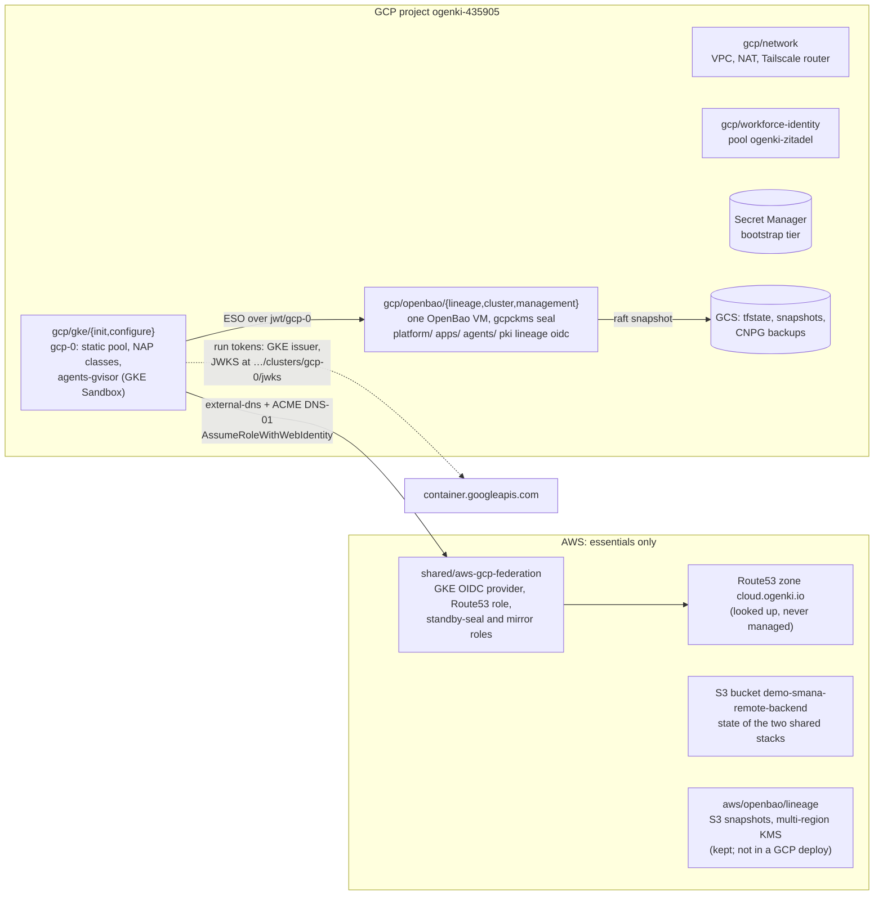
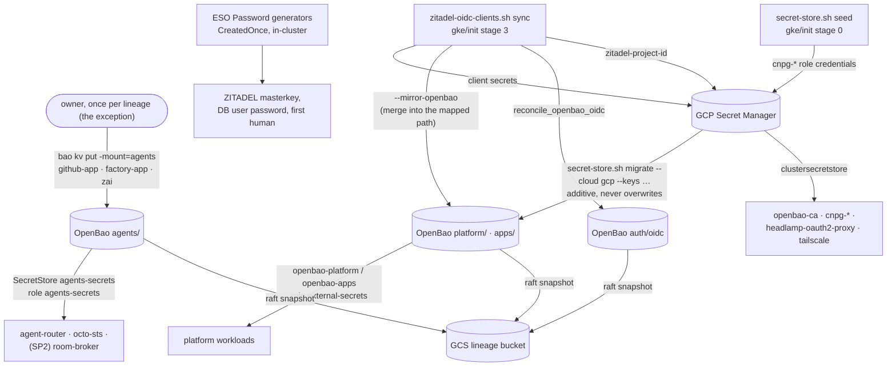
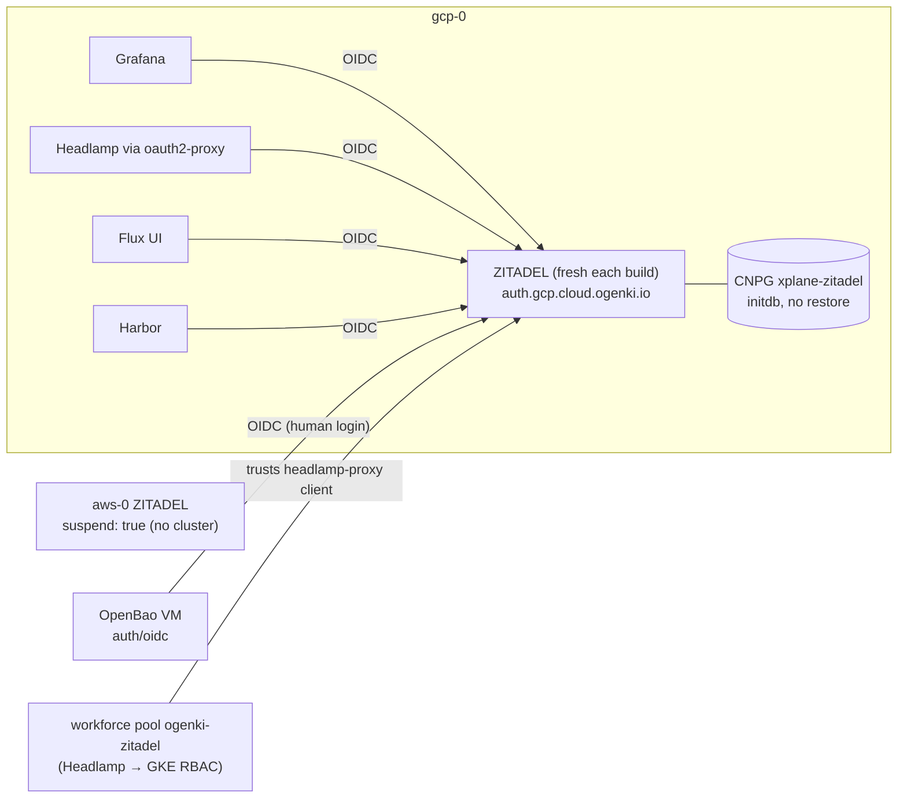
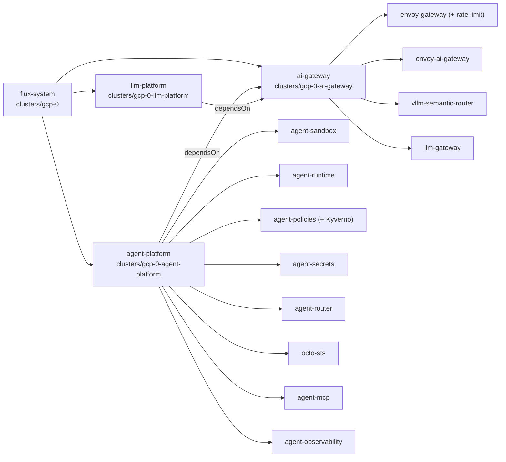

# GCP parity slice — design

**Date:** 2026-09-29 · **Status:** approved by the owner on 2026-09-29, items 1–7 below ·
**Plan:** [`2026-09-29-gcp-parity-plan.md`](../plans/2026-09-29-gcp-parity-plan.md)

**Parents.** The AWS Stage 2 design and plan
(`docs/superpowers/specs/2026-09-10-openbao-stage2-secrets-personas-design.md`,
`docs/superpowers/plans/2026-09-10-openbao-stage2-secrets-personas.md`), reused as they are; only the
cloud glue changes. Also the GCP OpenBao design (`2026-08-24-gcp-openbao-design.md`) and ADR-0027. The
programme's delivery model comes from the SP2 plan: P33, P37–P40 and Phase 0.5.

**Prior art, never merged.** Branch `worktree-openbao-stage2-gcp` (head `ac62abf2`, 2026-09-11, also
inside `origin/test/gcp-only-live`) already ported Stage 2 to GCP and **verified it live**. It covered a
shared module, a policy-parity CI gate, `migrate --keys` and a new-lineage switch. It then went stale
behind the scripts restructure and #2078. This slice salvages it.

## Outcome

- **gcp-0 is the whole platform.** `TM_CLOUD=gcp` builds it. It hosts ZITADEL and the only running
  OpenBao, and it runs the agent factory: SP1, then the SP2/SP3 stacks as they land.
- **AWS keeps four things:** the Route53 zone, the AWS↔GCP federation, the S3 state bucket and the
  OpenBao lineage stacks. There is no AWS cluster and no AWS OpenBao server.
- **Every live gate moves to gcp-0,** from H-1 onward: SP2 Phase 0.5, the observability plan, then SP2.

## What runs where

### Stacks under `TM_CLOUD=gcp`

| Stack | Runs | Why |
|---|---|---|
| `shared/tailscale` | yes (shared) | Tailnet ACL and DNS. Its state is in S3, **so AWS credentials are still required** |
| `shared/aws-gcp-federation` | yes (shared) | Route53 role for gcp-0; standby-seal and mirror roles. S3 state |
| `gcp/network` → `gcp/openbao/lineage` → `gcp/openbao/cluster` → `gcp/openbao/management` | yes | OpenBao, then Stage 2: mounts, policies, logins |
| `gcp/workforce-identity` | yes | GKE per-user RBAC through ZITADEL |
| `gcp/gke/init` (runs `configure` inline) → `gcp/gke/configure` | yes | Cluster, Cilium, Flux, ZITADEL bootstrap and OIDC clients |
| `aws/{network,eks/init,eks/configure,openbao/cluster,openbao/management}` | `[skip]` | No AWS cluster, no AWS OpenBao server |
| `aws/openbao/lineage` | `[skip]`, and it **stays** | Its S3 snapshots and KMS key outlive everything (`TM_LINEAGE_DESTROY`) |
| `aws/llm-platform` | `[skip]` | Opt-in, AWS-only |

AWS resources that no stack in this run touches, and that stay: the Route53 zone, the S3 state bucket,
and the AWS lineage's bucket and key.

## Secrets flow

| Class | Lives in | Gets there by | Survives a rebuild by |
|---|---|---|---|
| Bootstrap tier: CA chain, root token, recovery keys, intermediate, `flux-github-app`, `zitadel-google-idp`, `openbao-oidc`, `headlamp-oauth2-proxy`, `tailscale-k8s-operator-oauth`, `cnpg-*` | Secret Manager | pre-existing; `seed` for `cnpg-*` | Secret Manager |
| Platform and app secrets (Grafana, Harbor, runlore, Flux, app-wizard) | OpenBao `platform/`, `apps/` | `secret-store.sh migrate --cloud gcp --keys …` | the raft snapshot |
| OIDC client credentials | Secret Manager **and** the OpenBao path the consumer reads | the sync, every build (fresh directory) | nothing: re-registered every build |
| ZITADEL keys | Kubernetes Secrets only | ESO `Password` generators, `CreatedOnce` | nothing: the directory is fresh every build |
| ZITADEL DB admin | `xplane-zitadel-cnpg-superuser` | the SQLInstance composition, from `cnpg-xplane-zitadel-superuser` | Secret Manager |
| Agents' GitHub App key, factory App key, Z.ai key | OpenBao `agents/` | **[OWNER] once**: the one no-seed exception | the raft snapshot |

**The exception, recorded.** GitHub issues the two App keys and Z.ai issues the API key, so nothing
in-cluster can generate them. The AWS raft snapshot cannot move them either: it restores only onto an
`awskms`-sealed node, and gcp-0's lineage is `gcpckms`. So the owner writes them once per GCP lineage.
From then on the GCP snapshot restores them.

## ZITADEL topology

| Setting | Value |
|---|---|
| `primary_cloud` | `"gcp"`. `clusters/gcp-0/security/zitadel.yaml` gets `suspend: false`, and aws-0's gets `true` (`validate-idp-topology.sh`) |
| Database | `initdb` every build: gcp-0's `objectStoreRecovery` goes. The 2026-08-28 seed would not decrypt with a generated masterkey |
| Keys | masterkey, DB user password and first-human password come from ESO generators. The DB admin comes from the CNPG superuser Secret, so the two can never disagree |
| Per build, by the deploy | `zitadel-idp.sh` (Google IdP, groups Action), then `zitadel-oidc-clients.sh` (project, roles, six clients, OpenBao's own client) |
| `zitadel_project_id` | A new id every build. The sync writes it to Secret Manager `zitadel-project-id` and patches the ConfigMap; `gke/configure` reads Secret Manager, so a later apply cannot revert it. The two committed tfvars values stay as the fallback, equal to each other |
| Per build, by the owner | the first Google login, then `sync --grant-admin <email>` |

## Sandbox nodes

The AgentRun composition (crossplane-configuration `feat/agentrun-harness`, `apis/agentrun/kcl/main.k`)
sets `runtimeClassName: gvisor` and nothing else: no `nodeSelector`, no toleration. Node selection
therefore lives in the RuntimeClass, and **the composition stays cloud-neutral, with no change.**

| | aws-0 (integration branch) | gcp-0 (this slice) |
|---|---|---|
| Pool | Karpenter `agents-gvisor`: AL2023 spot, c/m 4–16 vCPU, `limits.cpu: 16` | GKE Sandbox node pool `agents-gvisor`: `e2-standard-8` spot, 0–2 nodes (16 vCPU / 64 GiB), Cilium taint |
| Runtime | `runsc` from EC2NodeClass user-data | native GKE Sandbox |
| RuntimeClass `gvisor` | ours: selects `agents.ogenki.io/runtime=gvisor` and tolerates it | GKE's own: selects `sandbox.gke.io/runtime=gvisor` and tolerates it |
| Per-cloud manifests | `agents-nodepool`, `runtimeclass-gvisor` | none: the pool is OpenTofu, and GKE ships the RuntimeClass |
| DaemonSets that must reach run nodes (Vector) | tolerate `agents.ogenki.io/runtime` | tolerate `sandbox.gke.io/runtime` too, in base |
| Cilium | `socketLB.hostNamespaceOnly: true` | added. gVisor's netstack never calls `connect()` in the host kernel, so socket-LB cannot translate ClusterIPs |

## Wiring

All three umbrellas are `suspend: true` in every PR. Only `integration/agent-factory` unsuspends the
two new ones, in a test-only commit.

**Per-cloud values replace the AWS-shaped ones.** Every other key the agents read (`private_domain_name`,
`cluster_name`, …) is already cloud-neutral.

| Key (both ConfigMaps) | aws-0 | gcp-0 |
|---|---|---|
| `oidc_issuer_url` | `https://oidc.eks.eu-west-3.amazonaws.com/id/<ID>` | `https://container.googleapis.com/v1/projects/ogenki-435905/locations/europe-west4-a/clusters/gcp-0` |
| `oidc_jwks_uri` (new) | `<issuer>/keys` | `<issuer>/jwks` |
| `oidc_jwks_host` (new) | `oidc.eks.eu-west-3.amazonaws.com` | `container.googleapis.com` |
| `gcp_dns_editor_role` (new, gcp only) | — | `projects/ogenki-435905/roles/xplane_dns_editor_v3` |

octo-sts reads its trust policies from `main` only. Their `issuer_pattern` therefore gains gcp-0's issuer
in a small PR that merges ahead, as #2113 did.

## CI: the GCP render fixture

`render-bundle.py` renders a `base/` directory with the AWS-shaped fixture, and a `*/gcp-0/*` overlay with
`CLUSTER_FIXTURE_VARS["gcp-0"]`. So:

- Every agent base that a Kustomization substitutes into gets two one-line overlays, `*/aws-0/<name>` and
  `*/gcp-0/<name>`, and each cluster's child points at its own. The bundle then holds one honest render
  per cloud.
- `CLUSTER_FIXTURE_VARS["gcp-0"]` gains the GKE issuer, JWKS URI, JWKS host and DNS role.
- A new gate, `assert-cloud-shape.py`, fails when any gcp-0 overlay renders `amazonaws.com`, `oidc.eks.`
  or a `/keys` JWKS. It also fails when a gcp-0 SecurityPolicy or MCPRoute issuer is not
  `https://container.googleapis.com/…`, and when a child of the two new gcp-0 umbrellas substitutes
  `gke-gcp-0-vars` into a `base/` path.
- `check-substitution.py` is unchanged. It already fails when a variable is missing from a cluster's
  ConfigMap.

## Validation

1. **The first deploy.** It is [OWNER]-visible and comes after the weekly reset (2026-09-29 21:00):
   `TM_CLOUD=gcp TF_VAR_flux_git_ref=refs/heads/integration/agent-factory terramate script run deploy`,
   from an `integration/agent-factory` checkout.
2. **Platform gates.** Every non-suspended Kustomization is Ready. Every OpenBao-backed ExternalSecret is
   synced. Stage 2 mounts, policies and capability probes pass. ZITADEL is fresh, and SSO works on all
   four consumers and on OpenBao.
3. **Sandbox smoke.** A gVisor pod, on a pool scaled from zero, with `RuntimeDefault` seccomp, runs
   threads, resolves DNS and reaches a ClusterIP.
4. **Agent gates.** The runbooks in `docs/runbooks/agent-factory/`, retargeted to gcp-0; SC-04 end to end.
5. **Programme gates on gcp-0.** H-1's Task 0.5.14 and CC-H1 (CI), O-1 Phase 3 and CC-O1 (via O-1), then
   SP2's live tasks. The plan's *Cross-plan edits* hold their gcp-0 deltas.

## Decisions

| # | Decision | Rejected |
|---|---|---|
| D1 | **Salvage `ac62abf2`'s shared module** `opentofu/shared/modules/openbao-store-of-record` for GCP's Stage 2, brought up to `main`'s AWS semantics: #2078 `ignore_changes`, alias `admin`. The AWS stack does not change | Copying AWS's files into GCP (two copies forever). Re-porting from scratch discards a live-verified port, and its state addresses probably already sit in GCS |
| D2 | **A fresh ZITADEL every build**, keys generated in-cluster; owner approved | Restoring seed `zitadel-20260828` (the 09-11 D2): a masterkey from a store and a stale directory. Relocating AWS's directory: its data is `awskms`-bound |
| D3 | **`agents` mount on both clouds in this slice** (SP2 P38's M1 moves here), and `merge-gate` stays with SP2 S1 | Leaving M1 in S1: gcp-0 would need the three agent keys before S1 exists, and the SecretStore path is shared base |
| D4 | **Node selection stays in the RuntimeClass**, with no composition change | A per-cloud `nodeSelector` in the composition: a CC release, and a second place to keep in step |
| D5 | **Per-cloud issuer variables** in both ConfigMaps | Hard-coding `container.googleapis.com` in gcp-0 patches: every new consumer re-learns it |
| D6 | **GCP is primary**, and the flip rides a PR (G-4) with an ADR | An integration-only commit: the owner's intent is durable, and `validate-idp-topology.sh` must hold on the stack |
| D7 | **Custom GKE role IDs carry a generation suffix (`_v3`) and survive teardown** (state-rm on destroy, adopt on deploy) | Bumping the suffix every rebuild: GCP reserves a deleted role ID for 37 days, which a weekly rebuild always hits |

## Risks

| Risk (memory) | Verdict | Evidence | Early check |
|---|---|---|---|
| `gcp_gateway_hairpin_cross_node` | **Not hit** by the run CNP → agent-router. **Hit** by SP2's broker IdP egress | agent-router is an Envoy Gateway `ClusterIP` Service with real pods (`envoyproxy.yaml`), which the run CNP selects by label (`main.k:299-302`). The hairpin needs a Cilium Gateway VIP. SP2 P11 adds `toFQDNs` for the IdP on :443, and on gcp-0 that is gcp-0's own ZITADEL Gateway | SSO on the four consumers (L-4); cross-plan edit for SP2 |
| `gcp_reauth_expires_adc_mid_run` | Real | The first deploy is long: the ZITADEL wait alone is up to 45 min | Fresh `gcloud auth application-default login` right before the deploy; exit code logged |
| `gke_lb_orphans_block_vpc_delete` | Real | ZITADEL's and the public Gateway's LoadBalancers. `teardown.sh` reports forwarding rules only | `teardown.sh` also reports target pools and `k8s-*` firewall rules (G-2) |
| `gcp_crossplane_grant_allowlist_contract` | Not triggered | AgentRun ships in `core` and composes Kubernetes objects only; the allowlist is resource-derived (`iam.tf:162`) | Custom-role rename goes through the resource name, so the allowlist follows |
| `gcp_only_broken_since_stage2` | Real, and the core of this slice | `main`'s `gcp/openbao/management` has only `lineage` + `pki` | Policy-parity gate fails before G-1 and passes after |
| `external_dns_child_domain_filter` | Handled already | gcp-0 runs its own `external-dns-public` overlay | L-2 greps the flag; a record exists for `auth.gcp.cloud.ogenki.io` |
| `terramate_destroy_false_success` | Real at teardown | — | `teardown.sh` only, verify-only after |
| `cnpg_restore_requires_empty_archive` | Closed | per-generation `serverName` (crossplane-configuration `main.k:285`); ZITADEL no longer restores | — |
| `letsencrypt_rate_limit_blocks_rebuilds` | Real | Each build issues `auth.gcp.cloud.ogenki.io` | crt.sh count < 5 before deploying |
| Custom role IDs reserved for 37 days (09-11 bug 2) | Real, likely blocking tonight | `iam.tf:78,134,368` unchanged; gke/init destroys them | `gcloud iam roles list --show-deleted` pre-flight; `_v3` + persistence (D7) |
| `migrate` walks the cluster's keys, which on gcp-0 are OpenBao paths | Real | `migrate_source_keys` (`secret-store.sh:459`); `zitadel/envvars` is unmapped | `--keys` (salvaged) |
| The sync writes Secret Manager while gcp-0's consumers read OpenBao (09-11 bug 9) | Real, blocking with a fresh directory | no OpenBao write in `zitadel-oidc-clients.sh` for consumers | `--mirror-openbao` (G-3) |
| `gke/init` stage 2 skips the CA write, the jwt adopt and `deploy_identity_provider` (09-11 bug 3) | Real | stage-2 job in `gcp/gke/init/workflows.tm.hcl` | G-2 |
| AWS-shaped issuer/JWKS in agent-router, agent-mcp, octo-sts | Real, silent (renders clean) | `oidc.eks.${region}.amazonaws.com` (data-plane CNP:78, octo-sts CNP:54); `${oidc_issuer_url}/keys` | per-cloud vars + cloud-shape gate |
| octo-sts trust policies pin the EKS issuer | Real | `.github/chainguard/agent-*.sts.yaml` on `main` | G-0 merges ahead |
| gcp-0 pins `crossplane-configuration-gcp:v0.7.0`, which has no AgentRun XRD | Real | `configuration-gcp/configuration-packages.yaml:16` | pin in lockstep with aws; pre-release exists (skopeo) |
| gcp-0 has no Kyverno; `agent-policies` needs it | Real | `security/gcp-0/controllers` lacks `../../base/kyverno` | G-5 |
| gVisor + full socket-LB on GCP | Likely | aws values carry `hostNamespaceOnly: true`; gcp values list it as absent | the sandbox smoke probe |
| gVisor + `RuntimeDefault` seccomp breaks threads (AWS spike) | Unknown on GKE | AWS turned `oci-seccomp` off; GKE Sandbox's setting is not ours | the sandbox smoke probe |
| SP2's bridge → broker :8443 is plain HTTP and relies on WireGuard (P2) | Real, and it blocks SP2's gates on gcp-0 | gcp cilium values: "WireGuard is intentionally absent" | cross-plan ruling GP-18 |

## Success criteria

1. `TM_CLOUD=gcp` deploys from the integration checkout with `TERRAMATE_EXIT=0`. Every non-suspended
   Kustomization on gcp-0 is Ready.
2. GCP OpenBao has `platform/`, `apps/` and `agents/`. It has the `external-secrets`, `secrets-admin`,
   `admin`, `pki-admin` and `agents-secrets` policies, and the capability probes return the expected
   `read`/`deny`.
3. Every ExternalSecret on gcp-0 is `SecretSynced`, and none reads AWS.
4. ZITADEL started from `initdb`, with generated keys. Grafana, Headlamp, the Flux UI, Harbor and the
   OpenBao OIDC login all work after the owner's first login and grant.
5. The sandbox smoke probe prints `threads=4 dns=ok tcp=ok release=4.4.0` on a node labelled
   `sandbox.gke.io/runtime=gvisor`.
6. Runbooks 01–08 pass on gcp-0, SC-04 included.
7. `validate-manifests.sh`, `validate-openbao-policies.sh`, `validate-idp-topology.sh`, the new
   cloud-shape gate and `task check` all exit 0.
8. A rebuild inside 37 days of a teardown creates no custom role, and adopts all three.

## Out of scope

- Moving AWS's management stack onto the shared module (D1's follow-up).
- `merge-gate` (SP2 S1, SP3), and SP3 in general.
- A GCP counterpart for Bedrock (SP4 PR 2 is AWS-only; Vertex is ADR-0046's option).
- A `seed` arm that generates `cnpg-xplane-zitadel-superuser` on a brand-new project (ours has it).
- Persisting the Let's Encrypt certificate across teardowns.
