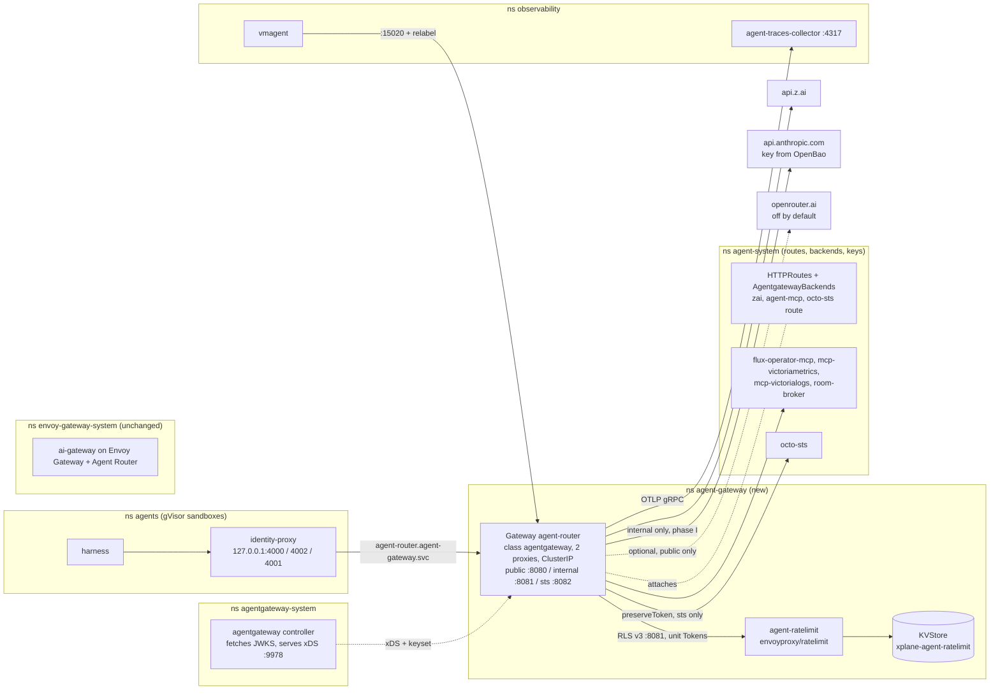
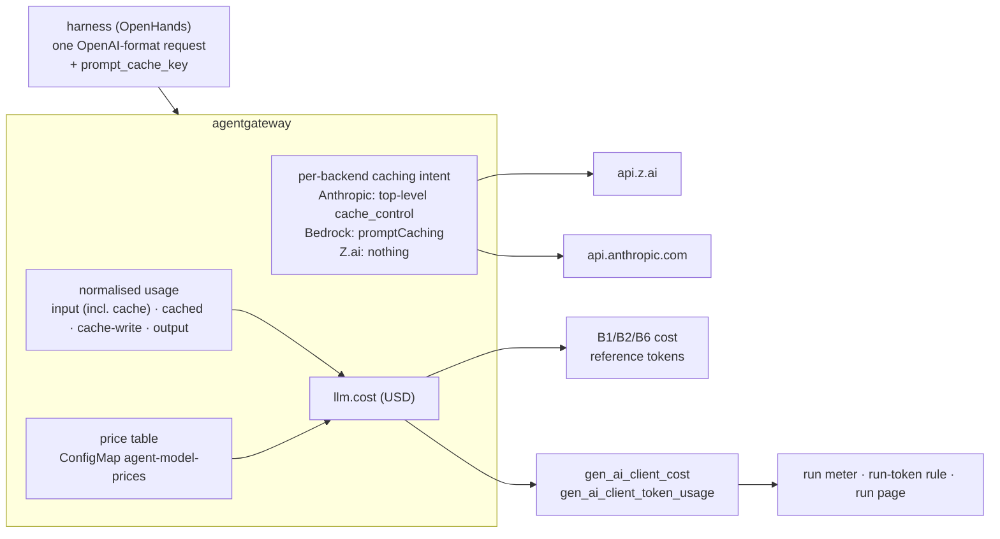
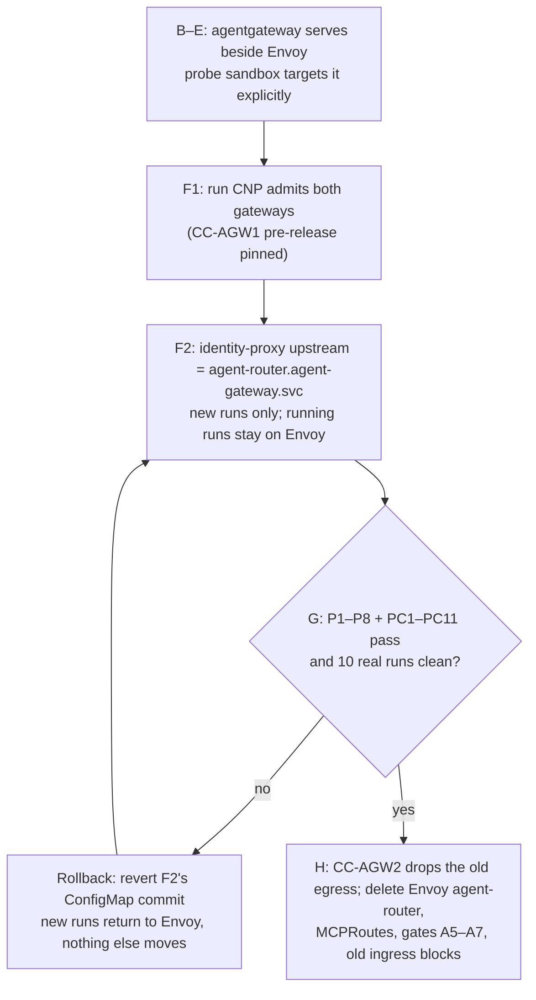

# Design: the agent router on agentgateway

**Date**: 2026-10-01 · **Status**: Proposed · **Owner decision**: 2026-10-01, after the PoC ·
**ADRs**: [ADR-0053](../../../website/content/docs/decisions/0053-agent-router-on-agentgateway.md) (gateway), [ADR-0054](../../../website/content/docs/decisions/0054-agent-model-providers-anthropic-direct.md) (providers) ·
**Plan**: [2026-10-01-agent-router-agentgateway-plan.md](../plans/2026-10-01-agent-router-agentgateway-plan.md)

**The agent router moves to agentgateway v1.5.x: one Gateway, still named `agent-router`, of class
`agentgateway`, in a new namespace `agent-gateway`, serving the same three listeners with the same
audiences.** It runs beside the Envoy agent-router until verified. Cutover is one FQDN switch in the
identity-proxy, made safe by a run CNP that admits both gateways for the duration. `ai-gateway`
(humans, Semantic Router, GPU fleet) stays on Envoy Gateway and Agent Router. `public` keeps Z.ai;
`internal` calls the Anthropic API directly, the same on both clouds (ADR-0054).

Evidence this design argues from:
[gap matrix and PoC result](2026-10-01-agentgateway-gap-matrix-research.md#poc-result-2026-10-01-gcp-0)
(G1–G5, P1–P8, N1–N11), the [ecosystem re-check](2026-10-01-agent-ecosystem-recheck-research.md),
ADR-0042 and ADR-0050, the agent-router as built on `integration/agent-factory`, and the AgentRun
composition on `Smana/crossplane-configuration@chore/room-bridge-v0.4.0`.

## Goal and non-goals

| Goal | Proof |
|---|---|
| Every agent call (LLM, MCP, token exchange) crosses agentgateway, with ADR-0042's boundaries intact or stronger | Live gates P1–P8 and parity checks PC1–PC11 on gcp-0 |
| The class boundary gains the `sub` prefix check Envoy Gateway could not express | P1: a correct-audience token from another namespace gets 403 |
| B1–B2 budgets count in shadow on our own rate-limit server | PC6 |
| Dashboards and alerts keep working across the switch | PC8 |
| `internal` runs reach Claude through the Anthropic API on both clouds, never Z.ai | PC12 on gcp-0 |
| aws-0 renders and deploys the same shape; nothing on the default path is cloud-specific | `validate-manifests.sh` renders both clouds |
| The Envoy agent-router, its MCPRoutes and its gates are deleted once verified | Phase H; `kubectl get gateway -A` shows no `envoy-ai-gateway` Gateway in `agent-system` |
| Every default provider caches prompts, and budgets, the run meter and the run page count cached input at its real price, with no provider-specific code in the harness | SC-14–SC-17 ([Prompt caching](#prompt-caching)) |

**Non-goals**: moving `ai-gateway` (G5 stays UNVERIFIED and out of scope); budget enforcement (SP4
PR 7); the optional OpenRouter, Bedrock and Vertex backends (documented, off by default); A2A; agentgateway's cost metric replacing
`ai-gateway`'s price rules (for agent traffic it does, from phase J: D10).

## Target topology

**Rulings behind the shape** (each a default this design takes; the cost column is what changes if
it proves wrong):

| # | Ruling | Why | Cost if wrong |
|---|---|---|---|
| D1 | Gateway **`agent-router`** in a **new namespace `agent-gateway`**; routes, backends and Secrets stay in `agent-system`; listeners admit routes from `agent-system` only (`allowedRoutes.namespaces.from: Selector`) | The name survives (dashboards, docs, Kyverno audiences), yet cannot collide with the Envoy Gateway object of the same name in `agent-system` during run-beside. agentgateway runs proxies in the Gateway's namespace, so `rbac.gatewayNamespaces: [agent-gateway]` confines the controller's writes to a namespace that holds no foreign Secret | Cross-namespace attachment is standard Gateway API and agentgateway passes the HTTP conformance profile, but the PoC used `from: Same`. Plan Task C.5 proves it live; the fallback is `agent-system` with a temporary name |
| D2 | Audiences, issuer, ports and listener names **unchanged** | One token works on both gateways, which is what makes the switch a config change and the rollback a revert | — |
| D3 | Pin agentgateway **v1.5.0** by tag and digest; take a new minor only at its first patch release, after reading its breaking changes | v1alpha1 with monthly breaking minors (1.5.0 changed token counting, JWT `iss`/`aud` enforcement and policy merge) | Slower access to fixes; an advisory overrides the rule |
| D4 | **Own KVStore** `xplane-agent-ratelimit` in `agent-gateway`, password from an ESO `Password` generator | The `ai-gateway` store's password lives in `envoy-gateway-system`; reading it from here needs a cross-namespace secret path. B1–B2 never share a bucket with B3–B5 | One more nano Valkey (spot) |
| D5 | Metric names **relabelled at scrape** to the existing `gen_ai_*` contract | `ai-gateway` keeps emitting Agent Router's names, and the agent dashboards, alerts and SP3's run meter query `gen_ai_client_token_usage_sum{ar_agent}`. One contract across both gateways beats two | Hides the source; a guard rule catches a silent rename (G2) |
| D6 | MCP targets keep **today's backend names**, with `prefixMode: Always` | Tools read `<target>_<tool>` (`room-broker_room_post`), close to today's `room-broker__room_post`. `Never` is impossible: `documentation` exists on two targets, and target names cannot contain `_` | One rename across the bridge classifier, two tests and the runbooks (N5) |
| D7 | `/v1/models` keeps **today's answer**, a 404 JSON body | That is what agent-router serves now (`httproutefilter-agent-models-list.yaml`), and every harness works with it. The PoC report's "static list" is wrong | — |
| D8 | Phase C keeps the **PoC's fixed backend model** (`glm-5.3`); model-name routing (`AgentgatewayModel`) is decided in phase I, where tiers need it | Today only `agent-default` exists. A fixed model means no request can pick another provider model | Unknown names get `glm-5.3` instead of today's 404, until phase I |

## Component mapping

| Today (Envoy) | File on integration | agentgateway | Lives in |
|---|---|---|---|
| `Gateway agent-router`, class `envoy-ai-gateway` | `infrastructure/base/agent-router/gateway.yaml` | `Gateway agent-router`, class `agentgateway`, same 3 listeners | `agent-gateway` |
| `EnvoyProxy agent-router-proxy` (ClusterIP, PDB, spread, PSS, access log, tracing) | `envoyproxy.yaml` | `AgentgatewayParameters agent-router` (G3 overlay, `shutdown`, digest-pinned image) + Gateway-level telemetry `AgentgatewayPolicy` | `agent-gateway` |
| `ClientTrafficPolicy` (early strip, 8Mi buffer) | `clienttrafficpolicy.yaml` | Gateway-level `PreRouting` `transformation.request.remove`; `frontend.http.maxBufferSize: 8Mi` | `agent-gateway` |
| 3 `SecurityPolicy` (JWT per listener, `claimToHeaders`) | `securitypolicy-{public,internal,sts}.yaml` | 3 listener-scoped `AgentgatewayPolicy`: `jwtAuthentication` + `authorization: Require jwt.sub.startsWith(...)` + `transformation.set x-ar-agent`; `preserveToken: true` on `sts` only | `agent-gateway` |
| `Backend` + `BackendTLSPolicy` + `AIServiceBackend` + `BackendSecurityPolicy` (Z.ai) | `backend-zai.yaml` | `AgentgatewayBackend zai` (openai provider, `api.z.ai`, `/api/paas/v4`, key by `secretRef`) | `agent-system` |
| `AIGatewayRoute agent-models` | `aigatewayroute-agent-models.yaml` | `HTTPRoute agent-models` (`/v1`, `/anthropic`) → `zai` | `agent-system` |
| `HTTPRoute` + `HTTPRouteFilter` `/v1/models` guard | `httproute-agent-models-list.yaml`, `httproutefilter-…` | `HTTPRoute agent-models-list` (Exact `/v1/models`) + route `AgentgatewayPolicy` `traffic.directResponse` 404 | `agent-system` |
| `ExternalSecret agents-zai-api-key` | `externalsecret-zai.yaml` | unchanged | `agent-system` |
| 2 `MCPRoute` (618 lines, 24+ rule blocks, `oauth` copied by hand) | `infrastructure/base/agent-mcp/mcproutes.yaml` | `AgentgatewayBackend agent-mcp` (4 targets) + `HTTPRoute agent-mcp-{public,internal}` + 2 route `AgentgatewayPolicy` (`backend.mcp.authorization`) | `agent-system` |
| octo-sts `HTTPRoute` on `sts` | `security/base/octo-sts/httproute.yaml` | same route, second `parentRef` during run-beside, the only one after H | `agent-system` |
| `CNP agent-router-data-plane` | `envoy-gateway-system` | `CNP agent-router-data-plane` on `gateway.networking.k8s.io/gateway-name: agent-router` | `agent-gateway` |
| Envoy Gateway's RLS (planned B1–B2 `BackendTrafficPolicy`) | SP4 PR 2 Task 13 | Gateway-level `rateLimit.global` + **our** `agent-ratelimit` Deployment and ConfigMap | `agent-gateway` |
| `VMPodScrape envoy-ai-gateway-genai` (extproc `:1064`) | `infrastructure/base/envoy-ai-gateway/vmscrape.yaml` | `VMPodScrape agent-router` on `:15020` with `metricRelabelConfigs` | `agent-gateway` |
| `ReferenceGrant agent-router-traces` (from `EnvoyProxy`) | `observability/base/agent-platform/` | same grant, from `AgentgatewayPolicy` in `agent-gateway` (enforced by agentgateway) | `observability` |
| Controller | Envoy Gateway + Agent Router (shared with `ai-gateway`) | `agentgateway` + `agentgateway-crds` HelmReleases | `agentgateway-system` |
| — (internal had no model) | — | `AgentgatewayBackend anthropic` + ExternalSecret `agents-anthropic-api-key` + internal routes (phase I) | `agent-system` |
| Price rules `llm_gateway:price_usd_per_mtoken` (input and output only), joined in PromQL by the run page | `infrastructure/base/llm-gateway/vmrule-llm-gateway.yaml` | ConfigMap `agent-model-prices` behind `AgentgatewayParameters.spec.modelCatalog`; the gateway prices each request (phase J, D10) | `agent-gateway` |

## Providers and keys (ADR-0054)

**`public` → Z.ai, `internal` → the Anthropic API directly, the same on both clouds.** OpenRouter is an
optional `public` backend, off by default. Bedrock and Vertex are optional per-cloud backends for
teams whose data must stay in their cloud account; nothing depends on them.

| Backend | Listener | agentgateway provider (v1.5.0 CRD field) | Key | Egress | Default |
|---|---|---|---|---|---|
| `zai` | `public` | `AgentgatewayBackend.spec.ai.provider.openai`, host `api.z.ai`, `pathPrefix: /api/paas/v4` | OpenBao `agents` mount, secret `zai`, field `api_key` → Secret `agents-zai-api-key` | `api.z.ai:443` | on |
| `anthropic` | `internal` | `AgentgatewayBackend.spec.ai.provider.anthropic` (`model` override optional; host defaults to the provider's) | OpenBao `agents` mount, secret `anthropic`, field `api_key` → ExternalSecret/Secret `agents-anthropic-api-key` (key `apiKey`), injected as `x-api-key` | `api.anthropic.com:443` | on |
| `openrouter` | `public` only | `spec.ai.provider.openai`, host `openrouter.ai`, `pathPrefix: /api/v1` | OpenBao `agents` mount, secret `openrouter`, field `api_key` → Secret `agents-openrouter-api-key` | `openrouter.ai:443` | **off** |
| `bedrock`, `vertexai` | `internal` | `spec.ai.provider.{bedrock,vertexai}`, keyless (EKS Pod Identity / Workload Identity) | none | per cloud | **off**, per team |

- **Keys never reach a run.** The `agents-secrets` store already reads `agents/data/*`, so no OpenBao
  policy changes; the gateway reads each Secret by reference and injects it; runs hold only their
  gateway token. The Anthropic key goes in `x-api-key` (`policies.auth.location.header`), because
  agentgateway's default location is `Authorization: Bearer`.
- **Internal model map** (same IDs on both clouds): `tier-light` → `claude-haiku-4-5`,
  `tier-standard` → `claude-sonnet-5-5`, `tier-frontier` and `agent-default` → `claude-opus-5-5`.
- **OpenRouter is never internal**: a second data processor, and we do not control which upstream
  serves a request. Gate AG5 extends to it: the `openrouter` backend may attach to `public` only.
- **Data terms**: standard Anthropic commercial API terms (API data not used for training); zero
  data retention is an option, not a precondition (ADR-0054).

**Budgets per provider.** B1 (per run, 5M tokens/day) and B2 (fleet, 40M/day) count every provider
together. A provider's tokens cost very differently (Opus at $4/$20 per MTok, GLM at $1.40/$4.40),
so each paid provider also gets a fleet bucket, in shadow until SP4 PR 7:

| Rule | Bucket | Limit/day | Mechanism |
|---|---|---|---|
| B6 | Anthropic, all runs | 10 000 000 tokens; 33 000 000 reference tokens from phase J (the same ≈ $56/day, D11) | descriptor `provider` = `"anthropic"` on a policy scoped to the `internal` listener (Anthropic is its only default backend) |
| B7 | OpenRouter, all runs (only when enabled) | 5 000 000 tokens | descriptor `provider` = `"openrouter"`; plus a credit limit on the OpenRouter key itself |

Whether a listener-scoped `rateLimit` merges with the Gateway-level B1–B2 policy or replaces it is
UNVERIFIED (the gap matrix flagged rate-limit merge across levels). Plan Task I.4 proves it live; if
it replaces, B6 moves into the Gateway-level policy keyed on a provider CEL value, and AG8 allows
exactly that one entry. A spend limit on the Anthropic workspace that owns the key is the backstop
either way.

## How each gap closes

| Gap | Closure | Proved by |
|---|---|---|
| **G1** budgets | `envoyproxy/ratelimit` (the image Envoy Gateway runs, digest-pinned) in `agent-gateway`, store = D4's KVStore, `REDIS_AUTH` from its Secret. Domain `agent-router`. Descriptors: **B1** key `agent` = CEL `jwt.sub`, 5 000 000/day; **B2** key `fleet` = CEL `"agents"`, 40 000 000/day; both `shadow_mode: true` until SP4 PR 7. `unit: Tokens` (cost = total tokens after completion, reference tokens from phase J (D11); a zero-cost check runs before). `failureMode: FailOpen`. One Gateway-level policy, no route-identifying entry, so buckets are shared across listeners. Per-provider buckets B6 (Anthropic) and B7 (OpenRouter): see Providers and keys | P6 (PoC) + PC6 on the KVStore; SC-13 |
| **G2** metrics | Scrape relabel: `agentgateway_gen_ai_(.+)` → `gen_ai_$1`; `gen_ai_server_request_duration_(bucket\|sum\|count)` → `gen_ai_server_request_duration_seconds_$1` once Task E.1 confirms the unit is seconds. No `error_type` exists: the run page's error ratio and the unauthorized-burst alert move to `agentgateway_requests_total` (`status`, `reason` labels). Guard alert `AgentRouterMetricContractBroken` fires when LLM requests flow but no `gen_ai_client_token_usage_sum{namespace="agent-gateway"}` series exists | PC8 |
| **G3** PSS | `AgentgatewayParameters.spec`: `deployment` overlay (`seccompProfile: RuntimeDefault` on pod and container, liveness on `:15021/healthz/ready`, 2 replicas, zone and host spread), `resources` 100m/128Mi → 1/512Mi, `service.spec.type: ClusterIP`, `podDisruptionBudget.minAvailable: 1`, image by digest | Gate AG9; `kubectl get svc -n agent-gateway agent-router` type ClusterIP |
| **G4** topology | Every selector on `gateway.envoyproxy.io/owning-gateway-*` in `envoy-gateway-system` gains, then is replaced by, `io.kubernetes.pod.namespace: agent-gateway` + `gateway.networking.k8s.io/gateway-name: agent-router`. In this repo: identity-proxy upstreams, the data-plane CNP, ingress CNPs of the 3 MCP servers, room-broker, octo-sts and the trace collector, the probe CNP, dashboards' LogsQL and the logs VMRule. In crossplane-configuration: `_ROUTER_FQDN` and the run CNP egress selector (two releases: dual, then new-only). The namespace pin keeps F1's guarantee: a tenant Gateway named `agent-router` elsewhere never matches | PC1; Hubble shows the run pod → `agent-gateway` FORWARDED |
| **N1** drain | `AgentgatewayParameters.spec.shutdown: {min: 120, max: 660}`, proven by the PoC to hold a 200 s stream through both replicas' deletion. 660 = the 600 s request timeout plus 60 s. Whether `max` alone suffices is one experiment in phase G (`min: 10`); if the stream survives a rollout twice, phase H lowers `min` to 10, else 120 stays | PC7 |
| **N2** cut streams | Mostly closed by N1: rollouts and drains no longer cut streams. Residual, recorded in ADR-0053: a client abort or a proxy crash spends tokens no bucket sees. Envoy Gateway writes the cost at end of stream too, so this is likely parity, not a regression. SP3's run meter and the spend alerts read the same counters and share the blind spot; Z.ai-side spend on the agents' own key is the backstop | PC7 checks a completed stream is charged exactly |
| **N3** `/v1/models` | Exact-path route per LLM listener, `traffic.directResponse` 404 `{"error":"model listing is not served on agent-router"}` (D7). JWT runs before it: no token → 401 | P8 + PC5; gate AG7 |
| **N5** tool names | `<target>_<tool>` with today's target names (D6). Update: the room-bridge classifier in `Smana/agent-platform` (`internal/bridge/classify.go` splits on `__`; it learns `<server>_<tool>` and keeps `__` during the overlap), `scripts/ci/tests/test-agent-mcp-scope.sh`, `scripts/ops/k8s/agent-probe-mcp.sh`, runbook 06. Harness prompts need nothing: the composition's room rules and the bridge's brief name tools bare (`room_read`), which matches neither form today either | PC4, PC11 |
| **N7** Allow is OR | Each `Allow` expression is one complete alternative: a role term (`"<aud>" in jwt.aud`) **and** an item term (`mcp.tool.target == …` plus `mcp.tool.name in [...]`); no top-level `\|\|`. Conjunctions across expressions use `Require`. The gate parses the canonical shape and recomputes the per-role tool sets | Gate AG6 + the rewritten scope test |
| **N10** CI | `gen-catalog.sh` renders `agentgateway-crds` from the pinned OCIRepository into `.schemas/agentgateway.dev/` and fails if the 4 schemas are missing. A new gate `assert-agent-gateway.py` (AG1–AG9 below) fails on zero agentgateway objects. `assert-ai-gateway.py` keeps A1–A4 for `ai-gateway`; A5–A7 retire with the Envoy agent-router in phase H | Phase A tests; a bogus field yields `Invalid: 1` against the local catalog |

The smaller PoC gaps: N4 (8 MiB buffer, kept), N6 (a denied MCP item answers `Unknown tool`: runbook
06 says so), N8 (`gen_ai_request_model` is the upstream model, which is what the price join keys on),
N9 (the controller creates GatewayClass `agentgateway`; not declared in Git, removal runbook deletes
it), N11 (access logs have no `msg`: LogsQL selects by pod labels and `log.*` fields).

### The rewritten gate

`scripts/ci/flux-schema/assert-agent-gateway.py`, scoped to Gateways of class `agentgateway`:

| # | Fails the build when |
|---|---|
| AG1 | No Gateway `agent-gateway/agent-router` of class `agentgateway`, or its listeners differ from `public:8080`, `internal:8081`, `sts:8082`, or a listener admits routes from outside `agent-system` |
| AG2 | A listener lacks exactly one listener-scoped `jwtAuthentication` (mode `Strict`) whose audiences equal its class set, or lacks `authorization: Require` on `jwt.sub.startsWith("system:serviceaccount:agents:")` |
| AG3 | No Gateway-scoped `PreRouting` removal of `x-ar-agent`, `x-ar-human`, `x-ai-gateway-client-id`, `agent-session-id`, or a listener does not `set` `x-ar-agent` from `jwt.sub` |
| AG4 | `preserveToken: true` appears anywhere but the `sts` listener (or is missing there), or an MCP target's credential lands in `Authorization` |
| AG5 | A route on `agent-router` omits `sectionName`, the `zai` or `openrouter` backend is reachable from a non-`public` listener, or a route-level policy carries `jwtAuthentication` |
| AG6 | An MCP `Allow` expression is not one complete alternative (N7), or grants another class's audience. `test-agent-mcp-scope.sh` recomputes the per-role tool sets from the same grammar and compares them with its expectations |
| AG7 | An LLM listener has no Exact `/v1/models` direct response |
| AG8 | A `rateLimit.global` lacks `unit: Tokens` or `failureMode: FailOpen`, names a route or backend in a descriptor, or its domain's ConfigMap lacks a matching descriptor with `shadow_mode: true` |
| AG9 | The Gateway's `AgentgatewayParameters` lacks seccomp, a liveness probe, a memory limit, `ClusterIP`, 2 replicas, a PDB, or `shutdown.max >= 660` |

## Prompt caching

**Caching is the gateway's job, and so is its accounting.** The harness sends one OpenAI-format
request whatever the provider. agentgateway adds the provider's caching mechanism where one is
needed, normalises every provider's cached-token fields into one usage model, and prices each request
from one table. Budgets, the run meter and the dashboards read only those normalised numbers. Plan
phase J builds it; nothing changes before phase I has landed the Anthropic backend.

Sources, pinned: `AGW` = `agentgateway/agentgateway@fe6732474a96` (v1.5.0); `OH` =
`OpenHands/software-agent-sdk@fcc102a697` (v1.49.6, the harness pin in
`container-images/agent-harness/requirements.in`); `AR` = `theagentrouter/agent-router@c217da8a`
(v1.1.0); this repo at `24f05fab` (`integration/agent-factory`).

### How tokens are counted

| | Today (Envoy agent-router, Agent Router v1.1.0) | After phase D–E as planned | After phase J |
|---|---|---|---|
| Budget charge | No agent budget is wired: `agent-models` declares no `llmRequestCosts` (`infrastructure/base/agent-router/aigatewayroute-agent-models.yaml`); `ai-gateway` charges `TotalToken` (`infrastructure/base/llm-gateway/aigatewayroute.yaml#L12-L16`). `CachedInputToken`, `CacheCreationInputToken` and `CEL` exist but are unused (`AR api/v1beta1/shared_types.go#L146-L161`) | `unit: Tokens`, cost defaults to `llm.totalTokens` (`AGW crates/agentgateway/src/http/remoteratelimit.rs#L83-L88`), cache-inclusive input + output | `cost` = request price ÷ REF (D11) |
| Run meter | `meter.query` sums `gen_ai_token_type=~"input\|output"` raw (`cloud-native-ref@ceeb6a0f tooling/base/agent-factory/helm-values-configmap.yaml#L47-L50`; `Smana/agent-platform@ddb06e02 internal/factory/meter/vm.go#L29-L31`) | unchanged | the same reference-token expression as the budgets |
| Run page cost | tokens × `llm_gateway:price_usd_per_mtoken`, which has input and output rows only: "budgets assume no cache discount" (`infrastructure/base/llm-gateway/vmrule-llm-gateway.yaml#L10-L14`) | unchanged | `gen_ai_client_cost`, priced by the gateway |
| What `input` holds | prompt tokens, cached included (`AR internal/translator/openai_openai.go#L165-L169`) | cache reads and writes included for every provider (`AGW crates/agentgateway/src/cel/types.rs#L1480-L1488`, normalised per wire format in `crates/agentgateway/src/llm/mod.rs#L234-L256`) | unchanged |
| Cached tokens visible | `gen_ai_token_type="cached_input"`, `"cache_creation_input"` (`AR internal/metrics/genai.go#L52-L61`) | `input_cache_read`, `input_cache_write` (`AGW crates/agentgateway/src/telemetry/log.rs#L860-L899`); access-log and span fields `gen_ai.usage.cache_read.input_tokens`, `gen_ai.usage.cache_creation.input_tokens` (`log.rs#L1637-L1651`) | relabelled to Agent Router's names (D9) |

Every row of the first two columns overcounts a cached run: a cached GLM-5.3 input token costs $0.26
against $1.40 ([Z.ai pricing](https://docs.z.ai/guides/overview/pricing)), yet counts as a full token
towards `maxTokens` and is priced at $1.40 on the run page.

### Rulings

| # | Ruling | Why | Cost if wrong |
|---|---|---|---|
| D9 | **One usage model, at the gateway.** agentgateway's normalised `input` (cache reads and writes included), `output`, `input_cache_read` and `input_cache_write` are the only token numbers anything reads; the scrape relabels the last two to `cached_input` and `cache_creation_input` | Both gateways then share D5's contract, and `input` already means the same on both. Consumers never see a provider's field (`prompt_tokens_details.cached_tokens`, `cache_read_input_tokens`, Bedrock's `cacheReadInputTokens`), which agentgateway maps for them (`AGW crates/llm/src/lib.rs#L270-L297`, `#L343-L360`) | `AGENTGATEWAY_LEGACY_LLM_USAGE_TOKEN_SEMANTICS=true` reverts to provider-reported input (`cel/types.rs#L1729-L1732`); we never set it |
| D10 | **One price table.** ConfigMap `agent-model-prices` (`catalog.json`, USD per million tokens: `input`, `output`, `cacheRead`, `cacheWrite`), referenced by `AgentgatewayParameters.spec.modelCatalog`. Rows are keyed by agentgateway's provider name, so Z.ai sits under `openai`. Adding a provider or a model is a row; gate AG10 fails a pinned model without one | The gateway is the only place that holds both per-request usage and prices, so it prices once (`llm.cost`, metric `gen_ai_client_cost`; `AGW crates/agentgateway/src/telemetry/metrics.rs#L387-L393`, `schema/config.md#L11-L24`) and a missing cache rate falls back to the input rate, never to zero (`crates/agentgateway/src/llm/catalog/mod.rs#L669-L718`). `ai-gateway` keeps its VMRule rows | A model the catalog misses is unpriced: `AgentModelUnpriced` fires and budgets fall back to raw tokens (D11) |
| D11 | **Budgets count money, in reference tokens.** Each request costs `llm.cost.total ÷ REF`, REF = $1.70 per million tokens, and `llm.totalTokens` when unpriced. The same expression is the `cost` of every token descriptor (B1, B2, B6, B7), the run-token recording rule and the run meter's query | SP4 §6 already converts B1's 5M tokens to $8.5 at that rate (GLM, 90 % input), so every cap keeps its number and its dollar meaning, while cached input charges its real price on any provider. A run that is mostly cache reads is no longer revoked early. REF is a unit, not a price: no price change ever moves it | Output and Opus tokens weigh more than one unit (a GLM output token 2.6, an uncached Opus input token 2.35), which is their real cost. Removing `cost` restores raw tokens; ADR-0050 records the unit |
| D12 | **Caching intent is per backend, in config.** Implicit providers (Z.ai) get nothing. The `anthropic` backend sets a top-level `cache_control: {type: ephemeral}` after translation, through `spec.policies.ai.finalTransformations`, which is Anthropic's automatic caching. Bedrock, if enabled, uses `promptCaching`. The harness sends no provider-specific field | agentgateway's OpenAI-to-Anthropic translation drops an Anthropic-style `cache_control` from an OpenAI-format body: it maps only OpenAI's `prompt_cache_breakpoint`, and never on tools or tool results (`AGW crates/llm/src/conversion/messages.rs#L96-L102`, `#L259-L264`). So OpenHands' own markers (`OH openhands-sdk/openhands/sdk/llm/message.py#L200-L201`), even forced with `capability_overrides={"supports_prompt_cache": True}` (`llm.py#L430-L440`; Claude names only in `utils/model_features.py#L123-L151`), would not survive the `/v1` path. `finalTransformations` runs after the body is rendered in the provider's format (`AGW crates/agentgateway/src/llm/mod.rs#L2082-L2095`). `promptCaching` is Bedrock-only (CRD `agentgateway.dev_agentgatewaypolicies.yaml#L253-L293`). Automatic caching exists on every Claude platform ([prompt caching](https://platform.claude.com/docs/en/build-with-claude/prompt-caching)) | **UNVERIFIED live** until plan Task J.7 Step 3. Fallback, Task J.9: harness `capability_overrides` plus the Messages path `/anthropic`, whose body agentgateway forwards with unknown keys kept (`crates/llm/src/types/messages.rs#L14-L30`, `llm/mod.rs#L405-L416`), switched by the route's provider in config, never by the run class in code |
| D13 | **5-minute TTL**, never 1 hour | Agent calls are seconds apart and a read refreshes the timer; the 1-hour write costs 2× instead of 1.25×, and the table carries one `cacheWrite` rate | A tool call longer than 5 minutes costs one re-write at 1.25×; J.8 measures how often |

### What cannot be provider-agnostic

These differences live in the price table and the backend rows, nowhere else:

| Provider (backend) | Caching | Who applies it | Read price | Write premium | TTL | Minimum prefix | Usage fields agentgateway maps |
|---|---|---|---|---|---|---|---|
| Z.ai `glm-5.3` (`zai`, `openai` provider) | implicit | nobody | $0.26 vs $1.40 | none (storage "limited-time free") | unpublished | unpublished | `usage.prompt_tokens_details.cached_tokens` |
| Anthropic `claude-opus-5-5` / `claude-sonnet-5-5` / `claude-haiku-4-5` (`anthropic`) | on request | gateway, `finalTransformations` | $0.20 / $0.20 / $0.10 (0.05×, 0.1×, 0.1×) | 1.25× for 5 minutes ($5.00 / $2.50 / $1.25), 2× for 1 hour | 5 minutes, refreshed on read | 512 / 512 / 4 096 tokens | `cache_read_input_tokens`, `cache_creation_input_tokens`; `input_tokens` is the uncached remainder |
| Bedrock (optional) | on request | gateway, `promptCaching` | per Bedrock pricing | yes | as Anthropic | as Anthropic | Converse `cacheReadInputTokens`, `cacheWriteInputTokens` |

Sources: [Z.ai caching](https://docs.z.ai/guides/capabilities/cache) (implicit, no parameter; its "about
50 %" discount is older than the [price table](https://docs.z.ai/guides/overview/pricing), which wins),
[Anthropic pricing](https://platform.claude.com/docs/en/about-claude/pricing) and
[prompt caching](https://platform.claude.com/docs/en/build-with-claude/prompt-caching), read
2026-10-04. Explicit-breakpoint providers charge a write and need the gateway to ask; implicit ones
cache on their own and charge nothing extra. A cached run on Anthropic is cheaper only after the
second call that reuses a prefix, which every agent run passes within its first steps.

### Prompt-prefix stability

A cache hit needs a byte-identical prefix. What OpenHands sends, at `OH`:

- **System prompt**: a static block, then a dynamic block whose sections run repo context, skills,
  our platform rules (`system_message_suffix_append` lands in `system_message_suffix`:
  `openhands-agent-server/openhands/agent_server/conversation_service.py#L129-L134`), secrets, and
  last the start time to the minute (`openhands-sdk/openhands/sdk/context/prompts/presets.py#L82-L91`).
  It is rendered once per conversation (`openhands-sdk/openhands/sdk/agent/agent.py#L523-L543`), so
  it is stable across steps and differs across runs only in its last line.
- **Tools**: fixed in the same event at conversation start; MCP tool order across runs is UNVERIFIED
  (J.6 Step 3).
- **Task**: the first user message, the rules beside it as the suffix
  (`container-images/agent-harness/agent_run.py#L150-L151`).
- **Neutral hint**: OpenHands sends `prompt_cache_key` = the conversation id on every call
  (`openhands-sdk/openhands/sdk/conversation/impl/local_conversation.py#L1602`,
  `llm/options/common.py#L76-L77`); it passes through to OpenAI-format providers untouched.
- **Condenser**: the default keeps the first 4 events and summarises the rest once the view passes
  80 (`openhands-sdk/openhands/sdk/context/condenser/llm_summarizing_condenser.py#L509-L517`). Each
  condensation keeps the cached head and misses on everything after it, which on Anthropic is one
  re-write at 1.25×; its summarising call is charged to the run like any other.

**Cross-run reuse is not a goal.** Through the `/v1` path agentgateway joins the system blocks into
one string (`AGW crates/llm/src/conversion/messages.rs#L318-L333`), and
that string ends with the run's start time, so only within-run hits are expected on Anthropic.
Within a run is where the volume is: every step re-sends the whole history.

## Both clouds

Bases are cloud-neutral; each cloud gets a render root (`infrastructure/{aws-0,gcp-0}/agent-gateway`,
`…/agentgateway`) and a Flux child in `clusters/{aws-0,gcp-0}-agent-platform/`. The only per-cloud
values are `${oidc_issuer_url}`, `${oidc_jwks_uri}` and `${oidc_jwks_host}`, which already exist. The
controller fetches the JWKS, so only its CNP needs the JWKS host; the proxies get the keyset over
xDS. The default providers (Z.ai, Anthropic) are the same on both clouds, so gcp-0 proves everything;
aws-0 is destroyed and CI renders it. Bedrock and Vertex, if a team enables one, live in a per-cloud overlay. `assert-cloud-shape.py`
learns the new overlay names so gcp-0's render stays GKE-shaped.

## Cutover and rollback

- **Why it is safe**: the identity-proxy ConfigMap is read at sandbox start, so a switch affects new
  runs only. Both gateways accept the same tokens (D2), and the run CNP admits both until H.
- **Rollback**: one revert of the ConfigMap commit, effective for the next run. The Envoy agent-router
  stays deployed and gated until H.
- **Exit criterion for H**: every live gate passes, 10 real AgentRuns (at least one per role,
  one room run) complete through agentgateway with no gateway-attributable failure, and the
  `internal` listener's served surface is proven by probe: PC2's per-role MCP tool set with an
  `.internal` token, and P1's 401 for it on `:8080`.
- **Why no internal run gates H**: H proves parity with what Envoy serves, and rollback to it.
  Envoy's `internal` listener has no model route today (its model routes attach to `public`
  only), so an internal model run is neither a parity item nor a rollback item: rolling back would
  return it to a gateway with no backend. MCP and the audience split are what `internal` serves,
  and the probe proves both. The first real `internal` run is phase I's gate (plan I.6 Step 3),
  after the Anthropic backend lands (I.2).

## Risks

| Risk | Live check |
|---|---|
| v1alpha1 breaking minors | `flux schema validate` against the pinned local catalog (`Invalid: 0`); a bump PR re-runs P1–P8 |
| We own the rate-limit server | Delete the `agent-ratelimit` pod mid-traffic: requests stay 200 (`FailOpen`); `AgentRateLimitDown` fires within 5 min |
| A third Gateway API controller | `kubectl get gatewayclass`: `agentgateway`, `envoy-ai-gateway`, `cilium` all `ACCEPTED=True` |
| Silent metric rename (G2) | `AgentRouterMetricContractBroken` stays inactive while a run makes model calls |
| Cut streams uncharged (N2) | PC7: during a proxy rollout a 200 s stream ends 200, and `total_hits` rises by its exact `total_tokens` |
| Tool rename breaks room approvals (N5) | PC11: a room run's `room_read` is classified read-only (no approval request in the room log) |
| Cross-namespace attachment or policy merge behaves differently than documented | Plan Task C.5: `HTTPRoute` status `Accepted=True` on all three listeners; a route-level policy does not displace the listener JWT (no-token request still 401) |
| `unit: Tokens` on non-LLM requests (MCP, sts) | PC6: MCP and sts calls stay 200 with zero hits added |
| MCP session key falls back to base64 | `kubectl get secret -n agent-gateway agent-router-session-key` exists |
| Controller reads Secrets cluster-wide | Accepted, same class as Envoy Gateway; writes confined (D1) |
| The Anthropic key leaks from its Secret | Only the `agents-secrets` store and the agentgateway controller read `agent-system` Secrets; `kubectl get secret -n agents` lists no provider key; rotation drill in plan Task I.6 (`bao kv put`, ExternalSecret refresh, next call 200) |
| A listener-scoped budget replaces B1–B2 instead of merging | Task I.4: after B6 lands, `total_hits{key1="agent"}` still rises on an `internal` call |
| OpenRouter enabled on `internal` by mistake | Gate AG5 fails the build |
| Dual egress window widens the run CNP | Bounded by namespace + label pins; gone after H (`grep -c envoy-gateway-system` in the rendered run CNP = 0) |
| A token descriptor's `cost` CEL fails to evaluate: agentgateway then skips the descriptor, silently (`AGW crates/agentgateway/src/http/remoteratelimit.rs#L85`) | Task J.7: `total_hits{key1="agent"}` rises by price ÷ REF; `AgentBudgetNotCounting` fires when tokens flow and B1 counts nothing |
| A provider answers with a model name the price table misses (a dated ID) | `AgentModelUnpriced` on `cost_catalog_lookups`; budgets fall back to raw tokens for that request |
| Anthropic ignores or rejects the gateway's top-level `cache_control` (D12) | Task J.7 Step 3, positive and negative control; fallback Task J.9 |

## Success criteria

| # | Criterion (each checked live on gcp-0) |
|---|---|
| SC-1 | A real implementer run's model calls are in `agent-gateway` proxy access logs with `log.x_ar_agent` = its sub, and none in Envoy's |
| SC-2 | P1: a correct-audience token minted outside `agents` gets 403 |
| SC-3 | A forged `x-ar-agent` reaches no backend; budgets and metrics carry the verified sub |
| SC-4 | Per role and listener, `tools/list` equals the expected `<target>_<tool>` set; `resources/read` and denied tools refused; no MCP server sees `Authorization`; room-broker receives `x-room-mcp-key` |
| SC-5 | A run obtains a GitHub token through `sts`; octo-sts receives the bearer; an `.public` token there gets 401 |
| SC-6 | Shadow counters for B1 and B2 rise by exact token totals on the KVStore; no 429 |
| SC-7 | A 200 s stream survives a proxy rollout and is charged |
| SC-8 | The run and fleet dashboards show tokens, latency, errors and gateway logs for a run that used agentgateway |
| SC-9 | A run's trace contains the gateway's server span with the run's parent, no `http.path` |
| SC-10 | Rollback drill: after the revert, the next run's calls appear in Envoy's logs |
| SC-11 | After H, no `envoy-ai-gateway` Gateway, MCPRoute or `owning-gateway-name: agent-router` selector remains (rendered bundle grep = 0) |
| SC-12 | An `internal` run on gcp-0 gets completions from `claude-opus-5-5` (`gen_ai_request_model`); Hubble shows its proxy flows to `api.anthropic.com` and none to `api.z.ai` for that request |
| SC-13 | B6's shadow counter rises by the Anthropic calls' exact token totals; B1–B2 rise too |
| SC-14 | An `internal` probe's second identical completion reads from cache (`cached_input` > 0) while the request carries no provider-specific field; with the backend's `finalTransformations` removed it reads nothing. A `public` probe's second completion reads from Z.ai's cache |
| SC-15 | B1, B2 and B6 rise by each request's gateway price ÷ REF (±1 per request), and a run's `agents.ogenki.io/usage-tokens` equals its run-token rule |
| SC-16 | A real run's page shows its cache-hit ratio, cached and uncached input, and the gateway's cost; `cost_catalog_lookups` shows only exact lookups for agent traffic |
| SC-17 | The rebuild measurement (plan Task J.8) reports cached tokens, cost and latency for the same task run twice on `public`, and on `internal` once its key exists. Evidence, not a threshold |

## Open questions for the owner

None blocking. The data-terms default (standard Anthropic commercial terms, zero data retention as an
option) is the owner's to revisit (ADR-0054), and so is D11's budget unit: reference tokens are the
default, and dropping the `cost` expression returns to raw tokens. Everything else is decided above
(D1–D13, N1, the providers table, the exit criterion for H).
