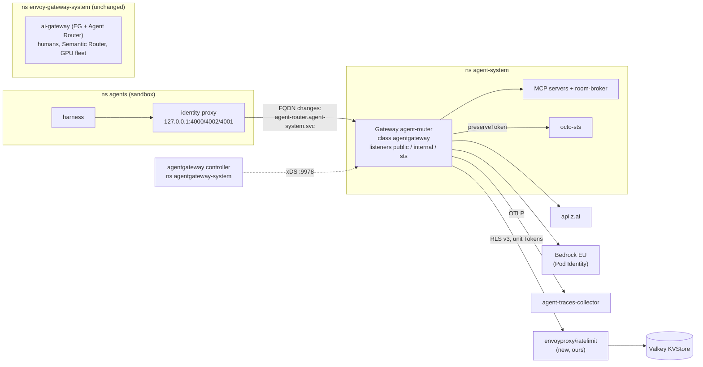

# Research: Could agentgateway replace the agent router, and what would it cost?

**Topic**: agentgateway-gap-matrix · **Conducted**: 2026-10-01 · **Researcher**: Claude (subagent)

Follows the [ecosystem re-check](2026-10-01-agent-ecosystem-recheck-research.md) of the same day,
which found MCP spec currency to be agentgateway's one real edge. This pass compares capabilities
line by line.

| Side | Read at |
|---|---|
| Ours | `integration/agent-factory` = `147819ff`: Agent Router (ex-Envoy AI Gateway) **1.1.0** on Envoy Gateway **1.9.2**. Paths are relative to that branch; most are not on `main`. ADR-0041 to ADR-0052 are programme ADRs (on the programme branches, not yet on main). A `cc:` prefix means `Smana/crossplane-configuration@main` |
| Theirs | `agentgateway/agentgateway` **v1.5.0** = `fe6732474a96` (latest GA, 2026-08-27). `POL`, `BE`, `MOD` = the `agentgatewaypolicies`, `agentgatewaybackends`, `agentgatewaymodels` CRDs under `controller/install/helm/agentgateway-crds/templates/`; `SRC` = `crates/agentgateway/src/` |

Status legend: **native** (a CRD field or behaviour at v1.5.0) · **via extension** (needs a
component we run) · **not supported** · **UNVERIFIED** (not proven from source or docs).

## PoC result (2026-10-01, gcp-0)

**GO, and agentgateway is selected for the agent router only.** agentgateway v1.5.0 ran beside
agent-router on gcp-0 (branch `feat/agentgateway-poc`, merged into `integration/agent-factory`);
agent-router was untouched throughout. The owner chose agentgateway for `agent-router` on
2026-10-01; `ai-gateway` stays on Envoy Gateway. An ADR superseding ADR-0042 Option 1 and ADR-0050
Option 1 for the agent router follows.

| Item | Result |
|---|---|
| Live checks | **P1–P8 all pass**, including the four gating ones (P1, P2, P4, P6). Caveats: P4's room-broker leg (`x-room-mcp-key`) was untested, though the same per-target header injection was proven on a probe target. P6 ran on a throwaway Valkey, not the KVStore, so `REDIS_AUTH` wiring is untested. P5 used a stdlib MCP client, not the OpenHands SDK |
| N1: drain cuts streams | The default drain (10 s min, 60 s max) cut in-flight streams about 18 s after SIGTERM, twice. `AgentgatewayParameters.shutdown: {min: 120, max: 660}` held a 200 s stream through both replicas' deletion. **Fix**: set the drain explicitly; one run with `min: 10, max: 660` settles whether `max` alone is enough |
| N2: cut streams uncharged | A stream cut before completion is never charged to the budget: the token cost is evaluated only at completion. **Fix**: mostly closed by N1; record the residual in the budgets ADR |
| N3: `/v1/models` | With a valid token, `GET /v1/models` returns 400: the AI backend parses every request as a completion. **Fix**: a `directResponse` policy on a `/v1/models` match, which now runs after JWT |
| N5: tool renames | Federation renames tools `<target>_<tool>` (`victoriametrics_documentation`) and resources `<target>+<uri>`. **Fix**: rename in the harness, its skills and the gates, or change `prefixMode` |
| N7: Allow is OR | The CRD text says `matchExpressions` "must all evaluate to true", but `Allow` expressions are OR-ed at runtime; `Require` is the AND. Writing AND intent as a list widens access. **Fix**: the rewritten gate enforces one alternative per expression and `Require` for conjunctions |
| N10: CI gate vacuous | `assert-ai-gateway.py` passes ("5 checks, 0 violations") without looking at agentgateway objects, and their schemas come from the hosted ecosystem catalog, not pinned to v1.5.0. **Fix**: render the CRDs from the pinned OCIRepository into the local catalog and rewrite the gate, including N7 |
| Proxy memory | 6–8 MiB per replica idle, against 69–84 MiB for agent-router's Envoy and ext_proc pods |
| Migration effort | About **2.5–3 weeks**, unchanged overall: the PoC moved effort between rows (drain behaviour +0.5 d, telemetry and gate rewrite up, install, identity and MCP down) |
| Decision | agentgateway for `agent-router` only (owner, 2026-10-01). `ai-gateway` stays on Envoy Gateway and Agent Router |

Smaller gaps from the same run, each 0–S: the 2 MiB default buffer capped a federated
`resources/list` (fixed at 8 MiB); a denied MCP item answers `Unknown tool` rather than a permission
error; `gen_ai_request_model` carries the upstream model, not the logical name; the controller
creates the `agentgateway` GatewayClass outside Flux; proxy access logs have no `msg` field.

## TL;DR

**No hard blocker.** Every requirement is met natively or through a workaround we control. Three
gaps cost real work, and four of the five classes our CI gates police disappear by construction,
provided the gate is rewritten for agentgateway kinds: the PoC found today's gate passes vacuously on
them (N10).

### What it lacks that we rely on

| # | Gap | Why it matters | Workaround | Size |
|---|---|---|---|---|
| G1 | **Budget limits and shadow mode are in no CRD.** The global rate limit is an Envoy RLS v3 client; limits live in the rate-limit server's ConfigMap, and that server is **not bundled** | ADR-0050 and the budget CI gates assume Envoy Gateway's `BackendTrafficPolicy.rateLimit.global.rules[].{shared,shadowMode,cost}` | Run `envoyproxy/ratelimit` ourselves on the existing Valkey KVStore. Its config has a per-descriptor `shadow_mode`; descriptors are CEL with `unit: Tokens` | **M**: one Deployment and ConfigMap we own; the budget gates check two objects |
| G2 | **Metric contract differs.** Names carry an `agentgateway_` prefix, `gen_ai_server_request_duration` has no `_seconds` suffix, and there is **no `error_type` label** (`SRC/telemetry/metrics.rs:395`, "TODO: add error attribute") | Every agent-observability dashboard and alert queries `gen_ai_client_token_usage_sum{ar_agent=…}`; the run dashboard uses `…_seconds_bucket` and `error_type` | Custom labels are native (`frontend.metrics.attributes.add[].expression`, e.g. `jwt.sub`). Rename with VMPodScrape `metricRelabelConfigs`; rebuild the error ratio from `agentgateway_requests_total{status=~"5.."}` | **S–M** |
| G3 | **Proxy pod defaults break the constitution**: no `seccompProfile`, no liveness probe, no memory limit, and a `LoadBalancer` Service | Restricted PSS and the probe rule. A LoadBalancer on GKE also breaks the ClusterIP-only contract | `AgentgatewayParameters.spec.{deployment,service,podDisruptionBudget}` are strategic-merge overlays | **S** |
| G4 | **Topology moves.** Proxies run in the **Gateway's** namespace with `gateway.networking.k8s.io/gateway-name` labels, not in `envoy-gateway-system` with `gateway.envoyproxy.io/owning-gateway-*` | The identity-proxy pins `agent-router.envoy-gateway-system.svc`; the data-plane CNP, the run dashboard's LogsQL selectors and the AgentRun composition's run CNP follow | Mechanical rename, but across **two repos**: a crossplane-configuration release, then a pin bump | **M** |
| G5 | **Semantic Router insertion order**, only if the human-facing `ai-gateway` ever moves. Ours is an `EnvoyPatchPolicy` at `http_filters[0]` | agentgateway has native `traffic.extProc` and a `PreRouting` phase; whether a PreRouting body rewrite feeds `AgentgatewayModel.match.model` is **UNVERIFIED** | Keep `ai-gateway` on Envoy Gateway (recommended) | n/a for the agent router |

Not gaps:
- **Bedrock and Vertex**: native providers; keyless credentials use the default AWS chain and GCP
  ADC (`SRC/http/auth/aws.rs:664`, `SRC/http/auth/gcp.rs:118-119`). EKS Pod Identity is
  **UNVERIFIED live**, but Agent Router has not proved it live either (SP4 PR 2 is unbuilt).
- **LoRA canary and InferencePool**: weighted `virtualModel` (`MOD` L5230), plus a Gateway API
  Inference Extension conformance report.
- **Coexistence**: its own GatewayClass and controller name `agentgateway.dev/agentgateway`.

### What it does better

Each item removes a class of bug rather than gating it.

1. **Authentication runs before everything else**: CORS → `jwt` → `ext_authz` → `authorization` →
   rate limit → `ext_proc` → `transformation` → `direct_response` (`SRC/proxy/httpproxy.rs:176-316`).
   The bug where ext_proc answered `/v1/models` before JWT validation (found live on the agent
   router, now guarded by a dedicated route) cannot occur.
2. **The validated JWT is removed by default** (`POL` `jwtAuthentication.preserveToken`, L9660).
   That inverts Envoy Gateway's always-forward, and the CI gate keeping run tokens away from MCP
   servers shrinks to "no `preserveToken` or passthrough outside the token-exchange listener".
3. **Claim-based authorization in CEL**: `jwt.sub.startsWith("system:serviceaccount:agents:")`
   works. `startsWith` is registered (`crates/cel-fork/cel/src/context.rs:90`) and the RBAC tests
   use `jwt.sub` (`SRC/mcp/rbac.rs:222`). This closes ADR-0042's stated con, "Envoy Gateway
   cannot prefix-match `sub`", and moves the
   [runtime-identity design](2026-09-23-agent-runtime-identity-design.md)'s **UNVERIFIED** on that
   point to **verified from source** (the PoC's P1 proves it live). Audiences cap at 64, against 8.
4. **MCP authorization covers `prompts` and `resources`**, not just tools (`SRC/mcp/rbac.rs:14,82-84`).
5. **MCP spec currency**: 2026-07-28 (stateless), with version intersection across federated
   targets ([spec-compat](https://agentgateway.dev/docs/kubernetes/latest/documentation/mcp/spec-compatibility/);
   tests at `SRC/mcp/mcp_tests.rs:882-1090`). Agent Router stops at 2025-06-18
   ([agent-router#1575](https://github.com/theagentrouter/agent-router/issues/1575)).
6. **Tracing can remove attributes** (`POL` `frontend.tracing.attributes.remove`, L7217) and
   exports OTLP over HTTP or gRPC. That closes ADR-0051's residual: Envoy Gateway cannot drop
   Envoy's default `http.url`/`user_agent` span tags.
7. **One listener policy serves both LLM and MCP paths.** Today an MCPRoute's `oauth` *replaces*
   the listener policy, so the two are kept equal by hand. Exact JWT merge across attachment levels
   is **UNVERIFIED**.
8. **Security record, 2026**: agentgateway has 4 advisories, all patched at or before v1.5.0.
   Agent Router has 7, published 2026-09-26/29. One, GHSA-76mr-h444-pcqq (MCP DoS), lists
   `vulnerable <=1.1.0, patched 1.1.0`, a self-contradictory range: **our pin 1.1.0 may be
   affected**.

### Recommendation

Replace **only the agent router** (the agent boundary: LLM, MCP and token exchange) after a
time-boxed PoC. Keep `ai-gateway` (humans, Semantic Router, GPU fleet) on Envoy Gateway and
Agent Router.

| Alternative | Why not |
|---|---|
| agentgateway beside us for MCP only | Two gateway products on one run's path; per-path upstreams on every identity-proxy port; every Envoy-Gateway-specific gate stays on the LLM side. It buys only items 4 and 5: the worst cost-to-gain ratio |
| Wait | SP4 PR 2 (Bedrock and budgets on the agent router) is unbuilt, so switching before it is the cheapest moment there will be. The programme merge hold means a PoC branch costs no merge churn |
| Replace both gateways | `ai-gateway` relies on the Semantic Router ordering (G5, UNVERIFIED) and on Agent Router's InferencePool wiring, which works today, for no gain at the agent boundary |

### The PoC

A Gateway `agent-router` of class `agentgateway` in `agent-system` with `public` and `internal`
listeners, ClusterIP and a PSS overlay, on a feature branch (`TF_VAR_flux_git_ref`). About 2–3
days. Pass or fail on eight live assertions:

| # | Assertion | Settles |
|---|---|---|
| P1 | A `.public` token gets 200 on `public`; a `.internal` token gets 401/403 there; a correct-audience token minted in another namespace gets 403 via `jwt.sub.startsWith(...)` | ADR-0042's core, item 3 |
| P2 | A forged `x-ar-agent` is overwritten; the access log and `agentgateway_gen_ai_client_token_usage{ar_agent=…}` show the verified `sub` | header spoofing, G2 |
| P3 | A streamed Z.ai completion lasting > 60 s survives (600 s timeout) | parity |
| P4 | Per role, `tools/list` is filtered and `resources/read` denied; an echo MCP server sees **no** `Authorization`; room-broker receives `x-room-mcp-key` | token isolation, item 4 |
| P5 | The OpenHands SDK (2025-06-18) completes a session across 2 replicas while one pod is deleted mid-session | HA, item 5 |
| P6 | `envoyproxy/ratelimit` on the KVStore with `unit: Tokens` and `shadow_mode: true`: shadow counters rise, no request gets a 429 | G1 |
| P7 | Spans reach `agent-traces-collector` joined to the run's traceparent, with `http.url` removed | item 6 |
| P8 | `GET /v1/models` with no token gets 401 | item 1 |

If P1, P2, P4 and P6 pass, write the ADR superseding ADR-0042 Option 1 and ADR-0050 Option 1 for
the agent router, then migrate.

## The matrix

Size: **0** none · **S** about a day · **M** 3–5 days · **L** more than a week, or a design change.

### Identity at the agent boundary (ADR-0042)

| Requirement | Ours | agentgateway | Evidence | Gap |
|---|---|---|---|---|
| Validate the projected SA token as a JWT offline (remote JWKS), per listener | One SecurityPolicy per class listener (`securitypolicy-{public,internal,sts}.yaml`, `gateway.yaml:14-32`) | **native** | `POL` `traffic.jwtAuthentication.providers[].{issuer,audiences,jwks.remote.url}`, `targetRefs[].sectionName` | 0 |
| A `sub` prefix gates access | **Not expressible in Envoy Gateway**; compensated by Kyverno audience reservation and a data-plane CNP | **native** (CEL), better | `POL` `traffic.authorization.policy.matchExpressions`; `startsWith` in `crates/cel-fork/cel/src/context.rs:90` | 0 (gain) |
| Nested `kubernetes.io` claim | Not addressable in Envoy Gateway | **native** (CEL map index), UNVERIFIED live | CEL over `jwt.*` | 0 (gain) |
| Per-run attribution `x_ar_agent` = verified `sub` | `claimToHeaders: sub→x-ar-agent`; access-log field `x_ar_agent` | **native** | `traffic.transformation.request.set[].value` is CEL, runs after jwt (`SRC/proxy/httpproxy.rs:31,267` vs `:192`); access log takes CEL fields | S |
| Strip caller identity headers before auth | `ClientTrafficPolicy.headers.earlyRequestHeaders.remove`, needed because Envoy Gateway's `claim_to_headers` **appends** | **native**: a Gateway-scoped `PreRouting` `transformation.request.remove`, and `set` replaces after jwt | `POL` `traffic.phase` (L9815) | S; the class mostly vanishes |
| Keep the run's token away from MCP servers | Relies on the MCP proxy re-originating calls; Envoy Gateway always forwards the JWT | **native**, better: stripped by default | `POL` `jwtAuthentication.preserveToken` (L9660) | 0 (gain) |
| Token-exchange listener forwards the bearer to octo-sts | Implicit (always forwarded) | **native**, opt-in `preserveToken: true` on that listener only | same | S |
| Audiences and providers per policy | 8 and 4 | 64 and 64 | `POL` `maxItems: 64` | 0 (gain) |
| No provider key in `agents` | In-pod Envoy identity-proxy | gateway-agnostic | — | 0 |

### CI gates (`scripts/ci/flux-schema/assert-ai-gateway.py`)

| Gate | Polices today | agentgateway equivalent | Gap |
|---|---|---|---|
| Shared buckets | Envoy Gateway's per-route bucket default | Buckets key on `domain` plus CEL descriptor entries, so they are shared unless an entry names the route. Gate becomes "no descriptor entry uses `route`/`backend`" | S |
| Cost in tokens | request cost 0, response from `llm_total_token` | `descriptors[].unit: Tokens`, cost defaults to total tokens (`SRC/http/remoteratelimit.rs:84`) | S |
| Shadow mode | `shadowMode: true` | **not in the CRD**: `shadow_mode` in the `envoyproxy/ratelimit` config | M (G1); the gate reads the RLS ConfigMap |
| Early header strip | see identity table | PreRouting `transformation.remove` | S |
| `mergeType` on route-level traffic policy | replace vs merge | `strategy.inheritance: Default/Override`; authorization always merges; rate-limit merge across levels **UNVERIFIED** | S, plus an open question |
| `sectionName` on agent-router routes | standard Gateway API | still needed; the SecurityPolicy half becomes "no route-level `jwtAuthentication` with `Override`" | S |
| No `Authorization` to MCP | see identity table | Invert: forbid `preserveToken`/passthrough except on the token-exchange listener. MCP target keys use `credentials[].location.header`, because `auth.key` **is** `Authorization` | S |
| `/v1/models` answered ahead of ext_proc | filter order | **Obsolete**: jwt precedes ext_proc (`SRC/proxy/httpproxy.rs:192` vs `:254`). Keep P8 as a live check | 0 (gain) |

### MCP (`infrastructure/base/agent-mcp/mcproutes.yaml`)

| Requirement | Ours | agentgateway | Evidence | Gap |
|---|---|---|---|---|
| Federate 4 servers on `/mcp`, one route per listener | `MCPRoute.backendRefs` | **native** | `BE` `spec.mcp.targets[].static.{host,port,path,protocol: StreamableHTTP}`, `prefixMode` | S |
| Static tool hiding | `toolSelector.include` | CEL only; `tools/list` filtered by the same rules | [tool-access](https://agentgateway.dev/docs/kubernetes/latest/documentation/mcp/tool-access/) | 0 |
| Per-role tool allowlist by caller, deny-default | `authorization.rules[].source.jwt.claims[aud]` (24 rule blocks) | **native**, far terser | `POL` `backend.mcp.authorization.policy.matchExpressions` with `mcp.tool.name` and `jwt.*` (`SRC/mcp/rbac.rs:222-242`) | S |
| Authorization on `resources/*`, `prompts/*` | **not available** | **native**, better | `SRC/mcp/rbac.rs:14,82-84` | 0 (gain) |
| Upstream API-key injection (room-broker `x-room-mcp-key`) | `securityPolicy.apiKey.header` | **native**, per target | `BE` `…policies.auth.credentials[].{location.header,secretRef}` | 0 |
| Identity to MCP backends (`x-ar-agent`) | `oauth.claimToHeaders` | **native** | `backend.transformation` with CEL `jwt.sub` | S |
| OAuth/JWT and RFC 9728 metadata | `oauth.{issuer,audiences,jwks,protectedResourceMetadata}` | **native** | `POL` `backend.mcp.authentication.*` | 0 |
| Sessions across 2 replicas | encrypted session IDs, seed from a Secret | **native** (AES-256-GCM `SESSION_KEY`, Secret generated per Gateway) | `SRC/http/sessionpersistence.rs:89-100`, `SRC/config.rs:349-361` (falls back to base64 when unset) | 0; prove with P5 |
| MCP spec version | 2025-06-18 only | 2026-07-28, 2025-11-25, 2025-06-18, negotiated | spec-compat | 0 (gain) |

### LLM routing

| Requirement | Ours | agentgateway | Evidence | Gap |
|---|---|---|---|---|
| Z.ai (OpenAI-compatible), provider credential held at the gateway, logical model name rewritten | `AIServiceBackend` with a `BackendSecurityPolicy` of type API key; the route rewrites the model name to `glm-5.3` | **native** | `BE` `ai.provider.openai.model`, `policies.ai.modelAliases`; `MOD` `match.model` | S |
| Anthropic-format input (`/anthropic`) | Agent Router translates (ADR-0046) | **native** (`Messages`); translation to Bedrock **UNVERIFIED** | `MOD` `custom.formats[].type` | S plus a test |
| Bedrock EU, keyless via EKS Pod Identity | planned (SP4 PR 2) | **native** provider, default AWS chain (Pod Identity **UNVERIFIED live**) | `BE` `ai.provider.bedrock.*`; `SRC/http/auth/aws.rs:664` | 0 (neither proven) |
| Vertex, keyless via Workload Identity | planned (ADR-0046) | **native**, ADC | `BE` `ai.provider.vertexai.*`; `SRC/http/auth/gcp.rs:118-119` | 0 |
| vLLM InferenceService routes, LoRA canary | composition renders a weighted AIGatewayRoute (`cc:apis/inferenceservice/composition-aws.yaml`) | **native** | `MOD` `virtualModel.weighted.targets[]` (L5230) | M **if** the fleet moves; not needed for the agent router |
| Gateway API Inference Extension | through Agent Router's extension server | **native** | GIE v1.5.0 in `go.mod`; [conformance reports](https://github.com/kubernetes-sigs/gateway-api-inference-extension/tree/main/conformance/reports/v1.4.0/gateway) | 0 (`ai-gateway` only) |
| 600 s timeout, 8 MiB body buffer | route and client traffic policy | **native** | `POL` `traffic.timeouts.request`, `traffic.buffer.request.maxBytes` | 0 |
| ext_proc (Semantic Router) | `EnvoyPatchPolicy` at index 0 | **native** `traffic.extProc`; ordering vs model match **UNVERIFIED** (G5) | `SRC/proxy/httpproxy.rs:254,483` | `ai-gateway` only |
| Direct responses | `HTTPRouteFilter.directResponse` | **native** | `POL` `traffic.directResponse` | 0 |

### Budgets (ADR-0050)

| Requirement | Ours | agentgateway | Evidence | Gap |
|---|---|---|---|---|
| Token-costed, after-response, shared buckets | Envoy Gateway global rate limit + `llmRequestCosts` | **native** (`unit: Tokens`, cost after completion; streaming uses `llm.*`) | `SRC/http/remoteratelimit.rs:138-161` | S |
| Shared external store (Valkey KVStore) | Envoy Gateway runs the RLS | **via extension**: we run `envoyproxy/ratelimit` | [rate-limit docs](https://agentgateway.dev/docs/kubernetes/latest/documentation/security/rate-limit-global/) ("not bundled"); RLS v3 gRPC (`SRC/http/remoteratelimit.rs:420`) | M (G1) |
| Shadow mode | `shadowMode: true` | **via extension** (RLS `shadow_mode`) | `envoyproxy/ratelimit` README @ `bd88831` | in G1 |
| Fail open on store outage | `failClosed: false` | **native** | `POL` `rateLimit.global.failureMode: FailOpen` | 0 |
| Per-run and fleet budgets | planned on the agent router | **native**: `jwt.sub` in a descriptor, no header round-trip | CEL descriptor entries | 0 |

### Observability (ADR-0051)

| Requirement | Ours | agentgateway | Evidence | Gap |
|---|---|---|---|---|
| OTel traces to `agent-traces-collector` | `EnvoyProxy.telemetry.tracing`, OTLP/gRPC, 100 % sampling | **native**: gRPC **or HTTP**, sampling, `attributes.add/remove` | `POL` `frontend.tracing.*` (L7217) | S (gain: `remove`) |
| Cross-namespace tracing backendRef + ReferenceGrant | created but **not enforced** by Envoy Gateway 1.9.2 | enforced (subject of GHSA-jwm2, fixed 1.3.0, and GHSA-g7j8, fixed 1.5.0) | advisories | 0 |
| gen_ai metrics with `ar_agent` / `ar_human` / `ar_client` labels | `metricsRequestHeaderAttributes` | **native** CEL labels | `POL` `frontend.metrics.attributes.add[].expression` (L6964) | S |
| Metric names the dashboards use | `gen_ai_client_token_usage_sum`, `…_duration_seconds_bucket`, `error_type`, … | **partial**: prefix, no `_seconds`, **no `error_type`** | `SRC/telemetry/metrics.rs:107-125,380-415` | S–M (G2) |
| Scrape target | extproc `aigw-admin:1064` | proxy port `15020` | deployer testdata | S |
| JSON access logs to stdout, to VictoriaLogs | `EnvoyProxy.telemetry.accessLog` | **native**, CEL fields, stdout or OTLP | `POL` `frontend.accessLog.*` | S (field names and LogsQL change) |
| Cost metric | `llm_gateway:price_usd_per_mtoken` recording rule | `agentgateway_gen_ai_client_cost_usd_total` + model catalog | `metrics.rs:389` | 0 (could retire our price rules) |

### Network policy, platform, operations

| Requirement | Ours | agentgateway | Evidence | Gap |
|---|---|---|---|---|
| Default-deny CNP on the data plane, per Gateway | in `envoy-gateway-system`, `owning-gateway-*` labels | in the Gateway's namespace, `gateway-name` label; egress adds controller xDS `:9978` | deployer testdata | M (G4) |
| GCP L7-LB hairpin (port-scoped egress cannot reach our own Gateway) | agents reach the router as a **ClusterIP** | same, **if** `service.spec.type: ClusterIP` overrides the `LoadBalancer` default | testdata | S (G3) |
| Coexist with Envoy Gateway and Cilium GatewayClasses | — | **native**; shares only the Gateway API CRDs (built on v1.6.1, we pin v1.6.2) | `controller/pkg/wellknown/controller.go:9` | 0 (a third controller) |
| Gateway API conformance | Envoy Gateway | **HTTP, GRPC, TLS profiles pass** (v1.5.0, Gateway API v1.6) | [report](https://github.com/kubernetes-sigs/gateway-api/blob/main/conformance/reports/v1.6/agentgateway-agentgateway/v1.5.0-report.yaml) | 0 |
| A2A | Preview in Agent Router `next` docs; nothing speaks A2A (ADR-0044 Option 4) | **native** backend | `BE` `spec.a2a.{host,port}` | 0 (unused) |
| Helm via Flux | OCIRepository + HelmRelease | **native**, with an official [Flux guide](https://agentgateway.dev/docs/kubernetes/latest/documentation/install/flux/) | `oci://cr.agentgateway.dev/charts/agentgateway{,-crds}` | S; four CRD sets for the schema catalog (`skipMissingSchemas: false`) |
| Restricted PSS, probes, limits | `envoyproxy.yaml` | **via overlay** (G3) | `AgentgatewayParameters.spec.deployment` | S |
| HA: 2 replicas, PDB, zone spread | `envoyproxy.yaml` | **native** overlays | testdata | S |
| Both clouds | `${oidc_issuer_url}` / `${oidc_jwks_uri}` per cloud | nothing cloud-specific | — | 0 |
| API stability | Agent Router v1beta1; no release since 1.1.0 (2026-08-21) | **v1alpha1**; monthly minors with breaking changes | releases | **risk** |
| kgateway relationship | — | no longer the control plane: it moved into the agentgateway repo from kgateway 2.3.0 | kgateway README | 0 |

## Migration sketch, if adopted (agent router only)

| What moves | From | To |
|---|---|---|
| Gateway, 3 listeners | `infrastructure/base/agent-router/gateway.yaml` (class `envoy-ai-gateway`) | same name, class `agentgateway`, plus `AgentgatewayParameters` (ClusterIP, PSS, PDB, spread) |
| JWT per listener, strip and set | 3 SecurityPolicies + ClientTrafficPolicy | 3 listener-scoped `AgentgatewayPolicy` (`jwtAuthentication` + CEL `authorization` on the `sub` prefix + `transformation`); `preserveToken` on `sts` only |
| Z.ai and model names | backend, route and `/v1/models` guard | `AgentgatewayBackend` or `AgentgatewayModel` + HTTPRoute; the ordering guard goes (P8 stays as a test), but `/v1/models` needs a `directResponse` after JWT (N3) |
| MCP | `mcproutes.yaml` (618 lines) | 2 `AgentgatewayBackend` + 2 `AgentgatewayPolicy`, roughly 120 lines |
| Per-run and fleet budgets | planned BackendTrafficPolicy | `rateLimit.global` descriptors + **our** `envoyproxy/ratelimit` with `shadow_mode` |
| Telemetry | `envoyproxy.yaml` | `frontend.{tracing,accessLog,metrics}` policy; VMPodScrape `:15020` + relabel |
| CNP | `envoy-gateway-system/agent-router-data-plane` | in `agent-system`, on `gateway-name: agent-router`, plus xDS and RLS `:8081` egress |
| Identity-proxy upstreams | `…agent-router.envoy-gateway-system.svc` | `…agent-router.agent-system.svc` |
| Run CNP | AgentRun composition | same change, then a crossplane-configuration release and a pin bump |
| Flux | — | `agentgateway` + `agentgateway-crds` HelmReleases under the agent-platform umbrella; 4 CRDs in the schema catalog |

CI gates after migration, with `assert-ai-gateway.py` scoped to class `agentgateway` for the agent
router and the Envoy Gateway checks kept for `ai-gateway`:

| Gate | Becomes |
|---|---|
| Shared buckets, cost in tokens, shadow | every `rateLimit.global` uses `unit: Tokens`, no `cost` override, no route-identifying descriptor entry, **and** every matching RLS ConfigMap key has `shadow_mode: true` (a two-object check) |
| Early header strip | every agentgateway Gateway is covered by a `PreRouting` `transformation.request.remove` (defence in depth) |
| Merge type | no route-level `AgentgatewayPolicy` with `strategy.inheritance: Override` carrying `rateLimit`/`jwtAuthentication` |
| `sectionName` | unchanged |
| No `Authorization` to MCP | no `preserveToken: true` or passthrough outside `sts`; MCP target credentials use `credentials[].location.header`, never `auth.key` |
| `/v1/models` ordering | the ordering check goes (live test P8 covers it); a new check requires the `/v1/models` `directResponse` (N3) |
| Gate coverage | the gate selects agentgateway kinds and their schemas come from the pinned CRDs, so a pass is not vacuous (N10); `Allow` lists carry one alternative per expression (N7) |
| New | `AgentgatewayParameters` carries `seccompProfile: RuntimeDefault`, a liveness probe, a memory limit, `service.type: ClusterIP` |

**Effort**: about 2–3 weeks before the PoC, about 2.5–3 weeks after it (see the PoC result), one
owner-reviewed PR per group: PoC 2–3 days; base install, PSS,
CNP and Flux 2; identity and LLM 2; MCP 1–2; RLS and budgets 2–3; telemetry and dashboard relabel
2; gate rewrite and tests 2; crossplane-configuration release 1; ADR 0.5.

**Risks**:
- v1alpha1 APIs with monthly breaking minors: pin N-1 and read every release note.
- We own the rate-limit server, which Envoy Gateway operates for us today.
- A third Gateway API controller on the cluster.
- Metric renames break dashboards silently: a VMRule `absent()` on the renamed series guards it.
- Two AI gateways with different policy languages for humans and agents (a cognitive cost).
- MCP sessions fall back to base64 if `SESSION_KEY` is unset (`SRC/config.rs:353`): check the
  generated Secret exists and is not public. The PoC found the controller generates it.
- **The default drain cuts long streams (N1)**: every proxy rollout or node drain kills an agent
  completion about 18 s after SIGTERM unless `shutdown` is set explicitly.
- **Cut streams are never charged (N2)**: a run whose stream is cut spends uncounted tokens.

## Open questions for the owner

Settled on 2026-10-01: run the PoC, on gcp-0; PoC GO, agentgateway selected for the agent router
only. Still open:

1. **Scope.** Is "becoming a standard" a reason to move `ai-gateway` too, eventually? That brings
   G5 and an InferenceService composition rewrite into scope (size L).
2. **Owning the rate-limit server**: acceptable as the price of G1?
3. **Metric names**: rename dashboards and alerts to `agentgateway_*`, or relabel at scrape to keep
   today's names (cheaper, but it hides the source)?
4. **Release policy** for v1alpha1 CRDs: track latest, or stay one minor behind?
5. **Timing against SP4 PR 2**: switch before Bedrock and budgets are built on the agent router
   (recommended), or after?
6. **The standards signal.** Both projects sit in AAIF. agentgateway has Gateway API and Inference
   Extension conformance reports, Envoy Gateway has Gateway API reports, Agent Router has none of
   its own. Which signal does "standard" mean?
7. **GHSA-76mr-h444-pcqq**: confirm with upstream whether pin 1.1.0 is affected, whatever the
   decision.
8. **ADR shape**: adoption supersedes ADR-0042 Option 1 (and its rejection of Option 2) and ADR-0050
   Option 1 for the agent router. One new ADR or two?

## References

- agentgateway [v1.5.0](https://github.com/agentgateway/agentgateway/releases/tag/v1.5.0) @ `fe6732474a96` (CRDs, `crates/`, `controller/`); docs: [rate-limit-global](https://agentgateway.dev/docs/kubernetes/latest/documentation/security/rate-limit-global/), [install/flux](https://agentgateway.dev/docs/kubernetes/latest/documentation/install/flux/), [MCP spec compatibility](https://agentgateway.dev/docs/kubernetes/latest/documentation/mcp/spec-compatibility/), [dataplane metrics](https://agentgateway.dev/docs/kubernetes/latest/documentation/observability/metrics/dataplane/), [tool access](https://agentgateway.dev/docs/kubernetes/latest/documentation/mcp/tool-access/); [security advisories](https://github.com/agentgateway/agentgateway/security/advisories)
- Conformance: [Gateway API v1.6 agentgateway report](https://github.com/kubernetes-sigs/gateway-api/tree/main/conformance/reports/v1.6/agentgateway-agentgateway), [GIE v1.4.0 reports](https://github.com/kubernetes-sigs/gateway-api-inference-extension/tree/main/conformance/reports/v1.4.0/gateway)
- [kgateway README](https://github.com/kgateway-dev/kgateway); [envoyproxy/ratelimit](https://github.com/envoyproxy/ratelimit) @ `bd88831`
- Agent Router: [security advisories](https://github.com/envoyproxy/ai-gateway/security/advisories), [releases](https://github.com/theagentrouter/agent-router/releases)
