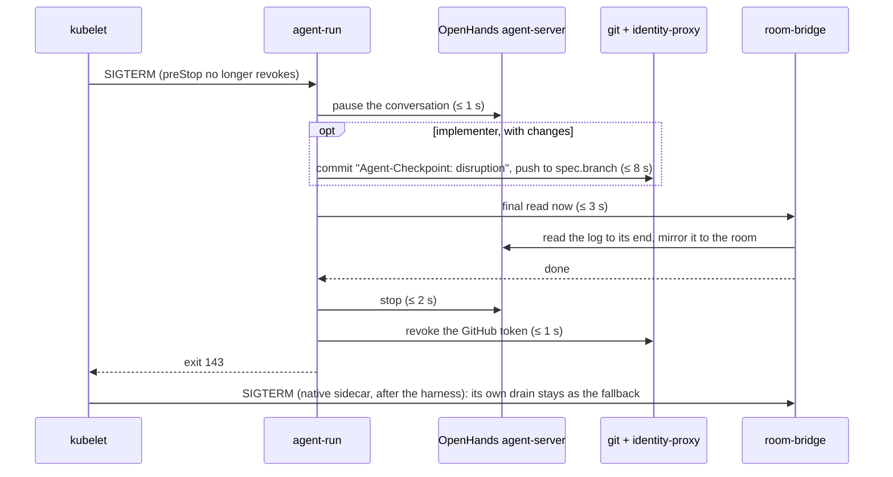
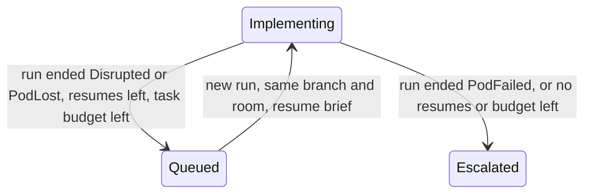

# Agent runs that survive a spot or preemptible reclaim

**Status:** approach approved by the owner on 2026-10-04. No plan yet.
**Programme:** [Agent Factory](2026-09-23-agent-factory-design.md). This amends SP1 (runtime), SP2 (room
bridge) and SP3 (factory). It answers point 4 of an external review: runs on reclaimable capacity
lose their work and are never resumed.
**Evidence:** [research](2026-10-04-agent-run-disruption-research.md). Every claim below about current
behaviour is cited there at a pinned commit.

## Goal

A reclaimed node costs a run **at most the work since its last push**, and the factory resumes it on
its own.

| | Today | Target |
|---|---|---|
| Work in progress | Lost: uncommitted and unpushed edits die with the pod's `emptyDir` | Committed and pushed as a checkpoint when the window allows |
| Transcript | Its tail is lost: the bridge's last read runs after OpenHands has stopped (the harness half of F11 was never built) | Complete |
| End reason | `PodFailed` or `PodLost`, whichever the composition sees first | `Disrupted`, `PodLost` or `PodFailed`, decided by the pod's state |
| Recovery | The task goes `Escalated` until a maintainer comments `/factory retry`; a lost reviewer run spends a review round | Automatic resume on the same branch and room, capped and within the task's budget |

## Scope: reclaimable capacity

| Capacity | Used by | Warning before the pod is signalled | Pod's shutdown window |
|---|---|---|---|
| AWS Spot, Karpenter `agents-gvisor` | aws-0 | ~120 s, unused: Karpenter never evicts a `do-not-disrupt` run pod | `min(pod grace, 120 s)` at OS shutdown, **if** EC2 keeps the OS up that long (undocumented) |
| GKE Spot VMs | gcp-0 | None | 15 s by default; up to 120 s total through the node system config on GKE ≥ 1.35.0-gke.1171000 |
| GKE preemptible VMs | supported, not used | None | **15 s, fixed**: GKE does not allow extending it. Every node dies within 24 h |

**The shutdown sequence is therefore budgeted at 15 s.** It must work on preemptible VMs, and on
Spot before any extension. A longer window, where a cloud gives one, only adds margin.

The same path also covers other graceful disruptions that end a run pod: a GKE auto-upgrade drain
(`EvictionByEvictionAPI`) and kubelet node-pressure eviction. A node that vanishes with no graceful
shutdown at all is handled by classification and resume only (§3, §4).

## Owner decisions (2026-10-04)

- **Resume, lose minutes.** Continuing the same conversation (durable OpenHands state, in-place
  resume) is out of scope. The Substrate spike planned in the [kagent evaluation](2026-10-04-kagent-evaluation-research.md) may make it
  moot.
- **Shutdown signal first.** Make the signal every cloud sends work; add an early warning on aws-0
  only if a fault-injection test shows the OS-shutdown window does not complete.
- **All reclaimable capacity, not just AWS Spot**: GKE Spot and GKE preemptible included.

## Invariants kept

| Invariant | How this design keeps it |
|---|---|
| A task never runs twice by accident (F12 gate, F2b) | No in-place resume. A resumed run is a **new** `AgentRun` with its own id, created by the factory |
| One writer of `AgentRun` status: the composition (C3) | The composition derives the new reason; nothing else writes status |
| Terminal phases latch (F2, M2) | A `Failed` run stays `Failed`; resume never flips it |
| One live run per room (P17) | The resumed run waits for the old one to be terminal, as `/factory retry` does today |
| Budgets bound spend | Each resume spends from the task's token cap, enforced on this path (§4) |

## Design

### 1. The shutdown window

| Change | Where | Note |
|---|---|---|
| Raise graceful node shutdown to 120 s on the gVisor Spot pool | `opentofu/gcp/gke/init/sandbox.tf` (node system config) | Needs GKE ≥ 1.35.0-gke.1171000; changing it recreates the nodes. If the provider lacks the field, it waits; the 15 s budget still holds |
| No change on aws-0 now | — | An AWS FIS spot-interruption test on a live run measures whether the kubelet's shutdown completes (§5) |
| Keep pod `terminationGracePeriodSeconds` 30 s, or 45 s with a room | composition | The kubelet caps it at the node's window anyway |

### 2. The shutdown sequence

Today preStop revokes the GitHub token first, and `agent-run` stops OpenHands before the bridge's
last read, so neither a push nor a complete transcript is possible. The new order, with every step
time-boxed and skipped on overrun so no step can block the next:

Total: at most 15 s; each box is an upper bound. The preStop hook is removed: it only revoked the token.

| Step | Owner | Detail |
|---|---|---|
| Pause | `agent-run` | Stops new tool calls so the work tree stops changing: agent-server's `interrupt`, which cancels the in-flight model call (`pause` would wait for it). A terminal command already running is not killed |
| Checkpoint | `agent-run` | Implementer only; other roles never write. `git add -A` (`.gitignore` applies), commit only if the tree changed, then push to `spec.branch`. The trailer `Agent-Checkpoint: disruption` is added by the commit-msg hook beside the usual provenance trailers, because the hook neutralises any `Agent-*` line written in a message. The credential comes through `git-credential-agent`, which re-exchanges through the identity-proxy on `:4001`: that sidecar and the network policy outlive the harness |
| Final read | `agent-run` → room-bridge | A new localhost call to the bridge, which reads the harness log to its end and mirrors it before answering. This is the harness half of F11 |
| Stop, revoke | `agent-run` | The revoke moves from preStop into `agent-run`'s exit, after the push, and runs in-process: a Python subprocess can take longer than 1 s to start under gVisor. If `agent-run` dies first, the token expires within the hour, as the docs already state |

The checkpoint commit lands on the PR like any commit and triggers CI once. The resumed run continues
from it.

### 3. Classifying the end

The composition reads the run's pod, not only the Sandbox, whose `Finished` condition never carries
the pod's reason (agent-sandbox v1.0.3 to `main`). Precedence:

| Reason | When |
|---|---|
| `Succeeded` | Unchanged |
| `Disrupted` | The pod is `Failed` with a `DisruptionTarget` condition: node shutdown, eviction, preemption |
| `PodLost` | The pod vanished: it was deleted, or its node disappeared, before the composition saw a final state. The gated replacement (F12) is the mark |
| `PodFailed` | The pod failed on its own: the harness exited non-zero, a crash, an out-of-memory kill |

Where a plain `DELETE` or PodGC leaves no `DisruptionTarget`, or an evicted pod is deleted before the
composition reads it, the run reads `PodLost`. That is still treated as infrastructure loss (§4).
Since Kubernetes 1.27 the kubelet marks a deleted pod `Failed`, so `Finished=PodFailed` alone does not
mean the run failed: `Finished=PodFailed` with a pod that is gone, carries a `deletionTimestamp`, or
has been replaced reads `PodLost`. `status.reason` is a plain string; its documented values gain
`Disrupted`.

The pod is read as a Crossplane **required resource** (function-kcl ≥ v0.12.2). Crossplane serves
required resources from its cluster-wide cache, so Crossplane needs `get`, `list` and `watch` on pods
in every namespace, not `get` in `agents`: a wider read, and a cluster-wide pod informer in
Crossplane's memory, which the plan measures.

### 4. Automatic resume

| Rule | Value |
|---|---|
| Trigger | An implementer run ending `Disrupted` or `PodLost`. `PodFailed` still escalates, so a crashing agent is never resumed in a loop |
| Cap | `resume.maxPerTask: 2` (factory config), then `Escalated` as today |
| Budget | Each resume spends from the task's `TaskTokens` cap. On the resume path the cap is **enforced**, even while `budgets.enforceTask` keeps it in shadow elsewhere. A resume needs at least one `RunTokens` left |
| The new run | Same `agent/<task>` branch, same room, deterministic id. Brief: interrupted by infrastructure; the last work is on the branch (a checkpoint commit, if any); read the room; continue |
| Reviewer runs | A reviewer, tester or triager run that ends `Disrupted` or `PodLost` re-runs **without spending a review round** |
| Narration | On the issue: "the sandbox was lost (spot reclaim or eviction); resuming automatically (1/2)". The text exists |
| Runs started by hand | Unchanged: resume with `--branch`, as documented |

### 5. Early warning on aws-0: conditional

Built only if the FIS test (§7) shows the kubelet's shutdown does not complete before EC2 powers the
instance off. Then the 120 s warning becomes the trigger, through one of:

- the room broker watching Karpenter's NodeClaim deletion and sending "checkpoint now" through the
  room, which the bridge relays to `agent-run`;
- a NodePool `terminationGracePeriod`, which makes Karpenter delete the pod early, but also bounds
  expiry and drift drains, so it ends long runs on those too.

The choice between them is deferred to that evidence.

### 6. Observability

- `agent_factory_resumes_total{reason}` and a panel on the factory dashboard.
- The run's dashboard shows its reason, and a link to the resumed run.

### 7. Verification

| Check | How |
|---|---|
| Shutdown ordering and time boxes | Unit tests in `agent-run`, with a fake bridge, a fake git remote and an injected slow step |
| Bridge final read | Unit test: the call returns only after the log's last event is mirrored |
| Reasons | Composition render tests with pod fixtures: `DisruptionTarget` → `Disrupted`, gated replacement → `PodLost`, exit 1 → `PodFailed` |
| Resume rules | Factory tests: resume up to the cap, then escalate; no resume on `PodFailed`; task cap enforced; no review round spent |
| Time under gVisor | Measure each step's duration in a live sandbox; the total must stay under 15 s |
| gcp-0, live | A simulated Spot preemption of the node under a running implementer, then confirm: checkpoint commit on the branch, the transcript's tail in the room, reason `Disrupted`, an automatic resume, the PR continuing |
| aws-0, live | AWS FIS `aws:ec2:send-spot-instance-interruptions` on an `agents-gvisor` node under a running implementer: does the kubelet's shutdown complete (decides §5), with the same checks as gcp-0 |

## Acceptance criteria

1. On a reclaim with at least 15 s of graceful shutdown, an implementer's uncommitted changes are on
   its branch in a commit carrying `Agent-Checkpoint: disruption`.
2. The room log holds every harness event up to the harness's stop.
3. The `AgentRun` reads `Disrupted` after a graceful node shutdown or eviction, `PodLost` after an
   abrupt loss, and `PodFailed` when the harness itself fails.
4. The factory resumes a `Disrupted` or `PodLost` implementer run at most twice per task, never past
   the task's token cap, and escalates otherwise.
5. A lost reviewer run does not consume a review round.
6. The live checks pass on gcp-0; the FIS result on aws-0 is recorded with a decision on §5.

## Records this corrects

- Runtime design, risk R7: node expiry cannot kill a run (the drain waits for it to end), and a retry
  gets a fresh `RunTokens` cap rather than spending from the same `maxTokens`.
- User guide: `status.reason` is not "always `PodFailed`"; it reads one of the reasons in §3.

## Out of scope

- Continuing the same conversation across pods: durable OpenHands state, a stable per-run secret key,
  an in-place resume.
- Periodic checkpoints on a timer.
- Agent Substrate (see the [kagent evaluation](2026-10-04-kagent-evaluation-research.md)).

No ADR: no technology is chosen over another. The alternatives weighed were design approaches (early
warning everywhere, periodic checkpoints, conversation continuity), recorded above.

## Open questions, each settled in the plan

| Question | Settled by |
|---|---|
| Does gcp-0's GKE version allow the 120 s extension, and does the provider expose it? | `gcloud container clusters describe` at the next rebuild; the provider docs |
| How long does each shutdown step take under gVisor? | The measurement in §7 |
| How does Crossplane read the pod: required resources, and with which RBAC? | A render test, then a live check |
| How often do agents push mid-run? It sets how much a checkpoint saves | Count pushes per run in VictoriaLogs after the next rebuild |
| What do our reclaim rates look like? | `karpenter_nodeclaims_disrupted_total{reason="spot_interrupted"}` and the GCE preemption history, over a month |
