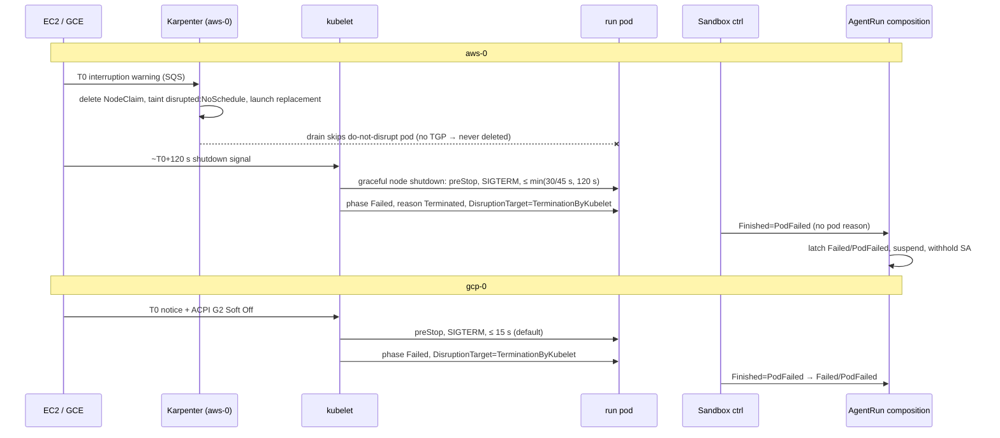

# Research: What happens to an agent run when its spot or preemptible node is reclaimed?

**Topic**: agent-run-disruption · **Conducted**: 2026-10-04 · **Researcher**: Claude (research subagent)

---

The facts a fix must rest on; no design. The design is
[2026-10-04-agent-run-disruption-design.md](2026-10-04-agent-run-disruption-design.md). Verdicts:
**CONFIRMED** (source or official doc read), **CONFIRMED-LIVE** (our runbook recorded it),
**CONTRADICTED** (a claim in our specs is wrong against code), **UNVERIFIED** (with what would confirm
it).

## SHAs and documents read

| Source | Ref | SHA |
|---|---|---|
| Smana/cloud-native-ref | `origin/integration/agent-factory` | `24f05fab40586b830ea71c2d04a4c7ce835fae13` |
| ↳ `agent_run.py` last change | — | `516c73c0` (identical in `10c062c2`, the H-S3 build the composition pins as `agent-harness:v0.2.0-pr2142.10c062c2`) |
| Smana/crossplane-configuration | `origin/chore/room-bridge-v0.4.0` | `d6eb3543ba6b4d10b075c741ef429de2a1b5b00d` (contains `bbdf2a2` F12, `5c7ba6b` F15, `4622b97`, `b69ae54`) |
| Smana/agent-platform | `origin/feat/room-approvals` | `eb61ce7c6b1e2102e54b3ebd8eaffd5770d39bcc` (F11 fix is `3ae3ad4`; `afb1ed7` is its test-only follow-up) |
| Smana/agent-platform | `origin/feat/room-driver` | `5bd18d02116e8e6d57d9d6b2e37be83956a76207` |
| Smana/agent-platform | `origin/feat/factory-pair` | `ddb06e0273ca63c69441f894f9b6dffdc4e9bee0` (`f2e51f9` is an ancestor) |
| Smana/agent-platform | `origin/feat/factory-runlore` (newest; contains pair, safety, merge, api, triage) | `d7747b253575cde864c611abe97350b0e865513e` |
| kubernetes-sigs/agent-sandbox | `v1.0.3` (pinned) · `v1.0.5` · `main` | `527d9346fe1d…` · `82d410efd5a2…` · `43ef54a74d73…` |
| OpenHands/software-agent-sdk | `v1.49.5` · `v1.49.6` (what the harness actually pins: `requirements.in`, Dockerfile `FROM agent-server:1.49.6-python`) | `5b36cacccc2b…` · `fcc102a69787…`. The persistence files below are byte-identical between the two |
| kubernetes-sigs/karpenter | `v1.14.1` (our pin, `flux/sources/ocirepo-karpenter.yaml`) | `6e7eab7a0f48…` |
| aws/karpenter-provider-aws | `v1.14.1` | `bde00654cd31…` |
| awslabs/amazon-eks-ami | `v20260923` (our `al2023@v20260923` alias) | `2de204d7369a…` |
| kubernetes/kubernetes | `v1.34.0` (raw files: nodeshutdown manager, podgc) | tag object `275918a59a3d…` |
| kubernetes/website | `main` (disruptions, pod-lifecycle, node-shutdown, sidecar, taints) | `77db41e9c776…` |
| google/gvisor | `release-20260921.0` (our pin, EC2NodeClass user-data) | tag object `5a15761b5dcf…` |
| terraform-aws-modules/terraform-aws-eks `modules/karpenter` | `v21.0.0` and `v21.26.0` (we pin `~> 21.0`) | tags |
| Official docs | [K8s disruptions](https://kubernetes.io/docs/concepts/workloads/pods/disruptions/#pod-disruption-conditions) · [pod lifecycle](https://kubernetes.io/docs/concepts/workloads/pods/pod-lifecycle/) · [node shutdown](https://kubernetes.io/docs/concepts/cluster-administration/node-shutdown/) · [Karpenter disruption](https://karpenter.sh/docs/concepts/disruption/) · [EC2 interruption notices](https://docs.aws.amazon.com/AWSEC2/latest/UserGuide/spot-instance-termination-notices.html) · [Spot Instance Advisor](https://aws.amazon.com/ec2/spot/instance-advisor/) · [GKE Spot VMs](https://docs.cloud.google.com/kubernetes-engine/docs/concepts/spot-vms) · [GKE how-to Spot](https://docs.cloud.google.com/kubernetes-engine/docs/how-to/spot-vms) · [GCE Spot VMs](https://docs.cloud.google.com/compute/docs/instances/spot) · [GKE Sandbox](https://docs.cloud.google.com/kubernetes-engine/docs/concepts/sandbox-pods) (GCP pages "last updated 2026-10-02") | — |

Paths below are relative to each repo. `main.k` = `apis/agentrun/kcl/main.k` at `d6eb354`.

---

## Q1 · AWS spot interruption with Karpenter (aws-0)

**Answer.** The interruption queue is configured. On the 2-minute warning Karpenter deletes the
NodeClaim, taints the node `karpenter.sh/disrupted:NoSchedule`, launches a replacement and starts a
drain, **but never evicts or deletes our run pods**: they carry `karpenter.sh/do-not-disrupt: "true"`
and the `agents-gvisor` NodePool sets no `terminationGracePeriod`. The pod is therefore only stopped
when EC2 shuts the instance down at ~T+120 s. AL2023 nodeadm enables kubelet **graceful node
shutdown** on kubelet ≥ 1.34 (150 s total, 30 s reserved for critical pods), so at that point the
kubelet should run the pod's normal termination (preStop, SIGTERM, up to the pod's 30/45 s) and mark it
`Failed` with `DisruptionTarget=TerminationByKubelet`. How long EC2 lets the OS run after the shutdown
signal is not documented, and none of this has been observed live.

| Claim | Verdict | Evidence |
|---|---|---|
| Karpenter is installed with an SQS interruption queue | CONFIRMED | `infrastructure/base/karpenter/helmrelease.yaml` `settings.interruptionQueue: ${karpenter_queue_name}`; `opentofu/aws/eks/configure/locals.tf` `Karpenter-${var.cluster_name}`; module `terraform-aws-eks//modules/karpenter ~> 21.0` (`opentofu/aws/eks/init/karpenter.tf`), whose `enable_spot_termination` defaults to `true` at v21.0.0 and v21.26.0 and whose rules include `EC2 Spot Instance Interruption Warning`, rebalance and state-change (`modules/karpenter/main.tf`) |
| Spot interruption → `CordonAndDrain` = delete the NodeClaim; rebalance recommendation → event only | CONFIRMED | karpenter-provider-aws `pkg/controllers/interruption/utils.go` `actionForMessage` (SpotInterruptionKind → CordonAndDrain; RebalanceRecommendation → NoAction), `deleteNodeClaim`; events `SpotInterrupted` on Node and NodeClaim (`events/events.go`) |
| The drain uses the Eviction API, but skips `do-not-disrupt` pods and stalls on them | CONFIRMED | karpenter `pkg/utils/pod/scheduling.go` `IsEvictable` (`!IsDoNotDisruptActive`) vs `IsDrainable` ("pods with the do-not-disrupt annotation are included since node drain should stall … even though Karpenter won't orchestrate the eviction"); `terminator.go` `Drain` |
| `do-not-disrupt` does not exempt a node from Interruption/Expiration; it blocks the drain indefinitely without `terminationGracePeriod` | CONFIRMED | [Karpenter disruption docs](https://karpenter.sh/docs/concepts/disruption/): "does not exclude nodes from the forceful disruption methods: Expiration, Interruption…"; "may block draining indefinitely" |
| Our NodePool sets no `terminationGracePeriod`, so Karpenter never force-deletes a run pod | CONFIRMED | `infrastructure/base/karpenter-nodepools-agents/agents-gvisor-nodepool.yaml` (no field); karpenter `nodeclaim/lifecycle/controller.go` sets the termination-timestamp annotation only when `Spec.TerminationGracePeriod != nil`; `terminator.DeleteExpiringPods` acts only with that timestamp |
| If a `terminationGracePeriod` were set, Karpenter would plain-`DELETE` a do-not-disrupt pod at `deletion + TGP − pod TGP`, with no `DisruptionTarget` | CONFIRMED (source) | `terminator.go` `DeleteExpiringPods` → `kubeClient.Delete(…GracePeriodSeconds)`; the TGP is per NodePool, so it would apply to Expiration and Drift as well |
| EC2 sends the notice 2 min before; it is best effort; the instance then "receives the shutdown signal" | CONFIRMED | [EC2 interruption notices](https://docs.aws.amazon.com/AWSEC2/latest/UserGuide/spot-instance-termination-notices.html): "issued two minutes before"; "emitted on a best effort basis"; `termination-time` = "when the instance will receive the shutdown signal" |
| AL2023 nodeadm enables kubelet graceful node shutdown on kubelet ≥ 1.34: `shutdownGracePeriod` 150 s, critical 30 s | CONFIRMED (source) | amazon-eks-ami `v20260923` `nodeadm/internal/kubelet/config.go` `withVersionToggles`. aws-0 runs 1.36 (`opentofu/aws/eks/init/variables.tf` default `"1.36"`); our EC2NodeClass does not override it |
| The kubelet raises logind's `InhibitDelayMaxSec` itself | CONFIRMED (source) | kubernetes `v1.34.0` `pkg/kubelet/nodeshutdown/nodeshutdown_manager_linux.go` L182–201 |
| Graceful node shutdown gives a regular pod `min(pod TGP, group period)` | CONFIRMED (source) | `nodeshutdown_manager.go` L144–149 (`gracePeriodOverride`). Ours: 30 s, or 45 s with `roomRef` (`main.k` L479) ≤ 120 s |
| EC2 lets the OS run long enough after the shutdown signal for the kubelet's inhibitor to finish | **UNVERIFIED** | Not on the AWS page. Confirm by forcing an interruption with AWS FIS `aws:ec2:send-spot-instance-interruptions` on an `agents-gvisor` node and reading the pod's status and `agent-run` logs |
| The pod sees no signal during the 120 s between the notice and the shutdown | CONFIRMED (source) | Follows from the three rows above; IMDS is unreachable from pods (`httpPutResponseHopLimit: 1`, EC2NodeClass) |
| `expireAfter: 24h` can kill a run | **CONTRADICTED** (design R7 lists "expiry") | Expiration drains with the same do-not-disrupt rule and no TGP, so the drain waits for the run to end (≤ 8 h, `activeDeadlineSeconds`) |

## Q2 · GKE spot preemption (gcp-0)

**Answer.** A preemption notice is followed by ACPI G2 Soft Off. By default GKE runs graceful node
shutdown over 30 s: **15 s for regular pods**, then 15 s for `system-*-critical` pods. Ours are regular
pods, so they get 15 s whatever `terminationGracePeriodSeconds` says. The window can be raised to 120 s
total through the node system config on GKE ≥ 1.35.0-gke.1171000. The kubelet marks the pod `Failed`,
reason `Terminated`, `DisruptionTarget=TerminationByKubelet`, and does not delete it. GKE Sandbox adds
no documented caveat about signals or termination.

| Claim | Verdict | Evidence |
|---|---|---|
| Notice, then ACPI G2 Soft Off; 30 s default split 15 s regular / 15 s critical | CONFIRMED | [GKE Spot VMs](https://docs.cloud.google.com/kubernetes-engine/docs/concepts/spot-vms) "Termination and graceful shutdown of Spot VMs" |
| A pod TGP above the window is not honoured; max 120 s total; extension needs GKE 1.35.0-gke.1171000+ (node pools) or 1.36.0-gke.3204000+ (ComputeClass) | CONFIRMED | same page; [how-to](https://docs.cloud.google.com/kubernetes-engine/docs/how-to/spot-vms): set via `--system-config-from-file`, and changing it re-creates the nodes |
| GCE's own shutdown period for Spot VMs is "best effort and up to 30 seconds", then ACPI G3 Mechanical Off | CONFIRMED | [GCE Spot VMs](https://docs.cloud.google.com/compute/docs/instances/spot) |
| Our pool uses the defaults (15 s for our pods) | CONFIRMED | `opentofu/gcp/gke/init/sandbox.tf`: `spot = true`, no system config |
| gcp-0's GKE version meets the 120 s extension floor | **UNVERIFIED** | `release_channel = "REGULAR"`, `kubernetes_version = "latest"`; run `gcloud container clusters describe … --format='value(currentMasterVersion)'` |
| Pod after graceful shutdown: `phase=Failed`, `reason=Terminated`, message "Pod was terminated in response to imminent node shutdown.", `DisruptionTarget` reason `TerminationByKubelet`, not deleted | CONFIRMED | kubernetes `v1.34.0` `nodeshutdown_manager.go` L88–89, L152–166; [node-shutdown doc](https://kubernetes.io/docs/concepts/cluster-administration/node-shutdown/) note ("`kubectl get pods` shows … `Terminated`") |
| GKE Sandbox changes anything about termination | No documented change | [GKE Sandbox limitations](https://docs.cloud.google.com/kubernetes-engine/docs/concepts/sandbox-pods): seccomp, AppArmor, NoNewPrivileges, raw block and hostPath are unsupported; nothing about signals or shutdown |
| GKE puts a taint or condition on the node at notice time that a controller could watch | **UNVERIFIED** | Not in the docs read. Confirm with `gcloud compute instances simulate-maintenance-event` (or a real preemption) while watching the Node |
| GKE **preemptible** VMs (not used today; gcp-0 runs Spot) live at most 24 h, give 15 s to regular pods, and that window **cannot** be extended: "the underlying `shutdownGracePeriod` and `shutdownGracePeriodCriticalPods` kubelet configuration fields are immutable" | CONFIRMED | [GKE preemptible VMs](https://docs.cloud.google.com/kubernetes-engine/docs/how-to/preemptible-vms) |
| Other gcp-0 disruption: auto-upgrade drains spot nodes without waiting for the surge node | CONFIRMED (doc) | GKE Spot VMs page "Upgrade Standard node pools using Spot VMs"; `sandbox.tf` `auto_upgrade = true`. Upgrade drains evict (`EvictionByEvictionAPI`); the cap on how long a drain waits is not checked here |

## Q3 · Kubernetes `DisruptionTarget`

**Answer.** It is a pod condition (stable since 1.26; PodDisruptionConditions) that the control plane
or kubelet adds before or while it kills the pod. There are five reasons. It is absent for a plain
`DELETE`, for container-limit failures and before PodGC acts on a vanished node. How long it stays
observable depends on the path: for PodGC it is a status patch immediately followed by a force-delete,
while after a kubelet node shutdown it persists on a pod that is not deleted.

| Claim | Verdict | Evidence |
|---|---|---|
| Reasons: `PreemptionByScheduler`, `DeletionByTaintManager`, `EvictionByEvictionAPI`, `DeletionByPodGC`, `TerminationByKubelet` (node-pressure eviction, graceful node shutdown, critical-pod preemption) | CONFIRMED | [disruptions.md](https://kubernetes.io/docs/concepts/workloads/pods/disruptions/#pod-disruption-conditions) |
| Not set "in all other disruption scenarios, like eviction due to exceeding Pod container limits"; it may be set and later cleared if the disruption is abandoned | CONFIRMED | same section and its note |
| A plain `DELETE` (`kubectl delete`, Karpenter's `DeleteExpiringPods`, the Sandbox controller suspending) sets no `DisruptionTarget` | CONFIRMED (by omission) | None of the five reasons covers it; Karpenter calls `kubeClient.Delete` directly (`terminator.go`) |
| Since 1.27 the kubelet moves a deleted pod to a terminal phase before its API deletion (except static and force-deleted pods) | CONFIRMED | [pod-lifecycle.md](https://kubernetes.io/docs/concepts/workloads/pods/pod-lifecycle/) "Since Kubernetes 1.27…" |
| PodGC: an orphan (node object gone) is quarantined 40 s, then patched `Failed` + `DisruptionTarget{DeletionByPodGC, "PodGC: node no longer exists"}` and force-deleted | CONFIRMED | kubernetes `v1.34.0` `pkg/controller/podgc/gc_controller.go` `quarantineTime = 40s`, `gcOrphaned`, `markFailedAndDeletePodWithCondition` |
| A node that vanishes without graceful shutdown: pods keep their last status until the taint manager (`not-ready`/`unreachable`, default `tolerationSeconds=300`) deletes them, which a dead kubelet never completes, or until the Node object goes and PodGC force-deletes them | CONFIRMED (docs) | [taint-and-toleration.md](https://kubernetes.io/docs/concepts/scheduling-eviction/taint-and-toleration/) note on the 300 s default; [node-shutdown.md](https://kubernetes.io/docs/concepts/cluster-administration/node-shutdown/#non-graceful-node-shutdown) "stuck in terminating status … forever" without `out-of-service` |
| On aws-0 Karpenter removes a NotReady Node whose instance is gone, which hands its pods to PodGC | CONFIRMED (source) | karpenter `pkg/controllers/node/termination/controller.go` L117–127 (NotReady + `cloudProvider.Get` NotFound → `removeFinalizer`) |
| End-to-end detection time for an abrupt loss on aws-0 | **UNVERIFIED** | ≈ node-monitor grace + Karpenter reconcile + 40 s quarantine; measure with an FIS `aws:ec2:terminate-instances` |

## Q4 · gVisor and SIGTERM

**Answer.** Yes. The kubelet's stop reaches the containerd runsc shim, which calls runsc to signal the
container, and the Sentry delivers the signal to the container's init. Our init is `tini`, which
forwards it to `agent-run`. Live runs show graceful pod deletion working under gVisor (preStop revoke,
then cleanup). No log has yet shown `agent-run`'s own SIGTERM handler finishing under runsc.

| Claim | Verdict | Evidence |
|---|---|---|
| runsc delivers a signal to a running container's processes through the sandbox | CONFIRMED (source) | gvisor `release-20260921.0` `runsc/container/container.go` `SignalContainer` → `signalRunning` → `c.Sandbox.SignalContainer` |
| The harness's PID 1 is tini, which forwards signals to `agent-run` | CONFIRMED | `container-images/agent-harness/Dockerfile` `ENTRYPOINT ["tini", "--", "/usr/local/bin/agent-run"]`; [tini](https://github.com/krallin/tini) forwards signals |
| Graceful deletion works end to end under gVisor (preStop revoke reaches GitHub, Usage holds the CNP until the pod is gone) | CONFIRMED-LIVE | `docs/runbooks/agent-factory/README.md` "FIXED in round 6" (`hb545ti2`: CNP deleted 3 s after the pod); `02-identity-tokens.md` step "pod gone ≤ 60 s; GitHub token 401 ≤ 60 s" |
| `agent-run`'s handler itself ran to completion under runsc | **UNVERIFIED** | Delete a running pod and read `kubectl logs --previous -c harness` (or VictoriaLogs) for the revoke and exit 143 |
| GKE Sandbox caveat for signals | None documented | GKE Sandbox limitations (Q2) |
| An in-pod process cannot read the cloud's interruption notice | CONFIRMED (aws-0) / **UNVERIFIED** (gcp-0) | aws-0: IMDS hop limit 1. gcp-0: `workload_metadata_config GKE_METADATA` serves only the GKE metadata server; whether it exposes `instance/preempted` was not checked |

## Q5 · agent-sandbox v1.0.3, our composition and the pod-lost gate

**Answer.** With `operatingMode: Running` and no owned pod, the Sandbox controller creates a new pod
of the **same name** from the template at once. While a pod exists in phase `Failed` it reports
`Finished=PodFailed`, with a fixed message and no pod reason, and does not recreate the pod. Once the
run has been scheduled, our composition stamps the `agents.ogenki.io/pod-lost` scheduling gate into the
template, so a replacement is born gated. The Sandbox then mirrors `PodScheduled=False`, and the
composition ends the run `Failed/PodLost`. Whichever the composition sees first wins, latched:
`Finished=PodFailed` → `PodFailed`, a gated replacement → `PodLost`. `volumeClaimTemplates` exist: the
PVCs are owned by the Sandbox, survive pod deletion and suspension, and die with the Sandbox. Our
composition renders none.

| Claim | Verdict | Evidence |
|---|---|---|
| No owned pod + Running → create pod named `sandbox.Name` | CONFIRMED | agent-sandbox `v1.0.3` `controllers/sandbox_controller.go` `reconcilePod` L1188–1400 ("Create new Pod", `Name: sandbox.Name`) |
| An existing `Failed` pod is kept; `Finished` = True/`PodFailed`, message "Pod failed", no pod reason or conditions | CONFIRMED | same file `computeFinishedCondition` L694–716; unchanged in `v1.0.5` and `main@43ef54a`; no `DisruptionTarget` anywhere in the repo |
| `Finished` and `PodScheduled` are removed once there is no pod | CONFIRMED | same file L446–466 (`presentWhileApplicable`) |
| Suspended → controller deletes the pod; the Sandbox and its volumes stay | CONFIRMED | same file L1256–1283; `docs/api.md` `Suspended` |
| `volumeClaimTemplates`: PVC `<template>-<sandbox>`, owner = Sandbox, immutable, reattached to any recreated pod | CONFIRMED | `api/v1beta1/sandbox_types.go` L253–273; `reconcilePVCs` L1632–1711; pod volumes L1436–1447; example `examples/hermes-agents-as-a-service/README.md` ("Suspend = delete only the pod (PVC + Service survive)") |
| The composition derives phase/reason only from the Sandbox, the XR's previous status and its own gate | CONFIRMED | `main.k` `_phaseOf` L152–157, `_reasonOf` L162–164, `_started`/`_lost` L310–312; it observes composed resources only (`ocds`), never the Pod |
| Gate added from the first pod's binding; the replacement is gated; `PodLost` | CONFIRMED | `main.k` L112–119 (comment), L470–473 (`schedulingGates`); crossplane-configuration `bbdf2a2`, `4622b97` |
| A terminal phase withholds the SA (F2b) and suspends the Sandbox (M2) | CONFIRMED | `main.k` L326, L332, L456–460 |
| Live: before F12 a deleted pod read `Failed PodFailed`; at `147819ff` a room run's pod was recreated in ~1 s and **re-ran the task** (F12) | CONFIRMED-LIVE | `docs/runbooks/agent-factory/01-runtime-sandbox.md` L176, L228, L240; `README.md` L349–372 |
| F12's `Failed PodLost` live result | **UNVERIFIED** | Planned in `docs/superpowers/plans/2026-09-27-agent-collaboration-rooms-plan.md` L9180–9196 (Step 6); no recorded result found |
| `status.reason` is always `PodFailed` (user guide / plan P5) | **CONTRADICTED** since F12 | `main.k` L163 writes `PodLost`; the plan P5 row (`2026-09-25-agent-runtime-identity-plan.md` L134) predates it |
| Zonal PVC implications | CONFIRMED (config) / UNVERIFIED (behaviour) | aws-0 `agents-gvisor` does not pin a zone and picks subnets by tag, so an EBS PVC pins every replacement to its AZ, where the reclaim just happened. gcp-0's pool is single-zone (`sandbox.tf` `node_locations = [local.net.zone]`), so a PD fits but shares that zone's spot capacity. A PVC mounted under runsc on aws-0, and attach/detach after an abrupt loss, are untested |

## Q6 · `agent-run` today

**Answer.** On SIGTERM it raises `SystemExit(143)` so that the `finally` blocks run: flush the step log
from agent-server, stop agent-server (≤ 10 s), then `git-credential-agent revoke`. It never commits or
pushes. The preStop hook has already revoked the token before SIGTERM arrives. `CONVERSATION_ID` is
accepted (and = the AgentRun's `metadata.uid`) so the harness and the room-bridge sidecar address the
same agent-server conversation without discovery; it is also projected as `status.conversationId`.
Resume today is clone-time only: an existing `origin/$BRANCH` is checked out. A SIGTERM-time WIP push
is mechanically possible on the implementer role, since identity-proxy and the CNP outlive the
harness, but it has to re-mint a token through `:4001` and fit inside 15 s (gcp-0 default) or an
undocumented EC2 window (aws-0).

| Claim | Verdict | Evidence |
|---|---|---|
| SIGTERM → `SystemExit(128+15)` | CONFIRMED | `container-images/agent-harness/agent_run.py` L300–303, L318 |
| Exit path: inner `finally` flushes `StepLog` (loopback GETs, 30 s timeout each), then outer `finally`: ignore SIGTERM, `server.terminate()`, `wait(10)`/kill, `git-credential-agent revoke` | CONFIRMED | `agent_run.py` L333–356 |
| No commit or push on exit; `close_conversation` (which DELETEs the conversation dir) never runs on SIGTERM | CONFIRMED | `agent_run.py` L339–341; agent-server `delete_conversation` → `safe_rmtree(conversation_dir)` (`conversation_service.py` L1921–1975) |
| `CONVERSATION_ID` from env, else a random UUID; composition sets it to the XR uid for harness **and** room-bridge | CONFIRMED | `agent_run.py` L147; `main.k` L246 (bridge), L526 (harness); bridge `internal/app/bridge.go` L58, `internal/bridge/harness.go` L113 (`/api/conversations/<id>`); design §2 `conversationId = metadata.uid`; introduced in `71e3f105` |
| Clone resumes `origin/$BRANCH` when it exists, else `BASE_REF` | CONFIRMED | `agent_run.py` L288–297 |
| "`agent-run --branch`" is the ops wrapper, not a harness flag | CONFIRMED | `scripts/ops/k8s/agent-run.sh` `--branch` sets `spec.branch`; `agent_run.py` has no CLI flags |
| preStop revokes the token before SIGTERM; the grace budget is preStop ~12 s + cleanup ~11 s + bridge flush 12 s + health 2 s = 37 of 45 s | CONFIRMED (budget, not a measurement) | `main.k` L36–40 (preStop), L72–77 |
| A push at SIGTERM can get a credential: identity-proxy is a native sidecar (stops after the harness), the sts token lives to the run deadline, the `Usage` keeps the CNP until the Pod is gone | CONFIRMED (source) | `main.k` L490–513 (sidecars), L231 TTL (`max(600, maxMinutes×60)`), L614–630 (Usage `by` Pod); `git_credential_agent.py` `token()` re-exchanges when the cache is gone |
| Only the implementer can push | CONFIRMED | design §4 "Role-scoped trust policies: no `contents: write`" for the other roles |
| The work tree, uncommitted edits and agent-server state live on the `workspace` emptyDir and die with the pod | CONFIRMED | `main.k` volumes (`workspace` emptyDir); `REPO_DIR=/workspace/repo`; agent-server cwd `/` → `/workspace/conversations` (Q8) |
| How often agents push mid-run (what a lost pod loses) | **UNVERIFIED** | Count `git push` actions per run in VictoriaLogs (`agent-run step … | git push`) |
| Time a WIP `git add/commit/push` takes under gVisor | **UNVERIFIED** | Time it inside a live sandbox |

## Q7 · room-bridge on exit

**Answer.** On SIGTERM the bridge sends its buffer at once, then tries one full read of the harness
log, a status poll and a second drain, all within `FLUSH_GRACE` (12 s in our pods; 25 s default), with
each wait capped at 2 s. Native sidecars are stopped only after the harness has exited, in reverse spec
order (room-bridge before identity-proxy). By then `agent-run` has already stopped agent-server, so
that final read cannot succeed. Events produced after the bridge's last successful poll (1 s interval
once the harness answers) are lost to the room log. The harness-side half of F11 (wait for the
bridge's last read) is not implemented.

| Claim | Verdict | Evidence |
|---|---|---|
| SIGTERM → `shutdown()`: `takeInbox`, `drain`, then `readLog`/`pollStatus`/`drain` if time remains; per-wait cap `drainWait = 2s` | CONFIRMED | agent-platform `eb61ce7` `internal/bridge/bridge.go` L27–34, L421–451, L840–871 |
| F11: "The SIGTERM drain reads the log to its end"; "The harness side, agent-run waiting for the bridge's last read before it stops agent-server, belongs to agent-harness" | CONFIRMED | commit `3ae3ad4` message |
| The harness side is not implemented | CONFIRMED | `agent_run.py` at `516c73c0` and `10c062c2` has no bridge wait |
| `FLUSH_GRACE=12s`, pod grace 45 s with a room; health server drain 2 s | CONFIRMED | `main.k` L76–77, L252; `internal/app/bridge.go` L32–34 |
| Sidecars terminate after the main container, in reverse order of appearance | CONFIRMED | [sidecar-containers.md](https://kubernetes.io/docs/concepts/workloads/pods/sidecar-containers/); spec order `identity-proxy`, `room-bridge` (`main.k` L490–513) |
| A restarted bridge resumes from `afterHarnessSeq` by skipping that many events of **the same** harness log | CONFIRMED | `bridge.go` L437, L650–668 (`position`) |
| The broker re-admits the same run id; it refuses another run while the holder is live | CONFIRMED | `internal/store/bridges.go` `claimFree` L62–83 (`holder != runID` → busy) |
| The broker derives `pod_lost` when no harness terminal status was mirrored and the run did not reach its deadline | CONFIRMED | `internal/runwatch/run.go` `EndReason` L100–135 (it ignores `status.reason`) |

## Q8 · OpenHands agent-server 1.49.5/1.49.6 persistence

**Answer.** It persists continuously, under `<cwd>/workspace/conversations/<conversation_id.hex>/`
(`/workspace/conversations/…` in our pod): `base_state.json` (agent incl. LLM, tools and condenser
config, execution status, secrets Fernet-encrypted with `OH_SECRET_KEY`), `meta.json`, one
`events/event-NNNNN-<id>.json` per event, and `owner_lease.json` (45 s TTL). A new agent-server process
catalogues the directory at start-up. A conversation found `RUNNING` is set to `ERROR`, and an
`AgentErrorEvent` ("A restart occurred while this tool was in progress…") is appended for the first
unmatched action. `POST /api/conversations` with the same `conversation_id` reattaches
(`created=False`) and does not send `initial_message`. Continuing takes `POST …/run` or a new message.
What comes back: the event log, the LLM view rebuilt from it (condensation events included) and the
persisted agent. What does not: terminal/tmux sessions and their processes, the in-flight tool call
(marked failed), the in-flight LLM call, and the secrets if `OH_SECRET_KEY` changed. `agent-run`
generates a fresh key per pod. The repository work tree is not part of conversation state.

| Claim | Verdict | Evidence (paths in `software-agent-sdk@v1.49.5`; same at v1.49.6) |
|---|---|---|
| `conversations_path` default `workspace/conversations`, relative to cwd; `agent-run` pins cwd `/` | CONFIRMED | `openhands-agent-server/openhands/agent_server/config.py` L253–258; `agent_run.py` L320–326 |
| Layout `base_state.json`, `events/event-{idx:05d}-{id}.json` | CONFIRMED | `openhands-sdk/openhands/sdk/conversation/persistence_const.py`; `state.py` `create` L455–591 |
| Resume path: base_state present → validate id, attach EventLog, `rebuild_view()`, keep the persisted agent | CONFIRMED | `state.py` L520–560; `event_service.py` `start` L1041–1060 |
| Start-up loads `RUNNING` conversations; `RUNNING` → `ERROR` + `AgentErrorEvent` for the unmatched action (`retryable=False`) | CONFIRMED | `conversation_service.py` `__aenter__` L2202–2246; `event_service.py` L1195–1232 |
| `POST /api/conversations` with an existing id returns the existing conversation, `created=False` | CONFIRMED | `conversation_service.py` `_start_conversation` L1476–1621 |
| Continue: `POST /{id}/run`, events send, `switch_llm` routes exist | CONFIRMED | `conversation_router.py` route list (L338 `/run`, L545 `/switch_llm`) |
| `agent-run` treats `error` as terminal failure, so a naïve reattach ends the run at once | CONFIRMED | `agent_run.py` L25–26, L177–183 |
| Lease 45 s; a different owner waits for expiry unless the owner is a dead pid on the same host | CONFIRMED | `conversation_lease.py` L18–20, `claim` |
| A changed `OH_SECRET_KEY` silently yields `None` secrets (LLM `api_key` → None) | CONFIRMED | `openhands-sdk/openhands/sdk/utils/cipher.py` `decrypt` L39–60; `agent_run.py` `server_env` L306–314 (per-pod key); `agent_run.py` L140–143 (without the key litellm refuses to call) |
| Terminal sessions are live tmux/subprocess objects, not persisted | CONFIRMED | `openhands-tools/openhands/tools/terminal/terminal/` (`tmux_terminal`, `subprocess_terminal`) |
| A resumed conversation behaves well after `ERROR` → `/run` (no duplicate side effects, condenser intact) | **UNVERIFIED** | Kill agent-server mid-tool in a sandbox, restart it on the same dir, `POST /run`, inspect the events |

## Q9 · Factory

**Answer.** A terminal implementer run first waits up to 60 s for the room's end reason. The room says
`pod_lost`, `deadline`, `agent_error` and so on, because the AgentRun only says `Failed`. Any
non-`Succeeded` implementer run then moves the task to **`Escalated`**. Only a maintainer's
`/factory retry` sends it back to `Queued` for a fresh run on the same `agent/<taskId>` branch, in the
same room. So the factory **can** tell infrastructure loss from agent failure, via the broker's
`pod_lost`, not via `status.reason`. It does not act on it. A lost verifier run (no verdict) is re-queued
automatically while review rounds remain, and so spends a round. The automatic hook would sit where
`implementing()` calls `end(… PhaseEscalated, reason)`, with the escalated-to-Queued transition already
written (`NextTrigger "retry"`, deterministic run id).

| Claim | Verdict | Evidence (agent-platform) |
|---|---|---|
| `runEndGrace = 1m`: the room's reason, else `revoked` or the lower-cased phase | CONFIRMED | `factory-pair` `internal/factory/reconciler/implement.go` L29–31, L239–257 |
| Non-Succeeded implementer run → `Escalated` with that reason; a vanished claim → `run_lost`/`deleted` | CONFIRMED | `implement.go` L259–301 (pair); unchanged in `factory-runlore` apart from the stuck and triager branches |
| `/factory retry` (maintainer) → `Retries++`, `NextTrigger="retry"`, → `Queued` (or `Triaged` without a room) | CONFIRMED | `watch.go` L238–268 (pair) |
| The retry's run: role implementer, `Branch: agent/<task>`, same `RoomRef`, `MaxTokens: RunTokens` (a fresh per-run cap), `MaxMinutes: RunMinutes`; id `taskid.Name(task+":run:"+n)` | CONFIRMED | `implement.go` `implementerSpec` L123–128, `runID` L76–78 |
| Its brief: `FirstBrief` until a PR exists, then `ReviseBrief` ("keep working on branch agent/<task>", room log tail) | CONFIRMED | `factory-runlore` `watch.go` `nextImplementer`; `text.go` L168–200 |
| "Retries spend from the same `maxTokens`" (design R7) | **CONTRADICTED** | Each run gets a fresh `RunTokens` cap. The shared cap is the task's `TaskTokens`, checked before a new run (`factory-runlore` `reconciler.go` L559–566) and enforced only when `budgets.enforceTask` (default `false`, `config.go` L201); otherwise shadow |
| The narrated text for `pod_lost` already exists | CONFIRMED | `internal/factory/narrate/narrate.go` L171–172 ("the sandbox was lost (spot reclaim or eviction)") |
| Verifier runs: no verdict → a new run of the role while `ReviewRounds < max`, else `Escalated no_verdict` | CONFIRMED | `factory-runlore` `team.go` `noVerdict` L200–212 |
| Design: `Implementing → Escalated: … retries exhausted` implies automatic retries | Not implemented | `docs/superpowers/specs/2026-09-23-agent-dark-factory-design.md` L230; no retry counter in `implementing()` |

## Q10 · Interruption likelihood and run durations

**Answer.** Neither cloud publishes a per-hour hazard. AWS: the Spot Instance Advisor buckets
(<5 %, 5–10 %, 10–15 %, 15–20 %, >20 %) give "the rate at which Spot has reclaimed capacity during the
trailing month", and the all-Region, all-type average has "historically been <5 %". GCP: preemption is
"generally low, but might vary from day to day and from zone to zone", with the historical rate shown
per machine type in the console. Our runs default to 120 min (XRD max 480). The factory's planned
tiers are 20 / 45 / 90 min. A per-run probability cannot be derived from a monthly bucket without
assuming its unit and a uniform hazard, so it is **UNVERIFIED**. As an illustration only, under that
unsupported assumption: 5 %/month ÷ 720 h ≈ 0.007 %/h, so ≈ 0.01 % for a 2 h run. Treat it as a shape,
not a number.

| Claim | Verdict | Evidence |
|---|---|---|
| Advisor buckets and "trailing month" definition; average "<5 %" | CONFIRMED | [Spot Instance Advisor](https://aws.amazon.com/ec2/spot/instance-advisor/) |
| GCE statement "generally low…"; console shows "expected uptime and historical preemption rate" | CONFIRMED | [GCE Spot VMs](https://docs.cloud.google.com/compute/docs/instances/spot) |
| `maxMinutes` default 120, max 480 → `activeDeadlineSeconds` | CONFIRMED | design §2 table; `main.k` L226, L476 |
| Factory tiers 20/45/90 min, bounds 1..480 | CONFIRMED (plan and test fixture) / **UNVERIFIED** (deployed values) | `config_test.go` L42–44 (`factory-runlore`), `config.go` L33–34, L378; deployed factory config not found in either repo |
| Our run-level exposure also includes node age (nodes live ≤ 24 h, reused across runs) and the advisor bucket of the instance types Karpenter picks (c/m gen 6+, 4–16 vCPU) | CONFIRMED (config) | `agents-gvisor-nodepool.yaml` |
| Observed spot reclaims of agent nodes so far | None recorded | No mention in `docs/runbooks/agent-factory/` |
| Actual rates for our types and regions | **UNVERIFIED** | Spot Advisor for eu-west-3 c/m 6+ types; GCE console "historical preemption rate" for the agents machine type and zone; Karpenter `karpenter_nodeclaims_disrupted_total{reason="spot_interrupted"}` (VictoriaMetrics) over a month |

---

## Timeline per cloud (current config, from source; not observed live)

If the kubelet shutdown does not complete (EC2 hard-off first, or GCE's 30 s best effort elapses),
the pod keeps a stale `Running` status until the Node object goes and PodGC marks it `Failed`
(`DeletionByPodGC`) and force-deletes it. Then the Sandbox shows either `Finished=PodFailed` or a
gated replacement, and the run reads `PodFailed` or `PodLost`, depending on the race.

## Constraints a fix must respect

**Timings**

| | aws-0 (Karpenter, AL2023, k8s 1.36) | gcp-0 (GKE Sandbox pool, REGULAR) |
|---|---|---|
| Earliest cluster-visible signal | T0: NodeClaim `deletionTimestamp`, node taint `karpenter.sh/disrupted:NoSchedule`, `SpotInterrupted` events on Node/NodeClaim | T0 ≈ shutdown start: Node `NotReady` "node is shutting down" (taint at notice: UNVERIFIED) |
| Lead time before the pod is signalled | ~120 s, best effort | ~0 s (default notice duration 0 → Soft Off at once) |
| Pod's graceful window | `min(pod TGP, 120 s)` = 30 s / 45 s with a room, **if** EC2 waits (UNVERIFIED) | **15 s** for regular pods by default; up to 120 s total via node system config on GKE ≥ 1.35.0-gke.1171000; GCE caps its own shutdown at "up to 30 s" |
| What that window must already hold today | preStop revoke (≤ 10 s urlopen, ~12 s budgeted) + agent-run cleanup (~11 s) + bridge flush (12 s) + health (2 s) | the same, so the 15 s default does not fit the existing 37 s budget |
| Detection after an abrupt loss | NotReady + Karpenter finalizer removal + PodGC 40 s quarantine (total UNVERIFIED) | depends on whether GKE deletes the Node (UNVERIFIED) |
| Resume cost (fresh pod) | agent-server cold start ~85 s under gVisor (F11 commit); a fresh-node submission-to-Running measured at 343 s on gcp-0 (runbook 01 L222) | same |

**Signals a controller can read today**
- On the pod, after a kubelet node shutdown: `status.phase=Failed`, `status.reason=Terminated`, condition `DisruptionTarget` (`TerminationByKubelet`). It persists until the pod is deleted.
- On the pod via PodGC: `DisruptionTarget` (`DeletionByPodGC`), followed immediately by a force-delete, so effectively unobservable.
- **Not** on the Sandbox: `Finished` carries only `PodFailed`/`PodSucceeded` (v1.0.3 to `main`). **Not** on the AgentRun: the composition reads only the Sandbox, and `status.reason` ∈ {`PodFailed`, `PodLost`}, decided by a race.
- Infrastructure: Karpenter NodeClaim deletion, node taint and events (aws-0); `karpenter_nodeclaims_disrupted_total`.
- Room log: the broker's `state_changed{run_phase, reason: pod_lost}`, which the factory already reads (`roomReason`).
- A plain `DELETE` (kubectl, Crossplane, suspension) sets no `DisruptionTarget`. `deletionTimestamp` is the only mark it leaves.

**What survives a pod loss**
- The `AgentRun` claim, its latched status and the Sandbox object (suspended); with F12 the gated replacement is deleted on suspension.
- Pushed commits on `agent/<id>`, the open PR, and the room log (Postgres), less what the bridge had not mirrored.
- Sandbox-owned PVCs, if any were rendered (none today); zonal.
- The sts and gateway projected tokens' validity (until the run deadline), not their files.

**What does not survive**
- `/workspace` (the repo with uncommitted and unpushed work, plus agent-server's `/workspace/conversations`), `/home/openhands`, `/tmp`: all emptyDirs.
- The terminal/tmux sessions and background processes, the in-flight tool call and the in-flight LLM call.
- `OH_SECRET_KEY` (per-pod), so even a persisted conversation's encrypted LLM key would decrypt to `None` in a new pod.
- The GitHub token cache (memory emptyDir; revoked in preStop anyway).
- The run's ServiceAccount once the phase is terminal (F2b), so no pod of the same run can start again.

**Invariants already in force that a fix collides with**
- A task must never run twice by accident: the F12 gate plus F2b. Any in-place resume has to lift the gate deliberately and keep the SA, without reopening F12's double run.
- One live run per room (P17 lease keyed on run id): an in-place resume re-hellos as the same run (admitted); a new run waits until the old one is terminal (up to `busyPatience` 3 min).
- Status has one writer, the composition (C3). Controllers communicate only through validated annotations.
- Terminal phases latch (F2, M2). A resume cannot flip a `Failed` XR back to `Running`.
- `do-not-disrupt` is what keeps Karpenter from evicting runs. A NodePool `terminationGracePeriod` would also bound Expiration and Drift drains.
- The bridge's resume assumes the same harness event log (`afterHarnessSeq` skip). A fresh conversation under the same `CONVERSATION_ID` restarts the harness seq at 0.

## Load-bearing unknowns

1. **Does the kubelet's graceful node shutdown actually complete on an aws-0 spot reclaim?** In other words, how long does EC2 keep the OS running after the shutdown signal? This decides whether aws-0 has 30–45 s of grace or none. Confirm with an AWS FIS `aws:ec2:send-spot-instance-interruptions` on an `agents-gvisor` node with a live run: read the pod's final status, its `DisruptionTarget` and `agent-run` and bridge logs.
2. **gcp-0's real window and version.** Is it 15 s? Can the cluster take the 120 s extension (GKE ≥ 1.35.0-gke.1171000), and does the google-beta provider expose the node-system-config fields? Confirm with `gcloud container clusters describe` and a simulated preemption.
3. **`agent-run`'s SIGTERM path under runsc** has never been seen completing in a log, nor timed. Delete a live pod and read `--previous` logs.
4. **Which reason the composition records for a real spot loss**: `PodFailed` (pod persisted `Failed`) or `PodLost` (gated replacement first). F12's live check (rooms plan Step 6) has no recorded result.
5. **Does a reattached OpenHands conversation continue cleanly** after `ERROR` → `/run` (no repeated side effects, condenser intact)? This only matters if conversation state is made durable (PVC, or copying it off-pod) **and** `OH_SECRET_KEY` is made stable per run.
6. **How much work a reclaim loses**, i.e. how often agents push mid-run. This sets the value of a SIGTERM WIP push against a transparent resume.
7. **Spot reclaim frequency for our instance types and zones.** No per-run number is supportable from published sources. Measure `karpenter_nodeclaims_disrupted_total{reason="spot_interrupted"}` and the GCE historical preemption rate.
8. **PVC behaviour under runsc on aws-0 and attach/detach after an abrupt node loss.** Only relevant if a fix moves `/workspace` to a PVC; EBS is zonal and the zone is the one being reclaimed.
