# Tailscale Gateway API Integration

This platform uses Gateway API with Tailscale to provide secure, custom domain access to private services (`*.priv.cloud.ogenki.io`) without exposing them to the internet.

**Access Segregation**: The platform uses **two separate Gateways** with different Tailscale tags to enforce access control via ACLs:
- **General Gateway** (`tag:k8s`): Accessible to all users in the tailnet (not public)
- **Admin Gateway** (`tag:admin`): Restricted to specific allowed people in `group:admin`

## Architecture Overview

```mermaid
flowchart TB
    subgraph tailscale["🔒 Tailscale Network"]
        admin["👤 Admin User"]
        user["👤 General User"]
    end

    subgraph aws["☁️ AWS"]
        route53["📝 Route53 Private Zone<br/>*.priv.cloud.ogenki.io"]
    end

    subgraph k8s["☸️ Kubernetes Cluster"]
        externaldns["🔄 ExternalDNS<br/>Watches HTTPRoutes<br/>Creates Route53 records"]

        subgraph gateways["🚪 Gateways"]
            general["General Gateway<br/>tag:k8s<br/>10 services"]
            adminGW["Admin Gateway<br/>tag:admin<br/>3 services"]
        end

        generalSvc["🎯 General Services<br/>Harbor, Grafana, VictoriaLogs, etc"]
        adminSvc["🔒 Admin Services<br/>Hubble UI, Grafana OnCall"]
    end

    admin -->|"✅ Full Access"| route53
    user -->|"✅ General Only"| route53
    route53 --> general
    route53 --> adminGW

    externaldns -.->|"Creates Records"| route53

    general --> generalSvc
    adminGW --> adminSvc

    admin -.->|"ACL: Allow"| adminGW
    user -.->|"ACL: Deny"| adminGW

    style tailscale fill:#e1f5fe
    style aws fill:#fff3e0
    style k8s fill:#f3e5f5
    style gateways fill:#e8f5e9
```



**Flow**:
1. 👤 User/Admin queries service hostname from Tailscale device
2. 📝 Route53 returns appropriate gateway address (general or admin)
3. 🔒 Tailscale ACLs enforce access based on tags (`tag:k8s` or `tag:admin`)
4. 🚀 Direct encrypted connection via Tailscale mesh → Gateway → HTTPRoute → Service
5. 🔄 ExternalDNS automatically creates/updates DNS records for all HTTPRoutes

## How to Add a New Service

### Choose the Right Gateway

**General Gateway** (`platform-tailscale-general`) - Use for:
- Platform tools (Harbor, Headlamp, Homepage)
- Monitoring dashboards (Grafana, VictoriaMetrics)
- Log aggregation (VictoriaLogs)
- Services accessible to all users in the tailnet

**Admin Gateway** (`platform-tailscale-admin`) - Use for:
- Infrastructure observability (Hubble UI)
- Incident management (Grafana OnCall)
- Highly sensitive operational services

### Create HTTPRoute

**For general services**:
```yaml
apiVersion: gateway.networking.k8s.io/v1
kind: HTTPRoute
metadata:
  name: myapp
  namespace: apps
spec:
  parentRefs:
    - name: platform-tailscale-general
      namespace: infrastructure
  hostnames:
    - "myapp.priv.cloud.ogenki.io"
  rules:
    - backendRefs:
        - name: myapp-service
          port: 8080
```

**For admin-only services**:
```yaml
apiVersion: gateway.networking.k8s.io/v1
kind: HTTPRoute
metadata:
  name: myapp
  namespace: apps
spec:
  parentRefs:
    - name: platform-tailscale-admin
      namespace: infrastructure
  hostnames:
    - "myapp.priv.cloud.ogenki.io"
  rules:
    - backendRefs:
        - name: myapp-service
          port: 8080
```

**DNS is automatic**: ExternalDNS watches HTTPRoutes and creates Route53 records within 30-60 seconds.

**Test access**:
```bash
# From Tailscale-connected device
curl -v https://myapp.priv.cloud.ogenki.io
```

## Benefits

### Cost Savings
- **$0** - Tailscale free tier (up to 100 devices)
- **No AWS NLB** - Saves ~$20-30/month
- **2 Tailscale devices** - One for general services, one for admin services
- **Unlimited HTTPRoutes** - Infinite routes per Gateway

### Security
- ✅ **Zero trust** - Only Tailscale-connected devices can access
- ✅ **ACL-based segregation** - Admin services restricted to admin group
- ✅ **Private PKI** - TLS certificates from OpenBao (internal CA)
- ✅ **No internet exposure** - Services never leave private network
- ✅ **Mesh networking** - Direct peer-to-peer connections

### Developer Experience
- ✅ **Custom domains** - `harbor.priv.cloud.ogenki.io` instead of `gateway-priv.tail9c382.ts.net`
- ✅ **Automatic DNS** - ExternalDNS creates records from HTTPRoutes
- ✅ **Standard Gateway API** - Kubernetes-native, portable
- ✅ **Advanced routing** - Path-based, header-based, weighted traffic

### Comparison to Individual Ingress

**Traditional approach** (Ingress per service):
- ❌ Each service = separate Tailscale device
- ❌ Expensive (Tailscale charges per device beyond free tier)
- ❌ TLS certificates managed per Ingress

**Gateway API approach** (shared Gateways with access control):
- ✅ Two Tailscale devices (general + admin)
- ✅ Cost-effective (free tier covers all services)
- ✅ Centralized TLS management
- ✅ Consistent routing pattern
- ✅ ACL-enforced access segregation

## Access Control

The platform enforces access control using Tailscale ACLs configured in `opentofu/network/tailscale.tf`:

```hcl
acls = [
  // Admin-only access
  {
    action = "accept"
    src    = ["group:admin"]
    dst    = ["tag:admin:*"]
  },
  // General member access
  {
    action = "accept"
    src    = ["autogroup:member"]
    dst    = ["tag:k8s:*"]
  }
]
```

**Service Distribution**:
- **General Gateway** (10 services): Harbor, Headlamp, Homepage, Grafana, VictoriaMetrics (vmagent, vmalertmanager, vmsingle, vmcluster), VictoriaLogs (vlsingle, vlcluster)
- **Admin Gateway** (3 services): Hubble UI, Grafana OnCall, OnCall RabbitMQ

## How It Works

### Platform Components

The platform provides these resources (already configured):

1. **CiliumGatewayClassConfig** (`infrastructure/base/gapi/tailscale-gatewayclass-config.yaml`)
   - Configures `loadBalancerClass: tailscale`

2. **GatewayClass** (`infrastructure/base/gapi/tailscale-gatewayclass.yaml`)
   - Links Cilium controller to Tailscale config

3. **Gateways**:
   - **General**: `platform-tailscale-general-gateway.yaml` - `tag:k8s`, accessible to all members
   - **Admin**: `platform-tailscale-admin-gateway.yaml` - `tag:admin`, restricted to admin group
   - Both listen on `*.priv.cloud.ogenki.io:443` with TLS termination

4. **ExternalDNS** (`infrastructure/base/external-dns/helmrelease.yaml`)
   - Watches HTTPRoutes referencing both Gateways
   - Creates Route53 A records pointing to respective Tailscale IPs

### What You Create

You only need to create HTTPRoutes for your services. ExternalDNS handles DNS automatically.

## Verification

### Check Gateways
```bash
kubectl get gateway -n infrastructure
# Expected: Both gateways with Tailscale addresses, PROGRAMMED = True
```

### Check HTTPRoutes
```bash
# General Gateway routes
kubectl get httproute -A -o json | \
  jq -r '.items[] | select(.spec.parentRefs[]? | select(.name == "platform-tailscale-general")) |
  "\(.metadata.namespace)/\(.metadata.name): \(.spec.hostnames[])"'

# Admin Gateway routes
kubectl get httproute -A -o json | \
  jq -r '.items[] | select(.spec.parentRefs[]? | select(.name == "platform-tailscale-admin")) |
  "\(.metadata.namespace)/\(.metadata.name): \(.spec.hostnames[])"'
```

### Check DNS Records
```bash
ZONE_ID=$(aws route53 list-hosted-zones --query 'HostedZones[?Name==`priv.cloud.ogenki.io.`].Id' --output text)
aws route53 list-resource-record-sets --hosted-zone-id "$ZONE_ID" \
  --query 'ResourceRecordSets[?Type==`A` && contains(Name, `priv`)]' \
  --output table
```

## Troubleshooting

### Gateway Not Getting Tailscale IP

**Check both Gateways**:
```bash
kubectl get gateway -n infrastructure -o jsonpath='{range .items[*]}{.metadata.name}: {.status.addresses}{"\n"}{end}'
```

**Fix**:
- Verify Tailscale operator is running: `kubectl get pods -n tailscale`
- Check GatewayClass: `kubectl get gatewayclass cilium-tailscale -o yaml`

### DNS Records Not Created

**Check ExternalDNS logs**:
```bash
kubectl logs -n kube-system -l app.kubernetes.io/name=external-dns --tail=50
```

**Common issues**:
- Gateway missing `external-dns: enabled` label
- HTTPRoute namespace not allowed in Gateway's `allowedRoutes`
  - General Gateway allows: `apps`, `observability`, `tooling`
  - Admin Gateway allows: `kube-system`, `observability`

### HTTPRoute Not Attached

**Check status**:
```bash
kubectl get httproute <name> -n <namespace> -o yaml | grep -A 20 "status:"
```

**Fix**:
- Ensure hostname matches `*.priv.cloud.ogenki.io`
- Verify namespace is in Gateway's allowed list (apps, kube-system, observability, tooling)

### TLS Certificate Errors

**Check certificate**:
```bash
kubectl get certificate private-gateway-tls -n infrastructure
```

**Fix**:
- Verify cert-manager is running: `kubectl get pods -n cert-manager`
- Check OpenBao issuer: `kubectl get clusterissuer -o wide`

## References

- [Tailscale Kubernetes Operator](https://tailscale.com/kb/1236/kubernetes-operator)
- [Gateway API with Tailscale](https://tailscale.com/kb/1620/kubernetes-operator-byod-gateway-api)
- [Cilium Gateway API](https://docs.cilium.io/en/stable/network/servicemesh/gateway-api/gateway-api/)
- [ExternalDNS Gateway API](https://kubernetes-sigs.github.io/external-dns/v0.14.0/tutorials/gateway-api/)
