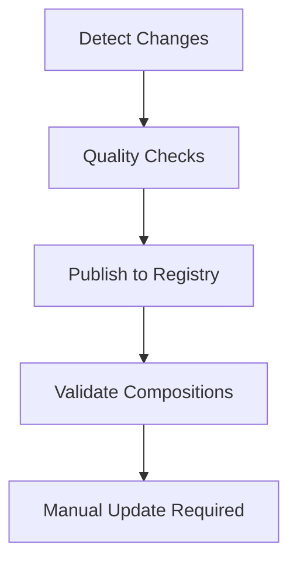

# KCL Modules for Crossplane

This directory contains KCL (Kusion Configuration Language) modules used by Crossplane compositions in the cloud-native-ref repository. Each module is published to GitHub Container Registry and can be referenced by Crossplane compositions.

## Modules

| Module | Version | Description | Registry |
|--------|---------|-------------|----------|
| `cloudnativepg` | v0.2.1 | CloudNativePG PostgreSQL operator resources | `ghcr.io/smana/cloud-native-ref/crossplane-cloudnativepg` |
| `eks-pod-identity` | v0.2.1 | EKS Pod Identity Association resources | `ghcr.io/smana/cloud-native-ref/crossplane-eks-pod-identity` |

## Development Workflow

### 1. Local Development

Each module follows this structure:

```
module-name/
├── kcl.mod           # Module metadata and version
├── kcl.mod.lock      # Dependency lock file
├── main.k            # Main module logic
├── *_test.k          # Test files (optional)
└── examples/         # Usage examples (optional)
```

### 2. Testing Locally

```bash
# Navigate to module directory
cd infrastructure/base/crossplane/configuration/kcl/cloudnativepg

# Format code
kcl fmt .

# Run linting
kcl lint .

# Run tests (if any)
kcl test .
# Run specific tests with pattern
kcl test . --run test_function_name
# Run tests with fail-fast
kcl test ./... --fail-fast

# Validate configuration
kcl run . -o /tmp/validation.yaml
```

### 3. Version Management

Update the version in `kcl.mod`:

```toml
[package]
name = "cloudnativepg"
edition = "0.11.3"  # KCL compiler version (without 'v' prefix)
version = "0.2.21"  # Module version - increment this
description = "CloudNativePG KCL module for Crossplane"
```

### 4. Automated Publishing

The CI/CD pipeline automatically:

1. **Quality Checks** (on PR and push):
   - Code formatting verification (`kcl fmt`)
   - Linting (`kcl lint`)
   - Test execution (`kcl test`)
   - Configuration validation

2. **Publishing** (on PR and main branch push):
   - **PR**: Publishes with `-pr{number}` suffix for testing
   - **Main**: Publishes with original version + `latest` tag
   - Publishes to GitHub Container Registry

3. **Composition Validation** (main branch only):
   - Validates that compositions reference the latest module versions
   - Fails workflow if versions are mismatched
   - Provides clear instructions for manual updates

## CI/CD Pipeline

The workflow is defined in [`.github/workflows/kcl-modules.yml`](../../../../../../.github/workflows/kcl-modules.yml).

### Triggers

- **Pull Requests**: Quality checks + PR preview publishing
- **Main Branch Push**: Full pipeline (quality checks + publishing + validation)
- **Path Filter**: Only runs when KCL files change

### Pipeline Stages



### Environment Variables

| Variable | Description | Example |
|----------|-------------|---------|
| `GITHUB_TOKEN` | Automatically provided for registry authentication | - |

## Manual Operations

### Publishing a Module Manually

```bash
# Set registry environment (if needed)
export KPM_REG=ghcr.io
export KPM_REPO=smana

# Publish module
cd infrastructure/base/crossplane/configuration/kcl/cloudnativepg
kcl mod push ghcr.io/smana/cloud-native-ref/crossplane-cloudnativepg:v0.2.1

# Pull/download module
kcl mod pull ghcr.io/smana/cloud-native-ref/crossplane-cloudnativepg:v0.2.1
```

### Updating Compositions Manually

```bash
# Update the composition YAML file directly
# Change the source field to the new version:
# source: oci://ghcr.io/smana/kcl-cloudnativepg:v0.2.1
```

## Usage in Crossplane Compositions

Reference the published modules in your Crossplane compositions:

```yaml
apiVersion: apiextensions.crossplane.io/v1
kind: Composition
metadata:
  name: xsqlinstances.cloud.ogenki.io
spec:
  mode: Pipeline
  pipeline:
    - step: cloudnativepg
      functionRef:
        name: function-kcl
      input:
        apiVersion: krm.kcl.dev/v1alpha1
        kind: KCLRun
        spec:
          target: Resources
          source: oci://ghcr.io/smana/kcl-cloudnativepg:v0.2.1
```

## Best Practices

### Code Quality

1. **Format Code**: Always run `kcl fmt .` before committing
2. **Write Tests**: Add `*_test.k` files for complex logic
3. **Validate Output**: Test your KCL generates valid Kubernetes manifests
4. **Version Appropriately**: Follow semantic versioning

### Module Design

1. **Single Responsibility**: Each module should handle one specific resource type
2. **Parameterization**: Use `oxr.spec` and environment configs for flexibility
3. **Error Handling**: Validate inputs and provide meaningful error messages
4. **Documentation**: Document module parameters and usage

### Security

1. **No Secrets**: Never include secrets in KCL code
2. **External Secrets**: Use External Secrets Operator for secret management
3. **Least Privilege**: Generated IAM policies should follow least privilege principle
4. **Validation**: Validate all external inputs

## Troubleshooting

### Common Issues

1. **Format Check Failures**:

   ```bash
   kcl fmt .
   git add -A && git commit -m "fix: format KCL code"
   ```

2. **Lint Warnings**:

   ```bash
   kcl lint . --format json
   # Fix issues shown in output
   ```

3. **Registry Push Failures**:
   - Check GitHub token permissions
   - Ensure package name doesn't conflict
   - Verify version isn't already published

4. **Composition Reference Issues**:
   - Check OCI URL format
   - Verify tag/version exists in registry
   - Ensure Crossplane can pull from registry

### Getting Help

- **KCL Documentation**: <https://kcl-lang.io/>
- **Crossplane Functions**: <https://docs.crossplane.io/latest/concepts/composition-functions/>

## Contributing

1. Fork the repository
2. Create a feature branch
3. Make changes to KCL modules
4. Test locally using the commands above
5. Create a pull request
6. CI will run quality checks
7. After merge to main, modules are automatically published

## Current Compositions

The following Crossplane compositions in this repository reference these KCL modules:

- [`sql-instance-composition.yaml`](../sql-instance-composition.yaml) - References `cloudnativepg` module
- [`epi-composition.yaml`](../epi-composition.yaml) - References `eks-pod-identity` module

### Current Status

Based on the composition files, the current module references are:

- **cloudnativepg**: `oci://ttl.sh/ogenki-cnref/cloudnativepg:v0.2.20-24h` (needs update to `ghcr.io/smana/kcl-cloudnativepg:v0.2.1`)
- **eks-pod-identity**: `oci://ttl.sh/ogenki-cnref/eks-pod-identity:v0.2.11-24h` (needs update to `ghcr.io/smana/kcl-eks-pod-identity:v0.2.1`)

When the workflow validation runs, it will detect these mismatches and provide instructions to update them to the GitHub Container Registry URLs.
