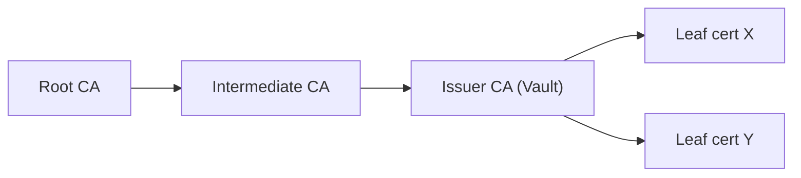

# Vault cluster

- [Architecture](#🏗️-architecture)
  - [High availability](#💪-high-availability)
- [Getting started](#🚀-getting-started)
- [PKI requirements](#🔑-public-key-infrastructure-pki-requirements)

## 🏗️ Architecture

### 💪 High availability

⚠️ You can choose between two modes when creating a Vault instance: `dev`  and `ha` (default: `dev`). Here are the differences between these modes:

|                    | Dev            |     HA        |
|--------------------|----------------|---------------|
| Number of nodes    |        1       |       5       |
| Disk type          |      hdd       |      ssd      |
| Vault storage type |      file      |     raft      |
| Instance type(s)   |    t3.micro    |   mixed (lower-price)    |
| Capacity type      |   on-demand    |     spot      |

#### ℹ️ Regarding the HA mode

In designing our production environment for HashiCorp Vault, I wanted a balance between performance and reliability. This led to several architectural decisions:

1. Cluster Reliability via **Raft** Protocol: We're leveraging the raft protocol for its robustness in ensuring cluster reliability. This consensus mechanism is widely recognized for its effectiveness in distributed systems and is particularly crucial in a production environment.

2. **Five-Node** Cluster Configuration: Best practices suggest a five-node cluster in production for optimal fault tolerance and availability. This setup significantly reduces the risk of service disruption, ensuring a high level of reliability.

3. Ephemeral Node Strategy with **SPOT Instance**s: In a move towards operational flexibility and cost efficiency, we've chosen to treat nodes as ephemeral. This approach enables us to utilize SPOT instances, which are more cost-effective than standard instances. While this might introduce some volatility in node availability, it aligns with our goal of optimizing costs.

4. Data Storage on **RAID0** Array: I've opted for a RAID0 array for data storage, prioritizing performance. RAID0 arrays offer faster data access and can enhance overall system performance. However, I'm aware that RAID0 does not offer redundancy. The Raft protocol as well as a robust backup/restore strategy should mitigate this risk.

5. Vault **Auto-Unseal** Feature: To accommodate the ephemeral nature of our nodes, we've configured Vault's auto-unseal feature. This ensures that if a node is replaced or rejoins the cluster, Vault will automatically unseal, minimizing downtime and manual intervention. This feature is crucial for maintaining seamless access to the Vault, especially in an environment where node volatility is expected.

This architecture is designed to strike a balance between performance, cost-efficiency, and resilience while embracing the **dynamic nature of cloud resources** for operational flexibility.

## 🚀 Getting started

1. First of all we need to create the **supporting resources** such as the VPC and subnets using [this directory](../../network/).

2. It is required to provide Vault's certificates (`.tls/vault.pem`, `.tls/vault-key.pem` and `ca-chain.pem`). You can create the certificates using [this procedure](#🔑-public-key-infrastructure-pki-requirements)

3. Prepare your `variables.tfvars` file:

```hcl
name                  = "ogenki-vault"                # Name of your Vault instance
leader_tls_servername = "vault.priv.cloud.ogenki.io"  # Vault domain name that will be exposed to users
domain_name           = "priv.cloud.ogenki.io"        # Route53 private zone where to provision the DNS records
env                   = "dev"                         # Environment used to tags resources
mode                  = "ha"                          # Important: More about this setting in this documentation.
region                = "eu-west-3"                   # Where all the resources will be created
enable_ssm            = true                          # Allow to access to the EC2 instances. Enabled for provisionning, but then it should be disabled.

tags = {                                              # In my case, these tags are also used to identify the supporting resources (VPC, subnets...)
  project = "demo-cloud-native-ref"
  owner   = "Smana"
}
```

4. Run the command `tofu apply --var-file variables.tfvars`

5. Connect to one of the EC2 instances using SSM and init the Vault instance:

Switch to the `root` user

Switch to the `root` user
```console
sudo su -
```

Initialize Vault as follows

```console
export VAULT_SKIP_VERIFY=true
vault operator init -recovery-shares=1 -recovery-threshold=1
```

You should get an output that contains the `Recovery Key` and the `Root Token`
```console
Recovery Key 1: 0vn2C31WbudlZS6...

Initial Root Token: hvs.LMKRyua5kJJ8...

Success! Vault is initialized
```


⚠️ **Important**: Throughout the entire installation and configuration process, it's essential to securely retain the `root` token. This token should be kept until all user accounts have been created. After this point, for enhanced security, the `root` token must be revoked.

Additionally, the `recovery key` requires careful handling. It should be securely stored in a highly safe location. Use the `recovery key` only in exceptionally rare situations, specifically when there is a need to generate a new `root` token. This key serves as a critical backup mechanism and should be treated with the utmost security.

6. Check that the cluster is working properly using the root token above

```console
vault login
```

List all the cluster peers (members of the Vault cluster)

```console
vault operator raft list-peers
```

you should get an output that looks like that
```console
Node                   Address             State       Voter
----                   -------             -----       -----
i-0ef3177199c5252c6    10.0.0.213:8201     leader      true
i-0ad5039408a66cb2c    10.0.10.226:8201    follower    true
i-0b26df9b89772e4c5    10.0.29.250:8201    follower    true
i-0c7e7cc9590ec721d    10.0.42.25:8201     follower    true
i-0118db2721ee07b6c    10.0.24.141:8201    follower    true
```

You can also check the cluster's status. The important information below is that Vault is "Initialized" and not "Sealed".
```console
vault status
Key                      Value
---                      -----
Recovery Seal Type       shamir
Initialized              true
Sealed                   false
Total Recovery Shares    1
Threshold                1
Version                  1.14.8
Build Date               2023-12-04T17:45:23Z
Storage Type             raft
Cluster Name             vault-cluster-6209d1c3
Cluster ID               a5055510-ab2d-3e91-8051-d58a3041a47d
HA Enabled               true
HA Cluster               https://10.0.0.213:8201
HA Mode                  active
Active Since             2024-01-05T08:20:52.862058318Z
Raft Committed Index     43
Raft Applied Index       43
```

## 🔑 Public Key Infrastructure (PKI): Requirements

We're going to build a **three-tier Public Key Infrastructure** (PKI) which consists of a Root Certificate Authority (CA) at the top, Intermediate CAs in the middle, and End Entities at the bottom. The Root CA issues certificates to the Intermediate CAs, which in turn issue certificates to end users or devices. This structure enhances security by minimizing the Root CA's exposure and simplifies management and revocation of certificates, offering a scalable and flexible solution for digital security.



⚠️ **Important:** All certificates will be stored in the directory `.tls`. This directory is ignored by git, as specified in the `.gitignore` file:

```
**/.tls/*
```

### Step1: Generate the Root CA

1. Create the Root CA key:

```console
openssl ecparam -genkey -name secp384r1 -out root-ca-key.pem
```

2. Create the Root CA certificate:

```console
openssl req -x509 -new -nodes -key root-ca-key.pem -sha384 -days 3653 -out root-ca.pem
```

During this process, you will be prompted to enter specific details:

```console
Country Name (2 letter code) [AU]:FR
State or Province Name (full name) [Some-State]:France
Locality Name (eg, city) []:Paris
Organization Name (eg, company) [Internet Widgits Pty Ltd]:Ogenki
Organizational Unit Name (eg, section) []: # left blank
Common Name (e.g. server FQDN or YOUR name) []:Ogenki
Email Address []:smaine.kahlouch@ogenki.io
```

⚠️ **Security Note**: For maximum security, store your Root CA in an offline, air-gapped environment such as a secure, physically isolated machine, a Hardware Security Module (HSM), or a securely stored USB device.

### Step2: Generate the intermediate CA

1. Create the private key:

```console
openssl ecparam -genkey -name secp384r1 -out intermediate-ca-key.pem
```

2. Generate the Certificate Sign Request (CSR):

```console
openssl req -new -key intermediate-ca-key.pem -out intermediate-ca.csr
```

Fill in the details as prompted, changing the Common Name and leaving the challenge password blank:

```console
Common Name (e.g. server FQDN or YOUR name) []:Ogenki Intermediate
```

3. Create the intermediate CA certificate:
A config file `intermediate-ca.cnf` is required:

```conf
[req]
distinguished_name = ogenki
req_extensions = v3_req
prompt = no

[ogenki]
C = FR
ST = France
L = Paris
O = Ogenki
CN = Ogenki Intermediate

[v3_req]
basicConstraints = critical,CA:true
extendedKeyUsage = serverAuth, clientAuth
keyUsage = critical, keyCertSign, cRLSign, digitalSignature, keyEncipherment
```

Execute this command to generate the Intermediate CA certificate:

```console
openssl x509 -req -in intermediate-ca.csr -CA root-ca.pem -CAkey root-ca-key.pem -CAcreateserial -out intermediate-ca.pem -days 1827 -sha384 -extfile intermediate-ca.cnf -extensions v3_req
```

### Step3: Create the certificate for the Vault instance

Generate the private key and a CSR for the Vault certificates. Use the `vault.cnf` config file:

```conf
[req]
distinguished_name = vault
req_extensions = v3_req
prompt = no

[vault]
C = FR
ST = France
L = Paris
O = Ogenki
CN = ogenki.io

[v3_req]
keyUsage = critical, digitalSignature, keyEncipherment
extendedKeyUsage = serverAuth, clientAuth
subjectAltName = @alt_names

[alt_names]
DNS.1 = vault.priv.cloud.ogenki.io
```

Generate the private key and CSR:

```console
openssl genrsa -out vault-key.pem 2048
openssl req -new -key vault-key.pem -out vault.csr -config vault.cnf
```

Create the certificate

```console
openssl x509 -req -in vault.csr -CA intermediate-ca.pem -CAkey intermediate-ca-key.pem -CAcreateserial -out vault.pem -days 365 -sha384 -extfile vault.cnf -extensions v3_req
```

### Generate the Full CA Chain and check

Concatenate the intermediate and root certificates, then verify the Vault's certificate:

```console
cat intermediate-ca.pem root-ca.pem > ca-chain.pem
openssl verify -CAfile ca-chain.pem vault.pem
```

Output should be `vault.pem: OK`.

To view the content of the Vault's certificate:

```console
openssl x509 -in vault.pem -noout -text
```

<!-- BEGINNING OF PRE-COMMIT-TERRAFORM DOCS HOOK -->
## Requirements

| Name | Version |
|------|---------|
| <a name="requirement_terraform"></a> [terraform](#requirement\_terraform) | ~> 1.4 |
| <a name="requirement_aws"></a> [aws](#requirement\_aws) | ~> 5.0 |
| <a name="requirement_cloudinit"></a> [cloudinit](#requirement\_cloudinit) | ~> 2.3 |

## Providers

| Name | Version |
|------|---------|
| <a name="provider_aws"></a> [aws](#provider\_aws) | ~> 5.0 |
| <a name="provider_cloudinit"></a> [cloudinit](#provider\_cloudinit) | ~> 2.3 |

## Modules

| Name | Source | Version |
|------|--------|---------|
| <a name="module_vault_asg"></a> [vault\_asg](#module\_vault\_asg) | terraform-aws-modules/autoscaling/aws | ~> 7.3 |

## Resources

| Name | Type |
|------|------|
| [aws_iam_instance_profile.this](https://registry.terraform.io/providers/hashicorp/aws/latest/docs/resources/iam_instance_profile) | resource |
| [aws_iam_role.this](https://registry.terraform.io/providers/hashicorp/aws/latest/docs/resources/iam_role) | resource |
| [aws_iam_role_policy.vault-kms-unseal](https://registry.terraform.io/providers/hashicorp/aws/latest/docs/resources/iam_role_policy) | resource |
| [aws_iam_role_policy_attachment.ec2_read_only](https://registry.terraform.io/providers/hashicorp/aws/latest/docs/resources/iam_role_policy_attachment) | resource |
| [aws_iam_role_policy_attachment.ssm](https://registry.terraform.io/providers/hashicorp/aws/latest/docs/resources/iam_role_policy_attachment) | resource |
| [aws_kms_key.vault](https://registry.terraform.io/providers/hashicorp/aws/latest/docs/resources/kms_key) | resource |
| [aws_launch_template.dev](https://registry.terraform.io/providers/hashicorp/aws/latest/docs/resources/launch_template) | resource |
| [aws_launch_template.ha](https://registry.terraform.io/providers/hashicorp/aws/latest/docs/resources/launch_template) | resource |
| [aws_lb.this](https://registry.terraform.io/providers/hashicorp/aws/latest/docs/resources/lb) | resource |
| [aws_lb_listener.this](https://registry.terraform.io/providers/hashicorp/aws/latest/docs/resources/lb_listener) | resource |
| [aws_lb_target_group.this](https://registry.terraform.io/providers/hashicorp/aws/latest/docs/resources/lb_target_group) | resource |
| [aws_route53_record.nlb](https://registry.terraform.io/providers/hashicorp/aws/latest/docs/resources/route53_record) | resource |
| [aws_security_group.nlb](https://registry.terraform.io/providers/hashicorp/aws/latest/docs/resources/security_group) | resource |
| [aws_security_group.vault](https://registry.terraform.io/providers/hashicorp/aws/latest/docs/resources/security_group) | resource |
| [aws_security_group_rule.allow_8200](https://registry.terraform.io/providers/hashicorp/aws/latest/docs/resources/security_group_rule) | resource |
| [aws_security_group_rule.vault_internal_api](https://registry.terraform.io/providers/hashicorp/aws/latest/docs/resources/security_group_rule) | resource |
| [aws_security_group_rule.vault_internal_raft](https://registry.terraform.io/providers/hashicorp/aws/latest/docs/resources/security_group_rule) | resource |
| [aws_security_group_rule.vault_network_lb_ingress](https://registry.terraform.io/providers/hashicorp/aws/latest/docs/resources/security_group_rule) | resource |
| [aws_security_group_rule.vault_outbound](https://registry.terraform.io/providers/hashicorp/aws/latest/docs/resources/security_group_rule) | resource |
| [aws_ami.this](https://registry.terraform.io/providers/hashicorp/aws/latest/docs/data-sources/ami) | data source |
| [aws_ecr_authorization_token.token](https://registry.terraform.io/providers/hashicorp/aws/latest/docs/data-sources/ecr_authorization_token) | data source |
| [aws_iam_policy_document.vault-kms-unseal](https://registry.terraform.io/providers/hashicorp/aws/latest/docs/data-sources/iam_policy_document) | data source |
| [aws_route53_zone.this](https://registry.terraform.io/providers/hashicorp/aws/latest/docs/data-sources/route53_zone) | data source |
| [aws_security_group.tailscale](https://registry.terraform.io/providers/hashicorp/aws/latest/docs/data-sources/security_group) | data source |
| [aws_subnets.private](https://registry.terraform.io/providers/hashicorp/aws/latest/docs/data-sources/subnets) | data source |
| [aws_vpc.selected](https://registry.terraform.io/providers/hashicorp/aws/latest/docs/data-sources/vpc) | data source |
| [cloudinit_config.vault_cloud_init](https://registry.terraform.io/providers/hashicorp/cloudinit/latest/docs/data-sources/config) | data source |

## Inputs

| Name | Description | Type | Default | Required |
|------|-------------|------|---------|:--------:|
| <a name="input_ami_filter"></a> [ami\_filter](#input\_ami\_filter) | List of maps used to create the AMI filter for the action runner AMI. | `map(list(string))` | <pre>{<br>  "name": [<br>    "ubuntu/images/hvm-ssd/ubuntu-lunar-23.04-amd64-server-*"<br>  ]<br>}</pre> | no |
| <a name="input_ami_owner"></a> [ami\_owner](#input\_ami\_owner) | Owner ID of the AMI | `string` | `"099720109477"` | no |
| <a name="input_domain_name"></a> [domain\_name](#input\_domain\_name) | The domain name for which the certificate should be issued | `string` | n/a | yes |
| <a name="input_enable_ssm"></a> [enable\_ssm](#input\_enable\_ssm) | If true, allow to connect to the instances using AWS Systems Manager | `bool` | `false` | no |
| <a name="input_env"></a> [env](#input\_env) | The environment of the Vault cluster | `string` | n/a | yes |
| <a name="input_leader_tls_servername"></a> [leader\_tls\_servername](#input\_leader\_tls\_servername) | One of the shared DNS SAN used to create the certs use for mTLS | `string` | n/a | yes |
| <a name="input_mode"></a> [mode](#input\_mode) | Vault cluster mode (default dev, meaning a single node) | `string` | `"dev"` | no |
| <a name="input_name"></a> [name](#input\_name) | Name of the resources created for this Vault cluster | `string` | `"vault"` | no |
| <a name="input_prometheus_node_exporter_enabled"></a> [prometheus\_node\_exporter\_enabled](#input\_prometheus\_node\_exporter\_enabled) | If set to true install and start a prometheus node exporter | `bool` | `false` | no |
| <a name="input_region"></a> [region](#input\_region) | AWS Region | `string` | `"eu-west-3"` | no |
| <a name="input_tags"></a> [tags](#input\_tags) | A map of tags to add to all resources | `map(string)` | `{}` | no |
| <a name="input_vault_data_path"></a> [vault\_data\_path](#input\_vault\_data\_path) | Directory where Vault's data will be stored in an EC2 instance | `string` | `"/opt/vault/data"` | no |

## Outputs

No outputs.
<!-- END OF PRE-COMMIT-TERRAFORM DOCS HOOK -->
