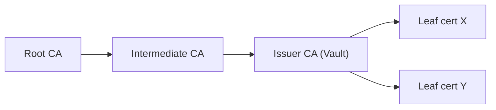

## 🔑 Public Key Infrastructure (PKI): Requirements

We're going to build a **three-tier Public Key Infrastructure** (PKI) which consists of a Root Certificate Authority (CA) at the top, Intermediate CAs in the middle, and End Entities at the bottom. The Root CA issues certificates to the Intermediate CAs, which in turn issue certificates to end users or devices. This structure enhances security by minimizing the Root CA's exposure and simplifies management and revocation of certificates, offering a scalable and flexible solution for digital security.



⚠️ **Important:** All certificates will be stored in the directory `.tls`. This directory is ignored by git, as specified in the `.gitignore` file:

```
**/.tls/*
```

### Step1: Generate the Root CA

1. Create the Root CA key:

```console
openssl ecparam -genkey -name secp384r1 -out root-ca-key.pem
```

2. Create the Root CA certificate:

```console
openssl req -x509 -new -nodes -key root-ca-key.pem -sha384 -days 3653 -out root-ca.pem
```

During this process, you will be prompted to enter specific details:

```console
Country Name (2 letter code) [AU]:FR
State or Province Name (full name) [Some-State]:France
Locality Name (eg, city) []:Paris
Organization Name (eg, company) [Internet Widgits Pty Ltd]:Ogenki
Organizational Unit Name (eg, section) []: # left blank
Common Name (e.g. server FQDN or YOUR name) []:Ogenki
Email Address []:smaine.kahlouch@ogenki.io
```

⚠️ **Security Note**: For maximum security, store your Root CA in an offline, air-gapped environment such as a secure, physically isolated machine, a Hardware Security Module (HSM), or a securely stored USB device.

### Step2: Generate the intermediate CA

1. Create the private key:

```console
openssl ecparam -genkey -name secp384r1 -out intermediate-ca-key.pem
```

2. Generate the Certificate Sign Request (CSR):

```console
openssl req -new -key intermediate-ca-key.pem -out intermediate-ca.csr
```

Fill in the details as prompted, changing the Common Name and leaving the challenge password blank:

```console
Common Name (e.g. server FQDN or YOUR name) []:Ogenki Intermediate
```

3. Create the intermediate CA certificate:
A config file `intermediate-ca.cnf` is required:

```conf
[req]
distinguished_name = ogenki
req_extensions = v3_req
prompt = no

[ogenki]
C = FR
ST = France
L = Paris
O = Ogenki
CN = Ogenki Intermediate

[v3_req]
basicConstraints = critical,CA:true
extendedKeyUsage = serverAuth, clientAuth
keyUsage = critical, keyCertSign, cRLSign, digitalSignature, keyEncipherment
```

Execute this command to generate the Intermediate CA certificate:

```console
openssl x509 -req -in intermediate-ca.csr -CA root-ca.pem -CAkey root-ca-key.pem -CAcreateserial -out intermediate-ca.pem -days 1827 -sha384 -extfile intermediate-ca.cnf -extensions v3_req
```

### Step3: Create the certificate for the Vault instance

Generate the private key and a CSR for the Vault certificates. Use the `vault.cnf` config file:

```conf
[req]
distinguished_name = vault
req_extensions = v3_req
prompt = no

[vault]
C = FR
ST = France
L = Paris
O = Ogenki
CN = ogenki.io

[v3_req]
keyUsage = critical, digitalSignature, keyEncipherment
extendedKeyUsage = serverAuth, clientAuth
subjectAltName = @alt_names

[alt_names]
DNS.1 = vault.priv.cloud.ogenki.io
```

Generate the private key and CSR:

```console
openssl genrsa -out vault-key.pem 2048
openssl req -new -key vault-key.pem -out vault.csr -config vault.cnf
```

Create the certificate

```console
openssl x509 -req -in vault.csr -CA intermediate-ca.pem -CAkey intermediate-ca-key.pem -CAcreateserial -out vault.pem -days 365 -sha384 -extfile vault.cnf -extensions v3_req
```

### Generate the Full CA Chain and check

Concatenate the intermediate and root certificates, then verify the Vault's certificate:

```console
cat intermediate-ca.pem root-ca.pem > ca-chain.pem
openssl verify -CAfile ca-chain.pem vault.pem
```

Output should be `vault.pem: OK`.

To view the content of the Vault's certificate:

```console
openssl x509 -in vault.pem -noout -text
```
