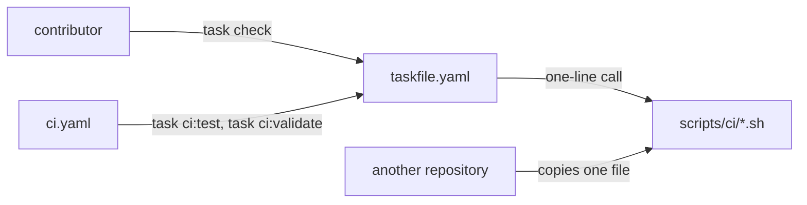

**Status**: Accepted
**Date**: 2026-09-17
**Deciders**: Smana (Platform Owner)

---

## Context

`scripts/` held 55 executables in one flat directory, and nothing pointed at the entry points.
There was no task runner; discovery was `ls scripts/` and a guess.

The cost showed in the tests. `ci.yaml` ran 11 suites from a hand-maintained list, defended by 60
lines of comment explaining why it was a list, and running what CI ran meant copying that list by
hand. Writing a suite and getting CI to run it were separate acts, and the second got forgotten:
the seven ZITADEL suites went unrun for months.

The repository is also a reference. Someone must be able to lift one script, or one gate, into
their own repository without adopting this one's tooling, so whatever indexes the scripts must
never become a dependency of them.

## Decision

go-task v3, as a lowercase `taskfile.yaml` at the root that includes `scripts/taskfile.yaml` under
the `ci:` namespace. It is pinned in `mise.toml` as `task = "3"`, so the `jdx/mise-action` every
CI job already runs installs it with no new action.

**Every task body is a one-line call to a script, with no logic in the taskfile.** go-task is how
you *find* a gate, never how you *run* one:

`task check` aggregates `ci:validate`, `ci:test` and `ci:links`, the same `check:` idiom as
`Smana/cilium-gateway-api` and `Smana/crossplane-configuration`.

## Alternatives rejected

| Option | Why not |
|---|---|
| A bespoke `./scripts/run` dispatcher | Nothing to install, but its argument parsing is code nobody outside this repository knows, maintained forever |
| Make | Tab-sensitive recipes. The owner's own repositories — `cilium-gateway-api`, `demo-tf-controller`, `dune-modem` — already use `taskfile.yaml` |
| Dagger | Already taken out of CI, for the reasons below |

### Dagger

This is the decision's only durable record. Before it, the repository held three comments in
`ci.yaml` that mention Dagger, and none says why it left.

| Date | Event |
|---|---|
| 2026-07-20 | Decided to take Dagger out of CI: engine startup overhead, and the upkeep of the `Smana/daggerverse` modules |
| 2026-08-23 | The last Dagger step left `ci.yaml` ([#1810](https://github.com/Smana/cloud-native-ref/pull/1810)). The `pre-commit-tf` module could not take a secret, so `tflint --init` fetched its ruleset unauthenticated and hit the API rate limit |
| 2026-09-12 | Reaffirmed. A crash-looping engine hung a `make lint` in `Smana/image-gallery` for 8 minutes with no output: the client blocks in its own retry loop rather than erroring when the engine is down |

An entry point exists to tell you what broke. One that can hang with no output fails at exactly
that.

## Consequences

- **CI and a contributor run the same commands.** CI's test and validation steps are `task ci:test`
  and `task ci:validate`; `task check` runs both plus `ci:links` before a push. Job names are
  unchanged, so the required-check list on `main` is untouched.
- **The suite list is gone.** `task ci:test` calls `scripts/ci/tests/run.sh`, which discovers
  suites instead of listing them, so a new suite is covered by the commit that adds it.
- **An adopter who does not want go-task copies a single `.sh`.** No script calls `task`.
- **One more pinned tool in `mise.toml`.**
