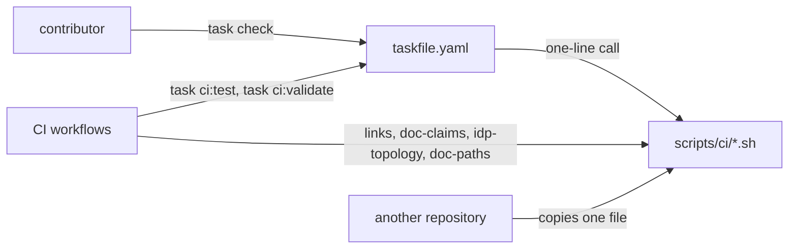

**Status**: Accepted
**Date**: 2026-09-17
**Deciders**: Smana (Platform Owner)

---

## Context

`scripts/` held 55 executables in one flat directory, and nothing pointed at the entry points.
There was no task runner; discovery was `ls scripts/` and a guess.

The cost showed in the tests. `ci.yaml` ran 19 of the 21 shell suites: 17 from a hand-maintained
list of 11 entries, one of them a glob over seven, and two more as named steps. The list was
defended by 60 lines of comment explaining why it was a list, and running what CI ran meant copying
it by hand. Writing a suite and getting CI to run it were separate acts, and the second got
forgotten: the seven ZITADEL suites went unrun for months.

The repository is also a reference. Someone must be able to lift one script, or one gate, into
their own repository without adopting this one's tooling, so whatever indexes the scripts must
never become a dependency of them.

## Decision

go-task v3, as a lowercase `taskfile.yaml` at the root that includes `scripts/tasks.yaml` under the
`ci:` namespace. The included file is deliberately not named `taskfile.yaml`: go-task stops its
upward search at the first taskfile it finds, so from anywhere under `scripts/` that name would
shadow the root one and no `ci:*` task would exist.

go-task is pinned to an exact version in `mise.toml`, like every other tool there. The Kubernetes
validation job, the one CI job that calls `task`, already runs `jdx/mise-action`, so it installs
go-task with no new action.

**Every task body is a one-line call to a script, with no logic in the taskfile.** go-task is how
you *find* a gate, never how you *run* one:

`task check` runs every `scripts/ci` gate CI runs. It is the same `check:` idiom as
`Smana/cilium-gateway-api`. Separately, `Smana/crossplane-configuration`, whose compositions this
repository pins, already uses `task check`.

## Alternatives rejected

| Option | Why not |
|---|---|
| A bespoke `./scripts/run` dispatcher | Nothing to install, but its argument parsing is code nobody outside this repository knows, maintained forever |
| Make | Tab-sensitive recipes. The owner's own repositories — `cilium-gateway-api`, `demo-tf-controller`, `dune-modem` — already use `taskfile.yaml` |
| Dagger | Already taken out of CI, for the reasons below |

### Dagger

This is the only durable record of the decision to take Dagger out of CI: why it was made, and
that it covers every job. The comments in `ci.yaml` explain one step's removal, not the decision.

| Date | Event |
|---|---|
| 2026-07-20 | **Decided.** Engine startup took about 2m of a ~2m37s pre-commit run, and every `Smana/daggerverse` module is code to maintain |
| 2026-08-23 | **Completed** ([#1810](https://github.com/Smana/cloud-native-ref/pull/1810)). The `pre-commit-tf` module could not take a token, so its tflint hit GitHub's anonymous rate limit. Because of the 07-20 decision, a fix to the module was dropped and the step moved to plain workflow steps, the last Dagger step in CI |
| 2026-09-12 | **Reaffirmed**, after an incident the owner recorded. A headless `make lint` in `Smana/image-gallery` hung 8 minutes with no output while the engine sat in a crash-restart loop. The CLI blocks in its own connect/retry loop rather than erroring when the engine is down, and `docker stop` on the engine did not free it; only `kill -9` did |

An entry point exists to tell you what broke. One that can hang with no output fails at exactly
that.

## Consequences

- **`task check` is every `scripts/ci` gate CI runs, in one command.** CI spreads the same gates
  over jobs, because a required check is a job: the Kubernetes validation job runs `task ci:test`
  and `task ci:validate`, the links job calls three scripts directly, and `docs-check.yml` calls
  `verify-doc-paths.sh`. Job names are unchanged, so the required-check list on `main` is
  untouched.
- **The suite list is gone.** `task ci:test` calls `scripts/ci/tests/run.sh`, which discovers
  suites instead of listing them, so a new suite is covered by the commit that adds it.
- **An adopter who does not want go-task copies a single `.sh`.** No script calls `task`.
- **`check` is a hand-kept mirror of the workflows.** Which gates CI runs is decided in
  `.github/workflows/`; `check` repeats that list, and nothing fails when the two drift. The "keep
  in step" note in `taskfile.yaml` is the only guard.
- **One more pinned tool in `mise.toml`.**
