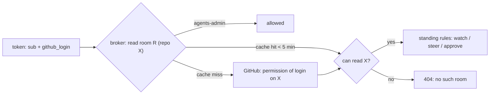

**Status**: Accepted
**Date**: 2026-10-08
**Deciders**: Smana (Platform Owner)
**Related Spec**: [Agent factory: local-first developer UX](https://github.com/Smana/cloud-native-ref/blob/main/docs/superpowers/specs/2026-10-08-agent-factory-local-first-ux-design.md)

---

## Context

Developers live in a local coding agent or IDE and will not open a browser room to hand off a side
task. The room shows raw events, and one broker serves every repo, where any `agents-member` reads
every room. A room holds the issue, code the agent read, diffs and tool output, so with a second team
or a private repo it becomes a way to read a repo around GitHub's own permissions. Three choices had
credible alternatives; the rest of the [design](https://github.com/Smana/cloud-native-ref/blob/main/docs/superpowers/specs/2026-10-08-agent-factory-local-first-ux-design.md)
did not.

---

## Decision Drivers

- One artefact every local agent reads, with no new server or auth path
- Each call visible in the developer's own transcript
- A "where are we" view that is exact, cheap and cannot hallucinate
- One source of truth for who may read a room, where developers' access already lives

---

## Considered Options

### D2: how a local agent talks to the factory

| Option | Verdict |
|---|---|
| **Agent Skill (`.agents/skills`) + `roomctl`** | Chosen: one open format, one binary, the procedure (draft, file, never label) lives in the skill |
| A local MCP server (`roomctl mcp`) | Rejected for v1: a second server and auth path to run; calls hidden behind a tool boundary; revisit only if a target agent cannot run a shell |

### D3: the room's top layer

| Option | Verdict |
|---|---|
| **Deterministic fold of the room log, plus agents' progress notes** | Chosen: exact, cheap, testable; the notes carry the *why* without a second model |
| An LLM narrating the room | Rejected: costs tokens, lags the run, and summarises untrusted agent text |

### D7: who may read a room

| Option | Verdict |
|---|---|
| **Follow GitHub: readable if and only if the repo is readable; admins bypass** | Chosen: a room is derived from its repo, so it inherits the repo's permission; no second system to drift |
| Per-repo groups mirrored in ZITADEL | Rejected: a second permission system to keep in step with GitHub |
| Every `agents-member` reads all rooms (today) | Rejected: a room leaks a private repo to anyone in the group |

---

## Decision Outcome

**Chosen**: the skill plus `roomctl` (D2), the deterministic summary plus notes (D3), and
GitHub-backed room visibility (D7).

D7 in one line: the broker asks GitHub, with the factory App's installation token, whether the
caller's `github_login` can read the room's repo, caches the answer for at most 5 minutes, and fails
closed on non-admins when GitHub cannot be reached and the cache is stale. GitHub read access lets
you see a room; it never grants steering or approving, which stay with the existing standings.
Details: [spec, "Rooms across repos"](https://github.com/Smana/cloud-native-ref/blob/main/docs/superpowers/specs/2026-10-08-agent-factory-local-first-ux-design.md).

---

## Consequences

### Positive

- One skill file works across Claude Code, Codex, Cursor and Gemini CLI; no server to run locally.
- The summary is a versioned contract (`summary/v1`) tested with golden fixtures.
- A room is never more visible than its repo; revocation lags by at most the cache.

### Negative

| Cost | Mitigation |
|---|---|
| Users must link a GitHub identity in ZITADEL; without a `github_login` claim non-admins see no rooms | `roomctl rooms` explains how to link it |
| Reads depend on the GitHub API | 5-minute cache; fail closed for non-admins past it |
| The WebSocket answers 404 `no such room` instead of 403 `not_permitted` for a known room the caller may not read | Intended: a 403 would confirm the room exists |
| Progress notes are untrusted text, and the developer's own local agent is now a reader | Returned under `notes.untrusted: true`, the skill treats them as data, the web page escapes them |
| The "never apply a label" rule in the skill is advice, not a control | The enforceable gate is server-side: only a maintainer's label starts work |

### Neutral

- Rooms created before this change have no repo and are admin-only until the factory backfills them.
- An MCP server stays a later option, not a rejected one.

---

## References

- [Spec: local-first developer UX](https://github.com/Smana/cloud-native-ref/blob/main/docs/superpowers/specs/2026-10-08-agent-factory-local-first-ux-design.md)
- [ADR-0049](): `roomctl` never approves or steers
- [ADR-0044](): the room log the summary folds
