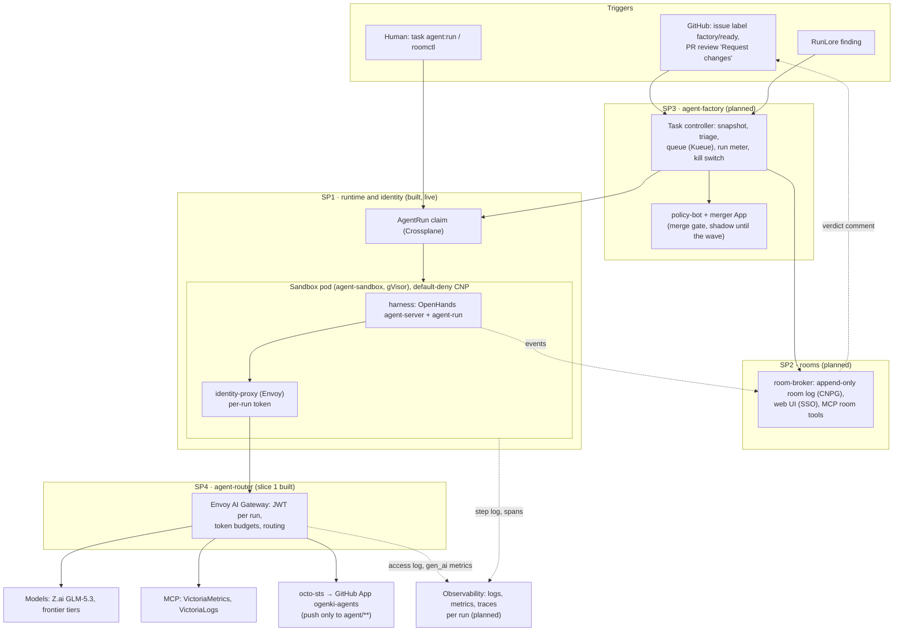


**Work in progress.** This section describes the target design. SP1 and SP4 slice 1 are built and
proven live on `aws-0`, but none of it is merged to `main` yet. SP2, SP3 and the observability slice
are planned. The owner merges the whole programme only after a UX sign-off.


## What it is

The LLM platform serves models; the agent factory puts them to work. A maintainer labels an issue,
and agents (an implementer, then a reviewer) work it on their own branch in a gVisor sandbox. They
open a pull request and narrate on the issue as they go. Humans steer through GitHub reviews, or by
joining the agents' room. Only policy-defined low-risk changes merge themselves; everything else
waits for a human.

## New here? The ideas in two minutes

| Term | In plain words |
|---|---|
| **Agent** | A language model in a loop: it reads a task, runs tools (shell, git, file edits, queries), looks at the result and decides the next step, until the task is done or its budget runs out |
| **Harness** | The program that runs that loop inside the sandbox. Here it is [OpenHands](https://github.com/OpenHands/software-agent-sdk), wrapped by a small `agent-run` entrypoint that clones the repository, starts the conversation and prints a step log |
| **Run** | One agent, one role, one task, one branch, with a deadline. Declared as an `AgentRun` object in Kubernetes |
| **Role** | What a run is allowed to do. An *implementer* pushes to its own `agent/<id>` branch and opens a PR; a *reviewer* reads and comments |
| **Sandbox** | The pod a run lives in, isolated by [gVisor](https://gvisor.dev) (a user-space kernel), with no credentials of its own and a network policy that denies everything not named |
| **Run identity** | A token issued for that run only. Every call the agent makes, to a model, a tool or GitHub, carries it, so every action is attributed to the run that made it |
| **agent-router** | The gateway every agent call goes through: it checks the run's token, counts its tokens against budgets and routes to the model |
| **Room** | *(planned)* A shared, append-only log of a task: what each agent did, what humans said, which approvals were given. Humans watch it live and can post into it |
| **Factory** | *(planned)* The controller that turns a labelled issue into runs, narrates progress on the issue, enforces budgets and owns the kill switch |
| **Merge gate** | *(planned)* The rule that decides which agent PRs may merge themselves: only low-risk classes, only with green CI |

The agent in the loop is not a trusted component. Every control sits **outside the sandbox**:
- network policy;
- per-run identity;
- scoped, short-lived GitHub tokens;
- branch rulesets;
- token budgets;
- the merge gate.

## Architecture

| Piece | What it does | Status |
|---|---|---|
| **SP1** runtime and identity | An `AgentRun` claim composes a ServiceAccount, a task ConfigMap, a default-deny CiliumNetworkPolicy and an agent-sandbox `Sandbox` under gVisor. The pod runs the harness (OpenHands) behind an identity proxy. GitHub tokens come from octo-sts, scoped per role and run. | Built; live-proven (issue #2112 → PR #2114, merged) |
| **SP4** agent-router | One gateway for every agent call: verifies the run's token, meters tokens per run, routes to the model tier, proxies MCP and the token exchange. | Slice 1 built |
| **SP2** rooms | A room per task: an append-only log of everything the agents and humans say and do, a live web view, messages to the next run, approvals, forks. | Planned |
| **SP3** factory | Intake from labels and reviews, triage, the team sequence, budgets, the kill switch, and the merge gate. | Planned |
| Observability | One Grafana page per run: status, logs, metrics, traces. | Designed, next to build |

## Security boundaries

| Boundary | Mechanism |
|---|---|
| Code execution | gVisor sandbox, restricted pod security, no service-account token in the harness |
| Network | Default-deny CNP per run; egress only to named FQDNs and the gateway |
| Identity | A projected token per run, one audience per data class, living until the run's deadline |
| GitHub | Short-lived installation tokens from octo-sts, scoped to one repository and the role's permissions; a ruleset lets the agents' App push only `agent/**` |
| Spend | Per-run deadline; token budgets at the gateway; SP3's run meter enforces `maxTokens` |
| Merge | Only low-risk classes (`docs-links`, `revert`) auto-merge, through policy-bot and a separate merger App; everything else waits for a human |
| Stop | One label on a pinned control issue stops intake, refuses new runs and revokes every running one |

## Design documents

- [Programme design](https://github.com/Smana/cloud-native-ref/blob/main/docs/superpowers/specs/2026-09-23-agent-factory-design.md): contracts C1–C7 and the owner decisions.
- [SP1](https://github.com/Smana/cloud-native-ref/blob/main/docs/superpowers/specs/2026-09-23-agent-runtime-identity-design.md) · [SP2](https://github.com/Smana/cloud-native-ref/blob/main/docs/superpowers/specs/2026-09-23-agent-collaboration-rooms-design.md) · [SP3](https://github.com/Smana/cloud-native-ref/blob/main/docs/superpowers/specs/2026-09-23-agent-dark-factory-design.md) · [Observability](https://github.com/Smana/cloud-native-ref/blob/main/docs/superpowers/specs/2026-09-27-agent-observability-design.md)
- [User guide](): what a developer does with it.
