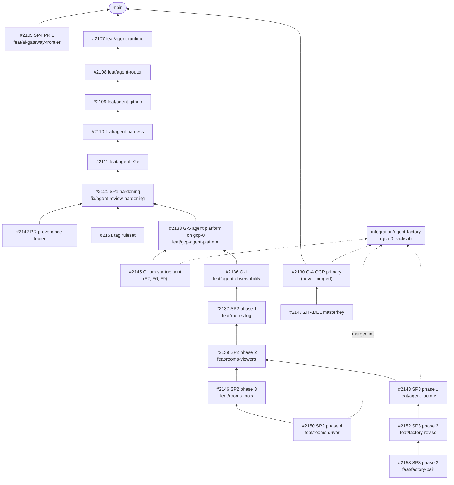


**Held until the owner's UX sign-off (ruling P33).** No programme PR merges, and no release is
tagged, until the whole programme is built and the owner agrees on the experience after a live
end-to-end walkthrough: label, room, request changes, approve, merge. Until then everything is
validated on `integration/agent-factory`, a never-merged branch that gcp-0 tracks, using
pre-release images and packages. Only designs, plans, docs and platform fixes found on the way
reach `main`.


**As of 2026-10-01**: SP1, O-1 and the first four SP2 phases are built, reviewed and running on
gcp-0. SP3 has three of its ten phases built. GCP parity is complete enough to host the
programme. Live gates are partly passed, with findings still open.

## Where each piece stands

| Sub-project | Phases | State | PRs (cloud-native-ref) | Live evidence |
|---|---|---|---|---|
| **SP1** runtime and identity | 0–6 + hardening | Built, reviewed, **live-verified** | [#2107](https://github.com/Smana/cloud-native-ref/pull/2107) → [#2108](https://github.com/Smana/cloud-native-ref/pull/2108) → [#2109](https://github.com/Smana/cloud-native-ref/pull/2109) → [#2110](https://github.com/Smana/cloud-native-ref/pull/2110) → [#2111](https://github.com/Smana/cloud-native-ref/pull/2111) → [#2121](https://github.com/Smana/cloud-native-ref/pull/2121) (hardening), [#2142](https://github.com/Smana/cloud-native-ref/pull/2142) (PR provenance footer), [#2151](https://github.com/Smana/cloud-native-ref/pull/2151) (tag ruleset) | aws-0, 2026-09-27: an agent took issue #2112 to PR [#2114](https://github.com/Smana/cloud-native-ref/pull/2114), merged. gcp-0, 2026-10-01: the same check passed again ([#2141](https://github.com/Smana/cloud-native-ref/pull/2141)); the `agent-branches` and `agent-tags` rulesets are active |
| **SP2** rooms | 0.5 hardening, 1 log, 2 viewers, 3 tools, 4 driver | Built, reviewed, **live gates partly passed** | [#2137](https://github.com/Smana/cloud-native-ref/pull/2137) → [#2139](https://github.com/Smana/cloud-native-ref/pull/2139) → [#2146](https://github.com/Smana/cloud-native-ref/pull/2146) → [#2150](https://github.com/Smana/cloud-native-ref/pull/2150) | gcp-0 round 9: log 12 pass / 2 fail (F12, F15) / 1 owner step; viewers 3/1 (F14) and 6 pass / 2 blocked / 5 owner steps; driver 1 pass / 5 owner steps |
| **SP2** rooms | 5 approvals | **In progress**: two of its tasks built and reviewed, the third under way | agent-platform [#11](https://github.com/Smana/agent-platform/pull/11); no cloud-native-ref PR yet | — |
| **SP2** rooms | 6 fork and `roomctl`, 7 UX checkpoint | Not started | — | — |
| **SP3** factory | 1 issue to narrated run, 2 revise from the PR, 3 pair template | Built and reviewed; phase 1 is on `integration` | [#2143](https://github.com/Smana/cloud-native-ref/pull/2143) → [#2152](https://github.com/Smana/cloud-native-ref/pull/2152) → [#2153](https://github.com/Smana/cloud-native-ref/pull/2153) | Not yet: the live gates follow SP2's |
| **SP3** factory | 4 triage and teams to 10 merge wave | Not started (Kueue arrives with phase 4) | — | — |
| **SP4** model routing and budgets | PR 1 frontier tier and shadow budgets | Built, reviewed, carried on `integration` | [#2105](https://github.com/Smana/cloud-native-ref/pull/2105) | None recorded in the programme ledgers |
| **SP4** model routing and budgets | PR 2 Bedrock and per-run budgets on the agent router | Not built | — | — |
| **O-1** per-run observability | 1 composition, 2 platform, 3 live | Built, reviewed, **live gates partly passed** | [#2136](https://github.com/Smana/cloud-native-ref/pull/2136) | gcp-0: 9 pass / 1 fail (F18) / 2 owner steps |
| **GCP parity** | G-0 to G-3 | **Merged** to `main` | [#2122](https://github.com/Smana/cloud-native-ref/pull/2122), [#2123](https://github.com/Smana/cloud-native-ref/pull/2123), [#2125](https://github.com/Smana/cloud-native-ref/pull/2125), [#2126](https://github.com/Smana/cloud-native-ref/pull/2126) | gcp-0 rebuilt 2026-09-30 from the restored OpenBao lineage; SSO proven on Grafana, Headlamp, Flux UI, Harbor and OpenBao |
| **GCP parity** | G-4 GCP as primary cloud | Integration only, never merged | [#2130](https://github.com/Smana/cloud-native-ref/pull/2130) | gcp-0 hosts ZITADEL |
| **GCP parity** | G-5 agent platform on gcp-0 | Built, reviewed, held with the programme | [#2133](https://github.com/Smana/cloud-native-ref/pull/2133) | Agent secrets synced, every agent Kustomization Ready; platform checks 6 pass / 2 fail (F1) / 4 owner steps |

Companion PRs live in two other repositories, stacked the same way:
[Smana/agent-platform](https://github.com/Smana/agent-platform/pulls) (room broker, bridge and
factory: #5–#12) and
[Smana/crossplane-configuration](https://github.com/Smana/crossplane-configuration/pulls)
(AgentRun and SQLInstance compositions: #27, #29–#35). Their pre-releases are what the
cloud-native-ref PRs pin.

## How the PRs stack

Each PR is based on the one below it, merge-only and never rebased. Fixes land on the PR that owns
them and are merged up the chain. `integration/agent-factory` merges every head for the live
cluster.

SP3's phases 2 and 3 (#2152, #2153) wait for SP2's live gates to finish before they join
`integration`, so the room broker is not swapped mid-gate.

## Live findings on gcp-0

Found by the live gates since the gcp-0 rebuild. Platform fixes go to `main`; programme fixes ride
their PR.

| # | Finding | State |
|---|---|---|
| F1 | The OpenBao snapshot job could not read the object it uploads (missing `storage.objects.get`) | **Fixed**, merged to `main` ([#2144](https://github.com/Smana/cloud-native-ref/pull/2144)) |
| F2 | Run pods landed on a fresh gVisor node before Cilium and ran up to ~2 minutes without their network policy | **Fixed and verified live**: Cilium's startup taint on every pool ([#2145](https://github.com/Smana/cloud-native-ref/pull/2145)) |
| F3 | The `CPUS_ALL_REGIONS` quota (26 of 32) blocks `e2-standard-8` nodes | **Waiting** on a requested quota increase |
| F4 | Runbook 08's observability steps existed only in the plan | **Fixed** on `integration` |
| F5 | Crossplane never upgraded the core Configuration dependency, so the room broker failed dry-run | **Worked around live** (Configuration patched); a PR enabling dependency upgrades is a follow-up |
| F6 | GKE refuses `kubernetes.io` taint keys on ComputeClasses, which wedged `infrastructure` | **Fixed** in #2145, applied |
| F7 | The room broker's certificate had no CN, and the PKI role signed only the private domain | **Fixed** in #2150, applied; aws-0 needs the same PKI change |
| F8 | The rooms SSO client was missing on gcp-0 | **Fixed** by re-running the client sync; why the deploy's sync skipped it is a follow-up |
| F9 | `cilium-agent` was OOM-killed twice on new nodes | **Fix staged** in #2145 (higher requests and limits); applied after the running live gates |
| F10 | The bridge-to-broker event stream resets every 10 s (write deadline shorter than the ping interval) | **Fix in progress** (agent-platform) |
| F11 | Short conversations lose their whole transcript: the harness exits before the bridge's next poll during the gVisor cold start | **Fix in progress** (agent-platform) |
| F12 | A deleted or evicted run pod is re-created by its Sandbox and the task restarts from scratch | Open |
| F13 | The live-gate step greps for `room_busy`, but the broker logs "room busy", so it never matches; busy refusals are not counted in a metric either | Open (plan text, low) |
| F14 | `cnpg-promote-seed.sh --cloud gcp` nests the seed one level too deep | Open; recovered by hand, recovery patch validated |
| F15 | A run refused the room lease still executes its task, unrecorded, on the shared branch, and is reported succeeded | Open |
| F16 | MCP calls are not joined to the run's trace | Open |
| F17 | Runbook 08's GCP commands have bugs | Open (docs) |
| F18 | `agentrun_outcome_info` is never emitted for a successful run | Open |

One more gap closed live on 2026-10-01: the agents' GitHub App could create `refs/tags/agent/*`,
since the ruleset covered branches only. The `agent-tags` ruleset ([#2151](https://github.com/Smana/cloud-native-ref/pull/2151))
is now active.

**agentgateway is selected (2026-10-01).** Its PoC passed on gcp-0, so it replaces the agent
router's Envoy AI Gateway for models, MCP and the `sts` listener; `ai-gateway` stays on Envoy Gateway
and Agent Router. An ADR superseding ADR-0042, and ADR-0050's Option 1 for the agent router, follows
([gap matrix](https://github.com/Smana/cloud-native-ref/blob/main/docs/superpowers/specs/2026-10-01-agentgateway-gap-matrix-research.md)).

## Waiting on the owner

| Decision | Why it matters |
|---|---|
| UX sign-off (P33) after the end-to-end walkthrough | Unblocks the merge wave for every programme PR |
| CI on stacked PRs | Workflows run only for PRs based on `main`, so the stacked PRs get no GitHub CI; local `validate-manifests.sh` stands in |
| Rooms UX: invite and close in the UI; re-fetching a recorded run's claim | Raised for SP2's UX checkpoint |
| Factory UX: a time limit for escalated tasks | Escalated tasks poll GitHub every 5 minutes until closed |
| Owner-only live steps | Steps that need the owner's tokens or a literal write probe (for example the room log's `UPDATE` refusal) |
| Pending platform PRs to `main`: [#2132](https://github.com/Smana/cloud-native-ref/pull/2132), [#2120](https://github.com/Smana/cloud-native-ref/pull/2120) | Owner review; not merge-on-green |

## Sources

The programme's working ledgers (outside the repository) and the PRs above. Designs and plans:
[programme design](https://github.com/Smana/cloud-native-ref/blob/main/docs/superpowers/specs/2026-09-23-agent-factory-design.md),
[SP2 plan](https://github.com/Smana/cloud-native-ref/blob/main/docs/superpowers/plans/2026-09-27-agent-collaboration-rooms-plan.md),
[SP3 plan](https://github.com/Smana/cloud-native-ref/blob/main/docs/superpowers/plans/2026-09-27-agent-dark-factory-plan.md),
[O-1 plan](https://github.com/Smana/cloud-native-ref/blob/main/docs/superpowers/plans/2026-09-27-agent-observability-plan.md).
Ecosystem research: [2026-10-01 re-check](https://github.com/Smana/cloud-native-ref/blob/main/docs/superpowers/specs/2026-10-01-agent-ecosystem-recheck-research.md).
