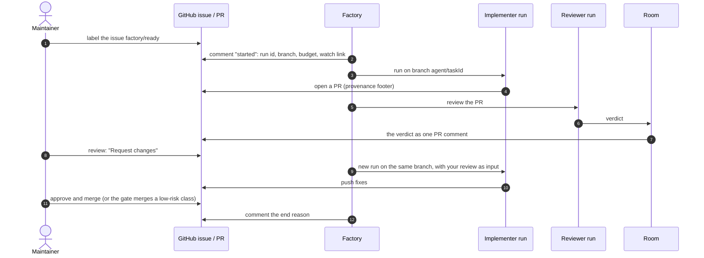


**Work in progress.** Part 1 describes the **target experience** once rooms and the
factory are built. It exists so the experience can be agreed *before* it is built, and it will
change. Part 2 is **what works today** on the `aws-0` test cluster. Nothing here is on `main` yet.


New to the vocabulary (run, role, sandbox, room)? Read
[the overview]() first; it takes two minutes.

## Before you start

| You need | Why |
|---|---|
| Access to the tailnet | The room UI, Grafana and the cluster API are private |
| SSO membership in `agents-member` | To watch rooms and runs. Requesting `internal` work or a `triager` run needs `agents-admin` |
| Maintainer rights on the repository | Labels, reviews and merges are how you steer. The agents never merge on their own, except for the low-risk classes below |
| Rights to create `AgentRun`s in `agents` (Part 2 only) | Until the factory exists runs are created by hand, today by the platform owner |

---

## Part 1: the target experience (planned)

### The whole journey at a glance



### 1. Hand over an issue

Write the issue the way you would for a colleague: what is wrong, where, and what "done" looks like.
Then add the label **`factory/ready`** and walk away.

The factory takes a **snapshot** of the issue at that moment. The agents work from that snapshot,
so an edit made later does not change a task already under way. It then triages the task once:
- which class the task is, for example `docs-links`;
- which team of roles works it;
- how big a budget it gets.

If it refuses the task, it says why in a comment. A task already running refuses a second label.

### 2. Follow it

You never have to open a terminal. Three places show progress, from the most summarised to the most
detailed:

| Where | What you see |
|---|---|
| **The issue** | One comment when the task starts (run id, branch, budget, a *watch* link), one when a PR opens, one with the end reason |
| **The room** (the *watch* link) | Live: every step each agent takes, their messages, the handoffs between roles, approvals asked and given |
| **The run's dashboard** in Grafana | The run's status, its step log, its model calls with tokens and latency, and a trace of where the time went. See [Observability](#observability-what-you-can-inspect) |

### 3. Review the pull request

The PR is opened by the agents' bot on a branch `agent/<task>`. Its body ends with a
**provenance footer**:

```text
---
Agent-Room: 7hq2mc4d
Agent-Run: zma62cms
Agent-Role: implementer
Agent-Model: agent-default
```

`Agent-Model` is the alias the run asked for. A run started from an issue or PR URL also carries
`Agent-Task: <url>`.

A reviewer agent reads the PR and records its **verdict** in the room, which posts it on the PR as one
comment. That comment is advice only:
it neither approves nor blocks. The decision stays yours.

### 4. Steer it

| You want to… | Do this |
|---|---|
| Ask for changes | A normal GitHub review with **"Request changes"**. Your review becomes the input of a new run on the same branch |
| Accept the work | Approve and merge as usual |
| Try again after a failure | Comment **`/factory retry`** |
| Add context while it runs | If you are a collaborator in the room, post a message there: it is queued for the next run |

The **merge gate** merges nothing but two low-risk classes, and only once CI and the policy agree:
`docs-links` (fixing broken links) and `revert` (the factory's revert of an auto-merged `docs-links`
change, same paths and size limits). Until everything is built and merged, it runs in **shadow
mode**: it says in the issue what it *would* merge, and merges nothing.

### 5. Stop it

| Scope | How |
|---|---|
| **One task** | Add the label **`factory/stop`** to its issue or PR. Its runs are revoked; its branch stays |
| **Everything, now** | Add the label **`factory/stop`** to the pinned *control issue*. Intake stops, new runs are refused, and every running run is revoked, including runs started by hand. Remove the label to resume |
| One run you started by hand | See [Part 2](#stop-or-resume) |

An interrupted run keeps its branch. Its work resumes from there.

### Budgets and costs

Three limits keep a task from running away:
- **Each run has a deadline.** The sandbox is stopped when it expires.
- **Each run has a token budget.** The factory's run meter revokes the run when it is spent.
- **The factory has a daily cap.** New tasks wait when it is reached.

Every model call is metered per run at the gateway, so the dashboard shows what a task cost.

---

## Part 2: what works today (`aws-0`)

Today there is no factory and no room: **you** start a run from a terminal with cluster access, and
it does the rest. This is how issue #2112 became PR #2114.

### Start a run

```bash
task agent:run -- --role implementer --class public \
  --task-url https://github.com/Smana/cloud-native-ref/issues/2112
# prints the run's name on its last line, e.g. xplane-run-zma62cms
```

| Flag | Meaning |
|---|---|
| `--role` | `implementer` (pushes to `agent/<id>`, opens a PR), `reviewer`, `tester`, `triager` |
| `--class` | `public` for this public repository. `internal` has no model route yet |
| `--repo` | The repository to work on, `owner/name` (default: this repository, today the only one the agents' App is installed on) |
| `--task-url` or `--task` | The issue or PR to work on, or the task as text |
| `--minutes` | Deadline, 1–480 (default 120) |
| `--size` | `small`, `medium` or `large`: CPU, memory and scratch space |
| `--branch` | Continue an earlier run's branch `agent/<id>` |
| `--profiles` | Extra package-registry egress: `pypi`, `npm`, `golang`, `crates` |
| `--dry-run` | Validate the claim server-side without creating it |

### Follow it

```bash
kubectl get agentrun -n agents -w                 # phase: Pending → Running → Succeeded
kubectl logs -n agents <run> -c harness | grep "agent-run"
```

The step log reads like this:

```text
agent-run step 3: terminal | List observability docs | ls observability/
agent-run step 7: file_editor | Fix the broken link | observability/AGENTS.md
agent-run summary: 10 steps
```

| Phase | Meaning |
|---|---|
| `Pending` | Waiting for a node or pulling the image |
| `Running` | The agent is working |
| `Succeeded` | Finished. Its branch is in the `BRANCH` column; find the PR with `gh pr list --head <branch>` (`status.pullRequest` is filled once the factory exists) |
| `Failed` | The harness failed, the deadline passed, or the pod was lost. `status.reason` is always `PodFailed`: read the step log |
| `Revoked` / `BudgetExhausted` | Stopped by hand with the `agents.ogenki.io/revoked` annotation. Nothing enforces the token budget yet; the factory's run meter will |

### Stop or resume

```bash
kubectl delete agentrun -n agents <run>          # stops it; its GitHub token is revoked on the way out
task agent:run -- --role implementer --class public --branch agent/<id> --task-url <same issue>
```

A run that loses its pod (a node going away, for example) **fails** rather than silently
restarting. Resuming with `--branch` continues from what it already pushed.

---

## Observability: what you can inspect

| Question | Today | Planned (one Grafana page per run) |
|---|---|---|
| Where is my run? | `kubectl get agentrun -n agents` | Status panel: phase, reason, PR, tokens vs budget |
| What did it do? | The step log in `kubectl logs` or Grafana Explore (VictoriaLogs) | Step log and every gateway and MCP call of that run |
| What did it cost, how fast was it? | Grafana: tokens per run | Tokens in and out, cost, model latency, error rate |
| Where did the time go? | Not available | A trace per run: steps, model calls and tool calls, with timings. Metadata only: no prompts or outputs |

The full transcript (prompts and outputs) will live in the room, visible to the people with access
to that room.

## Frequently asked questions

**Can an agent merge to `main`, or push anywhere else?**
No. Its GitHub App may push only `agent/**` branches and no tags, enforced by two repository rulesets. Merging is
the human's, except for the two low-risk classes above, which go through a separate App.

**Can it read our secrets?**
The sandbox holds no long-lived credential. Its GitHub token is minted per run, scoped to one
repository and one role, and revoked when the run ends (at worst it expires within an hour). Model and
tool calls carry a run token that the gateway verifies. It has no access to Kubernetes Secrets. An
`internal` run can read logs and pod specs over the read-only MCP tools, and those can contain
secrets.

**Can it reach the internet?**
Only the hosts its network policy names: GitHub, the gateway and, with `--profiles`, package
registries. Everything else is dropped.

**What if it loops or goes off track?**
Today its deadline ends it, and you can delete it. Planned: the factory's run meter ends it at its
token budget, and the kill switch ends everything. Every step is in the
step log, and planned: in the room and the trace.

**Why gVisor?**
The agent runs arbitrary commands. gVisor answers their system calls in user space, so a kernel
exploit hits gVisor, not the node. Escaping takes a gVisor bug as well; the node pool is dedicated
and tainted to limit what that would reach.
