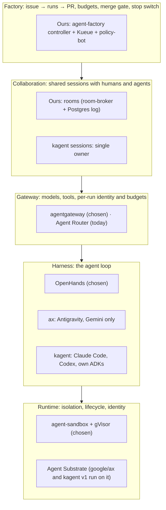


**Work in progress.** The agent ecosystem moves fast. Each detailed evaluation states when it was
checked and what would reopen it, and the page grows as new candidates appear.


What alternatives did we consider for each layer of the agent factory, and why did the current
choices win? A new candidate gets a row in [the table](#decisions-at-a-glance). If it could replace a
whole layer, it also gets a section under [projects evaluated in detail](#projects-evaluated-in-detail).

**In short:**
- **No candidate evaluated so far covers more than one or two layers.** The factory, the rooms and
  the controls around them would stay ours whatever we adopted.
- **A choice can be deferred rather than refused.** Each detailed evaluation lists the concrete
  triggers that would make us reconsider it.

## How candidates are evaluated

- **Against code, not announcements.** Claims are checked in the project's repository at a pinned
  commit, and linked.
- **On the work still ahead.** What is already built does not count in its favour; what adopting a
  candidate would still leave us to build does.
- **Against the platform's requirements:**
  - it runs on both EKS and GKE, on spot nodes;
  - every workload gets its own identity and network policy;
  - no long-lived credential reaches a sandbox;
  - open source first.

## Where each tool fits

An agent platform has several layers. Most "agent platforms" cover one or two of them; ours needs
all five.

## Decisions at a glance

| Layer | Chosen | Alternatives considered | Why |
|---|---|---|---|
| **Runtime** | [agent-sandbox](https://github.com/kubernetes-sigs/agent-sandbox) + [gVisor](https://gvisor.dev), one pod per run | Agent Substrate (with google/ax or kagent), Kata/Firecracker, OpenHands Enterprise, Coder, E2B/Daytona | Open source; runs on EKS and GKE, on spot nodes; each run gets its own ServiceAccount and Cilium policy, so the constitution's rules apply per run. Kata needs bare metal or nested virtualisation |
| **Harness** | [OpenHands](https://github.com/OpenHands/software-agent-sdk) agent-server | Headless Claude Code, kagent's harnesses, ax's Antigravity agent | Open source, headless (an HTTP API), works with any OpenAI-compatible model, supports MCP. Claude Code is proprietary; Antigravity is Gemini-only |
| **Gateway** | [agentgateway](https://agentgateway.dev) (decided 2026-10-01; [Agent Router](https://theagentrouter.ai) runs today) | Agent Router 1.1 on Envoy Gateway | See [gateways]() |
| **Rooms** | A log we own: room-broker on PostgreSQL | OpenHands shared conversations, ACP, A2A through a gateway, Valkey Streams, NATS JetStream, ax or Substrate as the session layer, kagent sessions | A room is an audit trail: every event needs an author, a strict order and durable storage, and approvals need authorised approvers. Nothing we evaluated records who said what among several people and agents |
| **Factory** | A small custom controller + [Kueue](https://kueue.sigs.k8s.io) | Argo Workflows, Tekton, Temporal, a Crossplane `Task` composition, gh-aw | The lifecycle is a reconciliation against GitHub over hours, and budgets and the kill switch are domain logic any option would still need. Argo has no budget concept; Temporal adds a server and a database; a Crossplane composition has no timers |
| **Merge gate** | [policy-bot](https://github.com/palantir/policy-bot) behind a repository ruleset | Required reviews, rulesets alone, a custom check, Prow/tide, Mergify, Kodiak | The policy lives in the repository and is reviewable, and the right to merge sits with one dedicated App |

The full records are in the programme's design documents, listed under [Sources](#sources).

## Projects evaluated in detail

Candidates that could replace a whole layer. Each section states when it was checked.

### google/ax

*Checked on 2026-10-04 at `ac23328`.*

**What it is.** Google's agent orchestrator: it runs each task as an agent on Agent Substrate and
bootstraps Google's Antigravity agent inside it.

**Why not.**
- **Its control plane has no authentication or authorization.** The issue is open; its reporter
  says Google's security programme rated it critical
  ([ax#376](https://github.com/google/ax/issues/376)).
- **An unvalidated branch name reaches `git fetch`**, a code-execution bug
  ([ax#363](https://github.com/google/ax/issues/363)).
- **Gemini only, with the API key copied into every task**
  ([client.go](https://github.com/google/ax/blob/ac23328/internal/model/client.go#L486-L495),
  [reconciler.go](https://github.com/google/ax/blob/ac23328/internal/controller/reconciler.go#L153-L154)).
- **Still being rewritten**: v0.3.0 dropped its event log and replaced its harness, and the queue and
  controller were replaced a week later
  ([dc4f36c](https://github.com/google/ax/commit/dc4f36c),
  [ac23328](https://github.com/google/ax/commit/ac23328)).

Adopting ax would replace the harness as well as the runtime, and lock the platform to one model
provider.

**Reconsider if** ax closes #376 and #363 and supports other model providers without putting keys in
the sandbox, on top of the [Substrate triggers](#reconsidering-substrate-not-now-deliberately-open).

### Agent Substrate

*Checked on 2026-10-04 at `16b863a`.*

**What it is.** A runtime that packs many gVisor-isolated agents into shared worker pods and can
**suspend and resume** an agent, memory included, from snapshots.

**What it would bring.** Suspend and resume is the one capability we lack and cannot build cheaply
(see [below](#would-rebuilding-on-kagent--substrate-be-simpler)).

**Why not yet.**

| Constraint | Evidence |
|---|---|
| Several agents share one pod. Each gets its own egress policy, but Kubernetes identity and Cilium policy apply to the shared pod | [glossary](https://github.com/agent-substrate/substrate/blob/16b863a/docs/glossary.md#L48-L50), [`EgressPolicy`](https://github.com/agent-substrate/substrate/blob/16b863a/pkg/proto/ateapipb/ateapi.proto#L422-L457) |
| Authorization is experimental and off by default | [`--experimental-enable-authz`](https://github.com/agent-substrate/substrate/blob/16b863a/cmd/ateapi/main.go#L84) |
| A reclaimed worker leaves its awake agents permanently crashed; the docs warn against spot nodes | [setup guide](https://github.com/agent-substrate/substrate/blob/16b863a/tools/setup-gcp/README.md#L100-L106) |
| Documented on kind and GKE only; needs Kubernetes certificate APIs that are stable only from 1.37 | [README](https://github.com/agent-substrate/substrate/blob/16b863a/README.md#L86-L147), [Kubernetes 1.37](https://kubernetes.io/blog/2026/08/28/kubernetes-v1-37-pod-certificates-and-cluster-trust-bundles/) |
| Pre-1.0; EKS-related fixes landed on `main` in October, unreleased | [v0.3.0](https://github.com/agent-substrate/substrate/releases/tag/v0.3.0), [#1898](https://github.com/agent-substrate/substrate/issues/1898), [#432](https://github.com/agent-substrate/substrate/issues/432) |

**Reconsider:** see the [triggers](#reconsidering-substrate-not-now-deliberately-open).

### kagent

*Checked on 2026-10-04 at `bf8afa56` (v1) and `v0.10.3`.*

**What it is.** A CNCF Sandbox project, mostly maintained by Solo.io, and really two products:
- **v1** (alpha, where the project invests) runs only on its own fork of Agent Substrate, with
  pluggable harnesses (Claude Code, Codex, its own, or yours) and sessions.
- **v0.10** (stable, called "legacy" by the project) runs one long-running Deployment per agent.

**Why not.**

| Gap | Evidence |
|---|---|
| A session has one owner and one agent. Anyone joining through a share link is recorded as the owner, and no message records its author | [share.go](https://github.com/kagent-dev/kagent/blob/bf8afa563e4f55f2c9f9e9cb54c4efa4dd23d271/go/core/internal/service/session/share.go#L36-L39), [schema](https://github.com/kagent-dev/kagent/blob/bf8afa563e4f55f2c9f9e9cb54c4efa4dd23d271/go/core/pkg/migrations/core/000001_initial.sql#L213-L241) |
| The open-source controller authorizes every action and takes the user's identity from a header, so anything reaching it directly can act as anyone | [auth.go](https://github.com/kagent-dev/kagent/blob/bf8afa563e4f55f2c9f9e9cb54c4efa4dd23d271/go/core/pkg/auth/auth.go#L95-L106) |
| v1 cannot run without Substrate, and gives an agent no ServiceAccount or pod spec of its own | [app.go](https://github.com/kagent-dev/kagent/blob/bf8afa563e4f55f2c9f9e9cb54c4efa4dd23d271/go/core/pkg/app/app.go#L272-L280), [AGENTS.md](https://github.com/kagent-dev/kagent/blob/bf8afa563e4f55f2c9f9e9cb54c4efa4dd23d271/AGENTS.md#L17-L19) |
| An agent identifies itself to the controller with an unsigned header until Substrate ships per-agent tokens | [substrate#1660](https://github.com/agent-substrate/substrate/issues/1660) |
| No GitHub intake, PR handling, merge gate, budgets, daily cap or stop switch, in either edition | [Research](https://github.com/Smana/cloud-native-ref/blob/main/docs/superpowers/specs/2026-10-04-kagent-evaluation-research.md) |
| It dropped kubernetes-sigs/agent-sandbox in June: "substrate is the thing we'll go with" | [#2049](https://github.com/kagent-dev/kagent/pull/2049) |

**Worth learning from:** forking a session together with a snapshot of the running agent, which
beats our fork. It depends on Substrate.

**Reconsider:** see the [triggers](#reconsidering-substrate-not-now-deliberately-open).

## Would rebuilding on kagent + Substrate be simpler?

It is the strongest challenge to this design, so it is judged on the work still ahead, not on what
is already built.

**What it would simplify:**

| Today | On Substrate |
|---|---|
| Four of the 18 issues found live on `gcp-0` come from one pod per run with a bridge sidecar: a lost pod restarting the conversation, transcripts lost at exit | Durable storage, suspend and resume, and a durable task log remove those classes of bug |
| A run waiting on a human approval holds a pod or ends | A parked agent costs nothing and resumes with its memory |
| A fork copies the log and starts a fresh run | A fork carries a snapshot of the running agent |
| We maintain an identity sidecar to keep provider keys out of the sandbox | Substrate's egress gateway injects them (static keys only) |
| Every run starts cold and pulls its image | Agents start from a pre-warmed snapshot |

**What we would still build:**
- **The factory**, whole.
- **The core of rooms**: several participants, roles, handoff and who may approve.
- **Authorization for kagent itself**, which means compiling our own controller around kagent's Go
  library: in effect, maintaining a fork of an alpha.
- **Short-lived GitHub tokens per run and role**, through a custom Substrate credential provider.
- **Budgets**, at the gateway.

**What blocks it today:** no EKS until Kubernetes 1.37 lands there, no spot nodes, a possible
snapshot-restore failure for a Python harness such as OpenHands (kagent reports one), shared pods
that would need an amendment to the constitution, and two alphas changing fast.

**Net:** today it adds moving parts we do not control rather than removing them. If we move,
**Substrate as a backend behind `AgentRun`** beats kagent + Substrate: kagent adds little we lack
and brings its authorization gap.

## Reconsidering Substrate: not now, deliberately open

We intend to reconsider Substrate, and kagent with it, in the near future. The design keeps the door
open:
- `AgentRun` is the abstraction, so a Substrate backend would be a new composition behind it, not a
  rewrite.
- Run identity accepts tokens from any issuer.
- The room bridge avoids WebSocket, which Substrate's egress blocks.

**Next step: a two-day spike at the next `gcp-0` rebuild.** Run OpenHands as a Substrate agent on a
gVisor worker pool, then suspend it, resume it and restore it on another node, and compare its start
time with our sandbox pod.
- **If OpenHands restores and continues its conversation**, we design the Substrate backend.
- **If it crashes**, the path stays closed for OpenHands until it is fixed upstream.

**We reconsider** on the spike's result, on **2026-12-15**, or as soon as any of these holds:
- Substrate ships per-agent tokens ([#1660](https://github.com/agent-substrate/substrate/issues/1660))
  and enforces authorization by default;
- EKS serves the Kubernetes certificate APIs as stable (EKS 1.37);
- Substrate gains a story for spot nodes, such as suspending agents on preemption;
- for kagent: open-source authorization, sessions with several attributed participants, per-agent
  egress ([#3019](https://github.com/kagent-dev/kagent/pull/3019)), and a v1 release with a
  migration path.

## Sources

- [kagent evaluation, 2026-10-04](https://github.com/Smana/cloud-native-ref/blob/main/docs/superpowers/specs/2026-10-04-kagent-evaluation-research.md)
- [ax and Substrate re-check, 2026-10-04](https://github.com/Smana/cloud-native-ref/blob/main/docs/superpowers/specs/2026-10-01-agent-ecosystem-recheck-research.md#2026-10-04-re-check-ax-and-substrate-claims-against-code)
- [Runtime research, with the first ax and Substrate evaluation](https://github.com/Smana/cloud-native-ref/blob/main/docs/superpowers/specs/2026-09-23-agent-runtime-identity-research.md)
- Designs: [programme](https://github.com/Smana/cloud-native-ref/blob/main/docs/superpowers/specs/2026-09-23-agent-factory-design.md),
  [runtime](https://github.com/Smana/cloud-native-ref/blob/main/docs/superpowers/specs/2026-09-23-agent-runtime-identity-design.md),
  [rooms](https://github.com/Smana/cloud-native-ref/blob/main/docs/superpowers/specs/2026-09-23-agent-collaboration-rooms-design.md),
  [factory](https://github.com/Smana/cloud-native-ref/blob/main/docs/superpowers/specs/2026-09-23-agent-dark-factory-design.md)
