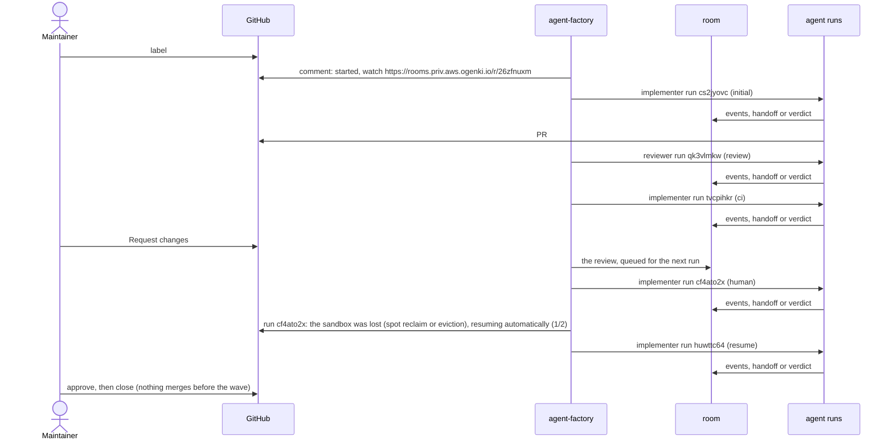


**Live on `aws-0`, not yet on `main`.** The task on this page ran on `aws-0` on 2026-10-07, from the
`integration/agent-factory` branch, and the owner signed off the experience after that run. The
programme's pull requests now merge in order. Until the merge gate goes live after them, it runs in
shadow: it says what it would merge, and merges nothing. What runs where is on the
[status page]().


New to the vocabulary (run, role, sandbox, room)? Read
[the overview]() first; it takes two minutes.

## Before you start

| You need | Why |
|---|---|
| Access to the tailnet | The room UI, Grafana and the factory's API are private |
| SSO membership in `agents-member` | To watch rooms and runs, and to start a run by hand. Requesting `internal` work or a `triager` run needs `agents-admin` |
| Maintainer rights on the repository | Labels and reviews are how you steer. The agents never merge on their own, except for the low-risk classes below |
| `roomctl login`, once | Only to start a run by hand: `task agent:run` sends the factory the token it prints, and the run is yours |

## What happens to a task

1. **You label the issue `factory/ready`.** The factory takes a snapshot of the issue, so a later
   edit does not change the task, and picks its class, its team and its budget. It comments that it
   started: the run, the branch `agent/<task>`, the budget and a *watch* link to the task's room.
2. **An implementer run works it** in its own sandbox, on that branch, and opens a pull request.
   The factory comments with the link.
3. **A reviewer run reviews it** and records a verdict in the room, which posts it on the pull
   request as one comment. The verdict is advice: it neither approves nor blocks.
4. **CI runs.** When it fails, an implementer run fixes it on the same branch.
5. **The factory waits for you**, and comments that the task needs a maintainer's review.
6. **You review on GitHub.** "Request changes" starts a revision: a new implementer run on the same
   branch, with your review in its brief. The factory comments that it is revising.
7. **A lost sandbox is resumed.** When a run's node is reclaimed or its pod evicted, the factory
   starts the run again on the same branch and in the same room, at most twice per task, and says
   so on the issue. A run that failed on its own is not resumed: the task waits for you.
8. **You approve, then merge or close.** Your approval is what the merge gate counts; outside the
   low-risk classes you merge yourself. The factory comments how the task ended and the tokens it
   used.

## One real task, end to end

Issue [#2238](https://github.com/Smana/cloud-native-ref/issues/2238), on `aws-0` on 2026-10-07: a
docs page listed the `victoria-logs-single` chart at 0.13.9 while the repository pins 0.13.10. The
maintainer's review, "Request changes", asked for a second fix on the same page. The pull request,
[#2239](https://github.com/Smana/cloud-native-ref/pull/2239), was approved, then closed unmerged:
nothing merges before the programme does.

<!-- Rendered by scripts/docs/factory-journey.py from the walkthrough's transcript. The script stamped
     the human steps when Enter was pressed, and buffered keystrokes moved them, so four times come
     from GitHub instead: the label 18:40:15 (the issue's labeled event), "Request changes" 19:11:30
     and the approval 19:24:42 (the PR's reviews), the close 19:26:00 (the PR's closedAt). -->

| Step | UTC | Minutes after the label |
|---|---|---|
| A maintainer labels the issue | 18:40 | 0 |
| The factory says it started | 18:40 | 0 |
| PR opened | 18:45 | 4 |
| A maintainer requests changes | 19:11 | 31 |
| The revision is pushed | 19:22 | 42 |
| A maintainer approves | 19:24 | 44 |
| Closed unmerged (before the wave) | 19:26 | 45 |

Runs: implementer (initial) → reviewer (review) → implementer (ci) → implementer (human) → implementer (resume). Template `pair`, tier `standard`, 1078k tokens in total.



### The reclaim

At 19:16 UTC an AWS Spot interruption reclaimed the node under the revision run `cf4ato2x`, after
it had pushed its fix. The run ended `Disrupted`, and the factory resumed it on its own. The issue
read:

> Agent factory task `26zfnuxm`: run `cf4ato2x` stopped because the sandbox was lost (spot reclaim or eviction); resuming automatically (1/2).

The resumed run, `huwttc64`, continued on the same branch and in the same room, and the task ended
normally.

### What the factory wrote on the issue

The first comment, as posted:

```text
Agent factory task `26zfnuxm` started run `cs2jyovc` (implementer) on branch `agent/26zfnuxm`.

- Budget: 1.5 M tokens, 45 minutes (tier standard)
- Watch: https://rooms.priv.aws.ogenki.io/r/26zfnuxm (tailnet only)
- Stop: apply the label `factory/stop`
```

Then, one line each; every "started" comment carries the same budget, watch and stop lines as the first:

| UTC | Comment |
|---|---|
| 18:40 | Agent factory task `26zfnuxm` started run `cs2jyovc` (implementer) on branch `agent/26zfnuxm`. |
| 18:44 | Run `cs2jyovc` of task `26zfnuxm` opened #2239: https://github.com/Smana/cloud-native-ref/pull/2239 |
| 18:45 | Agent factory task `26zfnuxm` started run `qk3vlmkw` (reviewer) on branch `agent/26zfnuxm`. |
| 19:00 | Agent factory task `26zfnuxm` started run `tvcpihkr` (implementer) on branch `agent/26zfnuxm`. |
| 19:10 | Agent factory task `26zfnuxm` waits for a maintainer's review: the policy needs a maintainer's approval. |
| 19:11 | Agent factory task `26zfnuxm` is revising after @Smana's review: the next run starts on the same branch, with the review in its brief. |
| 19:11 | Agent factory task `26zfnuxm` started run `cf4ato2x` (implementer) on branch `agent/26zfnuxm`. |
| 19:18 | Agent factory task `26zfnuxm`: run `cf4ato2x` stopped because the sandbox was lost (spot reclaim or eviction); resuming automatically (1/2). |
| 19:18 | Agent factory task `26zfnuxm` started run `huwttc64` (implementer) on branch `agent/26zfnuxm`. |
| 19:26 | Agent factory task `26zfnuxm` was closed: the pull request was closed. Tokens used: 923 k. |

The closing comment's 923 k is what the factory had metered when the task closed; the task's final
tally is 1,078 k.

## What you can do

| You want to… | Do this |
|---|---|
| Hand over an issue | Label it **`factory/ready`** |
| Watch it work | Open the *watch* link in the "started" comment: every step of every run, their messages and the handoffs between roles |
| Ask for changes | A GitHub review with **"Request changes"**: the next run starts on the same branch with your review in its brief |
| Accept the work | **Approve** it: the merge gate counts a maintainer's approval. Outside the low-risk classes, merge it yourself |
| Try again after a failure | Comment **`/factory retry`** on the issue (a maintainer only) |
| Stop one task | Label its issue or pull request **`factory/stop`**: its runs are revoked, its branch stays |
| Stop every task | `kubectl -n agent-system create configmap agent-factory-stop`, or the label `factory/stop` on the pinned control issue. Intake pauses, every run is revoked and new runs are refused, runs started by hand included |
| Undo a merged low-risk change | *(Once the merge gate is live)* Label it **`factory/revert`** within 7 days: the factory opens the revert, which merges as the `revert` class |
| Start a run by hand | `task agent:run -- --role implementer --class public --task-url <issue>`. The factory creates it under your SSO identity |
| Resume a run a stop ended | The same command with **`--branch agent/<run id>`**: it continues from what the run pushed |

## What the factory never does

| Never | What enforces it |
|---|---|
| Merge anything but a `docs-links` change or its revert | policy-bot evaluates `.policy.yml` from `main`; the `agent-merge` ruleset lets only the merger App merge, and only once that check passes ([ADR-0045]()) |
| Touch a gate path: CI, the rulesets, the merge policy, the agent platform's own manifests | `.policy.yml` lists every gate path in every agent rule: a pull request that touches one matches no rule, policy-bot reports an error, and it cannot merge |
| Take a principal from a request body | The run-request API takes the principal from your SSO token, never from the body, and the Kyverno policy `agentrun-one-creator` admits no `AgentRun` creator but the factory |
| Start public work from an internal finding on its own | An `investigate` task is the triager alone. It ends on a proposed public issue, which starts nothing until a maintainer labels it ([ADR-0048]()) |

## Budgets and costs

A task runs within limits it cannot raise:
- **Each run has a deadline and a token budget**, set by the task's tier: `light` 20 minutes and
  300 k tokens, `standard` 45 minutes and 1.5 M, `frontier` 90 minutes and 4 M. The run meter
  revokes a run at its cap, runs started by hand included.
- **Each task has a token cap**, twice its tier's run budget, and a resume needs room for a whole
  run under it.
- **The factory takes at most 20 tasks a day, and works at most 3 at once.** Past the daily cap, a
  labelled issue is refused, with a comment saying why.

Every model call is metered per run at the gateway, so the dashboard shows what a task cost.

---

## Observability: what you can inspect

| Question | Where |
|---|---|
| Where is my run? | `kubectl get agentrun -n agents`, or the `agent-run` dashboard's status panel: phase, reason, PR, tokens against budget |
| What did it do? | The step log, in `kubectl logs` or on the dashboard, with every gateway and MCP call of that run |
| What did it cost, how fast was it? | The dashboard: tokens in and out, cost, model latency, error rate. `agent-fleet` shows every run |
| Where did the time go? | A trace per run: steps, model calls and tool calls, with timings. Metadata only: no prompts or outputs |

A run's page is `/d/agent-run/agent-run?var-run=<id>`. Two known
issues: a successful run's page showed no outcome or PR ([F18](); fixed
on `integration`, deployed on gcp-0, live re-check pending), and MCP tool calls are not yet joined to the run's trace
([F16]()).

The full transcript (prompts and outputs) lives in the room, visible to the people with access to
that room. It holds a run to its end: before the harness stops, even when its node is reclaimed, it
asks the room-bridge to read its log to the last event
([F11](), fixed and verified on `aws-0` on 2026-10-07).

## Frequently asked questions

**Can an agent merge to `main`, or push anywhere else?**
No. Its GitHub App may push only `agent/**` branches and no tags, enforced by two repository rulesets. Merging is
the human's, except for the two low-risk classes above, which go through a separate App.
That confinement is per repository, not per run: every run pushes as the same App, so one run can
push to another's `agent/**` branch. The footer is provenance, never authorisation: the merge gate
merges only the commit the task's own run reported in its room, with every reviewer approval naming
that commit.

**Can it read our secrets?**
The sandbox holds no long-lived credential. Its GitHub token is minted per run, scoped to one
repository and one role, and revoked when the run ends (at worst it expires within an hour). Model and
tool calls carry a run token that the gateway verifies. It has no access to Kubernetes Secrets. An
`internal` run can read logs and pod specs over the read-only MCP tools, and those can contain
secrets.

**Can it reach the internet?**
Only the hosts its network policy names: GitHub, the gateway and, with `--profiles`, package
registries. Everything else is dropped.

**What if it loops or goes off track?**
Its deadline or the run meter ends it, and you can delete it. The stop ConfigMap ends every task.
Every step is in the step log, the room and the trace.

**Why gVisor?**
The agent runs arbitrary commands. gVisor answers their system calls in user space, so a kernel
exploit hits gVisor, not the node. Escaping takes a gVisor bug as well; the node pool is dedicated
and tainted to limit what that would reach.
