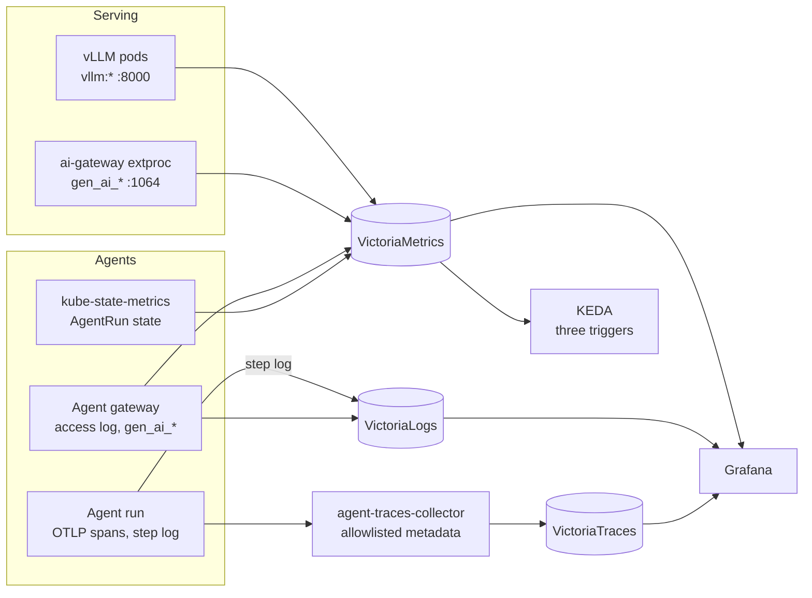

Both halves land in the platform's Victoria stack and Grafana; nothing here runs a second
telemetry pipeline. Serving is watched per model, agents per run. Open findings on this page's
signals are on the [status page]().

## Serving

| Signal | Source | Read it in |
|---|---|---|
| Engine metrics | Each vLLM pod's `/metrics` on port 8000, `vllm:*` labelled by `model_name`, scraped by the `VMServiceScrape` each claim renders (`observability.metrics.interval`, `30s` on all four) | *LLM Platform — Self-hosted vLLM Fleet*: replicas, queue depth, throughput, TTFT and decode latency, GPU KV-cache usage, prefix-cache hit rate, vLLM error logs |
| Gateway metrics | The AI Gateway extproc's `/metrics` on port 1064, `gen_ai_*` (OpenTelemetry semantic conventions) | *LLM Gateway — Envoy AI Gateway GenAI Telemetry*: token spend per model, base-vs-canary attribution, TTFT and time per output token |
| Autoscaling | KEDA's three triggers query the same `vllm:*` series every 15 s | [Autoscaling & GPUs]() |

Both dashboards live in the Grafana folder `llm` (`apps/base/ai/llm/grafana-folder.yaml`), which
only exists once the opt-in umbrella is resumed.

**Alerts** are lagging signals, deliberately not scale triggers:

| File | Alerts |
|---|---|
| `apps/base/ai/llm/vmrule-llm-slo.yaml` | Serving: sustained queue depth, time to first token breached, a replica scaled to zero. Gateway: `gen_ai` telemetry missing, scrape down, high error rate, canary error-rate and latency regressions |
| `apps/base/ai/llm/vmrule-ai-fleet.yaml` | Fleet abort rate, Semantic Router down, Promptfoo regression and staleness |

## Agents

One trace, one step log and one dashboard page per run, so a human can open any run and see where
it stands, what it did, what it cost and where its time went.

| Component | Software | What it does |
|---|---|---|
| Logs | [VictoriaLogs](https://docs.victoriametrics.com/victorialogs/) | Every run's step log and every gateway call, attributed to the run |
| Metrics | [VictoriaMetrics](https://victoriametrics.com) | Tokens, cost, latency and errors per run, and each `AgentRun`'s state through kube-state-metrics |
| Traces | [VictoriaTraces](https://docs.victoriametrics.com/victoriatraces/), behind an OpenTelemetry Collector that keeps only allowlisted metadata | One trace per run: steps, model calls and tool calls. Metadata only: no prompts or outputs |
| Dashboards | [Grafana](https://grafana.com) | `agent-run`, one page per run, and `agent-fleet`, the overview |

The full transcript (prompts and outputs) stays in the
[room](), behind room access. Alerting
on runs belongs to the factory's rules, per the
[observability design](https://github.com/Smana/cloud-native-ref/blob/main/docs/superpowers/specs/2026-09-27-agent-observability-design.md).
Which question each signal answers, from a developer's seat, is in the
[user guide]().
