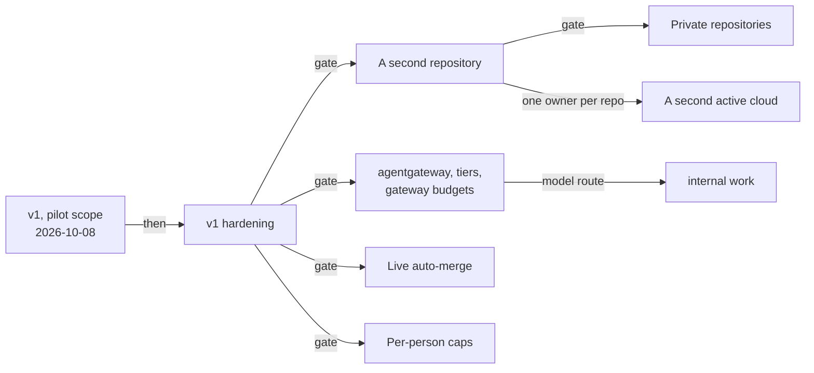

The other pages of this section describe the design. This page says how much of it exists. Each
role page links to its row here instead of repeating it.

| Area | State | Detail |
|---|---|---|
| Serving | Off by default on both clouds; four known gaps; one roadmap path shipped, six open | [Serving](#serving) |
| Agent factory | **v1 shipped 2026-10-08, pilot scope**: on `main`, running on `aws-0`, three factory PRs merged end to end. Not production-ready: hardening comes first | [v1](#v1-what-shipped), [hardening](#v1-hardening) |
| Agent factory v2 | One go/no-go gate per expansion: a second repository, private repositories, `internal` work, live auto-merge, per-person caps, model routing, a second active cloud | [v2 roadmap](#v2-roadmap) |

## Serving

### Known gaps

- **`xplane-llamaguard3-1b` holds a GPU and serves no automatic traffic** —
  it runs at `min=1` but appears in no Semantic Router decision rule.
- **Gateway routing is half-migrated** — only `xplane-qwen-coder` is
  composition-owned; the other three claims still route through the
  hand-written `apps/base/ai/llm/ai-gateway-routes/route.yaml`, so adding a
  model means adding its route by hand unless the claim opts in
  (`spec.gateway.enabled: true`).
- **The Gateway API Inference Extension's endpoint picker is implemented but
  enabled on zero claims.** It is mutually exclusive with LoRA canaries, and
  the only gateway-enabled claim uses a canary.
- **No distributed tracing.** OTLP export from the AI Gateway extproc is
  written but not enabled, pending verification against VictoriaTraces.

**On `gcp-0` the umbrella stays suspended on cost and an open GPU quota, not
on missing identity**: each claim's per-claim GCP read identity *is* rendered
as of `crossplane-configuration` v0.4.6 — the version already pinned here.
The first resume (2026-08-28) proved as much on a live cluster — the per-claim
`GCPWorkloadIdentity` reached Ready and the preload Job wrote the weights to
GCS — and stalled only once it reached the GPU itself: `GPUS_ALL_REGIONS` is
`0` on the project, a Google quota this repository cannot route around. See
`clusters/gcp-0-llm-platform/README.md` for the full failure-order watch list
before the next resume.

## Serving roadmap

A now-retired note in the repository, `llm-platform-future-paths`, originally
listed seven upgrade paths for evolving the platform beyond its current shape. None were
committed work — they were reference notes for when the open-weights
ecosystem, the team's needs, or the demo scope warranted the next
investment. This section carries forward only what is **still open**, checked
against the [done spec archive](https://github.com/Smana/cloud-native-ref/tree/main/docs/specs/done)
and the pinned composition source as of `2026-08-20`.


When picking one of these up, choose the path whose trigger has actually
fired, not the most ambitious one. Bigger hardware doesn't always mean
bigger value in a foundation-showcase context.


### Shipped — re-introduce InferencePool + EPP

The path that proposed gating a Gateway API Inference Extension
`InferencePool` + Endpoint Picker behind an opt-in composition field has
**shipped as SPEC-004**
(`docs/specs/done/2026-Q3/004-per-inferenceservice-inferencepool-endpoint/`).
Verified directly against the pinned KCL module: `spec.gateway.endpointPicker.enabled`
renders a per-claim InferencePool + EPP HelmRelease and swaps the
`AIGatewayRoute` base rule's backend to the InferencePool — exactly the
mechanism the roadmap entry proposed. All coding tasks in the spec's plan are
complete; only the live-cluster e2e validation tasks remain open, because the
field is **enabled on zero claims today** — it is mutually exclusive with
LoRA canaries, and the one gateway-enabled claim (`xplane-qwen-coder`) uses a
canary. Turning it on for a high-traffic model at `max ≥ 2` replicas is what
remains of this path.


A follow-on spec, `docs/specs/done/2026-Q3/011-inferencepool-saturation-keda/`,
proposes a fourth KEDA trigger reading the InferencePool's own saturation
gauge instead of the three raw vLLM metrics. It is filed under the `done`
archive, but the pinned KCL module renders only the three original triggers
— no InferencePool-gauge trigger exists in the composition source — and the
spec's own task and review checklists are almost entirely unchecked. Treat
this piece as **not shipped**, regardless of which directory it lives in.


### Still open

#### 1. Bigger coder model on the existing L4 NodePool

Swap `Qwen/Qwen2.5-Coder-7B-Instruct` for a larger MoE coder (originally
proposed: `Qwen/Qwen3-Coder-30B-A3B-Instruct` at AWQ-4bit) that still fits a
single L4's 24 GiB. The fleet still runs the 7B model today
(`apps/base/ai/llm/qwen-coder.yaml`), so this remains open.

**Trigger**: the 7B coder hitting tool-call reliability or correctness
limits in practice.

#### 2. Frontier coder on L40S in a second region

Run a full-precision 30B-class coder on a single L40S 48GB, which needs an
instance family (`g6e`) not offered in `eu-west-3`. The platform's OpenTofu
stacks are pinned to `eu-west-3` (`opentofu/aws/llm-platform/backend.tf`) with no
second-region stack, so this remains open — and would require a new
OpenTofu stack, a new Karpenter NodePool, and cross-region routing from the
AI Gateway.

**Trigger**: an AWQ-4bit quality compromise from path 1 becomes a measurable
regression, or the team wants to demo full-context work a single L4 can't
hold.

#### 3. Tensor-parallel `g6.12xlarge` (4× L4)

Run a 30B-class model with `tensor-parallel-size: 4` on a single 4-GPU
instance for full precision without a region split. The `gpu-l4` NodePool
explicitly **excludes** multi-GPU SKUs today
(`infrastructure/base/karpenter-nodepools-gpu/gpu-l4-nodepool.yaml`, by
design — a multi-GPU pod would otherwise be able to consume the entire
4-GPU fleet cap on its own), so this remains open and would require lifting
that restriction along with revisiting the cap it protects.

**Trigger**: path 1's quantized model isn't enough, and multi-region
operational cost (path 2) is the bigger problem.

#### 4. Anthropic↔OpenAI relay for Claude Code

Deploy a translator sidecar exposing Anthropic-style `/v1/messages` and
proxying to the existing OpenAI-compatible AI Gateway, so Claude Code can
target the self-hosted fleet. [Coding Clients]()
documents this as explicitly not implemented — OpenCode covers the
agentic-CLI use case today.

**Honest framing, carried forward from the original proposal**: this is a
UX win wrapped around a quality compromise. Pointing Claude Code at an
open-weights model doesn't give Sonnet/Opus output — it gives that model's
output via Claude Code's UX. Useful for sovereignty, privacy, or cost relief
on bulk tasks; not for raising agentic coding quality.

**Trigger**: paths 1 or 2 close the open-weights/frontier gap enough that
this becomes a competitive daily backend, or an explicit no-telemetry
privacy workflow is the use case.

#### 5. Heavier dense models (GLM-4.6, DeepSeek-Coder-V3)

Both require multi-GPU serving (TP=4+ or H100-class hardware) and had known
vLLM tool-call parser quirks as of the original proposal. No GPU budget for
H100/H200-class SKUs exists in this lab today, so this stays open pending
both upstream parser stabilization and a hardware budget decision.

#### 6. Per-tenant FinOps observability

Attribute token spend and cost per consumer by extracting a static
`x-tenant` request header at the gateway and labelling the existing token
counters with it. SPEC-006
(`docs/specs/done/2026-Q3/006-genai-observability-envoy-gateway/`) shipped
the gateway's `gen_ai_*` token metrics and base-vs-canary attribution — a
real prerequisite — but no `tenant` label or `x-tenant` header extraction
exists anywhere in `infrastructure/base/envoy-ai-gateway/` or the LLM
dashboards today. This path remains open on top of what SPEC-006 delivered.

**What this is not**: tenant authentication, quotas, fairness scheduling, or
rate limiting — those stay out of scope for this platform's posture.

**Trigger**: any real or simulated workload routes through the platform with
multiple addressable consumers, including using LoRA adapter names as proxy
"tenants" to demo cost attribution without standing up auth.

## Agent factory

**v1 shipped on 2026-10-08, pilot scope.** It is on `main` (agent-platform `v0.8.0`,
crossplane-configuration `v0.9.3`) and runs on `aws-0`; a cluster opts in, because the umbrellas
ship suspended. A labelled issue becomes a reviewed pull request that a human merges: three factory
PRs have merged that way. v1 is **viable for governed side tasks on one public repository. It is
not production-ready**: the [hardening](#v1-hardening) comes before anything is called dependable,
and each [v2](#v2-roadmap) expansion passes its own gate.

### v1: what shipped

| v1 covers | v1 does not |
|---|---|
| One public repository, `Smana/cloud-native-ref` | A second repository, or a private one |
| One active cloud, `aws-0` | Two clusters taking the same issues |
| `public` work, on Z.ai GLM-5.3 through the agent router | `internal` work: no model route serves it |
| Humans merge; the merge gate records what it *would* merge | Unattended merge |
| Per-run and per-task token caps | Per-person caps (computed in shadow) |
| One model for every tier | Routing by tier |

| Capability | State | Evidence |
|---|---|---|
| Issue to reviewed PR: intake, triage, the `pair` team (implementer, then reviewer), narration on the issue | **Proven live** | [#2238](https://github.com/Smana/cloud-native-ref/issues/2238) → #2239 (2026-10-07); [#2240](https://github.com/Smana/cloud-native-ref/issues/2240) → [#2264](https://github.com/Smana/cloud-native-ref/pull/2264) on `v0.7.0` and [#2266](https://github.com/Smana/cloud-native-ref/issues/2266) → [#2267](https://github.com/Smana/cloud-native-ref/pull/2267) on `v0.8.0`, both merged (2026-10-08) |
| Revision after "Request changes", `/factory retry` | **Proven live** | #2239, 2026-10-07 |
| gVisor sandbox, per-run identity, the agents' App confined to `agent/**` | **Proven live** | #2112 → [#2114](https://github.com/Smana/cloud-native-ref/pull/2114) on `aws-0` (2026-09-27), #2140 → [#2141](https://github.com/Smana/cloud-native-ref/pull/2141) on `gcp-0` (2026-10-01); the `agent-branches` and `agent-tags` rulesets are active |
| Resume after a reclaim | **Proven live** | A FIS Spot interruption and a real one, `aws-0`, 2026-10-07 |
| Run meter, task caps, Kueue's hold, the kill switch | **Proven live** | The kill-switch drill and Kueue's hold, `aws-0`, 2026-10-07. The control-issue stop reaches only the leader replica ([agent-platform#53](https://github.com/Smana/agent-platform/issues/53)) |
| Rooms: log, live view, room tools, steering, approvals, fork, `roomctl` | **Proven live** | The approvals gate (SC-5), `aws-0`, 2026-10-07 |
| Local-first: `roomctl status`, the room page, the `factory-handoff` skill, room access that follows GitHub (D7) | **Partly proven** | [Runbook 11](https://github.com/Smana/cloud-native-ref/blob/main/docs/runbooks/agent-factory/11-v1-validation.md#results), 2026-10-08: 5 pass, 3 partial, 4 open (the checks that need a second GitHub account) |
| Per-run logs, metrics, traces, dashboards and the stuck-sandbox alert | **Proven live** | Runbook 11, Step 6, 2026-10-08. MCP calls are not yet in the trace ([F16](#live-findings)) |
| Merge gate for `docs-links` and `revert` | Shadow | Records what it would merge; a maintainer merges |
| RunLore findings as a trigger (`investigate`) | Configured, not proven | It creates `internal` tasks, which have no model route |
| Per-person spend caps | Shadow | `enforcePrincipal: false` |
| Routing by tier | Not available | Every tier uses `agent-default` |

What a task costs today: [#2267](https://github.com/Smana/cloud-native-ref/pull/2267), a 12-line docs
fix, took 667,878 tokens over two runs (implementer 505,528, reviewer 162,350). It is a reference
point for v2's measurements, not a target.

### v1 hardening

What must hold before v1 is called dependable. Every item is an issue on the **v1 hardening**
milestone, in [agent-platform](https://github.com/Smana/agent-platform/milestone/1) and
[cloud-native-ref](https://github.com/Smana/cloud-native-ref/milestone/1).

| Theme | What must hold | Issues |
|---|---|---|
| Admission and stop | A retried run request returns its first result; every replica honours the control-issue stop; a stop releases its room and keeps the usage it metered | agent-platform [#52](https://github.com/Smana/agent-platform/issues/52), [#53](https://github.com/Smana/agent-platform/issues/53), [#55](https://github.com/Smana/agent-platform/issues/55) |
| Spend | A blind meter is visible and bounded: an alert, then admission refused; the closing comment reports the real total | agent-platform [#54](https://github.com/Smana/agent-platform/issues/54), [#42](https://github.com/Smana/agent-platform/issues/42) |
| Task lifecycle | Finished rooms close and age out; a run's reason and trigger are reported as they happened; agents post progress | agent-platform [#56](https://github.com/Smana/agent-platform/issues/56), [#33](https://github.com/Smana/agent-platform/issues/33), [#40](https://github.com/Smana/agent-platform/issues/40), [#41](https://github.com/Smana/agent-platform/issues/41), [#60](https://github.com/Smana/agent-platform/issues/60) |
| People | "Needs you" includes a PR waiting for its merge; a waiting phase says why and what next; onboarding in two commands, from the skill too; a room list that names the issue; generated commands carry `--repo`; human acts are logged; a GitHub link for Google-only users | agent-platform [#51](https://github.com/Smana/agent-platform/issues/51), [#59](https://github.com/Smana/agent-platform/issues/59), [#48](https://github.com/Smana/agent-platform/issues/48), [#49](https://github.com/Smana/agent-platform/issues/49), [#50](https://github.com/Smana/agent-platform/issues/50), [#44](https://github.com/Smana/agent-platform/issues/44), [#61](https://github.com/Smana/agent-platform/issues/61); cloud-native-ref [#2269](https://github.com/Smana/cloud-native-ref/issues/2269) |
| Operations | A fresh install from documented inputs; drains during a GitHub outage; broker config changes roll out; the core composition owned as code; the factory upgrade takes its new tag; a teardown that leaves nothing; IdP secret rotation; the ZITADEL floor checked in CI; a rooms restore drill | agent-platform [#57](https://github.com/Smana/agent-platform/issues/57), [#58](https://github.com/Smana/agent-platform/issues/58); cloud-native-ref [#2280](https://github.com/Smana/cloud-native-ref/issues/2280), [#2274](https://github.com/Smana/cloud-native-ref/issues/2274), [#2275](https://github.com/Smana/cloud-native-ref/issues/2275), [#2276](https://github.com/Smana/cloud-native-ref/issues/2276), [#2277](https://github.com/Smana/cloud-native-ref/issues/2277), [#2278](https://github.com/Smana/cloud-native-ref/issues/2278), [#2279](https://github.com/Smana/cloud-native-ref/issues/2279), [#2273](https://github.com/Smana/cloud-native-ref/issues/2273) |
| Evidence | D7 on a private repository (runbook 11, 5b–5e); F10, F12 and F15 re-checked live; MCP calls in the trace; docs and the walkthrough script that match what runs | cloud-native-ref [#2281](https://github.com/Smana/cloud-native-ref/issues/2281), [#2282](https://github.com/Smana/cloud-native-ref/issues/2282), [#2283](https://github.com/Smana/cloud-native-ref/issues/2283), [#2268](https://github.com/Smana/cloud-native-ref/issues/2268), [#2251](https://github.com/Smana/cloud-native-ref/issues/2251), [#2252](https://github.com/Smana/cloud-native-ref/issues/2252) |

### v2 roadmap

v2 widens what v1 covers, one capability at a time. Each capability has a gate: the evidence that
must exist before it is turned on. Passing one gate opens nothing else, and none has a date.

| Capability | Gate: what must be proven first |
|---|---|
| A second repository | The factory takes issues from several repositories ([the steps]()). Every admission path binds the request's repository to its room and checks the caller's GitHub permission on it, roomless and resumed runs included. One fenced factory owns each repository, so two clusters never take the same issue |
| Private repositories | All of the above, plus runbook 11's private-repository checks (5b–5e) passing live. Rooms already follow GitHub's permissions |
| Model routing by tier, budgets at the gateway | The agent router moves to agentgateway (selected 2026-10-01 after a PoC on `gcp-0`: [gap matrix](https://github.com/Smana/cloud-native-ref/blob/main/docs/superpowers/specs/2026-10-01-agentgateway-gap-matrix-research.md#poc-result-2026-10-01-gcp-0)); then per-run and fleet budgets and the tier routes on it |
| `internal` work: RunLore investigations, cluster and log reads | A model route for `internal` runs, through the Anthropic API (its ADR lands with the agentgateway migration). A composition that gives `internal` runs no direct GitHub egress, proven by a refused write with a supplied token. RunLore intake that recovers a half-created issue |
| Live auto-merge of `docs-links` and `revert` | The merge breaker's state survives a rebuild; a head-pinned merge and its revert drilled on a live cluster |
| Per-person spend caps | Label-triggered and API admission share one reservation; an exhausted ledger refuses both |
| A second active cloud (`gcp-0`) | The factory reaches the identity provider over GKE's datapath, proven with Hubble; the single-owner fence above; the CPU quota ([F3](#live-findings)) |
| Attended rooms at scale | An approval's deadline enforced inside the decision, not by a later sweep |
| A different sandbox runtime | A two-day Substrate spike at the next `gcp-0` rebuild ([alternatives]()) |

### How v2 is judged

A gate is a go/no-go on evidence. Beside the gates, each v2 decision is weighed against what v1
delivers, counted the same way for every task, failures included:

| Measure | Definition |
|---|---|
| Accepted outcomes | Factory PRs merged under the same checks and approvals as a human's; approved but unmerged counted apart |
| Cost per accepted outcome | Tokens, then money, of every run of the cohort, failed ones included, divided by its accepted outcomes |
| Human time | Minutes of review, operation and repair per accepted outcome |
| Elapsed time | Label to PR, label to merge, and "needs you" to the human's action |
| Rework | Review rounds, CI-fix runs and reverts |

The same tasks run through a simpler hosted agent, under the same checks, give the comparison that
says whether the factory's governance pays for operating it.

### Live findings

Found by the live gates on `gcp-0` and `aws-0`.

| # | Finding | State |
|---|---|---|
| F1 | The OpenBao snapshot job could not read the object it uploads (missing `storage.objects.get`) | **Fixed** ([#2144](https://github.com/Smana/cloud-native-ref/pull/2144)) |
| F2 | Run pods landed on a fresh gVisor node before Cilium and ran up to ~2 minutes without their network policy | **Fixed and verified live**: Cilium's startup taint on every pool ([#2145](https://github.com/Smana/cloud-native-ref/pull/2145)) |
| F3 | The `CPUS_ALL_REGIONS` quota (26 of 32) blocks `e2-standard-8` nodes on `gcp-0` | **Waiting** on a quota increase |
| F4 | Runbook 08's observability steps existed only in the plan | **Fixed** |
| F5 | Crossplane never upgrades the core Configuration dependency | **Open**: patched by hand on each upgrade ([#2275](https://github.com/Smana/cloud-native-ref/issues/2275)) |
| F6 | GKE refuses `kubernetes.io` taint keys on ComputeClasses, which wedged `infrastructure` | **Fixed** ([#2145](https://github.com/Smana/cloud-native-ref/pull/2145)) |
| F7 | The room broker's certificate had no CN, and the PKI role signed only the private domain | **Fixed** in [#2150](https://github.com/Smana/cloud-native-ref/pull/2150) on `gcp-0`; the same PKI change on `aws-0` is unverified |
| F8 | The rooms SSO client was missing on `gcp-0` | **Fixed** by re-running the client sync |
| F9 | `cilium-agent` was OOM-killed twice on new nodes | **Fixed** ([#2145](https://github.com/Smana/cloud-native-ref/pull/2145)) |
| F10 | The bridge-to-broker event stream reset every 10 s | **Fixed** in agent-platform `v0.8.0`; live re-check pending ([#2282](https://github.com/Smana/cloud-native-ref/issues/2282)) |
| F11 | Short conversations lost their whole transcript during the gVisor cold start | **Fixed and verified** on `aws-0`, 2026-10-07 |
| F12 | A deleted or evicted run pod was re-created by its Sandbox and the task restarted from scratch | **Fixed** in crossplane-configuration `v0.9.3`; live re-check pending ([#2282](https://github.com/Smana/cloud-native-ref/issues/2282)) |
| F13 | The live-gate step grepped for `room_busy`, but the broker logs "room busy" | **Fixed** ([#2155](https://github.com/Smana/cloud-native-ref/pull/2155)) |
| F14 | `cnpg-promote-seed.sh --cloud gcp` nested the seed one level too deep | **Fixed** ([#2154](https://github.com/Smana/cloud-native-ref/pull/2154)) |
| F15 | A run refused the room lease still executed its task, unrecorded, on the shared branch | **Fixed** with F12; live re-check pending ([#2282](https://github.com/Smana/cloud-native-ref/issues/2282)) |
| F16 | MCP calls are not joined to the run's trace | **Open** ([#2283](https://github.com/Smana/cloud-native-ref/issues/2283)) |
| F17 | Runbook 08's GCP commands had bugs | **Fixed** |
| F18 | A successful run's page showed no outcome or PR | **Fixed and verified** on `aws-0`, 2026-10-08: `agentrun_pull_request_info` names the PR; `agentrun_outcome_info` is emitted for failures only, by design |

## Sources

The programme's working ledgers (outside the repository), the PRs and issues above, and the v1
validation ([runbook 11](https://github.com/Smana/cloud-native-ref/blob/main/docs/runbooks/agent-factory/11-v1-validation.md)).
Designs and plans:
[programme design](https://github.com/Smana/cloud-native-ref/blob/main/docs/superpowers/specs/2026-09-23-agent-factory-design.md),
[SP2 plan](https://github.com/Smana/cloud-native-ref/blob/main/docs/superpowers/plans/2026-09-27-agent-collaboration-rooms-plan.md),
[SP3 plan](https://github.com/Smana/cloud-native-ref/blob/main/docs/superpowers/plans/2026-09-27-agent-dark-factory-plan.md),
[O-1 plan](https://github.com/Smana/cloud-native-ref/blob/main/docs/superpowers/plans/2026-09-27-agent-observability-plan.md),
[local-first UX design](https://github.com/Smana/cloud-native-ref/blob/main/docs/superpowers/specs/2026-10-08-agent-factory-local-first-ux-design.md).
Ecosystem research: [2026-10-01 re-check](https://github.com/Smana/cloud-native-ref/blob/main/docs/superpowers/specs/2026-10-01-agent-ecosystem-recheck-research.md).
