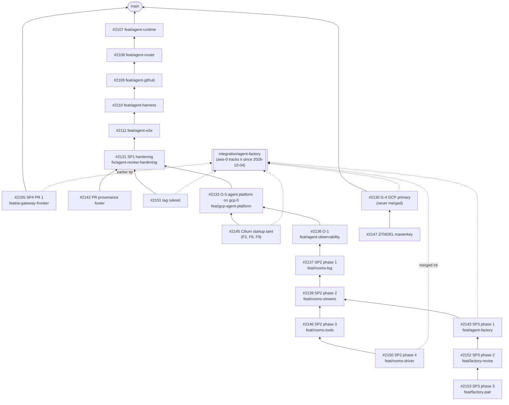

The other pages of this section describe the design. This page says how much of it exists. Each
role page links to its row here instead of repeating it.

| Area | State | Detail |
|---|---|---|
| Serving | Off by default on both clouds; four known gaps; one roadmap path shipped, six open | [Serving](#serving) |
| Agent runtime and identity | Built, reviewed, **proven live** on `aws-0` and `gcp-0` | [Runtime](#runtime) |
| Agent gateway | Agent Router 1.1.0, on `aws-0` since the 2026-10-04 flip (previously `gcp-0`); agentgateway selected, migration planned | [Agent gateway](#agent-gateway) |
| Rooms | Deployed on `aws-0` since the 2026-10-04 flip, live gates partly passed; approvals in progress | [Rooms](#rooms) |
| Factory | Phase 1 deployed on `aws-0` and **proven end to end there 2026-10-04**; phases 2–3 built | [Factory](#factory) |
| Agent observability | Deployed on `aws-0` since the 2026-10-04 flip, live gates partly passed | [Observability](#observability) |

## Serving

### Known gaps

- **`xplane-llamaguard3-1b` holds a GPU and serves no automatic traffic** —
  it runs at `min=1` but appears in no Semantic Router decision rule.
- **Gateway routing is half-migrated** — only `xplane-qwen-coder` is
  composition-owned; the other three claims still route through the
  hand-written `apps/base/ai/llm/ai-gateway-routes/route.yaml`, so adding a
  model means adding its route by hand unless the claim opts in
  (`spec.gateway.enabled: true`).
- **The Gateway API Inference Extension's endpoint picker is implemented but
  enabled on zero claims.** It is mutually exclusive with LoRA canaries, and
  the only gateway-enabled claim uses a canary.
- **No distributed tracing.** OTLP export from the AI Gateway extproc is
  written but not enabled, pending verification against VictoriaTraces.

**On `gcp-0` the umbrella stays suspended on cost and an open GPU quota, not
on missing identity**: each claim's per-claim GCP read identity *is* rendered
as of `crossplane-configuration` v0.7.2-pr35 — the version pinned here.
The first resume (2026-08-28) proved as much on a live cluster — the per-claim
`GCPWorkloadIdentity` reached Ready and the preload Job wrote the weights to
GCS — and stalled only once it reached the GPU itself: `GPUS_ALL_REGIONS` is
`0` on the project, a Google quota this repository cannot route around. See
`clusters/gcp-0-llm-platform/README.md` for the full failure-order watch list
before the next resume.

## Serving roadmap

A now-retired note in the repository, `llm-platform-future-paths`, originally
listed seven upgrade paths for evolving the platform beyond its current shape. None were
committed work — they were reference notes for when the open-weights
ecosystem, the team's needs, or the demo scope warranted the next
investment. This section carries forward only what is **still open**, checked
against the [done spec archive](https://github.com/Smana/cloud-native-ref/tree/main/docs/specs/done)
and the pinned composition source as of `2026-08-20`.


When picking one of these up, choose the path whose trigger has actually
fired, not the most ambitious one. Bigger hardware doesn't always mean
bigger value in a foundation-showcase context.


### Shipped — re-introduce InferencePool + EPP

The path that proposed gating a Gateway API Inference Extension
`InferencePool` + Endpoint Picker behind an opt-in composition field has
**shipped as SPEC-004**
(`docs/specs/done/2026-Q3/004-per-inferenceservice-inferencepool-endpoint/`).
Verified directly against the pinned KCL module: `spec.gateway.endpointPicker.enabled`
renders a per-claim InferencePool + EPP HelmRelease and swaps the
`AIGatewayRoute` base rule's backend to the InferencePool — exactly the
mechanism the roadmap entry proposed. All coding tasks in the spec's plan are
complete; only the live-cluster e2e validation tasks remain open, because the
field is **enabled on zero claims today** — it is mutually exclusive with
LoRA canaries, and the one gateway-enabled claim (`xplane-qwen-coder`) uses a
canary. Turning it on for a high-traffic model at `max ≥ 2` replicas is what
remains of this path.


A follow-on spec, `docs/specs/done/2026-Q3/011-inferencepool-saturation-keda/`,
proposes a fourth KEDA trigger reading the InferencePool's own saturation
gauge instead of the three raw vLLM metrics. It is filed under the `done`
archive, but the pinned KCL module renders only the three original triggers
— no InferencePool-gauge trigger exists in the composition source — and the
spec's own task and review checklists are almost entirely unchecked. Treat
this piece as **not shipped**, regardless of which directory it lives in.


### Still open

#### 1. Bigger coder model on the existing L4 NodePool

Swap `Qwen/Qwen2.5-Coder-7B-Instruct` for a larger MoE coder (originally
proposed: `Qwen/Qwen3-Coder-30B-A3B-Instruct` at AWQ-4bit) that still fits a
single L4's 24 GiB. The fleet still runs the 7B model today
(`apps/base/ai/llm/qwen-coder.yaml`), so this remains open.

**Trigger**: the 7B coder hitting tool-call reliability or correctness
limits in practice.

#### 2. Frontier coder on L40S in a second region

Run a full-precision 30B-class coder on a single L40S 48GB, which needs an
instance family (`g6e`) not offered in `eu-west-3`. The platform's OpenTofu
stacks are pinned to `eu-west-3` (`opentofu/aws/llm-platform/backend.tf`) with no
second-region stack, so this remains open — and would require a new
OpenTofu stack, a new Karpenter NodePool, and cross-region routing from the
AI Gateway.

**Trigger**: an AWQ-4bit quality compromise from path 1 becomes a measurable
regression, or the team wants to demo full-context work a single L4 can't
hold.

#### 3. Tensor-parallel `g6.12xlarge` (4× L4)

Run a 30B-class model with `tensor-parallel-size: 4` on a single 4-GPU
instance for full precision without a region split. The `gpu-l4` NodePool
explicitly **excludes** multi-GPU SKUs today
(`infrastructure/base/karpenter-nodepools-gpu/gpu-l4-nodepool.yaml`, by
design — a multi-GPU pod would otherwise be able to consume the entire
4-GPU fleet cap on its own), so this remains open and would require lifting
that restriction along with revisiting the cap it protects.

**Trigger**: path 1's quantized model isn't enough, and multi-region
operational cost (path 2) is the bigger problem.

#### 4. Anthropic↔OpenAI relay for Claude Code

Deploy a translator sidecar exposing Anthropic-style `/v1/messages` and
proxying to the existing OpenAI-compatible AI Gateway, so Claude Code can
target the self-hosted fleet. [Coding Clients]()
documents this as explicitly not implemented — OpenCode covers the
agentic-CLI use case today.

**Honest framing, carried forward from the original proposal**: this is a
UX win wrapped around a quality compromise. Pointing Claude Code at an
open-weights model doesn't give Sonnet/Opus output — it gives that model's
output via Claude Code's UX. Useful for sovereignty, privacy, or cost relief
on bulk tasks; not for raising agentic coding quality.

**Trigger**: paths 1 or 2 close the open-weights/frontier gap enough that
this becomes a competitive daily backend, or an explicit no-telemetry
privacy workflow is the use case.

#### 5. Heavier dense models (GLM-4.6, DeepSeek-Coder-V3)

Both require multi-GPU serving (TP=4+ or H100-class hardware) and had known
vLLM tool-call parser quirks as of the original proposal. No GPU budget for
H100/H200-class SKUs exists in this lab today, so this stays open pending
both upstream parser stabilization and a hardware budget decision.

#### 6. Per-tenant FinOps observability

Attribute token spend and cost per consumer by extracting a static
`x-tenant` request header at the gateway and labelling the existing token
counters with it. SPEC-006
(`docs/specs/done/2026-Q3/006-genai-observability-envoy-gateway/`) shipped
the gateway's `gen_ai_*` token metrics and base-vs-canary attribution — a
real prerequisite — but no `tenant` label or `x-tenant` header extraction
exists anywhere in `infrastructure/base/envoy-ai-gateway/` or the LLM
dashboards today. This path remains open on top of what SPEC-006 delivered.

**What this is not**: tenant authentication, quotas, fairness scheduling, or
rate limiting — those stay out of scope for this platform's posture.

**Trigger**: any real or simulated workload routes through the platform with
multiple addressable consumers, including using LoRA adapter names as proxy
"tenants" to demo cost attribution without standing up auth.

## Agent programme

Running on `aws-0` since the 2026-10-04 placement flip ([ADR-0055]()), from the `integration/agent-factory` branch: the runtime and identity layer, the
agent router's per-run identity and model route, rooms (log, live view, room tools, steering), the
factory's first phase (intake from a fixed template, one implementer per task, the run meter, the
stop) and the per-run observability. `gcp-0` ran the programme through the parity period and is
deployable for parity again. Running is not proven: live gates have proven the runtime and
identity layer, are partly passed for rooms and observability, and the factory's first phase has
its end-to-end walkthrough validated (see
[post-flip validation](#post-flip-live-validation-on-aws-0)) with its formal gate pending; the
room tools and steering gates have not run.
Not live yet: the reviewer pair and revise flow (built, not deployed), then approvals, `roomctl`,
Kueue, the merge gate, the keyless Anthropic models and the move to agentgateway
(planned). Per-run and fleet token budgets *are* live — validated 2026-10-04. Only the docs pages, the design documents and the repository's trust policies are on
`main`.


**Held until the owner's UX sign-off (ruling P33).** No programme PR merges, and no release is
tagged, until the whole programme is built and the owner agrees on the experience after a live
end-to-end walkthrough: label, room, request changes, approve, merge. Until then everything is
validated on `integration/agent-factory`, a never-merged branch that `aws-0` tracks since the
2026-10-04 flip (`gcp-0` before it), using
pre-release images and packages. Only designs, plans, docs and platform fixes found on the way
reach `main`.


### Runtime

**Built, proven live.** One `AgentRun` object becomes a fully isolated, fully attributed run, end
to end on both clouds: an agent took issue #2112 to PR #2114 on `aws-0`, which was merged, and
issue #2140 to PR #2141 on `gcp-0`. The gVisor pool is deployed on `gcp-0` (GKE Sandbox) and built
for `aws-0` (Karpenter). The `agent-branches` and `agent-tags` rulesets are active.

### Agent gateway

**Identity and routing built; tiers and agentgateway planned; budgets built and validated.** Agent
Router 1.1.0 runs on `aws-0` — the programme's live target since the 2026-10-04 flip (previously
`gcp-0`) — with the per-run identity and the model route. Z.ai GLM-5.3 serves `public` runs today.

| State | Note |
|---|---|
| **Validated live on `aws-0` (2026-10-04)** — per-run and fleet token budgets | A run that exceeded its 20k-token per-run budget was revoked (`BudgetExhausted`, `revoked=budget-run`, counter = 1); the fleet budget gauges serve. See [post-flip validation](#post-flip-live-validation-on-aws-0) |
| Planned — routing by tier | SP4 PR 2, not built |
| Anthropic Claude for `internal` runs, through the Anthropic API (Bedrock or Vertex optional per cloud) | ADR-0054, accepted on the programme branches; a gateway-held key, not keyless |
| Cluster, metric and log MCP reads for `internal` runs | Await a model route; `public` runs get documentation tools only |
| agentgateway replacing Agent Router | Selected 2026-10-01, see [below](#agentgateway-is-selected) |

### Rooms

**Built (log, live view, room tools, steering); approvals and `roomctl` planned.** The room broker,
its CNPG log, the bridge and the web view are deployed on `aws-0` (moved from `gcp-0` with the
2026-10-04 flip); the steering, room tools and
verdicts still await their live gate. Approvals (approval cards in the room) are in progress; fork
and `roomctl` are not started. The room web view is v1: it renders the raw event log; a
formatted chat view is a queued task.

### Factory

**Intake, run meter and stop built; triage, teams and the merge gate to come.** Phase 1 is deployed
on `aws-0` (moved from `gcp-0` with the 2026-10-04 flip), its end-to-end walkthrough validated
there on 2026-10-04 and its formal live gate (Task 1.13) pending: intake and narration from a
fixed template, one implementer
per task, the run meter and the stop ConfigMap.

| State | Pieces |
|---|---|
| Built, not deployed | The reviewer after the implementer, "Request changes" turned into a new run, `/factory retry`, the PR provenance footer |
| Planned | Triage (phase 4), teams with a tester, Kueue admission (until it lands, the factory's own caps bound concurrency), the merge gate (policy-bot and a merger App, auto-merge and rollback in shadow), the Kyverno admission policy, the stop label on a pinned control issue, RunLore findings as a trigger |
| Planned extension | A second repository; the steps it needs are on the [agents overview]() |

### Observability

**Built, live gates partly passed** (9 pass, 1 fail, 2 owner steps). Two findings touch the pages a
user reads: MCP tool calls are not yet joined to the run's trace
([F16](#live-findings-on-gcp-0)), and a successful run's `agent-run` page showed no outcome or PR
([F18](#live-findings-on-gcp-0); fixed on `integration`, deployed on gcp-0, live re-check pending).

**As of 2026-10-01**: SP1, O-1 and the first four SP2 phases are built, reviewed and running.
SP3 has three of its ten phases built. GCP parity is complete enough to host the
programme. Live gates are partly passed, with findings still open. Since 2026-10-04 the programme
runs on `aws-0`; see [post-flip validation](#post-flip-live-validation-on-aws-0).

### Where each piece stands

| Sub-project | Phases | State | PRs (cloud-native-ref) | Live evidence |
|---|---|---|---|---|
| **SP1** runtime and identity | 0–6 + hardening | Built, reviewed, **live-verified** | [#2107](https://github.com/Smana/cloud-native-ref/pull/2107) → [#2108](https://github.com/Smana/cloud-native-ref/pull/2108) → [#2109](https://github.com/Smana/cloud-native-ref/pull/2109) → [#2110](https://github.com/Smana/cloud-native-ref/pull/2110) → [#2111](https://github.com/Smana/cloud-native-ref/pull/2111) → [#2121](https://github.com/Smana/cloud-native-ref/pull/2121) (hardening), [#2142](https://github.com/Smana/cloud-native-ref/pull/2142) (PR provenance footer), [#2151](https://github.com/Smana/cloud-native-ref/pull/2151) (tag ruleset) | aws-0, 2026-09-27: an agent took issue #2112 to PR [#2114](https://github.com/Smana/cloud-native-ref/pull/2114), merged. gcp-0, 2026-10-01: the same check passed again ([#2141](https://github.com/Smana/cloud-native-ref/pull/2141)); the `agent-branches` and `agent-tags` rulesets are active |
| **SP2** rooms | 0.5 hardening, 1 log, 2 viewers, 3 tools, 4 driver | Built, reviewed, **live gates partly passed** | [#2137](https://github.com/Smana/cloud-native-ref/pull/2137) → [#2139](https://github.com/Smana/cloud-native-ref/pull/2139) → [#2146](https://github.com/Smana/cloud-native-ref/pull/2146) → [#2150](https://github.com/Smana/cloud-native-ref/pull/2150) | gcp-0, 2026-10-01: log 12 pass / 2 fail ([F12, F15](#live-findings-on-gcp-0)) / 1 owner step; viewers 3 pass / 1 fail ([F14](#live-findings-on-gcp-0)) and 6 pass / 2 blocked / 5 owner steps; phase 3: live gate 3.11 not run; driver (steering, gate 4.8): 1 pass, 5 owner steps pending |
| **SP2** rooms | 5 approvals | **In progress**: two of its tasks built and reviewed, the third under way | agent-platform [#11](https://github.com/Smana/agent-platform/pull/11); no cloud-native-ref PR yet | — |
| **SP2** rooms | 6 fork and `roomctl`, 7 UX checkpoint | Not started | — | — |
| **SP3** factory | 1 issue to narrated run, 2 revise from the PR, 3 pair template | Built and reviewed; phase 1 deployed on `aws-0` (2026-10-04 flip), end-to-end walkthrough validated there | [#2143](https://github.com/Smana/cloud-native-ref/pull/2143) → [#2152](https://github.com/Smana/cloud-native-ref/pull/2152) → [#2153](https://github.com/Smana/cloud-native-ref/pull/2153) | aws-0, 2026-10-04: an issue ran task→run→PR→close end to end ([#2199](https://github.com/Smana/cloud-native-ref/pull/2199), closed unmerged, 294,630 tokens); phase 1's formal live gate (Task 1.13) still follows SP2's |
| **SP3** factory | 4 triage and teams to 10 merge wave | Not started (Kueue arrives with phase 4) | — | — |
| **SP4** model routing and budgets | PR 1 frontier tier and shadow budgets | Built, reviewed; an earlier tip is carried on `integration` | [#2105](https://github.com/Smana/cloud-native-ref/pull/2105) | None recorded in the programme ledgers |
| **SP4** model routing and budgets | PR 2 Bedrock and per-run budgets on the agent router | Bedrock/tier routing not built; **per-run and fleet budgets validated live** | — | aws-0, 2026-10-04: a run exceeding its 20k-token budget was revoked (`BudgetExhausted`, `revoked=budget-run`, counter = 1); fleet budget gauges serve |
| **O-1** per-run observability | 1 composition, 2 platform, 3 live | Built, reviewed, **live gates partly passed** | [#2136](https://github.com/Smana/cloud-native-ref/pull/2136) | gcp-0: 9 pass / 1 fail ([F18](#live-findings-on-gcp-0)) / 2 owner steps |
| **GCP parity** | G-0 to G-3 | **Merged** to `main` | [#2122](https://github.com/Smana/cloud-native-ref/pull/2122), [#2123](https://github.com/Smana/cloud-native-ref/pull/2123), [#2125](https://github.com/Smana/cloud-native-ref/pull/2125), [#2126](https://github.com/Smana/cloud-native-ref/pull/2126) | gcp-0 rebuilt 2026-09-30 from the restored OpenBao lineage; SSO proven on Grafana, Headlamp, Flux UI, Harbor and OpenBao |
| **GCP parity** | G-4 GCP as primary cloud | Integration only, never merged; **placement reversed 2026-10-04** ([ADR-0055](../../decisions/0055-aws-primary-again.md)) | [#2130](https://github.com/Smana/cloud-native-ref/pull/2130) | `aws-0` hosts ZITADEL (`5d688376`); `gcp-0`'s instance is suspended |
| **GCP parity** | G-5 agent platform on gcp-0 | Built, reviewed, held with the programme | [#2133](https://github.com/Smana/cloud-native-ref/pull/2133) | Agent secrets synced, every agent Kustomization Ready; platform checks 6 pass / 2 fail (F1) / 4 owner steps |

Companion PRs live in two other repositories, stacked the same way:
[Smana/agent-platform](https://github.com/Smana/agent-platform/pulls) (room broker, bridge and
factory: #5–#12) and
[Smana/crossplane-configuration](https://github.com/Smana/crossplane-configuration/pulls)
(AgentRun and SQLInstance compositions: #27, #29–#35). Their pre-releases are what the
cloud-native-ref PRs pin.

### Post-flip live validation on aws-0

The placement flip of 2026-10-04 (`5d688376`, [ADR-0055]())
made `aws-0` the programme's live target again, for the SP3 validation. What was proven there on
2026-10-04/05:

| What | Evidence |
|---|---|
| Factory end to end (phase 1) | An issue ran task→run→PR→close on `aws-0`: [#2199](https://github.com/Smana/cloud-native-ref/pull/2199), closed unmerged, 294,630 tokens through the run meter. The factory's first complete autonomous cycle on the AWS lane |
| Per-run token budget | A deliberately over-budgeted run was cut off at its 20k-token cap: `BudgetExhausted`, revoked = `budget-run`, counter = 1 |
| Fleet token budget | The fleet budget gauges serve |

Two findings came out of the validation and are open against the programme:

| # | Finding | State |
|---|---|---|
| F19 | A finished run's `AgentRun` is deleted before the factory's ~80 s poll observes the terminal phase, so the task escalates as `run_unschedulable` instead of `AwaitingHuman` | Open |
| F20 | The harness's default `ConfirmRisky(confirm_unknown=true)` blocks factory runs' git pushes until SP2 5.1/5.2 (approvals) land | Open; interim: set the conversation policy `confirm_unknown=false` |

### How the PRs stack

Each PR is based on the one below it, merge-only and never rebased. Fixes land on the PR that owns
them and are merged up the chain. `integration/agent-factory` merges every head for the live
cluster.

SP3's phases 2 and 3 (#2152, #2153) wait for SP2's live gates to finish before they join
`integration`, so the room broker is not swapped mid-gate.

### Live findings on gcp-0

Found by the live gates since the gcp-0 rebuild. Platform fixes go to `main`; programme fixes ride
their PR.

| # | Finding | State |
|---|---|---|
| F1 | The OpenBao snapshot job could not read the object it uploads (missing `storage.objects.get`) | **Fixed**, merged to `main` ([#2144](https://github.com/Smana/cloud-native-ref/pull/2144)) |
| F2 | Run pods landed on a fresh gVisor node before Cilium and ran up to ~2 minutes without their network policy | **Fixed and verified live**: Cilium's startup taint on every pool ([#2145](https://github.com/Smana/cloud-native-ref/pull/2145)) |
| F3 | The `CPUS_ALL_REGIONS` quota (26 of 32) blocks `e2-standard-8` nodes | **Waiting** on a requested quota increase |
| F4 | Runbook 08's observability steps existed only in the plan | **Fixed** on `integration` |
| F5 | Crossplane never upgraded the core Configuration dependency, so the room broker failed dry-run | **Worked around live** (Configuration patched); a PR enabling dependency upgrades is a follow-up |
| F6 | GKE refuses `kubernetes.io` taint keys on ComputeClasses, which wedged `infrastructure` | **Fixed** in #2145, applied |
| F7 | The room broker's certificate had no CN, and the PKI role signed only the private domain | **Fixed** in #2150, applied; aws-0 needs the same PKI change |
| F8 | The rooms SSO client was missing on gcp-0 | **Fixed** by re-running the client sync; why the deploy's sync skipped it is a follow-up |
| F9 | `cilium-agent` was OOM-killed twice on new nodes | **Fixed and applied** in #2145 (higher requests and limits); the DaemonSet rolled on gcp-0 |
| F10 | The bridge-to-broker event stream resets every 10 s (write deadline shorter than the ping interval) | **Fixed** in agent-platform (pre-release `pr9.afb1ed73`); **re-pinned** (`0fe2c618`: agent-platform#17 at `146a759`); live re-verify pending |
| F11 | Short conversations lose their whole transcript: the harness exits before the bridge's next poll during the gVisor cold start | **Fixed** in agent-platform (pre-release `pr9.afb1ed73`); **re-pinned** (`0fe2c618`: agent-platform#17 at `146a759`); live re-verify pending |
| F12 | A deleted or evicted run pod is re-created by its Sandbox and the task restarts from scratch | **Fix in review (changes requested)**: agent-platform and crossplane-configuration [#35](https://github.com/Smana/crossplane-configuration/pull/35) (pre-release `v0.7.2-pr35.585d33b`); **re-pinned** (both lanes now `v0.7.2-pr35.85a0fae`); live re-verify pending |
| F13 | The live-gate step greps for `room_busy`, but the broker logs "room busy", so it never matches; busy refusals are not counted in a metric either | **PR open**: [#2155](https://github.com/Smana/cloud-native-ref/pull/2155) (plan text, low) |
| F14 | `cnpg-promote-seed.sh --cloud gcp` nests the seed one level too deep | **PR open**: [#2154](https://github.com/Smana/cloud-native-ref/pull/2154); recovered by hand meanwhile |
| F15 | A run refused the room lease still executes its task, unrecorded, on the shared branch, and is reported succeeded | **Fix in review (changes requested)**: same change as F12; **re-pinned** (see F12); live re-verify pending |
| F16 | MCP calls are not joined to the run's trace | Open |
| F17 | Runbook 08's GCP commands have bugs | **Fixed** on `integration` |
| F18 | `agentrun_outcome_info` is never emitted for a successful run | **Fixed** on `integration` in #2136 (adds `agentrun_pull_request_info`); live re-check pending |

One more gap closed live on 2026-10-01: the agents' GitHub App could create `refs/tags/agent/*`,
since the ruleset covered branches only. The `agent-tags` ruleset ([#2151](https://github.com/Smana/cloud-native-ref/pull/2151))
is now active.

### agentgateway is selected

**Decided 2026-10-01.** Its PoC passed on gcp-0 (P4's room-broker leg untested;
P6 on a throwaway Valkey; new gaps N1–N10 in the gap matrix), so it replaces the agent router's
Envoy AI Gateway for models, MCP and the `sts` listener; `ai-gateway` stays on Envoy Gateway and
Agent Router. An ADR superseding programme ADR-0042 and ADR-0050's Option 1 (on the programme
branches, not yet on main) for the agent router follows
([gap matrix, PoC result](https://github.com/Smana/cloud-native-ref/blob/main/docs/superpowers/specs/2026-10-01-agentgateway-gap-matrix-research.md#poc-result-2026-10-01-gcp-0)).

### Waiting on the owner

| Decision | Why it matters |
|---|---|
| UX sign-off (P33) after the end-to-end walkthrough | Unblocks the merge wave for every programme PR |
| CI on stacked PRs | Workflows run only for PRs based on `main`, so the stacked PRs get no GitHub CI; local `validate-manifests.sh` stands in |
| Rooms UX: invite and close in the UI; re-fetching a recorded run's claim | Raised for SP2's UX checkpoint |
| Factory UX: a time limit for escalated tasks | Escalated tasks poll GitHub every 5 minutes until closed |
| Owner-only live steps | Steps that need the owner's tokens or a literal write probe (for example the room log's `UPDATE` refusal) |
| Pending platform PRs to `main`: [#2132](https://github.com/Smana/cloud-native-ref/pull/2132), [#2120](https://github.com/Smana/cloud-native-ref/pull/2120), [#2154](https://github.com/Smana/cloud-native-ref/pull/2154), [#2155](https://github.com/Smana/cloud-native-ref/pull/2155) | Owner review; not merge-on-green |

## Sources

The programme's working ledgers (outside the repository) and the PRs above. Designs and plans:
[programme design](https://github.com/Smana/cloud-native-ref/blob/main/docs/superpowers/specs/2026-09-23-agent-factory-design.md),
[SP2 plan](https://github.com/Smana/cloud-native-ref/blob/main/docs/superpowers/plans/2026-09-27-agent-collaboration-rooms-plan.md),
[SP3 plan](https://github.com/Smana/cloud-native-ref/blob/main/docs/superpowers/plans/2026-09-27-agent-dark-factory-plan.md),
[O-1 plan](https://github.com/Smana/cloud-native-ref/blob/main/docs/superpowers/plans/2026-09-27-agent-observability-plan.md).
Ecosystem research: [2026-10-01 re-check](https://github.com/Smana/cloud-native-ref/blob/main/docs/superpowers/specs/2026-10-01-agent-ecosystem-recheck-research.md).
